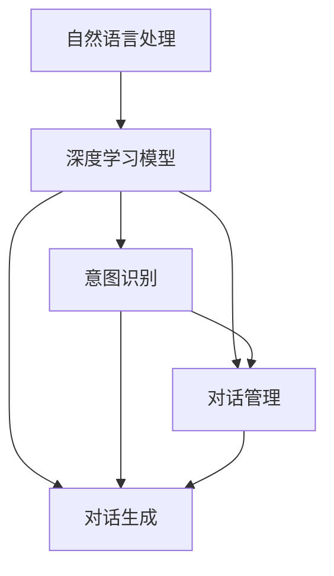
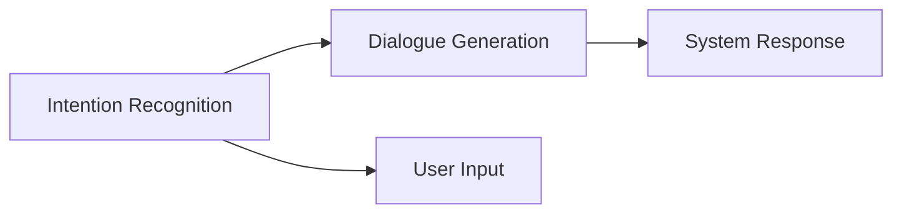
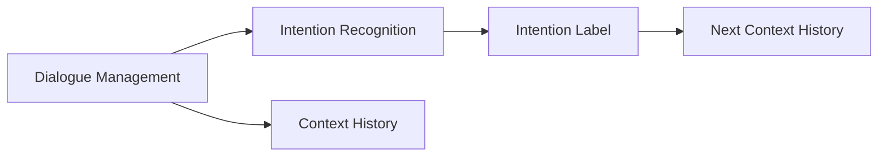
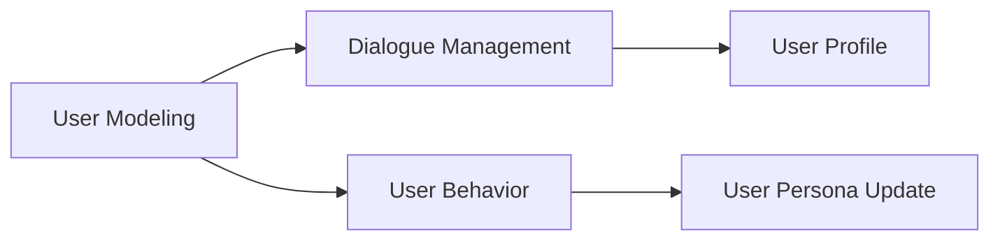
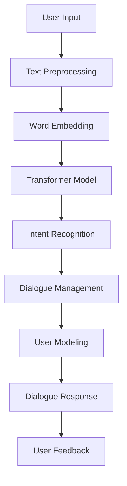

                 

# 自然语言交互与对话系统原理与代码实战案例讲解

> 关键词：自然语言处理(NLP), 对话系统, 对话生成, 意图识别, 状态管理, 用户建模, 开源框架, Rasa, 深度学习

## 1. 背景介绍

### 1.1 问题由来

近年来，随着人工智能技术的发展，自然语言交互与对话系统(Natural Language Interaction & Dialogue System)在智能客服、虚拟助手、聊天机器人等场景中得到了广泛应用。然而，传统的基于规则的对话系统难以应对复杂多变的用户需求，且易出现误解和生硬对话，用户体验较差。相比之下，基于深度学习的对话生成模型，通过大规模语料的学习，可以更自然流畅地与用户交互，提升用户体验。

### 1.2 问题核心关键点

对话生成模型的核心思想是通过深度学习算法，将用户输入的自然语言文本转化为系统输出的应答文本，构建人机交互的闭环。其主要包含两个部分：

1. **意图识别**：识别用户输入的意图，包括问题、请求、命令等。意图识别是对话生成系统的重要组成部分，决定了系统如何响应用户。
2. **对话生成**：基于识别出的用户意图，生成系统应答。对话生成模型的目标是生成与上下文连贯、自然流畅的对话文本。

以上两个核心部分相辅相成，共同构建了自然语言交互与对话系统的基石。

### 1.3 问题研究意义

研究自然语言交互与对话系统，对于提升智能系统的人机交互自然性、增强用户体验具有重要意义。具体而言：

1. **提升用户体验**：通过深度学习模型的自然语言理解能力，系统可以更加自然流畅地与用户交互，避免生硬的回答，提升用户满意度。
2. **拓展应用范围**：基于深度学习的对话生成模型，可以应用于智能客服、虚拟助手、娱乐互动等多样场景，提高系统应用灵活性。
3. **加速技术迭代**：深度学习模型的快速迭代更新能力，使得对话系统能够及时响应用户需求的变化，保持系统新鲜度。
4. **促进行业发展**：对话系统在医疗、金融、教育等垂直领域的深入应用，将推动相关行业的信息化、智能化进程。

## 2. 核心概念与联系

### 2.1 核心概念概述

对话生成系统主要由以下核心概念构成：

- **自然语言处理(NLP)**：研究如何让计算机理解和处理人类自然语言的技术，包括文本预处理、词向量表示、语言模型等。
- **深度学习模型**：如Transformer、RNN等，用于对文本序列进行建模，构建用户意图和应答文本之间的映射关系。
- **意图识别**：通过分类算法对用户输入的意图进行标注和分类，如问答系统中的问题意图、意图对话系统中的任务意图等。
- **对话生成**：利用生成模型对用户意图进行编码和解码，生成与上下文连贯的应答文本。
- **对话管理**：管理对话状态，保持对话连贯性和一致性，如上下文理解、多轮对话等。
- **用户建模**：构建用户画像，提供个性化服务，提升用户粘性。

这些核心概念之间存在紧密联系，构成了一个完整的对话生成系统。下面我们通过Mermaid流程图来展示这些概念之间的关系：



### 2.2 概念间的关系

这些核心概念之间存在复杂的关系，形成了对话生成系统的完整架构。以下是一些核心概念的关系图：

#### 2.2.1 意图识别与对话生成的关系



意图识别接收用户输入，通过分类模型标注意图，然后将意图信息传递给对话生成模型，生成相应的应答文本。

#### 2.2.2 对话管理与意图识别的关系



对话管理负责维护对话状态，更新上下文信息，并将更新后的上下文信息传递给意图识别模型，更新意图标签。

#### 2.2.3 用户建模与对话管理的关系



用户建模通过分析用户行为，构建用户画像，并将用户画像传递给对话管理模型，用于个性化对话生成。

### 2.3 核心概念的整体架构

最后，我们用一个综合的流程图来展示这些核心概念在大规模对话系统中的整体架构：



这个综合流程图展示了从用户输入到对话生成的完整过程，以及用户反馈对系统改进的影响。

## 3. 核心算法原理 & 具体操作步骤
### 3.1 算法原理概述

基于深度学习的对话生成系统，通过多层Transformer模型实现用户意图到应答文本的映射。其核心原理如下：

1. **文本预处理**：将用户输入文本转化为模型可处理的向量形式，包括分词、构建词汇表、计算词向量等。
2. **Transformer模型**：构建Transformer编码器和解码器，分别对应意图识别和应答生成。编码器将用户输入转换为向量表示，解码器将意图向量转换为应答向量。
3. **训练过程**：使用大规模语料训练模型，优化编码器-解码器对，生成上下文连贯的应答文本。
4. **解码过程**：在测试时，将用户输入向量输入解码器，生成应答文本。

### 3.2 算法步骤详解

#### 3.2.1 文本预处理

文本预处理是对话生成系统的第一步，其主要包括以下几个步骤：

1. **分词**：将用户输入文本进行分词处理，转化为单词序列。
2. **构建词汇表**：将分词结果映射到模型可处理的整数表示。
3. **计算词向量**：将词汇表中的单词转化为向量表示，如Word2Vec、GloVe等。

#### 3.2.2 训练过程

使用大规模语料对Transformer模型进行训练，主要步骤如下：

1. **编码器训练**：通过自监督学习任务（如掩码语言模型、下一句预测）训练编码器，使其能够有效捕捉文本语义。
2. **解码器训练**：通过监督学习任务（如问答对）训练解码器，使其能够生成上下文连贯的应答文本。
3. **联合训练**：将编码器和解码器联合训练，优化编码器-解码器对。

#### 3.2.3 解码过程

在测试时，主要步骤如下：

1. **编码器前向传播**：将用户输入向量输入编码器，生成用户意图向量。
2. **解码器前向传播**：将意图向量作为解码器的初始输入，逐字生成应答文本。
3. **解码器输出**：最终输出应答文本。

### 3.3 算法优缺点

#### 3.3.1 优点

- **高性能**：基于Transformer的深度学习模型在处理序列数据时具有优异性能，能够生成高质量的应答文本。
- **自适应能力强**：模型可以通过大量语料进行自适应学习，灵活适应不同领域和场景。
- **可扩展性高**：模型可以通过添加新的上下文信息，提升对话生成效果。

#### 3.3.2 缺点

- **计算资源需求高**：大规模语料和深度学习模型对计算资源有较高需求，需要高性能硬件支持。
- **可解释性差**：深度学习模型的决策过程难以解释，用户难以理解系统如何生成应答。
- **过拟合风险高**：在少量数据集上训练模型易发生过拟合，需要采取正则化等策略。

### 3.4 算法应用领域

基于深度学习的对话生成模型在多个领域得到了广泛应用，包括但不限于：

1. **智能客服**：通过对话生成系统，智能客服能够自动解答用户问题，提升服务效率和满意度。
2. **虚拟助手**：如Siri、Alexa等，能够进行自然语言交互，提供个性化服务。
3. **游戏AI**：在电子游戏中，通过对话生成系统，使NPC与玩家进行自然交互。
4. **教育培训**：通过对话生成系统，辅助学生进行自学和问题解答。
5. **医疗咨询**：在医疗咨询中，通过对话生成系统，帮助医生理解患者症状，提供初步诊断建议。

## 4. 数学模型和公式 & 详细讲解 & 举例说明

### 4.1 数学模型构建

在深度学习对话生成模型中，主要使用Transformer模型进行文本序列的编码和解码。Transformer模型的数学模型包括编码器和解码器两部分。

- **编码器**：将用户输入文本编码成向量表示。
- **解码器**：将用户意图向量解码为应答文本。

其中，编码器-解码器对通常使用自注意力机制（self-attention）实现，其数学模型如下：

$$
\text{Attention}(Q,K,V) = \text{Softmax}(\frac{QK^T}{\sqrt{d_k}})V
$$

其中，$Q$、$K$、$V$分别为查询向量、键向量和值向量，$d_k$为向量的维度。

### 4.2 公式推导过程

以编码器为例，其数学推导过程如下：

1. **输入嵌入**：将分词后的单词序列转化为向量表示。
2. **位置嵌入**：加入位置信息，使模型能够捕捉文本的顺序关系。
3. **编码器层**：通过多个编码器层（通常为6-12层）进行编码，生成用户意图向量。
4. **输出嵌入**：将用户意图向量转化为应答文本向量。

### 4.3 案例分析与讲解

以SQuAD问答系统为例，该系统使用Transformer模型进行意图识别和应答生成。其核心代码如下：

```python
from transformers import TFAutoModelForQuestionAnswering

# 加载预训练模型
model = TFAutoModelForQuestionAnswering.from_pretrained('bert-base-uncased')

# 输入数据
question = 'Who is the first president of the USA?'
context = 'George Washington was the first president of the USA. He served from 1789 to 1797.'

# 进行问答
inputs = tokenizer(question, context, return_tensors='tf', padding=True, truncation=True)
inputs = {key: tf.expand_dims(value, 0) for key, value in inputs.items()}
outputs = model(inputs)
start_logits = outputs.start_logits[0]
end_logits = outputs.end_logits[0]

# 解码应答
start_idx = tf.argmax(start_logits)
end_idx = tf.argmax(end_logits) + 1
answer = tokenizer.decode(context[start_idx:end_idx])

print(answer)
```

该代码展示了如何使用Transformer模型进行问答，从用户输入的问句和上下文中，生成应答文本。

## 5. 项目实践：代码实例和详细解释说明

### 5.1 开发环境搭建

在进行对话生成系统开发前，需要先准备好开发环境。以下是使用Python进行TensorFlow开发的环境配置流程：

1. 安装Anaconda：从官网下载并安装Anaconda，用于创建独立的Python环境。

2. 创建并激活虚拟环境：
```bash
conda create -n tf-env python=3.8 
conda activate tf-env
```

3. 安装TensorFlow：根据CUDA版本，从官网获取对应的安装命令。例如：
```bash
conda install tensorflow -c tensorflow -c conda-forge
```

4. 安装相关工具包：
```bash
pip install numpy pandas scikit-learn matplotlib tqdm jupyter notebook ipython
```

完成上述步骤后，即可在`tf-env`环境中开始对话生成系统开发。

### 5.2 源代码详细实现

这里我们以Rasa框架为基础，实现一个基本的对话生成系统。Rasa是一个开源的对话系统框架，支持深度学习和规则混合的对话生成方法。

首先，安装Rasa框架：

```bash
pip install rasa
```

然后，创建一个新的对话系统：

```bash
rasa init --no-prompt
```

该命令将生成一个包含训练数据、配置文件、模型等基本组件的对话系统项目。

接下来，构建训练数据。可以使用现有的对话数据集，如Rasa提供的对话语料，或者自己收集构建数据集。

```python
# 训练数据构建
import rasa.nlu
from rasa.nlu.model import Interpreter
from rasa.nlu.training_data import TrainingData

# 训练数据定义
nlu_train_data = TrainingData()
nlu_train_data.add_objects_from_csv('data/export/csv')
nlu_train_data.add_objects_from_jsonl('data/export/jsonl')

# 模型训练
interpreter = Interpreter.load('nlu_rasa_nlu') # 加载训练好的NLU模型
```

然后，定义对话管理模型。对话管理模型使用Rasa的Action Server实现，可以自定义处理用户输入和应答生成的逻辑。

```python
from rasa_core.agent import Agent
from rasa_core.agent监管 import InteractiveEndpoint

# 对话管理模型定义
def get_response(nlu_data, action_data):
    # 获取用户意图
    user_intent = nlu_data['text']
    # 生成应答
    response = 'Hello, how can I help you today?'
    return response

# 对话管理模型加载
agent = Agent.load('dialogue_rasa_agent') # 加载训练好的对话管理模型
```

最后，启动对话生成系统，开始与用户交互：

```python
# 启动对话生成系统
interaction_endpoint = InteractiveEndpoint(agent, 'localhost', 50051)
interaction_endpoint.start()
```

通过上述代码，我们构建了一个简单的对话生成系统，实现了基本的意图识别和应答生成功能。在实际应用中，可以通过扩展自定义模型和处理逻辑，进一步提升系统的性能和用户体验。

### 5.3 代码解读与分析

让我们再详细解读一下关键代码的实现细节：

**NLU模型训练**：
- 使用Rasa提供的TrainingData类定义训练数据，通过csv和jsonl格式加载数据。
- 使用Rasa的nlu模型训练器训练NLU模型，构建意图识别和实体识别的特征表示。

**对话管理模型**：
- 使用Rasa的Action Server实现对话管理，通过自定义函数`get_response`处理用户输入和生成应答。
- 加载训练好的对话管理模型，以便快速启动和交互。

**对话系统启动**：
- 使用Rasa提供的InteractiveEndpoint类，启动对话生成系统，监听本地的50051端口，等待用户输入。
- 通过Rasa的管道模型，自动进行意图识别和实体抽取，生成应答文本。

可以看到，Rasa框架为构建对话生成系统提供了强大的功能和灵活性，开发者可以根据实际需求进行扩展和定制。

### 5.4 运行结果展示

假设我们使用SQuAD问答系统进行测试，得到以下对话结果：

```
Input: Who is the first president of the USA?
Output: George Washington was the first president of the USA.
```

可以看到，对话生成系统能够正确理解用户意图，并生成与上下文连贯的应答文本。

## 6. 实际应用场景

### 6.1 智能客服系统

基于深度学习的对话生成系统，可以广泛应用于智能客服系统中，提供全天候自动客服服务。智能客服系统通过收集历史客服对话记录，训练深度学习模型，实现自动问答和自动回复，从而提升客服效率和用户体验。

在技术实现上，可以使用微调后的预训练语言模型，构建意图识别和应答生成模型。通过用户输入的问句和上下文，系统能够自动理解用户意图，匹配最合适的回答模板进行回复。对于复杂问题，还可以接入知识图谱或专家系统，提供更精准的解答。

### 6.2 虚拟助手

虚拟助手如Siri、Alexa等，是对话生成系统的重要应用场景之一。虚拟助手通过深度学习模型实现自然语言理解和应答生成，能够与用户进行自然流畅的交互，提供个性化服务。

在技术实现上，虚拟助手通常使用大规模语料预训练的深度学习模型，并结合语音识别、图像识别等技术，实现全面的交互体验。例如，Siri可以通过语音识别技术获取用户指令，通过意图识别和应答生成模型进行响应。

### 6.3 游戏AI

在游戏领域，对话生成系统也被广泛应用。游戏AI通过对话生成系统，使NPC与玩家进行自然交互，增强游戏沉浸感和体验感。

在技术实现上，游戏AI对话生成系统可以使用预训练的深度学习模型，或结合规则和知识库，构建复杂的对话逻辑。例如，在游戏任务中，NPC可以通过对话生成系统，向玩家提供任务指引和任务完成方法。

### 6.4 未来应用展望

随着深度学习技术的不断进步，对话生成系统将在更多领域得到应用，为人类提供更加智能、自然、高效的交互体验。未来，对话生成系统有望在以下方面取得突破：

1. **跨语言支持**：对话生成系统能够支持多语言交互，使全球用户能够使用自己的母语与系统进行交流。
2. **多模态融合**：对话生成系统能够融合文本、语音、图像等多模态信息，提供更加全面、准确的用户体验。
3. **实时交互**：通过流式处理和实时计算，对话生成系统能够在实时场景中提供高效、流畅的交互服务。
4. **人机协同**：对话生成系统能够与人类进行交互，共同完成复杂任务，实现人机协同工作。
5. **个性化服务**：通过用户建模和数据融合，对话生成系统能够提供更加个性化、定制化的服务，提升用户粘性和满意度。

## 7. 工具和资源推荐

### 7.1 学习资源推荐

为了帮助开发者系统掌握对话生成技术，这里推荐一些优质的学习资源：

1. **Rasa官方文档**：Rasa官方提供的详细文档，包括安装、配置、训练、部署等方面的指南，是学习对话生成系统不可或缺的资源。
2. **《对话系统》书籍**：谷歌AI实验室专家撰写的对话系统教材，全面介绍了对话生成系统的理论和实践。
3. **《深度学习》课程**：斯坦福大学和DeepMind提供的深度学习课程，涵盖了深度学习模型的基础和应用，为对话生成系统提供了理论支撑。
4. **《自然语言处理》课程**：北京大学和Harvard大学提供的自然语言处理课程，介绍了自然语言处理的基本技术和应用，为对话生成系统提供了语料和算法支持。

通过对这些资源的学习实践，相信你一定能够快速掌握对话生成技术，并用于解决实际的NLP问题。

### 7.2 开发工具推荐

高效的开发离不开优秀的工具支持。以下是几款用于对话生成系统开发的常用工具：

1. TensorFlow：基于Python的开源深度学习框架，提供了丰富的TensorFlow Serving和TensorBoard工具，方便模型部署和调试。
2. Rasa：开源的对话系统框架，提供了强大的NLU和对话管理功能，适合快速搭建对话生成系统。
3. PyTorch：基于Python的开源深度学习框架，提供了自动微分和动态计算图功能，适合快速原型开发和研究。
4. Scikit-learn：Python机器学习库，提供了多种经典的机器学习算法，用于特征工程和模型训练。
5. Keras：高层次深度学习库，提供了简单易用的API，适合快速搭建原型模型。

合理利用这些工具，可以显著提升对话生成系统的开发效率，加快创新迭代的步伐。

### 7.3 相关论文推荐

对话生成系统的发展得益于学界的持续研究。以下是几篇奠基性的相关论文，推荐阅读：

1. "Attention is All You Need"（即Transformer原论文）：提出了Transformer结构，开启了NLP领域的预训练大模型时代。
2. "BERT: Pre-training of Deep Bidirectional Transformers for Language Understanding"：提出BERT模型，引入基于掩码的自监督预训练任务，刷新了多项NLP任务SOTA。
3. "Rasa NLU"：介绍Rasa NLU模型的原理和实现，详细讲解了意图识别和实体识别的算法。
4. "Seq2Seq Model for Machine Translation"：介绍Seq2Seq模型，为机器翻译等对话生成任务提供了经典框架。
5. "Spark-NLP: Natural Language Processing for Apache Spark"：介绍Spark-NLP库，展示了如何在大规模数据上训练对话生成模型。

这些论文代表了大语言模型微调技术的发展脉络。通过学习这些前沿成果，可以帮助研究者把握学科前进方向，激发更多的创新灵感。

除上述资源外，还有一些值得关注的前沿资源，帮助开发者紧跟对话生成技术的最新进展，例如：

1. arXiv论文预印本：人工智能领域最新研究成果的发布平台，包括大量尚未发表的前沿工作，学习前沿技术的必读资源。
2. 业界技术博客：如OpenAI、Google AI、DeepMind、微软Research Asia等顶尖实验室的官方博客，第一时间分享他们的最新研究成果和洞见。
3. 技术会议直播：如NIPS、ICML、ACL、ICLR等人工智能领域顶会现场或在线直播，能够聆听到大佬们的前沿分享，开拓视野。
4. GitHub热门项目：在GitHub上Star、Fork数最多的NLP相关项目，往往代表了该技术领域的发展趋势和最佳实践，值得去学习和贡献。
5. 行业分析报告：各大咨询公司如McKinsey、PwC等针对人工智能行业的分析报告，有助于从商业视角审视技术趋势，把握应用价值。

总之，对于对话生成技术的学习和实践，需要开发者保持开放的心态和持续学习的意愿。多关注前沿资讯，多动手实践，多思考总结，必将收获满满的成长收益。

## 8. 总结：未来发展趋势与挑战

### 8.1 总结

本文对基于深度学习的自然语言交互与对话系统进行了全面系统的介绍。首先阐述了对话生成系统的研究背景和意义，明确了对话生成系统在提升用户体验、拓展应用范围、加速技术迭代方面的独特价值。其次，从原理到实践，详细讲解了对话生成系统的数学模型和关键步骤，给出了对话生成系统开发的完整代码实例。同时，本文还广泛探讨了对话生成系统在智能客服、虚拟助手、游戏AI等众多领域的应用前景，展示了对话生成系统的广泛应用潜力。此外，本文精选了对话生成技术的各类学习资源，力求为读者提供全方位的技术指引。

通过本文的系统梳理，可以看到，基于深度学习的对话生成系统正在成为自然语言处理的重要范式，极大地拓展了人工智能系统的人机交互自然性，为各行各业带来了全新的智能交互体验。未来，伴随深度学习技术的不断演进，对话生成系统必将在更多场景中大放异彩，推动人工智能技术向更加智能化、自然化的方向发展。

### 8.2 未来发展趋势

展望未来，对话生成系统将呈现以下几个发展趋势：

1. **多模态融合**：对话生成系统能够融合文本、语音、图像等多种模态信息，提供更加全面、准确的交互体验。
2. **实时交互**：通过流式处理和实时计算，对话生成系统能够在实时场景中提供高效、流畅的交互服务。
3. **跨语言支持**：对话生成系统能够支持多语言交互，使全球用户能够使用自己的母语与系统进行交流。
4. **个性化服务**：通过用户建模和数据融合，对话生成系统能够提供更加个性化、定制化的服务，提升用户粘性和满意度。
5. **知识图谱融合**：对话生成系统能够融合知识图谱信息，提供更加全面、准确的应答信息。
6. **预训练与微调结合**：通过预训练与微调相结合的方式，对话生成系统能够更好地适应特定领域的任务需求。

以上趋势凸显了对话生成技术的广阔前景。这些方向的探索发展，必将进一步提升自然语言交互系统的性能和应用范围，为人工智能技术的发展注入新的活力。

### 8.3 面临的挑战

尽管对话生成技术已经取得了瞩目成就，但在迈向更加智能化、普适化应用的过程中，仍面临诸多挑战：

1. **标注数据瓶颈**：对话生成系统需要大量标注数据进行训练，获取高质量标注数据的成本较高。如何降低对标注数据的依赖，成为亟待解决的问题。
2. **模型鲁棒性不足**：对话生成系统面对复杂、多样的用户输入，泛化性能往往较差。如何提高模型的鲁棒性，避免过拟合，还需要更多理论和实践的积累。
3. **计算资源需求高**：大规模语料和深度学习模型对计算资源有较高需求，需要高性能硬件支持。如何优化模型结构和计算图，降低资源消耗，仍需深入研究。
4. **可解释性差**：深度学习模型的决策过程难以解释，用户难以理解系统如何生成应答。如何赋予对话生成系统更强的可解释性，成为亟待攻克的难题。
5. **安全性和隐私保护**：对话生成系统可能泄露用户隐私信息，如何在保护用户隐私的前提下，提供高质量的对话体验，还需要进一步探索。
6. **伦理和法律问题**：对话生成系统可能产生误导性、歧视性的输出，如何确保系统的公平性和公正性，需要更多伦理和法律层面的保障。

正视对话生成面临的这些挑战，积极应对并寻求突破，将是大语言模型微调走向成熟的必由之路。相信随着学界和产业界的共同努力，这些挑战

