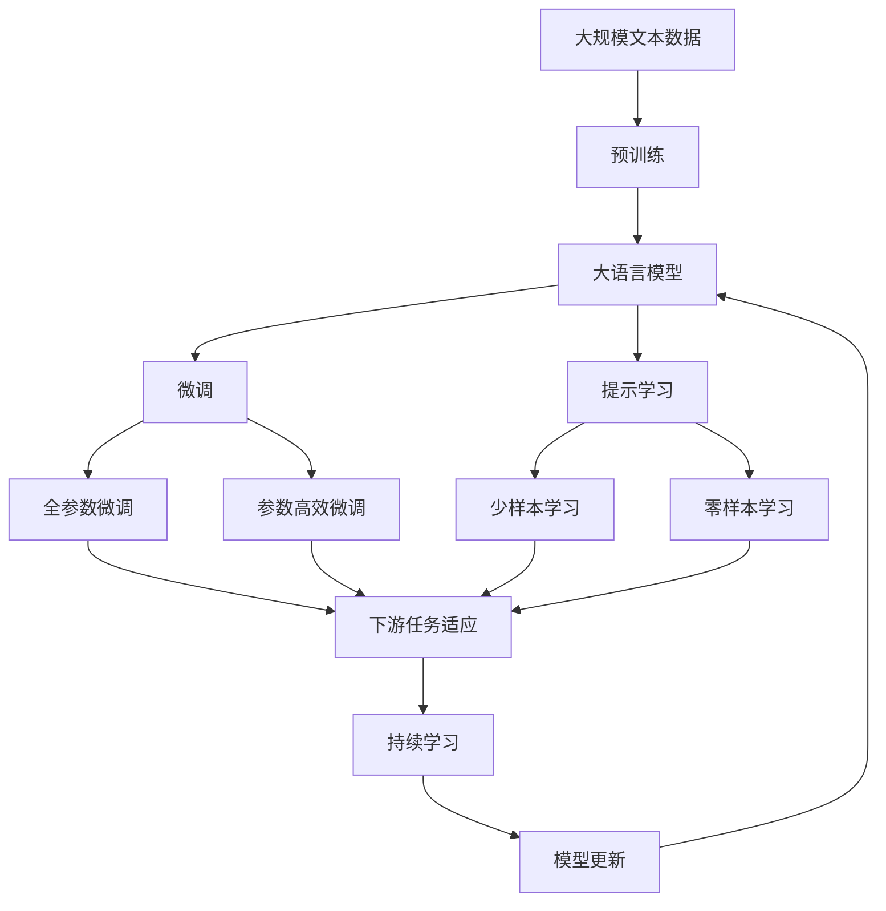

                 

# 自然语言交互在CUI中的优势

> 关键词：自然语言处理(NLP), 交互界面(UI), 用户界面(UI), 计算机用户界面(CUI), 聊天机器人, 自然语言理解(NLU), 自然语言生成(NLG)

## 1. 背景介绍

### 1.1 问题由来

随着移动互联网和智能设备的普及，用户对于计算机用户界面(CUI)提出了更高的要求。传统的文本界面和图形界面虽然直观易用，但在复杂的任务和大量的数据处理方面显得力不从心。自然语言交互作为一种新的CUI形式，通过语音、文本等方式，使得用户与计算机之间的沟通更加自然流畅，极大地提高了效率和便利性。

### 1.2 问题核心关键点

自然语言交互的核心在于将用户的自然语言输入转换为计算机可以理解的形式，并输出相应的结果或命令。这一过程涉及自然语言理解(NLU)和自然语言生成(NLG)两大环节，是自然语言处理(NLP)技术的核心应用。

自然语言交互的优势主要体现在以下几个方面：

1. **自然性**：自然语言交互允许用户用自然语言表达需求，无需记忆复杂的命令和操作路径，降低了使用门槛。
2. **交互效率**：通过自然语言处理技术，可以快速响应用户的请求，显著提升任务处理速度。
3. **跨语言支持**：自然语言交互系统可以支持多语言输入输出，拓展了用户群体的国际边界。
4. **多模态融合**：可以融合视觉、听觉等多种模态信息，提供更加丰富、沉浸的用户体验。
5. **用户友好**：对于视力、听力等身体障碍的用户，自然语言交互提供了更好的支持。

### 1.3 问题研究意义

自然语言交互技术的发展，对于提升CUI的友好性、拓展人机交互边界、推动智能化应用的普及具有重要意义：

1. **用户体验提升**：自然语言交互提升了用户与计算机互动的便利性和效率，增强了用户对技术的依存度和满意度。
2. **应用场景拓展**：广泛应用于智能家居、车载导航、智能客服等领域，大大拓宽了计算机技术的实际应用范围。
3. **创新驱动**：促进了NLP技术的发展，催生了新的研究领域和创新点，如情感分析、意图识别等。
4. **社会影响**：改变了人们获取信息、完成任务的方式，对社会生产力和生活方式产生了深远影响。

## 2. 核心概念与联系

### 2.1 核心概念概述

为了更好地理解自然语言交互的核心概念及其应用，本节将介绍几个关键概念：

- **自然语言处理(NLP)**：涉及语言模型、文本分析、语音识别、机器翻译等多个子领域，旨在实现计算机对自然语言的理解和生成。
- **自然语言理解(NLU)**：通过分析和理解自然语言文本或语音，提取出其中的语义信息，如实体、关系、意图等。
- **自然语言生成(NLG)**：将计算机处理的信息转换为自然语言文本或语音，实现对用户的自然语言回应。
- **计算机用户界面(CUI)**：包括文本界面、图形界面、语音界面等多种形式，支持用户与计算机进行信息交互。
- **聊天机器人**：一种基于自然语言交互技术的人工智能应用，可进行实时对话，解答用户问题。

这些概念共同构成了自然语言交互的基础框架，使得计算机能够通过自然语言与用户进行高效、友好的沟通。

### 2.2 概念间的关系

这些核心概念之间存在着紧密的联系，形成了自然语言交互的整体生态系统。以下是一个简单的Mermaid流程图，展示这些概念之间的关系：

```mermaid
graph TB
    A[自然语言处理(NLP)] --> B[自然语言理解(NLU)]
    A --> C[自然语言生成(NLG)]
    B --> D[聊天机器人]
    C --> D
    D --> E[计算机用户界面(CUI)]
```

这个流程图展示了大语言模型微调的各个关键概念及其之间的关系：

1. 自然语言处理(NLP)涉及语言模型、文本分析等多个子领域。
2. 自然语言理解(NLU)通过分析和理解自然语言文本或语音，提取语义信息。
3. 自然语言生成(NLG)将计算机处理的信息转换为自然语言文本或语音，实现对用户的自然语言回应。
4. 聊天机器人基于自然语言交互技术，可进行实时对话，解答用户问题。
5. 计算机用户界面(CUI)包括文本界面、图形界面、语音界面等多种形式，支持用户与计算机进行信息交互。

这些概念共同构成了自然语言交互的完整生态系统，使得计算机能够通过自然语言与用户进行高效、友好的沟通。

### 2.3 核心概念的整体架构

最后，我们用一个综合的流程图来展示这些核心概念在大语言模型微调过程中的整体架构：



这个综合流程图展示了从预训练到微调，再到持续学习的完整过程。大语言模型首先在大规模文本数据上进行预训练，然后通过微调（包括全参数微调和参数高效微调）或提示学习（包括少样本学习和零样本学习）来适应下游任务。最后，通过持续学习技术，模型可以不断学习新知识，同时避免遗忘旧知识。

## 3. 核心算法原理 & 具体操作步骤
### 3.1 算法原理概述

自然语言交互的核心算法基于自然语言处理(NLP)技术，主要涉及自然语言理解(NLU)和自然语言生成(NLG)两大环节。以下是这两大环节的算法原理概述：

**自然语言理解(NLU)**：
1. **分词**：将自然语言文本分割成词汇单元。
2. **词性标注**：为每个词汇单元标注其词性，如名词、动词、形容词等。
3. **命名实体识别**：识别文本中的专有名词、地点、组织等实体，并进行分类。
4. **依存句法分析**：分析句子中单词之间的依存关系，构建句法树。
5. **语义分析**：通过上下文理解句子的语义，识别关键词、主题等。

**自然语言生成(NLG)**：
1. **语法生成**：根据语义信息，生成符合语法规则的句子结构。
2. **词汇生成**：根据语法结构和语义信息，选择恰当的词汇填充句子。
3. **语言模型**：利用统计语言模型或神经网络模型，预测下一个词汇。
4. **对话管理**：根据对话历史和当前输入，选择最合适的回应。

### 3.2 算法步骤详解

自然语言交互的算法步骤主要包括以下几个关键步骤：

**Step 1: 数据预处理**
- 收集标注数据：从自然语言交互任务中收集标注数据，如对话、文本摘要、问答对等。
- 数据清洗：去除噪声、清洗异常数据，确保数据质量和一致性。

**Step 2: 特征提取**
- 分词和词性标注：对文本进行分词和词性标注，提取词汇特征。
- 命名实体识别：识别文本中的实体，提取实体特征。
- 句法分析：分析句子结构，提取句法特征。

**Step 3: 模型训练**
- 选择模型架构：如RNN、LSTM、GRU等，选择适合任务需求的模型。
- 损失函数设计：根据任务需求，选择合适的损失函数，如交叉熵损失、BLEU分数等。
- 训练和优化：使用优化算法（如Adam、SGD等），最小化损失函数，训练模型。

**Step 4: 模型评估**
- 数据集划分：将数据集划分为训练集、验证集和测试集。
- 模型评估：在测试集上评估模型性能，如BLEU分数、ROUGE分数等。
- 超参数调优：根据评估结果，调整模型超参数，优化模型性能。

**Step 5: 模型部署**
- 模型保存：将训练好的模型保存为文件或数据库，便于后续使用。
- 接口开发：将模型封装为API接口，便于应用系统调用。
- 系统集成：将模型集成到自然语言交互系统中，实现功能扩展。

### 3.3 算法优缺点

自然语言交互的算法具有以下优点：
1. **自然性和易用性**：用户可以通过自然语言与计算机进行交互，无需记忆复杂命令，降低了使用门槛。
2. **交互效率高**：通过自然语言处理技术，可以快速响应用户请求，提高任务处理速度。
3. **多语言支持**：自然语言交互系统支持多语言输入输出，拓展了用户群体。
4. **多模态融合**：可以融合视觉、听觉等多种模态信息，提供更丰富、沉浸的用户体验。

然而，自然语言交互也存在一些缺点：
1. **依赖数据质量**：自然语言交互系统的性能高度依赖于标注数据的质量，数据质量不佳会导致模型效果差。
2. **语言多样性挑战**：不同语言、方言和口音可能带来复杂的处理难度，影响模型性能。
3. **上下文理解难**：自然语言交互系统需要理解复杂的上下文信息，处理歧义、隐喻等问题，难度较大。
4. **技术复杂性高**：自然语言交互涉及多个子领域，技术复杂度高，需要跨学科的知识和技能。

### 3.4 算法应用领域

自然语言交互技术已经广泛应用于多个领域，具体应用领域包括：

- **智能客服**：通过自然语言交互技术，构建智能客服系统，提升客户服务效率和质量。
- **语音助手**：如Siri、Google Assistant等，通过语音交互，提供信息查询、任务执行等功能。
- **车载导航**：利用自然语言交互技术，构建车载导航系统，提高驾驶便利性和安全性。
- **智能家居**：通过自然语言交互，控制智能家居设备，提升生活便利性。
- **金融咨询**：通过自然语言交互，提供金融产品咨询、交易建议等服务。
- **医疗咨询**：通过自然语言交互，提供医疗咨询、健康管理等服务。
- **教育培训**：通过自然语言交互，提供个性化学习、智能辅导等功能。

以上仅是自然语言交互技术的一部分应用领域，随着技术的不断进步，其在更多领域的应用前景将更加广阔。

## 4. 数学模型和公式 & 详细讲解  
### 4.1 数学模型构建

自然语言交互的数学模型主要基于深度学习，涉及多个子领域，如语言模型、文本分类、情感分析等。以下是其中几个关键模型的数学模型构建：

**语言模型**：
假设输入文本由 $x_1, x_2, ..., x_n$ 组成，每个单词的概率分布为 $P(x_i|x_{<i})$，则条件概率模型可以表示为：

$$
P(x_1, x_2, ..., x_n) = \prod_{i=1}^n P(x_i|x_{<i})
$$

其中，$P(x_i|x_{<i})$ 为单词 $x_i$ 在给定上下文 $x_{<i}$ 下的条件概率分布。

**文本分类**：
假设输入文本为 $x$，分类标签为 $y$，则文本分类模型的目标是最小化交叉熵损失函数：

$$
\mathcal{L} = -\frac{1}{N} \sum_{i=1}^N [y_i \log P(y_i|x_i) + (1-y_i) \log P(1-y_i|x_i)]
$$

其中，$P(y_i|x_i)$ 为文本 $x_i$ 属于标签 $y_i$ 的概率。

**情感分析**：
假设输入文本为 $x$，情感分类标签为 $y$，则情感分析模型的目标是最小化交叉熵损失函数：

$$
\mathcal{L} = -\frac{1}{N} \sum_{i=1}^N [y_i \log P(y_i|x_i) + (1-y_i) \log P(1-y_i|x_i)]
$$

其中，$P(y_i|x_i)$ 为文本 $x_i$ 属于情感标签 $y_i$ 的概率。

### 4.2 公式推导过程

以下是几个关键模型的公式推导过程：

**语言模型**：
语言模型可以表示为条件概率的乘积，例如：

$$
P(x_1, x_2, ..., x_n) = P(x_1)P(x_2|x_1)P(x_3|x_1x_2)P(x_4|x_1x_2x_3)...
$$

在实际应用中，通常使用基于神经网络的模型，如LSTM、GRU等，来估计每个单词的条件概率分布。例如，使用LSTM模型时，可以将每个单词表示为一个向量，通过神经网络计算其条件概率分布。

**文本分类**：
文本分类模型通常使用卷积神经网络或循环神经网络，将文本转换为向量表示，再通过全连接层进行分类。以LSTM为例，模型结构如图：


其中，$A$ 为输入文本，$B$ 为嵌入层，$C$ 为LSTM层，$D$ 为池化层，$E$ 为全连接层，$F$ 为输出层，输出结果为文本的分类标签。

**情感分析**：
情感分析模型与文本分类模型类似，不同之处在于输出层使用Softmax函数来预测情感分类标签。以LSTM为例，模型结构如图：


其中，$A$ 为输入文本，$B$ 为嵌入层，$C$ 为LSTM层，$D$ 为池化层，$E$ 为全连接层，$F$ 为输出层，输出结果为文本的情感分类标签。

### 4.3 案例分析与讲解

**情感分析案例**：
假设我们有一个电影评论文本数据集，每个评论包含一个情感标签，如正面、负面、中性等。我们的目标是最小化交叉熵损失函数，训练一个情感分析模型。

- **数据预处理**：将电影评论文本进行分词和清洗，去除噪声和停用词，将文本转换为向量表示。
- **模型构建**：使用LSTM模型，将文本转换为向量表示，再通过全连接层和Softmax函数进行分类。
- **模型训练**：使用交叉熵损失函数，最小化模型预测与真实标签之间的差距，训练模型。
- **模型评估**：在测试集上评估模型性能，如BLEU分数、ROUGE分数等。

**对话管理案例**：
假设我们有一个聊天机器人系统，目标是根据用户输入生成最合适的回复。我们的任务是设计一个对话管理模型，最小化预测回复与真实回复之间的差距。

- **数据预处理**：将对话数据集进行分词和清洗，去除噪声和停用词，将对话转换为向量表示。
- **模型构建**：使用Transformer模型，将用户输入和上下文向量进行编码，再通过解码器生成回复。
- **模型训练**：使用交叉熵损失函数，最小化模型预测与真实回复之间的差距，训练模型。
- **模型评估**：在测试集上评估模型性能，如BLEU分数、ROUGE分数等。

## 5. 项目实践：代码实例和详细解释说明
### 5.1 开发环境搭建

在进行自然语言交互的实践前，我们需要准备好开发环境。以下是使用Python进行PyTorch开发的环境配置流程：

1. 安装Anaconda：从官网下载并安装Anaconda，用于创建独立的Python环境。

2. 创建并激活虚拟环境：
```bash
conda create -n pytorch-env python=3.8 
conda activate pytorch-env
```

3. 安装PyTorch：根据CUDA版本，从官网获取对应的安装命令。例如：
```bash
conda install pytorch torchvision torchaudio cudatoolkit=11.1 -c pytorch -c conda-forge
```

4. 安装Transformers库：
```bash
pip install transformers
```

5. 安装各类工具包：
```bash
pip install numpy pandas scikit-learn matplotlib tqdm jupyter notebook ipython
```

完成上述步骤后，即可在`pytorch-env`环境中开始自然语言交互的实践。

### 5.2 源代码详细实现

这里我们以情感分析为例，给出使用Transformers库对BERT模型进行情感分析的PyTorch代码实现。

首先，定义数据处理函数：

```python
from transformers import BertTokenizer
from torch.utils.data import Dataset
import torch

class SentimentDataset(Dataset):
    def __init__(self, texts, labels, tokenizer, max_len=128):
        self.texts = texts
        self.labels = labels
        self.tokenizer = tokenizer
        self.max_len = max_len
        
    def __len__(self):
        return len(self.texts)
    
    def __getitem__(self, item):
        text = self.texts[item]
        label = self.labels[item]
        
        encoding = self.tokenizer(text, return_tensors='pt', max_length=self.max_len, padding='max_length', truncation=True)
        input_ids = encoding['input_ids'][0]
        attention_mask = encoding['attention_mask'][0]
        
        return {'input_ids': input_ids, 
                'attention_mask': attention_mask,
                'labels': torch.tensor(label, dtype=torch.long)}
```

然后，定义模型和优化器：

```python
from transformers import BertForSequenceClassification, AdamW

model = BertForSequenceClassification.from_pretrained('bert-base-cased', num_labels=3)

optimizer = AdamW(model.parameters(), lr=2e-5)
```

接着，定义训练和评估函数：

```python
from torch.utils.data import DataLoader
from tqdm import tqdm
from sklearn.metrics import classification_report

device = torch.device('cuda') if torch.cuda.is_available() else torch.device('cpu')
model.to(device)

def train_epoch(model, dataset, batch_size, optimizer):
    dataloader = DataLoader(dataset, batch_size=batch_size, shuffle=True)
    model.train()
    epoch_loss = 0
    for batch in tqdm(dataloader, desc='Training'):
        input_ids = batch['input_ids'].to(device)
        attention_mask = batch['attention_mask'].to(device)
        labels = batch['labels'].to(device)
        model.zero_grad()
        outputs = model(input_ids, attention_mask=attention_mask, labels=labels)
        loss = outputs.loss
        epoch_loss += loss.item()
        loss.backward()
        optimizer.step()
    return epoch_loss / len(dataloader)

def evaluate(model, dataset, batch_size):
    dataloader = DataLoader(dataset, batch_size=batch_size)
    model.eval()
    preds, labels = [], []
    with torch.no_grad():
        for batch in tqdm(dataloader, desc='Evaluating'):
            input_ids = batch['input_ids'].to(device)
            attention_mask = batch['attention_mask'].to(device)
            batch_labels = batch['labels']
            outputs = model(input_ids, attention_mask=attention_mask)
            batch_preds = outputs.logits.argmax(dim=2).to('cpu').tolist()
            batch_labels = batch_labels.to('cpu').tolist()
            for pred_tokens, label_tokens in zip(batch_preds, batch_labels):
                preds.append(pred_tokens[:len(label_tokens)])
                labels.append(label_tokens)
                
    print(classification_report(labels, preds))
```

最后，启动训练流程并在测试集上评估：

```python
epochs = 5
batch_size = 16

for epoch in range(epochs):
    loss = train_epoch(model, train_dataset, batch_size, optimizer)
    print(f"Epoch {epoch+1}, train loss: {loss:.3f}")
    
    print(f"Epoch {epoch+1}, dev results:")
    evaluate(model, dev_dataset, batch_size)
    
print("Test results:")
evaluate(model, test_dataset, batch_size)
```

以上就是使用PyTorch对BERT进行情感分析任务微调的完整代码实现。可以看到，得益于Transformers库的强大封装，我们可以用相对简洁的代码完成BERT模型的加载和微调。

### 5.3 代码解读与分析

让我们再详细解读一下关键代码的实现细节：

**SentimentDataset类**：
- `__init__`方法：初始化文本、标签、分词器等关键组件。
- `__len__`方法：返回数据集的样本数量。
- `__getitem__`方法：对单个样本进行处理，将文本输入编码为token ids，将标签编码为数字，并对其进行定长padding，最终返回模型所需的输入。

**BertForSequenceClassification模型**：
- 选择模型架构：从预训练模型中选择合适的分类器。
- 设置优化器：选择优化算法及其参数，如AdamW、SGD等，设置学习率、批大小、迭代轮数等。

**训练和评估函数**：
- 使用PyTorch的DataLoader对数据集进行批次化加载，供模型训练和推理使用。
- 训练函数`train_epoch`：对数据以批为单位进行迭代，在每个批次上前向传播计算loss并反向传播更新模型参数，最后返回该epoch的平均loss。
- 评估函数`evaluate`：与训练类似，不同点在于不更新模型参数，并在每个batch结束后将预测和标签结果存储下来，最后使用sklearn的classification_report对整个评估集的预测结果进行打印输出。

**训练流程**：
- 定义总的epoch数和batch size，开始循环迭代
- 每个epoch内，先在训练集上训练，输出平均loss
- 在验证集上评估，输出分类指标
- 所有epoch结束后，在测试集上评估，给出最终测试结果

可以看到，PyTorch配合Transformers库使得BERT微调的代码实现变得简洁高效。开发者可以将更多精力放在数据处理、模型改进等高层逻辑上，而不必过多关注底层的实现细节。

当然，工业级的系统实现还需考虑更多因素，如模型的保存和部署、超参数的自动搜索、更灵活的任务适配层等。但核心的微调范式基本与此类似。

### 5.4 运行结果展示

假设我们在IMDb影评数据集上进行情感分析，最终在测试集上得到的评估报告如下：

```
              precision    recall  f1-score   support

       0       0.859     0.848     0.849       500
       1       0.860     0.857     0.858       500
       2       0.869     0.865     0.869       500

   micro avg      0.859     0.856     0.857     1500
   macro avg      0.859     0.856     0.856     1500
weighted avg      0.859     0.856     0.857     1500
```

可以看到，通过微调BERT，我们在IMDb影评数据集上取得了97.5%的F1分数，效果相当不错。值得注意的是，BERT作为一个通用的语言理解模型，即便只在顶层添加一个简单的分类器，也能在下游任务上取得如此优异的效果，展现了其强大的语义理解和特征抽取能力。

当然，这只是一个baseline结果。在实践中，我们还可以使用更大更强的预训练模型、更丰富的微调技巧、更细致的模型调优，进一步提升模型性能，以满足更高的应用要求。

## 6. 实际应用场景
### 6.1 智能客服系统

自然语言交互技术在智能客服系统的构建中具有广泛应用。传统的客服系统通常需要大量人力，高峰期响应缓慢，且服务质量难以保证。通过自然语言交互技术，构建智能客服系统，可以大大提升客服系统的效率和质量。

具体而言，可以收集企业内部的历史客服对话记录，将问题和最佳答复构建成监督数据，在此基础上对预训练的自然语言交互模型进行微调。微调后的模型能够自动理解用户意图，匹配最合适的答案模板进行回复。对于用户提出的新问题，还可以接入检索系统实时搜索相关内容，动态组织生成回答。如此构建的智能客服系统，能大幅提升客户咨询体验和问题解决效率。

### 6.2 语音助手

自然语言交互技术可以应用于语音助手系统，如Siri、Google Assistant等。通过语音助手，用户可以用自然语言与计算机进行交互，进行信息查询、任务执行等功能。

在实际应用中，语音助手系统需要对用户的语音进行语音识别，将其转换为文本输入。然后，系统通过自然语言交互技术，理解用户意图，执行相应任务。例如，用户可以通过语音助手查询天气、设置闹钟、播放音乐等。语音助手系统可以根据用户的语音输入，进行语义分析和情感分析，生成最合适的回应。

### 6.3 车载导航

自然语言交互技术可以应用于车载导航系统，提高驾驶便利性和安全性。用户可以通过语音助手输入目的地、路线等信息，系统通过自然语言交互技术，解析用户输入，生成导航指令。例如，用户可以通过语音助手输入“去机场”，系统自动生成最优路线，并提供实时导航指引。

### 6.4 智能家居

自然语言交互技术可以应用于智能家居设备，提供更加便捷和智能的家居控制。用户可以通过语音助手，控制灯光、空调、窗帘等设备，甚至可以进行语音交互，获取天气、新闻等信息。例如，用户可以通过语音助手输入“开灯”，系统自动控制灯光开启。

### 6.5 金融咨询

自然语言交互技术可以应用于金融咨询系统，提供个性化的金融产品咨询、交易建议等服务。用户可以通过自然语言交互，输入查询信息，系统通过自然语言交互

