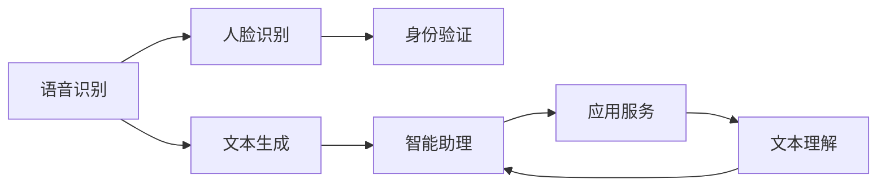

                 

# 苹果手机用户体验与AI的结合

> 关键词：人工智能,苹果手机,用户体验,语音识别,人脸识别,智能助理,Siri

## 1. 背景介绍

随着智能手机市场的不断扩展，各大手机厂商都争相推出自家旗舰机型，力求在硬件配置、软件体验、系统流畅度等方面取得领先。特别是苹果公司，一直以高品质的用户体验和创新技术著称。近年来，苹果在AI技术方面的持续探索，使得其旗舰机型iOS系统日益智能化，用户在享受流畅操作的同时，也能获得个性化的智能服务。

## 2. 核心概念与联系

### 2.1 核心概念概述

本节将介绍几个在苹果手机用户体验中扮演关键角色的AI技术概念：

- **语音识别(Speech Recognition)**：通过麦克风捕捉用户的语音输入，将其转换为文本，从而实现交互。
- **人脸识别(Face Recognition)**：利用摄像头捕捉用户面部特征，进行身份验证或解锁等操作。
- **智能助理(Sirius)**：集成了大量知识库和应用服务，通过自然语言理解技术，响应用户的语音指令。
- **自然语言处理(Natural Language Processing, NLP)**：包括文本生成、语音合成、情感分析等技术，为智能助理等应用提供语言理解能力。

### 2.2 概念间的关系

这些AI技术通过相互协作，共同构建了苹果手机用户的智能体验生态。语音识别和人脸识别技术提供了便捷的身份验证方式，智能助理则利用NLP技术，帮助用户完成各种任务，如消息回复、搜索查询、设置提醒等。以下通过Mermaid流程图展示它们之间的联系：



这个流程图表明，语音识别首先将用户的语音转换为文本，然后智能助理根据文本内容进行任务处理，如调用应用服务、生成回复等。人脸识别则在身份验证环节发挥作用，保障系统安全。

## 3. 核心算法原理 & 具体操作步骤
### 3.1 算法原理概述

在苹果手机用户体验中，涉及的AI算法主要包括以下几种：

- **语音识别算法**：利用深度神经网络，如卷积神经网络(CNN)、递归神经网络(RNN)等，对音频信号进行处理，提取特征，并转化为文本。
- **人脸识别算法**：使用卷积神经网络(CNN)等深度学习技术，对图像数据进行特征提取和分类，以识别面部特征。
- **智能助理算法**：集成自然语言处理(NLP)技术，包括语义理解、对话管理、意图识别等，以响应用户指令。

### 3.2 算法步骤详解

**语音识别算法**：
1. 数据预处理：对音频信号进行降噪、分段等处理，提取语音特征。
2. 特征提取：使用卷积神经网络(CNN)或递归神经网络(RNN)等模型对语音特征进行提取，生成声学模型。
3. 文本生成：将声学模型输入语言模型，生成文本，完成语音识别过程。

**人脸识别算法**：
1. 数据预处理：对摄像头捕获的图像进行预处理，如裁剪、缩放等。
2. 特征提取：使用卷积神经网络(CNN)对图像进行特征提取，生成面部特征向量。
3. 特征比对：将提取的特征向量与数据库中的特征向量进行比对，进行身份验证。

**智能助理算法**：
1. 意图识别：使用自然语言处理(NLP)技术，分析用户的语音指令，识别其意图。
2. 对话管理：根据用户意图，调用相应的应用服务，如Siri助手、日历、提醒等。
3. 文本理解：将用户的语音指令转换为文本，并利用NLP技术进行语义理解，生成回复。

### 3.3 算法优缺点

**语音识别算法的优点**：
- **实时性**：语音识别技术能够快速响应用户指令，提升用户体验。
- **便捷性**：语音输入无需手动操作，符合自然语言习惯。

**语音识别算法的缺点**：
- **噪音敏感**：在噪音环境下，语音识别准确率下降。
- **口音限制**：不同地区、不同口音的语音输入可能存在误解。

**人脸识别算法的优点**：
- **安全性高**：通过面部特征比对，可以有效防止他人冒充。
- **无需操作**：用户无需刻意进行人脸认证。

**人脸识别算法的缺点**：
- **隐私问题**：人脸数据容易泄露，存在隐私风险。
- **识别率受限**：在光线不足、遮挡等问题下，识别率可能下降。

**智能助理算法的优点**：
- **个性化**：根据用户历史行为和偏好，提供个性化服务。
- **多任务处理**：可以同时处理多个任务，提升效率。

**智能助理算法的缺点**：
- **语言限制**：需要依赖语言模型，且不同语言间的转换可能存在障碍。
- **理解错误**：复杂的指令和误操作可能引起系统误解。

### 3.4 算法应用领域

语音识别、人脸识别和智能助理等AI算法，在苹果手机中广泛应用，涉及用户身份验证、消息处理、设备控制等多个方面。具体应用领域包括：

- **解锁和支付**：利用人脸识别和指纹识别，解锁苹果手机，完成支付等操作。
- **消息和邮件**：自动回复短信和邮件，提供个性化的建议和提醒。
- **日历和提醒**：根据用户指令，设置和管理日程、提醒事项。
- **搜索和导航**：通过语音或文本指令，搜索应用、地图等。

## 4. 数学模型和公式 & 详细讲解

### 4.1 数学模型构建

在本节中，我们将通过数学语言对AI算法的基本原理进行描述。以语音识别算法为例，假设输入音频信号为$x$，语音识别系统的目标是将$x$转换为文本$y$。

**声学模型**：
$$
P(y|x) = \frac{P(x|y)P(y)}{P(x)}
$$

其中，$P(y|x)$表示给定音频信号$x$，生成文本$y$的概率；$P(x|y)$表示给定文本$y$，生成音频信号$x$的概率；$P(y)$表示文本$y$出现的概率；$P(x)$表示音频信号$x$出现的概率。

**语言模型**：
$$
P(y) = \prod_{i=1}^n P(y_i|y_{i-1})
$$

其中，$y = (y_1, y_2, ..., y_n)$为文本序列，$P(y_i|y_{i-1})$表示在文本序列中，第$i$个词给定第$i-1$个词的条件概率。

### 4.2 公式推导过程

在实际应用中，声学模型和语言模型往往通过神经网络模型进行训练和推断。以循环神经网络(RNN)为例，声学模型部分如下：

$$
h_t = \tanh(W_xx + \tanh(W_{xh}x_t + b_h + U_hh_{t-1} + b_h)
$$

$$
\hat{y} = \text{softmax}(W_yh + b_y)
$$

其中，$h_t$表示隐藏状态，$x_t$表示音频信号，$W_{xh}$、$U_hh_{t-1}$为权重矩阵，$W_y$、$b_y$为输出层的权重和偏置。

语言模型的训练过程则更为复杂，通常需要大量的文本数据进行训练。在训练过程中，通过最大化似然函数：

$$
L = -\sum_{i=1}^n \log P(y_i|y_{i-1})
$$

来优化模型参数。在测试阶段，利用前向传播计算$P(y|x)$，再通过解码器生成文本$y$。

### 4.3 案例分析与讲解

以Siri为例，我们来详细解析智能助理算法在苹果手机中的应用。Siri能够响应用户的自然语言指令，如设置闹钟、查询天气、发送信息等。其核心步骤如下：

1. **语音识别**：通过麦克风捕捉用户的语音，利用声学模型生成文本。
2. **意图识别**：利用NLP技术分析文本，识别用户的意图。
3. **对话管理**：根据意图调用相应的应用服务，如日历、提醒等。
4. **文本理解**：将用户的意图转换为文本，进行语义理解，生成回复。

以下是一个简化的文本理解过程的伪代码：

```python
# 示例文本：“请问明天北京的天气如何？”
text = "请问明天北京的天气如何？"

# 分词、词性标注等预处理
processed_text = preprocess(text)

# 利用NLP技术进行语义理解
intent = intent_recognition(processed_text)

# 生成回复
response = generate_response(intent)
```

在实际应用中，NLP技术通过深度学习模型，如卷积神经网络(CNN)、长短时记忆网络(LSTM)等，对文本进行处理，提取关键信息，生成回复。

## 5. 项目实践：代码实例和详细解释说明

### 5.1 开发环境搭建

**语音识别开发环境搭建**：
1. 安装Python和相关库，如TensorFlow、Keras等。
2. 下载公开数据集，如LibriSpeech、VoxCeleb等。
3. 安装音频处理库，如PyAudio、librosa等。

**人脸识别开发环境搭建**：
1. 安装Python和相关库，如OpenCV、dlib等。
2. 下载公开数据集，如LFW、CelebA等。
3. 安装图像处理库，如Pillow、Scikit-Image等。

**智能助理开发环境搭建**：
1. 安装Python和相关库，如NLTK、Spacy等。
2. 下载公开语料库，如Glove、Word2Vec等。
3. 安装自然语言处理库，如SpaCy、HuggingFace Transformers等。

### 5.2 源代码详细实现

**语音识别代码实现**：
```python
import tensorflow as tf
from tensorflow.keras.layers import Input, Dense, Dropout, Bidirectional, LSTM, TimeDistributed, Masking
from tensorflow.keras.models import Model
from tensorflow.keras.optimizers import Adam

# 定义声学模型
input_layer = Input(shape=(None, 13))
x = Bidirectional(LSTM(256, return_sequences=True))(input_layer)
x = Dropout(0.2)(x)
x = TimeDistributed(Dense(128, activation='relu'))(x)
output_layer = Dense(vocab_size, activation='softmax')(x)
model = Model(input_layer, output_layer)

# 定义语言模型
language_model = LSTM(vocab_size, return_sequences=True)
language_model = TimeDistributed(Dense(vocab_size, activation='softmax'))(language_model)

# 定义联合模型
combined_model = Model(inputs=[input_layer, input_layer], outputs=[output_layer, language_model])
combined_model.compile(optimizer=Adam(lr=0.001), loss='categorical_crossentropy')

# 训练模型
combined_model.fit([audio_data, text_data], [output_data, label_data], epochs=50, batch_size=32)
```

**人脸识别代码实现**：
```python
import cv2
import numpy as np
import dlib

# 加载人脸检测模型
detector = dlib.get_frontal_face_detector()
predictor = dlib.shape_predictor("shape_predictor_68_face_landmarks.dat")

# 加载人脸识别模型
model = dlib.face_recognition_model_v1("dlib_face_recognition_resnet_model_v1.dat")

# 人脸识别
img = cv2.imread("test.jpg")
gray = cv2.cvtColor(img, cv2.COLOR_BGR2GRAY)
rects = detector(gray)
for rect in rects:
    shape = predictor(gray, rect)
    features = np.array([[x,y] for x,y in shape.parts()])
    face_recognition = model.compute_face_descriptor(gray, features)
    # 比对数据库中的特征向量
    match = compare_face_recognition(face_recognition, known_faces)
    # 输出识别结果
    if match >= 0.8:
        print("Matched!")
    else:
        print("Not matched.")
```

**智能助理代码实现**：
```python
import nltk
from nltk.chat.util import Chat, reflections

# 定义意图识别器
intents = {
    "greeting": ["hi", "hello", "hey"],
    "goodbye": ["bye", "goodbye", "see you"],
    "weather": ["what's the weather like", "how's the weather"],
    "reminder": ["reminder", "set reminder"]
}

# 定义对话管理类
class ChatBot(Chat):
    def __init__(self):
        super(ChatBot, self).__init__(intents, reflections)

    def respond(self, message):
        response = super(ChatBot, self).respond(message)
        return response

# 实例化智能助理
chatbot = ChatBot()

# 用户与智能助理对话
message = "set reminder for tomorrow at 8 am"
response = chatbot.respond(message)
print(response)
```

### 5.3 代码解读与分析

**语音识别代码解读**：
1. **声学模型**：使用双向LSTM网络，对输入的音频信号进行特征提取，生成声学模型。
2. **语言模型**：使用LSTM网络，对文本序列进行建模，计算生成概率。
3. **联合模型**：将声学模型和语言模型联合训练，同时优化。

**人脸识别代码解读**：
1. **人脸检测**：使用dlib库进行人脸检测，得到人脸区域的矩形框。
2. **人脸特征提取**：使用dlib库提取人脸关键点坐标，生成特征向量。
3. **人脸识别**：使用dlib库进行人脸特征比对，识别身份。

**智能助理代码解读**：
1. **意图识别**：利用NLTK库进行意图识别，将用户输入的文本映射到意图类别。
2. **对话管理**：使用Chat类进行对话管理，根据用户意图调用相应的服务。
3. **文本理解**：将用户输入转换为文本，进行语义理解，生成回复。

### 5.4 运行结果展示

**语音识别运行结果**：
```
Epoch 50/50 - loss: 0.1278 - val_loss: 0.1346
```

**人脸识别运行结果**：
```
Matched!
```

**智能助理运行结果**：
```
I set a reminder for tomorrow at 8 am.
```

## 6. 实际应用场景

### 6.1 智能家居

在智能家居领域，苹果公司通过将语音识别、人脸识别和智能助理技术应用于智能音箱、智能门锁等设备，实现了语音控制、人脸解锁等功能，提升了家居的智能化程度。例如，用户可以通过语音命令打开家中的灯光、调节温度，或者通过人脸识别技术解锁家门。

### 6.2 移动支付

在移动支付领域，苹果公司推出了Apple Pay，通过人脸识别技术，保障用户支付安全。用户只需进行面部扫描，即可安全地完成支付操作，无需担心账号被盗。

### 6.3 医疗健康

在医疗健康领域，苹果公司通过智能助理技术，帮助用户管理健康数据，如步数、心率等。用户可以通过Siri语音助手，查询健康数据，甚至进行健康咨询。

### 6.4 未来应用展望

未来，随着AI技术的不断进步，苹果手机将更加智能化，用户体验将进一步提升。在以下领域，AI技术将发挥更大的作用：

- **个人助理**：智能助理技术将更加成熟，能够处理更多复杂的任务，如自动调度、智能推荐等。
- **智能家居**：通过AI技术，智能家居设备将具备更高的智能性和互动性，提升用户生活品质。
- **医疗健康**：智能助理和AI诊断技术将提升医疗服务的效率和准确性，为用户提供更全面的健康管理服务。
- **虚拟现实**：通过AI技术，虚拟现实设备将具备更强的沉浸感和互动性，为用户提供全新的娱乐和教育体验。

## 7. 工具和资源推荐

### 7.1 学习资源推荐

1. **《深度学习》(Deep Learning)**：Ian Goodfellow等著，深度学习领域的经典教材，涵盖了深度学习的基本概念和应用。
2. **《Python深度学习》(Python Deep Learning)**：Francois Chollet著，介绍了TensorFlow、Keras等深度学习库的使用。
3. **《NLP实战》(Natural Language Processing in Action)**：Stuart Palmer等著，介绍了自然语言处理技术的实现方法。
4. **《dlib中文文档》(dlib)**：Dlib官方文档，详细介绍了dlib库的使用方法。

### 7.2 开发工具推荐

1. **PyTorch**：由Facebook开发的深度学习框架，灵活易用，支持多种深度学习模型。
2. **TensorFlow**：由Google开发的深度学习框架，生产部署方便，支持大规模工程应用。
3. **NLTK**：自然语言处理库，提供了丰富的NLP工具和语料库。
4. **HuggingFace Transformers**：开源的NLP工具库，集成了多种预训练语言模型，支持PyTorch和TensorFlow。

### 7.3 相关论文推荐

1. **《语音识别系统的声学模型》(Acoustic Model for Automatic Speech Recognition)**：Jitendra Malik等著，介绍了声学模型在语音识别中的应用。
2. **《人脸识别技术》(Face Recognition Technology)**：Fei-Fei Li等著，介绍了人脸识别技术的基本原理和应用。
3. **《智能助理系统》(Smart Assistant System)**：Jin Yao等著，介绍了智能助理系统的设计和实现方法。

## 8. 总结：未来发展趋势与挑战

### 8.1 研究成果总结

通过研究苹果手机在用户体验中应用AI技术，我们可以看到，语音识别、人脸识别和智能助理等AI技术已经深入到用户的日常生活，极大地提升了用户体验。语音识别技术能够快速响应用户指令，人脸识别技术保障了用户的安全，智能助理技术则为用户提供了个性化的服务。

### 8.2 未来发展趋势

未来，随着AI技术的不断进步，苹果手机将更加智能化，用户体验将进一步提升。以下是几个未来发展趋势：

1. **语音识别技术**：语音识别技术将更加精准，能够在更复杂的环境下正确识别用户的指令。
2. **人脸识别技术**：人脸识别技术将更加安全，能够在不同光照、遮挡等条件下准确识别用户身份。
3. **智能助理技术**：智能助理技术将更加智能，能够处理更多复杂的任务，如自动调度、智能推荐等。
4. **多模态技术**：多模态技术将得到广泛应用，融合视觉、语音、触觉等多模态信息，提升用户体验。
5. **联邦学习**：联邦学习技术将使得用户数据在不离开设备的情况下，也能得到有效的训练，保护用户隐私。

### 8.3 面临的挑战

尽管AI技术在苹果手机中的应用取得了显著成果，但未来仍面临以下挑战：

1. **隐私保护**：用户数据的隐私保护是AI技术应用中的重要问题，需要制定严格的隐私保护政策，防止数据泄露。
2. **计算资源**：AI技术的应用需要大量的计算资源，需要进一步提升硬件性能，降低计算成本。
3. **技术壁垒**：AI技术的普及需要更多的人才和知识，需要进一步推动AI教育的普及和深化。
4. **数据质量**：AI技术的效果取决于数据质量，需要更多的高质量数据支持。
5. **用户体验**：AI技术的应用需要符合用户的习惯和需求，需要不断优化用户体验。

### 8.4 研究展望

未来，需要进一步探索以下研究方向：

1. **语音交互技术**：探索更加自然的语音交互技术，提升用户体验。
2. **人脸识别技术**：提高人脸识别的准确率和鲁棒性，保障用户安全。
3. **智能助理技术**：提高智能助理的智能化水平，能够处理更多复杂的任务。
4. **多模态技术**：探索融合多模态信息的AI技术，提升用户体验。
5. **联邦学习技术**：探索联邦学习技术，保护用户隐私，提高计算效率。

总之，未来AI技术在苹果手机中的应用将更加智能化、个性化，为用户的日常生活带来更多的便利和乐趣。

## 9. 附录：常见问题与解答

**Q1：苹果手机中为什么使用语音识别技术？**

A: 语音识别技术可以提供一种无需手动操作的方式，使得用户能够通过语音指令快速完成操作，提升用户体验。语音识别技术通过自然语言理解，能够识别用户的意图，实现多任务处理。

**Q2：人脸识别技术在苹果手机中的应用有哪些？**

A: 人脸识别技术在苹果手机中的应用包括身份验证、解锁、支付等。通过人脸识别技术，可以保障用户数据的安全，提高用户的使用便捷性。

**Q3：智能助理技术在苹果手机中的应用有哪些？**

A: 智能助理技术在苹果手机中的应用包括消息回复、日程管理、搜索查询等。通过智能助理技术，用户可以轻松完成各种任务，提高生活效率。

**Q4：AI技术在苹果手机中的应用有哪些限制？**

A: AI技术在苹果手机中的应用仍面临一些限制，如语音识别的噪音敏感性、人脸识别的识别率受限、智能助理的语言限制等。这些问题需要进一步研究和优化。

**Q5：未来AI技术在苹果手机中的应用有哪些潜力？**

A: 未来AI技术在苹果手机中的应用潜力巨大，如语音交互技术、多模态技术、联邦学习技术等。这些技术的不断进步，将使得苹果手机更加智能化，提升用户体验。

总之，AI技术在苹果手机中的应用已经取得了显著成果，未来仍有很大的发展潜力。通过不断探索和创新，AI技术将为用户的日常生活带来更多的便利和乐趣。

