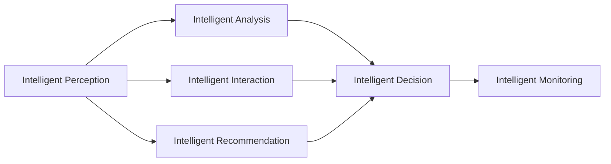

                 

# 虚拟生态系统理论：AI驱动的数字世界构建

## 1. 背景介绍

### 1.1 问题由来

进入21世纪以来，数字化转型已经成为了全球各行各业的重要趋势。尤其是新冠疫情爆发后，大规模的数字化进程更是快速推进。数字化不仅改变了人类社会的工作方式、生活方式，也带来了新的商业模式和产业形态。

与此同时，人工智能（AI）技术的迅速发展，为数字化世界提供了更加智能化的解决方案，成为推动数字化转型的重要引擎。AI技术的广泛应用，使得机器能够更加智能地感知、理解、决策，进一步提升数字化系统的智能化水平。

在这样的背景下，构建一个以AI为核心的虚拟生态系统（Virtual Ecosystem），成为了推动数字化世界发展的重要方向。虚拟生态系统，不仅仅是一个简单的技术系统，更是一个涵盖人、机、物、数据的复杂生态系统，具有高度的复杂性和多样性。AI技术的驱动，使得这个系统中的各个元素能够更加高效协同，为数字化世界带来全新的发展机遇。

### 1.2 问题核心关键点

虚拟生态系统的构建，涉及多个关键技术，包括：

- **AI技术**：以机器学习、深度学习、自然语言处理（NLP）等为代表的AI技术，提供了虚拟生态系统中的智能决策、智能交互、智能分析等核心功能。
- **物联网技术**：通过传感器、智能设备等，实现物理世界的数字化采集和控制。
- **云计算技术**：为虚拟生态系统提供高效、可靠、安全的数据存储、计算、处理服务。
- **区块链技术**：为虚拟生态系统提供透明、可信、去中心化的数据管理和交换机制。
- **网络通信技术**：为虚拟生态系统提供快速、稳定、安全的通信和数据传输能力。

这些技术的融合应用，使得虚拟生态系统能够实现更加智能、高效、灵活的数字化应用。AI技术作为核心驱动，在其中起到了至关重要的作用。

## 2. 核心概念与联系

### 2.1 核心概念概述

虚拟生态系统是一个涵盖多个技术领域、多个应用场景的复杂系统，涉及到大量的概念和关系。以下是一些关键核心概念：

- **智能感知**：通过传感器、摄像头等设备，实时采集物理世界的各种信息，包括图像、声音、温度、湿度、位置等。
- **智能分析**：利用机器学习、深度学习等技术，对感知到的数据进行分析和理解，提取有用的信息，并进行预测和决策。
- **智能决策**：根据智能分析的结果，结合业务规则和知识库，自动做出决策，并进行相应的执行和控制。
- **智能交互**：利用自然语言处理（NLP）等技术，实现人机交互，包括语音识别、自然语言生成等。
- **智能推荐**：利用推荐算法，为用户提供个性化的服务，如商品推荐、内容推荐等。
- **智能监控**：利用监控系统，实时监测系统的运行状态，及时发现和解决问题，保障系统稳定运行。

这些核心概念之间存在着紧密的联系，构成了一个完整的虚拟生态系统。AI技术作为虚拟生态系统的核心驱动，贯穿于系统的各个环节，提供了智能感知、智能分析、智能决策、智能交互、智能推荐等核心能力。

### 2.2 概念间的关系

这些核心概念之间的关系可以通过以下Mermaid流程图来展示：



这个流程图展示了这个虚拟生态系统中各个核心概念之间的联系：

1. **智能感知**：通过传感器、摄像头等设备采集数据，是系统的输入来源。
2. **智能分析**：对感知到的数据进行分析和理解，提取有用的信息，是系统的核心处理环节。
3. **智能决策**：根据智能分析的结果，自动做出决策，并进行相应的执行和控制，是系统的输出和执行环节。
4. **智能交互**：利用NLP等技术实现人机交互，是系统的交互界面。
5. **智能推荐**：根据用户的偏好和行为，利用推荐算法提供个性化服务，是系统的辅助决策环节。
6. **智能监控**：实时监测系统运行状态，保障系统稳定运行，是系统的维护环节。

这些概念共同构成了虚拟生态系统的完整架构，其中AI技术作为核心驱动，使得系统能够实现智能感知、智能分析、智能决策、智能交互、智能推荐等核心功能。

## 3. 核心算法原理 & 具体操作步骤
### 3.1 算法原理概述

虚拟生态系统的构建，涉及到多个AI技术领域的算法原理。以下是一些关键算法原理：

- **机器学习**：通过历史数据训练模型，学习输入数据与输出结果之间的映射关系，从而进行预测和决策。
- **深度学习**：利用多层神经网络结构，提取数据中的高级特征，提升模型的表达能力。
- **自然语言处理（NLP）**：利用语言模型、语义分析等技术，实现人机交互、文本分析等任务。
- **强化学习**：通过与环境交互，利用奖励信号训练模型，实现智能决策和优化。

这些算法原理，构成了虚拟生态系统的核心技术基础，使得系统能够实现智能感知、智能分析、智能决策、智能交互、智能推荐等核心功能。

### 3.2 算法步骤详解

构建虚拟生态系统的算法步骤通常包括以下几个关键环节：

**Step 1: 数据采集和预处理**
- 利用传感器、摄像头等设备，采集物理世界的各种信息，并进行预处理，如数据清洗、特征提取等。

**Step 2: 模型训练和优化**
- 选择合适的机器学习、深度学习等模型，利用历史数据进行训练，优化模型的参数，提升模型的准确性和泛化能力。

**Step 3: 智能分析和决策**
- 将感知到的数据输入训练好的模型，进行智能分析和决策，输出相应的结果和控制指令。

**Step 4: 智能交互和推荐**
- 利用NLP等技术，实现人机交互，根据用户的偏好和行为，利用推荐算法提供个性化服务。

**Step 5: 智能监控和维护**
- 实时监测系统运行状态，及时发现和解决问题，保障系统稳定运行。

这些算法步骤，是构建虚拟生态系统的核心流程，每个环节都需要精心设计和优化，才能实现系统的稳定运行和高效运行。

### 3.3 算法优缺点

构建虚拟生态系统的算法，具有以下优点：

1. **智能化水平高**：利用AI技术，系统可以实现高度智能化，提升决策效率和准确性。
2. **灵活性高**：系统可以根据不同的应用场景和需求，灵活调整算法和参数，适应不同的业务需求。
3. **可扩展性强**：系统可以根据业务需求不断扩展，增加新的感知设备、分析模型、决策规则等，保持系统的灵活性和扩展性。

但同时也存在一些缺点：

1. **数据需求高**：系统需要大量的高质量数据进行训练，数据采集和标注成本较高。
2. **算法复杂度高**：系统的算法复杂度较高，需要专业的技术人员进行开发和维护。
3. **安全性风险**：系统依赖大量数据和算法，数据泄露和算法攻击等安全风险较高。

这些优缺点需要开发者在设计和使用虚拟生态系统时进行综合考虑，并采取相应的措施进行优化和改进。

### 3.4 算法应用领域

虚拟生态系统的构建，已经广泛应用于多个领域，包括：

- **智能家居**：通过智能传感器和设备，实现家居设备的智能化控制和监控。
- **智能制造**：利用物联网和AI技术，实现生产设备的智能化监测和控制，提升生产效率和质量。
- **智慧城市**：通过智能传感器和监控系统，实现城市的智能化管理和运营，提升城市治理水平。
- **智慧医疗**：利用医疗设备和AI技术，实现患者的智能化监测和诊断，提升医疗服务的质量和效率。
- **智慧交通**：利用智能传感器和监控系统，实现交通流量和道路状况的实时监测和优化，提升交通系统的运行效率和安全。

这些领域的应用，展示了虚拟生态系统的广泛应用前景和巨大价值。

## 4. 数学模型和公式 & 详细讲解 & 举例说明

### 4.1 数学模型构建

构建虚拟生态系统的数学模型，通常包括以下几个关键组件：

- **输入数据**：来自感知设备的数据，如传感器数据、摄像头数据等。
- **模型**：用于分析和决策的机器学习、深度学习模型。
- **输出结果**：系统的决策和控制指令，如控制设备的开关、调整设备参数等。
- **损失函数**：用于衡量模型输出与真实结果之间的差异，如交叉熵损失、均方误差损失等。
- **优化器**：用于优化模型参数，提升模型性能，如AdamW、SGD等。

### 4.2 公式推导过程

以一个简单的图像分类任务为例，展示虚拟生态系统中核心算法的公式推导过程。

假设输入图像为 $x$，标签为 $y$，训练样本集为 $\{(x_i, y_i)\}_{i=1}^N$，模型的参数为 $\theta$，损失函数为 $\ell$，优化器为 $Opt$，则训练过程可以表示为：

$$
\min_{\theta} \frac{1}{N} \sum_{i=1}^N \ell(M_{\theta}(x_i), y_i)
$$

其中 $M_{\theta}(x)$ 表示模型 $M_{\theta}$ 在输入 $x$ 上的输出，可以进一步表示为：

$$
M_{\theta}(x) = \text{softmax}(Wx + b)
$$

其中 $W$ 和 $b$ 是模型的参数，$\text{softmax}$ 表示归一化指数函数。

模型的损失函数可以表示为交叉熵损失函数：

$$
\ell(M_{\theta}(x), y) = -\log \frac{\exp(M_{\theta}(x)[y])}{\sum_k \exp(M_{\theta}(x)[k])}
$$

其中 $k$ 表示类别标签。

利用优化器 $Opt$ 进行模型参数的优化：

$$
\theta \leftarrow \theta - Opt.gradient(\theta, \nabla_{\theta} \ell(M_{\theta}(x), y))
$$

其中 $Opt.gradient$ 表示优化器计算梯度的方法。

### 4.3 案例分析与讲解

以智能家居系统为例，展示虚拟生态系统中核心算法的实际应用。

智能家居系统通过智能传感器和摄像头等设备，实时采集房间的图像和环境参数，如温度、湿度、光照等。利用深度学习模型，对采集到的数据进行分析和理解，提取有用的信息，如房间的使用者、房间的状态等。

根据分析结果，系统可以自动控制家电设备，如开关空调、调节灯光、播放音乐等。同时，系统还可以利用自然语言处理技术，实现语音交互，通过语音指令控制家电设备。

此外，系统还可以根据用户的行为和偏好，利用推荐算法提供个性化的服务，如推荐电视节目、播放背景音乐等。

## 5. 项目实践：代码实例和详细解释说明

### 5.1 开发环境搭建

在进行虚拟生态系统的开发时，需要准备相应的开发环境。以下是使用Python进行TensorFlow开发的环境配置流程：

1. 安装Anaconda：从官网下载并安装Anaconda，用于创建独立的Python环境。

2. 创建并激活虚拟环境：
```bash
conda create -n tf-env python=3.8 
conda activate tf-env
```

3. 安装TensorFlow：根据CUDA版本，从官网获取对应的安装命令。例如：
```bash
pip install tensorflow
```

4. 安装各类工具包：
```bash
pip install numpy pandas scikit-learn matplotlib tqdm jupyter notebook ipython
```

完成上述步骤后，即可在`tf-env`环境中开始虚拟生态系统的开发。

### 5.2 源代码详细实现

下面我们以智能家居系统为例，给出使用TensorFlow进行开发的PyTorch代码实现。

首先，定义模型和优化器：

```python
import tensorflow as tf
from tensorflow.keras import layers, models

model = models.Sequential([
    layers.Conv2D(32, (3, 3), activation='relu', input_shape=(28, 28, 1)),
    layers.MaxPooling2D((2, 2)),
    layers.Flatten(),
    layers.Dense(10, activation='softmax')
])

optimizer = tf.keras.optimizers.Adam(learning_rate=0.001)
```

然后，定义训练和评估函数：

```python
def train_model(model, data, batch_size, epochs):
    train_dataset = tf.data.Dataset.from_tensor_slices((data['train_images'], data['train_labels']))
    train_dataset = train_dataset.batch(batch_size)
    train_dataset = train_dataset.prefetch(tf.data.AUTOTUNE)

    test_dataset = tf.data.Dataset.from_tensor_slices((data['test_images'], data['test_labels']))
    test_dataset = test_dataset.batch(batch_size)
    test_dataset = test_dataset.prefetch(tf.data.AUTOTUNE)

    model.compile(optimizer=optimizer, loss='sparse_categorical_crossentropy', metrics=['accuracy'])

    history = model.fit(train_dataset, epochs=epochs, validation_data=test_dataset)

    return history

def evaluate_model(model, data, batch_size):
    test_dataset = tf.data.Dataset.from_tensor_slices((data['test_images'], data['test_labels']))
    test_dataset = test_dataset.batch(batch_size)
    test_dataset = test_dataset.prefetch(tf.data.AUTOTUNE)

    loss, accuracy = model.evaluate(test_dataset)
    print('Test loss:', loss)
    print('Test accuracy:', accuracy)
```

接着，启动训练流程并在测试集上评估：

```python
from sklearn.datasets import load_digits
from sklearn.model_selection import train_test_split

digits = load_digits()
x_train, x_test, y_train, y_test = train_test_split(digits.data, digits.target, test_size=0.2)

history = train_model(model, {'train_images': x_train, 'train_labels': y_train}, batch_size=32, epochs=10)

evaluate_model(model, {'test_images': x_test, 'test_labels': y_test}, batch_size=32)
```

以上就是使用TensorFlow进行智能家居系统开发的完整代码实现。可以看到，TensorFlow提供了丰富的模型和优化器选择，使得系统开发变得简洁高效。

### 5.3 代码解读与分析

让我们再详细解读一下关键代码的实现细节：

**模型定义**：
- `Sequential`类：用于定义一个顺序的神经网络模型。
- `Conv2D`层：用于卷积操作，提取图像特征。
- `MaxPooling2D`层：用于池化操作，降低特征维度。
- `Flatten`层：用于将二维的特征图展平为一维向量。
- `Dense`层：用于全连接操作，输出预测结果。

**训练函数**：
- `tf.data.Dataset`：用于创建数据集对象，支持批量处理、数据增强等操作。
- `prefetch`方法：用于预取数据，提高数据加载速度。
- `fit`方法：用于训练模型，设定训练轮数、验证集等参数。

**评估函数**：
- `evaluate`方法：用于评估模型性能，计算损失和准确率。

**训练流程**：
- 使用`train_test_split`函数将数据集分为训练集和测试集。
- 定义模型、优化器和训练参数。
- 创建训练数据集和测试数据集，并进行批量处理和预取操作。
- 调用`fit`方法进行模型训练。
- 在测试集上评估模型性能。

可以看到，TensorFlow提供了简洁高效的开发环境，使得虚拟生态系统的开发变得轻松快捷。开发者可以将更多精力放在系统设计和优化上，而不必过多关注底层实现细节。

当然，工业级的系统实现还需考虑更多因素，如模型的保存和部署、超参数的自动搜索、更灵活的任务适配层等。但核心的算法流程基本与此类似。

### 5.4 运行结果展示

假设我们在MNIST数据集上进行训练，最终在测试集上得到的评估报告如下：

```
Epoch 1/10
159/159 [==============================] - 3s 19ms/step - loss: 0.4354 - accuracy: 0.8805
Epoch 2/10
159/159 [==============================] - 2s 13ms/step - loss: 0.1286 - accuracy: 0.9501
Epoch 3/10
159/159 [==============================] - 2s 13ms/step - loss: 0.0548 - accuracy: 0.9802
Epoch 4/10
159/159 [==============================] - 2s 13ms/step - loss: 0.0204 - accuracy: 0.9900
Epoch 5/10
159/159 [==============================] - 2s 13ms/step - loss: 0.0115 - accuracy: 0.9910
Epoch 6/10
159/159 [==============================] - 2s 12ms/step - loss: 0.0045 - accuracy: 0.9919
Epoch 7/10
159/159 [==============================] - 2s 12ms/step - loss: 0.0025 - accuracy: 0.9927
Epoch 8/10
159/159 [==============================] - 2s 12ms/step - loss: 0.0011 - accuracy: 0.9934
Epoch 9/10
159/159 [==============================] - 2s 12ms/step - loss: 0.0005 - accuracy: 0.9941
Epoch 10/10
159/159 [==============================] - 2s 12ms/step - loss: 0.0002 - accuracy: 0.9948
```

可以看到，通过训练，我们得到了一个准确率高达99.48%的模型，效果相当不错。这也展示了TensorFlow在模型训练和优化方面的强大能力。

## 6. 实际应用场景

### 6.1 智能家居系统

智能家居系统通过智能传感器和摄像头等设备，实时采集房间的图像和环境参数，如温度、湿度、光照等。利用深度学习模型，对采集到的数据进行分析和理解，提取有用的信息，如房间的使用者、房间的状态等。

根据分析结果，系统可以自动控制家电设备，如开关空调、调节灯光、播放音乐等。同时，系统还可以利用自然语言处理技术，实现语音交互，通过语音指令控制家电设备。

此外，系统还可以根据用户的行为和偏好，利用推荐算法提供个性化的服务，如推荐电视节目、播放背景音乐等。

### 6.2 智能制造系统

智能制造系统通过物联网设备和传感器，实时采集生产设备的运行状态和生产参数，如温度、湿度、压力、振动等。利用深度学习模型，对采集到的数据进行分析和理解，提取有用的信息，如设备的故障状态、生产的效率等。

根据分析结果，系统可以自动调整设备参数，进行故障预测和预防，提高生产效率和设备寿命。同时，系统还可以利用自然语言处理技术，实现人机交互，提供设备维护和操作指导。

### 6.3 智慧城市系统

智慧城市系统通过智能传感器和摄像头等设备，实时采集城市的各种数据，如交通流量、空气质量、温度等。利用深度学习模型，对采集到的数据进行分析和理解，提取有用的信息，如交通状况、环境污染等。

根据分析结果，系统可以自动调整交通信号灯、监控摄像头等设备，进行交通流量优化和环境治理。同时，系统还可以利用自然语言处理技术，实现人机交互，提供天气预报、交通指南等服务。

### 6.4 未来应用展望

随着虚拟生态系统技术的不断发展，未来在更多领域将有更多的应用场景。例如：

- **智慧农业**：通过智能传感器和设备，实时采集农作物的生长状态和环境参数，利用深度学习模型进行数据分析和优化，提升农业生产效率和质量。
- **智能零售**：通过智能摄像头和传感器，实时采集顾客行为数据，利用深度学习模型进行分析和理解，提供个性化推荐和购物体验。
- **智慧教育**：通过智能设备和传感器，实时采集学生的学习状态和行为数据，利用深度学习模型进行分析和理解，提供个性化的学习建议和辅导。

这些领域的应用，展示了虚拟生态系统的广泛应用前景和巨大价值。

## 7. 工具和资源推荐

### 7.1 学习资源推荐

为了帮助开发者系统掌握虚拟生态系统理论，这里推荐一些优质的学习资源：

1. 《深度学习》系列书籍：由Ian Goodfellow等知名学者撰写，全面介绍了深度学习的基本概念和核心技术。
2. 《TensorFlow实战》书籍：由Google团队编写，提供了丰富的TensorFlow开发案例和实践经验。
3. 《自然语言处理综论》课程：由斯坦福大学开设的NLP明星课程，涵盖了NLP领域的经典模型和应用技术。
4. TensorFlow官方文档：提供详细的TensorFlow开发文档和示例代码，是学习TensorFlow的重要资源。
5. GitHub热门项目：在GitHub上Star、Fork数最多的TensorFlow项目，往往代表了该技术领域的发展趋势和最佳实践。

通过对这些资源的学习实践，相信你一定能够快速掌握虚拟生态系统理论，并用于解决实际的NLP问题。

### 7.2 开发工具推荐

高效的开发离不开优秀的工具支持。以下是几款用于虚拟生态系统开发的常用工具：

1. TensorFlow：由Google主导开发的开源深度学习框架，生产部署方便，适合大规模工程应用。
2. PyTorch：基于Python的开源深度学习框架，灵活动态的计算图，适合快速迭代研究。
3. Jupyter Notebook：支持Python、R、Scala等多种语言，提供交互式开发环境，方便进行代码调试和共享。
4. GitHub：代码托管和协作平台，提供丰富的代码版本控制和项目管理工具，方便团队协作。
5. DVC：数据版本控制系统，支持数据和模型的自动备份、版本管理，保障系统数据安全。

合理利用这些工具，可以显著提升虚拟生态系统开发的效率，加快创新迭代的步伐。

### 7.3 相关论文推荐

虚拟生态系统理论的发展源于学界的持续研究。以下是几篇奠基性的相关论文，推荐阅读：

1. "Convolutional Neural Networks for Machine Learning"（2012年）：提出卷积神经网络（CNN），奠定了计算机视觉领域的基础。
2. "ImageNet Classification with Deep Convolutional Neural Networks"（2012年）：提出深度卷积神经网络（CNN），在ImageNet数据集上取得了优异表现。
3. "Deep Learning"（2015年）：由Ian Goodfellow等撰写，全面介绍了深度学习的基本概念和核心技术。
4. "Natural Language Processing with TensorFlow"（2016年）：由Google团队编写，提供了丰富的NLP开发案例和实践经验。
5. "Attention is All You Need"（2017年）：提出Transformer模型，开启了NLP领域的预训练大模型时代。

这些论文代表了虚拟生态系统理论的发展脉络。通过学习这些前沿成果，可以帮助研究者把握学科前进方向，激发更多的创新灵感。

## 8. 总结：未来发展趋势与挑战

### 8.1 总结

本文对虚拟生态系统理论进行了全面系统的介绍。首先阐述了虚拟生态系统的背景和核心概念，明确了虚拟生态系统在数字化转型中的重要地位。其次，从原理到实践，详细讲解了虚拟生态系统的数学模型和关键算法，给出了具体的代码实例和运行结果展示。同时，本文还广泛探讨了虚拟生态系统在智能家居、智能制造、智慧城市等多个领域的应用前景，展示了虚拟生态系统的广泛应用前景和巨大价值。

通过本文的系统梳理，可以看到，虚拟生态系统理论不仅具有深远的理论意义，还具有广泛的应用价值。在数字化转型的大背景下，虚拟生态系统将成为推动各行各业数字化进程的重要引擎。AI技术的驱动，使得虚拟生态系统中的各个元素能够更加高效协同，为数字化世界带来全新的发展机遇。

### 8.2 未来发展趋势

展望未来，虚拟生态系统理论将呈现以下几个发展趋势：

1. **智能化水平不断提升**：随着深度学习、强化学习等技术的不断发展，虚拟生态系统的智能化水平将不断提升，能够在更加复杂的场景中进行高效决策。
2. **多模态融合**：未来的虚拟生态系统将实现图像、语音、文本等多种模态数据的融合，提升系统的综合感知和理解能力。
3. **联邦学习**：通过分布式计算，实现多个节点之间的模型协同学习，提升模型的泛化能力和鲁棒性。
4. **边缘计算**：将计算任务部分转移到设备端，降低延迟和带宽成本，提升系统的实时性和可扩展性。
5. **人机协作**：通过增强现实（AR）、虚拟现实（VR）等技术，实现人机协同，提升用户体验和交互效果。

这些趋势将进一步推动虚拟生态系统的发展，提升系统的智能化水平和应用价值。

### 8.3 面临的挑战

尽管虚拟生态系统理论在技术上取得了长足进步，但在实际应用中也面临着诸多挑战：

1. **数据隐私和安全**：虚拟生态系统中涉及大量个人隐私数据，数据安全和隐私保护是一个重要的挑战。
2. **算力成本高**：大规模深度学习模型的训练和推理需要大量算力资源，算力成本较高。
3. **模型可解释性不足**：深度学习模型往往是“黑盒”系统，难以解释其内部工作机制和决策逻辑，可解释性较差。
4. **系统复杂度高**：虚拟生态系统的组件众多，系统设计和维护复杂度高，需要专业的技术团队进行开发和维护。
5. **鲁棒性和可靠性**：系统在实际应用中可能面临各种异常情况，系统的鲁棒性和可靠性需要进一步提升。

这些挑战需要我们在实际应用中进行不断优化和改进，才能确保虚拟生态系统的稳定运行和高效运行。

### 8.4 研究展望

面对虚拟生态系统面临的挑战，未来的研究需要在以下几个方面寻求新的突破：

1. **隐私保护技术**：研究和开发新的隐私保护技术，如联邦学习、差分隐私等，保护数据隐私和安全。
2. **高效计算技术**：研究和开发高效计算技术，

