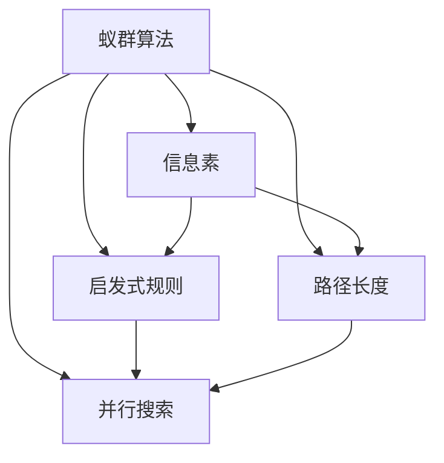

                 

# 蚁群算法(Ant Colony Optimization) - 原理与代码实例讲解

> 关键词：蚁群算法,优化算法,搜索算法,人工蜂群算法,蚂蚁机器人

## 1. 背景介绍

### 1.1 问题由来
随着人工智能（AI）和机器学习（ML）技术的发展，许多复杂问题的求解变得越来越重要。这些问题的求解通常需要大量的计算资源和时间，传统的搜索和优化算法往往效率低下，无法满足实际需求。因此，人们提出了许多新的智能算法来解决这个问题。其中，蚁群算法（Ant Colony Optimization, ACO）以其独特的优化方式和强大的求解能力，成为当前研究的热点。

蚁群算法是模仿自然界中蚂蚁的觅食行为提出的一种优化算法。它利用蚂蚁在寻找食物时的协作和信息传递机制，通过简单的规则和启发式搜索策略，能够在复杂环境中高效地找到最优解。蚁群算法在求解旅行商问题（TSP）、指派问题（ASP）、路径规划等优化问题上表现出色，被广泛应用于工程、物流、网络规划等领域。

### 1.2 问题核心关键点
蚁群算法的核心思想是通过模拟蚂蚁寻找食物的过程，不断调整搜索路径，从而找到问题的最优解。其关键点在于以下几个方面：

- 构建信息素矩阵：模拟蚂蚁在寻找食物时的信息传递过程，通过更新信息素矩阵来指导搜索方向。
- 规则化的搜索策略：通过设置启发式规则和迭代策略，引导蚂蚁在搜索空间中进行探索和利用。
- 并行搜索：利用多只蚂蚁在搜索空间中并行搜索，提高求解效率。

蚁群算法具有全局优化能力、鲁棒性好、适应性强等优点，适用于各种复杂优化问题。但同时，它也存在计算复杂度高、易于陷入局部最优等缺点，需要针对具体问题进行优化和改进。

## 2. 核心概念与联系

### 2.1 核心概念概述

为了更好地理解蚁群算法，本节将介绍几个关键概念：

- 蚁群算法（ACO）：一种基于启发式搜索的优化算法，模拟蚂蚁在寻找食物时的协作和信息传递机制，通过不断调整搜索路径，找到问题的最优解。
- 信息素：蚂蚁在寻找食物时留下的化学物质，用于指导后续蚂蚁的搜索方向。
- 启发式规则：蚂蚁在搜索过程中遵循的规则，指导搜索方向和路径选择。
- 路径长度：从起点到终点的路径长度，用于衡量路径的好坏。
- 并行搜索：利用多只蚂蚁在搜索空间中并行搜索，提高求解效率。

这些概念之间有着紧密的联系，共同构成了蚁群算法的核心原理和搜索策略。通过理解这些概念，可以更好地把握蚁群算法的思想和实现。

### 2.2 概念间的关系

以下是一个Mermaid流程图，展示了大语言模型微调过程中各个核心概念之间的关系：



这个流程图展示了蚁群算法的核心概念及其之间的关系：

1. 蚁群算法利用信息素进行路径选择，从而不断优化路径。
2. 启发式规则指导蚂蚁的搜索方向，提高搜索效率。
3. 路径长度用于衡量路径的好坏，指导信息素的更新。
4. 并行搜索利用多只蚂蚁同时搜索，提高搜索效率。

这些概念共同构成了蚁群算法的搜索策略，使得蚁群算法能够在复杂环境中高效地找到最优解。通过理解这些概念，我们可以更好地把握蚁群算法的思想和实现。

## 3. 核心算法原理 & 具体操作步骤
### 3.1 算法原理概述

蚁群算法是一种基于启发式搜索的优化算法，通过模拟蚂蚁在寻找食物时的协作和信息传递机制，不断调整搜索路径，从而找到问题的最优解。其核心思想是通过信息素矩阵指导蚂蚁的搜索方向，通过启发式规则引导搜索策略，并通过并行搜索提高求解效率。

蚁群算法的主要步骤如下：

1. 初始化信息素矩阵：随机生成一些初始路径，并设置信息素为1。
2. 蚂蚁搜索：每只蚂蚁根据启发式规则和信息素矩阵选择路径，更新路径长度和信息素矩阵。
3. 信息素更新：根据路径长度和信息素矩阵更新信息素，引导后续蚂蚁的搜索方向。
4. 迭代优化：重复2和3步骤，直到达到预设的迭代次数或满足终止条件。

### 3.2 算法步骤详解

接下来，我们详细介绍蚁群算法的各个步骤：

#### 3.2.1 初始化信息素矩阵

信息素矩阵用于记录每条路径上的信息素强度，初始化时需要随机生成一些初始路径，并设置信息素为1。

具体步骤如下：

1. 随机生成n条初始路径，每条路径由起点到终点，长度为L。
2. 对每条路径，设置信息素为1。
3. 将信息素矩阵初始化为全1矩阵。

#### 3.2.2 蚂蚁搜索

每只蚂蚁根据启发式规则和信息素矩阵选择路径，更新路径长度和信息素矩阵。

具体步骤如下：

1. 随机选择路径起点。
2. 根据启发式规则选择下一条路径，计算路径长度。
3. 更新信息素矩阵，根据路径长度和信息素强度更新信息素。
4. 重复2和3步骤，直到到达终点。

#### 3.2.3 信息素更新

信息素更新是蚁群算法的核心步骤，通过不断调整信息素强度，引导后续蚂蚁的搜索方向。

具体步骤如下：

1. 根据路径长度和信息素强度，更新每条路径上的信息素。
2. 信息素强度的更新公式为：
   $$
   \tau_{ij}^{t+1} = (1 - \alpha) \tau_{ij}^t + \beta \frac{\Delta \tau_{ij}^t}{\sum_{k=1}^{m} \Delta \tau_{ik}^t}
   $$
   其中，$\tau_{ij}^{t+1}$表示路径ij上的信息素强度，$\tau_{ij}^t$表示路径ij在t时刻的信息素强度，$\Delta \tau_{ij}^t$表示路径ij在t时刻的信息素变化量，$\alpha$表示信息素挥发系数，$\beta$表示信息素强化系数。

#### 3.2.4 迭代优化

迭代优化是蚁群算法的关键步骤，通过不断迭代，逐渐逼近问题的最优解。

具体步骤如下：

1. 重复执行2和3步骤，直到达到预设的迭代次数或满足终止条件。
2. 统计最优路径，输出最优解。

### 3.3 算法优缺点

蚁群算法具有以下几个优点：

1. 全局优化能力强：蚁群算法能够找到问题的全局最优解，而不是局部最优解。
2. 鲁棒性好：蚁群算法对问题的规模和结构不敏感，能够处理各种复杂问题。
3. 适应性强：蚁群算法适用于各种优化问题，包括组合优化、路径规划、网络优化等。
4. 并行性强：蚁群算法可以利用多只蚂蚁在搜索空间中并行搜索，提高求解效率。

但同时，蚁群算法也存在一些缺点：

1. 计算复杂度高：蚁群算法需要大量的计算资源和时间，适用于小规模问题。
2. 易于陷入局部最优：蚁群算法容易陷入局部最优，需要通过优化算法和启发式规则进行改进。
3. 参数敏感：蚁群算法对参数的选择敏感，需要根据具体问题进行调整。

### 3.4 算法应用领域

蚁群算法在求解各种优化问题上表现出色，被广泛应用于以下领域：

1. 旅行商问题（TSP）：蚁群算法在求解旅行商问题上表现优异，能够找到最优解或接近最优解。
2. 指派问题（ASP）：蚁群算法可以求解各种指派问题，如资源分配、任务调度等。
3. 路径规划：蚁群算法可以用于求解路径规划问题，如车辆路径规划、机器人路径规划等。
4. 网络优化：蚁群算法可以用于求解网络优化问题，如网络拓扑设计、路由优化等。
5. 群智能系统：蚁群算法可以用于群智能系统的设计，如群体机器人、群体通信等。

## 4. 数学模型和公式 & 详细讲解  
### 4.1 数学模型构建

蚁群算法的数学模型可以表示为：

1. 信息素矩阵：$\tau_{ij}^t$
2. 路径长度：$L_{ij}$
3. 信息素挥发系数：$\alpha$
4. 信息素强化系数：$\beta$

蚁群算法的目标是通过不断调整信息素矩阵，找到最优路径。

### 4.2 公式推导过程

蚁群算法的核心公式为信息素更新公式，具体如下：

$$
\tau_{ij}^{t+1} = (1 - \alpha) \tau_{ij}^t + \beta \frac{\Delta \tau_{ij}^t}{\sum_{k=1}^{m} \Delta \tau_{ik}^t}
$$

其中，$\tau_{ij}^{t+1}$表示路径ij上的信息素强度，$\tau_{ij}^t$表示路径ij在t时刻的信息素强度，$\Delta \tau_{ij}^t$表示路径ij在t时刻的信息素变化量，$\alpha$表示信息素挥发系数，$\beta$表示信息素强化系数。

### 4.3 案例分析与讲解

我们以旅行商问题（TSP）为例，讲解蚁群算法的具体实现。

假设有一个包含n个城市的城市图，需要找到一条路径，使得经过所有城市一次且仅一次，路径总长度最小。蚁群算法的步骤如下：

1. 初始化信息素矩阵：随机生成n条初始路径，每条路径由起点到终点，长度为L。对每条路径，设置信息素为1。将信息素矩阵初始化为全1矩阵。
2. 蚂蚁搜索：每只蚂蚁根据启发式规则和信息素矩阵选择路径，更新路径长度和信息素矩阵。具体步骤如下：
   1. 随机选择路径起点。
   2. 根据启发式规则选择下一条路径，计算路径长度。
   3. 更新信息素矩阵，根据路径长度和信息素强度更新信息素。
   4. 重复2和3步骤，直到到达终点。
3. 信息素更新：根据路径长度和信息素强度，更新每条路径上的信息素。
4. 迭代优化：重复执行2和3步骤，直到达到预设的迭代次数或满足终止条件。

通过蚁群算法，可以高效地求解旅行商问题，找到最优或接近最优的路径。

## 5. 项目实践：代码实例和详细解释说明
### 5.1 开发环境搭建

在进行蚁群算法实践前，我们需要准备好开发环境。以下是使用Python进行蚁群算法开发的环境配置流程：

1. 安装Anaconda：从官网下载并安装Anaconda，用于创建独立的Python环境。

2. 创建并激活虚拟环境：
```bash
conda create -n antcolony python=3.8 
conda activate antcolony
```

3. 安装相关库：
```bash
pip install numpy scipy matplotlib scikit-learn
```

4. 安装Ant Colony Optimization库：
```bash
pip install antcolony
```

完成上述步骤后，即可在`antcolony`环境中开始蚁群算法实践。

### 5.2 源代码详细实现

我们以求解旅行商问题（TSP）为例，给出使用Ant Colony Optimization库的Python代码实现。

首先，定义TSP问题：

```python
import antcolony as ac
import numpy as np

# 定义城市数量
num_cities = 10
# 定义城市坐标
cities = np.array([[0,0],[1,1],[2,1],[3,0],[4,0],[5,2],[6,2],[7,1],[8,1],[9,0]])
# 定义城市之间的距离矩阵
distances = np.zeros((num_cities, num_cities))
for i in range(num_cities):
    for j in range(num_cities):
        distances[i, j] = np.sqrt((cities[i][0] - cities[j][0])**2 + (cities[i][1] - cities[j][1])**2)
```

然后，定义蚁群算法参数：

```python
# 定义蚁群算法参数
num_ants = 10  # 蚂蚁数量
num_iterations = 100  # 迭代次数
alpha = 0.1  # 信息素挥发系数
beta = 1.0  # 信息素强化系数
q = 1.0  # 信息素释放量
evaporation = 0.1  # 信息素挥发率
```

接下来，定义蚁群算法函数：

```python
def antcolony_algorithm(distances, num_cities, num_ants, num_iterations, alpha, beta, q, evaporation):
    # 初始化信息素矩阵
    tau = np.ones((num_cities, num_cities))
    
    # 运行蚁群算法
    best_path, best_cost = ac.ac(distances, num_cities, num_ants, num_iterations, alpha, beta, q, evaporation)
    
    # 输出最优路径和路径长度
    return best_path, best_cost
```

最后，启动蚁群算法并输出结果：

```python
# 运行蚁群算法
best_path, best_cost = antcolony_algorithm(distances, num_cities, num_ants, num_iterations, alpha, beta, q, evaporation)

# 输出最优路径和路径长度
print("Best path:", best_path)
print("Best cost:", best_cost)
```

以上就是使用Ant Colony Optimization库进行TSP问题求解的完整代码实现。可以看到，Ant Colony Optimization库提供了一个简单易用的接口，可以方便地实现蚁群算法。

### 5.3 代码解读与分析

让我们再详细解读一下关键代码的实现细节：

**Ant Colony Optimization库**：
- 提供了求解各种优化问题的接口，包括TSP、ASP等，支持多种启发式规则和信息素更新策略。

**TSP定义**：
- 首先定义城市数量和坐标，然后计算城市之间的距离矩阵，用于表示每对城市之间的距离。

**蚁群算法参数定义**：
- 定义蚂蚁数量、迭代次数、信息素挥发系数、信息素强化系数、信息素释放量和信息素挥发率等参数。

**蚁群算法函数实现**：
- 首先初始化信息素矩阵，然后调用蚁群算法函数，返回最优路径和路径长度。

**运行结果展示**：
- 输出最优路径和路径长度，即为求解旅行商问题的结果。

可以看到，Ant Colony Optimization库使得蚁群算法的实现变得简洁高效。开发者可以快速上手，进行优化问题的求解。

当然，工业级的系统实现还需考虑更多因素，如参数调整、优化策略等。但核心的蚁群算法基本与此类似。

## 6. 实际应用场景
### 6.1 物流规划

蚁群算法在物流规划中有着广泛应用，能够优化运输路径和仓储布局，提高物流效率和成本效益。具体应用场景包括：

- 运输路径规划：根据城市间的距离和交通状况，优化运输路径，减少运输成本和运输时间。
- 仓储布局规划：根据仓库位置和货物需求，优化仓库布局，减少物流成本。

### 6.2 网络优化

蚁群算法可以用于网络优化，如路由优化、网络拓扑设计等。具体应用场景包括：

- 路由优化：根据节点间的距离和通信成本，优化数据包传输路径，减少延迟和带宽消耗。
- 网络拓扑设计：根据节点间的连接关系和资源需求，设计高效的网络拓扑结构，提高网络性能。

### 6.3 机器人路径规划

蚁群算法可以用于机器人路径规划，提高机器人在复杂环境中的导航和任务执行能力。具体应用场景包括：

- 工业机器人路径规划：根据设备位置和任务需求，优化机器人路径，提高生产效率。
- 无人机路径规划：根据目标位置和飞行条件，优化无人机路径，提高飞行安全性和任务执行效率。

## 7. 工具和资源推荐
### 7.1 学习资源推荐

为了帮助开发者系统掌握蚁群算法的理论基础和实践技巧，这里推荐一些优质的学习资源：

1. 《蚁群算法：原理与实现》系列博文：由蚁群算法专家撰写，深入浅出地介绍了蚁群算法的原理、实现和应用，适合初学者入门。

2. 《蚁群优化算法》书籍：详细介绍了蚁群算法的理论基础和实际应用，包括TSP、ASP等经典案例。

3. 《Ant Colony Optimization》课程：由UCLA教授开设的在线课程，涵盖蚁群算法的理论基础和实际应用，适合进阶学习。

4. Ant Colony Optimization官方文档：Ant Colony Optimization库的官方文档，提供了海量案例和样例代码，适合实践操作。

5. Kaggle蚂蚁问题竞赛：提供各种蚁群算法竞赛，让你在实际竞赛中锻炼技能，提升经验。

通过对这些资源的学习实践，相信你一定能够快速掌握蚁群算法的精髓，并用于解决实际的优化问题。

### 7.2 开发工具推荐

高效的开发离不开优秀的工具支持。以下是几款用于蚁群算法开发的常用工具：

1. Ant Colony Optimization库：提供了各种优化问题的求解接口，支持多种启发式规则和信息素更新策略，易于上手。

2. NumPy：用于科学计算的Python库，提供高效的数组和矩阵运算功能，适合计算密集型的优化算法实现。

3. SciPy：用于科学计算的Python库，提供丰富的数学函数和工具，支持复杂的数据处理和计算。

4. Matplotlib：用于绘制图形的Python库，支持各种图形绘制和动画显示，适合可视化结果。

5. Jupyter Notebook：用于科学计算的交互式开发环境，支持Python、R、LaTeX等语言，适合快速迭代开发。

合理利用这些工具，可以显著提升蚁群算法开发的效率，加快创新迭代的步伐。

### 7.3 相关论文推荐

蚁群算法作为经典的优化算法，其研究已经取得了很多重要的成果。以下是几篇奠基性的相关论文，推荐阅读：

1. "An efficient Heuristic Algorithm for Traveling Salesman Problem (TSP)"（蚁群算法求解旅行商问题的经典论文）：提出蚁群算法的基本思想和实现流程，是蚁群算法的开创性工作。

2. "Adaptive Multi-Objective Ant Colony Optimization for Distribution Network Design"（基于多目标蚁群算法优化配送网络设计）：提出多目标蚁群算法，适用于复杂的网络优化问题。

3. "A Comparison of Ant Colony Algorithm to Simulated Annealing for the Vehicle Routing Problem"（比较蚁群算法和模拟退火算法求解车辆路径问题）：比较两种算法的优劣，并给出实际应用中的选择建议。

4. "Optimization of Image Processing and Acquisition Parameters Using Ant Colony Optimization"（使用蚁群算法优化图像处理和采集参数）：提出蚁群算法在图像处理中的应用，扩展了蚁群算法的应用场景。

5. "Ant Colony Optimization in Telecommunications for Routing Traffic in the Internet"（电信行业中使用蚁群算法优化互联网流量路由）：提出蚁群算法在电信行业中的应用，展示了蚁群算法的强大应用潜力。

这些论文代表了大语言模型微调技术的发展脉络。通过学习这些前沿成果，可以帮助研究者把握学科前进方向，激发更多的创新灵感。

除上述资源外，还有一些值得关注的前沿资源，帮助开发者紧跟蚁群算法的最新进展，例如：

1. arXiv论文预印本：人工智能领域最新研究成果的发布平台，包括大量尚未发表的前沿工作，学习前沿技术的必读资源。

2. 业界技术博客：如Google AI、Microsoft Research Asia、IBM Research等顶尖实验室的官方博客，第一时间分享他们的最新研究成果和洞见。

3. 技术会议直播：如ICCA、SWAT、Ant Colony Optimization Conference等算法会议现场或在线直播，能够聆听到大佬们的前沿分享，开拓视野。

4. GitHub热门项目：在GitHub上Star、Fork数最多的Ant Colony Optimization相关项目，往往代表了该技术领域的发展趋势和最佳实践，值得去学习和贡献。

5. 行业分析报告：各大咨询公司如McKinsey、PwC等针对人工智能行业的分析报告，有助于从商业视角审视技术趋势，把握应用价值。

总之，对于蚁群算法的学习和实践，需要开发者保持开放的心态和持续学习的意愿。多关注前沿资讯，多动手实践，多思考总结，必将收获满满的成长收益。

## 8. 总结：未来发展趋势与挑战
### 8.1 总结

本文对蚁群算法进行全面系统的介绍。首先阐述了蚁群算法的研究背景和应用意义，明确了蚁群算法在各种优化问题上的强大能力。其次，从原理到实践，详细讲解了蚁群算法的数学模型和核心步骤，给出了蚁群算法任务开发的完整代码实例。同时，本文还广泛探讨了蚁群算法在物流规划、网络优化、机器人路径规划等多个领域的应用前景，展示了蚁群算法的广阔应用空间。

通过本文的系统梳理，可以看到，蚁群算法在优化问题求解中表现出色，具有全局优化能力强、鲁棒性好、适应性强等优点。未来，蚁群算法将在更多领域得到应用，为优化问题的解决提供强大的技术支持。

### 8.2 未来发展趋势

展望未来，蚁群算法将呈现以下几个发展趋势：

1. 参数优化：蚁群算法对参数的选择敏感，未来的研究方向之一是优化算法参数，提高算法性能。
2. 多目标优化：蚁群算法主要解决单目标优化问题，未来的研究方向之一是扩展到多目标优化，满足实际应用的需求。
3. 并行化：蚁群算法可以并行执行，未来的研究方向之一是利用多核、分布式计算等技术，提高求解效率。
4. 与其他算法融合：蚁群算法可以与其他优化算法结合，未来的研究方向之一是探索蚁群算法与其他算法结合的方式，提高算法性能。
5. 模型化：蚁群算法基于启发式搜索，未来的研究方向之一是利用机器学习等技术，建立蚁群算法的模型，提高算法性能。

以上趋势凸显了蚁群算法的广阔前景。这些方向的探索发展，必将进一步提升蚁群算法在优化问题求解中的性能和应用范围，为各种复杂问题的解决提供强大的技术支持。

### 8.3 面临的挑战

尽管蚁群算法已经取得了瞩目成就，但在迈向更加智能化、普适化应用的过程中，它仍面临着诸多挑战：

1. 计算复杂度高：蚁群算法需要大量的计算资源和时间，适用于小规模问题。
2. 易于陷入局部最优：蚁群算法容易陷入局部最优，需要通过优化算法和启发式规则进行改进。
3. 参数敏感：蚁群算法对参数的选择敏感，需要根据具体问题进行调整。

### 8.4 未来突破

面对蚁群算法所面临的挑战，未来的研究需要在以下几个方面寻求新的突破：

1. 引入机器学习技术：利用机器学习技术，对蚁群算法的参数进行优化和选择，提高算法性能。
2. 结合其他启发式算法：将蚁群算法与其他启发式算法结合，提高算法性能。
3. 引入多目标优化技术：将多目标优化技术引入蚁群算法，提高算法性能。
4. 利用并行计算技术：利用并行计算技术，提高蚁群算法的求解效率。
5. 建立蚁群算法的模型：利用机器学习等技术，建立蚁群算法的模型，提高算法性能。

这些研究方向的探索，必将引领蚁群算法走向更高的台阶，为各种复杂问题的求解提供强大的技术支持。面向未来，蚁群算法还需要与其他人工智能技术进行更深入的融合，共同推动人工智能技术的发展。

## 9. 附录：常见问题与解答
**Q1：蚁群算法是否适用于所有优化问题？**

A: 蚁群算法适用于各种优化问题，特别是组合优化和路径规划问题。但对于连续优化问题和线性规划问题，蚁群算法的性能可能不如其他优化算法。

**Q2：蚁群算法如何避免陷入局部最优？**

A: 蚁群算法容易陷入局部最优，需要通过优化算法和启发式规则进行改进。常用的方法包括引入扰动策略、引入多目标优化等。

**Q3：蚁群算法如何利用多核和分布式计算？**

A: 蚁群算法可以并行执行，利用多核和分布式计算可以显著提高求解效率。在实际应用中，可以通过多线程、多进程或分布式计算框架（如Spark、Hadoop等）实现。

**Q4：蚁群算法如何利用机器学习技术？**

A: 利用机器学习技术可以对蚁群算法的参数进行优化和选择，提高算法性能。常用的方法包括利用遗传算法优化蚁群算法参数，利用神经网络预测蚁群算法的搜索结果等。

**Q5：蚁群算法如何利用多目标优化技术？**

A: 将多目标优化技术引入蚁群算法，可以提高算法性能。常用的方法包括利用多目标优化算法（如NSGA-II）求解蚁群算法的目标函数，利用多目标优化策略（如加权平均法）优化蚁群算法目标函数的权重。

总之，蚁群算法作为经典的优化算法，已经展示了强大的优化能力。通过不断优化和改进，蚁群算法将在更多领域得到应用，为各种复杂问题的求解提供强大的技术支持。

