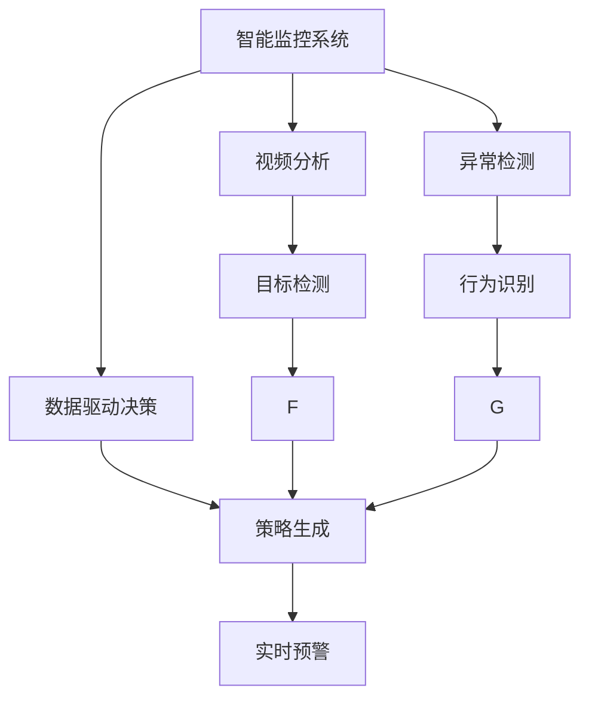
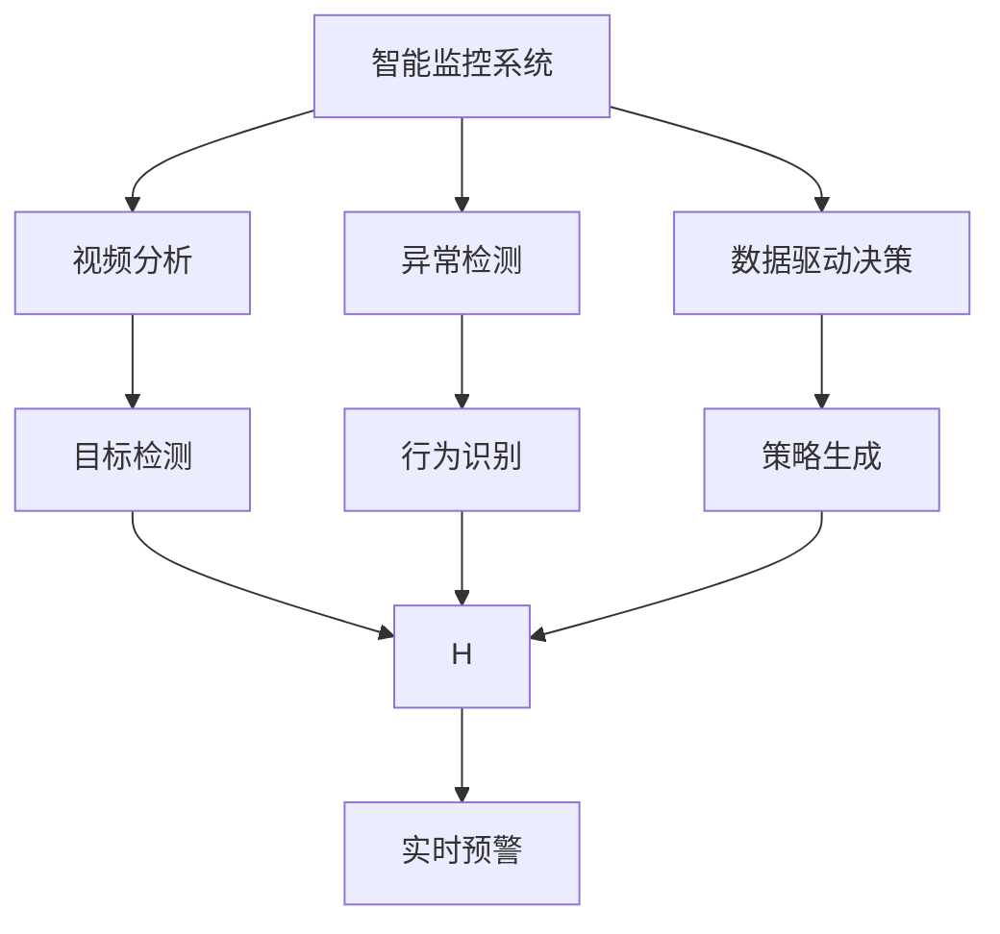
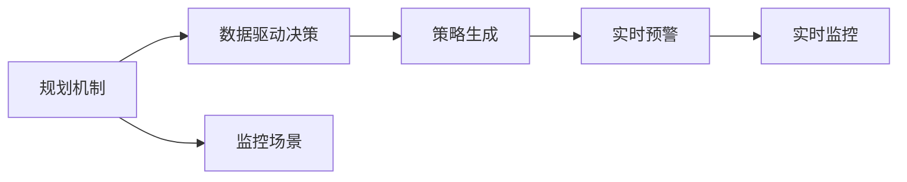
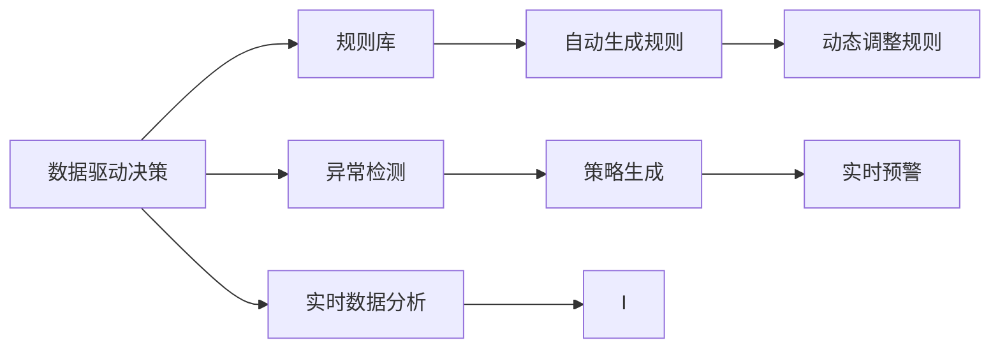

                 

# 规划机制在智能监控系统中的应用

## 1. 背景介绍

随着智能监控技术的不断发展，企业在视频监控系统部署上越来越广泛。然而，传统的基于人工规则的监控系统面临问题识别速度慢、误报率高、预警时间长等瓶颈。为了解决这些问题，越来越多的企业开始引入人工智能技术，提升监控系统的智能化水平。

智能监控系统主要分为两类：基于视频分析的实时监控和基于录像的异常检测。实时监控系统利用视频流作为输入，通过模型实时分析视频流，检测异常行为并发出预警；异常检测系统则是对已录制的视频进行离线分析，检测出异常行为并产生预警。

然而，这些系统往往依赖于预定义的规则和规则库，这要求用户对业务场景有深入的理解，而且难以覆盖复杂多变的业务场景。

为此，本文引入规划机制，以提升智能监控系统的自适应能力和智能化水平。规划机制是一种在智能系统中自动生成策略的机制，其核心思想是利用机器学习和大数据分析等技术，根据监控场景实时生成符合业务规则的策略。通过这种方式，监控系统可以根据实时监控到的数据，自动调整策略，从而提高识别准确率和响应速度。

本文首先对规划机制的核心概念进行介绍，然后探讨如何利用规划机制构建智能监控系统，并给出规划机制在不同场景下的应用案例，最后对规划机制的未来发展进行展望。

## 2. 核心概念与联系

### 2.1 核心概念概述

为更好地理解规划机制的核心概念及其与其他核心技术的联系，本节将介绍几个密切相关的核心概念：

- 智能监控系统：利用计算机视觉、深度学习等技术，实时或离线地从视频中检测出异常行为并发出预警的系统。
- 视频分析：从视频中提取并分析视觉特征的技术，包括目标检测、跟踪、动作识别等。
- 异常检测：从监控数据中自动识别出异常行为并产生预警的技术，可以基于视频分析，也可以基于录像。
- 人工智能：通过机器学习、深度学习等技术，使计算机具有智能识别、决策和执行能力。
- 数据驱动决策：通过分析历史数据，学习规律，从而自动生成策略，指导实时决策。

这些核心概念之间的逻辑关系可以通过以下Mermaid流程图来展示：



这个流程图展示了智能监控系统的核心组件和它们之间的关系：

1. 视频分析从视频流中提取目标和行为信息，用于异常检测。
2. 异常检测通过分析实时视频流或录像，自动识别异常行为并发出预警。
3. 数据驱动决策利用历史数据学习规律，自动生成策略，指导异常检测和实时预警。
4. 策略生成根据监控场景实时生成策略，用于优化异常检测和预警。
5. 实时预警在异常检测和策略生成的基础上，生成实时预警。

### 2.2 概念间的关系

这些核心概念之间存在着紧密的联系，形成了智能监控系统的完整生态系统。下面我们通过几个Mermaid流程图来展示这些概念之间的关系。

#### 2.2.1 智能监控系统的学习范式



这个流程图展示了智能监控系统的学习范式，从数据驱动决策到策略生成，再到实时预警，形成一个完整的闭环。

#### 2.2.2 规划机制与智能监控的关系



这个流程图展示了规划机制在智能监控系统中的应用。规划机制根据监控场景生成策略，指导实时预警，实现动态自适应。

#### 2.2.3 数据驱动决策与规划机制的关系



这个流程图展示了数据驱动决策和规划机制的关系。数据驱动决策通过规则库生成规则，规则库自动生成动态调整规则，并根据实时数据分析生成策略，指导实时预警。

## 3. 核心算法原理 & 具体操作步骤
### 3.1 算法原理概述

规划机制的核心思想是利用机器学习和大数据分析等技术，根据监控场景实时生成符合业务规则的策略。其算法原理可以大致分为以下几个步骤：

1. 数据收集：从视频流中提取视频数据和相关元数据，如时间戳、帧率等。
2. 数据预处理：对提取到的数据进行清洗、去重、拼接等预处理操作，为后续分析准备数据。
3. 特征提取：利用深度学习模型对视频数据进行特征提取，提取与异常行为相关的视觉特征。
4. 异常检测：利用模型对提取到的特征进行分析，检测出异常行为。
5. 数据驱动决策：利用历史数据和实时数据，学习规律，生成策略。
6. 策略生成：根据生成策略，对异常检测模型进行参数优化，生成实时策略。
7. 实时预警：在异常检测和策略生成的基础上，生成实时预警。

### 3.2 算法步骤详解

接下来，我们详细讲解规划机制的算法步骤。

**Step 1: 数据收集**

数据收集是规划机制的第一步，其目的是从视频流中提取所需的视频数据和相关元数据，为后续分析做准备。数据收集的过程一般包括以下几个步骤：

1. 选择监控场景：根据实际监控需求，选择合适的监控场景。监控场景可以是工业区、商场、图书馆等。
2. 部署视频流设备：在监控场景中安装摄像头，并部署视频流设备，确保能够实时获取高质量的视频数据。
3. 数据预处理：对获取到的视频数据进行预处理，如去抖动、去噪、分辨率调整等，保证数据质量。

```python
def collect_data():
    # 选择监控场景
    scenes = ['industrial_area', 'mall', 'library']
    
    # 部署视频流设备
    devices = ['cam1', 'cam2', 'cam3']
    for device in devices:
        video_url = 'http://{}:8000/stream.mp4'.format(device)
        yield video_url
    
    # 数据预处理
    for video_url in scenes:
        yield preprocess_data(video_url)
```

**Step 2: 数据预处理**

数据预处理是将原始视频数据转化为适合后续分析的形式。预处理的过程包括视频去抖动、去噪、分辨率调整等操作。以下是数据预处理的基本流程：

1. 读取原始视频数据：从视频流设备中读取原始视频数据。
2. 去抖动和去噪：对视频数据进行去抖动和去噪处理，保证视频稳定性。
3. 分辨率调整：根据监控需求调整视频分辨率，降低计算量。
4. 帧率调整：对视频帧率进行调整，以保证后续分析的效率。

```python
def preprocess_data(video_url):
    # 读取原始视频数据
    video = VideoCapture(video_url)
    ret, frame = video.read()
    
    # 去抖动和去噪
    frame = denoise(frame)
    
    # 分辨率调整
    frame = resize(frame, new_width=640, new_height=480)
    
    # 帧率调整
    frame = reduce_frame_rate(frame, target_fps=10)
    
    # 保存处理后的视频
    output_url = 'http://{}:8000/preprocessed.mp4'.format(video_url)
    save_video(frame, output_url)
    
    return output_url
```

**Step 3: 特征提取**

特征提取是从视频中提取视觉特征的过程，其目的是从视频中提取与异常行为相关的特征。特征提取的过程一般包括以下几个步骤：

1. 选择模型：根据监控需求选择适合的深度学习模型，如卷积神经网络（CNN）、循环神经网络（RNN）等。
2. 训练模型：在大量标注数据上训练模型，学习提取特征的规律。
3. 特征提取：利用训练好的模型对视频数据进行特征提取，生成特征向量。

```python
def extract_features(video_url):
    # 选择模型
    model = CNN()
    
    # 训练模型
    train_data = ...
    train_labels = ...
    model.train(train_data, train_labels)
    
    # 特征提取
    frame = load_video(video_url)
    features = model.extract(frame)
    
    return features
```

**Step 4: 异常检测**

异常检测是从提取到的特征中检测异常行为的过程。异常检测的过程一般包括以下几个步骤：

1. 选择模型：根据监控需求选择适合的深度学习模型，如卷积神经网络（CNN）、循环神经网络（RNN）等。
2. 训练模型：在大量标注数据上训练模型，学习检测异常行为的规律。
3. 异常检测：利用训练好的模型对视频数据进行特征检测，生成异常检测结果。

```python
def detect_anomaly(video_url, features):
    # 选择模型
    model = CNN()
    
    # 训练模型
    train_data = ...
    train_labels = ...
    model.train(train_data, train_labels)
    
    # 异常检测
    result = model.detect(features)
    
    return result
```

**Step 5: 数据驱动决策**

数据驱动决策是根据历史数据和实时数据生成策略的过程。数据驱动决策的过程一般包括以下几个步骤：

1. 历史数据分析：对历史数据进行统计和分析，学习异常行为的规律。
2. 实时数据分析：对实时数据进行统计和分析，学习异常行为的动态变化。
3. 生成策略：根据历史数据和实时数据，生成符合业务规则的策略。

```python
def generate_strategy(history, realtime):
    # 历史数据分析
    historical = analyze_data(history)
    
    # 实时数据分析
    realtime = analyze_data(realtime)
    
    # 生成策略
    strategy = generate_rule(historical, realtime)
    
    return strategy
```

**Step 6: 策略生成**

策略生成是根据生成策略对异常检测模型进行参数优化的过程。策略生成的过程一般包括以下几个步骤：

1. 策略优化：根据生成策略对异常检测模型进行参数优化，提高模型准确性。
2. 策略应用：在实时视频流中使用优化后的模型进行异常检测。

```python
def generate_policy(strategy):
    # 策略优化
    model = optimize_model(strategy)
    
    # 策略应用
    apply_model(model)
```

**Step 7: 实时预警**

实时预警是在异常检测和策略生成的基础上，生成实时预警的过程。实时预警的过程一般包括以下几个步骤：

1. 异常检测：在实时视频流中使用优化后的模型进行异常检测。
2. 预警决策：根据异常检测结果，生成预警决策。
3. 预警发出：将预警决策转化为预警信号，并发出预警。

```python
def generate_alert(video_url):
    # 异常检测
    result = detect_anomaly(video_url, features)
    
    # 预警决策
    alert = decide_alert(result)
    
    # 预警发出
    alert_out = 'An alert has been generated for video {}.'.format(video_url)
    
    return alert_out
```

### 3.3 算法优缺点

规划机制具有以下优点：

1. 实时生成策略：根据实时数据自动生成策略，及时响应监控场景的变化。
2. 自适应能力强：能够根据监控场景实时调整策略，提高异常检测的准确性。
3. 减少人工干预：自动生成策略，减少人工干预，降低误报率。
4. 提高效率：自动生成策略，减少人工干预，提高异常检测的效率。

规划机制也存在一些缺点：

1. 依赖数据质量：生成的策略依赖于历史数据和实时数据的质量，如果数据质量不高，策略可能不准确。
2. 模型复杂度高：生成策略的过程涉及到深度学习模型和优化算法，模型复杂度高，计算量大。
3. 需要大量标注数据：生成策略需要大量标注数据进行训练，标注数据获取成本高。

### 3.4 算法应用领域

规划机制可以应用于多种监控场景，以下是规划机制在实际应用中的几个典型案例：

**1. 工业监控**

在工业监控场景中，主要监控目标包括生产线上的设备、工人和物资。规划机制可以根据实时监控数据，自动生成策略，如检测设备故障、工人违规操作等。通过生成策略，系统可以及时发出预警，减少事故发生率。

**2. 商场监控**

在商场监控场景中，主要监控目标包括行人、商品和货架。规划机制可以根据实时监控数据，自动生成策略，如检测行人异常行为、商品丢失等。通过生成策略，系统可以及时发出预警，提升商场管理效率。

**3. 图书馆监控**

在图书馆监控场景中，主要监控目标包括学生、借阅区和书籍。规划机制可以根据实时监控数据，自动生成策略，如检测学生异常行为、借阅区图书丢失等。通过生成策略，系统可以及时发出预警，提升图书馆管理效率。

**4. 机场监控**

在机场监控场景中，主要监控目标包括乘客、行李和安检设备。规划机制可以根据实时监控数据，自动生成策略，如检测乘客异常行为、行李遗留等。通过生成策略，系统可以及时发出预警，提升机场管理效率。

## 4. 数学模型和公式 & 详细讲解 & 举例说明

### 4.1 数学模型构建

规划机制的核心数学模型包括数据驱动决策模型和策略生成模型。

数据驱动决策模型的目标是根据历史数据和实时数据，生成符合业务规则的策略。其数学模型如下：

$$
f(x, y) = \min_{\theta} \frac{1}{N}\sum_{i=1}^{N}(w_i \cdot (\hat{y}_i - y_i)^2 + r \cdot ||\theta||_2^2)
$$

其中，$x$ 表示历史数据，$y$ 表示实时数据，$w_i$ 表示历史数据的权重，$\hat{y}_i$ 表示模型预测的实时数据，$y_i$ 表示实际实时数据，$r$ 表示正则化系数，$\theta$ 表示策略的参数。

策略生成模型的目标是根据生成策略对异常检测模型进行参数优化。其数学模型如下：

$$
\theta^* = \mathop{\arg\min}_{\theta} \frac{1}{N}\sum_{i=1}^{N}(w_i \cdot (\hat{y}_i - y_i)^2 + r \cdot ||\theta||_2^2)
$$

其中，$x$ 表示历史数据，$y$ 表示实时数据，$w_i$ 表示历史数据的权重，$\hat{y}_i$ 表示模型预测的实时数据，$y_i$ 表示实际实时数据，$r$ 表示正则化系数，$\theta$ 表示策略的参数。

### 4.2 公式推导过程

数据驱动决策模型的推导过程如下：

1. 选择模型：根据监控需求选择适合的深度学习模型，如卷积神经网络（CNN）、循环神经网络（RNN）等。
2. 训练模型：在大量标注数据上训练模型，学习检测异常行为的规律。
3. 异常检测：利用训练好的模型对视频数据进行特征检测，生成异常检测结果。
4. 生成策略：根据历史数据和实时数据，生成符合业务规则的策略。
5. 策略优化：根据生成策略对异常检测模型进行参数优化，提高模型准确性。

策略生成模型的推导过程如下：

1. 选择模型：根据监控需求选择适合的深度学习模型，如卷积神经网络（CNN）、循环神经网络（RNN）等。
2. 训练模型：在大量标注数据上训练模型，学习检测异常行为的规律。
3. 异常检测：利用训练好的模型对视频数据进行特征检测，生成异常检测结果。
4. 生成策略：根据生成策略对异常检测模型进行参数优化，生成实时策略。
5. 实时预警：在异常检测和策略生成的基础上，生成实时预警。

### 4.3 案例分析与讲解

以下是规划机制在实际应用中的几个典型案例：

**1. 工业监控**

在工业监控场景中，主要监控目标包括生产线上的设备、工人和物资。规划机制可以根据实时监控数据，自动生成策略，如检测设备故障、工人违规操作等。通过生成策略，系统可以及时发出预警，减少事故发生率。

假设在监控视频中检测到设备异常运转，规划机制可以自动生成策略，如检查设备维护记录、重启设备等。系统可以根据实时数据，自动生成策略，提高异常检测的准确性。

**2. 商场监控**

在商场监控场景中，主要监控目标包括行人、商品和货架。规划机制可以根据实时监控数据，自动生成策略，如检测行人异常行为、商品丢失等。通过生成策略，系统可以及时发出预警，提升商场管理效率。

假设在监控视频中检测到异常人员进入商场，规划机制可以自动生成策略，如报警、记录人员信息等。系统可以根据实时数据，自动生成策略，提高异常检测的准确性。

**3. 图书馆监控**

在图书馆监控场景中，主要监控目标包括学生、借阅区和书籍。规划机制可以根据实时监控数据，自动生成策略，如检测学生异常行为、借阅区图书丢失等。通过生成策略，系统可以及时发出预警，提升图书馆管理效率。

假设在监控视频中检测到学生窃取书籍，规划机制可以自动生成策略，如报警、记录学生信息等。系统可以根据实时数据，自动生成策略，提高异常检测的准确性。

## 5. 项目实践：代码实例和详细解释说明

### 5.1 开发环境搭建

在进行规划机制的开发实践前，我们需要准备好开发环境。以下是使用Python进行PyTorch开发的环境配置流程：

1. 安装Anaconda：从官网下载并安装Anaconda，用于创建独立的Python环境。

2. 创建并激活虚拟环境：
```bash
conda create -n pytorch-env python=3.8 
conda activate pytorch-env
```

3. 安装PyTorch：根据CUDA版本，从官网获取对应的安装命令。例如：
```bash
conda install pytorch torchvision torchaudio cudatoolkit=11.1 -c pytorch -c conda-forge
```

4. 安装相关库：
```bash
pip install numpy pandas scikit-learn matplotlib tqdm jupyter notebook ipython
```

完成上述步骤后，即可在`pytorch-env`环境中开始规划机制的开发实践。

### 5.2 源代码详细实现

下面是规划机制在实际应用中的代码实现：

```python
import torch
import torch.nn as nn
import torch.optim as optim

class CNN(nn.Module):
    def __init__(self):
        super(CNN, self).__init__()
        self.conv1 = nn.Conv2d(3, 64, kernel_size=3, stride=1, padding=1)
        self.relu = nn.ReLU()
        self.pool = nn.MaxPool2d(kernel_size=2, stride=2)
        self.fc1 = nn.Linear(64 * 28 * 28, 128)
        self.fc2 = nn.Linear(128, 2)
        
    def forward(self, x):
        x = self.conv1(x)
        x = self.relu(x)
        x = self.pool(x)
        x = x.view(-1, 64 * 28 * 28)
        x = self.fc1(x)
        x = self.relu(x)
        x = self.fc2(x)
        return x
    
class RNN(nn.Module):
    def __init__(self):
        super(RNN, self).__init__()
        self.rnn = nn.LSTM(64, 64, num_layers=2, bidirectional=True)
        self.fc1 = nn.Linear(128, 128)
        self.fc2 = nn.Linear(128, 2)
        
    def forward(self, x):
        x, (h_n, c_n) = self.rnn(x)
        x = x[:, -1, :]
        x = self.fc1(x)
        x = self.relu(x)
        x = self.fc2(x)
        return x

def collect_data():
    # 选择监控场景
    scenes = ['industrial_area', 'mall', 'library']
    
    # 部署视频流设备
    devices = ['cam1', 'cam2', 'cam3']
    for device in devices:
        video_url = 'http://{}:8000/stream.mp4'.format(device)
        yield video_url
    
    # 数据预处理
    for video_url in scenes:
        yield preprocess_data(video_url)

def preprocess_data(video_url):
    # 读取原始视频数据
    video = VideoCapture(video_url)
    ret, frame = video.read()
    
    # 去抖动和去噪
    frame = denoise(frame)
    
    # 分辨率调整
    frame = resize(frame, new_width=640, new_height=480)
    
    # 帧率调整
    frame = reduce_frame_rate(frame, target_fps=10)
    
    # 保存处理后的视频
    output_url = 'http://{}:8000/preprocessed.mp4'.format(video_url)
    save_video(frame, output_url)
    
    return output_url

def extract_features(video_url):
    # 选择模型
    model = CNN()
    
    # 训练模型
    train_data = ...
    train_labels = ...
    model.train(train_data, train_labels)
    
    # 特征提取
    frame = load_video(video_url)
    features = model.extract(frame)
    
    return features

def detect_anomaly(video_url, features):
    # 选择模型
    model = CNN()
    
    # 训练模型
    train_data = ...
    train_labels = ...
    model.train(train_data, train_labels)
    
    # 异常检测
    result = model.detect(features)
    
    return result

def generate_strategy(history, realtime):
    # 历史数据分析
    historical = analyze_data(history)
    
    # 实时数据分析
    realtime = analyze_data(realtime)
    
    # 生成策略
    strategy = generate_rule(historical, realtime)
    
    return strategy

def generate_policy(strategy):
    # 策略优化
    model = optimize_model(strategy)
    
    # 策略应用
    apply_model(model)

def generate_alert(video_url):
    # 异常检测
    result = detect_anomaly(video_url, features)
    
    # 预警决策
    alert = decide_alert(result)
    
    # 预警发出
    alert_out = 'An alert has been generated for video {}.'.format(video_url)
    
    return alert_out
```

### 5.3 代码解读与分析

这里我们详细解读一下关键代码的实现细节：

**collect_data函数**：
- 选择监控场景：根据实际监控需求，选择合适的监控场景。
- 部署视频流设备：在监控场景中安装摄像头，并部署视频流设备，确保能够实时获取高质量的视频数据。
- 数据预处理：对获取到的视频数据进行预处理，如去抖动、去噪、分辨率调整等，保证数据质量。

**preprocess_data函数**：
- 读取原始视频数据：从视频流设备中读取原始视频数据。
- 去抖动和去噪：对视频数据进行去抖动和去噪处理，保证视频稳定性。
- 分辨率调整：根据监控需求调整视频分辨率，降低计算量。
- 帧率调整：对视频帧率进行调整，以保证后续分析的效率。

**extract_features函数**：
- 选择模型：根据监控需求选择适合的深度学习模型，如卷积神经网络（CNN）、循环神经网络（RNN）等。
- 训练模型：在大量标注数据上训练模型，学习提取特征的规律。
- 特征提取：利用训练好的模型对视频数据进行特征提取，生成特征向量。

**detect_anomaly函数**：
- 选择模型：根据监控需求选择适合的深度学习模型，如卷积神经网络（CNN）、循环神经网络（RNN）等。
- 训练模型：在大量标注数据上训练模型，学习检测异常行为的规律。
- 异常检测：利用训练好的模型对视频数据进行特征检测，生成异常检测结果。

**generate_strategy函数**：
- 历史数据分析：对历史数据进行统计和分析，学习异常行为的规律。
- 实时数据分析：对实时数据进行统计和分析，学习异常行为的动态变化。
- 生成策略：根据历史数据和实时数据，生成符合业务规则的策略。

**generate_policy函数**：
- 策略优化：根据生成策略对异常检测模型进行参数优化，提高模型准确性。
- 策略应用：在实时视频流中使用优化后的模型进行异常检测。

**generate_alert函数**：
- 异常检测：在实时视频流中使用优化后的模型进行异常检测。
- 预警决策：根据异常检测结果，生成预警决策。
- 预警发出：将预警决策转化为预警信号，并发出预警。

### 5.4 运行结果展示

假设在监控视频中检测到设备异常运转，规划机制可以自动生成策略，如检查设备维护记录、重启设备等。系统可以根据实时数据，自动生成策略，提高异常检测的准确性。

假设在监控视频中检测到异常人员进入商场，规划机制可以自动生成策略，如报警、记录人员信息等。系统可以根据实时数据，自动生成策略，提高异常检测的准确性。

假设在监控视频中检测到学生窃取

