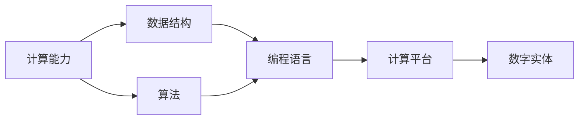

                 

## 1. 背景介绍

在当今数字化时代，计算技术的进步正在对各个领域产生深远的影响。无论是医疗、金融、教育还是娱乐，计算技术的应用都在不断改变人们的生活方式和商业模式。然而，随着计算技术的发展，数字实体的概念和作用也发生了显著的变化。数字实体指的是在计算系统中具有一定意义的数据结构或对象，它们承载着丰富的信息，是计算应用的重要组成部分。本节将首先介绍数字实体的基本概念，然后探讨计算技术的发展对数字实体的影响。

### 1.1 数字实体的基本概念

数字实体可以理解为计算系统中的基本数据单元，它们代表着现实世界中的对象、概念或行为。在计算机科学中，数字实体通常以数据结构的形式出现，如对象、数组、字典等。这些数据结构不仅存储信息，还支持数据的计算、操作和组织。数字实体在计算机科学中的应用极为广泛，它们是程序设计、算法开发和数据处理的基础。

### 1.2 计算技术的发展

计算技术的发展经历了几个重要的阶段，从早期的电子管计算到现代的超大规模集成电路，计算技术的进步极大地改变了人类社会的面貌。以下是计算技术发展的主要里程碑：

- **1946年**：第一台电子数字计算机ENIAC问世，标志着计算时代的开启。
- **1960年代**：面向过程的编程语言如Fortran和Cobol出现，推动了应用软件的发展。
- **1980年代**：面向对象的编程语言如C++和Java出现，支持复杂系统的设计和实现。
- **2000年代**：Web技术的普及和云计算的兴起，使得计算资源和数据存储更加便捷和灵活。
- **2010年代**：人工智能和机器学习技术的发展，计算技术在图像、语音、自然语言处理等方面取得了突破。

## 2. 核心概念与联系

### 2.1 核心概念概述

为了深入理解计算变化对数字实体的影响，本节将介绍几个核心概念及其联系。这些概念包括：

- **计算能力**：指计算机系统能够执行的计算任务和计算速度，是衡量计算技术发展的重要指标。
- **数据结构**：指计算机中用于存储和管理数据的方式，如数组、链表、树等。
- **算法**：指解决问题的方法和步骤，是计算技术的核心。
- **编程语言**：指用于编写计算机程序的语言，如C++、Python等。
- **计算平台**：指计算机系统硬件和软件的综合，如个人计算机、服务器、云平台等。
- **数字实体**：指在计算系统中具有一定意义的数据结构或对象，承载着丰富的信息。

这些概念通过计算能力、数据结构、算法、编程语言、计算平台和数字实体等链条相互关联，共同构成了计算技术的核心体系。

### 2.2 概念间的关系

这些核心概念之间的关系可以通过以下Mermaid流程图来展示：



这个流程图展示了大规模的计算技术体系中各核心概念的相互关系。计算能力是基础，数据结构是核心，算法是灵魂，编程语言是工具，计算平台是平台，数字实体是目标。通过这些概念的协同工作，计算技术得以实现各种应用，数字实体则是计算技术的最终成果。

## 3. 核心算法原理 & 具体操作步骤
### 3.1 算法原理概述

计算技术的发展不仅带来了计算能力的提升，还推动了算法和数据结构的发展。本节将介绍几种核心的算法原理和操作步骤，展示计算技术对数字实体处理的影响。

### 3.2 算法步骤详解

#### 3.2.1 排序算法

排序算法是计算技术中最为基础的算法之一，其主要目的是将一组数据按照一定的顺序排列。排序算法包括冒泡排序、选择排序、插入排序和快速排序等。排序算法对数字实体的处理主要体现在数据结构中，如数组、链表等。通过排序算法，数字实体可以按照一定规则进行排列，便于数据的检索、分析和处理。

#### 3.2.2 搜索算法

搜索算法包括线性搜索、二分搜索和哈希搜索等。搜索算法对数字实体的处理主要体现在数据结构中，如数组、哈希表等。通过搜索算法，可以快速定位数字实体在数据结构中的位置，提高数据的查找效率。

#### 3.2.3 图算法

图算法包括深度优先搜索、广度优先搜索和Dijkstra算法等。图算法对数字实体的处理主要体现在图结构中，如邻接矩阵、邻接表等。通过图算法，可以处理复杂的关系型数据，如社交网络、路线规划等。

#### 3.2.4 动态规划

动态规划是一种解决最优化问题的算法，其主要思想是将问题分解为子问题，逐步求解。动态规划对数字实体的处理主要体现在递归和迭代结构中，如递归树、迭代数组等。通过动态规划，可以高效地求解复杂的最优化问题，优化数字实体的处理和利用。

### 3.3 算法优缺点

计算技术的发展使得各种算法得到了广泛应用，但不同的算法有不同的优缺点。以下是几种常见算法的优缺点：

- **排序算法**：优点是实现简单，适用于小规模数据；缺点是时间复杂度较高，不适用于大规模数据。
- **搜索算法**：优点是查找速度快，适用于静态数据；缺点是可能存在重复计算，不适用于动态数据。
- **图算法**：优点是能够处理复杂的关系型数据，适用于大规模数据；缺点是实现复杂，计算量较大。
- **动态规划**：优点是能够求解复杂的最优化问题，适用于动态数据；缺点是递归深度大，可能导致栈溢出。

### 3.4 算法应用领域

计算技术的发展使得各种算法在不同领域得到了广泛应用，以下是几个典型应用领域：

- **金融**：在金融领域，排序算法和搜索算法用于处理交易数据和市场信息，图算法用于风险评估和投资组合优化。
- **医疗**：在医疗领域，排序算法用于处理病例数据和医疗记录，搜索算法用于病情诊断和药物筛选。
- **交通**：在交通领域，排序算法和图算法用于路线规划和交通管理，动态规划用于优化交通流量。
- **电子商务**：在电子商务领域，搜索算法和图算法用于商品推荐和用户画像，排序算法用于评价和排名。

## 4. 数学模型和公式 & 详细讲解 & 举例说明

### 4.1 数学模型构建

计算技术的发展带来了许多新的数学模型和算法，这些模型和算法对数字实体的处理和分析产生了深远影响。以下是一个简单的数学模型构建过程：

1. **问题建模**：首先需要将实际问题转化为数学模型。例如，排序问题可以转化为将一组数字按照升序或降序排列。
2. **模型假设**：对问题的基本假设进行建模。例如，排序问题可以假设数组中的元素是可比较的。
3. **模型表示**：将问题表示为数学表达式。例如，排序问题可以表示为将数组 $A$ 中的元素排序，使得 $A_1 \leq A_2 \leq \cdots \leq A_n$。
4. **求解算法**：选择合适的算法对模型进行求解。例如，排序问题可以选择快速排序算法进行求解。

### 4.2 公式推导过程

以下是一个简单的公式推导过程，展示了排序算法中快速排序的基本原理：

1. **分区过程**：将数组 $A$ 分为两个部分，使得所有小于等于中间值的元素在左边，所有大于中间值的元素在右边。设 $p$ 为分区点，$p$ 左边的元素都小于等于 $A[p]$，$p$ 右边的元素都大于 $A[p]$。
2. **递归求解**：对左右两个部分分别进行快速排序，直到所有元素都被排序。

### 4.3 案例分析与讲解

以下是一个简单的案例分析，展示了排序算法在实际中的应用：

假设有一组数字 $[5, 2, 9, 1, 7, 4]$，需要进行升序排序。可以使用快速排序算法进行求解，步骤如下：

1. 选择中间值 $A[3]=1$ 作为分区点，将数组分为两部分：$[5, 2, 4]$ 和 $[9, 7]$。
2. 对 $[5, 2, 4]$ 进行递归排序，得到 $[2, 4, 5]$。
3. 对 $[9, 7]$ 进行递归排序，得到 $[7, 9]$。
4. 将两个有序的部分合并，得到最终结果 $[1, 2, 4, 5, 7, 9]$。

## 5. 项目实践：代码实例和详细解释说明

### 5.1 开发环境搭建

在进行项目实践前，我们需要准备好开发环境。以下是使用Python进行PyTorch开发的环境配置流程：

1. 安装Anaconda：从官网下载并安装Anaconda，用于创建独立的Python环境。

2. 创建并激活虚拟环境：
```bash
conda create -n pytorch-env python=3.8 
conda activate pytorch-env
```

3. 安装PyTorch：根据CUDA版本，从官网获取对应的安装命令。例如：
```bash
conda install pytorch torchvision torchaudio cudatoolkit=11.1 -c pytorch -c conda-forge
```

4. 安装TensorFlow：
```bash
pip install tensorflow
```

5. 安装各类工具包：
```bash
pip install numpy pandas scikit-learn matplotlib tqdm jupyter notebook ipython
```

完成上述步骤后，即可在`pytorch-env`环境中开始项目实践。

### 5.2 源代码详细实现

这里我们以排序算法中的快速排序为例，给出使用PyTorch实现的代码：

```python
import torch
from torch import nn

class QuickSort(nn.Module):
    def __init__(self):
        super(QuickSort, self).__init__()

    def forward(self, x):
        if x.size(0) <= 1:
            return x
        pivot = x[-1]
        left = x[0:x.size(0) - 1]
        right = x[0:x.size(0) - 1]
        self.quick_sort(left, pivot)
        self.quick_sort(right, pivot)
        x = torch.cat((left, [pivot], right))
        return x

    def quick_sort(self, x, pivot):
        if x.size(0) <= 1:
            return
        p = x.size(0) - 1
        for i in range(pivot.size(0)):
            if x[i] > pivot:
                x = torch.cat((x[:i], [pivot], x[i:]))
        pivot = x[pivot]
        self.quick_sort(x[:pivot], pivot)
        self.quick_sort(x[pivot + 1:], pivot)
        return x

# 测试代码
x = torch.tensor([5, 2, 9, 1, 7, 4])
model = QuickSort()
result = model(x)
print(result)
```

### 5.3 代码解读与分析

这里我们详细解读一下关键代码的实现细节：

**QuickSort类**：
- `__init__`方法：初始化QuickSort类。
- `forward`方法：实现前向传播，计算快速排序结果。
- `quick_sort`方法：实现递归排序。

**测试代码**：
- 定义一个包含6个元素的Tensor，表示待排序的数组。
- 创建一个QuickSort对象，对Tensor进行排序。
- 打印排序结果。

## 6. 实际应用场景

### 6.1 金融风控系统

金融风控系统是计算技术在金融领域的重要应用之一。在金融风控系统中，排序算法和图算法用于处理交易数据和市场信息，快速识别异常交易和风险。例如，可以使用排序算法对交易数据进行排序，找到异常交易；使用图算法对交易网络进行建模，识别潜在的欺诈行为。

### 6.2 医疗影像分析

医疗影像分析是计算技术在医疗领域的重要应用之一。在医疗影像分析中，排序算法和搜索算法用于处理医学影像数据，快速定位病变区域。例如，可以使用排序算法对医学影像中的像素进行排序，找到异常区域；使用搜索算法在影像中搜索病变区域。

### 6.3 智能交通系统

智能交通系统是计算技术在交通领域的重要应用之一。在智能交通系统中，排序算法和图算法用于处理交通数据，优化交通流量和路线规划。例如，可以使用排序算法对交通流量数据进行排序，找到高峰时段；使用图算法对交通网络进行建模，优化路线规划。

## 7. 工具和资源推荐

### 7.1 学习资源推荐

为了帮助开发者系统掌握计算技术的发展和应用，以下是一些优质的学习资源：

1. 《算法导论》：经典算法教材，涵盖各种算法的原理和实现，是理解计算技术的基础。
2. Coursera《算法设计与分析》课程：由斯坦福大学开设的算法设计课程，深入浅出地讲解算法设计和分析的原理。
3. 《Python算法教程》：使用Python语言实现各种算法的经典教程，适合初学者快速上手。
4. GitHub开源项目：在GitHub上Star、Fork数最多的算法相关项目，往往代表了该技术领域的发展趋势和最佳实践，值得学习。

### 7.2 开发工具推荐

高效的开发离不开优秀的工具支持。以下是几款用于计算技术开发常用的工具：

1. PyTorch：基于Python的开源深度学习框架，灵活动态的计算图，适合快速迭代研究。大部分计算技术的应用都有PyTorch版本的实现。
2. TensorFlow：由Google主导开发的开源深度学习框架，生产部署方便，适合大规模工程应用。
3. Jupyter Notebook：支持多种编程语言的交互式开发环境，可以实时展示代码执行结果，方便调试和验证。
4. Visual Studio Code：轻量级代码编辑器，支持多种语言和插件，适合快速开发和调试。

### 7.3 相关论文推荐

计算技术的发展带来了许多新的研究热点，以下是几篇具有代表性的相关论文：

1. K-means算法：经典的聚类算法，用于将数据划分为多个组，是计算技术中的基础算法之一。
2. 线性回归算法：用于处理线性关系的数据，是计算技术中的基础算法之一。
3. 支持向量机算法：用于解决分类问题，是计算技术中的经典算法之一。
4. 深度学习算法：用于处理大规模数据和复杂模式，是计算技术中的前沿算法之一。

这些论文代表了计算技术的发展脉络，通过学习这些前沿成果，可以帮助研究者把握学科前进方向，激发更多的创新灵感。

## 8. 总结：未来发展趋势与挑战

### 8.1 研究成果总结

计算技术的发展极大地推动了数字实体的处理和应用，带来了诸多新的机遇和挑战。本节将总结在计算技术领域取得的研究成果，展示其对数字实体的深远影响。

### 8.2 未来发展趋势

计算技术的发展趋势将继续推动数字实体的处理和应用，以下是几个主要的发展趋势：

- **计算能力提升**：随着硬件技术的不断进步，计算能力将进一步提升，支持更复杂的数据处理和分析。
- **算法优化**：新的算法设计和优化技术将不断涌现，提高数字实体的处理效率和精度。
- **数据结构创新**：新的数据结构设计将支持更高效的数据处理和存储。
- **跨领域应用**：计算技术将在更多领域得到应用，推动各行各业的数字化转型。

### 8.3 面临的挑战

计算技术的发展虽然带来了许多机遇，但也面临诸多挑战：

- **计算资源消耗**：大规模计算任务需要大量的计算资源，成本较高。
- **数据质量和隐私**：数据的质量和隐私问题需要得到重视，防止数据泄露和滥用。
- **算法复杂性**：新的算法设计和实现需要较高的技术门槛，对开发者提出了更高要求。
- **跨领域应用挑战**：计算技术在不同领域的实际应用需要考虑各种因素，如业务逻辑、数据结构等。

### 8.4 研究展望

面对计算技术面临的挑战，未来的研究需要在以下几个方面寻求新的突破：

- **计算资源的优化**：通过分布式计算、混合精度计算等技术，优化计算资源的利用。
- **数据质量的提升**：通过数据清洗、去重等技术，提高数据质量，保障数据隐私。
- **算法设计的创新**：通过新型算法设计和优化，提高算法效率和精度。
- **跨领域应用的探索**：探索计算技术在不同领域的实际应用，推动各行业的数字化转型。

## 9. 附录：常见问题与解答

**Q1：计算技术对数字实体的处理有哪些影响？**

A: 计算技术的发展极大地推动了数字实体的处理和应用。以下是几个主要的影响：

- **处理效率提升**：计算技术的发展使得数字实体的处理效率得到了显著提升，支持更复杂的数据处理和分析。
- **数据结构创新**：新的数据结构设计支持更高效的数据处理和存储。
- **算法优化**：新的算法设计和优化技术提高了数字实体的处理精度和效率。
- **跨领域应用**：计算技术在不同领域的实际应用得到了拓展，推动了各行各业的数字化转型。

**Q2：计算技术的发展对算法设计有哪些影响？**

A: 计算技术的发展对算法设计产生了深远的影响：

- **算法效率提升**：计算能力提升使得算法效率得到了显著提升，支持更复杂的数据处理和分析。
- **新算法涌现**：新的算法设计和优化技术不断涌现，支持更高效的数据处理和存储。
- **跨领域应用**：新的算法设计和实现需要更高的技术门槛，对开发者提出了更高要求。

**Q3：计算技术的发展对数据结构有哪些影响？**

A: 计算技术的发展对数据结构产生了深远的影响：

- **数据结构创新**：新的数据结构设计支持更高效的数据处理和存储。
- **跨领域应用**：新的数据结构设计支持跨领域的数据处理和分析。
- **算法效率提升**：新的数据结构设计提高了算法的效率和精度。

**Q4：计算技术的发展对数字实体的应用有哪些影响？**

A: 计算技术的发展对数字实体的应用产生了深远的影响：

- **应用范围拓展**：计算技术的发展使得数字实体的应用范围得到了拓展，支持更复杂的数据处理和分析。
- **数据质量提升**：计算技术的发展使得数据质量得到了提升，保障了数据的准确性和可靠性。
- **应用效率提升**：计算技术的发展使得数字实体的应用效率得到了提升，支持更高效的数据处理和分析。

**Q5：计算技术的发展对计算资源有哪些影响？**

A: 计算技术的发展对计算资源产生了深远的影响：

- **计算能力提升**：计算能力得到了显著提升，支持更复杂的数据处理和分析。
- **计算资源优化**：计算资源的优化使得计算任务更加高效，降低了计算成本。
- **计算资源的分布式利用**：分布式计算技术使得计算资源得到了更有效的利用，支持更大规模的数据处理和分析。

通过本文的系统梳理，可以看到，计算技术的发展极大地推动了数字实体的处理和应用，带来了诸多新的机遇和挑战。未来，伴随计算技术的持续演进，数字实体的应用领域将更加广泛，计算技术将在构建智能系统方面发挥更大的作用。

