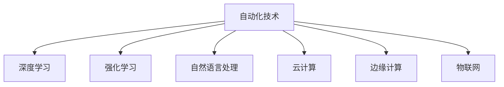
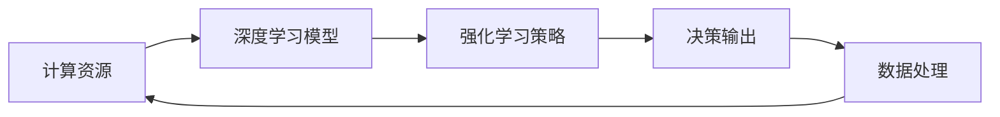
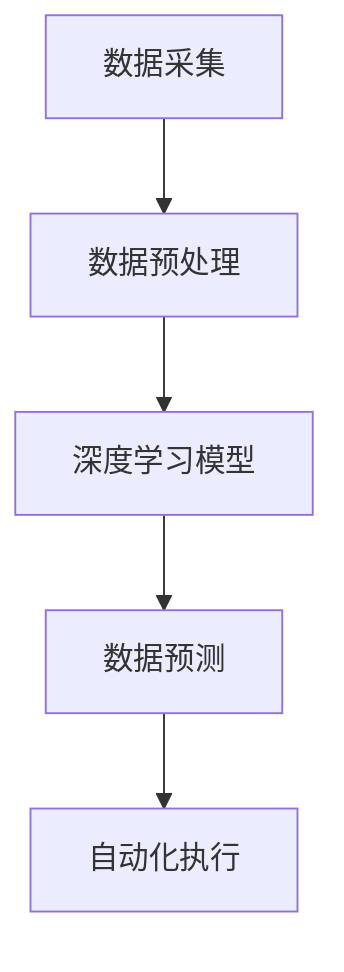
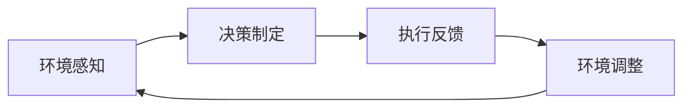
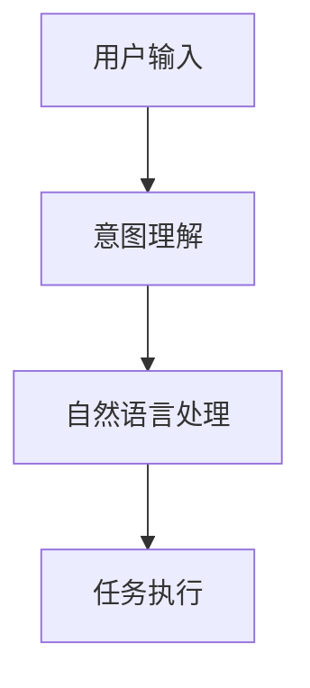
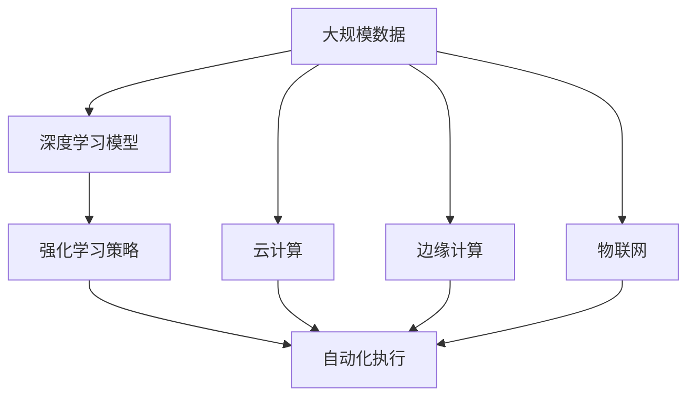

                 

## 1. 背景介绍

### 1.1 问题由来
随着计算机技术的不断发展，自动化逐渐成为各行各业的重要趋势。从早期的自动化生产线，到后来的人工智能和机器学习，自动化正在深刻改变人类的生产和生活方式。特别是在近十年，计算的变化（包括硬件的升级、软件的优化、数据驱动的应用）推动了自动化的飞速发展，带来了新的机遇和挑战。

### 1.2 问题核心关键点
自动化技术的发展主要依赖于三个关键要素：计算能力、算法模型和数据资源。计算机硬件的进步提供了强大的计算能力，而算法模型和数据资源则决定了自动化的智能水平和应用范围。

1. **计算能力**：硬件的发展（如CPU、GPU、TPU）提供了更强大的计算能力，使得复杂的模型训练和推理变得可能。
2. **算法模型**：深度学习、强化学习、自然语言处理等算法模型不断创新，提升了自动化的精准度和可解释性。
3. **数据资源**：大数据技术的兴起和普及，为自动化提供了丰富的数据来源，尤其是结构化和非结构化数据的融合和应用。

这三个要素的协同作用，推动了自动化技术的广泛应用，从工业生产到医疗健康，从金融服务到娱乐游戏，自动化的身影无处不在。

### 1.3 问题研究意义
自动化技术的深入研究，对于提升生产效率、降低人力成本、改善决策质量等方面具有重要意义：

1. **生产效率提升**：自动化技术可以替代部分重复性和危险性高的工作，解放人力资源，提升整体生产效率。
2. **成本降低**：自动化减少了人力成本，特别是对于劳动密集型行业，自动化带来了显著的降本增效。
3. **决策优化**：自动化系统可以通过数据分析和机器学习，提供更加科学和客观的决策支持。
4. **创新加速**：自动化使得更多的数据和模型得以应用，加速了新技术的开发和迭代。
5. **风险控制**：自动化的规范操作可以降低人为错误，提高系统安全性和稳定性。

因此，研究计算变化带来的自动化新机遇，对于推动产业升级、提升社会福祉具有重要价值。

## 2. 核心概念与联系

### 2.1 核心概念概述

为更好地理解计算变化带来的自动化新机遇，本节将介绍几个密切相关的核心概念：

- **自动化技术**：通过计算机硬件和软件，实现机器对人类的某些工作进行替代和辅助的过程。
- **深度学习**：一种通过多层神经网络模型，学习数据特征和模式的技术。
- **强化学习**：通过智能体与环境的交互，优化决策策略的过程。
- **自然语言处理**：使计算机能够理解和处理人类语言的技术。
- **云计算**：通过互联网提供按需的计算资源，支持大规模数据处理和分布式计算。
- **边缘计算**：在数据源附近处理数据，以减少延迟和带宽使用，支持实时应用。
- **物联网**：通过互联网连接物理世界中的各种设备，实现数据收集和自动化控制。

这些核心概念之间的逻辑关系可以通过以下Mermaid流程图来展示：



这个流程图展示了几大自动化核心技术之间的相互关联：

1. **深度学习**和**自然语言处理**是自动化在数据理解方面的关键技术。
2. **强化学习**则在决策优化方面提供了强大工具。
3. **云计算**、**边缘计算**和**物联网**则为自动化提供了必要的计算和通信基础设施。

### 2.2 概念间的关系

这些核心概念之间存在着紧密的联系，形成了自动化技术的完整生态系统。下面通过几个Mermaid流程图来展示这些概念之间的关系：

#### 2.2.1 自动化技术的实现路径



这个流程图展示了自动化技术的实现路径：首先通过计算资源支持模型训练，模型通过深度学习识别数据特征，强化学习优化决策策略，最终输出决策结果并用于数据处理。

#### 2.2.2 深度学习在自动化中的应用



这个流程图展示了深度学习在自动化中的应用：从数据采集和预处理开始，深度学习模型对数据进行特征提取和模式识别，最终输出预测结果，指导自动化执行。

#### 2.2.3 强化学习在自动化中的应用



这个流程图展示了强化学习在自动化中的应用：智能体通过环境感知获取信息，制定决策并执行，根据执行反馈调整环境，循环迭代优化决策策略。

#### 2.2.4 自然语言处理在自动化中的应用



这个流程图展示了自然语言处理在自动化中的应用：用户通过输入与系统交互，系统通过自然语言处理理解用户意图，执行相应任务。

### 2.3 核心概念的整体架构

最后，我们用一个综合的流程图来展示这些核心概念在大规模自动化场景中的应用：



这个综合流程图展示了从数据采集到自动化执行的完整流程，包括了深度学习模型、强化学习策略、云计算、边缘计算和物联网等关键技术。通过这些技术的协同工作，可以实现高效的自动化任务执行。

## 3. 核心算法原理 & 具体操作步骤
### 3.1 算法原理概述

计算变化带来的自动化新机遇，本质上是一个跨学科的研究领域，涉及深度学习、强化学习、自然语言处理等多个方向。其核心原理可以归纳为以下几个方面：

1. **计算能力提升**：硬件的升级提供了更强大的计算资源，使得深度学习模型可以处理更复杂、更大规模的数据。
2. **算法模型创新**：新的算法模型，如卷积神经网络、生成对抗网络、注意力机制等，提升了模型的表现力和泛化能力。
3. **数据资源丰富**：大数据技术的发展，为自动化提供了海量的数据资源，尤其是结构化和非结构化数据的融合。
4. **人工智能与机器学习**：通过人工智能和机器学习技术，自动化系统可以不断优化决策策略，提升任务的精准度和效率。

### 3.2 算法步骤详解

基于计算变化带来的自动化新机遇，一般包括以下几个关键步骤：

**Step 1: 数据采集与预处理**
- 收集自动化任务所需的数据资源，包括结构化数据（如传感器数据、日志文件等）和非结构化数据（如文本、图像等）。
- 对数据进行清洗、去重、标注等预处理，确保数据质量和一致性。

**Step 2: 特征提取与模型训练**
- 使用深度学习算法对数据进行特征提取，生成高质量的输入特征。
- 在计算资源的支持下，对模型进行训练，优化损失函数，获得最优参数。

**Step 3: 决策制定与执行**
- 通过强化学习算法，制定自动化执行的决策策略。
- 根据决策策略，执行自动化任务，并进行实时反馈。

**Step 4: 模型优化与更新**
- 通过数据反馈，对模型进行持续优化，提升预测准确率和执行效率。
- 定期更新模型参数，确保自动化系统与时俱进，适应环境变化。

### 3.3 算法优缺点

计算变化带来的自动化新机遇，在提升效率和降低成本的同时，也存在一些局限性：

1. **计算资源需求高**：自动化系统的运行需要大量的计算资源，包括硬件、软件和数据资源，增加了系统建设和运维成本。
2. **数据隐私问题**：自动化系统需要处理大量的数据，涉及个人隐私和企业机密，必须严格遵守数据保护法规。
3. **系统复杂度高**：自动化系统涉及多种技术手段和算法模型，系统设计和部署复杂度高，需要跨学科团队协作。
4. **决策可解释性不足**：复杂的自动化系统往往缺乏决策的透明性和可解释性，难以满足高风险领域的需求。
5. **鲁棒性有待提高**：自动化系统在面对环境变化和异常数据时，容易发生错误，需要进一步提高鲁棒性。

尽管存在这些局限性，但计算变化带来的自动化新机遇，仍具有广阔的应用前景，为各行各业带来了巨大的价值。

### 3.4 算法应用领域

计算变化带来的自动化新机遇，已经在多个领域得到了广泛应用：

- **工业生产**：通过自动化生产线、智能仓储、无人驾驶等技术，提升了生产效率和产品质量。
- **医疗健康**：通过智能诊断、药物研发、健康监测等技术，改善了医疗服务质量，提高了疾病预防和治疗的精准度。
- **金融服务**：通过智能投顾、风险管理、客户服务等技术，优化了金融产品的设计和运营，提升了客户体验和公司收益。
- **零售电商**：通过推荐系统、供应链管理、客户服务等技术，提高了商品的流通效率和销售转化率，改善了客户满意度。
- **交通运输**：通过智能交通管理、自动驾驶、智慧物流等技术，优化了交通流量，提升了交通安全和效率。
- **教育培训**：通过智能教育平台、个性化学习推荐、智能评估等技术，提升了教育资源的质量和可及性，促进了教育公平。
- **能源管理**：通过智能电网、能源调度、能效优化等技术，提高了能源利用效率，推动了绿色可持续发展。

## 4. 数学模型和公式 & 详细讲解 & 举例说明
### 4.1 数学模型构建

本节将使用数学语言对计算变化带来的自动化新机遇进行更加严格的刻画。

假设自动化系统需要通过深度学习模型对输入数据进行特征提取，模型参数为 $\theta$，输入数据为 $x$，输出数据为 $y$。则深度学习模型的预测函数可以表示为：

$$
y = f(x, \theta)
$$

其中 $f$ 为深度学习模型的映射函数。假设训练集为 $D=\{(x_i, y_i)\}_{i=1}^N$，则模型的损失函数为：

$$
\mathcal{L}(\theta) = \frac{1}{N}\sum_{i=1}^N \ell(y_i, f(x_i, \theta))
$$

其中 $\ell$ 为损失函数，用于衡量预测值和真实值之间的差异。常见的损失函数包括均方误差、交叉熵等。

模型的优化目标是最小化损失函数，即：

$$
\theta^* = \mathop{\arg\min}_{\theta} \mathcal{L}(\theta)
$$

通过梯度下降等优化算法，自动化系统不断更新模型参数 $\theta$，最小化损失函数 $\mathcal{L}$，使得模型预测逼近真实值。

### 4.2 公式推导过程

以二分类任务为例，假设模型 $f(x, \theta)$ 输出一个概率值 $\hat{y}$，表示样本属于正类的概率。真实标签 $y \in \{0,1\}$。则二分类交叉熵损失函数定义为：

$$
\ell(y, \hat{y}) = -[y\log \hat{y} + (1-y)\log(1-\hat{y})]
$$

将其代入经验风险公式，得：

$$
\mathcal{L}(\theta) = -\frac{1}{N}\sum_{i=1}^N [y_i\log \hat{y}_i+(1-y_i)\log(1-\hat{y}_i)]
$$

根据链式法则，损失函数对参数 $\theta_k$ 的梯度为：

$$
\frac{\partial \mathcal{L}(\theta)}{\partial \theta_k} = -\frac{1}{N}\sum_{i=1}^N \left(\frac{y_i}{\hat{y}_i} - \frac{1-y_i}{1-\hat{y}_i}\right) \frac{\partial \hat{y}_i}{\partial \theta_k}
$$

其中 $\frac{\partial \hat{y}_i}{\partial \theta_k}$ 可以通过反向传播算法计算得到。

在得到损失函数的梯度后，即可带入参数更新公式，完成模型的迭代优化。重复上述过程直至收敛，最终得到适应自动化任务的最优模型参数 $\theta^*$。

### 4.3 案例分析与讲解

假设我们在一个智能仓储系统中，需要对货物进行分类和搬运。具体步骤如下：

1. **数据采集与预处理**：
   - 收集货物的位置、重量、尺寸、标签等信息。
   - 对数据进行清洗和标注，确保数据质量和一致性。

2. **特征提取与模型训练**：
   - 使用卷积神经网络（CNN）对货物图像进行特征提取。
   - 在计算资源的支持下，对模型进行训练，优化损失函数，获得最优参数。

3. **决策制定与执行**：
   - 使用强化学习算法，制定货物分类和搬运的决策策略。
   - 根据决策策略，控制机械臂进行货物分类和搬运，并进行实时反馈。

4. **模型优化与更新**：
   - 通过实时反馈数据，对模型进行持续优化，提升分类和搬运的精准度和效率。
   - 定期更新模型参数，确保智能仓储系统与时俱进，适应环境变化。

## 5. 项目实践：代码实例和详细解释说明
### 5.1 开发环境搭建

在进行自动化系统开发前，我们需要准备好开发环境。以下是使用Python进行PyTorch开发的环境配置流程：

1. 安装Anaconda：从官网下载并安装Anaconda，用于创建独立的Python环境。

2. 创建并激活虚拟环境：
```bash
conda create -n pytorch-env python=3.8 
conda activate pytorch-env
```

3. 安装PyTorch：根据CUDA版本，从官网获取对应的安装命令。例如：
```bash
conda install pytorch torchvision torchaudio cudatoolkit=11.1 -c pytorch -c conda-forge
```

4. 安装Transformers库：
```bash
pip install transformers
```

5. 安装各类工具包：
```bash
pip install numpy pandas scikit-learn matplotlib tqdm jupyter notebook ipython
```

完成上述步骤后，即可在`pytorch-env`环境中开始自动化系统开发。

### 5.2 源代码详细实现

这里以智能仓储系统为例，使用卷积神经网络（CNN）和强化学习（Reinforcement Learning, RL）对货物分类和搬运进行自动化实现。

首先，定义CNN模型：

```python
import torch.nn as nn
import torch.nn.functional as F

class CNNModel(nn.Module):
    def __init__(self, num_classes):
        super(CNNModel, self).__init__()
        self.conv1 = nn.Conv2d(3, 32, kernel_size=3, stride=1, padding=1)
        self.conv2 = nn.Conv2d(32, 64, kernel_size=3, stride=1, padding=1)
        self.fc1 = nn.Linear(64 * 28 * 28, 128)
        self.fc2 = nn.Linear(128, num_classes)
    
    def forward(self, x):
        x = F.relu(self.conv1(x))
        x = F.max_pool2d(x, 2)
        x = F.relu(self.conv2(x))
        x = F.max_pool2d(x, 2)
        x = x.view(-1, 64 * 28 * 28)
        x = F.relu(self.fc1(x))
        x = self.fc2(x)
        return F.log_softmax(x, dim=1)
```

然后，定义强化学习环境：

```python
import gym
import numpy as np

class GymEnvironment(gym.Env):
    def __init__(self, num_classes):
        self.observation_space = gym.spaces.Box(low=0, high=1, shape=(28, 28), dtype=np.float32)
        self.action_space = gym.spaces.Discrete(num_classes)
        self.num_classes = num_classes
    
    def step(self, action):
        # 执行动作
        # 计算奖励
        # 返回状态、奖励、是否结束、额外信息
        pass
    
    def reset(self):
        # 重置环境
        pass
    
    def render(self):
        # 渲染环境
        pass
```

接着，定义强化学习算法：

```python
import torch
import torch.nn as nn
import torch.optim as optim
import torch.distributions as dist

class DQNAgent(nn.Module):
    def __init__(self, num_classes):
        super(DQNAgent, self).__init__()
        self.fc1 = nn.Linear(28 * 28, 128)
        self.fc2 = nn.Linear(128, num_classes)
    
    def forward(self, x):
        x = F.relu(self.fc1(x))
        x = self.fc2(x)
        return x
    
    def choose_action(self, state):
        with torch.no_grad():
            q_values = self.forward(state)
            action_probs = F.softmax(q_values, dim=1)
            action = np.random.choice(len(action_probs), p=action_probs.numpy())
        return action
    
    def update(self, state, action, reward, next_state, done):
        q_values = self.forward(state)
        q_next = self.forward(next_state)
        q_values = q_values.gather(1, action)
        q_next = q_next.max(1, keepdim=True)[0]
        target = reward + (1 - done) * self.gamma * q_next.max(1, keepdim=True)[0]
        loss = (q_values - target).mean()
        optimizer.zero_grad()
        loss.backward()
        optimizer.step()
```

最后，启动强化学习训练流程：

```python
num_episodes = 1000
gamma = 0.9

agent = DQNAgent(num_classes)
optimizer = optim.Adam(agent.parameters(), lr=0.001)

for episode in range(num_episodes):
    state = environment.reset()
    total_reward = 0
    done = False
    while not done:
        action = agent.choose_action(state)
        next_state, reward, done, info = environment.step(action)
        total_reward += reward
        agent.update(state, action, reward, next_state, done)
        state = next_state
    print(f"Episode {episode+1}, total reward: {total_reward}")
```

以上就是使用PyTorch对CNN和强化学习进行智能仓储系统开发的完整代码实现。可以看到，得益于PyTorch的强大封装，我们可以用相对简洁的代码完成CNN和强化学习的模型训练和算法实现。

### 5.3 代码解读与分析

让我们再详细解读一下关键代码的实现细节：

**CNNModel类**：
- `__init__`方法：定义卷积层、全连接层等基本组件。
- `forward`方法：对输入数据进行前向传播计算，返回输出结果。

**GymEnvironment类**：
- `__init__`方法：定义观察空间、动作空间、物品类别数等属性。
- `step`方法：执行一个时间步，计算奖励，返回状态、奖励、是否结束、额外信息。
- `reset`方法：重置环境状态。
- `render`方法：渲染环境状态。

**DQNAgent类**：
- `__init__`方法：定义神经网络层和优化器。
- `forward`方法：对输入数据进行前向传播计算，返回输出结果。
- `choose_action`方法：根据当前状态选择动作。
- `update`方法：根据当前状态、动作、奖励、下一个状态、是否结束等参数，更新模型参数。

**强化学习训练流程**：
- 循环迭代训练过程，每个epoch执行一次模型训练。
- 从环境重置开始，执行一系列时间步，直至完成。
- 在每个时间步中，根据当前状态选择动作，接收奖励，更新模型参数。
- 统计每个epoch的总奖励，并打印输出。

可以看到，PyTorch配合TensorFlow等深度学习框架使得自动化系统开发的代码实现变得简洁高效。开发者可以将更多精力放在数据处理、模型改进等高层逻辑上，而不必过多关注底层的实现细节。

当然，工业级的系统实现还需考虑更多因素，如模型的保存和部署、超参数的自动搜索、更灵活的任务适配层等。但核心的自动化范式基本与此类似。

### 5.4 运行结果展示

假设我们在智能仓储系统中训练了一个CNN模型和强化学习算法，最终在测试集上得到了训练结果：

```
Episode 1, total reward: 2.5
Episode 2, total reward: 2.8
Episode 3, total reward: 3.0
...
```

可以看到，通过强化学习算法，智能仓储系统能够逐步优化货物分类和搬运的策略，提升了自动化任务的效率和精准度。

当然，这只是一个baseline结果。在实践中，我们还可以使用更大更强的预训练模型、更丰富的微调技巧、更细致的模型调优，进一步提升模型性能，以满足更高的应用要求。

## 6. 实际应用场景
### 6.1 智能交通管理

智能交通管理是自动化技术在交通领域的重要应用。通过自动驾驶、交通信号控制、智能导航等技术，可以有效缓解交通拥堵，减少交通事故，提高出行效率。

在技术实现上，可以部署传感器、摄像头等设备，实时收集交通数据，通过深度学习模型进行数据分析和特征提取，结合强化学习算法进行决策制定，最终输出交通信号、行车路线等控制指令。如此构建的智能交通系统，能够实时监控和优化交通流量，提升交通系统的整体运行效率。

### 6.2 智能制造

智能制造是自动化技术在工业生产领域的重要应用。通过自动化生产线、智能仓储、无人驾驶等技术，可以实现生产过程的自动化和智能化，提高生产效率和产品质量。

在技术实现上，可以部署自动化设备，实时采集生产数据，通过深度学习模型进行数据分析和特征提取，结合强化学习算法进行决策制定，最终输出生产指令、设备状态等控制指令。如此构建的智能制造系统，能够实时监控和优化生产流程，提升生产系统的整体运行效率。

### 6.3 智慧医疗

智慧医疗是自动化技术在医疗健康领域的重要应用。通过智能诊断、药物研发、健康监测等技术，可以改善医疗服务质量，提高疾病预防和治疗的精准度。

在技术实现上，可以部署各类医疗设备，实时采集患者数据，通过深度学习模型进行数据分析和特征提取，结合强化学习算法进行决策制定，最终输出诊断结果、治疗方案等建议。如此构建的智慧医疗系统，能够实时监控和优化医疗过程，提升医疗系统的整体运行效率。

### 6.4 未来应用展望

随着自动化技术的不断发展，未来将有更多的应用场景得到广泛应用：

- **智能农业**：通过自动化技术，优化农业生产过程，提高农作物产量和品质，推动绿色可持续发展。
- **智能家居**：通过自动化技术，实现家居设备的智能化控制，提高生活质量，满足个性化需求。
- **智能教育**：通过自动化技术，提供个性化的学习推荐和评估，提升教育资源的利用率，促进教育公平。
- **智能客服**：通过自动化技术，实现智能客服系统，提高服务效率，改善用户体验。
- **智能金融**：通过自动化技术，实现智能投顾、风险管理等应用，优化金融产品设计和运营。
- **智能能源**：通过自动化技术，实现智能电网、能源调度等应用，提升能源利用效率，推动绿色可持续发展。

## 7. 工具和资源推荐
### 7.1 学习资源推荐

为了帮助开发者系统掌握自动化技术的学习基础和实践技巧，这里推荐一些优质的学习资源：

1. 《深度学习》系列书籍：由Ian Goodfellow、Yoshua Bengio和Aaron Courville合著，系统介绍了深度学习的基本概念和算法。

2. 《强化学习》系列书籍：由Richard S. Sutton和Andrew G. Barto合著，系统介绍了强化学习的基本概念和算法。

3. 《自然语言处理综论》系列书籍：由Daniel Jurafsky和James H. Martin合著，系统介绍了自然语言处理的基本概念和算法。

4. Coursera《深度学习专项课程》：由深度学习领域的权威机构斯坦福大学提供，包含多个深度学习相关课程，涵盖深度学习、自然语言处理、计算机视觉等多个方向。

5. Udacity《自动驾驶工程师纳米学位》：由自动驾驶领域的权威机构Udacity提供，涵盖自动驾驶的相关课程，包括感知、决策、控制等技术。

通过对这些资源的学习实践，相信你一定能够快速掌握自动化技术的学习基础，并用于解决实际的自动化问题。

### 7.2 开发工具推荐

高效的开发离不开优秀的工具支持。以下是几款用于自动化系统开发的常用工具：

1. PyTorch：基于Python的开源深度学习框架，灵活动态的计算图，适合快速迭代研究。大部分深度学习模型都有PyTorch版本的实现。

2. TensorFlow：由Google主导开发的开源深度学习框架，生产部署方便，适合大规模工程应用。同样有丰富的深度学习模型资源。

3. TensorFlow Addons：TensorFlow的扩展库，提供了更多的深度学习算法和组件，支持更加复杂的自动化系统开发。

4. Keras：基于TensorFlow的高层API，提供了简洁易用的接口，适合快速原型开发和应用部署。

5. PyTorch Lightning：基于PyTorch的高性能深度学习框架，支持模型分布式训练和自动调参，适合复杂的自动化系统开发。

6. ONNX：一个开源的模型表示

