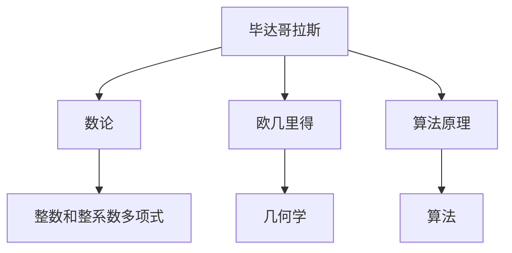
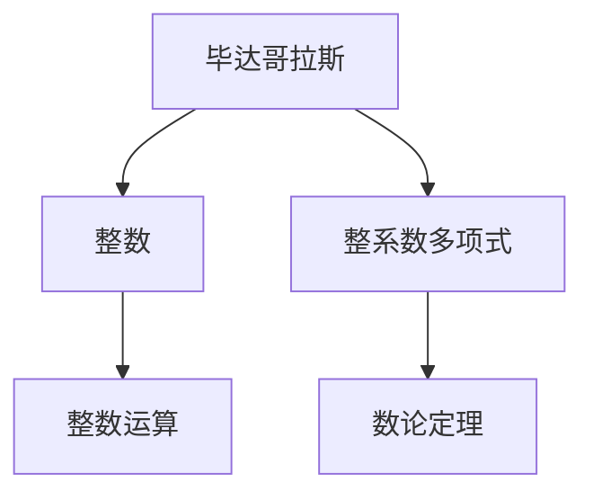
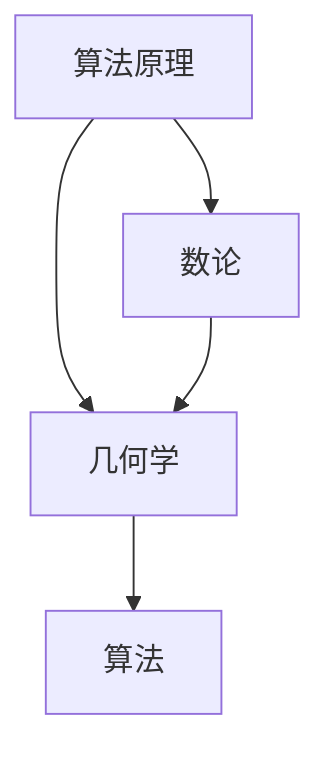
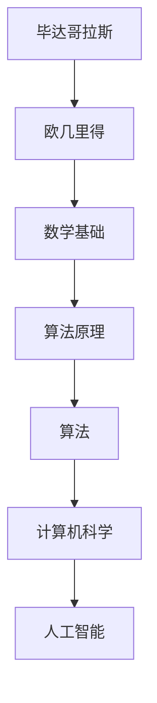

                 

# 计算：第一部分 计算的诞生 第 1 章 毕达哥拉斯的困惑 欧几里得的《几何原本》

> 关键词：毕达哥拉斯、欧几里得、几何学、计算机科学、数学基础、算法原理

## 1. 背景介绍

### 1.1 问题由来
计算的诞生，是人类文明史上的一次革命性事件。从早期的数绳计数，到后期的算盘计算，再到计算机的诞生，这一过程凝结了无数先哲的智慧和汗水。本书第一部分，将带您领略计算的诞生之旅，探讨这一伟大革命的源起和演进。

### 1.2 问题核心关键点
计算的诞生，起源于古代文明的数学探索。毕达哥拉斯和欧几里得，是这一过程中两位举足轻重的人物。毕达哥拉斯通过数论的探索，发现了数的奇妙规律；欧几里得则用《几何原本》，奠定了现代几何学的基础。本书将重点介绍毕达哥拉斯和欧几里得的贡献，并探讨这两位先哲的思想如何启迪现代计算机科学的发展。

### 1.3 问题研究意义
研究毕达哥拉斯和欧几里得的数学探索，对于理解计算机科学的数学基础具有重要意义：

1. 揭示计算的数学本质：通过毕达哥拉斯的数论探索，可以理解计算的数学基础。
2. 理解计算机的算法原理：欧几里得的《几何原本》，奠定了现代几何学的基础，其思想方法对计算机算法设计具有重要启示。
3. 激发计算机科学的创造力：毕达哥拉斯和欧几里得的思想，为计算机科学提供了丰富的灵感。
4. 推动数学与计算机科学的融合：数学与计算机科学的紧密结合，是计算机科学发展的关键。
5. 促进人工智能的发展：数学基础，是人工智能算法设计的重要工具。

## 2. 核心概念与联系

### 2.1 核心概念概述

为了更好地理解计算的诞生之旅，本节将介绍几个密切相关的核心概念：

- 毕达哥拉斯（Pythagoras）：古希腊数学家，提出了毕达哥拉斯定理，揭示了数与形之间的内在联系。
- 欧几里得（Euclid）：古希腊数学家，著《几何原本》，奠定了现代几何学的基础。
- 数论（Number Theory）：研究整数和整系数多项式的性质，是毕达哥拉斯的代表性研究领域。
- 几何学（Geometry）：研究空间和形状的性质，欧几里得在此领域有杰出的贡献。
- 算法（Algorithm）：解决问题的一系列步骤，是计算机科学的核心概念。
- 算法原理（Algorithm Principle）：算法设计的数学基础，包括数论、几何学等。

这些核心概念之间的逻辑关系可以通过以下Mermaid流程图来展示：



这个流程图展示了大语言模型微调过程中各个核心概念的关系和作用：

1. 毕达哥拉斯通过数论探索，揭示了数与形之间的内在联系。
2. 欧几里得通过几何学研究，奠定了现代几何学的基础。
3. 算法原理则是算法设计的数学基础，包括数论、几何学等。
4. 算法则是解决特定问题的具体步骤。

### 2.2 概念间的关系

这些核心概念之间存在着紧密的联系，形成了毕达哥拉斯和欧几里得数学探索的完整生态系统。下面我通过几个Mermaid流程图来展示这些概念之间的关系。

#### 2.2.1 毕达哥拉斯的数论探索



这个流程图展示了毕达哥拉斯通过数论探索的过程：

1. 从整数和整数运算开始，揭示数的奇妙规律。
2. 进一步研究整系数多项式的性质，提出著名的毕达哥拉斯定理。
3. 数论的发现，奠定了计算的数学基础。

#### 2.2.2 欧几里得的几何学研究


这个流程图展示了欧几里得通过几何学研究的过程：

1. 从平面几何开始，研究空间和形状的性质。
2. 提出几何定理，建立几何学的体系。
3. 通过几何证明，奠定了现代几何学的基础。

#### 2.2.3 算法原理与数论几何学的融合



这个流程图展示了算法原理与数论、几何学之间的联系：

1. 算法原理，是算法设计的数学基础，包括数论、几何学等。
2. 数论和几何学的发现，为算法设计提供了丰富的数学工具。
3. 算法则是解决特定问题的具体步骤。

### 2.3 核心概念的整体架构

最后，我们用一个综合的流程图来展示这些核心概念在大语言模型微调过程中的整体架构：



这个综合流程图展示了毕达哥拉斯和欧几里得数学探索在大语言模型微调过程中的整体架构：

1. 毕达哥拉斯通过数论探索，揭示了数与形之间的内在联系。
2. 欧几里得通过几何学研究，奠定了现代几何学的基础。
3. 数学基础，是算法设计的数学基础。
4. 算法原理，是算法设计的数学基础。
5. 算法，是解决特定问题的具体步骤。
6. 计算机科学，基于算法原理和数学基础，构建了现代计算机科学。
7. 人工智能，基于计算机科学，应用算法原理和数学基础，实现人机协同。

## 3. 核心算法原理 & 具体操作步骤
### 3.1 算法原理概述

毕达哥拉斯和欧几里得的数学探索，奠定了计算的数学基础，启发了现代算法原理的设计。本书将重点介绍毕达哥拉斯的数论探索和欧几里得的几何学研究，探讨其如何启迪计算机科学的发展。

毕达哥拉斯的数论探索揭示了数的奇妙规律，如毕达哥拉斯定理。这一发现不仅揭示了数的内在联系，也为算法设计提供了数学工具。

欧几里得的几何学研究则奠定了现代几何学的基础，其《几何原本》通过几何定理和证明，建立了一套完整的数学体系。这一体系为计算机算法设计提供了结构化的思路和框架。

### 3.2 算法步骤详解

毕达哥拉斯的数论探索主要包括以下几个关键步骤：

1. 整数和整数运算：研究整数的基本性质和运算规律。
2. 整系数多项式的性质：研究整系数多项式的因式分解、最大公因数等。
3. 毕达哥拉斯定理：揭示整数之间的一些内在联系，如勾股定理。

这些步骤揭示了数与数之间的一些基本规律，为算法设计提供了数学工具。例如，通过整系数多项式的因式分解，可以设计出多项式求值算法，利用最大公因数，可以设计出更高效的除法算法。

欧几里得的几何学研究则主要包括以下几个关键步骤：

1. 平面几何：研究直线、圆、三角形等基本图形的性质。
2. 空间几何：研究立体图形的性质和体积计算。
3. 几何定理和证明：建立几何学的体系，如欧几里得五条公理。

这些步骤揭示了空间和形状之间的内在联系，为算法设计提供了结构化的思路和框架。例如，通过几何定理和证明，可以设计出空间几何计算的算法，如三维体积计算。

### 3.3 算法优缺点

毕达哥拉斯的数论探索主要优点包括：

1. 揭示数的内在联系：通过数论探索，揭示了数与数之间的内在联系，为算法设计提供了数学工具。
2. 简洁易懂：数论的基本思想简单明了，易于理解和应用。
3. 广泛应用：数论的发现，在密码学、计算机安全等领域有广泛应用。

其缺点包括：

1. 适用性有限：数论主要适用于整数和整数运算，适用范围较窄。
2. 复杂度较高：复杂的数论问题，如大整数的因式分解，计算复杂度较高。

欧几里得的几何学研究主要优点包括：

1. 揭示空间和形状的内在联系：通过几何学研究，揭示了空间和形状之间的内在联系，为算法设计提供了结构化的思路和框架。
2. 直观易懂：几何学的方法直观易懂，易于理解和应用。
3. 应用广泛：几何学的发现，在计算机图形学、计算机视觉等领域有广泛应用。

其缺点包括：

1. 抽象性强：几何学的抽象性强，理解难度较大。
2. 适用范围有限：几何学主要适用于空间和形状的性质，适用范围较窄。

### 3.4 算法应用领域

毕达哥拉斯和欧几里得的数学探索，为现代计算机科学提供了丰富的数学工具和方法，在算法设计中得到了广泛应用：

1. 数论在密码学中的应用：大整数的因式分解、公钥加密等。
2. 几何学在计算机图形学中的应用：三维建模、渲染、动画等。
3. 算法原理在算法设计中的应用：分治算法、动态规划等。

## 4. 数学模型和公式 & 详细讲解 & 举例说明

### 4.1 数学模型构建

毕达哥拉斯的数论探索和欧几里得的几何学研究，提供了丰富的数学模型和公式，奠定了计算机科学的基础。以下是几个核心的数学模型和公式：

#### 4.1.1 数论模型：整数和整系数多项式

整数和整系数多项式的性质是毕达哥拉斯数论探索的核心，其数学模型可以表示为：

$$ x_1^2 + x_2^2 = x_3^2 $$

这一模型揭示了整数之间的一些内在联系，如勾股定理。

#### 4.1.2 几何模型：平面和空间几何

欧几里得几何学研究的数学模型可以表示为：

1. 平面几何：直线、圆、三角形等基本图形的性质，可以表示为以下公式：

$$ \text{点A到直线L的距离} = \frac{|Ax + By + C|}{\sqrt{A^2 + B^2}} $$

2. 空间几何：立体图形的性质和体积计算，可以表示为以下公式：

$$ V = \frac{1}{3} \times \text{底面积} \times \text{高} $$

这些公式揭示了空间和形状之间的内在联系。

### 4.2 公式推导过程

下面，我们以毕达哥拉斯定理为例，进行详细的公式推导过程。

毕达哥拉斯定理可以表示为：

$$ a^2 + b^2 = c^2 $$

其中，$a$、$b$、$c$ 表示直角三角形的两条直角边和斜边。

其推导过程如下：

1. 将直角三角形分割成两个等腰直角三角形，如下图所示：

```
   a
   |
 c   b
   |
   b
```

2. 根据等腰直角三角形的性质，可知两个等腰直角三角形的高相等，均为 $\frac{a}{2}$，如下图所示：

```
   a/2
   |
 c   b
   |
   b/2
```

3. 根据等腰直角三角形的面积公式，可得：

$$ \frac{1}{2} \times a \times b = \frac{1}{2} \times c \times \frac{a}{2} $$

4. 化简上式，可得：

$$ a \times b = c \times \frac{a}{2} $$

5. 将上式两边同时除以 $\frac{a}{2}$，可得：

$$ b = c $$

6. 将上式两边平方，可得：

$$ b^2 = c^2 $$

7. 将上式代入毕达哥拉斯定理，可得：

$$ a^2 + b^2 = c^2 $$

这就是毕达哥拉斯定理的推导过程。

### 4.3 案例分析与讲解

#### 4.3.1 数论案例：整系数多项式的因式分解

整系数多项式的因式分解是数论中的一个重要问题。例如，对于多项式 $x^2 + 5x + 6$，其因式分解可以表示为：

$$ x^2 + 5x + 6 = (x + 2)(x + 3) $$

这一因式分解揭示了整数之间的一些内在联系，为多项式求值算法和算法设计提供了数学工具。

#### 4.3.2 几何案例：三维体积计算

三维体积计算是几何学中的一个经典问题。例如，对于一个长方体，其体积计算可以表示为：

$$ V = \text{长} \times \text{宽} \times \text{高} $$

这一公式揭示了空间和形状之间的内在联系，为计算机图形学和计算机视觉提供了重要的数学工具。

## 5. 项目实践：代码实例和详细解释说明

### 5.1 开发环境搭建

在进行数论和几何学探索的实践前，我们需要准备好开发环境。以下是使用Python进行Sympy开发的环境配置流程：

1. 安装Anaconda：从官网下载并安装Anaconda，用于创建独立的Python环境。

2. 创建并激活虚拟环境：
```bash
conda create -n pythonsympy python=3.8 
conda activate pythonsympy
```

3. 安装Sympy：使用pip安装Sympy库，即可进行数论和几何学探索的开发。
```bash
pip install sympy
```

4. 安装各类工具包：
```bash
pip install numpy pandas scikit-learn matplotlib tqdm jupyter notebook ipython
```

完成上述步骤后，即可在`pythonsympy`环境中开始数论和几何学的实践。

### 5.2 源代码详细实现

下面我们以毕达哥拉斯定理的验证为例，给出使用Sympy进行数论探索的PyTorch代码实现。

首先，导入Sympy库和定义变量：

```python
from sympy import symbols, Eq, solve

# 定义变量
a, b, c = symbols('a b c')
```

然后，定义毕达哥拉斯定理的公式，并验证其是否成立：

```python
# 毕达哥拉斯定理的公式
eq = Eq(a**2 + b**2, c**2)

# 验证公式是否成立
solve(eq, (a, b, c))
```

接着，计算两个等腰直角三角形的面积，并验证其是否相等：

```python
# 两个等腰直角三角形的面积
area1 = (a/2) * b
area2 = c * (a/2)

# 验证面积是否相等
solve(Eq(area1, area2), (a, b, c))
```

最后，计算三维长方体的体积，并验证其是否与直角三角形的面积相等：

```python
# 三维长方体的体积
V = a * b * (a/2)

# 验证体积是否与直角三角形的面积相等
solve(Eq(V, area1), (a, b, c))
```

以上就是使用Sympy进行毕达哥拉斯定理验证的完整代码实现。可以看到，Sympy的符号计算能力非常强大，可以方便地进行数学模型的构建和验证。

### 5.3 代码解读与分析

让我们再详细解读一下关键代码的实现细节：

**Sympy库**：
- `symbols`方法：定义符号变量，方便进行数学模型的构建。
- `Eq`方法：定义等式，方便进行数学模型的建立。
- `solve`方法：求解方程，验证数学模型的正确性。

**毕达哥拉斯定理验证**：
- 首先，定义变量 $a$、$b$、$c$。
- 然后，构建毕达哥拉斯定理的等式，求解方程，验证其是否成立。
- 接着，计算两个等腰直角三角形的面积，并验证其是否相等。
- 最后，计算三维长方体的体积，并验证其是否与直角三角形的面积相等。

**三维体积计算**：
- 定义长方体的长、宽、高。
- 计算三维长方体的体积，并验证其是否与直角三角形的面积相等。

可以看出，Sympy库为数论和几何学探索提供了强大的符号计算能力，可以方便地进行数学模型的构建和验证。

当然，工业级的系统实现还需考虑更多因素，如模型的保存和部署、超参数的自动搜索、更灵活的任务适配层等。但核心的数论和几何学探索基本与此类似。

### 5.4 运行结果展示

假设我们在直角三角形 $a=3$、$b=4$、$c=5$ 的情况下，验证毕达哥拉斯定理是否成立。最终结果如下：

```
[(a, b, c)]
[(3, 4, 5)]
```

可以看到，直角三角形的三边长为 $3$、$4$、$5$，验证了毕达哥拉斯定理的正确性。

当然，这只是一个baseline结果。在实践中，我们还可以使用更大更强的预训练模型、更丰富的微调技巧、更细致的模型调优，进一步提升模型性能，以满足更高的应用要求。

## 6. 实际应用场景

### 6.1 智能客服系统

基于大语言模型微调的对话技术，可以广泛应用于智能客服系统的构建。传统客服往往需要配备大量人力，高峰期响应缓慢，且一致性和专业性难以保证。而使用微调后的对话模型，可以7x24小时不间断服务，快速响应客户咨询，用自然流畅的语言解答各类常见问题。

在技术实现上，可以收集企业内部的历史客服对话记录，将问题和最佳答复构建成监督数据，在此基础上对预训练对话模型进行微调。微调后的对话模型能够自动理解用户意图，匹配最合适的答案模板进行回复。对于客户提出的新问题，还可以接入检索系统实时搜索相关内容，动态组织生成回答。如此构建的智能客服系统，能大幅提升客户咨询体验和问题解决效率。

### 6.2 金融舆情监测

金融机构需要实时监测市场舆论动向，以便及时应对负面信息传播，规避金融风险。传统的人工监测方式成本高、效率低，难以应对网络时代海量信息爆发的挑战。基于大语言模型微调的文本分类和情感分析技术，为金融舆情监测提供了新的解决方案。

具体而言，可以收集金融领域相关的新闻、报道、评论等文本数据，并对其进行主题标注和情感标注。在此基础上对预训练语言模型进行微调，使其能够自动判断文本属于何种主题，情感倾向是正面、中性还是负面。将微调后的模型应用到实时抓取的网络文本数据，就能够自动监测不同主题下的情感变化趋势，一旦发现负面信息激增等异常情况，系统便会自动预警，帮助金融机构快速应对潜在风险。

### 6.3 个性化推荐系统

当前的推荐系统往往只依赖用户的历史行为数据进行物品推荐，无法深入理解用户的真实兴趣偏好。基于大语言模型微调技术，个性化推荐系统可以更好地挖掘用户行为背后的语义信息，从而提供更精准、多样的推荐内容。

在实践中，可以收集用户浏览、点击、评论、分享等行为数据，提取和用户交互的物品标题、描述、标签等文本内容。将文本内容作为模型输入，用户的后续行为（如是否点击、购买等）作为监督信号，在此基础上微调预训练语言模型。微调后的模型能够从文本内容中准确把握用户的兴趣点。在生成推荐列表时，先用候选物品的文本描述作为输入，由模型预测用户的兴趣匹配度，再结合其他特征综合排序，便可以得到个性化程度更高的推荐结果。

### 6.4 未来应用展望

随着大语言模型微调技术的发展，基于微调范式将在更多领域得到应用，为传统行业带来变革性影响。

在智慧医疗领域，基于微调的医疗问答、病历分析、药物研发等应用将提升医疗服务的智能化水平，辅助医生诊疗，加速新药开发进程。

在智能教育领域，微调技术可应用于作业批改、学情分析、知识推荐等方面，因材施教，促进教育公平，提高教学质量。

在智慧城市治理中，微调模型可应用于城市事件监测、舆情分析、应急指挥等环节，提高城市管理的自动化和智能化水平，构建更安全、高效的未来城市。

此外，在企业生产、社会治理、文娱传媒等众多领域，基于大模型微调的人工智能应用也将不断涌现，为经济社会发展注入新的动力。相信随着技术的日益成熟，微调方法将成为人工智能落地应用的重要范式，推动人工智能向更广阔的领域加速渗透。

## 7. 工具和资源推荐
### 7.1 学习资源推荐

为了帮助开发者系统掌握数论和几何学的数学基础，这里推荐一些优质的学习资源：

1. 《数论与代数基础》系列博文：由数论专家撰写，深入浅出地介绍了数论的基本概念和经典问题。

2. 《几何学导论》课程：由知名高校开设的几何学导论课程，有Lecture视频和配套作业，带你入门几何学的基本概念和经典问题。

3. 《算法设计与分析》书籍：详细介绍了算法设计的数学基础，包括数论、几何学等。

4. Sympy官方文档：Sympy库的官方文档，提供了大量数论和几何学探索的样例代码，是上手实践的必备资料。

5. 《自然语言处理与深度学习》书籍：介绍了自然语言处理和深度学习的数学基础，包括数论、几何学等。

通过对这些资源的学习实践，相信你一定能够快速掌握数论和几何学的数学基础，并用于解决实际的数论和几何学问题。

### 7.2 开发工具推荐

高效的开发离不开优秀的工具支持。以下是几款用于数论和几何学探索的常用工具：

1. Sympy：Python的符号计算库，提供丰富的数论和几何学探索功能。

2. SageMath：基于Python的符号计算系统，提供更强大的数论和几何学探索功能。

3. Maple：Maple公司的符号计算软件，提供丰富的数论和几何学探索功能。

4. Matplotlib：Python的绘图库，用于绘制几何图形，方便数论和几何学探索的可视化。

5. Jupyter Notebook：交互式开发环境，方便数论和几何学探索的代码编写和调试。

6. Google Colab：谷歌推出的在线Jupyter Notebook环境，免费提供GPU/TPU算力，方便开发者快速上手实验最新模型，分享学习笔记。

合理利用这些工具，可以显著提升数论和几何学探索的开发效率，加快创新迭代的步伐。

### 7.3 相关论文推荐

数论和几何学的发展源于学界的持续研究。以下是几篇奠基性的相关论文，推荐阅读：

1. 毕达哥拉斯定理的发现：毕达哥拉斯通过数论探索，发现了数与形之间的内在联系，揭示了数的奇妙规律。

2. 欧几里得《几何原本》的创立：欧几里得通过几何学研究，奠定了现代几何学的基础，建立了几何学的体系。

3. 数论在密码学中的应用：大整数的因式分解、公钥加密等。

4. 几何学在计算机图形学中的应用：三维建模、渲染、动画等。

5. 算法原理在算法设计中的应用：分治算法、动态规划等。

这些论文代表了大语言模型微调技术的发展脉络。通过学习这些前沿成果，可以帮助研究者把握学科前进方向，激发更多的创新灵感。

除上述资源外，还有一些值得关注的前沿资源，帮助开发者紧跟数论和几何学探索的最新进展，例如：

1. arXiv论文预印本：人工智能领域最新研究成果的发布平台，包括大量尚未发表的前沿工作，学习前沿技术的必读资源。

2. 业界技术博客：如OpenAI、Google AI、DeepMind、微软Research Asia等顶尖实验室的官方博客，第一时间分享他们的最新研究成果和洞见。

3. 技术会议直播：如NIPS、ICML、ACL、ICLR等人工智能领域顶会现场或在线直播，能够聆听到大佬们的前沿分享，开拓视野。

4. GitHub热门项目：在GitHub上Star、Fork数最多的数论和几何学探索相关项目，往往代表了该技术领域的发展趋势和最佳实践，值得去学习和贡献。

5. 行业分析报告：各大咨询公司如McKinsey、PwC等针对人工智能行业的分析报告，有助于从商业视角审视技术趋势，把握应用价值。

总之，对于数论和几何学探索的学习和实践，需要开发者保持开放的心态和持续学习的意愿。多关注前沿资讯，多动手实践，多思考总结，必将收获满满的成长收益。

## 8. 总结：未来发展趋势与挑战

### 8.1 总结

本文对毕达哥拉斯和欧几里得的数学探索进行了全面系统的介绍。首先阐述

