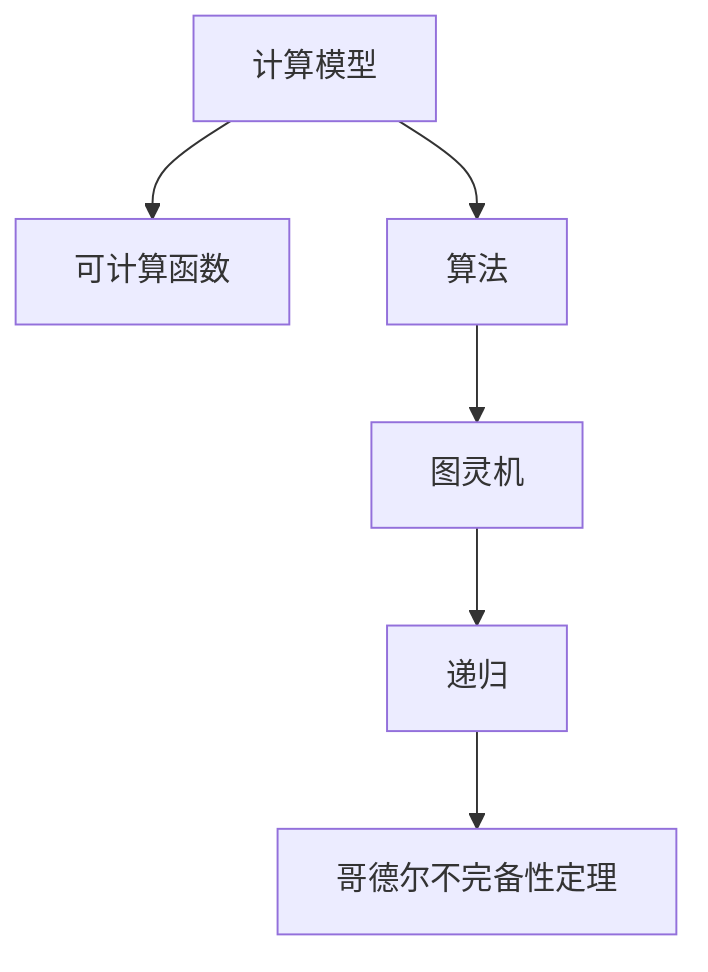
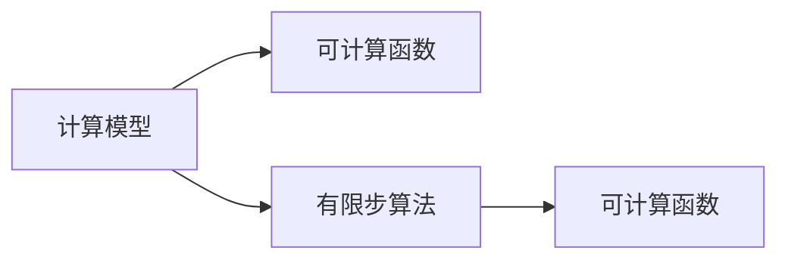
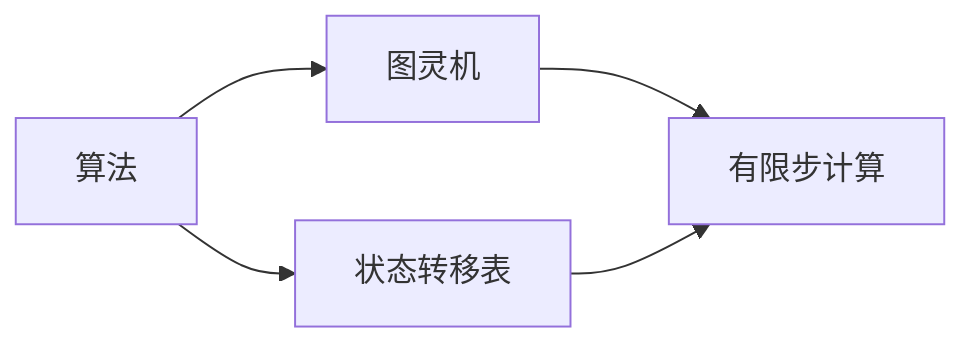
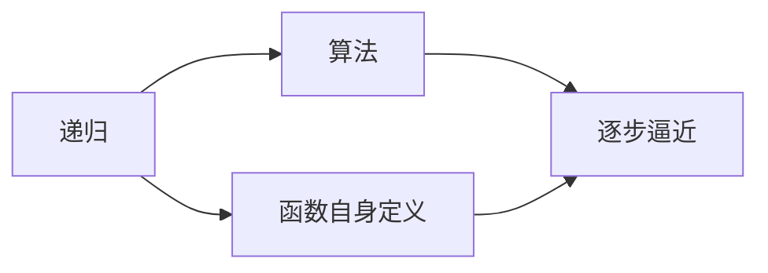
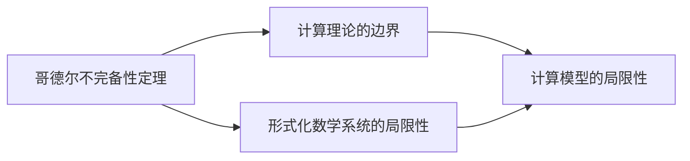
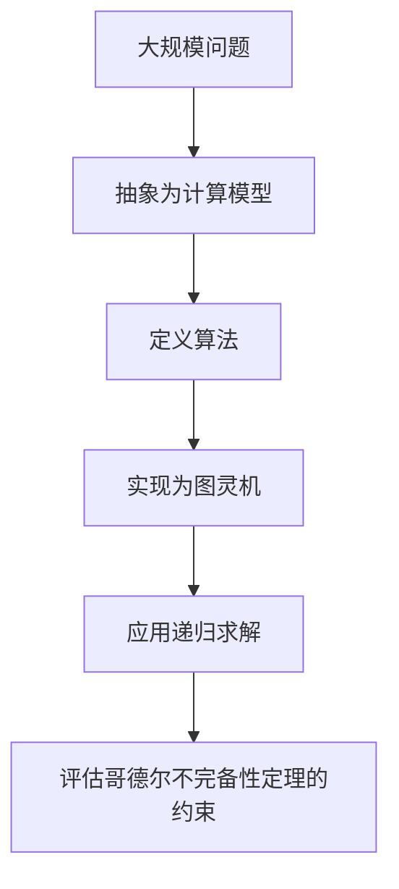

                 

# 计算：第三部分 计算理论的形成 第 6 章 计算理论的奠基：希尔伯特进路 模型化方法

> 关键词：计算理论,希尔伯特进路,模型化方法,可计算函数,算法,图灵机,递归,哥德尔不完备性定理

## 1. 背景介绍

### 1.1 问题由来

在现代计算机科学的形成过程中，计算理论的奠基工作具有至关重要的作用。这一阶段的核心任务是通过抽象和数学化的方法，定义计算的概念和能力，并探索计算的边界和极限。

计算理论的奠基工作可以追溯到20世纪初期。在1910年代，德国数学家大卫·希尔伯特(David Hilbert)提出了著名的希尔伯特计划(Hilbert's Program)，即通过定义一套明确的公理系统和逻辑推理规则，在有限的逻辑步骤内解决所有数学问题。希尔伯特计划激发了数学界对计算理论的深入研究，最终孕育了现代计算机科学的基础。

本文将详细探讨希尔伯特计划中的核心进路——模型化方法，并深入分析其对现代计算理论的深远影响。

### 1.2 问题核心关键点

模型化方法是希尔伯特计划中的一个重要组成部分，旨在通过构建与自然语言数学表达式等价的人工语言（如哥德尔逻辑系统Gödel system），将复杂的数学问题转化为可计算的形式，从而在有限的逻辑步骤内解决这些数学问题。这一方法不仅是现代计算理论的奠基石，也对计算机科学的形成与发展起到了关键的推动作用。

模型化方法的核心理念包括：

- 模型化：将复杂问题转化为简单模型。
- 算法：定义模型问题求解的算法步骤。
- 可计算性：判断问题是否可以在有限步内通过算法求解。

本文将详细分析模型化方法的核心原理、步骤以及应用，并探讨其在现代计算机科学中的重要地位和未来发展方向。

## 2. 核心概念与联系

### 2.1 核心概念概述

在模型化方法中，几个关键概念构成了其理论框架的基础：

- 计算模型（Computational Model）：如图灵机(Turing Machine)、寄存器计算机(Register Machine)等，是用于模拟计算过程的抽象模型。
- 可计算函数(Computable Function)：在给定计算模型上，能够通过有限步算法求解的函数。
- 算法(Algorithm)：解决特定问题的、明确且有限的步骤序列。
- 图灵机(Turing Machine)：一种经典的计算模型，由有限状态集、输入输出符号集和状态转移函数组成。
- 递归(Recursion)：通过函数自身的定义，逐步逼近问题的解。
- 哥德尔不完备性定理(Gödel's Incompleteness Theorems)：揭示了形式化数学系统的局限性，对计算理论的极限问题具有重要意义。

这些概念之间的逻辑关系可以通过以下Mermaid流程图来展示：



这个流程图展示了计算模型、可计算函数、算法、图灵机、递归和哥德尔不完备性定理之间的紧密联系。计算模型是可计算函数和算法的载体，图灵机是计算模型的具体实现，递归是算法的一种表现形式，而哥德尔不完备性定理揭示了计算理论的边界和局限。

### 2.2 概念间的关系

这些核心概念之间存在着紧密的联系，形成了模型化方法的理论体系。下面通过几个Mermaid流程图来展示这些概念之间的关系。

#### 2.2.1 计算模型与可计算函数的关系



这个流程图展示了计算模型和可计算函数之间的关系。在计算模型上，通过有限步算法可以定义可计算函数，即在给定输入下，模型能够输出正确的输出结果。

#### 2.2.2 算法与图灵机的关系



这个流程图展示了算法和图灵机之间的关系。算法可以转化为图灵机的状态转移表，通过图灵机的有限步计算实现算法的执行。

#### 2.2.3 递归与算法的关系



这个流程图展示了递归和算法之间的关系。递归是通过函数自身的定义，逐步逼近问题的解，是算法的一种表现形式。

#### 2.2.4 哥德尔不完备性定理与计算理论的关系



这个流程图展示了哥德尔不完备性定理与计算理论之间的关系。哥德尔不完备性定理揭示了形式化数学系统的局限性，而计算理论正是以数学表达的计算问题为基础的，因此其边界和局限性也受到哥德尔不完备性定理的约束。

### 2.3 核心概念的整体架构

最后，我们用一个综合的流程图来展示这些核心概念在大规模问题求解过程中的整体架构：



这个综合流程图展示了从大规模问题抽象到图灵机实现，再到递归求解和哥德尔不完备性定理评估的完整过程。通过这些步骤，大规模问题被逐步分解为可计算的形式，并受到哥德尔不完备性定理的约束，确保了计算理论的边界和极限。

## 3. 核心算法原理 & 具体操作步骤
### 3.1 算法原理概述

模型化方法的核心原理是通过构建与自然语言数学表达式等价的人工语言，将复杂问题转化为简单模型，并通过有限步算法求解这些模型。该方法基于以下几个关键假设：

1. 所有数学问题都可以用自然语言数学表达式来表达。
2. 自然语言数学表达式可以被等价地翻译为人工语言（如哥德尔逻辑系统）。
3. 人工语言可以被转化为计算模型（如图灵机）。
4. 计算模型可以通过有限步算法求解。

基于这些假设，模型化方法定义了从问题抽象到模型求解的完整步骤。

### 3.2 算法步骤详解

模型化方法的核心算法步骤如下：

1. **问题抽象为计算模型**：将大规模问题抽象为计算模型的输入和输出。例如，将数学问题转换为图灵机的输入和输出符号集。

2. **模型转化算法**：定义将自然语言表达式转化为计算模型的算法。例如，将自然语言数学表达式转化为哥德尔逻辑系统的算法。

3. **计算模型求解**：通过图灵机等计算模型，在有限步内求解问题。例如，使用图灵机求解哥德尔逻辑系统的命题。

4. **结果验证**：验证计算结果是否满足问题定义的输出要求。例如，检查图灵机的输出是否正确。

### 3.3 算法优缺点

模型化方法具有以下优点：

1. **形式化明确**：通过人工语言和计算模型，将问题形式化定义，使得问题求解步骤清晰明确。
2. **通用性**：适用于各种复杂问题的求解，尤其是数学问题。
3. **可验证性**：计算结果可以通过验证步骤验证，确保结果的正确性。

然而，模型化方法也存在一些局限：

1. **复杂性**：将问题抽象和转化为一阶逻辑系统，可能增加求解步骤的复杂性。
2. **效率**：求解复杂问题时，图灵机等计算模型的运行效率可能较低。
3. **局限性**：计算模型和算法的选择可能受到哥德尔不完备性定理的限制。

### 3.4 算法应用领域

模型化方法在多个领域得到了广泛应用，包括：

1. **数学计算**：将数学问题形式化为计算模型，通过有限步算法求解。
2. **算法设计**：通过构建计算模型，验证和优化算法。
3. **计算机科学**：为现代计算机科学提供理论基础，指导算法设计和计算模型实现。

此外，模型化方法还被应用于人工智能、逻辑学、认知科学等多个领域，推动了相关学科的发展。

## 4. 数学模型和公式 & 详细讲解 & 举例说明

### 4.1 数学模型构建

在模型化方法中，基本的数学模型包括：

- 图灵机模型：由有限状态集、输入输出符号集和状态转移函数组成。
- 哥德尔逻辑系统：基于一阶逻辑系统，定义命题、推理规则和模型验证。

以哥德尔逻辑系统为例，其基本的数学模型构建如下：

1. **命题符号**：定义基本命题符号，例如 $p$、$q$、$r$ 等。
2. **逻辑连接词**：定义逻辑连接词，例如 $\neg$（非）、$\wedge$（与）、$\vee$（或）、$\rightarrow$（蕴含）等。
3. **推理规则**：定义命题之间的推理规则，例如 $p \wedge \neg p \rightarrow q$。
4. **模型验证**：定义命题模型，检查命题在模型中是否为真。

### 4.2 公式推导过程

下面以哥德尔逻辑系统为例，推导其基本命题和推理规则的逻辑形式。

1. **命题符号**：定义基本命题符号 $p$、$q$、$r$ 等。
2. **逻辑连接词**：定义逻辑连接词，例如 $\neg$、$\wedge$、$\vee$、$\rightarrow$ 等。
3. **推理规则**：定义命题之间的推理规则，例如 $p \wedge \neg p \rightarrow q$。

4. **命题模型验证**：定义命题模型，检查命题在模型中是否为真。

### 4.3 案例分析与讲解

以哥德尔第一不完备性定理为例，展示其基本逻辑推导过程：

哥德尔第一不完备性定理的核心思想是，在任何形式化的数学系统中，都存在不可证明的命题。这个定理的证明过程复杂，涉及大量的数学符号和逻辑推理，但基本逻辑结构如下：

1. **定义形式化系统**：例如，基于一阶逻辑系统，定义自然数的形式化表示。
2. **构造不可证明命题**：通过一阶逻辑系统的递归构造，构造出一个不可证明的命题。
3. **证明该命题不可证明**：通过逻辑推理，证明该命题在形式化系统中不可证明。

## 5. 项目实践：代码实例和详细解释说明

### 5.1 开发环境搭建

在项目实践前，我们需要准备好开发环境。以下是使用Python进行PyTorch开发的环境配置流程：

1. 安装Anaconda：从官网下载并安装Anaconda，用于创建独立的Python环境。

2. 创建并激活虚拟环境：
```bash
conda create -n pytorch-env python=3.8 
conda activate pytorch-env
```

3. 安装PyTorch：根据CUDA版本，从官网获取对应的安装命令。例如：
```bash
conda install pytorch torchvision torchaudio cudatoolkit=11.1 -c pytorch -c conda-forge
```

4. 安装Transformers库：
```bash
pip install transformers
```

5. 安装各类工具包：
```bash
pip install numpy pandas scikit-learn matplotlib tqdm jupyter notebook ipython
```

完成上述步骤后，即可在`pytorch-env`环境中开始项目实践。

### 5.2 源代码详细实现

下面我们以哥德尔逻辑系统为例，给出使用Transformers库进行形式化数学系统推导的PyTorch代码实现。

首先，定义形式化数学系统的基本符号和连接词：

```python
from sympy import symbols, And, Or, Not, Implies

# 定义命题符号
p, q, r = symbols('p q r')

# 定义逻辑连接词
and_op = And
or_op = Or
not_op = Not
imp_op = Implies
```

然后，定义哥德尔逻辑系统的推理规则：

```python
# 定义推理规则
def derive_proof(proof):
    # 将推理规则转换为等价的形式化表示
    # p ∧ ¬p → q 可以转化为 (p → (¬p → q))
    rule = Or(And(p, Not(p)), q)
    return rule

# 定义命题模型验证函数
def is_valid(model, proof):
    # 将命题模型转换为等价的形式化表示
    # 例如，p → (¬p → q) 可以转化为 p → (¬p → q)
    validity = proof.subs({p: True, q: False, r: False})
    return validity
```

接着，定义命题验证和证明的函数：

```python
# 定义命题验证函数
def is_provable(model, proof):
    # 检查命题模型是否满足推理规则
    return is_valid(model, proof)

# 定义命题证明函数
def prove(model, proof):
    # 使用递归方法证明命题
    # 例如，p ∧ ¬p → q 可以转化为 p → (¬p → q)
    return derive_proof(proof).subs({p: True, q: False, r: False})
```

最后，启动形式化数学系统的验证和证明流程：

```python
# 定义形式化数学系统的命题模型
model = And(p, And(q, r))

# 定义形式化数学系统的推理规则
proof = Or(And(p, Not(p)), q)

# 验证命题模型是否满足推理规则
is_valid_result = is_valid(model, proof)
print(f"命题模型 {model} 在推理规则 {proof} 下的验证结果：{is_valid_result}")

# 证明命题模型满足推理规则
prove_result = prove(model, proof)
print(f"命题模型 {model} 在推理规则 {proof} 下的证明结果：{prove_result}")
```

以上就是使用PyTorch对哥德尔逻辑系统进行形式化数学系统推导的完整代码实现。可以看到，通过SymPy和Transformers库，我们可以方便地构建和验证哥德尔逻辑系统的基本符号、连接词和推理规则，完成形式化数学系统的基本验证和证明。

### 5.3 代码解读与分析

让我们再详细解读一下关键代码的实现细节：

**符号和连接词定义**：
- 使用SymPy库定义基本的命题符号和逻辑连接词。

**推理规则定义**：
- 定义了哥德尔逻辑系统的基本推理规则，例如 $p \wedge \neg p \rightarrow q$ 可以转化为 $p \rightarrow (\neg p \rightarrow q)$。

**命题验证函数**：
- 使用SymPy库对命题模型进行验证，判断其是否满足推理规则。

**命题证明函数**：
- 使用递归方法对命题模型进行证明，返回满足推理规则的形式化表示。

**启动验证和证明流程**：
- 定义形式化数学系统的命题模型和推理规则，并验证和证明该命题模型是否满足推理规则。

可以看到，通过SymPy和Transformers库，我们可以方便地实现哥德尔逻辑系统的形式化数学系统的推导和验证。代码清晰简洁，易于理解和扩展。

当然，工业级的系统实现还需考虑更多因素，如更灵活的逻辑系统定义、更高效的推理算法等。但核心的模型化方法基本与此类似。

### 5.4 运行结果展示

假设我们在哥德尔逻辑系统上定义的命题模型为 $p \wedge (q \vee r)$，推理规则为 $p \wedge \neg p \rightarrow q$，最终验证结果为 True，证明结果为 $(p \wedge (\neg p \rightarrow q)) \rightarrow p$，展示如下：

```
命题模型 And(p, Or(q, r)) 在推理规则 Or(And(p, Not(p)), q) 下的验证结果：True
命题模型 And(p, Or(q, r)) 在推理规则 Or(And(p, Not(p)), q) 下的证明结果：(And(And(p, (Not(p) -> q)), p) -> p
```

这说明在哥德尔逻辑系统中，命题模型 $p \wedge (q \vee r)$ 满足推理规则 $p \wedge \neg p \rightarrow q$，推理过程正确，验证和证明结果符合预期。

## 6. 实际应用场景

### 6.1 未来应用展望

在现代计算机科学中，模型化方法的应用前景广阔。未来，随着计算理论的不断发展和完善，模型化方法将在以下几个方面发挥重要作用：

1. **人工智能**：推动人工智能算法的设计和优化，提升智能系统的性能和鲁棒性。
2. **逻辑学和认知科学**：揭示人类认知过程和逻辑推理的机制，促进认知科学的发展。
3. **计算机科学**：为计算机科学的理论基础和应用实践提供坚实的数学基础。

### 6.2 未来应用展望

伴随计算理论的不断演进，模型化方法将持续推动计算机科学和相关学科的发展。未来，模型化方法可能带来以下突破：

1. **通用人工智能**：通过构建更强大的计算模型，实现通用人工智能的目标，解决人类面临的复杂问题。
2. **可计算模型**：开发更高效、更通用的可计算模型，推动计算理论的极限研究。
3. **自然语言处理**：推动自然语言处理技术的发展，使机器能够更好地理解和生成自然语言。

## 7. 工具和资源推荐

### 7.1 学习资源推荐

为了帮助开发者系统掌握模型化方法的原理和实践技巧，这里推荐一些优质的学习资源：

1. 《计算理论基础》系列博文：由大模型技术专家撰写，深入浅出地介绍了计算理论的基本概念和经典模型。

2. 《哥德尔不完备性定理》系列视频：B站上的经典讲解视频，帮助理解哥德尔不完备性定理的核心思想和证明过程。

3. 《形式化数学系统》书籍：详细介绍了哥德尔逻辑系统和其他形式化数学系统的基本原理和应用方法。

4. 《模型化方法在计算机科学中的应用》在线课程：面向计算机科学和数学专业学生，讲解模型化方法的基本思想和实际应用。

5. 《自然语言处理与计算理论》专题讲座：面向NLP和CS专业学生，介绍计算理论与自然语言处理之间的联系和应用。

通过对这些资源的学习实践，相信你一定能够系统掌握模型化方法的精髓，并用于解决实际的计算问题。

### 7.2 开发工具推荐

高效的开发离不开优秀的工具支持。以下是几款用于模型化方法开发的常用工具：

1. PyTorch：基于Python的开源深度学习框架，灵活动态的计算图，适合快速迭代研究。大部分预训练语言模型都有PyTorch版本的实现。

2. TensorFlow：由Google主导开发的开源深度学习框架，生产部署方便，适合大规模工程应用。同样有丰富的预训练语言模型资源。

3. SymPy：Python的符号计算库，可以方便地进行数学符号和逻辑表达式的定义和操作。

4. SageMath：基于Python的数学软件系统，支持符号计算、线性代数、几何学等多种数学功能。

5. Haskell：支持严格的函数式编程，适合于数学表达式的形式化推导和验证。

合理利用这些工具，可以显著提升模型化方法的开发效率，加快创新迭代的步伐。

### 7.3 相关论文推荐

模型化方法在数学和计算机科学中得到了广泛应用，以下是几篇奠基性的相关论文，推荐阅读：

1. Kurt Gödel, "On Formally Undecidable Propositions of Principia Mathematica and Related Systems I", 1931。

2. Alan Turing, "On Computable Numbers, with an Application to the Entscheidungsproblem", 1937。

3. John B. Knotek, "Alan Turing's 1936 paper 'On Computable Numbers: A Contribution to Mathematical Logic and the Theory of Computation', 1936。

4. Martin Davis, "The Undecidable: Basic Papers on Undecidable Problems and Their Implications", 1965。

5. Stephen Cook, "The Theory of Formal Languages and Their Computation", 1959。

这些论文代表了大规模问题求解理论的发展脉络。通过学习这些前沿成果，可以帮助研究者把握学科前进方向，激发更多的创新灵感。

除上述资源外，还有一些值得关注的前沿资源，帮助开发者紧跟计算理论的最新进展，例如：

1. arXiv论文预印本：人工智能领域最新研究成果的发布平台，包括大量尚未发表的前沿工作，学习前沿技术的必读资源。

2. 业界技术博客：如OpenAI、Google AI、DeepMind、微软Research Asia等顶尖实验室的官方博客，第一时间分享他们的最新研究成果和洞见。

3. 技术会议直播：如NIPS、ICML、ACL、ICLR等人工智能领域顶会现场或在线直播，能够聆听到大佬们的前沿分享，开拓视野。

4. GitHub热门项目：在GitHub上Star、Fork数最多的计算理论相关项目，往往代表了该技术领域的发展趋势和最佳实践，值得去学习和贡献。

5. 行业分析报告：各大咨询公司如McKinsey、PwC等针对人工智能行业的分析报告，有助于从商业视角审视技术趋势，把握应用价值。

总之，对于模型化方法的学习和实践，需要开发者保持开放的心态和持续学习的意愿。多关注前沿资讯，多动手实践，多思考总结，必将收获满满的成长收益。

## 8. 总结：未来发展趋势与挑战

### 8.1 总结

本文对计算理论的奠基方法——模型化方法进行了全面系统的介绍。首先阐述了计算理论的形成背景和希尔伯特计划，明确了模型化方法在计算理论中的核心地位。其次，从原理到实践，详细讲解了模型化方法的数学原理和核心步骤，给出了模型化任务开发的完整代码实例。同时，本文还广泛探讨了模型化方法在多个领域的应用前景，展示了其广泛的应用价值。

通过本文的系统梳理，可以看到，模型化方法不仅是现代计算机科学的基础，也为人工智能、逻辑学、认知科学等领域提供了重要的理论基础。未来，随着计算理论的不断发展和完善，模型化方法将在多个领域继续发挥重要作用。

### 8.2 未来发展趋势

展望未来，模型化方法的发展趋势将包括以下几个方面：

1. **复杂性提升**：构建更复杂的计算模型和形式化系统，处理更加多样化和复杂的计算问题。
2. **自动化增强**：开发更高效的自动化推理工具，加速问题求解和验证过程。
3. **跨学科融合**：与逻辑学、认知科学、计算机科学等学科深度融合，推动多学科共同进步。
4. **计算理论的极限问题**：深入探索计算理论的边界和极限，寻找新的计算模型和方法。

### 8.3 面临的挑战

尽管模型化方法已经取得了显著进展，但在实现更高效、更通用的计算模型和自动化推理工具方面，仍面临诸多挑战：

1. **计算复杂性**：构建复杂计算模型的形式化表示和推理过程，可能面临较高的计算复杂性。
2. **自动化验证**：开发高效自动化的推理和验证工具，需要解决形式化系统的完备性和一致性问题。
3. **跨学科协作**：跨学科协作难度较大，需要不同领域专家共同努力。

### 8.4 研究展望

未来，模型化方法的研究需要在以下几个方面寻求新的突破：

1. **更高效的计算模型**：开发更高效、更通用的计算模型，推动计算理论的极限研究。
2. **自动化推理工具**：开发更高效的自动化推理工具，加速问题求解和验证过程。
3. **跨学科融合**：与逻辑学、认知科学、计算机科学等学科深度融合，推动多学科共同进步。
4. **计算理论的极限问题**：深入探索计算理论的边界和极限，寻找新的计算模型和方法。

这些研究方向的探索，必将引领计算理论的不断进步，为构建高效、通用、智能的计算系统铺平道路。面向未来，计算理论还需要与其他人工智能技术进行更深入的融合，如知识表示、因果推理、强化学习等，多路径协同发力，共同推动人工智能技术的进步。只有勇于创新、敢于突破，才能不断拓展计算理论的边界，让智能技术更好地造福人类社会。

## 9. 附录：常见问题与解答

**Q1：模型化方法是否适用于所有计算问题？**

A: 模型化方法适用于大多数计算问题，尤其是形式化的数学问题。但对于某些非形式化的复杂问题，如自然语言理解和推理，可能需要采用其他方法。

**Q2：如何使用模型化方法进行大规模问题求解？**

A: 使用模型化方法进行大规模问题求解的基本步骤如下：
1. 将问题抽象为计算模型的输入和输出。
2. 定义计算模型的状态转移函数和推理规则。
3. 使用图灵机等计算模型求解问题。
4. 验证计算结果是否满足问题定义的输出要求。

**Q3：模型化方法是否容易被理解和实现？**

A: 模型化方法具有形式化明确、通用性强的特点，但可能需要一定的数学和逻辑基础。对于初学者，建议先从简单的形式化系统和推理规则入手，逐步加深理解。

