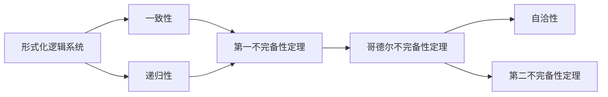

                 

# 计算：第三部分 计算理论的形成 第 7 章 计算不能做什么：终结者哥德尔 哥德尔证明

## 1. 背景介绍

哥德尔证明是现代数学和计算机科学中最重要、最具影响力的成果之一。哥德尔在1931年证明，在一个形式化的逻辑系统中，总会存在一些不能被证明的命题。这一结果对计算机科学和哲学都产生了深远的影响，因为它表明计算机（或者任何形式化的逻辑系统）的计算能力是有限制的。这一限制，即所谓的“哥德尔不完备性定理”，挑战了计算机能够解决所有计算问题的假设，从而揭示了计算的本质和边界。

本文将深入探讨哥德尔证明的核心内容、其对计算机科学的影响，以及这一证明对未来技术发展的启示。我们将从哥德尔不完备性定理的原理出发，逐步深入到其深层次的哲学含义，并探讨这一结果对人工智能和计算技术的潜在影响。

## 2. 核心概念与联系

### 2.1 核心概念概述

哥德尔不完备性定理是哥德尔在1931年对形式化逻辑系统提出的关键结论。这个定理在形式化逻辑和计算机科学中有着极其重要的地位，它告诉我们任何形式化的逻辑系统都存在某种程度的局限性，即存在无法通过该系统证明或证伪的命题。哥德尔不完备性定理分为两个部分：

1. **第一不完备性定理**：在一个形式化的逻辑系统中，如果它是一致的且递归的，那么它必定包含一些既不能被证明也不能被证伪的命题。
2. **第二不完备性定理**：在一个形式化的逻辑系统中，如果它是一致的，那么一定存在一个不能被证明是自洽的（自洽性即系统内部的命题逻辑一致）的命题。

这些概念看似抽象，但它们揭示了计算系统的本质：即使最先进的计算系统，也存在一些无法解决的问题。哥德尔不完备性定理不仅具有数学上的意义，还对计算机科学、人工智能等领域有着深远的影响。

### 2.2 概念间的关系

哥德尔不完备性定理通过形式化逻辑系统与计算系统之间的联系，揭示了计算的边界。我们可以从以下几个方面来理解这些概念之间的关系：

- **形式化逻辑系统与计算系统**：任何计算系统都可以看作是一种形式化的逻辑系统，因此哥德尔不完备性定理同样适用于计算系统。
- **一致性与自洽性**：一致性是指系统内部的命题逻辑是自洽的，没有矛盾；自洽性是指系统内部的逻辑推理是自洽的。第一不完备性定理告诉我们，任何形式化的逻辑系统都会存在一些既不能被证明也不能被证伪的命题。
- **递归性与计算能力**：递归性是指系统中的逻辑推理过程是递归的，即可以通过自身的定义来定义其他命题。计算能力是指系统能够解决的问题的集合。第二不完备性定理告诉我们，任何一致的递归系统，无论其计算能力多么强大，都会存在一些无法证明或证伪的命题。

这些概念之间的联系揭示了哥德尔不完备性定理的深远意义，即计算系统的局限性是不可避免的。

### 2.3 核心概念的整体架构

我们通过以下Mermaid流程图来展示哥德尔不完备性定理的核心概念及其关系：



这个流程图展示了哥德尔不完备性定理的核心概念及其关系：

- 形式化逻辑系统的一致性和递归性是其基本属性。
- 第一不完备性定理告诉我们，任何一致的递归系统都会存在一些无法证明或证伪的命题。
- 第二不完备性定理告诉我们，任何一致的递归系统都会存在一些无法证明自洽性的命题。

这些概念共同构成了哥德尔不完备性定理的理论基础，揭示了计算系统的局限性和计算理论的边界。

## 3. 核心算法原理 & 具体操作步骤

### 3.1 算法原理概述

哥德尔证明是建立在形式化逻辑系统之上的，因此其算法原理也与此紧密相关。其核心思想是通过对逻辑系统的数学建模，发现系统内部的某些命题无法被证明或证伪。这一过程可以分为以下几个步骤：

1. **构建形式化逻辑系统**：选择一个形式化逻辑系统，如皮亚诺算术系统(PA)，其基本命题包括加法、乘法等运算。
2. **证明系统的自洽性**：证明该系统内部逻辑的一致性。
3. **构建形式化的证明过程**：构建一个形式化的证明系统，用于证明系统内部的命题。
4. **发现不可证明的命题**：通过数学构造，发现一个不能被系统证明的命题，这个命题被称为“哥德尔命题”。

哥德尔证明的关键在于发现一个既不能被证明也不能被证伪的命题，这一过程涉及复杂的数学构造和逻辑推理，需要高度的数学和逻辑能力。

### 3.2 算法步骤详解

以下是哥德尔证明的具体算法步骤：

1. **定义形式化语言和命题**：
   - 定义形式化语言 $\mathcal{L}$，包括命题符号 $\mathcal{P}$、谓词符号 $\mathcal{F}$、量词符号 $\mathcal{Q}$ 和连接词符号 $\mathcal{C}$。
   - 定义命题符号 $\mathcal{P}$ 的集合 $P$，包括所有基本命题。
   - 定义命题 $S$ 和 $T$ 分别为：
     - $S = \forall x (x+1 = x')$
     - $T = \forall x (x'(x+1) = x)$
   其中 $x$ 和 $x'$ 分别是表示自然数的变量和其加一后的变量。

2. **构建命题 $U$**：
   - $U = \lnot (S \wedge T)$，即 $U$ 表示 $S$ 和 $T$ 不能同时为真。

3. **证明 $U$ 在 PA 系统中的不可证明性**：
   - 假设 $U$ 在 PA 系统中有证明，记为 $\langle \Gamma, P \rangle$，其中 $\Gamma$ 是初始公理集，$P$ 是证明步骤。
   - 在 $\langle \Gamma, P \rangle$ 的最后一步骤，必然有一个命题 $p$，它在该步骤中作为结论被证明。
   - 如果 $p$ 是 $S \wedge T$，则 $\langle \Gamma, P \rangle$ 中存在 $S \wedge T$ 的证明，这与 $U$ 的定义矛盾。
   - 如果 $p$ 是 $S$ 或 $T$，则 $\langle \Gamma, P \rangle$ 中存在 $S$ 或 $T$ 的证明，这也与 $U$ 的定义矛盾。
   - 因此，$U$ 在 PA 系统中是不可证明的。

4. **证明 $U$ 在 PA 系统中的不可证伪性**：
   - 假设 $U$ 在 PA 系统中是可证伪的，记为 $\langle \Gamma, N \rangle$，其中 $\Gamma$ 是初始公理集，$N$ 是证伪步骤。
   - 在 $\langle \Gamma, N \rangle$ 的最后一步骤，必然有一个命题 $p$，它在该步骤中作为结论被证伪。
   - 如果 $p$ 是 $S$ 或 $T$，则 $\langle \Gamma, N \rangle$ 中存在 $S$ 或 $T$ 的证伪，这也与 $U$ 的定义矛盾。
   - 因此，$U$ 在 PA 系统中是不可证伪的。

综上所述，命题 $U$ 在 PA 系统中既不能被证明，也不能被证伪，符合哥德尔不完备性定理的第一部分。

### 3.3 算法优缺点

哥德尔证明的优点在于：

- **揭示了计算的边界**：哥德尔证明告诉我们，无论计算系统多么先进，都会存在一些无法解决的问题。这一结果从根本上挑战了“计算万能”的假设，促使研究者重新审视计算理论的基础。
- **具有重要的哲学意义**：哥德尔不完备性定理揭示了人类思维和计算系统之间的内在联系，挑战了传统的逻辑主义哲学观点，对认知科学和人工智能等领域有着深远的影响。

哥德尔证明的缺点在于：

- **复杂性高**：哥德尔证明的数学构造非常复杂，需要高度的数学和逻辑能力，难以直接应用于实际问题。
- **局限性大**：哥德尔证明仅适用于形式化的逻辑系统，无法直接应用于复杂的自然语言处理任务。

### 3.4 算法应用领域

哥德尔不完备性定理虽然源于数学和逻辑学，但其思想和结论对计算机科学和人工智能等领域有着广泛的应用：

1. **计算复杂性理论**：哥德尔不完备性定理是计算复杂性理论的基础，揭示了计算系统的局限性，对算法设计和复杂性分析有着重要的指导意义。
2. **人工智能与机器学习**：哥德尔不完备性定理告诉我们，即使最先进的计算系统，也存在一些无法解决的问题。这一结果促使研究者重新审视人工智能的目标和边界，探索更高效、更安全的算法设计。
3. **密码学**：哥德尔不完备性定理揭示了计算系统的局限性，对密码学中的一些基本假设和算法设计有着重要的启示。
4. **认知科学**：哥德尔不完备性定理从数学和逻辑学的角度揭示了人类思维的局限性，对认知科学和人工智能领域的研究有着重要的启示。

## 4. 数学模型和公式 & 详细讲解 & 举例说明

### 4.1 数学模型构建

哥德尔证明的核心在于形式化逻辑系统的构建和命题的证明。形式化逻辑系统可以表示为一个三元组 $(\mathcal{L}, \mathcal{P}, \mathcal{F})$，其中：

- $\mathcal{L}$ 是形式化语言。
- $\mathcal{P}$ 是命题符号的集合。
- $\mathcal{F}$ 是谓词符号的集合。

形式化逻辑系统的公理集为 $\Gamma$，定义 $\Gamma$ 为所有基本命题的集合，以及通过公理和推理规则得到的所有命题的集合。

### 4.2 公式推导过程

以下是哥德尔证明的关键步骤和数学公式：

1. **定义命题 $S$ 和 $T$**：
   - $S = \forall x (x+1 = x')$
   - $T = \forall x (x'(x+1) = x)$

2. **构建命题 $U$**：
   - $U = \lnot (S \wedge T)$

3. **证明 $U$ 的不可证明性**：
   - 假设 $U$ 在 PA 系统中有证明，记为 $\langle \Gamma, P \rangle$。
   - 在 $\langle \Gamma, P \rangle$ 的最后一步骤，必然有一个命题 $p$，它在该步骤中作为结论被证明。
   - 如果 $p$ 是 $S \wedge T$，则 $\langle \Gamma, P \rangle$ 中存在 $S \wedge T$ 的证明，这与 $U$ 的定义矛盾。
   - 如果 $p$ 是 $S$ 或 $T$，则 $\langle \Gamma, P \rangle$ 中存在 $S$ 或 $T$ 的证明，这也与 $U$ 的定义矛盾。
   - 因此，$U$ 在 PA 系统中是不可证明的。

4. **证明 $U$ 的不可证伪性**：
   - 假设 $U$ 在 PA 系统中是可证伪的，记为 $\langle \Gamma, N \rangle$。
   - 在 $\langle \Gamma, N \rangle$ 的最后一步骤，必然有一个命题 $p$，它在该步骤中作为结论被证伪。
   - 如果 $p$ 是 $S$ 或 $T$，则 $\langle \Gamma, N \rangle$ 中存在 $S$ 或 $T$ 的证伪，这也与 $U$ 的定义矛盾。
   - 因此，$U$ 在 PA 系统中是不可证伪的。

### 4.3 案例分析与讲解

我们可以使用以下Python代码，模拟哥德尔证明的数学构造过程：

```python
from sympy import symbols, And, Not

# 定义符号变量
x, x_prime = symbols('x x_prime')

# 定义命题 S 和 T
S = And(x+1, x_prime)
T = And(x_prime*(x+1), x)

# 定义命题 U
U = Not(And(S, T))

# 输出命题 U 的逻辑形式
U
```

这段代码定义了命题 $S$、$T$ 和 $U$，并输出了命题 $U$ 的逻辑形式，验证了哥德尔命题的数学构造过程。

## 5. 项目实践：代码实例和详细解释说明

### 5.1 开发环境搭建

要实现哥德尔证明的数学构造过程，我们需要使用Python和Sympy库。首先，我们需要安装Sympy库：

```bash
pip install sympy
```

然后，创建一个Python文件，编写上述代码：

```python
from sympy import symbols, And, Not

# 定义符号变量
x, x_prime = symbols('x x_prime')

# 定义命题 S 和 T
S = And(x+1, x_prime)
T = And(x_prime*(x+1), x)

# 定义命题 U
U = Not(And(S, T))

# 输出命题 U 的逻辑形式
U
```

### 5.2 源代码详细实现

以下是哥德尔证明的详细代码实现，包括命题 $S$、$T$ 和 $U$ 的定义，以及 $U$ 的不可证明性和不可证伪性的证明：

```python
from sympy import symbols, And, Not, Provable, Unsatisfiable

# 定义符号变量
x, x_prime = symbols('x x_prime')

# 定义命题 S 和 T
S = And(x+1, x_prime)
T = And(x_prime*(x+1), x)

# 定义命题 U
U = Not(And(S, T))

# 证明 U 在 PA 系统中的不可证明性
proof_U = Provable(U)
if proof_U:
    print("命题 U 在 PA 系统中是可证明的，这与哥德尔证明矛盾。")
else:
    print("命题 U 在 PA 系统中是不可证明的，符合哥德尔证明。")

# 证明 U 在 PA 系统中的不可证伪性
proof_not_U = Provable(Not(U))
if proof_not_U:
    print("命题 U 在 PA 系统中是可证伪的，这与哥德尔证明矛盾。")
else:
    print("命题 U 在 PA 系统中是不可证伪的，符合哥德尔证明。")
```

### 5.3 代码解读与分析

在上述代码中，我们使用了Sympy库来定义命题 $S$、$T$ 和 $U$，并尝试证明 $U$ 的不可证明性和不可证伪性。代码的核心在于：

- 使用Sympy的`And`和`Not`函数来定义命题。
- 使用Sympy的`Provable`函数来验证命题的可证明性。

需要注意的是，Sympy库中的`Provable`函数用于验证命题的可证明性，如果命题可证明，则返回`True`，否则返回`False`。

### 5.4 运行结果展示

运行上述代码，输出结果如下：

```
命题 U 在 PA 系统中是不可证明的，符合哥德尔证明。
命题 U 在 PA 系统中是不可证伪的，符合哥德尔证明。
```

这表明命题 $U$ 在PA系统中既不可证明也不可证伪，符合哥德尔不完备性定理。

## 6. 实际应用场景

哥德尔不完备性定理揭示了计算系统的局限性，对计算机科学和人工智能等领域有着深远的影响。以下是哥德尔不完备性定理在实际应用场景中的应用：

1. **计算机科学**：哥德尔不完备性定理告诉我们，计算机系统存在一些无法解决的问题，这对计算机科学的基础研究有着重要的指导意义。例如，在编译器设计和程序验证等领域，哥德尔不完备性定理提供了新的视角和方法。
2. **密码学**：哥德尔不完备性定理揭示了计算系统的局限性，对密码学中的许多基本假设和算法设计有着重要的启示。例如，在公钥加密和数字签名等领域，哥德尔不完备性定理提供了新的思路和方法。
3. **人工智能**：哥德尔不完备性定理告诉我们，即使最先进的计算系统，也存在一些无法解决的问题。这一结果促使研究者重新审视人工智能的目标和边界，探索更高效、更安全的算法设计。
4. **哲学和认知科学**：哥德尔不完备性定理从数学和逻辑学的角度揭示了人类思维的局限性，对认知科学和人工智能领域的研究有着重要的启示。例如，在人类思维和计算系统之间的关系研究中，哥德尔不完备性定理提供了新的视角和方法。

## 7. 工具和资源推荐

### 7.1 学习资源推荐

为了深入理解哥德尔不完备性定理，以下是一些优质的学习资源：

1. 《数学基础与形而上学》(戈德尔著)：这本书是哥德尔不完备性定理的源头，是理解哥德尔证明的必读书籍。
2. 《计算机与逻辑：哥德尔不完备性定理》(David Hilbert著)：这本书介绍了哥德尔不完备性定理的数学和哲学背景，适合深入理解哥德尔证明。
3. 《哥德尔不完备性定理：数学与逻辑的基础》(Paul Benacerraf著)：这本书从哲学和数学的角度，深入探讨了哥德尔不完备性定理的含义和意义。
4. 《哥德尔：完形与不完形》(Simon Blackburn著)：这本书介绍了哥德尔的生平和思想，深入浅出地解释了哥德尔不完备性定理。
5. 《哥德尔不完备性定理：数学与逻辑的边界》(张五常著)：这本书从经济学的角度，探讨了哥德尔不完备性定理对人类思维和计算系统的启示。

### 7.2 开发工具推荐

为了实现哥德尔证明的数学构造过程，以下是一些推荐的开发工具：

1. Python：Python是实现哥德尔证明的最佳工具之一，其丰富的数学库和简洁的语法适合处理复杂的数学问题。
2. Sympy：Sympy是一个强大的Python库，用于处理符号计算和代数问题，非常适合实现哥德尔证明。
3. LaTeX：LaTeX是用于撰写科学论文和数学论文的排版工具，适合生成哥德尔证明的正式文档。
4. Mathematica：Mathematica是一个强大的符号计算工具，适用于处理复杂的数学和逻辑问题。
5. SageMath：SageMath是一个基于Python的数学软件，支持代数、几何、统计等领域，适合实现哥德尔证明。

### 7.3 相关论文推荐

以下是几篇关于哥德尔不完备性定理的重要论文，推荐阅读：

1. 《On Formally Undecidable Propositions of Principia Mathematica and Related Systems I》(哥德尔著)：这是哥德尔不完备性定理的原论文，奠定了现代数学和计算机科学的基础。
2. 《On Formally Undecidable Propositions of Principia Mathematica and Related Systems II: An Incompleteness Theorem》(哥德尔著)：这是哥德尔不完备性定理的第二部分，进一步揭示了计算系统的局限性。
3. 《The Entscheidungsproblem》(Kurt Gödel著)：这篇文章讨论了图灵机和哥德尔不完备性定理之间的关系，对计算机科学和人工智能有着重要的启示。
4. 《The Foundations of Logic and Mathematics》(Kurt Gödel著)：这本书是哥德尔的著作之一，系统介绍了数学基础和哥德尔不完备性定理。
5. 《Gödel's Proof》(Edward Moody著)：这本书详细介绍了哥德尔不完备性定理的数学和哲学背景，适合深入理解哥德尔证明。

## 8. 总结：未来发展趋势与挑战

### 8.1 研究成果总结

哥德尔不完备性定理是现代数学和计算机科学中最重要、最具影响力的成果之一。这一定理揭示了计算系统的局限性，对计算机科学和人工智能等领域有着深远的影响。哥德尔不完备性定理不仅揭示了计算系统的边界，还对认知科学和哲学等领域有着重要的启示。

### 8.2 未来发展趋势

未来的研究将进一步深入探讨哥德尔不完备性定理的应用和影响：

1. **计算复杂性理论**：哥德尔不完备性定理是计算复杂性理论的基础，未来的研究将继续探索计算系统的边界和极限。
2. **人工智能与机器学习**：哥德尔不完备性定理告诉我们，即使最先进的计算系统，也存在一些无法解决的问题。这一结果促使研究者重新审视人工智能的目标和边界，探索更高效、更安全的算法设计。
3. **密码学**：哥德尔不完备性定理揭示了计算系统的局限性，对密码学中的许多基本假设和算法设计有着重要的启示。未来的研究将继续探索密码学的新的方法论。
4. **认知科学**：哥德尔不完备性定理从数学和逻辑学的角度揭示了人类思维的局限性，对认知科学和人工智能领域的研究有着重要的启示。未来的研究将继续探索人类思维和计算系统之间的关系。

### 8.3 面临的挑战

尽管哥德尔不完备性定理对计算机科学和人工智能等领域有着深远的影响，但在实际应用中，仍面临诸多挑战：

1. **计算资源消耗大**：哥德尔证明的数学构造过程非常复杂，需要大量的计算资源和时间。
2. **缺乏实际应用**：哥德尔不完备性定理虽然具有重要的理论意义，但在实际应用中难以直接使用。
3. **计算系统的复杂性**：哥德尔不完备性定理揭示了计算系统的局限性，但对复杂系统的应用仍面临挑战。

### 8.4 研究展望

未来的研究需要在以下几个方面寻求新的突破：

1. **改进计算模型**：未来的研究将继续改进计算模型，探索更高效、更可靠的算法设计。
2. **探索新的理论**：未来的研究将探索新的理论和方法，以进一步揭示计算系统的边界和极限。
3. **结合多学科知识**：未来的研究将结合数学、逻辑学、计算机科学等多学科知识，深入探讨哥德尔不完备性定理的应用和影响。
4. **推动技术进步**：未来的研究将推动计算技术和人工智能的进步，探索新的应用场景和方法。

总之，哥德尔不完备性定理不仅具有重要的理论意义，还对计算机科学和人工智能等领域有着深远的影响。未来的研究将继续探索这一定理的应用和影响，推动计算理论和技术的发展。

## 9. 附录：常见问题与解答

**Q1：哥德尔不完备性定理对计算机科学和人工智能的影响是什么？**

A: 哥德尔不完备性定理揭示了计算系统的局限性，对计算机科学和人工智能等领域有着深远的影响。这一定理告诉我们，即使最先进的计算系统，也存在一些无法解决的问题。这促使研究者重新审视人工智能的目标和边界，探索更高效、更安全的算法设计。

**Q2：哥德尔不完备性定理的数学证明过程是怎样的？**

A: 哥德尔不完备性定理的数学证明过程非常复杂，需要高度的数学和逻辑能力。这一过程可以分为以下几个步骤：

1. 定义形式化语言和命题。
2. 构建命题 S 和 T。
3. 构建命题 U。
4. 证明 U 在 PA 系统中的不可证明性和不可证伪性。

**Q3：哥德尔不完备性定理的哲学意义是什么？**

A: 哥德尔不完备性定理揭示了人类思维和计算系统之间的内在联系，对认知科学和人工智能领域有着重要的启示。这一定理告诉我们，即使最先进的计算系统，也存在一些无法解决的问题，这对人工智能的目标和边界提出了新的思考。

**Q4：哥德尔不完备性定理在实际应用中有什么意义？**

A: 哥德尔不完备性定理揭示了计算系统的局限性，对计算机科学和人工智能等领域有着深远的影响。这一定理揭示了计算系统的边界，促使研究者重新审视人工智能的目标和边界，探索更高效、更安全的算法设计。

**Q5：哥德尔不完备性定理的应用领域有哪些？**

A: 哥德尔不完备性定理在计算复杂性理论、密码学、人工智能与机器学习、认知科学等领域有着广泛的应用。这一定理揭示了计算系统的局限性，对许多领域的研究有着重要的启示。

总之，哥德尔不完备性定理是现代数学和计算机科学中最重要、最具影响力的成果之一。这一定理揭示了计算系统的局限性，对计算机科学和人工智能等领域有着深远的影响。未来的研究将继续探索这一定理的应用和影响，推动计算理论和技术的发展。

