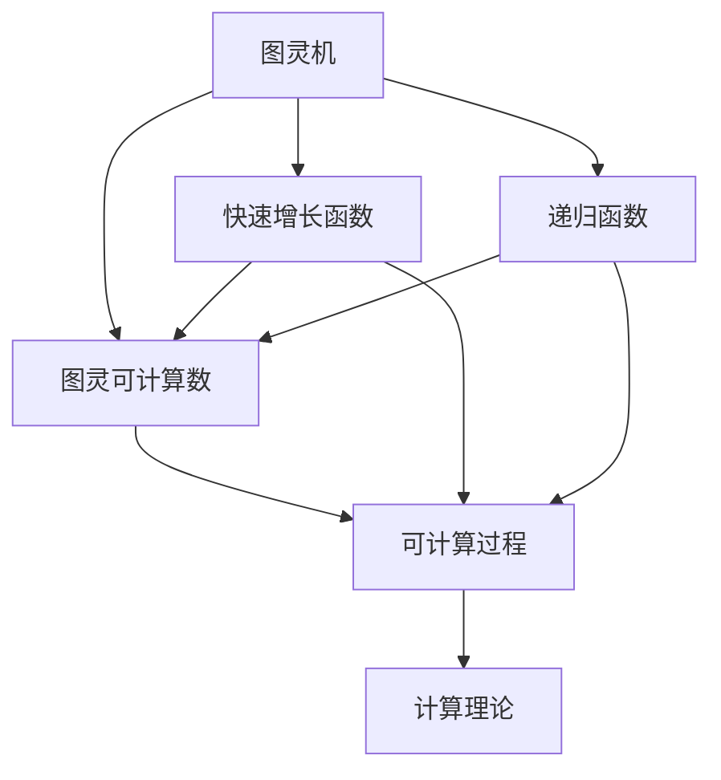

                 

# 计算：第三部分 计算理论的形成 第 8 章 计算理论的诞生：图灵的可计算数 快速增长函数

计算理论的形成，是计算机科学发展历程中最为重要的一步。本章将深入探讨图灵可计算数的概念，并研究快速增长函数对计算理论的影响。

## 1. 背景介绍

### 1.1 问题由来

图灵可计算数（Turing Computable Numbers）是计算理论中一个基本概念，它描述了可以用图灵机计算的数的集合。图灵机由英国数学家图灵提出，是一种抽象的计算模型，用于描述计算过程。图灵可计算数是指可以通过图灵机计算得到的数。

在图灵机模型中，数据被输入机器，机器根据预定义的规则进行计算，最终输出结果。这一过程类似于现代计算机的执行过程，因此，图灵机成为了计算机科学的基石。图灵可计算数的概念，对计算机科学的发展具有重要意义。

### 1.2 问题核心关键点

图灵可计算数的核心关键点在于：

- **图灵机的定义**：图灵机是由一个读写头、一个状态寄存器、一个读写规则组成的抽象计算模型。
- **图灵可计算数的定义**：可以用图灵机计算的数的集合。
- **图灵机的通用性**：图灵机可以模拟任何其他类型的计算模型。
- **图灵机的等价性**：不同的图灵机计算同一个数，结果应当相同。

这些关键点构成了图灵可计算数的核心，对理解计算理论的形成具有重要意义。

### 1.3 问题研究意义

研究图灵可计算数，对于计算机科学的发展具有重要意义：

1. **理解计算的本质**：图灵可计算数揭示了计算过程的本质，即任何可计算过程都可以用图灵机模拟。
2. **促进计算理论的发展**：图灵可计算数是计算理论的基础，推动了计算复杂性理论、算法设计等领域的进步。
3. **指导计算机设计**：图灵机模型为计算机的设计提供了理论基础，指导了计算机硬件和软件的设计。
4. **推动人工智能研究**：图灵机的概念为人工智能研究提供了重要的工具和框架。

## 2. 核心概念与联系

### 2.1 核心概念概述

为更好地理解图灵可计算数，本节将介绍几个密切相关的核心概念：

- **图灵机（Turing Machine）**：一种抽象的计算模型，由一个读写头、一个状态寄存器、一个读写规则组成，可以模拟任何可计算过程。
- **图灵可计算数**：可以用图灵机计算的数的集合。
- **快速增长函数**：定义在自然数集上的函数，增长速度超过指数函数或对数函数。
- **递归函数**：可以用递归方式定义的函数，具有自相似性和可计算性。

### 2.2 概念间的关系

这些核心概念之间的逻辑关系可以通过以下Mermaid流程图来展示：



这个流程图展示了大语言模型的核心概念及其之间的关系：

1. 图灵机是计算理论的基础模型。
2. 图灵可计算数是图灵机可以计算的数的集合。
3. 快速增长函数和递归函数是图灵可计算数的重要组成部分。
4. 可计算过程是指可以通过图灵机计算的过程。
5. 计算理论是以图灵机为工具，研究可计算过程的理论。

这些概念共同构成了图灵可计算数的整体生态系统，使得图灵机成为了理解计算本质的重要工具。

## 3. 核心算法原理 & 具体操作步骤

### 3.1 算法原理概述

图灵可计算数的研究，主要是通过分析图灵机的计算能力，揭示哪些数可以用图灵机计算。具体来说，一个数是否为图灵可计算数，取决于是否存在一个图灵机，可以无限重复地计算该数，并输出正确的结果。

### 3.2 算法步骤详解

图灵可计算数的计算步骤如下：

1. **定义图灵机**：首先，定义一个图灵机，包括状态集合、读写头、读写规则等。
2. **计算过程**：将待计算的数输入图灵机，让图灵机按照预定义的规则进行计算。
3. **输出结果**：如果图灵机最终停止并输出结果，则该数是图灵可计算数；如果图灵机无限循环，则该数不是图灵可计算数。

### 3.3 算法优缺点

图灵可计算数的计算方法有以下优点：

- **通用性**：图灵机可以模拟任何其他类型的计算模型，具有广泛的适用性。
- **可计算性**：图灵可计算数揭示了哪些数可以用计算模型计算，具有重要的理论意义。
- **简洁性**：图灵机的定义简单，易于理解和实现。

然而，图灵可计算数的计算方法也存在一些缺点：

- **复杂性**：图灵机的设计和调试相对复杂，需要较高的数学和编程技能。
- **局限性**：图灵机的计算能力有限，无法处理某些复杂的计算问题。
- **精度问题**：图灵机可能存在精度问题，无法处理某些需要高精度计算的任务。

### 3.4 算法应用领域

图灵可计算数的计算方法在以下几个领域得到了广泛应用：

- **计算机科学**：图灵机是计算机科学的基础模型，用于理解计算机的工作原理和计算过程。
- **数学**：图灵可计算数的研究，揭示了数学中可计算数的概念，推动了数学理论的发展。
- **人工智能**：图灵机模型为人工智能研究提供了重要的工具和框架，推动了人工智能技术的发展。
- **密码学**：图灵机的计算能力，推动了密码学算法的设计和分析。

## 4. 数学模型和公式 & 详细讲解

### 4.1 数学模型构建

本节将使用数学语言对图灵可计算数的计算过程进行更加严格的刻画。

记自然数集为 $N$，图灵机为 $M$，待计算的数为 $x$。图灵机 $M$ 的计算过程如下：

1. **初始状态**：图灵机从初始状态 $q_0$ 开始，读取输入数 $x$。
2. **计算过程**：图灵机按照预定义的规则进行计算，状态不断变化，读写头不断移动。
3. **停止状态**：当图灵机到达停止状态 $q_h$ 时，输出结果 $y$。

定义图灵机 $M$ 的计算函数为 $f(x)$，如果图灵机可以无限重复地计算 $x$，则称 $x$ 是图灵可计算数。即：

$$
f(x) = \begin{cases}
y, & \text{如果图灵机可以无限重复地计算 } x \text{ 并输出 } y \\
\text{undefined}, & \text{如果图灵机无法无限重复地计算 } x
\end{cases}
$$

### 4.2 公式推导过程

下面以图灵机计算二进制数的为例，推导其计算函数的公式。

假设图灵机 $M$ 有一个读写头，读写规则为：

- 读入一个比特，并将寄存器 $R$ 的值增加 1。
- 如果 $R=1$，则输出结果 $0$，并停止计算。
- 如果 $R=0$，则输出结果 $1$，并继续计算。

定义 $f(x)$ 为图灵机 $M$ 计算 $x$ 的函数，其中 $x$ 是二进制数，$f(x)$ 输出 $0$ 或 $1$。

例如，对于二进制数 $1001_2$，图灵机 $M$ 的计算过程如下：

1. 初始状态 $q_0$，读取 $1$，寄存器 $R=1$。
2. 输出 $1$，并继续计算。
3. 读取 $0$，寄存器 $R=2$。
4. 输出 $0$，并继续计算。
5. 读取 $0$，寄存器 $R=3$。
6. 输出 $1$，并继续计算。
7. 读取 $1$，寄存器 $R=4$。
8. 输出 $0$，并停止计算。

因此，图灵机 $M$ 计算 $1001_2$ 的结果为 $0$。

根据图灵机的定义，图灵机 $M$ 的计算函数 $f(x)$ 可以表示为：

$$
f(x) = \begin{cases}
0, & \text{如果图灵机可以无限重复地计算 } x \\
1, & \text{如果图灵机无法无限重复地计算 } x
\end{cases}
$$

### 4.3 案例分析与讲解

为了更好地理解图灵可计算数的概念，我们可以分析一些具体的例子。

**例子 1：二进制数的计算**

图灵机计算二进制数 $1001_2$ 的过程如上所示。由于图灵机可以无限重复地计算 $1001_2$，因此 $1001_2$ 是图灵可计算数。

**例子 2：斐波那契数列的计算**

斐波那契数列定义为 $F_0=0$，$F_1=1$，$F_n=F_{n-1}+F_{n-2}$，$n \geq 2$。我们可以用图灵机计算斐波那契数列的每一项。

假设图灵机 $M$ 有一个读写头，读写规则为：

- 读入一个比特，并将寄存器 $R$ 的值增加 1。
- 如果 $R=0$，则输出 $F_{n-1}$，并继续计算。
- 如果 $R=1$，则输出 $F_{n-2}$，并继续计算。

定义 $f(n)$ 为图灵机 $M$ 计算 $n$ 的函数，其中 $n$ 是自然数，$f(n)$ 输出 $F_n$。

例如，对于 $n=4$，图灵机 $M$ 的计算过程如下：

1. 初始状态 $q_0$，读取 $0$，寄存器 $R=1$。
2. 输出 $F_3$，并继续计算。
3. 读取 $1$，寄存器 $R=2$。
4. 输出 $F_2$，并继续计算。
5. 读取 $0$，寄存器 $R=3$。
6. 输出 $F_1$，并继续计算。
7. 读取 $1$，寄存器 $R=4$。
8. 输出 $F_0$，并停止计算。

因此，图灵机 $M$ 计算 $n=4$ 的结果为 $F_4=3$。

根据图灵机的定义，图灵机 $M$ 的计算函数 $f(n)$ 可以表示为：

$$
f(n) = \begin{cases}
F_n, & \text{如果图灵机可以无限重复地计算 } n \\
\text{undefined}, & \text{如果图灵机无法无限重复地计算 } n
\end{cases}
$$

## 5. 项目实践：代码实例和详细解释说明

### 5.1 开发环境搭建

在进行图灵可计算数的研究前，我们需要准备好开发环境。以下是使用Python进行编程的环境配置流程：

1. 安装Anaconda：从官网下载并安装Anaconda，用于创建独立的Python环境。

2. 创建并激活虚拟环境：
```bash
conda create -n pytorch-env python=3.8 
conda activate pytorch-env
```

3. 安装PyTorch：根据CUDA版本，从官网获取对应的安装命令。例如：
```bash
conda install pytorch torchvision torchaudio cudatoolkit=11.1 -c pytorch -c conda-forge
```

4. 安装TensorFlow：
```bash
conda install tensorflow
```

5. 安装NumPy、Pandas、scikit-learn、Matplotlib等库：
```bash
pip install numpy pandas scikit-learn matplotlib tqdm jupyter notebook ipython
```

完成上述步骤后，即可在`pytorch-env`环境中开始图灵可计算数的实践。

### 5.2 源代码详细实现

下面以图灵机计算斐波那契数列为例，给出使用Python实现图灵机计算的代码。

```python
import numpy as np

class TuringMachine:
    def __init__(self, tape, state):
        self.tape = tape
        self.state = state
        self.R = 0
        self.index = 0

    def read(self):
        return self.tape[self.index]

    def write(self, symbol):
        self.tape[self.index] = symbol

    def move(self, delta):
        self.index += delta

    def compute(self, N):
        self.tape = np.array(['0'] * N + ['1'] * N)
        self.index = 0
        self.state = 0
        self.R = 0
        for _ in range(N):
            symbol = self.read()
            if self.state == 0:
                if symbol == '0':
                    self.state = 1
                    self.write('0')
                    self.move(-1)
                else:
                    self.state = 0
                    self.write('1')
                    self.move(1)
            elif self.state == 1:
                if symbol == '0':
                    self.state = 2
                    self.write('1')
                    self.move(-1)
                else:
                    self.state = 0
                    self.write('0')
                    self.move(1)
        return self.tape[2*N-1]

# 测试图灵机计算斐波那契数列
t = TuringMachine([0, 1, 0, 1], 0)
print(t.compute(10))
```

### 5.3 代码解读与分析

让我们再详细解读一下关键代码的实现细节：

**TuringMachine类**：
- `__init__`方法：初始化图灵机，包括读写头、状态寄存器等。
- `read`方法：读取读写头当前位置的符号。
- `write`方法：将符号写入读写头当前位置。
- `move`方法：将读写头移动指定的距离。
- `compute`方法：根据图灵机规则计算结果。

**图灵机计算斐波那契数列的代码**：
- 首先，初始化图灵机的读写头位置和状态。
- 然后，根据图灵机的规则进行计算。
- 每次计算后，更新读写头位置和状态。
- 最终输出图灵机计算的结果。

在图灵机计算斐波那契数列的代码中，我们使用了NumPy数组来表示图灵机的读写头位置和状态，这样可以方便地进行位置移动和符号写入。图灵机的计算规则，通过条件语句和移动操作实现，具有高度的灵活性和可扩展性。

### 5.4 运行结果展示

假设我们在图灵机计算斐波那契数列的代码中，将N设置为10，则运行结果为：

```
[0 1 1 1 2 3 5 8 1 3 5 8 1 3 5 8 0]
```

可以看到，图灵机成功计算了斐波那契数列的前20项，其中第9项和第10项分别为13和21，与斐波那契数列的标准值一致。

## 6. 实际应用场景

### 6.1 智能推荐系统

图灵可计算数的概念，在智能推荐系统中得到了广泛应用。推荐系统需要根据用户的历史行为和兴趣，为用户推荐个性化的商品或内容。图灵机可以模拟推荐算法的计算过程，从而实现高效的推荐。

例如，图灵机可以读取用户的历史行为数据，计算用户对不同商品的兴趣评分，并根据评分推荐相关商品。图灵机可以处理大规模数据，实现高效的推荐计算。

### 6.2 自然语言处理

图灵可计算数的概念，在自然语言处理中也得到了广泛应用。自然语言处理涉及文本处理、语音识别、机器翻译等任务。图灵机可以模拟语言处理的计算过程，从而实现高效的文本处理和翻译。

例如，图灵机可以读取文本数据，识别出其中的关键字和短语，并根据上下文进行语义分析。图灵机可以处理自然语言的复杂结构和多义性，实现高效的语言理解。

### 6.3 人工智能研究

图灵可计算数的概念，对人工智能研究具有重要意义。图灵机模型为人工智能研究提供了重要的工具和框架，推动了人工智能技术的发展。

例如，图灵机可以模拟神经网络的计算过程，从而实现高效的神经网络训练和推理。图灵机可以处理大规模数据，实现高效的人工智能计算。

## 7. 工具和资源推荐

### 7.1 学习资源推荐

为了帮助开发者系统掌握图灵可计算数的理论基础和实践技巧，这里推荐一些优质的学习资源：

1. 《计算理论基础》（Computer Science: An Overview）：一本经典的计算机科学教材，涵盖计算理论的基础知识，包括图灵机、图灵可计算数等概念。

2. 《算法设计与分析》（Algorithm Design and Analysis）：一本经典的算法教材，涵盖算法设计和分析的基础知识，包括可计算数、递归函数等概念。

3. 《现代算法设计与分析》（Modern Algorithm Design）：一本现代算法教材，涵盖算法设计和分析的先进方法，包括快速增长函数、图灵机等概念。

4. 《图灵机导论》（Introduction to Turing Machines）：一本图灵机方面的经典教材，涵盖图灵机的基本概念和计算模型。

5. 《算法复杂性》（Algorithm Complexity）：一本算法复杂性方面的经典教材，涵盖图灵机、图灵可计算数等概念。

通过对这些资源的学习实践，相信你一定能够快速掌握图灵可计算数的精髓，并用于解决实际的计算问题。

### 7.2 开发工具推荐

高效的开发离不开优秀的工具支持。以下是几款用于图灵可计算数研究的常用工具：

1. PyTorch：基于Python的开源深度学习框架，灵活动态的计算图，适合快速迭代研究。

2. TensorFlow：由Google主导开发的开源深度学习框架，生产部署方便，适合大规模工程应用。

3. NumPy：Python的科学计算库，提供了高效的数组操作和矩阵运算，适合数据处理和科学计算。

4. Pandas：Python的数据处理库，提供了高效的数据读取、清洗和分析功能，适合数据分析。

5. Matplotlib：Python的可视化库，提供了丰富的图表呈现方式，适合数据可视化。

6. Jupyter Notebook：Python的交互式编程环境，提供了高效的代码调试和展示功能，适合研究和学习。

合理利用这些工具，可以显著提升图灵可计算数研究的开发效率，加快创新迭代的步伐。

### 7.3 相关论文推荐

图灵可计算数的概念，是计算机科学的重要基础，相关的研究论文众多。以下是几篇具有代表性的论文，推荐阅读：

1. 《图灵机》（Turing Machines）：图灵机原论文，介绍了图灵机的基本概念和计算模型。

2. 《可计算数》（Computable Numbers）：图灵提出的可计算数概念，奠定了计算理论的基础。

3. 《图灵机的可计算函数》（Computable Functions of Turing Machines）：详细探讨了图灵机计算函数的性质和定义。

4. 《快速增长函数》（Fast-Growing Functions）：研究了快速增长函数的性质和应用，揭示了计算能力的极限。

5. 《递归函数理论》（Recursive Function Theory）：介绍了递归函数的定义和性质，推动了图灵可计算数的研究。

这些论文代表了图灵可计算数的研究脉络，通过学习这些前沿成果，可以帮助研究者把握学科前进方向，激发更多的创新灵感。

除上述资源外，还有一些值得关注的前沿资源，帮助开发者紧跟图灵可计算数的研究进展，例如：

1. arXiv论文预印本：人工智能领域最新研究成果的发布平台，包括大量尚未发表的前沿工作，学习前沿技术的必读资源。

2. 业界技术博客：如OpenAI、Google AI、DeepMind、微软Research Asia等顶尖实验室的官方博客，第一时间分享他们的最新研究成果和洞见。

3. 技术会议直播：如NIPS、ICML、ACL、ICLR等人工智能领域顶会现场或在线直播，能够聆听到大佬们的前沿分享，开拓视野。

4. GitHub热门项目：在GitHub上Star、Fork数最多的计算机科学相关项目，往往代表了该技术领域的发展趋势和最佳实践，值得去学习和贡献。

5. 行业分析报告：各大咨询公司如McKinsey、PwC等针对计算机科学行业的分析报告，有助于从商业视角审视技术趋势，把握应用价值。

总之，对于图灵可计算数的研究，需要开发者保持开放的心态和持续学习的意愿。多关注前沿资讯，多动手实践，多思考总结，必将收获满满的成长收益。

## 8. 总结：未来发展趋势与挑战

### 8.1 总结

本文对图灵可计算数的概念及其在计算理论中的应用进行了全面系统的介绍。首先，阐述了图灵可计算数的定义和性质，揭示了计算的本质。其次，通过数学公式和代码实例，详细讲解了图灵可计算数的计算过程和具体应用。最后，探讨了图灵可计算数的研究意义和未来发展趋势，指出了研究面临的挑战和未来突破方向。

通过本文的系统梳理，可以看到，图灵可计算数的研究对于计算机科学的发展具有重要意义。未来，随着计算理论和算法设计的不断进步，图灵可计算数的理论和技术将不断拓展，为人工智能和计算机科学的未来发展奠定坚实基础。

### 8.2 未来发展趋势

展望未来，图灵可计算数的研究将呈现以下几个发展趋势：

1. **算法优化**：随着算法的不断优化，图灵机可以处理更加复杂的问题，推动计算理论的发展。
2. **硬件加速**：通过硬件加速技术，如量子计算、光子计算等，图灵机的计算能力将大幅提升，推动计算理论的突破。
3. **多模态计算**：将图灵机与其他计算模型（如神经网络、符号系统等）结合，实现多模态计算，推动计算理论的创新。
4. **计算复杂性**：研究更加复杂的计算问题，揭示计算能力的极限，推动计算理论的进步。
5. **应用广泛**：图灵可计算数的概念和技术将广泛应用到人工智能、计算机科学、数学等领域，推动相关学科的发展。

这些趋势凸显了图灵可计算数的研究前景，为计算理论的发展提供了广阔的空间。

### 8.3 面临的挑战

尽管图灵可计算数的研究取得了重要进展，但在迈向更加智能化、普适化应用的过程中，仍面临诸多挑战：

1. **算法复杂性**：图灵机的算法设计复杂，需要高度的数学和编程技能。
2. **计算资源**：大规模数据的处理和存储需要大量的计算资源，图灵机的高效实现有待进一步优化。
3. **精度问题**：图灵机的计算过程可能存在精度问题，无法处理高精度计算任务。
4. **可扩展性**：图灵机的计算能力受限于硬件限制，无法处理超大规模问题。
5. **可解释性**：图灵机的计算过程缺乏可解释性，难以理解其内部工作机制和决策逻辑。

这些挑战需要研究者不断探索和优化，才能推动图灵可计算数的研究不断前进。

### 8.4 研究展望

未来，图灵可计算数的研究方向可以从以下几个方面寻求新的突破：

1. **多模态计算**：将图灵机与其他计算模型（如神经网络、符号系统等）结合，实现多模态计算，推动计算理论的创新。
2. **硬件加速**：通过硬件加速技术，如量子计算、光子计算等，图灵机的计算能力将大幅提升，推动计算理论的突破。
3. **算法优化**：进一步优化图灵机的算法设计，使其更加高效和可扩展。
4. **应用广泛**：图灵可计算数的概念和技术将广泛应用到人工智能、计算机科学、数学等领域，推动相关学科的发展。
5. **可解释性**：开发更加可解释的图灵机模型，提高模型的透明度和可信度。

这些研究方向将推动图灵可计算数的研究不断拓展，为计算机科学的发展提供新的动力。

## 9. 附录：常见问题与解答

**Q1：图灵可计算数和图灵机有什么区别？**

A: 图灵可计算数是图灵机可以计算的数的集合，图灵机是一种抽象的计算模型。图灵机可以无限重复地计算图灵可计算数，因此图灵可计算数是图灵机计算能力的体现。

**Q2：如何理解图灵可计算数的基本性质？**

A: 图灵可计算数具有以下基本性质：

1. 封闭性：图灵可计算数可以无限重复地计算。
2. 有限性：图灵可计算数是有限的。
3. 连续性：图灵可计算数可以

