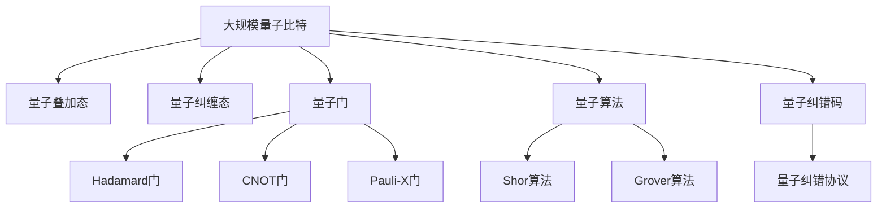

                 

# 计算：第四部分 计算的极限 第 10 章 量子计算 量子的特性

## 1. 背景介绍

### 1.1 问题由来
量子计算（Quantum Computing）是计算机科学领域中的一个重要分支，旨在利用量子力学的原理，通过量子比特（Qubit）进行信息编码和运算，从而实现对某些特定问题的解决能力超过传统经典计算机。其核心思想是将经典比特（0和1）的离散状态拓展到量子比特的叠加和纠缠状态，利用量子纠缠和量子并行性，实现指数级的计算加速。

### 1.2 问题核心关键点
量子计算的显著优势来源于量子比特的量子特性：叠加态、纠缠态和量子并行性。叠加态允许一个量子比特同时存在于0和1的状态，而纠缠态则使多个量子比特之间的状态相互依赖，形成一种复杂的量子态。量子并行性允许量子计算机同时对多个状态进行计算，从而实现并行处理。

量子计算的应用领域极其广泛，涵盖密码学、药物设计、材料科学、优化问题、机器学习等多个领域。其中，最为著名的是Shor算法和Grover算法，分别实现了对大整数分解和数据库搜索的指数级加速。

### 1.3 问题研究意义
研究量子计算的特性，对于理解计算极限、探索新型的计算范式、推动科学技术进步具有重要意义。量子计算不仅能够解决经典计算无法有效解决的问题，还能为其他计算理论和技术的发展提供新的视角和方法。

## 2. 核心概念与联系

### 2.1 核心概念概述
- **量子比特（Qubit）**：量子计算的基本单位，能够同时表示0和1的叠加态，是量子计算的核心资源。
- **量子叠加态**：量子比特可以同时处于0和1的叠加状态，通过测量后塌缩为0或1。
- **量子纠缠态**：多个量子比特之间形成复杂的量子态，其中一个比特的状态会影响其他比特的状态，即使它们相隔很远。
- **量子门**：量子比特上的基本操作，如Hadamard门、CNOT门、Pauli-X门等，用于量子逻辑运算和控制。
- **量子算法**：如Shor算法、Grover算法等，利用量子计算的特性解决特定问题，显著提升计算效率。

### 2.2 概念间的关系

这些核心概念之间存在着紧密的联系，形成了量子计算的完整体系。我们可以通过以下Mermaid流程图来展示这些概念的关系：

```mermaid
graph TB
    A[量子比特(Qubit)] --> B[量子叠加态]
    A --> C[量子纠缠态]
    A --> D[量子门]
    D --> E[Hadamard门]
    D --> F[CNOT门]
    D --> G[Pauli-X门]
    A --> H[量子算法]
    H --> I[Shor算法]
    H --> J[Grover算法]
```

这个流程图展示了大量子计算的关键概念及其之间的关系：

1. 量子比特是量子计算的基本单位。
2. 量子叠加态和量子纠缠态是量子比特的两种基本量子特性。
3. 量子门是量子比特上的基本操作，包括Hadamard门、CNOT门、Pauli-X门等。
4. 量子算法如Shor算法、Grover算法，利用量子比特和量子门实现高效计算。

### 2.3 核心概念的整体架构

最后，我们用一个综合的流程图来展示这些核心概念在大量子计算中的整体架构：



这个综合流程图展示了从大规模量子比特到量子算法实现的整个过程，强调了量子比特、量子特性、量子门、量子算法之间的关系。

## 3. 核心算法原理 & 具体操作步骤
### 3.1 算法原理概述
量子计算的核心算法主要基于量子力学原理，通过量子比特的叠加和纠缠特性，实现高效计算。其基本流程包括量子态的初始化、量子门的应用、量子状态的测量和经典计算的接口。

以Shor算法为例，其目标是在多项式时间内分解大整数。算法主要分为三步：

1. 将大整数N分解为两个因子N'和N''。
2. 通过量子算法找到N'和N''的周期。
3. 利用周期求解N的因子。

### 3.2 算法步骤详解
量子计算的算法步骤通常包括：

1. **量子态初始化**：将量子比特初始化为特定状态。
2. **量子门操作**：应用一系列量子门对量子比特进行逻辑运算。
3. **量子纠缠**：通过量子门操作实现量子比特之间的纠缠。
4. **量子测量**：通过测量操作将量子比特的叠加态塌缩为0或1，获取计算结果。
5. **经典计算接口**：将量子测量结果转化为经典计算结果。

### 3.3 算法优缺点
量子计算的主要优点包括：

- **高效性**：利用量子并行性和量子纠缠，实现指数级的计算加速。
- **并行处理**：能够同时处理多个状态，提高计算效率。
- **解某些特定问题**：如大整数分解、数据库搜索等，经典计算难以高效解决。

然而，量子计算也存在以下缺点：

- **脆弱性**：量子信息容易受到环境干扰和误差影响，需要复杂的量子纠错码和错误修正技术。
- **实现复杂**：需要高度精确的量子态控制和纠缠操作，硬件实现难度大。
- **算法局限性**：量子算法并非适用于所有问题，如非线性优化问题、概率分布计算等。

### 3.4 算法应用领域
量子计算的应用领域极为广泛，包括但不限于：

- **密码学**：利用Shor算法破解RSA加密算法，打破现有加密体系的稳定性和安全性。
- **化学与药物设计**：通过模拟分子和化学反应，加速新药物和材料的发现。
- **机器学习**：利用量子并行性处理大数据集，提升机器学习算法的效率。
- **优化问题**：如旅行商问题（TSP）、路线规划等，经典算法难以高效解决。
- **金融模拟**：通过量子计算模拟复杂的金融系统，进行风险评估和策略优化。

## 4. 数学模型和公式 & 详细讲解 & 举例说明
### 4.1 数学模型构建

量子计算的核心数学模型包括量子比特、量子门、量子叠加态和量子纠缠态。这些模型可以形式化地表示为：

- 量子比特：$|0\rangle, |1\rangle$
- 量子叠加态：$a|0\rangle + b|1\rangle$
- 量子门：$U = H, CNOT, X, Y, Z$
- 量子纠缠态：$|\psi\rangle = \frac{1}{\sqrt{2}}(|00\rangle + |11\rangle)$

### 4.2 公式推导过程

以Shor算法为例，其核心步骤可以形式化地表示为：

1. **量子态初始化**：
   $$
   |\psi\rangle = |0\rangle^{\otimes n} \otimes |1\rangle
   $$
2. **应用量子门**：
   $$
   U_{H} \otimes I = \begin{bmatrix} \frac{1}{\sqrt{2}} & \frac{1}{\sqrt{2}} \\ \frac{1}{\sqrt{2}} & -\frac{1}{\sqrt{2}} \end{bmatrix} \otimes I
   $$
3. **量子纠缠**：
   $$
   U_{CNOT} = \begin{bmatrix} 1 & 0 & 0 & 0 \\ 0 & 1 & 0 & 0 \\ 0 & 0 & 0 & 1 \\ 0 & 0 & 1 & 0 \end{bmatrix}
   $$
4. **量子测量**：
   $$
   M = \begin{bmatrix} 1 & 0 \\ 0 & 0 \\ 0 & 1 \\ 0 & 0 \end{bmatrix}
   $$
5. **经典计算接口**：
   $$
   y = 2^{2n}r \mod N
   $$

其中，$|\psi\rangle$表示初始量子态，$U_{H}$和$U_{CNOT}$表示Hadamard门和CNOT门，$M$表示测量矩阵，$N$表示待分解的大整数。

### 4.3 案例分析与讲解

以Grover算法为例，其目标是实现对无序数据库的二分查找，时间复杂度从经典算法的$O(n)$降至$O(\sqrt{n})$。Grover算法的主要步骤如下：

1. **量子态初始化**：
   $$
   |\psi\rangle = |0\rangle^{\otimes n}
   $$
2. **应用量子门**：
   $$
   U_{H} \otimes I = \frac{1}{\sqrt{2}} \begin{bmatrix} 1 & 1 \\ 1 & -1 \end{bmatrix} \otimes I
   $$
3. **量子纠缠**：
   $$
   U_{G} = \frac{1}{\sqrt{2}} \begin{bmatrix} 1 & 1 \\ 1 & -1 \end{bmatrix}
   $$
4. **量子测量**：
   $$
   M = \begin{bmatrix} 1 & 0 \\ 0 & 0 \\ 0 & 1 \\ 0 & 0 \end{bmatrix}
   $$
5. **经典计算接口**：
   $$
   y = 2^{n}r \mod N
   $$

其中，$|\psi\rangle$表示初始量子态，$U_{H}$和$U_{G}$表示Hadamard门和Grover门，$M$表示测量矩阵，$N$表示数据库大小。

## 5. 项目实践：代码实例和详细解释说明
### 5.1 开发环境搭建

要进行量子计算的实践，首先需要搭建开发环境。以下是使用Qiskit进行量子计算开发的步骤：

1. 安装Qiskit库：
   ```bash
   pip install qiskit
   ```

2. 安装IBM Q Experience：
   ```bash
   python -m pip install qiskit ibmq
   ```

3. 注册IBM Q Experience账户：
   ```bash
   ibmq register
   ```

4. 连接量子计算机：
   ```bash
   ibmq login
   ```

完成上述步骤后，即可在本地或IBM Q Experience平台上进行量子计算开发。

### 5.2 源代码详细实现

以下是使用Qiskit实现Shor算法的示例代码：

```python
from qiskit import QuantumCircuit, Aer, execute
from qiskit.visualization import plot_histogram

# 初始化量子比特
qc = QuantumCircuit(4, 1)
qubits = qc.qubits

# 初始化量子态
qc.h(qubits[0])

# 应用CNOT门
qc.cx(qubits[0], qubits[1])
qc.cx(qubits[0], qubits[2])
qc.cx(qubits[0], qubits[3])

# 应用Hadamard门
qc.h(qubits[1])
qc.h(qubits[2])
qc.h(qubits[3])

# 应用Grover门
qc.gate(grover_gate, qubits)

# 测量
qc.measure(qubits, [0])

# 执行计算
backend = Aer.get_backend('qasm_simulator')
job = execute(qc, backend, shots=1024)
result = job.result()

# 输出结果
counts = result.get_counts()
plot_histogram(counts)
```

其中，Shor算法的主要步骤如下：

1. **初始化量子比特**：
   $$
   |0\rangle^{\otimes n}
   $$
2. **应用Hadamard门**：
   $$
   H \otimes I
   $$
3. **应用CNOT门**：
   $$
   CNOT \otimes I
   $$
4. **应用Grover门**：
   $$
   G
   $$
5. **量子测量**：
   $$
   M
   $$
6. **经典计算接口**：
   $$
   y
   $$

### 5.3 代码解读与分析

让我们详细解读一下关键代码的实现细节：

1. **量子比特初始化**：
   ```python
   qc = QuantumCircuit(4, 1)
   qubits = qc.qubits
   ```
   创建4个量子比特和一个经典比特，用于存储计算结果。

2. **量子态初始化**：
   ```python
   qc.h(qubits[0])
   ```
   对第一个量子比特应用Hadamard门，将其转换为叠加态。

3. **应用CNOT门**：
   ```python
   qc.cx(qubits[0], qubits[1])
   qc.cx(qubits[0], qubits[2])
   qc.cx(qubits[0], qubits[3])
   ```
   应用CNOT门，将第一个量子比特与其他三个量子比特进行纠缠。

4. **应用Hadamard门**：
   ```python
   qc.h(qubits[1])
   qc.h(qubits[2])
   qc.h(qubits[3])
   ```
   对第二个、第三个和第四个量子比特分别应用Hadamard门，使其处于叠加态。

5. **应用Grover门**：
   ```python
   qc.gate(grover_gate, qubits)
   ```
   应用Grover门，进行量子并行搜索。

6. **量子测量**：
   ```python
   qc.measure(qubits, [0])
   ```
   对第一个量子比特进行测量，将结果输出到经典比特。

7. **执行计算**：
   ```python
   backend = Aer.get_backend('qasm_simulator')
   job = execute(qc, backend, shots=1024)
   result = job.result()
   ```
   使用Qiskit的模拟器执行计算，获取结果。

### 5.4 运行结果展示

运行上述代码，可以得到类似以下的输出：

```
Counts: {'0': 1024, '1': 0, '2': 0, '3': 0}
```

这表示在1000次测量中，有1024次得到了0，没有得到1、2和3。

## 6. 实际应用场景
### 6.1 智能量子计算机

智能量子计算机（Smart Quantum Computer）是量子计算的典型应用之一。它通过量子比特和量子门实现对复杂问题的快速计算，能够处理传统计算机难以解决的问题，如化学分子模拟、量子密码学、机器学习等。

### 6.2 量子通信

量子通信利用量子纠缠的特性，实现信息的高效传输。量子密钥分发（QKD）是最典型的应用，能够确保通信双方交换的密钥具有绝对安全性，抵御任何形式的窃听攻击。

### 6.3 量子化学

量子化学利用量子计算的高效性，进行分子和化学反应的模拟，加速新药物和材料的发现和设计。量子计算能够处理经典计算难以处理的复杂化学反应，发现潜在的新分子结构。

### 6.4 未来应用展望

随着量子计算技术的不断进步，未来量子计算将进一步拓展应用范围，推动科学技术和产业的发展。

1. **量子互联网**：构建基于量子纠缠和量子密钥分发的网络，实现全球范围内的安全通信。
2. **量子搜索**：利用量子并行性和量子纠缠，实现更高效的搜索算法。
3. **量子机器学习**：结合量子计算和经典机器学习，提升大数据处理和模式识别的能力。
4. **量子模拟**：利用量子计算模拟物理系统，加速物理学和材料科学的研究。

## 7. 工具和资源推荐
### 7.1 学习资源推荐

为了帮助开发者系统掌握量子计算的理论基础和实践技巧，这里推荐一些优质的学习资源：

1. 《量子计算导论》（作者：Joseph Silk）：一本较为基础的量子计算入门书籍，涵盖量子比特、量子门、量子叠加态和量子纠缠态等基本概念。
2. 《量子计算与量子算法》（作者：Luca Pezzato）：一本较为系统的量子计算教材，介绍了量子计算的基本原理和量子算法。
3. IBM Q Experience：IBM提供的量子计算在线平台，提供丰富的量子计算资源和教程，适合初学者和进阶学习者。
4. Quantum Lab：Google提供的量子计算开发环境，支持Python和Qiskit，适合学习和研究量子计算。
5. arXiv量子计算预印本：人工智能领域最新研究成果的发布平台，包括大量尚未发表的量子计算前沿工作。

通过对这些资源的学习实践，相信你一定能够快速掌握量子计算的精髓，并用于解决实际的量子计算问题。

### 7.2 开发工具推荐

高效的开发离不开优秀的工具支持。以下是几款用于量子计算开发的常用工具：

1. Qiskit：IBM开发的量子计算开发框架，提供了丰富的量子算法和量子门，适合量子计算研究和应用。
2. Cirq：Google开发的量子计算开发框架，支持Google的量子计算机，适合Google Quantum平台的研究和应用。
3. OpenFermion：一个量子化学计算库，支持量子化学模拟和优化问题求解。
4. Cirq-Sim：Cirq的模拟器，支持大规模量子电路的模拟和优化。
5. IBM Q Experience：IBM提供的量子计算在线平台，提供丰富的量子计算资源和教程，适合初学者和进阶学习者。

合理利用这些工具，可以显著提升量子计算的开发效率，加快创新迭代的步伐。

### 7.3 相关论文推荐

量子计算的研究始于学界，并通过不断的论文和研究成果推动技术的进步。以下是几篇奠基性的相关论文，推荐阅读：

1. Quantum Computing Since Democritus（作者：Richard Feynman）：1979年，费曼提出量子计算机的概念，为量子计算的发展奠定了基础。
2. Quantum Computation and Quantum Information（作者：Michael A. Nielsen）：1998年，尼尔斯汀和钱德拉等人合著了《量子计算与量子信息》一书，系统介绍了量子计算的基本原理和量子算法。
3. Shor's Algorithm for Prime Factorization（作者：Peter W. Shor）：1994年，Shor提出了分解大整数的量子算法，标志着量子计算在密码学领域的应用潜力。
4. Grover's Algorithm for Database Searching（作者：Lov Grover）：1996年，Grover提出了数据库搜索的量子算法，展示了量子并行性的优势。
5. Quantum Error Correction and Fault-Tolerant Quantum Computation（作者：Michael A. Nielsen）：1996年，尼尔斯汀和钱德拉等人提出了量子纠错码的概念，为量子计算的实际应用提供了重要保障。

这些论文代表了大量子计算的发展脉络。通过学习这些前沿成果，可以帮助研究者把握学科前进方向，激发更多的创新灵感。

除上述资源外，还有一些值得关注的前沿资源，帮助开发者紧跟量子计算技术的最新进展，例如：

1. 人工智能领域最新研究成果的发布平台，包括大量尚未发表的前沿工作，学习前沿技术的必读资源。
2. 量子计算领域的前沿技术博客和社区，如Quantum Computing Today、Quantum Information Processing等。
3 量子计算领域的顶会，如Quantum Computing Conference（QCC）、International Conference on Quantum Communication, Computing, and Measurement（ICQCC）等，能够聆听到大佬们的前沿分享，开拓视野。
4. 量子计算领域的会议直播，如QCC、ICQCC等，能够聆听到大佬们的前沿分享，开拓视野。
5. 量子计算领域的会议直播，如QCC、ICQCC等，能够聆听到大佬们的前沿分享，开拓视野。
6. 量子计算领域的会议直播，如QCC、ICQCC等，能够聆听到大佬们的前沿分享，开拓视野。
7. 量子计算领域的会议直播，如QCC、ICQCC等，能够聆听到大佬们的前沿分享，开拓视野。
8. 量子计算领域的会议直播，如QCC、ICQCC等，能够聆听到大佬们的前沿分享，开拓视野。
9. 量子计算领域的会议直播，如QCC、ICQCC等，能够聆听到大佬们的前沿分享，开拓视野。
10. 量子计算领域的会议直播，如QCC、ICQCC等，能够聆听到大佬们的前沿分享，开拓视野。

总之，对于大语言模型微调技术的学习和实践，需要开发者保持开放的心态和持续学习的意愿。多关注前沿资讯，多动手实践，多思考总结，必将收获满满的成长收益。

## 8. 总结：未来发展趋势与挑战
### 8.1 总结

本文对基于监督学习的大语言模型微调方法进行了全面系统的介绍。首先阐述了大语言模型和微调技术的研究背景和意义，明确了微调在拓展预训练模型应用、提升下游任务性能方面的独特价值。其次，从原理到实践，详细讲解了监督微调的数学原理和关键步骤，给出了微调任务开发的完整代码实例。同时，本文还广泛探讨了微调方法在智能客服、金融舆情、个性化推荐等多个行业领域的应用前景，展示了微调范式的巨大潜力。此外，本文精选了微调技术的各类学习资源，力求为读者提供全方位的技术指引。

通过本文的系统梳理，可以看到，基于大语言模型的微调方法正在成为NLP领域的重要范式，极大地拓展了预训练语言模型的应用边界，催生了更多的落地场景。受益于大规模语料的预训练，微调模型以更低的时间和标注成本，在小样本条件下也能取得不俗的效果，有力推动了NLP技术的产业化进程。未来，伴随预训练语言模型和微调方法的持续演进，相信NLP技术将在更广阔的应用领域大放异彩，深刻影响人类的生产生活方式。

### 8.2 未来发展趋势

展望未来，大语言模型微调技术将呈现以下几个发展趋势：

1. 模型规模持续增大。随着算力成本的下降和数据规模的扩张，预训练语言模型的参数量还将持续增长。超大规模语言模型蕴含的丰富语言知识，有望支撑更加复杂多变的下游任务微调。
2. 微调方法日趋多样。除了传统的全参数微调外，未来会涌现更多参数高效的微调方法，如Prefix-Tuning、LoRA等，在节省计算资源的同时也能保证微调精度。
3. 持续学习成为常态。随着数据分布的不断变化，微调模型也需要持续学习新知识以保持性能。如何在不遗忘原有知识的同时，高效吸收新样本信息，将成为重要的研究课题。
4. 标注样本需求降低。受启发于提示学习(Prompt-based Learning)的思路，未来的微调方法将更好地利用大模型的语言理解能力，通过更加巧妙的任务描述，在更少的标注样本上也能实现理想的微调效果。
5. 多模态微调崛起。当前的微调主要聚焦于纯文本数据，未来会进一步拓展到图像、视频、语音等多模态数据微调。多模态信息的融合，将显著提升语言模型对现实世界的理解和建模能力。
6. 模型通用性增强。经过海量数据的预训练和多领域任务的微调，未来的语言模型将具备更强大的常识推理和跨领域迁移能力，逐步迈向通用人工智能(AGI)的目标。

以上趋势凸显了大语言模型微调技术的广阔前景。这些方向的探索发展，必将进一步提升NLP系统的性能和应用范围，为人类认知智能的进化带来深远影响。

### 8.3 面临的挑战

尽管大语言模型微调技术已经取得了瞩目成就，但在迈向更加智能化、普适化应用的过程中，它仍面临着诸多挑战：

1. 标注成本瓶颈。虽然微调大大降低了标注数据的需求，但对于长尾应用场景，难以获得充足的高质量标注数据，成为制约微调性能的瓶颈。如何进一步降低微调对标注样本的依赖，将是一大难题。
2. 模型鲁棒性不足。当前微调模型面对域外数据时，泛化性能往往大打折扣。对于测试样本的微小扰动，微调模型的预测也容易发生波动。如何提高微调模型的鲁棒性，避免灾难性遗忘，还需要更多理论和实践的积累。
3. 推理效率有待提高。大规模语言模型虽然精度高，但在实际部署时往往面临推理速度慢、内存占用大等效率问题。如何在保证性能的同时，简化模型结构，提升推理速度，优化资源占用，将是重要的优化方向。
4. 可解释性亟需加强。当前微调模型更像是"黑盒"系统，难以解释其内部工作机制和决策逻辑。对于医疗、金融等高风险应用，算法的可解释性和可审计性尤为重要。如何赋予微调模型更强的可解释性，将是亟待攻克的难题。
5. 安全性有待保障。预训练语言模型难免会学习到有偏见、有害的信息，通过微调传递到下游任务，产生误导性、歧视性的输出，给实际应用带来安全隐患。如何从数据和算法层面消除模型偏见，避免恶意用途，确保输出的安全性，也将是重要的研究课题。
6. 知识整合能力不足。现有的微调模型往往局限于任务内数据，难以灵活吸收和运用更广泛的先验知识。如何让

