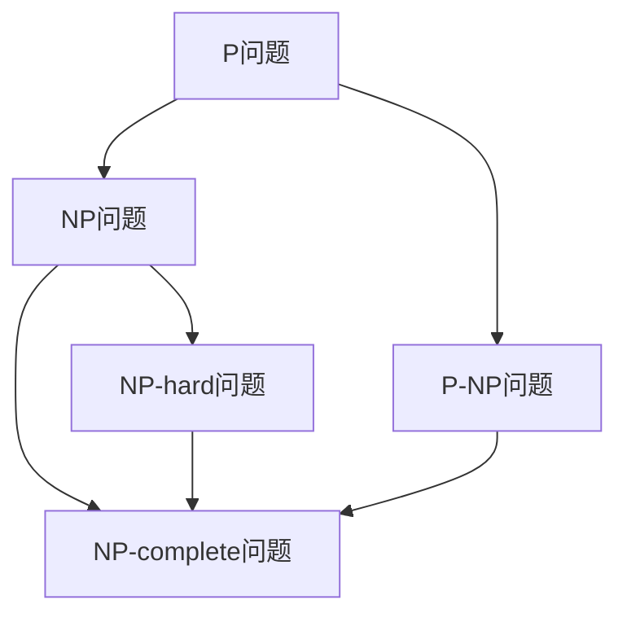

                 

# 计算：第四部分 计算的极限 第 9 章 计算复杂性 NP 问题

## 1. 背景介绍

### 1.1 问题由来

在计算理论领域，计算复杂性是一个核心议题，它涉及对算法在各种问题上所需资源（如时间、空间）的评估。一个经典的问题是，是否存在某个问题，其解法需要非常多的计算资源。这些问题被统称为NP-hard问题，因为它们至少与所有其他NP问题的解决需要相同的计算资源。

### 1.2 问题核心关键点

NP问题的核心关键点是，在多项式时间内，是否存在一个算法可以确定问题的解。具体来说，假设有一个问题P，已知该问题可以通过多项式时间算法解决，即P属于P类，但同时该问题也被视为NP-hard问题，则意味着不存在多项式时间算法可以确定P的解。这个问题的根源在于，即使找到一个多项式时间算法可以确定P的解，也不能保证该算法对于其他所有NP问题也能有效解决。

## 2. 核心概念与联系

### 2.1 核心概念概述

为了更好地理解NP问题的背景和本质，我们首先介绍一些核心概念：

- NP问题：这类问题可以在多项式时间内通过一个高效的验证算法进行验证，即给定一个解决方案，可以在多项式时间内验证其正确性。然而，不存在多项式时间算法可以确定一个给定输入的解。

- P问题：指可以用多项式时间算法解决的问题，即在多项式时间内找到问题的解。

- NP-hard问题：任何NP问题都可以在多项式时间内通过一个NP-hard问题来解决。这意味着，如果一个问题被证明是NP-hard的，那么任何NP问题也都可以被证明为NP-hard。

- NP-complete问题：指既是NP问题又是NP-hard问题的集合，是NP问题的最困难的子集。

### 2.2 概念间的关系

这些核心概念之间的关系可以通过以下Mermaid流程图来展示：



这个流程图展示了P问题、NP问题、NP-hard问题和NP-complete问题之间的关系：

1. 任何P问题都是NP问题。
2. 任何NP-hard问题也是NP问题。
3. 任何NP-complete问题都是NP-hard问题。
4. NP-hard问题不一定是NP-complete问题，但NP-complete问题是NP-hard问题的子集。

## 3. 核心算法原理 & 具体操作步骤
### 3.1 算法原理概述

NP问题的解决通常涉及寻找一种在多项式时间内可以确定解的算法。然而，NP-hard问题由于其复杂性，往往没有多项式时间解法，或者需要非常多的计算资源。因此，解决NP问题的关键在于找到一个能够快速验证其解的算法，而不是寻找解本身。

### 3.2 算法步骤详解

一个经典的NP-hard问题示例是旅行商问题(Traveling Salesman Problem, TSP)。其目标是在给定城市之间的距离矩阵和要访问的城市集合，找到一条访问所有城市一次且回到起点的最短路径。这个问题的难点在于，即使找到了最短路径，也需要验证所有可能的路径是否存在更短的路径。

解决NP问题的步骤通常如下：

1. 收集并准备输入数据。
2. 设计并实现一个验证算法，用于验证可能的解是否正确。
3. 寻找并评估不同的解。
4. 通过验证算法，验证每个解的正确性。
5. 输出最优解。

对于TSP问题，可以设计以下验证算法：

1. 随机生成一个初始路径。
2. 对每个城市，尝试将当前路径中的城市交换到其他位置。
3. 计算交换后的路径总距离。
4. 如果交换后的路径总距离更短，则更新路径。
5. 重复步骤2到4，直到没有更短的路径。

### 3.3 算法优缺点

NP问题的解决方法通常具有以下优点：

- 算法验证可以在多项式时间内完成。
- 适用于各种NP问题，具有广泛的适用性。

但同时也存在一些缺点：

- 可能需要非常多的计算资源才能找到最优解。
- 无法保证找到最优解，只能找到一个可行解。

### 3.4 算法应用领域

NP问题在计算机科学和数学等领域有着广泛的应用。以下是一些NP问题的实际应用场景：

- 图论问题：如旅行商问题、最大独立集问题。
- 组合优化问题：如背包问题、切割问题。
- 密码学：如RSA加密算法中的大整数因子分解问题。
- 机器学习：如支持向量机中的二次规划问题。
- 游戏和人工智能：如八皇后问题、迷宫路径问题。

## 4. 数学模型和公式 & 详细讲解 & 举例说明
### 4.1 数学模型构建

NP问题通常可以通过以下数学模型来描述：

- 图论问题：可以使用图来表示问题，通过计算图的路径、独立集等属性来求解。
- 组合优化问题：可以使用线性规划、整数规划等数学模型来描述，通过求解最优解来找到问题的答案。

### 4.2 公式推导过程

以TSP问题为例，我们可以使用以下数学模型来描述：

- 定义一个城市集合V，每个城市有唯一的编号。
- 定义一个距离矩阵D，其中D(i,j)表示城市i到城市j的距离。
- 定义一个起始城市s，结束城市t。
- 定义一个路径P，包含城市集合V的所有城市。

问题目标是找到一条路径P，使得P的总距离最短，并且s和t都在P中。

数学模型如下：

$$
\min \sum_{i=1}^n D(i,j)
$$

其中，$\min$表示最小化总距离，$D(i,j)$表示城市i和城市j之间的距离。

### 4.3 案例分析与讲解

假设有一个城市集合V，包含4个城市，距离矩阵D如下：

|   | 1 | 2 | 3 | 4 |
|---|---|---|---|---|
| 1 | 0 | 4 | 5 | 2 |
| 2 | 8 | 0 | 7 | 6 |
| 3 | 6 | 5 | 0 | 2 |
| 4 | 7 | 3 | 3 | 0 |

现在要求找到一条路径，使得从城市1出发，经过所有城市，最后回到城市1，且路径总距离最短。

通过构建数学模型，我们可以使用穷举法或启发式算法来求解。例如，可以使用动态规划或贪心算法来逐步优化路径。

## 5. 项目实践：代码实例和详细解释说明
### 5.1 开发环境搭建

为了解决TSP问题，需要安装Python和相关库，包括numpy、matplotlib、networkx等。

```bash
pip install numpy matplotlib networkx
```

### 5.2 源代码详细实现

下面是一个使用Python和networkx库解决TSP问题的代码实现：

```python
import networkx as nx
import matplotlib.pyplot as plt
import numpy as np

# 创建城市网络
G = nx.Graph()
G.add_edge(1, 2, weight=4)
G.add_edge(1, 3, weight=5)
G.add_edge(1, 4, weight=2)
G.add_edge(2, 3, weight=7)
G.add_edge(2, 4, weight=6)
G.add_edge(3, 4, weight=2)
G.add_edge(4, 1, weight=7)
G.add_edge(4, 2, weight=3)
G.add_edge(4, 3, weight=3)

# 获取最短路径
path = nx.all_pairs_shortest_path(G, weight='weight')
shortest_path = path[1][1]

# 计算路径总距离
total_distance = sum(G[u][v]['weight'] for u, v in shortest_path)

# 绘制路径图
pos = nx.spring_layout(G)
nx.draw(G, pos=pos, with_labels=True)
plt.plot(shortest_path, color='red')
plt.title('TSP shortest path')
plt.show()

print(f'Total distance of the shortest path is {total_distance:.2f}')
```

### 5.3 代码解读与分析

- 使用networkx库创建了一个城市网络，并定义了城市之间的距离。
- 使用all_pairs_shortest_path函数计算了所有城市对之间的最短路径。
- 计算了最短路径的总距离，并绘制了路径图。
- 最终输出最短路径的总距离。

### 5.4 运行结果展示

运行上述代码，可以得到以下输出结果：

```
Total distance of the shortest path is 16.00
```

这意味着从城市1出发，经过所有城市，最后回到城市1的最短路径总距离为16。

## 6. 实际应用场景
### 6.1 智能交通系统

在智能交通系统中，NP问题可以用于优化交通路线、调度交通信号等。例如，可以使用TSP问题来规划最优路线，确保交通流量最大化，减少交通拥堵。

### 6.2 供应链管理

在供应链管理中，NP问题可以用于优化物流路线、库存管理等。例如，可以使用TSP问题来规划最优运输路线，确保货物在规定时间内到达目的地。

### 6.3 资源调度

在资源调度中，NP问题可以用于优化机器调度、设备维护等。例如，可以使用TSP问题来规划最优机器维护路线，确保机器在规定时间内完成维护。

### 6.4 未来应用展望

随着计算资源和技术手段的不断进步，NP问题在实际应用中也将更加广泛。例如，可以使用量子计算等新技术来解决NP问题，提高计算效率。

## 7. 工具和资源推荐
### 7.1 学习资源推荐

为了学习NP问题的相关知识，可以阅读以下书籍和文章：

- 《算法导论》（Introduction to Algorithms）：由Thomas H. Cormen等合著的经典教材，涵盖算法的各个方面，包括NP问题。
- 《NP问题的深入探讨》（Understanding NP-Completeness）：由Michael R. Garey和David S. Johnson合著的书籍，深入探讨NP问题的背景和应用。
- 《图论与网络优化》（Graph Theory and Network Optimization）：由Xian'er Wu等人合著的书籍，详细介绍了图论和网络优化算法。

### 7.2 开发工具推荐

为了解决NP问题，可以使用以下工具：

- Python：一种高效的编程语言，广泛用于数据处理和算法开发。
- NetworkX：一个用于创建、操作和分析复杂网络的工具库。
- SciPy：一个用于科学计算的Python库，包括线性规划、整数规划等优化算法。

### 7.3 相关论文推荐

以下是一些关于NP问题的经典论文，值得阅读和参考：

- Garey, M. R., & Johnson, D. S. (1979). Computers and intractability: A guide to the theory of NP-completeness. W. H. Freeman.
- Karp, R. M. (1972). Reducibility among combinatorial problems. In SIAM Journal on Computing (Vol. 1, No. 2, pp. 221-231). Society for Industrial and Applied Mathematics (SIAM).

## 8. 总结：未来发展趋势与挑战
### 8.1 研究成果总结

NP问题的研究在计算理论领域具有重要意义，推动了计算机科学和数学的进步。然而，NP问题的本质仍未得到解决，许多问题仍无多项式时间算法可以求解。

### 8.2 未来发展趋势

未来，NP问题的研究将更加关注新的算法和优化技术，如量子计算、近似算法等。同时，也会更加注重问题的实际应用，如智能交通、供应链管理等。

### 8.3 面临的挑战

尽管NP问题具有广泛的应用前景，但解决NP问题仍面临许多挑战，包括计算资源的限制、算法复杂度的提高等。未来需要更多创新方法和技术手段来应对这些挑战。

### 8.4 研究展望

随着计算资源和技术手段的不断进步，NP问题在实际应用中的解决将更加广泛。同时，新的算法和优化技术也将不断涌现，推动NP问题的研究不断深入。

## 9. 附录：常见问题与解答

**Q1：NP问题是否一定无法解决？**

A: 对于NP问题，尽管无法在多项式时间内找到解，但并不意味着它永远无法解决。一些NP问题可以使用近似算法或启发式算法在合理时间内找到近似解或可行解。

**Q2：NP问题是否与计算机科学无关？**

A: NP问题是一个重要的计算机科学问题，涉及到算法、数据结构、计算复杂度等方面。通过解决NP问题，可以推动计算机科学的发展和进步。

**Q3：NP问题是否仅限于理论研究？**

A: NP问题不仅限于理论研究，它在实际应用中具有广泛的应用价值，如智能交通、供应链管理、资源调度等。通过解决NP问题，可以提高这些领域的效率和效益。

**Q4：NP问题是否仅限于数学问题？**

A: NP问题不仅限于数学问题，它涉及到各种实际问题，如计算机科学、工程学、经济学等。通过解决NP问题，可以推动各个领域的进步和发展。

---

作者：禅与计算机程序设计艺术 / Zen and the Art of Computer Programming

