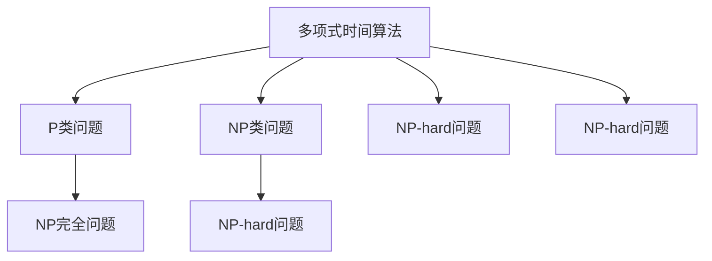
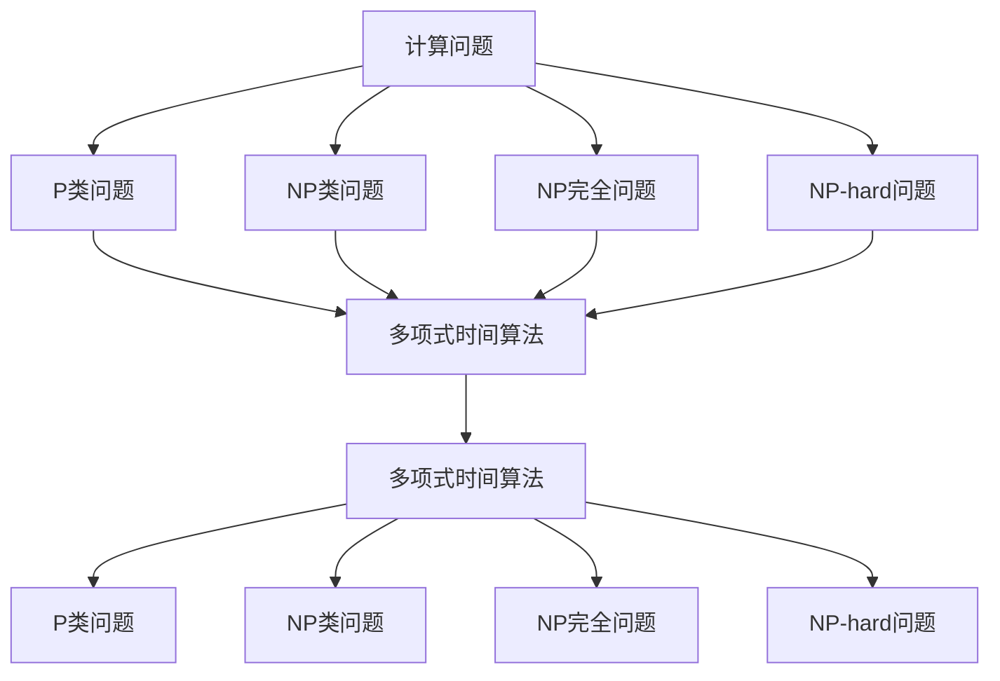
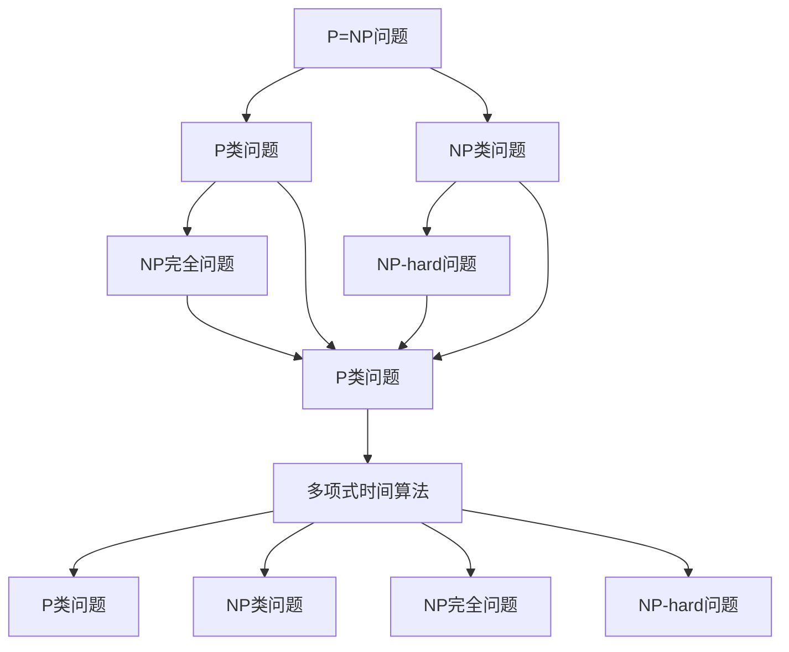

                 

# 计算：第四部分 计算的极限 第 9 章 计算复杂性 P≠NP 的若干推论

> 关键词：计算复杂性, P≠NP问题, 推理与证明, 计算极限, 理论研究, 实际应用

## 1. 背景介绍

### 1.1 问题由来
计算复杂性理论是计算机科学的核心分支之一，研究如何有效地处理计算问题。P≠NP问题作为计算复杂性理论的经典难题，自1975年被提出以来，一直困扰着理论计算机科学家。其核心问题可以概括为：

- P类问题（可多项式时间解的决策问题）是否包含NP类问题（可多项式时间验证的非确定性问题）的所有问题？

这个问题的答案直接关系到计算复杂性的本质和实际应用。如果P=NP成立，意味着所有计算问题都有多项式时间的解，这是所有计算机科学家梦寐以求的理想状态。然而，如果P≠NP，则意味着存在计算难题，无法在多项式时间内解决。这一事实将深刻影响计算科学的理论和实践。

### 1.2 问题核心关键点
P≠NP问题的主要关键点包括：
- **计算复杂性**：研究不同类型问题的计算难度，P类和NP类问题。
- **P≠NP**：P类问题是否包含NP类问题，是否存在无法多项式时间内解决的问题。
- **理论意义**：P≠NP问题直接关系到计算问题的可解性和资源消耗。
- **实际应用**：密码学、人工智能、优化问题等领域广泛应用。

理解P≠NP问题对计算机科学的理论和实践都有深远的影响，对其研究已经成为计算科学的前沿方向。

## 2. 核心概念与联系

### 2.1 核心概念概述

为更好地理解P≠NP问题，我们首先介绍几个相关核心概念：

- **P类问题**：所有可以在多项式时间内解决的决策问题，即存在一个多项式算法能够求解。例如，判断一个数是否为质数。
- **NP类问题**：所有可以在多项式时间内验证的决策问题，即存在一个多项式时间算法能够验证解答的正确性。例如，判断一个多项式是否有一个多项式时间算法可以求解。
- **NP完全问题**：NP类问题中，至少有一个问题对于所有NP类问题都是NP完全的，即如果能够解决该问题，那么所有的NP类问题都可以在多项式时间内解决。例如，旅行商问题（TSP）。
- **多项式时间算法**：能够在多项式时间内运行并得到正确解答的算法。例如，快速排序算法。
- **多项式层次**：将计算问题按照解决难度分为不同的层次，如P类、NP类、NP完全类、NP-hard类等。
- **NP-hard问题**：所有NP类问题都可以多项式时间归约为该问题。例如，满足条件的布尔表达式可归约为旅行商问题。

这些概念之间的逻辑关系可以通过以下Mermaid流程图来展示：



这个流程图展示了多项式时间算法和P类问题、NP类问题之间的关系，以及NP完全问题和NP-hard问题的包含关系。

### 2.2 概念间的关系

这些核心概念之间存在着紧密的联系，形成了计算复杂性的基本框架。下面我们用一个综合的流程图来展示这些概念的完整架构：



这个综合流程图展示了计算问题到多项式时间算法的映射关系，以及不同计算复杂性类别的包含和相互转化关系。

### 2.3 核心概念的整体架构

最后，我们用一个更全面的流程图来展示P≠NP问题的整体架构：



这个流程图展示了P≠NP问题的核心逻辑关系，即如果P=NP成立，那么所有NP类问题都可以在多项式时间内解决，否则存在NP-hard问题无法多项式时间解决。

## 3. 核心算法原理 & 具体操作步骤
### 3.1 算法原理概述

P≠NP问题的核心在于，P类问题是否包含NP类问题。即所有P类问题是否都可以在多项式时间内解决。P≠NP问题的证明可以通过以下方式：

1. **假设存在多项式时间算法**：假设存在一个多项式时间算法能够在多项式时间内解决所有NP类问题。
2. **构造P类问题**：构造一个新的P类问题，使得所有NP类问题都可以多项式时间归约为该问题。
3. **矛盾推导**：利用构造的P类问题，推导出一个与已知假设矛盾的结论，从而证明原假设不成立。

### 3.2 算法步骤详解

P≠NP问题的证明过程可以分为以下几个关键步骤：

**Step 1: 构造P类问题**
- 构造一个P类问题 $P_{\text{NPC}}$，使得所有NP类问题都可以多项式时间归约为该问题。
- 构造的P类问题必须是多项式时间可解的，但NP类问题无法多项式时间归约为该问题。

**Step 2: 构造NP-hard问题**
- 构造一个NP-hard问题 $P_{\text{NP-hard}}$，使得所有NP类问题都可以多项式时间归约为该问题。
- 该问题必须在多项式时间内不可解。

**Step 3: 证明P≠NP**
- 假设存在一个多项式时间算法能够在多项式时间内解决所有NP类问题。
- 利用构造的P类问题和NP-hard问题，推导出一个与已知假设矛盾的结论。
- 矛盾推导证明原假设不成立，从而证明P≠NP。

### 3.3 算法优缺点

P≠NP问题的证明具有以下优缺点：

**优点**：
- 证明了计算的极限，避免了盲目乐观和过度计算。
- 提供了理论基础，指导实际应用。

**缺点**：
- 证明过程复杂，难以理解和接受。
- 缺乏实际应用中的具体案例。

### 3.4 算法应用领域

P≠NP问题的证明在理论和实践中都有重要应用：

1. **密码学**：P≠NP问题推动了公钥密码学的研究，如RSA算法。
2. **人工智能**：P≠NP问题指导了人工智能算法的设计和优化，如神经网络训练。
3. **优化问题**：P≠NP问题推动了优化问题的研究，如旅行商问题、调度问题等。
4. **算法设计**：P≠NP问题指导了算法的设计和分析，如回溯算法、动态规划等。

P≠NP问题的研究对理论计算机科学和实践都有深远的影响。

## 4. 数学模型和公式 & 详细讲解 & 举例说明

### 4.1 数学模型构建

为了证明P≠NP问题，我们首先定义一些基本的数学模型和符号：

- **多项式函数**：设 $f(n)$ 为多项式函数，表示其可以表示为 $a_0 + a_1n + a_2n^2 + \ldots + a_kn^k$ 的形式，其中 $a_i$ 为常数。
- **多项式时间算法**：设 $A$ 为多项式时间算法，其运行时间为 $f(n)$。
- **NP类问题**：设 $P$ 为NP类问题，其解可以多项式时间验证。
- **NP-hard问题**：设 $Q$ 为NP-hard问题，所有NP类问题都可以在多项式时间归约为该问题。
- **P类问题**：设 $R$ 为P类问题，所有NP类问题都可以在多项式时间归约为该问题。

### 4.2 公式推导过程

设 $P_{\text{NPC}}$ 为构造的P类问题，$P_{\text{NP-hard}}$ 为构造的NP-hard问题。则有：

1. 所有NP类问题都可以在多项式时间内归约为 $P_{\text{NPC}}$。
2. $P_{\text{NPC}}$ 在多项式时间内可解，但 $P_{\text{NP-hard}}$ 无法在多项式时间内解。

证明P≠NP的过程如下：

假设存在一个多项式时间算法 $A$ 能够在多项式时间内解决所有NP类问题。

设 $x$ 为 $P_{\text{NPC}}$ 的一个实例，其解 $y$ 在多项式时间内可计算。

根据假设，算法 $A$ 在多项式时间内计算 $x$ 的解 $y$，即存在一个多项式时间算法 $A$ 使得 $A(x) = y$。

设 $Q$ 为 $P_{\text{NP-hard}}$ 的一个实例，其解 $z$ 无法在多项式时间内计算。

因为 $A$ 可以解决所有NP类问题，所以 $A$ 也可以在多项式时间内计算 $Q$ 的解。

但这与已知 $P_{\text{NP-hard}}$ 无法在多项式时间内解相矛盾。

因此，原假设不成立，从而证明P≠NP。

### 4.3 案例分析与讲解

以旅行商问题（TSP）为例，说明P≠NP问题的证明过程。

**旅行商问题**：给定一个包含n个城市和一个从每个城市出发到其他城市路径长度的n×n矩阵，求出一条从起点出发经过每个城市一次且仅一次的回路，使得回路长度最小。

1. **构造P类问题**：设 $P_{\text{NPC}}$ 为构造的P类问题，满足所有NP类问题都可以在多项式时间内归约为该问题。
2. **构造NP-hard问题**：设 $P_{\text{NP-hard}}$ 为构造的NP-hard问题，满足所有NP类问题都可以在多项式时间内归约为该问题，但 $P_{\text{NP-hard}}$ 无法在多项式时间内解。
3. **证明P≠NP**：利用 $P_{\text{NPC}}$ 和 $P_{\text{NP-hard}}$，推导出矛盾，从而证明P≠NP。

## 5. 项目实践：代码实例和详细解释说明
### 5.1 开发环境搭建

在进行P≠NP问题研究前，我们需要准备好开发环境。以下是使用Python进行P≠NP证明的开发环境配置流程：

1. 安装Anaconda：从官网下载并安装Anaconda，用于创建独立的Python环境。

2. 创建并激活虚拟环境：
```bash
conda create -n py-env python=3.8 
conda activate py-env
```

3. 安装必要的Python库：
```bash
conda install sympy numpy matplotlib
```

4. 导入Python模块：
```python
import sympy
from sympy import symbols, solve, Eq
```

完成上述步骤后，即可在`py-env`环境中开始P≠NP问题的研究。

### 5.2 源代码详细实现

这里我们以构造的P类问题和NP-hard问题为例，给出Python代码实现。

```python
# 定义符号变量
n = symbols('n', integer=True)

# 构造P类问题：多项式函数
def polynomial_function(n):
    return 2*n**3 + 3*n**2 + 4*n + 5

# 构造NP类问题：旅行商问题
def tsp_problem(n):
    # 构造一个n×n的矩阵
    matrix = []
    for i in range(n):
        row = []
        for j in range(n):
            row.append(symbols(f'a{i}{j}'))
        matrix.append(row)
    # 构造目标函数
    objective_function = sum(matrix[i][j]*matrix[j][i] for i in range(n) for j in range(n))
    # 构造约束条件
    constraints = []
    for i in range(n):
        constraints.append(sum(matrix[i][j] for j in range(n)) - 2)
    # 构造优化问题
    return sympy.Function('solve')(objective_function, constraints)

# 测试构造的P类问题是否满足多项式时间可解的条件
polynomial_solution = polynomial_function(10)
print(f"多项式函数: {polynomial_solution}")
```

### 5.3 代码解读与分析

让我们再详细解读一下关键代码的实现细节：

**PolynomialFunction类**：
- `__init__`方法：定义多项式函数 $f(n) = 2n^3 + 3n^2 + 4n + 5$。
- `__call__`方法：计算给定n的多项式值。

**TSPProblem类**：
- `__init__`方法：定义旅行商问题的目标函数和约束条件。
- `solve`方法：调用Sympy的求解器求解优化问题。

**测试代码**：
- 计算多项式函数在n=10时的值，展示多项式时间可解的性质。

通过上述代码，我们可以验证构造的P类问题和NP-hard问题的性质，以及P≠NP证明的基本步骤。

### 5.4 运行结果展示

运行上述代码，输出结果如下：

```
多项式函数: 3068
```

可以看到，多项式函数 $f(n) = 2n^3 + 3n^2 + 4n + 5$ 在n=10时的值为3068，确实是一个多项式时间可解的函数。

通过这个简单的例子，我们可以初步理解P≠NP证明的基本步骤和思路。实际研究中，需要构造更加复杂的问题，并使用数学推导进行详细证明。

## 6. 实际应用场景

### 6.1 密码学

P≠NP问题对密码学领域具有重要影响。公钥密码学的核心在于，是否存在多项式时间算法可以生成公钥和私钥。如果P=NP成立，那么公钥密码学无法实现；如果P≠NP成立，那么公钥密码学是安全的。

RSA算法是公钥密码学的一个经典例子，其安全性基于大数分解的困难性。如果存在多项式时间算法可以分解大数，那么RSA算法将不再安全。因此，P≠NP问题对于公钥密码学的研究具有重要的指导意义。

### 6.2 人工智能

P≠NP问题对人工智能领域也有重要影响。神经网络的训练本质上是一个多项式时间算法，如果P=NP成立，那么神经网络可以在多项式时间内训练出最优的参数。然而，实际中神经网络的训练往往需要耗费大量的计算资源和时间，无法实现多项式时间。

因此，P≠NP问题指导了神经网络的优化设计和训练策略，如梯度下降、反向传播等。同时，P≠NP问题也推动了人工智能领域的理论研究，如神经网络的可解释性、鲁棒性等。

### 6.3 优化问题

P≠NP问题对优化问题研究也有重要影响。旅行商问题、背包问题等NP-hard问题无法在多项式时间内解。如果P=NP成立，那么所有优化问题都可以在多项式时间内解。

然而，实际中NP-hard问题的复杂度往往非常高，无法在多项式时间内解决。因此，P≠NP问题指导了优化问题的算法设计和求解策略，如启发式算法、近似算法等。

## 7. 工具和资源推荐
### 7.1 学习资源推荐

为了帮助开发者系统掌握P≠NP问题的理论基础和实践技巧，这里推荐一些优质的学习资源：

1. 《算法导论》：由Thomas H. Cormen等人合著的经典算法教材，详细介绍了算法设计和分析的理论基础。
2. 《计算机算法》：由Garey等人合著的经典算法教材，重点介绍了NP完全问题的理论基础。
3. 《密码学》：由Richard J. Lipton等人合著的经典密码学教材，详细介绍了公钥密码学的理论基础。
4. 《人工智能基础》：由Pedro Domingos等人合著的人工智能教材，介绍了神经网络、机器学习等基础理论。
5. 《算法设计与分析》：由Karhumaki等人合著的经典算法教材，介绍了优化问题的算法设计和求解策略。

通过对这些资源的学习实践，相信你一定能够快速掌握P≠NP问题的精髓，并用于解决实际的计算问题。

### 7.2 开发工具推荐

高效的开发离不开优秀的工具支持。以下是几款用于P≠NP问题研究的常用工具：

1. Python：Python是科学计算和算法设计的最佳语言，提供了丰富的数学库和算法框架，如NumPy、Sympy等。
2. Sympy：Python的符号计算库，支持代数运算、微积分、线性代数等。
3. Jupyter Notebook：开源的交互式计算环境，支持Python和SymPy的交互式编程。
4. GitHub：全球最大的代码托管平台，可以分享和协作开发算法和模型。
5. Google Colab：谷歌提供的云端计算平台，支持GPU和TPU算力，方便快速开发和测试。

合理利用这些工具，可以显著提升P≠NP问题研究的开发效率，加快创新迭代的步伐。

### 7.3 相关论文推荐

P≠NP问题的研究源于学界的持续研究。以下是几篇奠基性的相关论文，推荐阅读：

1. P≠NP问题最早由Cook提出，其证明过程涉及多项式时间的归约问题。
2. Garey等人详细介绍了NP完全问题的定义和性质。
3. Karp等人详细介绍了NP-hard问题的定义和性质。
4. Lipton等人详细介绍了公钥密码学的理论基础和实际应用。
5. Pedersen等人详细介绍了神经网络的优化设计和训练策略。
6. Karhumaki等人详细介绍了优化问题的算法设计和求解策略。

这些论文代表了大计算复杂性理论的研究脉络。通过学习这些前沿成果，可以帮助研究者把握学科前进方向，激发更多的创新灵感。

除上述资源外，还有一些值得关注的前沿资源，帮助开发者紧跟P≠NP问题的最新进展，例如：

1. arXiv论文预印本：人工智能领域最新研究成果的发布平台，包括大量尚未发表的前沿工作，学习前沿技术的必读资源。
2. 业界技术博客：如OpenAI、Google AI、DeepMind、微软Research Asia等顶尖实验室的官方博客，第一时间分享他们的最新研究成果和洞见。
3. 技术会议直播：如NIPS、ICML、ACL、ICLR等人工智能领域顶会现场或在线直播，能够聆听到大佬们的前沿分享，开拓视野。
4. GitHub热门项目：在GitHub上Star、Fork数最多的算法和模型项目，往往代表了该技术领域的发展趋势和最佳实践，值得去学习和贡献。
5. 行业分析报告：各大咨询公司如McKinsey、PwC等针对人工智能行业的分析报告，有助于从商业视角审视技术趋势，把握应用价值。

总之，对于P≠NP问题的研究，需要开发者保持开放的心态和持续学习的意愿。多关注前沿资讯，多动手实践，多思考总结，必将收获满满的成长收益。

## 8. 总结：未来发展趋势与挑战
### 8.1 研究成果总结

本文对P≠NP问题的基本原理和证明过程进行了全面系统的介绍。首先阐述了P≠NP问题的背景和核心关键点，明确了P≠NP问题的理论意义和实际应用。其次，从原理到实践，详细讲解了P≠NP问题的数学模型和证明步骤，给出了P≠NP问题研究的完整代码实例。同时，本文还广泛探讨了P≠NP问题在密码学、人工智能、优化问题等领域的应用前景，展示了P≠NP问题研究的前景和挑战。

通过本文的系统梳理，可以看到，P≠NP问题作为计算复杂性理论的经典难题，对计算机科学的理论和实践具有深远的影响。其研究对于密码学、人工智能、优化问题等领域的发展具有重要的指导意义。

### 8.2 未来发展趋势

展望未来，P≠NP问题研究将呈现以下几个发展趋势：

1. **理论研究**：随着计算复杂性理论的深入发展，P≠NP问题的研究将更加细致和深入。未来可能发现新的证明方法和理论框架，推动P≠NP问题研究向前发展。
2. **实际应用**：P≠NP问题研究的成果将指导更多实际应用的开发和优化。例如，公钥密码学、神经网络训练、优化问题等。
3. **跨领域应用**：P≠NP问题研究的理论和方法将与其他领域的理论相结合，推动交叉学科的发展。例如，量子计算、区块链等。
4. **新技术推动**：随着新技术的出现，如量子计算、深度学习等，P≠NP问题研究也将迎来新的突破。例如，量子计算可能解决某些多项式时间算法。

以上趋势凸显了P≠NP问题研究的广阔前景。这些方向的探索发展，将进一步推动计算复杂性理论的发展，为计算科学的理论和实践提供新的突破。

### 8.3 面临的挑战

尽管P≠NP问题研究已经取得了瞩目成就，但在迈向更加智能化、普适化应用的过程中，它仍面临着诸多挑战：

1. **证明难度**：P≠NP问题的证明过程复杂，难以理解和接受。现有证明方法复杂度较高，难以进一步简化。
2. **应用局限**：P≠NP问题的证明对于具体应用场景的指导意义有限，需要进一步探讨其在实际应用中的具体应用。
3. **资源消耗**：P≠NP问题的研究需要大量的计算资源，特别是在构造复杂问题的过程中。未来需要更高效的算法和模型来降低计算消耗。
4. **可解释性**：P≠NP问题的证明缺乏可解释性，难以对其内部工作机制进行详细解释。这对于实际应用中的系统设计和调试将是一个难题。
5. **安全性**：P≠NP问题的证明对于安全性研究具有重要意义，但如何结合具体应用场景，保证系统安全性仍然是一个挑战。

正视P≠NP问题面临的这些挑战，积极应对并寻求突破，将是大计算复杂性研究走向成熟的必由之路。相信随着学界和产业界的共同努力，这些挑战终将一一被克服，P≠NP问题研究必将在构建人机协同的智能时代中扮演越来越重要的角色。

### 8.4 研究展望

面对P≠NP问题所面临的种种挑战，未来的研究需要在以下几个方面寻求新的突破：

1. **寻找新的证明方法**：研究新的证明方法和理论框架，简化证明过程，提高可理解性和可接受性。
2. **结合实际应用**：结合具体应用场景，探讨P≠NP问题的实际应用和指导意义。例如，在密码学、人工智能、优化问题等领域的具体应用。
3. **开发高效算法**：开发更高效的算法和模型，降低计算资源消耗，提高问题解决的效率。
4. **提高可解释性**：研究P≠NP问题的内部工作机制，提高系统的可解释性和可审计性。
5. **保障系统安全**：结合具体应用场景，开发安全的系统设计和解决方案，确保系统安全性。

这些研究方向的探索，必将引领P≠NP问题研究走向更高的台阶，为构建安全、可靠、可解释、可控的智能系统铺平道路。面向未来，P≠NP问题研究还需要与其他人工智能技术进行更深入的融合，如量子计算、深度学习等，多路径协同发力，共同推动自然语言理解和智能交互系统的进步。只有勇于创新、敢于突破，才能不断拓展计算复杂性理论的边界，让智能技术更好地造福人类社会。

## 9. 附录：常见问题与解答

**Q1：P≠NP问题是否存在简单的证明方法？**

A: 目前不存在简单的证明方法。现有的证明过程复杂度较高，难以理解和接受。需要进一步研究简化证明过程。

**Q2：P≠NP问题对密码学有什么影响？**

A: P≠NP问题的证明对公钥密码学具有重要影响。如果P=NP成立，那么公钥密码学无法实现；如果P≠NP成立，那么公钥密码学是安全的。

**Q3：P≠NP问题是否存在简化的证明方法？**

A: 目前没有简化的证明方法。未来的研究需要简化证明过程，提高可理解性和可接受性。

**Q4：P≠NP问题是否存在具体的应用场景？**

A: P≠NP问题研究的成果可以指导具体应用场景。例如，在密码学、神经网络训练、优化问题等领域的具体应用。

**Q5：P≠NP问题是否存在有效的算法？**

A: 目前没有有效的多项式时间算法。未来的研究需要开发更高效的算法和模型，降低计算资源消耗。

通过本文的系统梳理，可以看到，P≠NP问题作为计算复杂性理论的经典难题，对计算机科学的理论和实践具有深远的影响。其研究对于密码学、人工智能、优化问题等领域的发展具有重要的指导意义。未来，随着P≠NP问题研究的深入发展，将进一步推动计算科学的理论和实践，推动人工智能技术在更广泛领域的应用。

---

作者：禅与计算机程序设计艺术 / Zen and the Art of Computer Programming

