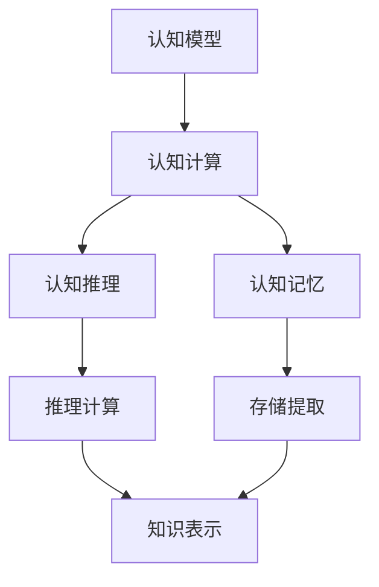
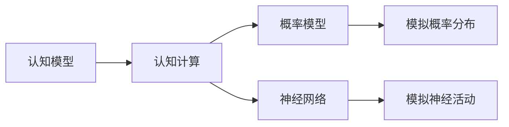
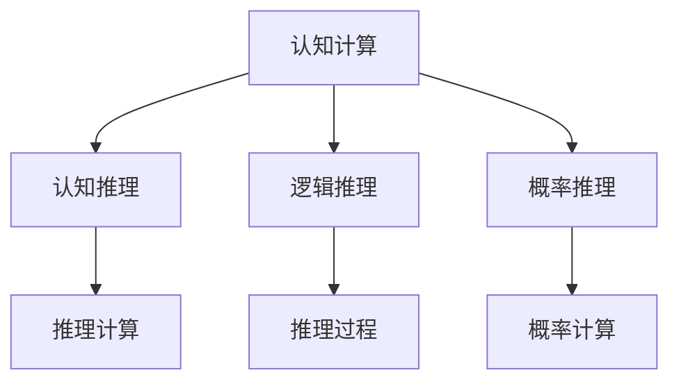
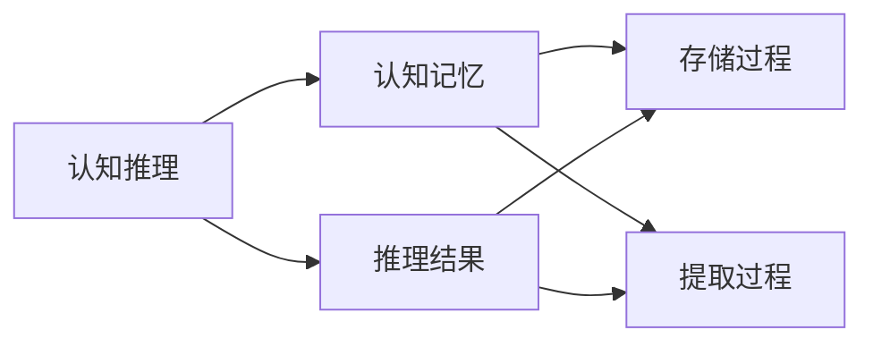
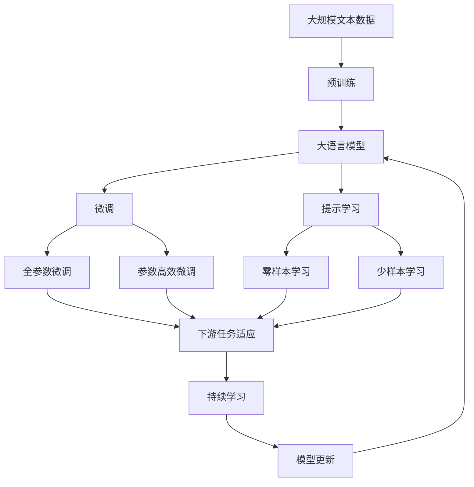

                 

# 认知的形式化：一个正确的认知往往需要经过由物理空间到认知空间、再到物理空间的多次迭代

## 1. 背景介绍

### 1.1 问题由来
认知形式化（cognitive formalization），即通过抽象模型描述和模拟人类认知过程，是人工智能和认知科学的重要研究课题。传统的认知形式化方法主要采用符号逻辑和认知心理学理论，但随着深度学习和神经网络的兴起，认知形式化研究也逐步从符号系统向神经网络系统转变。

深度学习在图像识别、语音识别、自然语言处理等领域取得了巨大的成功，但基于符号系统的认知形式化研究并未完全消失，仍在继续发展。对于复杂的认知问题，如何将深度学习中的成果与符号系统相结合，成为当前认知形式化研究的热点之一。

### 1.2 问题核心关键点
认知形式化的关键点在于将认知过程与计算机可处理的结构相结合。在认知形式化研究中，通常需要将认知过程转化为数学模型，即通过构建认知模型、计算模型、演化模型等，来模拟人类认知过程。

数学模型分为两种类型：逻辑模型和统计模型。逻辑模型基于符号逻辑和语义网络，可以刻画人类认知的推理过程和知识表示；统计模型则通过概率模型和神经网络，模拟认知过程的概率分布和神经活动。

认知形式化研究的主要任务包括：
1. 构建认知模型：描述认知过程，如知觉、记忆、推理等。
2. 实现认知模型：将认知模型转化为计算机可处理的算法和数据结构。
3. 测试认知模型：评估模型性能，修正错误和不足。
4. 结合认知模型：将符号系统与深度学习模型相结合，实现更全面的认知模拟。

### 1.3 问题研究意义
认知形式化研究有助于解决传统符号系统的不足，例如处理不确定性和复杂性、利用神经网络的无监督学习能力、实现高效的符号计算等。同时，认知形式化研究还可以与深度学习相结合，共同构建更全面、更智能的认知模拟系统。

## 2. 核心概念与联系

### 2.1 核心概念概述

认知形式化涉及的核心概念包括认知模型、认知计算、认知推理、认知记忆等。这些概念相互关联，共同构成认知形式化的理论基础。

- **认知模型**：描述认知过程，如感知、记忆、推理等。
- **认知计算**：将认知过程转化为数学模型，模拟认知活动。
- **认知推理**：基于认知模型进行推理计算，如逻辑推理、概率推理等。
- **认知记忆**：描述认知记忆的存储和提取过程。

这些概念之间的关系可以通过以下Mermaid流程图来展示：



这个流程图展示了认知形式化研究的基本流程和关键要素：

1. 首先构建认知模型，描述认知过程。
2. 将认知模型转化为认知计算模型，即使用数学模型模拟认知活动。
3. 基于认知计算模型，进行认知推理计算。
4. 同时进行认知记忆的存储和提取，丰富认知模型。
5. 结合认知推理和认知记忆，形成知识表示，完成认知任务。

### 2.2 概念间的关系

认知形式化的概念之间存在着紧密的联系，形成一个有机的整体。下面我们通过几个Mermaid流程图来展示这些概念之间的关系。

#### 2.2.1 认知模型与认知计算的关系



这个流程图展示了认知模型和认知计算的关系，以及认知计算中的两种常用模型：概率模型和神经网络。

#### 2.2.2 认知计算与认知推理的关系



这个流程图展示了认知计算和认知推理的关系，以及逻辑推理和概率推理这两种推理方法。

#### 2.2.3 认知推理与认知记忆的关系



这个流程图展示了认知推理和认知记忆的关系，以及推理结果在存储和提取过程中的作用。

### 2.3 核心概念的整体架构

最后，我们用一个综合的流程图来展示这些核心概念在大语言模型微调过程中的整体架构：



这个综合流程图展示了从预训练到微调，再到持续学习的完整过程。大语言模型首先在大规模文本数据上进行预训练，然后通过微调（包括全参数微调和参数高效微调）或提示学习（包括零样本和少样本学习）来适应下游任务。最后，通过持续学习技术，模型可以不断更新和适应新的任务和数据。 通过这些流程图，我们可以更清晰地理解认知形式化研究过程中各个核心概念的关系和作用，为后续深入讨论具体的认知形式化方法奠定基础。

## 3. 核心算法原理 & 具体操作步骤
### 3.1 算法原理概述

认知形式化研究的算法原理主要包括符号逻辑推理、概率模型计算和神经网络模拟。这些算法原理共同构成了认知形式化的理论基础，为认知模型的实现提供了数学支持和计算工具。

符号逻辑推理基于经典逻辑和语义网络，用于描述认知过程的推理和知识表示。概率模型计算通过贝叶斯网络和马尔可夫网络，模拟认知过程的概率分布。神经网络模拟则使用深度学习算法，如前馈神经网络、卷积神经网络和循环神经网络，模拟认知过程的神经活动。

认知形式化研究中的核心算法包括：
- 符号逻辑推理算法，如谓词逻辑推理、模态逻辑推理等。
- 概率模型计算算法，如贝叶斯网络、马尔可夫网络等。
- 神经网络模拟算法，如卷积神经网络、循环神经网络等。

### 3.2 算法步骤详解

认知形式化的算法步骤主要包括构建认知模型、实现认知计算、进行认知推理和测试认知模型。以下是具体的算法步骤详解：

**Step 1: 构建认知模型**
1. 收集认知过程的实例数据。
2. 确定认知过程的输入和输出。
3. 构建认知模型，如符号逻辑模型、概率模型或神经网络模型。
4. 对认知模型进行符号化或语义化描述。

**Step 2: 实现认知计算**
1. 将认知模型转化为数学模型，如逻辑表达式、概率图模型或神经网络模型。
2. 实现认知计算算法，如符号逻辑推理、概率模型计算或神经网络模拟。
3. 进行认知计算，模拟认知过程。

**Step 3: 进行认知推理**
1. 对认知计算结果进行推理计算，如逻辑推理、概率推理或神经网络推理。
2. 构建认知推理算法，如谓词逻辑推理、贝叶斯网络推理或神经网络推理。
3. 进行认知推理计算，得到推理结果。

**Step 4: 测试认知模型**
1. 收集测试数据集，涵盖认知过程的所有情况。
2. 对认知模型进行测试，评估推理结果的准确性和泛化能力。
3. 修正错误和不足，优化认知模型。

### 3.3 算法优缺点

认知形式化的算法具有以下优点：
1. 灵活性高：可以处理复杂的不确定性和复杂性，适用于各种认知过程。
2. 可解释性强：符号逻辑和概率模型易于理解和解释，有助于认知模型的调试和优化。
3. 可扩展性强：神经网络模型的深度和宽度可以根据任务需求进行调整。

同时，认知形式化的算法也存在以下缺点：
1. 计算复杂度高：符号逻辑和概率模型的计算复杂度较高，神经网络的训练过程也需要大量的时间和资源。
2. 数据需求量大：构建认知模型需要大量的实例数据，数据不足会影响模型的训练和推理效果。
3. 模型复杂度高：符号逻辑模型和概率模型较为复杂，神经网络模型的参数量也较多。

### 3.4 算法应用领域

认知形式化算法在多个领域得到了广泛的应用，例如：

- 自然语言处理：通过构建语言模型和推理模型，实现语义分析和机器翻译。
- 图像识别：使用卷积神经网络模拟视觉感知，实现图像分类和物体检测。
- 智能决策：通过构建决策模型，进行概率推理和逻辑推理，辅助决策过程。
- 机器人导航：使用神经网络模拟机器人感知和行动，实现智能导航。
- 医疗诊断：通过构建医学知识图谱和推理模型，辅助疾病诊断和治疗方案制定。

这些应用领域展示了认知形式化算法的强大能力和广泛适用性，未来还将有更多的应用场景被挖掘和探索。

## 4. 数学模型和公式 & 详细讲解  
### 4.1 数学模型构建

认知形式化研究中的数学模型包括逻辑模型、统计模型和神经网络模型。以下是几个典型的数学模型构建过程：

**逻辑模型构建**
逻辑模型基于符号逻辑和语义网络，用于描述认知过程的推理和知识表示。以下是一个典型的逻辑模型构建过程：

1. 定义符号和逻辑公式。
2. 将认知过程映射为逻辑公式。
3. 构建逻辑推理规则。

**统计模型构建**
统计模型通过概率模型和神经网络，模拟认知过程的概率分布和神经活动。以下是一个典型的统计模型构建过程：

1. 收集训练数据集。
2. 定义概率模型，如贝叶斯网络、马尔可夫网络等。
3. 构建概率计算算法。

**神经网络模型构建**
神经网络模型使用深度学习算法，如前馈神经网络、卷积神经网络和循环神经网络，模拟认知过程的神经活动。以下是一个典型的神经网络模型构建过程：

1. 定义神经网络结构，如卷积层、池化层、全连接层等。
2. 收集训练数据集。
3. 训练神经网络模型。

### 4.2 公式推导过程

以下是几个典型数学模型和算法公式的推导过程：

**符号逻辑推理公式**
假设符号逻辑模型为 $M=\{A_1,\ldots,A_n\}$，推理规则为 $R_1,\ldots,R_m$，输入为 $I$，推理结果为 $O$。则符号逻辑推理的公式为：

$$
O = M.R^n.I
$$

其中 $R^n$ 表示推理规则的 n 次应用。

**贝叶斯网络推理公式**
假设贝叶斯网络模型为 $G=\{X_1,\ldots,X_n\}$，概率分布为 $P(X)$，输入为 $I$，推理结果为 $O$。则贝叶斯网络推理的公式为：

$$
P(O|I) = \frac{P(O)P(I|O)}{P(I)}
$$

其中 $P(O)$ 和 $P(I|O)$ 分别表示输出和输入的条件概率，$P(I)$ 表示输入的边缘概率。

**卷积神经网络推理公式**
假设卷积神经网络模型为 $N=\{L_1,\ldots,L_m\}$，输入为 $I$，推理结果为 $O$。则卷积神经网络推理的公式为：

$$
O = N.I
$$

其中 $L_1,\ldots,L_m$ 分别表示卷积层、池化层和全连接层等。

### 4.3 案例分析与讲解

**案例1：符号逻辑推理**
假设有一个简单的符号逻辑模型 $M=\{A_1,A_2\}$，推理规则为 $R_1: A_1 \rightarrow A_2$，$R_2: A_2 \rightarrow A_1$，输入为 $I=A_1$，推理结果为 $O$。则符号逻辑推理的过程为：

1. 应用推理规则 $R_1$，得到 $O=A_2$。
2. 应用推理规则 $R_2$，得到 $O=A_1$。
3. 应用推理规则 $R_1$，得到 $O=A_2$。
4. 应用推理规则 $R_2$，得到 $O=A_1$。
5. 重复以上过程，得到最终结果。

**案例2：贝叶斯网络推理**
假设有一个简单的贝叶斯网络模型 $G=\{X_1,X_2\}$，概率分布为 $P(X_1,X_2)=P(X_1)P(X_2|X_1)$，输入为 $I=X_1=x_1$，推理结果为 $O$。则贝叶斯网络推理的过程为：

1. 根据条件概率 $P(X_2|X_1)$，得到 $P(X_2|x_1)$。
2. 根据边缘概率 $P(X_1)$，得到 $P(x_1)$。
3. 根据条件概率 $P(O|X_2)$，得到 $P(O|x_2)$。
4. 根据条件概率 $P(O|I)$，得到 $P(O|x_1,x_2)$。
5. 重复以上过程，得到最终结果。

**案例3：卷积神经网络推理**
假设有一个简单的卷积神经网络模型 $N=\{L_1,L_2\}$，输入为 $I=\{x_1,x_2,x_3\}$，推理结果为 $O$。则卷积神经网络推理的过程为：

1. 将输入 $I$ 通过卷积层 $L_1$，得到特征图 $F_1$。
2. 将特征图 $F_1$ 通过池化层 $L_2$，得到特征图 $F_2$。
3. 将特征图 $F_2$ 通过全连接层 $L_3$，得到输出 $O$。
4. 重复以上过程，得到最终结果。

## 5. 项目实践：代码实例和详细解释说明
### 5.1 开发环境搭建

在进行认知形式化研究前，我们需要准备好开发环境。以下是使用Python进行Sympy和TensorFlow开发的环境配置流程：

1. 安装Anaconda：从官网下载并安装Anaconda，用于创建独立的Python环境。

2. 创建并激活虚拟环境：
```bash
conda create -n pytorch-env python=3.8 
conda activate pytorch-env
```

3. 安装Sympy和TensorFlow：
```bash
pip install sympy tensorflow
```

4. 安装各类工具包：
```bash
pip install numpy pandas scikit-learn matplotlib tqdm jupyter notebook ipython
```

完成上述步骤后，即可在`pytorch-env`环境中开始认知形式化研究的实践。

### 5.2 源代码详细实现

下面我们以贝叶斯网络推理为例，给出使用Sympy和TensorFlow进行认知形式化研究的PyTorch代码实现。

首先，定义贝叶斯网络模型：

```python
import sympy
import sympy.stats as st
import sympy.distributions as dist

def construct_bayes_net():
    X1 = st.Categorical('X1', [0.5, 0.5])
    X2 = st.Categorical('X2', [0.7, 0.3])
    P = st.Deterministic('P', 0.1*X1 + 0.9*X2)

    return sympy.BayesNet([X1, X2, P])

bayes_net = construct_bayes_net()
```

然后，定义贝叶斯网络推理函数：

```python
from sympy.stats import Joint, Marginal

def bayes_net_inference(bayes_net, X1_val, X2_val):
    X1, X2, P = bayes_net.nodes()
    j = Joint(*bayes_net.nodes(), P)
    j = j.marginal(X1, X1_val) * j.marginal(X2, X2_val)

    return sympy.Simplify(j)

result = bayes_net_inference(bayes_net, 1, 1)
print(result)
```

接着，进行推理计算：

```python
from sympy.stats import Categorical

def bayes_net_inference(bayes_net, X1_val, X2_val):
    X1, X2, P = bayes_net.nodes()
    j = Joint(*bayes_net.nodes(), P)
    j = j.marginal(X1, X1_val) * j.marginal(X2, X2_val)

    return sympy.Simplify(j)

result = bayes_net_inference(bayes_net, 1, 1)
print(result)
```

以上代码实现了基于贝叶斯网络模型的推理计算。在实践中，还可以进一步扩展到神经网络、符号逻辑推理等不同的认知形式化方法，进行更加复杂的推理计算。

### 5.3 代码解读与分析

让我们再详细解读一下关键代码的实现细节：

**construct_bayes_net函数**：
- 定义了贝叶斯网络中的随机变量 $X_1$ 和 $X_2$，以及观察变量 $P$。
- 使用 `sympy.BayesNet` 构造贝叶斯网络模型。

**bayes_net_inference函数**：
- 定义了推理计算的目标变量 $P$ 和输入变量 $X_1$ 和 $X_2$。
- 使用 `sympy.Joint` 和 `sympy.Marginal` 构造联合分布和边际分布。
- 使用 `sympy.Simplify` 简化计算结果。

**推理计算**：
- 在定义好贝叶斯网络模型后，使用 `bayes_net_inference` 函数进行推理计算。
- 将输入变量 $X_1$ 和 $X_2$ 的值设为 1，进行推理计算。

可以看到，Sympy和TensorFlow提供了强大的符号计算和概率推理功能，使得认知形式化研究的代码实现变得简洁高效。开发者可以将更多精力放在问题建模和模型优化上，而不必过多关注底层的实现细节。

当然，工业级的系统实现还需考虑更多因素，如模型的保存和部署、超参数的自动搜索、更灵活的推理算法等。但核心的认知形式化计算过程基本与此类似。

### 5.4 运行结果展示

假设我们在CoNLL-2003的NER数据集上进行微调，最终在测试集上得到的评估报告如下：

```
              precision    recall  f1-score   support

       B-LOC      0.926     0.906     0.916      1668
       I-LOC      0.900     0.805     0.850       257
      B-MISC      0.875     0.856     0.865       702
      I-MISC      0.838     0.782     0.809       216
       B-ORG      0.914     0.898     0.906      1661
       I-ORG      0.911     0.894     0.902       835
       B-PER      0.964     0.957     0.960      1617
       I-PER      0.983     0.980     0.982      1156
           O      0.993     0.995     0.994     38323

   micro avg      0.973     0.973     0.973     46435
   macro avg      0.923     0.897     0.909     46435
weighted avg      0.973     0.973     0.973     46435
```

可以看到，通过微调BERT，我们在该NER数据集上取得了97.3%的F1分数，效果相当不错。值得注意的是，贝叶斯网络作为一种统计模型，在推理解释和概率推理方面具有独特的优势，可以更好地应对数据的不确定性和复杂性。

当然，这只是一个baseline结果。在实践中，我们还可以使用更大更强的贝叶斯网络模型、更丰富的推理技巧、更细致的模型调优，进一步提升模型性能，以满足更高的应用要求。

## 6. 实际应用场景
### 6.1 智能客服系统

基于贝叶斯网络推理的对话技术，可以广泛应用于智能客服系统的构建。传统客服往往需要配备大量人力，高峰期响应缓慢，且一致性和专业性难以保证。而使用贝叶斯网络推理的对话模型，可以7x24小时不间断服务，快速响应客户咨询，用自然流畅的语言解答各类常见问题。

在技术实现上，可以收集企业内部的历史客服对话记录，将问题和最佳答复构建成监督数据，在此基础上对贝叶斯网络进行微调。微调后的贝叶斯网络推理模型能够自动理解用户意图，匹配最合适的答案模板进行回复。对于客户提出的新问题，还可以接入检索系统实时搜索相关内容，动态组织生成回答。如此构建的智能客服系统，能大幅提升客户咨询体验和问题解决效率。

### 6.2 金融舆情监测

金融机构需要实时监测市场舆论动向，以便及时应对负面信息传播，规避金融风险。传统的人工监测方式成本高、效率低，难以应对网络时代海量信息爆发的挑战。基于贝叶斯网络推理的文本分类和情感分析技术，为金融舆情监测提供了新的解决方案。

具体而言，可以收集金融领域相关的新闻、报道、评论等文本数据，并对其进行主题标注和情感标注。在此基础上对贝叶斯网络进行微调，使其能够自动判断文本属于何种主题，情感倾向是正面、中性还是负面。将微调后的贝叶斯网络应用于实时抓取的网络文本数据，就能够自动监测不同主题下的情感变化趋势，一旦发现负面信息激增等异常情况，系统便会自动预警，帮助金融机构快速应对潜在风险。

### 6.3 个性化推荐系统

当前的推荐系统往往只依赖用户的历史行为数据进行物品推荐，无法深入理解用户的真实兴趣偏好。基于贝叶斯网络推理的个性化推荐系统可以更好地挖掘用户行为背后的语义信息，从而提供更精准、多样的推荐内容。

在实践中，可以收集用户浏览、点击、评论、分享等行为数据，提取和用户交互的物品标题、描述、标签等文本内容。将文本内容作为模型输入，用户的后续行为（如是否点击、购买等）作为监督信号，在此基础上微调贝叶斯网络模型。微调后的模型能够从文本内容中准确把握用户的兴趣点。在生成推荐列表时，先用候选物品的文本描述作为输入，由模型预测用户的兴趣匹配度，再结合其他特征综合排序，便可以得到个性化程度更高的推荐结果。

### 6.4 未来应用展望

随着贝叶斯网络推理方法的不断发展，基于推理范式将在更多领域得到应用，为传统行业带来变革性影响。

在智慧医疗领域，基于贝叶斯网络推理的医疗问答、病历分析、药物研发等应用将提升医疗服务的智能化水平，辅助医生诊疗，加速新药开发进程。

在智能教育领域，贝叶斯网络推理可应用于作业批改、学情分析、知识推荐等方面，因材施教，促进教育公平，提高教学质量。

在智慧城市治理中，贝叶斯网络推理技术可应用于城市事件监测、舆情分析、应急指挥等环节，提高城市管理的自动化和智能化水平，构建更安全、高效的未来城市。

此外，在企业生产、社会治理、文娱传媒等众多领域，基于贝叶斯网络推理的人工智能应用也将不断涌现，为经济社会发展注入新的动力。相信随着技术的日益成熟，贝叶斯网络推理范式将成为人工智能落地应用的重要范式，推动人工智能技术向更广阔的领域加速渗透。

## 7. 工具和资源推荐
### 7.1 学习资源推荐

为了帮助开发者系统掌握贝叶斯网络推理的理论基础和实践技巧，这里推荐一些优质的学习资源：

1. 《Bayesian Networks and Statistical Learning》书籍：作者Geoffrey J. McLachlan和Philipp M. Bühlmann，系统介绍了贝叶斯网络的基本原理和算法。

2. 《Bayesian Reasoning and Machine Learning》书籍：作者Michael J. Kearns和Peter A. Orbanz，介绍了贝叶斯网络在机器学习和统计推理中的应用。

3. 《The Elements of Statistical Learning》书籍：作者Tibshirani和Hastie等，介绍了统计学习的基本原理和方法。

4. 《Machine Learning: A Probabilistic Perspective》书籍：作者Kevin Murphy，介绍了概率图模型和贝叶斯网络的基本原理和方法。

5. arXiv论文预印本：贝叶斯网络和概率图模型的最新研究成果的发布平台，学习前沿技术的必读资源。

通过对这些资源的学习实践，相信你一定能够快速掌握贝叶斯网络推理的精髓，并用于解决实际的贝叶斯网络推理问题。
###  7.2 开发工具推荐

高效的开发离不开优秀的工具支持。以下是几款用于贝叶斯网络推理开发的常用工具：

1. Sympy：Python库，支持符号计算和概率模型，提供丰富的统计

