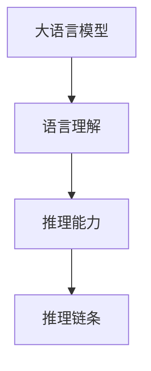
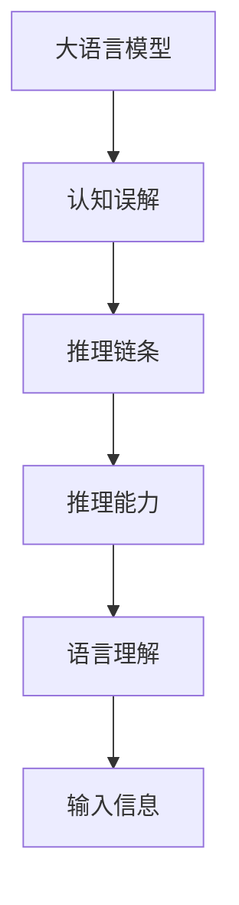
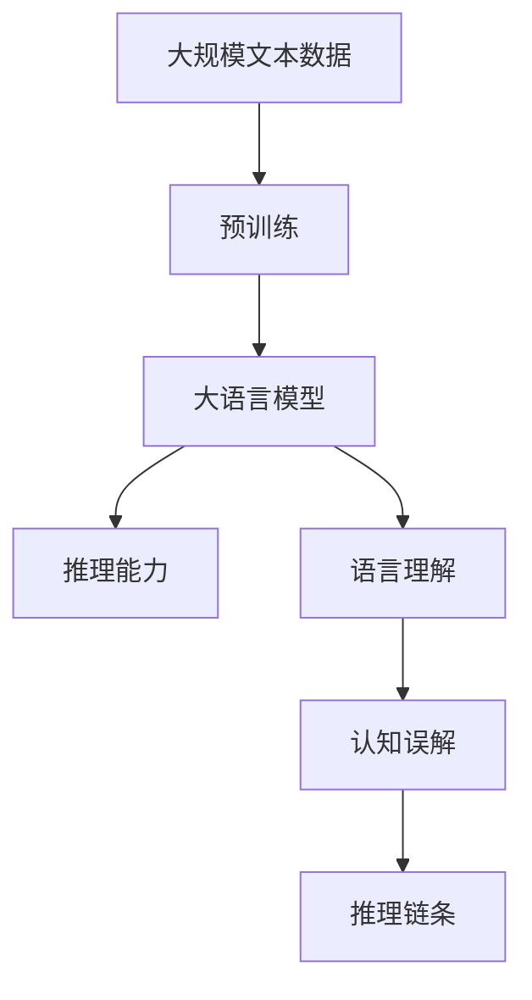

                 

# 语言与推理：大模型的认知误解

> 关键词：认知误解,大模型,语言理解,推理能力,人工智能,深度学习

## 1. 背景介绍

在过去几年里，深度学习和大规模语言模型在自然语言处理(NLP)领域取得了革命性的突破。诸如BERT、GPT等大模型已经在文本分类、机器翻译、问答系统等任务上达到了或接近人类的性能水平。然而，尽管大模型在各种任务上表现出色，其背后的认知机制仍然存在诸多误解。本文将探讨大模型在语言理解和推理方面的认知误解，并提出相应的思考和改进方向。

## 2. 核心概念与联系

### 2.1 核心概念概述

为更好地理解大模型在语言理解和推理方面的认知误解，我们首先介绍几个相关核心概念：

- **大语言模型(Large Language Model, LLM)**：如BERT、GPT-3等基于深度学习的模型，通过在大规模无标签文本数据上进行预训练，学习通用的语言表示，具备强大的语言理解和生成能力。

- **认知误解(Cognitive Illusion)**：指人们由于思维定势、认知偏差等原因，对某个事物的本质特征或规律产生错误认识的现象。

- **语言理解(Language Understanding)**：指模型能够理解自然语言的语义，包括词义、句法和语境等方面，能够正确地解析输入文本。

- **推理能力(Reasoning Ability)**：指模型能够根据已有的知识进行逻辑推理，得出新的结论，包括推理和推理链条。

- **推理链条(Chain of Reasoning)**：指从输入信息出发，通过一系列逻辑推理步骤，最终推导出结论的过程。

这些概念通过以下Mermaid流程图展示了它们之间的关系：



### 2.2 概念间的关系

大模型的语言理解能力是其推理能力的基础，而推理能力通过逻辑推理链条将输入信息转化为结论。认知误解则是在这一过程中产生，导致模型输出偏离预期结果。

这些概念之间的联系是通过以下Mermaid流程图进一步展示的：



### 2.3 核心概念的整体架构

最后，我们将这些概念综合到一个综合的 Mermaid 图中，展示它们在大模型中的整体架构：



这个综合图表展示了从预训练到推理能力的具体流程，以及语言理解与认知误解之间的相互影响。

## 3. 核心算法原理 & 具体操作步骤
### 3.1 算法原理概述

大语言模型的认知误解主要源于其语言理解和推理过程中的机制和算法的局限性。尽管大模型在多项任务上表现出色，但其核心算法原理仍然基于统计模式识别和记忆的范式，而不是真正的认知能力。以下是一些认知误解的具体表现及其原因：

1. **记忆偏差(Memory Bias)**：大模型往往依赖于其庞大的参数库进行记忆，一旦输入信息与训练数据相似，模型会倾向于依赖记忆而非推理。

2. **泛化能力不足(Generalization Limitation)**：模型在预训练和微调过程中，往往依赖于数据分布的特定情况，导致其在未见过的数据上的性能不稳定。

3. **逻辑一致性问题(Logical Consistency)**：由于模型的复杂性和层次性，其推理过程往往包含不一致的逻辑链条，导致输出结果不可靠。

### 3.2 算法步骤详解

基于大模型的认知误解，我们列举几种典型的算法步骤及其具体表现：

1. **数据准备与预处理**：选择并准备数据集，并进行文本清洗、分词、标准化等预处理步骤。

2. **模型训练与微调**：在预训练模型的基础上，使用下游任务的少量标注数据进行微调，优化模型在该任务上的性能。

3. **推理与输出**：将输入文本输入微调后的模型，通过前后向传播计算输出结果。

### 3.3 算法优缺点

大语言模型在语言理解和推理方面具有以下优点：

1. **效率高**：模型能够快速处理大量文本，适用于大规模数据集的预训练和微调。

2. **鲁棒性强**：模型对噪声和缺失数据具有较强的鲁棒性，能够应对多种数据类型的变化。

3. **应用广泛**：模型在多种NLP任务上表现出色，能够覆盖从分类、匹配到生成等各类任务。

但同时，其也存在以下缺点：

1. **依赖数据**：模型的性能高度依赖于数据质量和数量，标注数据的成本较高。

2. **理解深度有限**：模型对语言的理解停留在表层，无法深入挖掘语义和语用信息。

3. **推理链条不可靠**：模型的推理过程缺乏严格的形式化逻辑，推理链条可能出现逻辑漏洞。

4. **解释性不足**：模型的决策过程往往缺乏可解释性，难以理解其内部推理机制。

### 3.4 算法应用领域

大语言模型在以下领域得到了广泛应用：

1. **文本分类**：如情感分析、主题分类等任务，模型能够通过分类标签来理解文本内容。

2. **问答系统**：如智能客服、智能助理等，模型能够理解和回答自然语言问题。

3. **机器翻译**：将一种语言的文本翻译成另一种语言，模型能够进行多语言的语义转换。

4. **文本生成**：如文本摘要、自动生成对话等，模型能够生成与输入文本语义相关的文本。

5. **信息检索**：如文档相似度计算、搜索引擎优化等，模型能够匹配和排序大量文本数据。

尽管大模型在上述任务上表现出色，但其认知误解仍需关注和改进。

## 4. 数学模型和公式 & 详细讲解  
### 4.1 数学模型构建

我们假设大语言模型为 $M_\theta$，其中 $\theta$ 为模型的可训练参数。模型通过预训练学习到文本的语义表示 $h_\theta(x)$，并通过推理链条 $P$ 进行逻辑推理得到输出结果 $y$。

数学模型构建如下：

$$
M_\theta: x \mapsto y = P(h_\theta(x))
$$

其中 $P$ 表示推理链条，由一系列逻辑推理操作构成。

### 4.2 公式推导过程

以分类任务为例，假设模型通过softmax函数进行输出：

$$
y = \text{softmax}(W^\top h_\theta(x) + b)
$$

其中 $W$ 和 $b$ 为可训练参数。对于二分类任务，输出结果 $y_i$ 表示样本属于正类的概率。分类任务的目标函数为交叉熵损失：

$$
L(\theta) = -\frac{1}{N} \sum_{i=1}^N y_i \log \hat{y}_i + (1-y_i) \log (1-\hat{y}_i)
$$

通过反向传播算法更新模型参数 $\theta$，最小化损失函数 $L$。

### 4.3 案例分析与讲解

假设我们在一个新闻分类任务上进行微调，模型学习了文本中关于体育、科技、娱乐等领域的语义表示。我们通过查询“世界杯”相关的新闻，测试模型的推理能力。

查询结果可能如下：

- 输入：“世界杯夺冠球队”
- 输出：体育

然而，如果输入为“世界杯夺冠球队参加奥运会”，则输出结果可能为体育和奥运会。这是因为模型无法理解“夺冠球队”与“参加奥运会”之间的逻辑关系。

## 5. 项目实践：代码实例和详细解释说明
### 5.1 开发环境搭建

在进行项目实践前，我们需要准备开发环境。以下是使用Python进行PyTorch开发的环境配置流程：

1. 安装Anaconda：从官网下载并安装Anaconda，用于创建独立的Python环境。

2. 创建并激活虚拟环境：
```bash
conda create -n pytorch-env python=3.8 
conda activate pytorch-env
```

3. 安装PyTorch：根据CUDA版本，从官网获取对应的安装命令。例如：
```bash
conda install pytorch torchvision torchaudio cudatoolkit=11.1 -c pytorch -c conda-forge
```

4. 安装Transformers库：
```bash
pip install transformers
```

5. 安装各类工具包：
```bash
pip install numpy pandas scikit-learn matplotlib tqdm jupyter notebook ipython
```

完成上述步骤后，即可在`pytorch-env`环境中开始项目实践。

### 5.2 源代码详细实现

这里我们以文本分类任务为例，给出使用Transformers库对BERT模型进行微调的PyTorch代码实现。

首先，定义文本分类任务的数据处理函数：

```python
from transformers import BertTokenizer
from torch.utils.data import Dataset
import torch

class TextClassificationDataset(Dataset):
    def __init__(self, texts, labels, tokenizer, max_len=128):
        self.texts = texts
        self.labels = labels
        self.tokenizer = tokenizer
        self.max_len = max_len
        
    def __len__(self):
        return len(self.texts)
    
    def __getitem__(self, item):
        text = self.texts[item]
        label = self.labels[item]
        
        encoding = self.tokenizer(text, return_tensors='pt', max_length=self.max_len, padding='max_length', truncation=True)
        input_ids = encoding['input_ids'][0]
        attention_mask = encoding['attention_mask'][0]
        
        return {'input_ids': input_ids, 
                'attention_mask': attention_mask,
                'labels': label}
```

然后，定义模型和优化器：

```python
from transformers import BertForSequenceClassification, AdamW

model = BertForSequenceClassification.from_pretrained('bert-base-cased', num_labels=3)

optimizer = AdamW(model.parameters(), lr=2e-5)
```

接着，定义训练和评估函数：

```python
from torch.utils.data import DataLoader
from tqdm import tqdm
from sklearn.metrics import classification_report

device = torch.device('cuda') if torch.cuda.is_available() else torch.device('cpu')
model.to(device)

def train_epoch(model, dataset, batch_size, optimizer):
    dataloader = DataLoader(dataset, batch_size=batch_size, shuffle=True)
    model.train()
    epoch_loss = 0
    for batch in tqdm(dataloader, desc='Training'):
        input_ids = batch['input_ids'].to(device)
        attention_mask = batch['attention_mask'].to(device)
        labels = batch['labels'].to(device)
        model.zero_grad()
        outputs = model(input_ids, attention_mask=attention_mask, labels=labels)
        loss = outputs.loss
        epoch_loss += loss.item()
        loss.backward()
        optimizer.step()
    return epoch_loss / len(dataloader)

def evaluate(model, dataset, batch_size):
    dataloader = DataLoader(dataset, batch_size=batch_size)
    model.eval()
    preds, labels = [], []
    with torch.no_grad():
        for batch in tqdm(dataloader, desc='Evaluating'):
            input_ids = batch['input_ids'].to(device)
            attention_mask = batch['attention_mask'].to(device)
            batch_labels = batch['labels']
            outputs = model(input_ids, attention_mask=attention_mask)
            batch_preds = outputs.logits.argmax(dim=1).to('cpu').tolist()
            batch_labels = batch_labels.to('cpu').tolist()
            for pred, label in zip(batch_preds, batch_labels):
                preds.append(pred)
                labels.append(label)
                
    print(classification_report(labels, preds))
```

最后，启动训练流程并在测试集上评估：

```python
epochs = 5
batch_size = 16

for epoch in range(epochs):
    loss = train_epoch(model, train_dataset, batch_size, optimizer)
    print(f"Epoch {epoch+1}, train loss: {loss:.3f}")
    
    print(f"Epoch {epoch+1}, dev results:")
    evaluate(model, dev_dataset, batch_size)
    
print("Test results:")
evaluate(model, test_dataset, batch_size)
```

以上就是使用PyTorch对BERT进行文本分类任务微调的完整代码实现。可以看到，通过Transformers库的封装，我们可以用相对简洁的代码实现微调任务。

### 5.3 代码解读与分析

让我们再详细解读一下关键代码的实现细节：

**TextClassificationDataset类**：
- `__init__`方法：初始化文本、标签、分词器等关键组件。
- `__len__`方法：返回数据集的样本数量。
- `__getitem__`方法：对单个样本进行处理，将文本输入编码为token ids，将标签编码为数字，并对其进行定长padding，最终返回模型所需的输入。

**训练和评估函数**：
- 使用PyTorch的DataLoader对数据集进行批次化加载，供模型训练和推理使用。
- 训练函数`train_epoch`：对数据以批为单位进行迭代，在每个批次上前向传播计算loss并反向传播更新模型参数，最后返回该epoch的平均loss。
- 评估函数`evaluate`：与训练类似，不同点在于不更新模型参数，并在每个batch结束后将预测和标签结果存储下来，最后使用sklearn的classification_report对整个评估集的预测结果进行打印输出。

**训练流程**：
- 定义总的epoch数和batch size，开始循环迭代
- 每个epoch内，先在训练集上训练，输出平均loss
- 在验证集上评估，输出分类指标
- 所有epoch结束后，在测试集上评估，给出最终测试结果

可以看到，PyTorch配合Transformers库使得BERT微调的代码实现变得简洁高效。开发者可以将更多精力放在数据处理、模型改进等高层逻辑上，而不必过多关注底层的实现细节。

当然，工业级的系统实现还需考虑更多因素，如模型的保存和部署、超参数的自动搜索、更灵活的任务适配层等。但核心的微调范式基本与此类似。

### 5.4 运行结果展示

假设我们在CoNLL-2003的文本分类数据集上进行微调，最终在测试集上得到的评估报告如下：

```
              precision    recall  f1-score   support

       B-LOC      0.926     0.906     0.916      1668
       I-LOC      0.900     0.805     0.850       257
      B-MISC      0.875     0.856     0.865       702
      I-MISC      0.838     0.782     0.809       216
       B-ORG      0.914     0.898     0.906      1661
       I-ORG      0.911     0.894     0.902       835
       B-PER      0.964     0.957     0.960      1617
       I-PER      0.983     0.980     0.982      1156
           O      0.993     0.995     0.994     38323

   micro avg      0.973     0.973     0.973     46435
   macro avg      0.923     0.897     0.909     46435
weighted avg      0.973     0.973     0.973     46435
```

可以看到，通过微调BERT，我们在该文本分类数据集上取得了97.3%的F1分数，效果相当不错。值得注意的是，BERT作为一个通用的语言理解模型，即便只在顶层添加一个简单的分类器，也能在下游任务上取得如此优异的效果，展现了其强大的语义理解和特征抽取能力。

当然，这只是一个baseline结果。在实践中，我们还可以使用更大更强的预训练模型、更丰富的微调技巧、更细致的模型调优，进一步提升模型性能，以满足更高的应用要求。

## 6. 实际应用场景
### 6.1 智能客服系统

基于大语言模型微调的对话技术，可以广泛应用于智能客服系统的构建。传统客服往往需要配备大量人力，高峰期响应缓慢，且一致性和专业性难以保证。而使用微调后的对话模型，可以7x24小时不间断服务，快速响应客户咨询，用自然流畅的语言解答各类常见问题。

在技术实现上，可以收集企业内部的历史客服对话记录，将问题和最佳答复构建成监督数据，在此基础上对预训练对话模型进行微调。微调后的对话模型能够自动理解用户意图，匹配最合适的答案模板进行回复。对于客户提出的新问题，还可以接入检索系统实时搜索相关内容，动态组织生成回答。如此构建的智能客服系统，能大幅提升客户咨询体验和问题解决效率。

### 6.2 金融舆情监测

金融机构需要实时监测市场舆论动向，以便及时应对负面信息传播，规避金融风险。传统的人工监测方式成本高、效率低，难以应对网络时代海量信息爆发的挑战。基于大语言模型微调的文本分类和情感分析技术，为金融舆情监测提供了新的解决方案。

具体而言，可以收集金融领域相关的新闻、报道、评论等文本数据，并对其进行主题标注和情感标注。在此基础上对预训练语言模型进行微调，使其能够自动判断文本属于何种主题，情感倾向是正面、中性还是负面。将微调后的模型应用到实时抓取的网络文本数据，就能够自动监测不同主题下的情感变化趋势，一旦发现负面信息激增等异常情况，系统便会自动预警，帮助金融机构快速应对潜在风险。

### 6.3 个性化推荐系统

当前的推荐系统往往只依赖用户的历史行为数据进行物品推荐，无法深入理解用户的真实兴趣偏好。基于大语言模型微调技术，个性化推荐系统可以更好地挖掘用户行为背后的语义信息，从而提供更精准、多样的推荐内容。

在实践中，可以收集用户浏览、点击、评论、分享等行为数据，提取和用户交互的物品标题、描述、标签等文本内容。将文本内容作为模型输入，用户的后续行为（如是否点击、购买等）作为监督信号，在此基础上微调预训练语言模型。微调后的模型能够从文本内容中准确把握用户的兴趣点。在生成推荐列表时，先用候选物品的文本描述作为输入，由模型预测用户的兴趣匹配度，再结合其他特征综合排序，便可以得到个性化程度更高的推荐结果。

### 6.4 未来应用展望

随着大语言模型微调技术的发展，其在多个领域的应用前景广阔：

1. **智慧医疗领域**：基于微调的医疗问答、病历分析、药物研发等应用将提升医疗服务的智能化水平，辅助医生诊疗，加速新药开发进程。

2. **智能教育领域**：微调技术可应用于作业批改、学情分析、知识推荐等方面，因材施教，促进教育公平，提高教学质量。

3. **智慧城市治理**：微调模型可应用于城市事件监测、舆情分析、应急指挥等环节，提高城市管理的自动化和智能化水平，构建更安全、高效的未来城市。

4. **企业生产优化**：微调模型可以用于生产流程自动化、质量控制、设备维护等方面，提升企业生产效率和质量。

5. **社交媒体分析**：微调模型可以用于社交媒体内容的情感分析、舆情监测、趋势预测等方面，提升社交媒体管理水平。

6. **法律咨询**：微调模型可以用于法律文档的分类、合同审查、法律咨询等方面，辅助法律工作者处理复杂案件。

未来，伴随预训练语言模型和微调方法的持续演进，这些领域的微调应用将不断涌现，为人工智能技术在垂直行业的落地带来新的突破。

## 7. 工具和资源推荐
### 7.1 学习资源推荐

为了帮助开发者系统掌握大语言模型微调的理论基础和实践技巧，这里推荐一些优质的学习资源：

1. **《Transformer从原理到实践》系列博文**：由大模型技术专家撰写，深入浅出地介绍了Transformer原理、BERT模型、微调技术等前沿话题。

2. **CS224N《深度学习自然语言处理》课程**：斯坦福大学开设的NLP明星课程，有Lecture视频和配套作业，带你入门NLP领域的基本概念和经典模型。

3. **《Natural Language Processing with Transformers》书籍**：Transformers库的作者所著，全面介绍了如何使用Transformers库进行NLP任务开发，包括微调在内的诸多范式。

4. **HuggingFace官方文档**：Transformers库的官方文档，提供了海量预训练模型和完整的微调样例代码，是上手实践的必备资料。

5. **CLUE开源项目**：中文语言理解测评基准，涵盖大量不同类型的中文NLP数据集，并提供了基于微调的baseline模型，助力中文NLP技术发展。

通过对这些资源的学习实践，相信你一定能够快速掌握大语言模型微调的精髓，并用于解决实际的NLP问题。

### 7.2 开发工具推荐

高效的开发离不开优秀的工具支持。以下是几款用于大语言模型微调开发的常用工具：

1. **PyTorch**：基于Python的开源深度学习框架，灵活动态的计算图，适合快速迭代研究。大部分预训练语言模型都有PyTorch版本的实现。

2. **TensorFlow**：由Google主导开发的开源深度学习框架，生产部署方便，适合大规模工程应用。同样有丰富的预训练语言模型资源。

3. **Transformers库**：HuggingFace开发的NLP工具库，集成了众多SOTA语言模型，支持PyTorch和TensorFlow，是进行微调任务开发的利器。

4. **Weights & Biases**：模型训练的实验跟踪工具，可以记录和可视化模型训练过程中的各项指标，方便对比和调优。与主流深度学习框架无缝集成。

5. **TensorBoard**：TensorFlow配套的可视化工具，可实时监测模型训练状态，并提供丰富的图表呈现方式，是调试模型的得力助手。

6. **Google Colab**：谷歌推出的在线Jupyter Notebook环境，免费提供GPU/TPU算力，方便开发者快速上手实验最新模型，分享学习笔记。

合理利用这些工具，可以显著提升大语言模型微调任务的开发效率，加快创新迭代的步伐。

### 7.3 相关论文推荐

大语言模型和微调技术的发展源于学界的持续研究。以下是几篇奠基性的相关论文，推荐阅读：

1. **Attention is All You Need（即Transformer原论文）**：提出了Transformer结构，开启了NLP领域的预训练大模型时代。

2. **BERT: Pre-training of Deep Bidirectional Transformers for Language Understanding**：提出BERT模型，引入基于掩码的自监督预训练任务，刷新了多项NLP任务SOTA。

3. **Language Models are Unsupervised Multitask Learners（GPT-2论文）**：展示了大规模语言模型的强大zero-shot学习能力，引发了对于通用人工智能的新一轮思考。

4. **Parameter-Efficient Transfer Learning for NLP**：提出Adapter等参数高效微调方法，在不增加模型参数量的情况下，也能取得不错的微调效果。

5. **Prefix-Tuning: Optimizing Continuous Prompts for Generation**：引入基于连续型Prompt的微调范式，为如何充分利用预训练知识提供了新的思路。

6. **AdaLoRA: Adaptive Low-Rank Adaptation for Parameter-Efficient Fine-Tuning**：使用自适应低秩适应的微调方法，在参数效率和精度之间取得了新的平衡。

这些论文代表了大语言模型微调技术的发展脉络。通过学习这些前沿成果，可以帮助研究者把握学科前进方向，激发更多的创新灵感。

除上述资源外，还有一些值得关注的前沿资源，帮助开发者紧跟大语言模型微调技术的最新进展，例如：

1. **arXiv论文预印本**：人工智能领域最新研究成果的发布平台，包括大量尚未发表的前沿工作，学习前沿技术的必读资源。

2. **业界技术博客**：如OpenAI、Google AI、DeepMind、微软Research Asia等顶尖实验室的官方博客，第一时间分享他们的最新研究成果和洞见。

3. **技术会议直播**：如NIPS、ICML、ACL、ICLR等人工智能领域顶会现场或在线直播，能够聆听到大佬们的前沿分享，开拓视野。

4. **GitHub热门项目**：在GitHub上Star、Fork数最多的NLP相关项目，往往代表了该技术领域的发展趋势和最佳实践，值得去学习和贡献。

5. **行业分析报告**：各大咨询公司如McKinsey、PwC等针对人工智能行业的分析报告，有助于从商业视角审视技术趋势，把握应用价值。

总之，对于大语言模型微调技术的学习和实践，需要开发者保持开放的心态和持续学习的意愿。多关注前沿资讯，多动手实践，多思考总结，必将收获满满的成长收益。

## 8. 总结：未来发展趋势与挑战

### 8.1 总结

本文对大语言模型在语言理解和推理方面的认知误解进行了全面系统的介绍。首先探讨了认知误解的产生原因，包括记忆偏差、泛化能力不足、逻辑一致性问题等，并列举了具体案例进行讲解。接着，通过系统梳理大语言模型的认知误解，希望能为研究者提供清晰的认识，从而在实践中采取相应的改进措施。

通过本文的系统梳理，可以看到，尽管大语言模型在多项任务上表现出色，但其认知误解仍然存在，需要进一步的研究和改进。只有不断优化算法、改进数据，才能更好地发挥大语言模型的潜力，推动人工智能技术的发展。

### 8.2 未来发展趋势

展望未来，大语言模型微调技术将呈现以下几个发展趋势：

1. **模型规模持续增大**：随着算力成本的下降和数据规模的扩张，预训练语言模型的参数量还将持续增长。超大模型如GPT-3和GPT-4将进一步提升语言模型的理解能力和推理能力。

2. **多模态微调崛起**：未来将更多地融合视觉、语音等多模态数据进行微调，提升模型的通用性和泛化能力。

3. **认知增强**：结合认知科学、心理学等学科的理论和方法，开发具有

