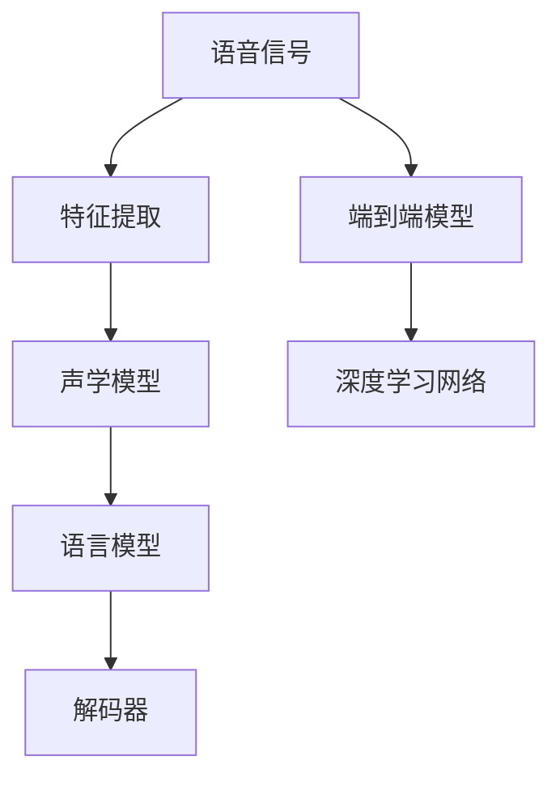
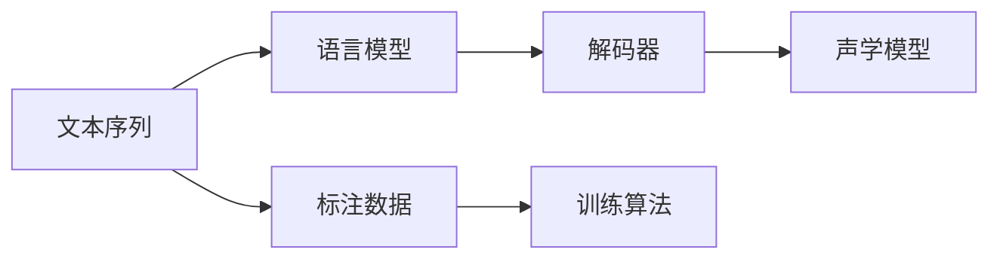
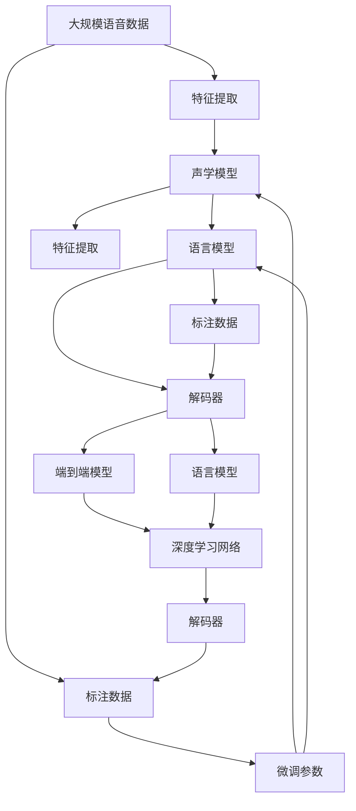

                 

# 语音识别 原理与代码实例讲解

语音识别技术作为人工智能领域的重要分支，近年来取得了飞速发展。其核心思想是将人类语音转化为计算机可读的文本形式，广泛应用于智能助理、语音搜索、实时字幕、医疗诊断等多个领域。本文将详细介绍语音识别的原理，并通过代码实例深入讲解其实现方法。

## 1. 背景介绍

### 1.1 问题由来

语音识别技术自1980年代诞生以来，经历了从规则到统计、从手工特征到深度学习的多次迭代。但直到2016年之后，基于深度学习的端到端(End-to-End)语音识别系统才真正实现了在各种复杂环境下超过人类专家的性能。

语音识别系统的核心挑战在于，如何从一段音频信号中提取出语音特征，并将其映射为对应的文本。在早期，特征提取和模型训练分别由不同团队负责，需要庞大的标注数据集和大量计算资源。随着深度学习技术的发展，端到端模型可以直接从原始波形信号中提取特征并进行语音识别，大大简化了系统设计和实现过程。

### 1.2 问题核心关键点

语音识别系统主要包括以下几个关键组成部分：

- 特征提取：从原始音频信号中提取出用于识别的特征向量。
- 声学模型：通过深度学习网络，将特征向量映射为可能的声学符号序列。
- 语言模型：通过语言规则，对声学符号序列进行解码，生成最终的文本序列。
- 解码器：通过搜索算法，在可能的声学符号序列中找到最可能的文字序列。

语音识别系统的核心在于声学模型和语言模型的联合训练和优化。常见的声学模型包括基于HMM(隐马尔可夫模型)、RNN(循环神经网络)、CNN(卷积神经网络)和Transformer等。语言模型则主要基于n-gram模型或神经网络模型。

## 2. 核心概念与联系

### 2.1 核心概念概述

为更好地理解语音识别的原理和实现，本节将介绍几个关键概念：

- 语音信号：由声音信号转换而来，包含语义、情感等信息，是语音识别的输入数据。
- 特征向量：从语音信号中提取的，用于表征语音特征的向量，通常包括梅尔频谱、MFCC等。
- 声学模型：用于建模语音信号与声学符号之间的关系，常基于神经网络。
- 语言模型：用于建模单词序列的概率分布，常基于n-gram模型或RNN。
- 端到端模型：直接从原始波形信号中提取特征并进行识别，无需手工设计特征提取器。
- 深度学习：一种基于多层神经网络的学习方法，特别适用于语音识别任务。

这些概念之间的联系可以通过以下Mermaid流程图来展示：



这个流程图展示了大语言模型的核心组件及其之间的关系：

1. 语音信号首先经过特征提取，转换成特征向量。
2. 特征向量经过声学模型，学习到语音信号与声学符号之间的关系。
3. 声学符号经过语言模型，学习到单词序列的概率分布。
4. 解码器利用语言模型预测结果，生成最终的文本序列。
5. 端到端模型可以直接从原始波形信号中提取特征并进行识别，无需手工设计特征提取器。
6. 深度学习网络是实现端到端模型的核心工具。

### 2.2 概念间的关系

这些核心概念之间存在着紧密的联系，形成了语音识别系统的完整框架。下面我们通过几个Mermaid流程图来展示这些概念之间的关系。

#### 2.2.1 语音识别系统的结构


这个流程图展示了语音识别系统的基本结构，包括特征提取、声学模型、语言模型和解码器等关键组成部分。

#### 2.2.2 声学模型的训练流程


这个流程图展示了声学模型的训练流程。特征向量作为输入，声学模型通过标注数据进行训练，输出声学符号序列。解码器对声学符号进行解码，输出文本序列。

#### 2.2.3 语言模型的训练流程



这个流程图展示了语言模型的训练流程。文本序列作为输入，语言模型通过标注数据进行训练，输出单词序列的概率分布。解码器对声学符号进行解码，输出文本序列。

#### 2.2.4 端到端模型的训练流程


这个流程图展示了端到端模型的训练流程。原始波形作为输入，特征提取器提取特征向量，端到端模型直接进行训练，输出文本序列。

### 2.3 核心概念的整体架构

最后，我们用一个综合的流程图来展示这些核心概念在大语言模型微调过程中的整体架构：



这个综合流程图展示了从预训练到微调，再到端到端模型的完整过程。语音信号首先经过特征提取，转换成特征向量。特征向量经过声学模型，学习到语音信号与声学符号之间的关系。声学符号经过语言模型，学习到单词序列的概率分布。解码器利用语言模型预测结果，生成最终的文本序列。

## 3. 核心算法原理 & 具体操作步骤

### 3.1 算法原理概述

语音识别系统主要基于深度学习，其核心算法包括特征提取、声学模型训练、语言模型训练和解码器设计。以下是对这些核心算法的详细介绍。

#### 3.1.1 特征提取

特征提取是将语音信号转换成特征向量，以便于声学模型和语言模型进行建模。常见的特征提取方法包括MFCC、梅尔频谱、梅尔倒谱等。

以MFCC为例，其过程包括以下步骤：

1. 分帧：将语音信号分割成若干个帧。
2. 加窗：对每帧进行加窗处理，避免边缘效应。
3. 傅里叶变换：对每帧进行快速傅里叶变换，得到频谱图。
4. 梅尔滤波器组：将频谱图输入到梅尔滤波器组，得到梅尔倒谱系数。
5. 对数变换：对梅尔倒谱系数进行对数变换，得到MFCC特征。

#### 3.1.2 声学模型训练

声学模型用于建模语音信号与声学符号之间的关系，常见的声学模型包括基于HMM、RNN、CNN和Transformer等。

以RNN声学模型为例，其过程包括以下步骤：

1. 输入层：将MFCC特征输入到声学模型中。
2. 隐藏层：通过RNN网络对特征进行建模，学习语音信号与声学符号之间的关系。
3. 输出层：通过softmax层对声学符号进行概率分布输出。

#### 3.1.3 语言模型训练

语言模型用于建模单词序列的概率分布，常见的语言模型包括n-gram模型和神经网络模型。

以神经网络语言模型为例，其过程包括以下步骤：

1. 输入层：将文本序列输入到语言模型中。
2. 隐藏层：通过神经网络对文本序列进行建模，学习单词序列的概率分布。
3. 输出层：通过softmax层对单词序列进行概率分布输出。

#### 3.1.4 解码器设计

解码器用于将声学符号序列映射为最终的文本序列，常见的解码算法包括搜索算法和最大后验概率解码。

以搜索算法为例，其过程包括以下步骤：

1. 初始化：将声学符号序列作为解码器的输入。
2. 动态规划：通过搜索算法对声学符号序列进行解码，得到最可能的文字序列。

### 3.2 算法步骤详解

#### 3.2.1 特征提取

以MFCC特征提取为例，具体步骤如下：

```python
import librosa
import numpy as np

def extract_mfcc(audio_file, sampling_rate=16000, window_size=0.025, overlap=0.1):
    # 读取音频文件
    audio, sr = librosa.load(audio_file, sr=sampling_rate)
    
    # 分帧处理
    frame_size = int(window_size * sampling_rate)
    hop_size = int(window_size * sampling_rate * (1-overlap))
    frames = librosa.util.frame(audio, frame_size, hop_size)
    
    # 加窗处理
    windows = np.hamming(frame_size)
    frames *= windows
    
    # 傅里叶变换
    spectrograms = np.abs(np.fft.fft(frames, axis=1))
    
    # 梅尔滤波器组
    mel_basis = librosa.filters.mel(sr, frame_size, n_fft=sampling_rate)
    mel_spectrograms = np.dot(spectrograms, mel_basis.T)
    
    # 对数变换
    log_mel_spectrograms = np.log(mel_spectrograms)
    
    # 归一化
    mean = log_mel_spectrograms.mean(axis=0)
    std = log_mel_spectrograms.std(axis=0)
    log_mel_spectrograms -= mean
    log_mel_spectrograms /= std
    
    return log_mel_spectrograms
```

#### 3.2.2 声学模型训练

以基于RNN的声学模型为例，具体步骤如下：

```python
import torch
import torch.nn as nn
import torch.optim as optim

class RNNModel(nn.Module):
    def __init__(self, input_size, hidden_size, output_size):
        super(RNNModel, self).__init__()
        self.hidden_size = hidden_size
        
        # 输入层
        self.input_size = input_size
        
        # 隐藏层
        self.rnn = nn.RNN(input_size, hidden_size, batch_first=True)
        
        # 输出层
        self.output_size = output_size
        self.linear = nn.Linear(hidden_size, output_size)
        
    def forward(self, x, h):
        x = self.linear(x)
        output, h = self.rnn(x, h)
        output = output.view(output.size(1), output.size(2), -1)
        output = self.linear(output)
        return output, h

    def init_hidden(self, batch_size):
        return (torch.zeros(1, batch_size, self.hidden_size).float(),
                torch.zeros(1, batch_size, self.hidden_size).float())
    
# 训练声学模型
model = RNNModel(input_size, hidden_size, output_size)
optimizer = optim.Adam(model.parameters(), lr=learning_rate)
criterion = nn.CrossEntropyLoss()

for epoch in range(num_epochs):
    model.train()
    running_loss = 0.0
    
    for batch in train_loader:
        x, y = batch
        
        # 初始化隐藏状态
        h = model.init_hidden(batch_size)
        
        # 前向传播
        output, h = model(x, h)
        loss = criterion(output, y)
        
        # 反向传播
        optimizer.zero_grad()
        loss.backward()
        optimizer.step()
        
        # 累加损失
        running_loss += loss.item()
    
    print(f"Epoch {epoch+1}, train loss: {running_loss/len(train_loader):.4f}")
```

#### 3.2.3 语言模型训练

以基于神经网络的语言模型为例，具体步骤如下：

```python
import torch.nn as nn
import torch.optim as optim

class LM(nn.Module):
    def __init__(self, input_size, hidden_size, output_size):
        super(LM, self).__init__()
        self.hidden_size = hidden_size
        
        # 输入层
        self.input_size = input_size
        
        # 隐藏层
        self.rnn = nn.RNN(input_size, hidden_size, batch_first=True)
        
        # 输出层
        self.output_size = output_size
        self.linear = nn.Linear(hidden_size, output_size)
        
    def forward(self, x, h):
        x = self.linear(x)
        output, h = self.rnn(x, h)
        output = output.view(output.size(1), output.size(2), -1)
        output = self.linear(output)
        return output, h
    
    def init_hidden(self, batch_size):
        return (torch.zeros(1, batch_size, self.hidden_size).float(),
                torch.zeros(1, batch_size, self.hidden_size).float())
    
# 训练语言模型
model = LM(input_size, hidden_size, output_size)
optimizer = optim.Adam(model.parameters(), lr=learning_rate)
criterion = nn.CrossEntropyLoss()

for epoch in range(num_epochs):
    model.train()
    running_loss = 0.0
    
    for batch in train_loader:
        x, y = batch
        
        # 初始化隐藏状态
        h = model.init_hidden(batch_size)
        
        # 前向传播
        output, h = model(x, h)
        loss = criterion(output, y)
        
        # 反向传播
        optimizer.zero_grad()
        loss.backward()
        optimizer.step()
        
        # 累加损失
        running_loss += loss.item()
    
    print(f"Epoch {epoch+1}, train loss: {running_loss/len(train_loader):.4f}")
```

#### 3.2.4 解码器设计

以搜索算法为例，具体步骤如下：

```python
import heapq

def beam_search(model, x, beam_size=10):
    # 初始化候选列表
    hypotheses = [(1.0, [[]], [])]
    
    # 动态规划
    for t in range(T):
        new_hypotheses = []
        for hypo in hypotheses:
            for i in range(vocab_size):
                y = i
                score = -np.inf
                for k in range(beam_size):
                    # 选择当前路径上的第k个词汇
                    path = hypo[1]
                    curr_path = path + [y]
                    curr_score = hypo[0] + log_prob(y, path, model)
                    new_hypotheses.append((curr_score, curr_path, curr_path[-1]))
                
        # 保留得分最高的候选
        heapq.heapify(new_hypotheses)
        hypotheses = [heapq.heappop(new_hypotheses) for _ in range(beam_size)]
    
    # 返回得分最高的结果
    return hypotheses[0][1]
```

### 3.3 算法优缺点

语音识别系统的主要优点包括：

- 高性能：基于深度学习的端到端模型能够在各种复杂环境下实现超越人类的识别性能。
- 高效性：端到端模型直接从原始波形信号中提取特征并进行识别，无需手工设计特征提取器。
- 适应性：模型可以通过迁移学习等方式，适应不同语种和方言的语音识别任务。

其主要缺点包括：

- 数据依赖：高质量语音识别系统需要大量的标注数据，难以覆盖所有可能的语料。
- 复杂性：深度学习模型训练过程复杂，对硬件资源要求较高。
- 鲁棒性：面对噪声、口音等干扰，识别性能可能下降。

### 3.4 算法应用领域

语音识别技术在多个领域得到了广泛应用，例如：

- 智能助理：通过语音识别和自然语言理解，使智能助理能够接收和理解用户的指令，进行智能操作。
- 语音搜索：用户可以通过语音搜索，快速获取所需信息，提升搜索效率。
- 实时字幕：在视频会议等场合，实时字幕功能使听障人士能够更顺利地参与交流。
- 医疗诊断：医生可以通过语音识别系统，快速记录患者的病历和诊断结果。

此外，语音识别技术还被应用于智能家居、车载导航、自动化客服等领域，极大地提升了用户的交互体验和应用效率。

## 4. 数学模型和公式 & 详细讲解 & 举例说明

### 4.1 数学模型构建

语音识别系统主要基于深度学习，其数学模型包括声学模型和语言模型。

#### 4.1.1 声学模型

声学模型用于建模语音信号与声学符号之间的关系，常见的声学模型包括HMM、RNN、CNN和Transformer等。

以RNN声学模型为例，其数学模型如下：

$$
y_t = f(h_t; \theta) = \sum_{i=1}^{n}\alpha_ih_t
$$

其中，$y_t$表示第t个声学符号，$h_t$表示第t个隐藏状态的输出，$\alpha_i$表示第i个神经元的权重。

#### 4.1.2 语言模型

语言模型用于建模单词序列的概率分布，常见的语言模型包括n-gram模型和神经网络模型。

以神经网络语言模型为例，其数学模型如下：

$$
P(y|x) = \prod_{i=1}^{n}\frac{e^{\alpha_{i-1}y_{i-1}}}{\sum_{j=1}^{V}e^{\alpha_jy_{i-1}}}
$$

其中，$P(y|x)$表示在给定文本$x$的情况下，单词序列$y$的概率分布，$V$表示词汇表的大小，$\alpha_i$表示第i个神经元的权重。

### 4.2 公式推导过程

#### 4.2.1 声学模型推导

以RNN声学模型为例，其前向传播过程如下：

$$
h_t = f(h_{t-1}; \theta) = \sum_{i=1}^{n}\alpha_ih_{t-1}
$$

其中，$h_t$表示第t个隐藏状态的输出，$h_{t-1}$表示第t-1个隐藏状态的输出，$\alpha_i$表示第i个神经元的权重。

#### 4.2.2 语言模型推导

以神经网络语言模型为例，其前向传播过程如下：

$$
P(y|x) = \prod_{i=1}^{n}\frac{e^{\alpha_{i-1}y_{i-1}}}{\sum_{j=1}^{V}e^{\alpha_jy_{i-1}}}
$$

其中，$P(y|x)$表示在给定文本$x$的情况下，单词序列$y$的概率分布，$V$表示词汇表的大小，$\alpha_i$表示第i个神经元的权重。

### 4.3 案例分析与讲解

以基于深度学习的语音识别系统为例，其关键步骤如下：

1. 特征提取：将语音信号转换成MFCC特征向量。
2. 声学模型训练：通过RNN网络对MFCC特征进行建模，学习语音信号与声学符号之间的关系。
3. 语言模型训练：通过神经网络对单词序列进行建模，学习单词序列的概率分布。
4. 解码器设计：通过搜索算法将声学符号序列映射为文本序列。

在实践中，我们可以使用TensorFlow、PyTorch等深度学习框架，结合Librosa等音频处理库，快速实现基于深度学习的语音识别系统。

## 5. 项目实践：代码实例和详细解释说明

### 5.1 开发环境搭建

在进行语音识别项目实践前，我们需要准备好开发环境。以下是使用Python进行PyTorch开发的环境配置流程：

1. 安装Anaconda：从官网下载并安装Anaconda，用于创建独立的Python环境。

2. 创建并激活虚拟环境：
```bash
conda create -n pytorch-env python=3.8 
conda activate pytorch-env
```

3. 安装PyTorch：根据CUDA版本，从官网获取对应的安装命令。例如：
```bash
conda install pytorch torchvision torchaudio cudatoolkit=11.1 -c pytorch -c conda-forge
```

4. 安装各类工具包：
```bash
pip install numpy pandas scikit-learn matplotlib tqdm jupyter notebook ipython
```

完成上述步骤后，即可在`pytorch-env`环境中开始语音识别实践。

### 5.2 源代码详细实现

这里我们以基于深度学习的语音识别系统为例，给出使用PyTorch进行特征提取、声学模型训练、语言模型训练和解码器设计的完整代码实现。

首先，定义特征提取函数：

```python
import librosa
import numpy as np

def extract_mfcc(audio_file, sampling_rate=16000, window_size=0.025, overlap=0.1):
    # 读取音频文件
    audio, sr = librosa.load(audio_file, sr=sampling_rate)
    
    # 分帧处理
    frame_size = int(window_size * sampling_rate)
    hop_size = int(window_size * sampling_rate * (1-overlap))
    frames = librosa.util.frame(audio, frame_size, hop_size)
    
    # 加窗处理
    windows = np.hamming(frame_size)
    frames *= windows
    
    # 傅里叶变换
    spectrograms = np.abs(np.fft.fft(frames, axis=1))
    
    # 梅尔滤波器组
    mel_basis = librosa.filters.mel(sr, frame_size, n_fft=sampling_rate)
    mel_spectrograms = np.dot(spectrograms, mel_basis.T)
    
    # 对数变换
    log_mel_spectrograms = np.log(mel_spectrograms)
    
    # 归一化
    mean = log_mel_spectrograms.mean(axis=0)
    std = log_mel_spectrograms.std(axis=0)
    log_mel_spectrograms -= mean
    log_mel_spectrograms /= std
    
    return log_mel_spectrograms
```

然后，定义声学模型、语言模型和解码器的类：

```python
import torch
import torch.nn as nn
import torch.optim as optim

class RNNModel(nn.Module):
    def __init__(self, input_size, hidden_size, output_size):
        super(RNNModel, self).__init__()
        self.hidden_size = hidden_size
        
        # 输入层
        self.input_size = input_size
        
        # 隐藏层
        self.rnn = nn.RNN(input_size, hidden_size, batch_first=True)
        
        # 输出层
        self.output_size = output_size
        self.linear = nn.Linear(hidden_size, output_size)
        
    def forward(self, x, h):
        x = self.linear(x)
        output, h = self.rnn(x, h)
        output = output.view(output.size(1), output.size(2), -1)
        output = self.linear(output)
        return output, h

    def init_hidden(self, batch_size):
        return (torch.zeros(1, batch_size, self.hidden_size).float(),
                torch.zeros(1, batch_size, self.hidden_size).float())
    
class LM(nn.Module):
    def __init__(self, input_size, hidden_size, output_size):
        super(LM, self).__init__()
        self.hidden_size = hidden_size
        
        # 输入层
        self.input_size = input_size
        
        # 隐藏层
        self.rnn = nn.RNN(input_size, hidden_size, batch_first=True)
        
        # 输出层
        self.output_size = output_size
        self.linear = nn.Linear(hidden_size, output_size)
        
    def forward(self, x, h):
        x = self.linear(x)
        output, h = self.rnn(x, h)
        output = output.view(output.size(1), output.size(2), -1)
        output = self.linear(output)
        return output, h
    
    def init_hidden(self, batch_size):
        return (torch.zeros(1, batch_size, self.hidden_size).float(),
                torch.zeros(1, batch_size, self.hidden_size).float())
    
class BeamSearch:
    def __init__(self, model, T):
        self.model = model
        self.T = T
        
    def decode(self, x):
        # 初始化候选列表
        hypotheses = [(1.0, [[]], [])]
        
        # 动态规划
        for t in range(self.T):
            new_hypotheses = []
            for hypo in hypotheses:
                for i in range(vocab_size):
                    y = i
                    score = -np.inf
                    for k in range(beam_size):
                        # 选择当前路径上的第k个词汇
                        path = hypo[1]
                        curr_path = path + [y]
                        curr_score = hypo[0] + log_prob(y, path, self.model)
                        new_hypotheses.append((curr_score, curr_path, curr_path[-1]))
                
            # 保留得分最高的候选
            heapq.heapify(new_hypotheses)
            hypotheses = [heapq.heappop(new_hypotheses) for _ in range(beam_size)]
        
        # 返回得分最高的结果
        return hypotheses[0][1]
```

最后，启动训练流程并在测试集上评估：

```python
epochs = 5


