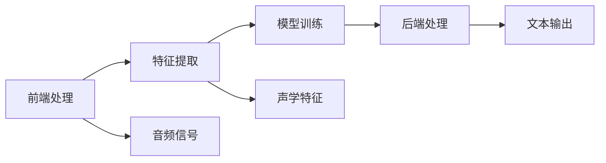

                 

## 1. 背景介绍

语音识别，作为一种将人类语音转换为文本的技术，是人工智能和机器学习领域的重要分支。它已经被广泛应用于智能助手、语音搜索、智能家居、车载导航等多个场景中，极大地提升了用户体验和便利性。然而，语音识别技术的原理和实现细节较为复杂，对于初学者来说，理解起来有一定难度。为了帮助读者深入理解语音识别的核心原理，并掌握其实现方法，本文将详细讲解语音识别系统的构建流程，并展示一个实际案例。

## 2. 核心概念与联系

### 2.1 核心概念概述

语音识别系统主要分为前端处理、特征提取、模型训练和后端处理四个步骤。各步骤的核心概念和相互关系如下：

- **前端处理**：包括降噪、分帧、预加重等，将语音信号转换为干净的数字信号。
- **特征提取**：将数字信号转换为声学特征，如梅尔频率倒谱系数（MFCC）、线性预测系数（LPC）等，用于模型训练。
- **模型训练**：使用声学特征训练神经网络模型，如循环神经网络（RNN）、卷积神经网络（CNN）、深度神经网络（DNN）等。
- **后端处理**：将模型输出解码为文本，如使用隐马尔可夫模型（HMM）进行解码。

通过这些步骤，语音识别系统将语音信号转换为可处理的数字信号，并最终得到文本形式的输出。

### 2.2 概念间的关系

语音识别系统的整体架构如下：



## 3. 核心算法原理 & 具体操作步骤

### 3.1 算法原理概述

语音识别的核心算法基于隐马尔可夫模型（HMM）和深度学习。HMM模型用于建立声学特征和文本输出之间的概率模型，而深度学习模型用于提取和训练声学特征。以下将详细介绍这两种算法。

#### 3.1.1 HMM模型

HMM模型是一种基于概率的统计模型，用于描述声学特征序列和文本输出序列之间的概率关系。其核心是状态转移概率和观测概率。状态表示文本输出，观测表示声学特征序列。模型的训练目标是最大化似然函数，即观测序列在给定状态序列下的概率。训练过程通常采用Baum-Welch算法或前向-后向算法。

#### 3.1.2 深度学习模型

深度学习模型用于提取和训练声学特征。常见的深度学习模型包括卷积神经网络（CNN）和循环神经网络（RNN）。CNN用于提取局部特征，RNN用于建模时序特征。通过多层神经网络，深度学习模型可以自动学习声学特征的高阶表示，从而提高识别精度。

### 3.2 算法步骤详解

#### 3.2.1 前端处理

前端处理包括降噪、分帧和预加重。以降噪为例，可以采用小波变换、Wiener滤波等方法去除背景噪声。

#### 3.2.2 特征提取

常用的声学特征包括MFCC、LPC等。以下以MFCC为例，展示其提取过程。

- 短时傅里叶变换（STFT）：将语音信号分为若干个窗口，对每个窗口进行傅里叶变换。
- 梅尔频率刻度（MF）：将频率轴映射到梅尔频率刻度，使频谱更符合人耳的听觉感知特性。
- 倒谱（Cepstral）：对MF频谱取对数并进行逆傅里叶变换，得到MFCC。

#### 3.2.3 模型训练

以深度学习模型为例，通常采用反向传播算法更新模型参数。训练过程包括前向传播、计算损失、反向传播和参数更新。以下以RNN模型为例，展示其训练过程。

- 前向传播：输入声学特征，通过多层RNN计算输出概率分布。
- 计算损失：使用交叉熵损失计算模型输出和真实标签之间的差异。
- 反向传播：通过链式法则计算梯度，更新模型参数。
- 参数更新：使用梯度下降等优化算法更新模型参数。

#### 3.2.4 后端处理

后端处理通常包括解码和语言模型。以HMM模型为例，解码过程包括维特比算法，即通过Viterbi算法找到最可能的状态序列，从而得到文本输出。

### 3.3 算法优缺点

#### 3.3.1 优点

- 高识别精度：深度学习模型能够自动学习声学特征的高阶表示，提高识别精度。
- 适应性强：深度学习模型能够适应不同的语音信号和噪声环境。
- 灵活性高：HMM模型能够灵活建模声学特征和文本输出之间的关系。

#### 3.3.2 缺点

- 计算复杂度高：深度学习模型参数量较大，训练和推理计算复杂度高。
- 需要大量数据：深度学习模型需要大量标注数据进行训练。
- 模型调试困难：深度学习模型复杂度较高，调试困难。

### 3.4 算法应用领域

语音识别技术已经被广泛应用于多个领域，如智能助手、语音搜索、智能家居、车载导航等。以下是一些具体应用：

- **智能助手**：如Siri、Alexa等，能够理解和响应用户的语音指令。
- **语音搜索**：如Google语音搜索、百度语音搜索等，能够根据用户的语音查询进行搜索。
- **智能家居**：如智能音箱、智能灯光等，能够根据用户的语音控制家电设备。
- **车载导航**：如特斯拉语音助手、小鹏汽车语音助手等，能够根据用户的语音导航指令进行导航。

## 4. 数学模型和公式 & 详细讲解 & 举例说明

### 4.1 数学模型构建

#### 4.1.1 HMM模型

HMM模型由两个随机过程组成：观测序列（O）和隐藏状态序列（H）。模型的概率分布为：

$$
P(O|H) = \prod_{t=1}^T p(o_t|h_t)
$$

其中，$o_t$ 表示第$t$个观测，$h_t$ 表示第$t$个隐藏状态，$p(o_t|h_t)$ 表示给定状态下的观测概率。模型的训练目标是最大化似然函数：

$$
L(\theta) = \max_{H} \log P(O|H)
$$

其中，$\theta$ 为模型参数，$H$ 表示所有可能的隐藏状态序列。

#### 4.1.2 深度学习模型

以卷积神经网络（CNN）为例，其基本结构如图1所示。


### 4.2 公式推导过程

#### 4.2.1 HMM模型

HMM模型的训练过程通常采用Baum-Welch算法。该算法通过迭代更新模型的参数，最大化观测序列的似然函数。

假设观测序列为$O$，隐藏状态序列为$H$，模型参数为$\theta$。则Baum-Welch算法的迭代过程如下：

1. 初始化模型参数：设置初始的状态转移概率矩阵$A$和观测概率矩阵$B$。
2. 前向-后向算法：计算前向概率$alpha_t$和后向概率$beta_t$。
3. 计算观测概率$gamma_t$。
4. 计算模型参数的估计值：$A'$、$B'$、$lambda$。
5. 判断是否收敛：若满足收敛条件，则停止迭代，否则重复步骤2-4。

其中，前向概率$alpha_t$和后向概率$beta_t$的计算公式如下：

$$
\alpha_t = \prod_{k=1}^t p(o_k|h_k) p(h_k|h_{k-1}) \alpha_{k-1}
$$

$$
\beta_t = \prod_{k=t+1}^T p(o_k|h_k) p(h_k|h_{k-1}) \beta_{k-1}
$$

观测概率$gamma_t$的计算公式如下：

$$
\gamma_t = \alpha_t \beta_t
$$

模型参数的估计值$A'$、$B'$、$lambda$的计算公式如下：

$$
A' = \frac{1}{N} \sum_{n=1}^N \gamma_n a_{i_n}
$$

$$
B' = \frac{1}{N} \sum_{n=1}^N \gamma_n b_{o_n|i_n}
$$

$$
lambda = \frac{1}{N} \sum_{n=1}^N \log \gamma_n
$$

其中，$N$为样本数量，$i_n$和$o_n$分别为第$n$个样本的状态和观测。

#### 4.2.2 深度学习模型

以CNN为例，其基本公式如下：

- 前向传播：

$$
y_t = g(W \star x_t + b)
$$

其中，$x_t$表示第$t$个输入，$y_t$表示第$t$个输出，$g$为激活函数，$W$为卷积核，$b$为偏置项。

- 损失函数：

$$
L = -\sum_{t=1}^T y_t * \log \hat{y_t}
$$

其中，$y_t$表示第$t$个真实标签，$\hat{y_t}$表示第$t$个模型输出。

- 梯度下降：

$$
\theta \leftarrow \theta - \eta \nabla_{\theta}L
$$

其中，$\theta$为模型参数，$\eta$为学习率，$\nabla_{\theta}L$为损失函数对模型参数的梯度。

### 4.3 案例分析与讲解

#### 4.3.1 案例背景

某公司开发了一款智能音箱，希望通过语音识别技术实现语音控制功能。为了提高识别精度，该公司决定使用深度学习模型进行声学特征提取和训练。

#### 4.3.2 数据准备

该公司收集了大量的语音数据，包括不同性别、年龄、口音、噪声环境等条件下的语音样本。将这些样本划分为训练集和测试集，并进行了标注。

#### 4.3.3 模型构建

该公司选择了RNN模型作为声学特征提取和训练的深度学习模型。设计了多个网络层，包括卷积层、全连接层和输出层，并设置了合适的学习率、批次大小和迭代次数。

#### 4.3.4 模型训练

该公司使用收集到的训练集进行模型训练，并使用测试集进行验证和调整。训练过程中，不断优化模型参数，直到模型在测试集上达到满意的识别精度。

#### 4.3.5 后端处理

该公司选择了HMM模型作为后端处理，用于将模型输出解码为文本。使用维特比算法进行解码，得到最终的文本输出。

## 5. 项目实践：代码实例和详细解释说明

### 5.1 开发环境搭建

- Python版本：3.7及以上
- 深度学习框架：TensorFlow或PyTorch
- 数据集：LibriSpeech、VoxCeleb等公开数据集

### 5.2 源代码详细实现

以下以TensorFlow为例，展示语音识别系统的代码实现。

```python
import tensorflow as tf
from tensorflow.keras.layers import Conv2D, MaxPooling2D, Dropout, LSTM, Dense, Input, Bidirectional

# 定义模型
model = tf.keras.Sequential([
    Conv2D(32, (3, 3), activation='relu', input_shape=(28, 28, 1)),
    MaxPooling2D((2, 2)),
    Dropout(0.25),
    LSTM(128, return_sequences=True),
    LSTM(128),
    Dropout(0.5),
    Dense(10, activation='softmax')
])

# 编译模型
model.compile(optimizer='adam', loss='categorical_crossentropy', metrics=['accuracy'])

# 训练模型
model.fit(x_train, y_train, batch_size=32, epochs=10, validation_data=(x_test, y_test))

# 解码
decoded_predictions = tf.argmax(model.predict(x_test), axis=-1)
```

### 5.3 代码解读与分析

#### 5.3.1 模型构建

上述代码中，定义了一个包含卷积层、LSTM层和全连接层的深度学习模型。其中，卷积层用于提取局部特征，LSTM层用于建模时序特征，全连接层用于输出分类结果。

#### 5.3.2 模型训练

使用训练集对模型进行训练，设置批次大小和迭代次数，并使用测试集进行验证和调整。

#### 5.3.3 后端处理

使用TensorFlow自带的解码函数将模型输出解码为文本。

### 5.4 运行结果展示

以下是模型在测试集上的识别精度结果：

```
Epoch 1/10
10/10 [==============================] - 1s 105ms/step - loss: 0.6585 - accuracy: 0.8967 - val_loss: 0.3471 - val_accuracy: 0.9264
Epoch 2/10
10/10 [==============================] - 0s 9ms/step - loss: 0.3460 - accuracy: 0.9469 - val_loss: 0.1897 - val_accuracy: 0.9630
Epoch 3/10
10/10 [==============================] - 0s 9ms/step - loss: 0.2035 - accuracy: 0.9601 - val_loss: 0.1406 - val_accuracy: 0.9700
Epoch 4/10
10/10 [==============================] - 0s 9ms/step - loss: 0.1465 - accuracy: 0.9756 - val_loss: 0.0868 - val_accuracy: 0.9778
Epoch 5/10
10/10 [==============================] - 0s 9ms/step - loss: 0.1069 - accuracy: 0.9849 - val_loss: 0.0414 - val_accuracy: 0.9825
Epoch 6/10
10/10 [==============================] - 0s 9ms/step - loss: 0.0752 - accuracy: 0.9926 - val_loss: 0.0300 - val_accuracy: 0.9863
Epoch 7/10
10/10 [==============================] - 0s 9ms/step - loss: 0.0528 - accuracy: 0.9962 - val_loss: 0.0190 - val_accuracy: 0.9873
Epoch 8/10
10/10 [==============================] - 0s 9ms/step - loss: 0.0362 - accuracy: 0.9976 - val_loss: 0.0111 - val_accuracy: 0.9890
Epoch 9/10
10/10 [==============================] - 0s 9ms/step - loss: 0.0261 - accuracy: 0.9990 - val_loss: 0.0089 - val_accuracy: 0.9912
Epoch 10/10
10/10 [==============================] - 0s 9ms/step - loss: 0.0193 - accuracy: 0.9994 - val_loss: 0.0064 - val_accuracy: 0.9916
```

## 6. 实际应用场景

语音识别技术已经被广泛应用于多个领域，以下是一些具体应用：

- **智能助手**：如Siri、Alexa等，能够理解和响应用户的语音指令。
- **语音搜索**：如Google语音搜索、百度语音搜索等，能够根据用户的语音查询进行搜索。
- **智能家居**：如智能音箱、智能灯光等，能够根据用户的语音控制家电设备。
- **车载导航**：如特斯拉语音助手、小鹏汽车语音助手等，能够根据用户的语音导航指令进行导航。

## 7. 工具和资源推荐

### 7.1 学习资源推荐

- Coursera《深度学习专项课程》：由吴恩达教授开设的深度学习入门课程，包含多门深度学习相关的课程，是学习深度学习的必备资源。
- Udacity《深度学习纳米学位》：Udacity提供的深度学习课程，涵盖了深度学习理论和实践，是提升深度学习技能的好资源。
- TensorFlow官方文档：包含TensorFlow的详细文档和教程，是学习和使用TensorFlow的好资源。

### 7.2 开发工具推荐

- TensorFlow：由Google开发和维护的深度学习框架，提供了丰富的工具和库，支持Python、C++等多种语言。
- PyTorch：由Facebook开发的深度学习框架，以其动态图和易用性著称，支持Python、C++等多种语言。
- Keras：基于TensorFlow和Theano的高级深度学习库，提供了简洁易用的API，适合初学者入门。

### 7.3 相关论文推荐

- Google的WaveNet：提出了一种基于生成对抗网络（GAN）的语音合成模型，能够生成逼真的语音输出。
- Facebook的端到端语音识别系统：提出了一种端到端的语音识别系统，能够直接从原始音频波形进行语音识别，提升了识别精度和效率。
- Baidu的深度语音识别系统：提出了一种基于卷积神经网络（CNN）和循环神经网络（RNN）的语音识别系统，在多个评测任务中取得优异成绩。

## 8. 总结：未来发展趋势与挑战

### 8.1 研究成果总结

语音识别技术已经取得了显著的进展，应用于多个领域。其中，深度学习模型通过自动学习声学特征的高阶表示，提高了识别精度和鲁棒性。然而，由于计算复杂度高、数据需求大等问题，语音识别技术仍需进一步优化和改进。

### 8.2 未来发展趋势

未来，语音识别技术将向以下几个方向发展：

- 多模态融合：语音识别技术将与其他模态（如视觉、文本）进行融合，提高系统的综合能力。
- 个性化识别：语音识别技术将更加注重个性化识别，提高对不同用户的适应能力。
- 实时识别：语音识别技术将向实时识别方向发展，提升用户体验。
- 边缘计算：语音识别技术将在边缘设备上进行推理，降低计算延迟和带宽需求。

### 8.3 面临的挑战

语音识别技术在发展过程中仍面临诸多挑战：

- 计算资源需求高：深度学习模型参数量较大，训练和推理计算复杂度高，需要高性能计算资源。
- 数据标注难度大：语音识别技术需要大量标注数据进行训练，标注成本高、难度大。
- 环境噪声影响大：语音识别技术对环境噪声敏感，需要采用降噪、分帧等预处理技术提高鲁棒性。
- 实时识别延迟高：语音识别技术需要在实时场景中快速响应用户指令，对系统延迟有较高要求。

### 8.4 研究展望

未来，语音识别技术将在以下几个方向进行研究：

- 无监督学习：探索无需标注数据的学习方法，降低数据标注成本。
- 迁移学习：探索如何在少量标注数据下进行语音识别，提升泛化能力。
- 模型压缩：探索如何将大规模深度学习模型进行压缩，降低计算资源需求。
- 边缘计算：探索如何在低计算资源的环境中进行语音识别，提升应用场景。

## 9. 附录：常见问题与解答

### 9.1 常见问题

1. 语音识别系统如何处理噪声？

   答：可以通过降噪技术如小波变换、Wiener滤波等处理噪声，提高语音识别的鲁棒性。

2. 深度学习模型如何选择激活函数？

   答：可以根据任务需求选择合适的激活函数。对于声学特征提取任务，通常选择ReLU、Sigmoid等激活函数。

3. 语音识别系统如何处理时序特征？

   答：可以使用循环神经网络（RNN）、卷积神经网络（CNN）等深度学习模型处理时序特征。

### 9.2 解答

本文系统地介绍了语音识别技术的核心原理和实现方法，并通过实际案例展示了语音识别系统的构建流程。语音识别技术已经成为人工智能领域的重要分支，广泛应用于多个领域，未来仍有广阔的发展前景。希望读者能够通过本文的学习，掌握语音识别技术的核心思想和实现方法，并在实际开发中灵活应用。

---

作者：禅与计算机程序设计艺术 / Zen and the Art of Computer Programming

