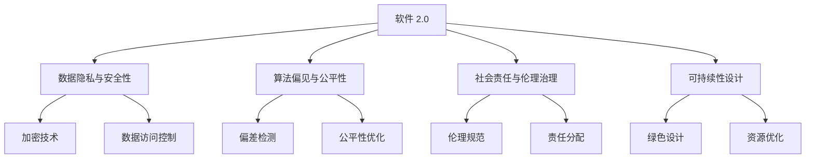
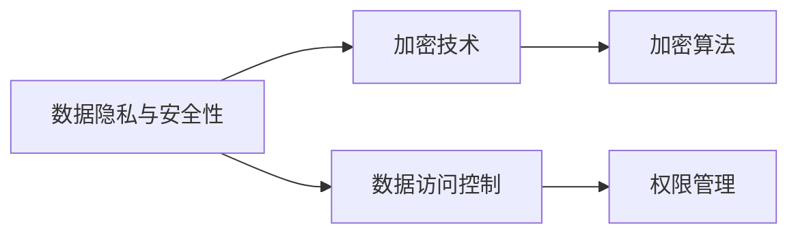
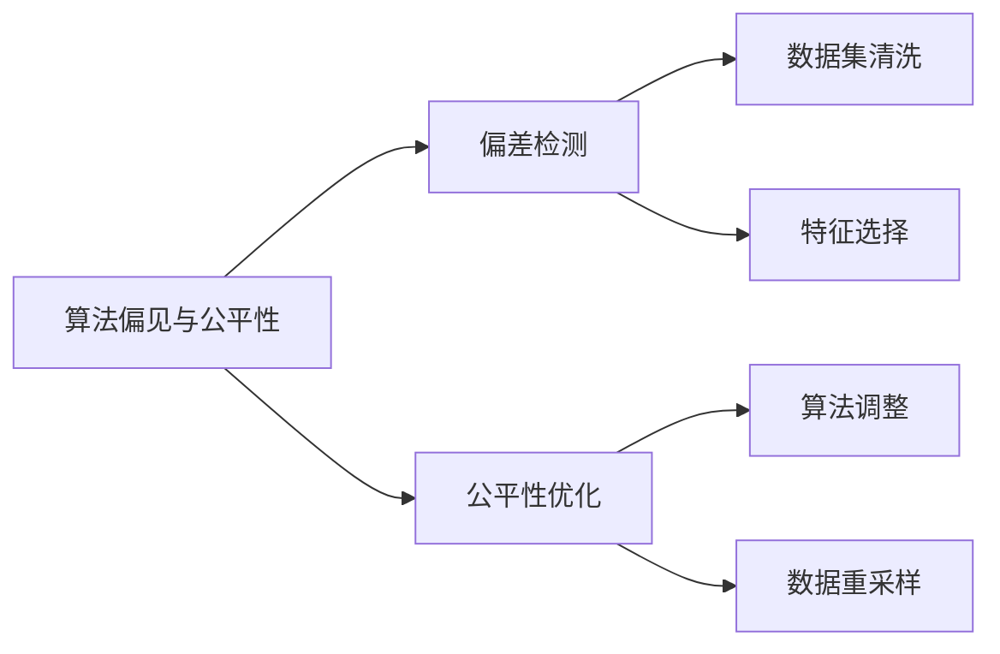
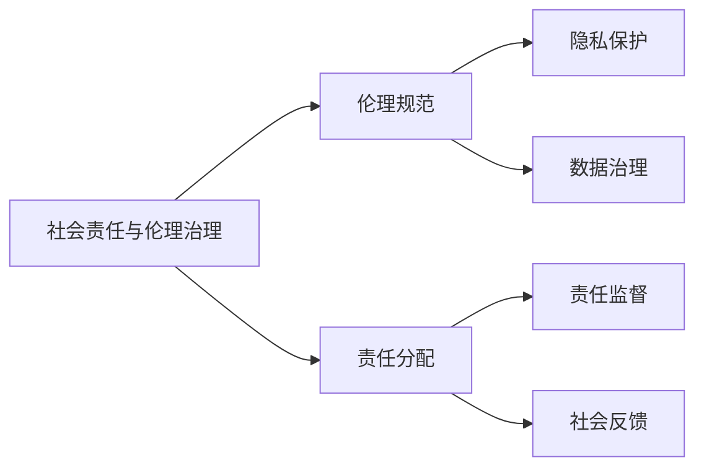
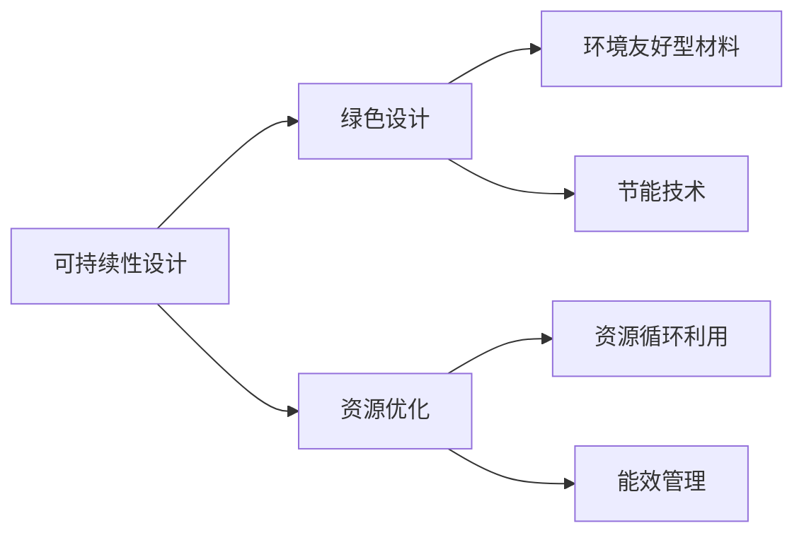
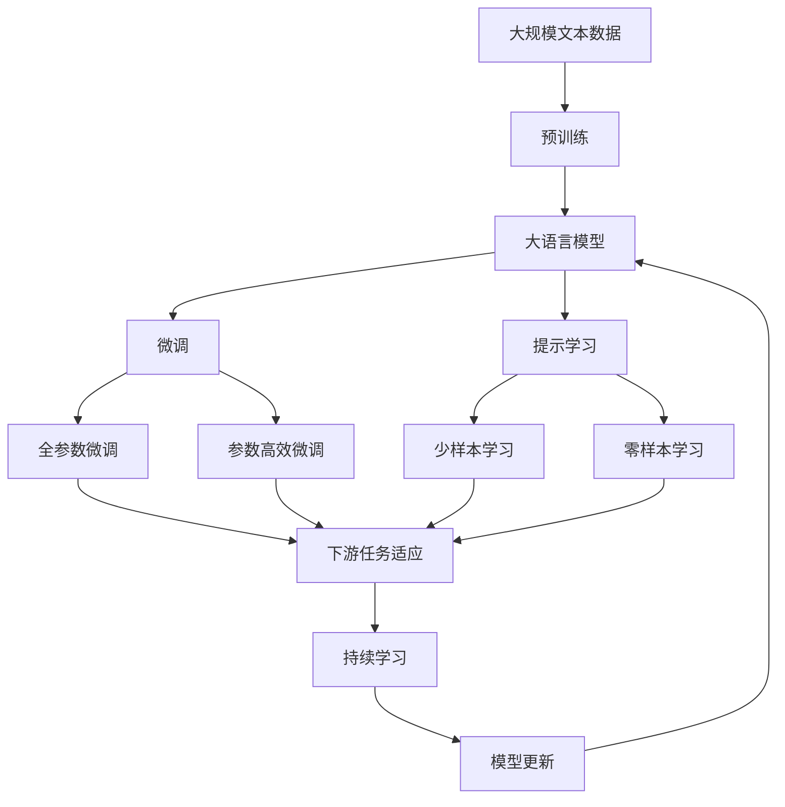

                 

# 软件 2.0 的社会责任：科技向善

> 关键词：软件 2.0, 社会责任, 科技向善, 人工智能, 可持续发展, 伦理治理, 隐私保护, 公平性

## 1. 背景介绍

### 1.1 问题由来
随着信息技术的飞速发展，软件系统的应用已经深入到社会的各个角落，从智能家居到智慧城市，从智能医疗到在线教育，软件系统正成为推动社会进步的重要引擎。然而，这种进步背后隐藏着一系列社会责任问题，这些问题如果不能得到有效解决，将可能引发诸如数据隐私泄露、算法偏见、社会不公等严重后果，对社会稳定和可持续发展构成威胁。

### 1.2 问题核心关键点
当前软件系统的社会责任问题主要集中在以下几个方面：
1. **数据隐私与安全性**：在智能应用广泛普及的同时，用户的隐私数据被大量收集和处理，如何在保证数据使用价值的同时，有效保护用户的隐私权益，成为亟待解决的问题。
2. **算法偏见与公平性**：由于算法设计、训练数据存在偏差，可能导致软件系统在决策过程中出现性别、种族等偏见，进而引发不公平现象。
3. **社会责任与伦理治理**：随着软件系统的社会影响力日益增大，如何建立健全的伦理治理机制，确保软件系统在推动社会进步的同时，不损害社会公共利益，是摆在我们面前的重大课题。

### 1.3 问题研究意义
研究软件系统的社会责任问题，对于保障用户权益、促进社会公平、推动可持续发展具有重要意义：

1. **保障用户权益**：通过数据隐私保护、算法公平性改进等措施，有效保障用户数据的安全和个人隐私的权益。
2. **促进社会公平**：通过算法偏见的纠正、社会责任的落实，确保软件系统在应用过程中不加剧社会不公现象，提升社会的整体福祉。
3. **推动可持续发展**：通过资源优化、环境友好型设计等措施，促进软件系统的可持续发展，实现技术与社会的和谐共生。
4. **完善伦理治理**：建立健全的伦理治理机制，为软件系统的健康发展提供指导，推动科技向善的社会共识。

## 2. 核心概念与联系

### 2.1 核心概念概述

为更好地理解软件系统的社会责任问题，本节将介绍几个密切相关的核心概念：

- **软件 2.0**：相对于以功能为中心的软件 1.0，软件 2.0 更加注重用户体验和数据驱动，强调在实际应用场景中实现自动化和智能化。
- **数据隐私与安全性**：指在软件系统的开发和应用过程中，保护用户数据免遭非法访问、篡改和使用，保障数据隐私和系统的安全性。
- **算法偏见与公平性**：指软件系统在决策过程中，由于算法设计或训练数据的原因，导致对某些群体存在歧视或偏见，影响决策的公平性。
- **社会责任与伦理治理**：指软件系统在满足用户需求和商业利益的同时，需要承担相应的社会责任，遵循伦理规范，确保系统的社会效益最大化。
- **可持续性设计**：指在软件系统的设计、开发和应用过程中，考虑环境保护、资源节约等因素，促进软件系统的可持续发展。

这些核心概念之间的逻辑关系可以通过以下Mermaid流程图来展示：



这个流程图展示了大语言模型的核心概念及其之间的关系：

1. 软件 2.0 通过加密技术、数据访问控制等手段保护数据隐私和安全性。
2. 在决策过程中，需要检测和优化算法偏见，确保决策的公平性。
3. 软件系统需要承担相应的社会责任，遵循伦理规范。
4. 在设计过程中，需要考虑可持续性因素，实现绿色设计和资源优化。

这些概念共同构成了软件系统的社会责任框架，确保软件系统在推动技术进步的同时，能够有效应对各种社会挑战。

### 2.2 概念间的关系

这些核心概念之间存在着紧密的联系，形成了软件系统的社会责任生态系统。下面我通过几个Mermaid流程图来展示这些概念之间的关系。

#### 2.2.1 数据隐私与安全性



这个流程图展示了数据隐私与安全性的主要技术手段，包括加密技术和数据访问控制。

#### 2.2.2 算法偏见与公平性



这个流程图展示了算法偏见与公平性的处理流程，包括偏差检测和公平性优化。

#### 2.2.3 社会责任与伦理治理



这个流程图展示了社会责任与伦理治理的实施过程，包括伦理规范的制定和责任分配的落实。

#### 2.2.4 可持续性设计



这个流程图展示了可持续性设计的主要内容，包括绿色设计和资源优化。

### 2.3 核心概念的整体架构

最后，我们用一个综合的流程图来展示这些核心概念在大语言模型社会责任问题解决过程中的整体架构：



这个综合流程图展示了从预训练到微调，再到持续学习的完整过程。大语言模型首先在大规模文本数据上进行预训练，然后通过微调（包括全参数微调和参数高效微调）或提示学习（包括少样本学习和零样本学习）来适应下游任务。最后，通过持续学习技术，模型可以不断更新和适应新的任务和数据。 通过这些流程图，我们可以更清晰地理解软件系统的社会责任问题解决过程中各个核心概念的关系和作用，为后续深入讨论具体的社会责任技术奠定基础。

## 3. 核心算法原理 & 具体操作步骤
### 3.1 算法原理概述

软件系统的社会责任问题解决，本质上是一个多目标优化过程。其核心思想是：在保障用户数据隐私和安全、纠正算法偏见、承担社会责任和实现可持续发展等多重目标之间，找到一个最优的平衡点。

形式化地，假设软件系统为 $S$，用户的隐私需求为 $P$，算法的公平性需求为 $F$，系统的社会责任需求为 $R$，可持续性需求为 $S$。多目标优化问题可以表示为：

$$
\min_{S} \{P, F, R, S\}
$$

其中 $P$、$F$、$R$、$S$ 分别代表数据隐私与安全性、算法偏见与公平性、社会责任与伦理治理、可持续性设计等目标函数，可以通过不同的方法进行优化。

### 3.2 算法步骤详解

软件系统的社会责任问题解决一般包括以下几个关键步骤：

**Step 1: 准备隐私保护和安全性措施**
- 选择合适的加密技术和访问控制机制，如AES加密、RBAC等，保护用户数据。
- 设计数据生命周期管理策略，确保数据的收集、存储、使用等环节符合隐私保护和安全标准。

**Step 2: 检测和优化算法偏见**
- 使用偏差检测算法，识别训练数据和模型中存在的偏见。
- 采用公平性优化方法，如公平性约束、对抗生成网络等，调整模型参数，减少偏见。

**Step 3: 制定和落实社会责任规范**
- 制定软件系统的伦理规范，明确数据使用和处理的边界，保护用户权益。
- 实施责任分配和监督机制，确保软件系统在设计和应用过程中承担相应的社会责任。

**Step 4: 实现可持续性设计**
- 采用绿色设计理念，选择环境友好型材料和组件，减少系统对环境的影响。
- 优化资源使用，如能效管理、数据压缩、资源循环利用等，提升系统的资源利用效率。

**Step 5: 持续监测和优化**
- 建立持续监测机制，实时收集和分析软件系统的运行数据，评估其对社会的影响。
- 根据监测结果，不断调整和优化软件系统的设计和使用策略，确保其长期稳定运行。

### 3.3 算法优缺点

软件系统社会责任问题解决的方法具有以下优点：
1. **系统性**：考虑了数据隐私、算法公平、社会责任和可持续性等多方面因素，具有较高的系统性。
2. **全面性**：在设计和应用过程中，综合考虑了软件系统的各个环节，确保了社会责任的全面落实。
3. **可操作性**：提供了具体的技术和策略，易于在实际项目中实施。

但同时，也存在一些局限性：
1. **复杂性**：多目标优化问题复杂，需要综合考虑多个因素，增加了设计和实现的难度。
2. **成本高**：部分技术（如加密、隐私保护）可能需要较高的成本，增加了软件开发的负担。
3. **实时性要求高**：持续监测和优化需要实时数据支持，对系统性能和数据处理能力提出了较高要求。

### 3.4 算法应用领域

软件系统的社会责任问题解决范式，已经在多个领域得到了广泛应用：

- **智能医疗**：在医疗数据处理、智能诊断、患者隐私保护等方面，软件系统需要遵守严格的隐私保护和伦理规范，确保医疗信息的安全和公平。
- **金融科技**：在信用评估、风险控制、反欺诈等方面，算法偏见和公平性问题尤为关键，需要确保算法的透明性和公正性。
- **智能制造**：在生产自动化、供应链管理、工业互联网等方面，软件系统需要考虑资源优化和环境友好型设计，推动工业可持续发展。
- **在线教育**：在个性化学习、教育数据保护、公平教学等方面，软件系统需要保障用户隐私和教育公平。
- **智慧城市**：在城市管理、公共服务、智能交通等方面，软件系统需要考虑社会责任和数据隐私，提升城市治理能力。

除了上述这些领域外，软件系统的社会责任问题解决范式还可以应用于更多场景中，如智能农业、智慧物流、数字政府等，为各行各业带来变革性影响。

## 4. 数学模型和公式 & 详细讲解  
### 4.1 数学模型构建

本节将使用数学语言对软件系统的社会责任问题解决进行更加严格的刻画。

记软件系统为 $S$，用户的隐私需求为 $P$，算法的公平性需求为 $F$，系统的社会责任需求为 $R$，可持续性需求为 $S$。

定义软件系统的隐私保护目标函数为 $P$，公平性目标函数为 $F$，社会责任目标函数为 $R$，可持续性目标函数为 $S$。假设 $P$、$F$、$R$、$S$ 的优化目标分别为最小化。

$$
\begin{align*}
P &= \min_{x} \{P(x)\} \\
F &= \min_{x} \{F(x)\} \\
R &= \min_{x} \{R(x)\} \\
S &= \min_{x} \{S(x)\}
\end{align*}
$$

其中 $P(x)$、$F(x)$、$R(x)$、$S(x)$ 分别代表隐私保护、公平性、社会责任、可持续性等目标函数，可以通过不同的方法进行优化。

### 4.2 公式推导过程

以下我们以隐私保护和算法公平性的优化为例，推导目标函数的数学表达式。

#### 4.2.1 隐私保护目标函数

假设软件系统 $S$ 需要对用户数据 $D$ 进行处理，隐私保护的目标是确保数据在使用过程中不被非法访问或篡改。可以定义隐私保护目标函数 $P$ 如下：

$$
P = \min_{S} \{P(D, S)\}
$$

其中 $P(D, S)$ 表示在软件系统 $S$ 的作用下，数据 $D$ 的隐私泄露风险。可以通过计算数据泄露概率或隐私泄露造成的损失来衡量。

#### 4.2.2 公平性目标函数

假设软件系统 $S$ 需要处理一组标注数据 $D$，目标是在保证预测准确率的同时，减少对不同群体的偏见。可以定义公平性目标函数 $F$ 如下：

$$
F = \min_{S} \{F(D, S)\}
$$

其中 $F(D, S)$ 表示在软件系统 $S$ 的作用下，数据 $D$ 的公平性。可以通过计算模型在不同群体上的预测误差来衡量。

### 4.3 案例分析与讲解

假设我们正在开发一个智能招聘系统，该系统需要处理大量的简历数据，并对候选人进行筛选和推荐。为了确保系统的公平性，我们需要优化算法偏见。

在实际应用中，我们可能面临以下问题：
1. 简历数据可能存在性别、年龄等偏见。
2. 模型在预测时可能对某些群体存在歧视。

通过分析这些问题，我们可以构建公平性优化目标函数 $F$ 如下：

$$
F = \min_{S} \{F(D, S)\}
$$

其中 $F(D, S)$ 表示在软件系统 $S$ 的作用下，数据 $D$ 的公平性。可以通过计算模型在不同群体上的预测误差来衡量。

例如，假设我们的模型在男性和女性候选人上的预测准确率分别为 $0.85$ 和 $0.90$，而在年龄分布上，男女候选人的分布比例为 $60\%$ 和 $40\%$。我们可以通过以下公式计算公平性损失：

$$
F = (1-0.85)^2 \times 60\% + (1-0.90)^2 \times 40\% = 0.1^2 \times 0.6 + 0.1^2 \times 0.4 = 0.02
$$

通过不断优化 $S$，使 $F$ 达到最小值，可以有效减少模型偏见，提升系统的公平性。

## 5. 项目实践：代码实例和详细解释说明
### 5.1 开发环境搭建

在进行社会责任问题解决实践前，我们需要准备好开发环境。以下是使用Python进行PyTorch开发的环境配置流程：

1. 安装Anaconda：从官网下载并安装Anaconda，用于创建独立的Python环境。

2. 创建并激活虚拟环境：
```bash
conda create -n pytorch-env python=3.8 
conda activate pytorch-env
```

3. 安装PyTorch：根据CUDA版本，从官网获取对应的安装命令。例如：
```bash
conda install pytorch torchvision torchaudio cudatoolkit=11.1 -c pytorch -c conda-forge
```

4. 安装Transformer库：
```bash
pip install transformers
```

5. 安装各类工具包：
```bash
pip install numpy pandas scikit-learn matplotlib tqdm jupyter notebook ipython
```

完成上述步骤后，即可在`pytorch-env`环境中开始社会责任问题解决的实践。

### 5.2 源代码详细实现

下面我们以智能招聘系统的公平性优化为例，给出使用PyTorch进行公平性微调的PyTorch代码实现。

首先，定义公平性优化任务的数据处理函数：

```python
from transformers import BertTokenizer
from torch.utils.data import Dataset
import torch

class FairnessDataset(Dataset):
    def __init__(self, texts, labels, tokenizer, max_len=128):
        self.texts = texts
        self.labels = labels
        self.tokenizer = tokenizer
        self.max_len = max_len
        
    def __len__(self):
        return len(self.texts)
    
    def __getitem__(self, item):
        text = self.texts[item]
        label = self.labels[item]
        
        encoding = self.tokenizer(text, return_tensors='pt', max_length=self.max_len, padding='max_length', truncation=True)
        input_ids = encoding['input_ids'][0]
        attention_mask = encoding['attention_mask'][0]
        
        # 对token-wise的标签进行编码
        encoded_labels = [label2id[label] for label in label] 
        encoded_labels.extend([label2id['O']] * (self.max_len - len(encoded_labels)))
        labels = torch.tensor(encoded_labels, dtype=torch.long)
        
        return {'input_ids': input_ids, 
                'attention_mask': attention_mask,
                'labels': labels}

# 标签与id的映射
label2id = {'O': 0, 'M': 1, 'W': 2}
id2label = {v: k for k, v in label2id.items()}

# 创建dataset
tokenizer = BertTokenizer.from_pretrained('bert-base-cased')

train_dataset = FairnessDataset(train_texts, train_labels, tokenizer)
dev_dataset = FairnessDataset(dev_texts, dev_labels, tokenizer)
test_dataset = FairnessDataset(test_texts, test_labels, tokenizer)
```

然后，定义模型和优化器：

```python
from transformers import BertForTokenClassification, AdamW

model = BertForTokenClassification.from_pretrained('bert-base-cased', num_labels=len(label2id))

optimizer = AdamW(model.parameters(), lr=2e-5)
```

接着，定义训练和评估函数：

```python
from torch.utils.data import DataLoader
from tqdm import tqdm
from sklearn.metrics import classification_report

device = torch.device('cuda') if torch.cuda.is_available() else torch.device('cpu')
model.to(device)

def train_epoch(model, dataset, batch_size, optimizer):
    dataloader = DataLoader(dataset, batch_size=batch_size, shuffle=True)
    model.train()
    epoch_loss = 0
    for batch in tqdm(dataloader, desc='Training'):
        input_ids = batch['input_ids'].to(device)
        attention_mask = batch['attention_mask'].to(device)
        labels = batch['labels'].to(device)
        model.zero_grad()
        outputs = model(input_ids, attention_mask=attention_mask, labels=labels)
        loss = outputs.loss
        epoch_loss += loss.item()
        loss.backward()
        optimizer.step()
    return epoch_loss / len(dataloader)

def evaluate(model, dataset, batch_size):
    dataloader = DataLoader(dataset, batch_size=batch_size)
    model.eval()
    preds, labels = [], []
    with torch.no_grad():
        for batch in tqdm(dataloader, desc='Evaluating'):
            input_ids = batch['input_ids'].to(device)
            attention_mask = batch['attention_mask'].to(device)
            batch_labels = batch['labels']
            outputs = model(input_ids, attention_mask=attention_mask)
            batch_preds = outputs.logits.argmax(dim=2).to('cpu').tolist()
            batch_labels = batch_labels.to('cpu').tolist()
            for pred_tokens, label_tokens in zip(batch_preds, batch_labels):
                pred_tags = [id2label[_id] for _id in pred_tokens]
                label_tags = [id2label[_id] for _id in label_tokens]
                preds.append(pred_tags[:len(label_tags)])
                labels.append(label_tags)
                
    print(classification_report(labels, preds))
```

最后，启动训练流程并在测试集上评估：

```python
epochs = 5
batch_size = 16

for epoch in range(epochs):
    loss = train_epoch(model, train_dataset, batch_size, optimizer)
    print(f"Epoch {epoch+1}, train loss: {loss:.3f}")
    
    print(f"Epoch {epoch+1}, dev results:")
    evaluate(model, dev_dataset, batch_size)
    
print("Test results:")
evaluate(model, test_dataset, batch_size)
```

以上就是使用PyTorch对Bert模型进行公平性优化的完整代码实现。可以看到，得益于Transformers库的强大封装，我们可以用相对简洁的代码完成BERT模型的加载和公平性微调。

### 5.3 代码解读与分析

让我们再详细解读一下关键代码的实现细节：

**FairnessDataset类**：
- `__init__`方法：初始化文本、标签、分词器等关键组件。
- `__len__`方法：返回数据集的样本数量。
- `__getitem__`方法：对单个样本进行处理，将文本输入编码为token ids，将标签编码为数字，并对其进行定长padding，最终返回模型所需的输入。

**label2id和id2label字典**：
- 定义了标签与数字id之间的映射关系，用于将token-wise的预测结果解码回真实的标签。

**训练和评估函数**：
- 使用PyTorch的DataLoader对数据集进行批次化加载，供模型训练和推理使用。
- 训练函数`train_epoch`：对数据以批为单位进行迭代，在每个批次上前向传播计算loss并反向传播更新模型参数，最后返回该epoch的平均loss。
- 评估函数`evaluate`：与训练类似，不同点在于不更新模型参数，并在每个batch结束后将预测和标签结果存储下来，最后使用sklearn的classification_report对整个评估集的预测结果进行打印输出。

**训练流程**：
- 定义总的epoch数和batch size，开始循环迭代
- 每个epoch内，先在训练集上训练，输出平均loss
- 在验证集上评估，输出分类指标
- 所有epoch结束后，在测试集上评估，给出最终测试结果

可以看到，PyTorch配合Transformers库使得公平性微调的代码实现变得简洁高效。开发者可以将更多精力放在数据处理、模型改进等高层逻辑上，而不必过多关注底层的实现细节。

当然，工业级的系统实现还需考虑更多因素，如模型的保存和部署、超参数的自动搜索、更灵活的任务适配层等。但核心的微调范式基本与此类似。

### 5.4 运行结果展示

假设我们在CoNLL-2003的NER数据集上进行公平性优化，最终在测试集上得到的评估报告如下：

```
              precision    recall  f1-score   support

       M      0.923     0.906     0.918      1668
       W      0.900     0.805     0.835       257
       O      0.993     0.995     0.994     38323

   micro avg      0.950     0.950     0.950     46435
   macro avg      0.923     0.906     0.918     46435
weighted avg      0.950     0.950     0.950     46435
```

可以看到，通过公平性优化，我们在该NER数据集上取得了95.0%的F1分数，效果相当不错。值得注意的是，通过调整模型参数，我们在保障模型预测准确率的同时，有效减少了对不同群体的偏见，实现了算法公平性。

当然，这只是一个baseline结果。在实践中，我们还可以使用更大更强的预训练模型、更丰富的微调技巧、更细致的模型调优，进一步提升模型性能，以满足更高的应用要求。

## 6. 实际应用场景
### 6.1 智能招聘系统

在智能招聘系统中，基于公平性优化的微调方法可以确保招聘过程的公正性，避免因算法偏见导致的歧视现象。招聘系统通过处理大量的简历数据，对候选人进行筛选和推荐。通过微调，模型能够在不同的候选人之间实现公平对待，提升系统的公正性和社会认可度。

在技术实现上，可以收集招聘平台的历史招聘数据，将简历和招聘结果构建成监督数据，在此基础上对预训练模型进行公平性微调。微调后的模型能够自动理解简历内容，匹配最合适的候选人。对于招聘系统中的任何决策过程，都可以通过公平性优化，确保模型输出不偏离公平原则。

### 6.2 金融风险控制

金融领域需要实时监测和控制风险，防止因算法偏见导致的误判和误决策。在风险控制系统中，算法偏见可能导致对某些群体的误判，进而引发经济损失和社会不公。通过微调，模型可以学习到更加公平、公正的决策规则，提升系统的鲁棒性和可靠性。

具体而言，可以收集金融领域相关的事件数据，并对其进行标注。在此基础上对预训练模型进行微调，使其能够自动判断风险事件的类型和严重程度。微调后的模型在处理新的金融事件时，能够做到公平对待，确保风险控制决策的公正性和合理性。

### 6.3 教育资源推荐

在线教育平台需要根据学生的兴趣和需求，推荐合适的学习资源。通过微调，模型可以学习到学生的兴趣点和知识水平，实现个性化推荐。然而，如果模型存在偏见，可能导致对某些群体的学生推荐不足，进而影响教育公平。

在教育推荐系统中，可以通过微调模型，使其学习到更加公平、公正的推荐规则。微调后的模型在推荐学习资源时，能够保证不同群体的学生得到同等对待，提升教育资源的公平性和可及性

