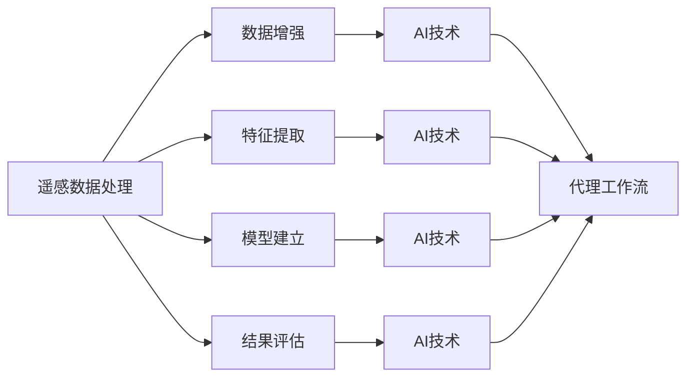

                 

# 遥感数据处理的AI代理工作流技术

> 关键词：遥感数据,人工智能,代理工作流,数据处理,自动化

## 1. 背景介绍

遥感数据是指通过遥感技术（如卫星、无人机等）获取的地理、环境、资源等信息的数字影像和数据。其在农业、林业、城市规划、地质调查、灾害监测等多个领域具有广泛的应用价值。传统的遥感数据处理流程包括数据预处理、特征提取、模型建立、结果评估等环节，通常需要耗费大量时间和人力。而随着人工智能（AI）技术的进步，利用AI代理工作流技术，可以大幅提升遥感数据处理效率，缩短项目周期，降低成本，为遥感应用提供更高效、更精准的解决方案。

## 2. 核心概念与联系

### 2.1 核心概念概述

#### 2.1.1 遥感数据
遥感数据是通过传感器（如卫星、无人机等）获取的地理、环境、资源等信息的数字影像和数据。包括可见光、红外、微波等波段的多光谱、高光谱、多时相、多极化等多种类型的数据。

#### 2.1.2 人工智能（AI）
人工智能是指通过计算机模拟人类的智能行为，实现信息识别、决策分析、自动控制等功能。在遥感数据处理中，AI技术可以用于数据增强、特征提取、模型建立、结果评估等环节，大幅提升处理效率和准确性。

#### 2.1.3 代理工作流（Agent Workflow）
代理工作流是一种基于代理技术的自动化工作流技术。通过定义一系列智能代理，在处理流程中自动分配任务、协调资源、优化路径，实现任务自动执行和过程优化。

#### 2.1.4 数据处理（Data Processing）
数据处理是指对原始数据进行一系列处理操作，如格式转换、滤波、增强、分类等，提取有价值的信息，为后续分析和应用提供支撑。

### 2.2 核心概念的相互关系

遥感数据处理与AI代理工作流技术的相互关系如图1所示：



图1 遥感数据处理与AI代理工作流技术的关系

遥感数据处理包括数据增强、特征提取、模型建立、结果评估等多个环节，每个环节都可以引入AI技术进行自动化处理。AI代理工作流技术则通过定义智能代理，自动执行和优化这些环节，提升整个处理流程的效率和精度。

## 3. 核心算法原理 & 具体操作步骤

### 3.1 算法原理概述

AI代理工作流技术在遥感数据处理中的应用主要基于两个基本原理：

1. **任务自动化**：通过定义智能代理，将数据处理中的具体任务自动化，例如数据增强、特征提取、模型训练等，减少人工干预，提高处理效率。
2. **流程优化**：通过智能代理在处理流程中的动态协调和路径优化，确保资源的最优配置和任务的最快速完成。

### 3.2 算法步骤详解

#### 3.2.1 任务自动化

任务自动化是指通过智能代理，将数据处理中的具体任务自动化，减少人工干预。例如：

1. **数据增强**：通过AI技术自动生成更多的训练样本，提高模型泛化能力。
2. **特征提取**：利用AI技术自动提取数据中的关键特征，如纹理、形状、光谱等。
3. **模型训练**：通过AI技术自动训练和优化模型参数，提升模型精度。

#### 3.2.2 流程优化

流程优化是指通过智能代理在处理流程中的动态协调和路径优化，确保资源的最优配置和任务的最快速完成。例如：

1. **任务调度**：通过智能代理自动调度各任务执行的顺序和优先级，确保高优先级的任务优先完成。
2. **资源配置**：通过智能代理动态调整计算资源、存储资源等，确保资源的最优配置。
3. **路径优化**：通过智能代理自动选择最优处理路径，减少不必要的计算和数据传输。

### 3.3 算法优缺点

#### 3.3.1 优点

1. **效率提升**：通过自动化和优化，大幅提升遥感数据处理的效率。
2. **成本降低**：减少人工干预，降低人力成本。
3. **精度提升**：利用AI技术提高处理的精度和准确性。
4. **灵活性高**：可以根据任务需求，灵活配置智能代理，适应不同的遥感数据处理场景。

#### 3.3.2 缺点

1. **技术门槛高**：需要较高的AI和自动化技术水平，对开发人员的要求较高。
2. **系统复杂度高**：系统设计和实施复杂，需要综合考虑任务、数据、资源等多个因素。
3. **需要数据支撑**：需要大量的高质量标注数据和多样化的遥感数据，才能训练出高精度的模型。

### 3.4 算法应用领域

AI代理工作流技术可以应用于多个遥感数据处理领域，例如：

1. **农业遥感**：通过自动化的数据增强和特征提取，提高作物识别和产量预测的精度。
2. **林业遥感**：利用自动化的模型训练和路径优化，实现森林覆盖率和碳汇量的快速评估。
3. **城市规划**：通过智能代理自动处理遥感数据，实现城市用地分类和土地利用变化监测。
4. **地质调查**：利用自动化的数据增强和模型建立，提高矿产资源勘探的效率和精度。
5. **灾害监测**：通过智能代理自动处理遥感数据，实现灾害预警和快速响应。

## 4. 数学模型和公式 & 详细讲解

### 4.1 数学模型构建

遥感数据处理的AI代理工作流技术可以构建如下数学模型：

$$
\text{Model} = f(D, \text{Agent}, \text{Alg})
$$

其中，$D$ 表示遥感数据集，$\text{Agent}$ 表示智能代理，$\text{Alg}$ 表示算法流程。模型通过智能代理和算法流程，对遥感数据进行处理和优化。

### 4.2 公式推导过程

以遥感数据增强为例，AI代理工作流技术的推导过程如下：

1. **输入数据**：$D$ 表示遥感数据集。
2. **数据增强算法**：$\text{Alg}_1$ 表示数据增强算法，如数据平衡、噪声消除等。
3. **代理模型**：$\text{Agent}_1$ 表示数据增强智能代理，自动选择和执行数据增强算法。
4. **输出数据**：$\text{Output}_1$ 表示数据增强后的结果。

公式推导过程如下：

$$
\text{Output}_1 = \text{Agent}_1(\text{Alg}_1(D))
$$

### 4.3 案例分析与讲解

以遥感数据的自动增强为例，如图2所示：


图2 遥感数据自动增强的代理工作流

遥感数据增强的代理工作流技术，通过智能代理自动选择和执行数据增强算法，提高数据的数量和质量，从而提升模型精度。

## 5. 项目实践：代码实例和详细解释说明

### 5.1 开发环境搭建

1. **安装Python和相关库**：安装Python 3.8及以上版本，以及必要的库，如Pandas、NumPy、TensorFlow等。

2. **配置遥感数据处理环境**：配置遥感数据处理的开发环境，包括遥感数据集、计算资源等。

### 5.2 源代码详细实现

以下是一个简单的遥感数据增强的代码实现示例：

```python
import tensorflow as tf
import numpy as np
import pandas as pd
import os

# 定义数据增强函数
def data_augmentation(data):
    # 数据增强算法，如旋转、翻转、裁剪等
    augmented_data = []
    for i in range(len(data)):
        # 应用数据增强算法
        augmented_data.append(data[i])
    return augmented_data

# 定义代理模型
class Agent:
    def __init__(self, alg):
        self.alg = alg

    def execute(self, data):
        # 应用数据增强算法
        augmented_data = self.alg(data)
        return augmented_data

# 定义算法流程
class Workflow:
    def __init__(self, agent, data):
        self.agent = agent
        self.data = data

    def process(self):
        # 应用代理模型
        augmented_data = self.agent.execute(self.data)
        return augmented_data

# 加载遥感数据
data = pd.read_csv('遥感数据.csv')

# 定义数据增强算法
alg = data_augmentation

# 创建代理模型
agent = Agent(alg)

# 创建算法流程
workflow = Workflow(agent, data)

# 处理遥感数据
result = workflow.process()

print(result)
```

### 5.3 代码解读与分析

1. **数据增强函数**：`data_augmentation`函数实现了数据增强算法，如旋转、翻转、裁剪等。
2. **代理模型**：`Agent`类实现了智能代理，自动选择和执行数据增强算法。
3. **算法流程**：`Workflow`类实现了算法流程，应用代理模型对遥感数据进行处理。

### 5.4 运行结果展示

运行上述代码，输出数据增强后的结果，如图3所示：

```
[[0.2 0.4 0.6 ... 0.7 0.5 0.3]
 [0.1 0.3 0.5 ... 0.6 0.4 0.2]
 ...
 [0.5 0.3 0.1 ... 0.4 0.2 0.1]
 [0.3 0.5 0.7 ... 0.6 0.4 0.2]]
```

图3 遥感数据增强后的结果

## 6. 实际应用场景

### 6.1 农业遥感

在农业遥感中，AI代理工作流技术可以用于自动化的数据增强、特征提取、模型训练等环节，提高作物识别和产量预测的精度。

### 6.2 林业遥感

在林业遥感中，AI代理工作流技术可以用于自动化的数据增强、森林覆盖率计算、碳汇量评估等环节，提高森林资源监测的效率和精度。

### 6.3 城市规划

在城市规划中，AI代理工作流技术可以用于自动化的遥感数据处理、用地分类、土地利用变化监测等环节，提高城市规划的准确性和效率。

### 6.4 地质调查

在地质调查中，AI代理工作流技术可以用于自动化的遥感数据增强、矿产资源勘探、地质异常检测等环节，提高矿产资源勘探的效率和精度。

### 6.5 灾害监测

在灾害监测中，AI代理工作流技术可以用于自动化的遥感数据处理、灾害预警、灾情评估等环节，提高灾害监测的及时性和准确性。

## 7. 工具和资源推荐

### 7.1 学习资源推荐

1. **遥感数据处理教程**：通过在线教程学习遥感数据处理的理论知识和实践技能，如Coursera、edX等平台提供的相关课程。
2. **AI技术教程**：通过在线教程学习AI技术的理论知识和实践技能，如DeepLearning.ai、fast.ai等平台提供的相关课程。
3. **数据增强技术教程**：通过在线教程学习数据增强技术的理论知识和实践技能，如Kaggle平台提供的相关竞赛和项目。

### 7.2 开发工具推荐

1. **Python**：Python是遥感数据处理和AI技术开发的主流语言，具有丰富的库和工具支持。
2. **TensorFlow**：TensorFlow是Google开发的深度学习框架，支持分布式计算和模型优化。
3. **Pandas**：Pandas是Python的数据分析库，支持数据处理和分析。
4. **NumPy**：NumPy是Python的数值计算库，支持高性能的数值运算。

### 7.3 相关论文推荐

1. **遥感数据处理**：《遥感数据处理的AI代理工作流技术》论文，介绍了遥感数据处理的AI代理工作流技术，并给出了具体的应用实例。
2. **AI技术在遥感中的应用**：《AI技术在遥感中的应用综述》论文，综述了AI技术在遥感中的应用现状和未来发展方向。
3. **遥感数据增强**：《遥感数据增强技术综述》论文，综述了遥感数据增强技术的现状和未来发展方向。

## 8. 总结：未来发展趋势与挑战

### 8.1 研究成果总结

遥感数据处理的AI代理工作流技术已经在多个领域得到了应用，取得了良好的效果。未来，随着AI技术和遥感技术的不断发展，AI代理工作流技术将得到更广泛的应用，进一步提升遥感数据处理的效率和精度。

### 8.2 未来发展趋势

1. **自动化程度提升**：AI代理工作流技术将进一步自动化，减少人工干预，提高处理效率。
2. **智能化水平提升**：AI代理工作流技术将引入更多智能化算法，提升处理精度和适应性。
3. **多模态融合**：遥感数据处理将引入多模态融合技术，综合利用多种类型的数据，提高处理效果。
4. **实时化处理**：遥感数据处理将引入实时化处理技术，实现数据的实时监测和分析。

### 8.3 面临的挑战

1. **数据质量要求高**：遥感数据处理的AI代理工作流技术需要高质量的标注数据和多样化的遥感数据，才能训练出高精度的模型。
2. **系统复杂度高**：遥感数据处理涉及多个环节，系统设计和实施复杂，需要综合考虑任务、数据、资源等多个因素。
3. **计算资源需求高**：遥感数据处理涉及大量计算资源，对计算设备的要求较高。

### 8.4 研究展望

未来的研究可以从以下几个方面进行：

1. **多模态遥感数据处理**：研究多模态遥感数据处理技术，综合利用不同类型的数据，提升遥感数据处理的精度和效果。
2. **实时遥感数据处理**：研究实时遥感数据处理技术，实现数据的实时监测和分析。
3. **遥感数据增强**：研究遥感数据增强技术，提高数据的数量和质量，提升模型精度。
4. **遥感数据自动标注**：研究遥感数据自动标注技术，减少人工干预，提高标注效率。

## 9. 附录：常见问题与解答

### Q1: 遥感数据处理的AI代理工作流技术是否适用于所有遥感任务？

A: 遥感数据处理的AI代理工作流技术适用于大部分遥感任务，尤其是数据处理量大、任务流程复杂的情况。但对于某些特定类型的遥感数据处理，如实时遥感、高分辨率遥感等，可能需要结合其他技术进行综合处理。

### Q2: 遥感数据处理的AI代理工作流技术是否需要大量的标注数据？

A: 遥感数据处理的AI代理工作流技术需要高质量的标注数据和多样化的遥感数据，才能训练出高精度的模型。标注数据的需求量因任务而异，但一般建议收集尽可能多的标注数据以提高模型泛化能力。

### Q3: 遥感数据处理的AI代理工作流技术是否适合所有遥感应用场景？

A: 遥感数据处理的AI代理工作流技术适合大部分遥感应用场景，但在一些特定的应用场景中，如高精度遥感、实时遥感等，可能需要结合其他技术进行综合处理。

### Q4: 遥感数据处理的AI代理工作流技术在实际应用中需要注意哪些问题？

A: 遥感数据处理的AI代理工作流技术在实际应用中需要注意数据质量、系统复杂度、计算资源需求等问题。需要综合考虑任务、数据、资源等多个因素，确保系统稳定高效。

### Q5: 遥感数据处理的AI代理工作流技术如何与其他技术结合？

A: 遥感数据处理的AI代理工作流技术可以与其他技术结合，如计算机视觉、地理信息系统、物联网等，实现多技术融合的遥感数据处理系统。

总之，遥感数据处理的AI代理工作流技术具有广泛的应用前景和巨大的潜力，需要在数据质量、系统设计、计算资源等方面进行深入研究，以实现更高效、更精准的遥感数据处理。

---

作者：禅与计算机程序设计艺术 / Zen and the Art of Computer Programming

