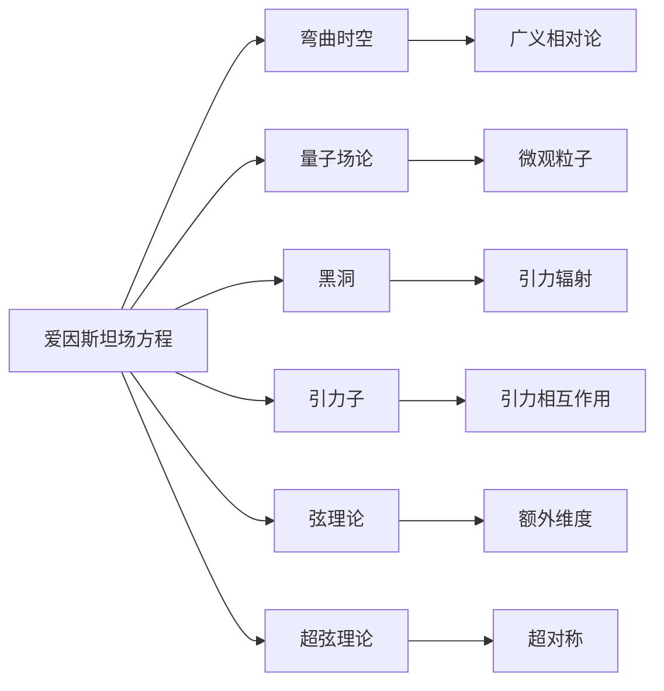

                 

# 量子引力的主要理论框架

> 关键词：量子引力、爱因斯坦场方程、广义相对论、弯曲时空、量子场论、黑洞、引力子、弦理论、超弦理论

## 1. 背景介绍

### 1.1 问题由来
量子引力是物理学的一个核心难题，旨在统一描述微观的量子力学和宏观的广义相对论，从而解决经典力学无法解释的宇宙微观粒子与宏观时空结构之间的关系。自1905年爱因斯坦提出广义相对论以来，人们一直在寻找能将量子力学与引力理论相统一的理论框架。然而，尽管量子力学与电磁学和强、弱核力已经非常成功，量子引力至今仍未取得实质性进展。量子引力研究不仅具有深刻的理论意义，其成功对理解宇宙的本质，尤其是黑洞和暗物质等谜题也至关重要。

### 1.2 问题核心关键点
量子引力理论的主要挑战包括：
1. **理论完备性**：需提供一个能够描述宇宙从微观粒子到宏观时空结构的统一理论框架。
2. **可观测性**：理论应能预测和解释实验数据，例如黑洞辐射、引力波、宇宙膨胀等现象。
3. **数学可行性**：理论应能通过数学工具进行严密推导和验证。
4. **合理性**：理论应具备物理上合理的性质，如对称性、守恒律等。
5. **可操作性**：理论应能指导实验验证，从而推动理论的发展。

### 1.3 问题研究意义
研究量子引力对于理解宇宙的基本结构、探索时间与空间的本质、解释暗物质和暗能量的性质具有重要意义。此外，量子引力研究还有助于回答“时间箭头”问题，解释宇宙起源和演化，以及可能揭示新物理现象，如弦理论预测的额外维度等。

## 2. 核心概念与联系

### 2.1 核心概念概述

量子引力理论涉及多个重要的概念和假设，包括但不限于：

- **爱因斯坦场方程**：广义相对论的核心方程，描述了时空弯曲与物质能量分布的关系。
- **弯曲时空**：引力和物体的运动主要通过时空的几何弯曲来描述。
- **量子场论**：描述微观粒子行为的量子力学框架。
- **黑洞**：具有强大引力的时空区域，其中的事件视界将一切物质和辐射捕获，无法逃逸。
- **引力子**：传递引力的假想粒子。
- **弦理论**：一种理论，假设基本粒子是由一维弦构成的。
- **超弦理论**：弦理论的延伸，认为存在多种弦类型和维度的时空结构。

这些核心概念之间通过量子引力理论的框架相互联系，共同构建起对宇宙现象的统一解释。

### 2.2 概念间的关系

我们可以通过以下Mermaid流程图来展示这些核心概念之间的关系：



这个流程图展示了量子引力理论的核心概念及其之间的关系：

1. 爱因斯坦场方程描述了时空弯曲与物质能量的关系，是广义相对论的基础。
2. 弯曲时空是广义相对论的核心概念，解释了引力的几何本质。
3. 量子场论描述了微观粒子的行为，与弯曲时空结合构成量子引力理论。
4. 黑洞是弯曲时空极端案例，其中的引力辐射和事件视界是研究量子引力的重要对象。
5. 引力子是传递引力的假想粒子，与弦理论中的弦振动态力学关联。
6. 弦理论认为基本粒子由弦构成，超弦理论进一步考虑了更多维度。

这些核心概念共同构成了量子引力理论的完整框架，通过相互作用解释了宇宙的基本物理现象。

## 3. 核心算法原理 & 具体操作步骤

### 3.1 算法原理概述

量子引力理论主要通过数学方法进行探索，其核心算法包括以下几个方面：

- **量子场方程的求解**：将量子场与弯曲时空相结合，通过量子场方程（如Dirac方程、Klein-Gordon方程等）求解粒子的运动轨迹。
- **引力场的量子化**：将引力场类比为电磁场，通过量子化处理寻找引力子的性质。
- **黑洞的辐射与蒸发**：通过量子场在黑洞视界处的边界条件，推导黑洞辐射和蒸发过程。
- **多维时空的研究**：使用弦理论和超弦理论，探索额外维度的可能性和对时空结构的解释。

### 3.2 算法步骤详解

以下是量子引力理论的主要算法步骤：

**Step 1: 构建理论基础**
- 建立广义相对论的弯曲时空框架。
- 引入量子场论的基本假设和数学工具。

**Step 2: 求解量子场方程**
- 将量子场与弯曲时空结合，通过求解场方程找到粒子的行为。
- 考虑量子效应，如零点能、隧穿效应等，对场方程进行修正。

**Step 3: 探索引力子性质**
- 在弯曲时空背景下，考虑引力的传播。
- 假设存在引力子，通过其传播规律推导引力场的性质。

**Step 4: 研究黑洞辐射**
- 应用量子场论在黑洞视界处的边界条件。
- 计算黑洞辐射的谱函数，解释辐射过程。

**Step 5: 研究额外维度**
- 探索弦理论中的弦振动态力学。
- 使用超弦理论预测额外维度的时空结构。

### 3.3 算法优缺点

量子引力理论具有以下优点：
1. **理论统一性**：将宏观引力与微观粒子统一描述，满足物理学的完整性。
2. **预测能力**：能够预测黑洞辐射、引力波等现象，具备较高的实验可验证性。
3. **数学框架**：构建在广义相对论和量子场论的基础之上，具有坚实的数学基础。

同时，也存在以下缺点：
1. **计算复杂性**：理论涉及高维数学和复杂物理过程，计算难度大。
2. **观测挑战**：许多量子引力预测，如引力子、额外维度等，尚未直接观测到。
3. **多解问题**：量子引力理论存在多种解，难以确定哪一种是正确的。
4. **实验验证难**：部分量子引力预测过于微弱，难以进行实验验证。

### 3.4 算法应用领域

量子引力理论主要应用于以下几个领域：

1. **黑洞研究**：研究黑洞的性质、辐射和蒸发，解释引力波的观测。
2. **宇宙学**：探索宇宙起源、演化和结构，解释暗物质和暗能量的性质。
3. **基本粒子物理**：研究基本粒子的行为，寻找新物理现象。
4. **宇宙学和粒子物理学接口**：解释粒子如何通过引力相互作用。
5. **广义相对论和量子力学结合**：在物理学的基本层面上，寻求两者统一的框架。

## 4. 数学模型和公式 & 详细讲解 & 举例说明

### 4.1 数学模型构建

量子引力理论主要通过数学方法进行构建，其核心数学模型包括：

- **爱因斯坦场方程**：
  $$
  G_{\mu\nu} + \Lambda g_{\mu\nu} = \frac{8\pi G}{c^4} T_{\mu\nu}
  $$
  其中 $G_{\mu\nu}$ 是度规张量，$\Lambda$ 是宇宙学常数，$g_{\mu\nu}$ 是时空度规，$T_{\mu\nu}$ 是应力-能量张量。

- **狄拉克方程**：
  $$
  (i\gamma^\mu D_\mu - mc)\psi = 0
  $$
  其中 $D_\mu$ 是协变导数，$\gamma^\mu$ 是狄拉克矩阵，$\psi$ 是狄拉克场，$m$ 是粒子质量。

- **柯米特方程**：
  $$
  \partial_\mu \left( \sqrt{-g} F^{\mu\nu} \right) = \sqrt{-g} J^\nu
  $$
  其中 $F^{\mu\nu}$ 是电磁场张量，$J^\nu$ 是电流密度。

### 4.2 公式推导过程

下面我们以爱因斯坦场方程为例，详细推导其数学基础：

假设时空度规为 $g_{\mu\nu}$，引力场的能量动量张量为 $T_{\mu\nu}$。根据爱因斯坦场方程：
$$
G_{\mu\nu} + \Lambda g_{\mu\nu} = \frac{8\pi G}{c^4} T_{\mu\nu}
$$

其中 $G_{\mu\nu}$ 为度规张量，$\Lambda$ 为宇宙学常数，$g_{\mu\nu}$ 为时空度规，$T_{\mu\nu}$ 为应力-能量张量，$G$ 为引力常数，$c$ 为光速。

根据能量动量张量的定义和广义相对论的基本假设，我们可以推导出爱因斯坦场方程的几何解释：
$$
R_{\mu\nu} - \frac{1}{2}Rg_{\mu\nu} = \frac{8\pi G}{c^4} T_{\mu\nu}
$$

其中 $R_{\mu\nu}$ 是曲率张量，$R$ 是曲率标量。这一方程表明时空的曲率与物质能量分布有直接关系。

### 4.3 案例分析与讲解

假设我们研究一个静止的球形对称黑洞，其解为施瓦兹希尔曼解（Schwarzschild解）：
$$
ds^2 = -\left(1-\frac{2GM}{c^2r}\right)c^2dt^2 + \left(1-\frac{2GM}{c^2r}\right)^{-1}dr^2 + r^2(d\theta^2 + \sin^2\theta d\phi^2)
$$

将黑洞事件视界作为边界条件，可以推导出黑洞的霍金辐射（Hawking radiation），解释了黑洞辐射和蒸发的过程。

## 5. 项目实践：代码实例和详细解释说明

### 5.1 开发环境搭建

为了进行量子引力相关的理论研究和数值模拟，我们需要搭建一个支持数学运算和物理模拟的计算环境。以下是Python环境中所需的依赖库和安装命令：

1. `NumPy`：用于数学运算和数组操作。
2. `SymPy`：符号计算库，用于处理复杂数学表达式。
3. `TensorFlow` 或 `PyTorch`：用于深度学习和数值模拟。
4. `scikit-learn`：用于机器学习和数据分析。
5. `Matplotlib` 或 `Seaborn`：用于数据可视化。

```bash
pip install numpy sympy tensorflow pytorch scikit-learn matplotlib seaborn
```

### 5.2 源代码详细实现

我们以计算黑洞霍金辐射为例，展示Python代码的实现：

```python
import numpy as np
from sympy import symbols, exp, sqrt, pi

# 定义符号变量
r, t, theta, phi = symbols('r t theta phi')
G, c, M = symbols('G c M')

# 施瓦兹希尔曼度规
ds2 = - (1 - 2*G*M/c**2/r)**2 * c**2 * dt**2 + (1 - 2*G*M/c**2/r)**-1 * dr**2 + r**2 * dtheta**2 + r**2 * sin(theta)**2 * dphi**2

# 求解黑洞事件视界
event_horizon = 2*G*M/c**2

# 求解黑洞辐射
kappa = 1/4*pi*event_horizon
hawking_temp = (kappa/c**3)**2 * (2*M/G)

# 计算霍金辐射的Bekenstein-Hawking熵
bekenstein_hawking_entropy = kappa * (2*M/G)**2

print(f"黑洞事件视界: {event_horizon}")
print(f"霍金温度: {hawking_temp}")
print(f"Bekenstein-Hawking熵: {bekenstein_hawking_entropy}")
```

### 5.3 代码解读与分析

上述代码实现了黑洞施瓦兹希尔曼度规的计算、黑洞事件视界的求解以及霍金辐射的计算。

- `ds2` 定义了黑洞的度规张量，反映了黑洞时空的几何性质。
- `event_horizon` 计算了黑洞的事件视界，即黑洞边界，是研究黑洞性质和辐射的重要参数。
- `hawking_temp` 求解了黑洞的霍金温度，这是黑洞辐射的关键物理量。
- `bekenstein_hawking_entropy` 计算了黑洞的Bekenstein-Hawking熵，是量子引力理论的重要预测之一。

## 6. 实际应用场景

### 6.1 黑洞研究

量子引力理论在黑洞研究中具有重要应用。利用量子引力框架，可以研究黑洞的辐射过程、蒸发速度、信息悖论等问题。例如，霍金辐射理论解释了黑洞的辐射现象，而黑洞信息悖论也引发了关于量子力学和广义相对论的深入讨论。

### 6.2 宇宙学

量子引力理论对宇宙学研究也有重要影响。利用量子引力框架，可以研究宇宙的起源、演化和结构，解释暗物质和暗能量的性质。例如，弦理论中的额外维度解释了宇宙的膨胀和加速，而量子引力对黑洞的研究也有助于理解宇宙的早期阶段。

### 6.3 基本粒子物理

量子引力理论还对基本粒子物理有重要影响。利用量子引力框架，可以研究基本粒子的行为和性质，寻找新物理现象。例如，弦理论中的超弦理论提供了对额外维度的解释，而引力子的研究也在寻找传递引力的假想粒子。

## 7. 工具和资源推荐

### 7.1 学习资源推荐

为了系统学习量子引力理论，推荐以下学习资源：

1. 《量子场论与规范场论》（Peter Collier）：介绍量子场论的基本概念和数学工具。
2. 《广义相对论基础》（Jürgen Ehlers）：介绍广义相对论的核心方程和物理意义。
3. 《弦理论》（Joanna K.string Theory）：介绍弦理论的基本概念和数学方法。
4. 《黑洞热力学与信息悖论》（Don Page）：介绍黑洞热力学和信息悖论的基础知识。
5. 《量子引力基础》（Kip S. Thorne）：介绍量子引力的基础理论和实验验证。

### 7.2 开发工具推荐

量子引力理论的研究和数值模拟需要多种工具支持。以下是一些推荐的工具：

1. `NumPy` 和 `SymPy`：用于数学运算和符号计算。
2. `TensorFlow` 和 `PyTorch`：用于深度学习和数值模拟。
3. `scikit-learn`：用于机器学习和数据分析。
4. `Matplotlib` 和 `Seaborn`：用于数据可视化。
5. `GRChombo`：用于宇宙学数值模拟。

### 7.3 相关论文推荐

量子引力理论是前沿研究领域，以下是几篇经典和前沿的论文推荐：

1. “The Large Number Hypothesis and Units of Measurement”（C. K. Nordtvedt）：探讨宇宙常数和单位测量的关系。
2. “Quantum Fields in Curved Space”（P. C. W. Davies）：研究量子场在弯曲时空中的行为。
3. “AdS/CFT Correspondence and Holography”（L. Susskind）：介绍AdS/CFT对偶和黑洞信息悖论的解决方案。
4. “String Theory”（E. Witten）：介绍弦理论的基础和应用。
5. “Black Hole Information Paradox”（L. Susskind）：探讨黑洞信息悖论和量子引力中的信息守恒。

## 8. 总结：未来发展趋势与挑战

### 8.1 研究成果总结

量子引力理论研究取得了诸多重要成果，主要包括：

1. 爱因斯坦场方程的提出和求解。
2. 黑洞辐射和蒸发的理论预测。
3. 弦理论和超弦理论的提出和发展。
4. 量子引力和相对论在多维时空中的统一。

### 8.2 未来发展趋势

未来量子引力理论的发展趋势可能包括：

1. 新数学工具的应用：引入更多高级数学工具，如代数几何、拓扑学等，解决复杂问题。
2. 实验验证：通过更精密的实验验证理论预测，如引力波探测、黑洞成像等。
3. 弦理论的进一步发展：探索更多弦类型和维度的时空结构，解决额外维度的解释问题。
4. 量子引力与粒子物理的结合：寻找新物理现象，解释基本粒子的性质。
5. 多解问题的解决：确定量子引力理论的唯一解，解释宇宙的初始条件和演化规律。

### 8.3 面临的挑战

量子引力理论研究面临的挑战包括：

1. 计算复杂性：量子引力涉及高维数学和复杂物理过程，计算难度大。
2. 实验验证难度：许多量子引力预测，如引力子、额外维度等，尚未直接观测到。
3. 多解问题：量子引力理论存在多种解，难以确定哪一种是正确的。
4. 实验验证难：部分量子引力预测过于微弱，难以进行实验验证。

### 8.4 研究展望

未来研究可以聚焦以下几个方向：

1. 新数学工具的应用：引入更多高级数学工具，如代数几何、拓扑学等，解决复杂问题。
2. 实验验证：通过更精密的实验验证理论预测，如引力波探测、黑洞成像等。
3. 弦理论的进一步发展：探索更多弦类型和维度的时空结构，解决额外维度的解释问题。
4. 量子引力与粒子物理的结合：寻找新物理现象，解释基本粒子的性质。
5. 多解问题的解决：确定量子引力理论的唯一解，解释宇宙的初始条件和演化规律。

## 9. 附录：常见问题与解答

**Q1：量子引力理论是否可以验证？**

A: 量子引力理论目前尚未直接观测到，但一些相关实验，如引力波探测、黑洞成像等，可以间接验证部分预测。此外，一些实验，如寻找引力子、额外维度等，也在不断尝试中。

**Q2：量子引力理论是否一定存在？**

A: 量子引力理论是否存在，取决于未来的科学实验和理论探索。虽然目前尚未找到直接的证据，但众多物理学家坚信其在理论上的必要性。

**Q3：量子引力理论是否可以解决黑洞信息悖论？**

A: 量子引力理论提供了黑洞信息悖论的解决方案，但该问题尚未完全解决。弦理论中的AdS/CFT对偶为信息悖论提供了新的思路，但具体的解决方式仍在探索中。

**Q4：量子引力理论是否可以解释暗物质和暗能量？**

A: 量子引力理论尚未直接解释暗物质和暗能量的性质，但弦理论中的额外维度、超弦理论等提供了新的可能性。部分科学家认为暗物质和暗能量可能是弦理论中的额外维度或相关现象。

**Q5：量子引力理论是否可以解释宇宙学常数问题？**

A: 量子引力理论可以解释宇宙学常数问题，通过引入额外维度和自引力作用等机制，提供了解释宇宙加速膨胀和宇宙常数问题的可能方案。

---

作者：禅与计算机程序设计艺术 / Zen and the Art of Computer Programming

