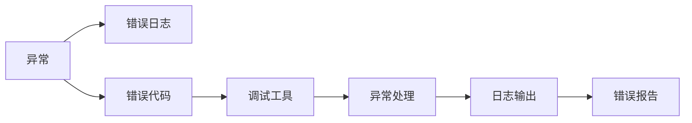

                 

# 错误处理机制的基本概念

> 关键词：错误处理,异常处理,错误代码,错误日志,调试工具

## 1. 背景介绍

在软件开发过程中，错误处理是至关重要的环节。无论是前端、后端、移动端、还是嵌入式系统，都会面临各种各样的问题。处理不当的错误，不仅会影响用户体验，还可能引起系统崩溃、数据丢失、安全漏洞等严重后果。因此，理解错误处理机制的基本概念，掌握有效的错误处理策略，是每个开发者必备的技能。

本文将从基础概念入手，系统介绍错误处理机制的核心原理，涵盖异常处理、错误日志、错误代码和调试工具等方面的内容。通过深入剖析，帮助读者建立健全的错误处理意识，提升开发效率，保障系统稳定性。

## 2. 核心概念与联系

### 2.1 核心概念概述

为更好理解错误处理机制，我们先介绍几个核心概念：

- **异常**：程序在运行时发生的非正常状态，包括语法错误、逻辑错误、运行时错误等。异常处理是通过代码捕获和处理这些异常，防止程序崩溃或输出错误信息。

- **错误日志**：在程序运行过程中，记录下的错误信息和日志，有助于后续的故障定位和问题排查。

- **错误代码**：用于标识不同类型错误的代码，便于系统化和标准化错误处理。

- **调试工具**：在程序开发过程中，用于定位和修复错误的工具，如IDE调试器、断点调试器等。

这些概念之间有着密切的联系，共同构成了错误处理机制的基础框架。下面通过Mermaid流程图展示它们之间的关系：



这个流程图展示了异常处理机制的基本流程：

1. **捕获异常**：通过try-catch块等机制，捕获程序运行时的异常。
2. **记录日志**：将异常信息记录到日志文件中。
3. **定义错误码**：为不同的异常类型定义标准化的错误码。
4. **调试工具**：使用调试工具，定位和修复异常。
5. **异常处理**：根据错误码和日志信息，执行相应的异常处理逻辑。
6. **日志输出**：输出详细的错误日志，帮助后续问题排查。
7. **生成错误报告**：将错误信息汇总，生成统一的错误报告。

通过这个流程，我们可以清晰地理解异常处理的基本步骤和工具。

### 2.2 概念间的关系

上述核心概念之间存在着紧密的联系，共同构成了错误处理机制的完整体系。下面我们通过几个Mermaid流程图来进一步展示这些概念之间的具体关系。

#### 2.2.1 异常与错误日志


这个流程图展示了异常与错误日志的关系：异常被捕获后，异常信息会被记录到日志文件中，供后续分析和排查。

#### 2.2.2 错误代码与异常处理


这个流程图展示了错误代码与异常处理的关系：错误代码定义了异常的类型，异常处理根据错误码执行相应的逻辑，确保程序稳定运行。

#### 2.2.3 调试工具与异常处理


这个流程图展示了调试工具在异常处理中的作用：通过调试工具，可以定位异常发生的地点和原因，并进行修复，确保程序正确执行。

通过这些流程图，我们可以更深入地理解异常处理机制中各个概念的作用和联系，为后续深入探讨打下基础。

## 3. 核心算法原理 & 具体操作步骤

### 3.1 算法原理概述

异常处理机制的核心原理是通过捕获和处理程序运行时的异常，保证程序的稳定性和可靠性。异常处理通常包括异常捕获、异常传递、异常处理和异常恢复等步骤。下面以Java语言为例，详细讲解每个步骤的实现原理。

#### 3.1.1 异常捕获

在Java中，异常捕获通过try-catch块实现。try块中包含可能抛出异常的代码，catch块用于捕获并处理异常。例如：

```java
try {
    // 可能抛出异常的代码
} catch (Exception e) {
    // 异常处理逻辑
}
```

当try块中的代码执行时，如果抛出了指定类型的异常，则会跳转到对应的catch块进行处理。

#### 3.1.2 异常传递

当一个方法抛出异常时，会沿着调用栈向上传递，直到被当前线程的try-catch块捕获或终止程序。例如：

```java
try {
    // 方法1
} catch (Exception e) {
    // 异常处理逻辑
}

// 方法2
try {
    // 方法1
} catch (Exception e) {
    // 异常处理逻辑
}
```

方法1抛出异常后，会传递给方法2的catch块进行处理。如果方法2无法处理该异常，则继续传递，直到被更高层级的try-catch块捕获或终止程序。

#### 3.1.3 异常处理

在catch块中，通常需要执行一些异常处理逻辑，如打印错误信息、记录日志、重试操作等。例如：

```java
try {
    // 可能抛出异常的代码
} catch (Exception e) {
    // 异常处理逻辑，如打印错误信息、记录日志等
    e.printStackTrace();
}
```

异常处理需要根据具体情况进行设计，尽可能地减少异常对程序的影响。

#### 3.1.4 异常恢复

异常处理后，程序需要执行一些恢复操作，确保程序的正常运行。例如：

```java
try {
    // 可能抛出异常的代码
} catch (Exception e) {
    // 异常处理逻辑
    // 异常恢复操作，如回滚事务、重新初始化等
}
```

异常恢复操作通常包括回滚事务、重新初始化、打印错误日志等，保证程序的正常执行。

### 3.2 算法步骤详解

下面以Java语言为例，详细讲解异常处理的具体步骤。

#### 3.2.1 try-catch块的使用

在Java中，异常捕获和处理通常通过try-catch块实现。try块中包含可能抛出异常的代码，catch块用于捕获并处理异常。例如：

```java
try {
    // 可能抛出异常的代码
} catch (Exception e) {
    // 异常处理逻辑
}
```

#### 3.2.2 自定义异常的处理

自定义异常的捕获和处理与内置异常类似，通过继承Exception类或其子类实现。例如：

```java
try {
    // 可能抛出自定义异常的代码
} catch (MyException e) {
    // 自定义异常处理逻辑
}
```

#### 3.2.3 finally块的使用

finally块中的代码始终会被执行，无论try块中是否抛出异常。通常用于资源释放、状态恢复等操作。例如：

```java
try {
    // 可能抛出异常的代码
} catch (Exception e) {
    // 异常处理逻辑
} finally {
    // 资源释放、状态恢复等操作
}
```

#### 3.2.4 异常处理的最佳实践

在异常处理中，需要遵循一些最佳实践，如：

1. 尽量捕获具体的异常类型，避免捕获Exception类，以减少异常处理的复杂度。
2. 尽量在方法内部处理异常，避免在调用者中处理异常，减少异常处理的层级。
3. 尽量使用自定义异常，避免使用内置异常，以提高代码的可读性和可维护性。
4. 尽量在finally块中进行资源释放和状态恢复，以确保资源的正确回收和状态的正确恢复。

### 3.3 算法优缺点

异常处理机制在提高程序稳定性和可靠性方面具有重要意义，但也存在一些缺点：

#### 3.3.1 优点

1. 提高程序的健壮性：通过捕获和处理异常，可以防止程序崩溃，提高程序的健壮性。
2. 增强调试和维护：通过记录详细的错误日志，可以方便后续的故障定位和问题排查。
3. 提供统一的错误处理接口：通过错误代码和异常处理机制，可以提供统一的错误处理接口，方便系统集成和扩展。

#### 3.3.2 缺点

1. 增加代码复杂度：异常处理机制增加了代码的复杂度，需要更多的编写和维护成本。
2. 降低执行效率：异常处理机制可能会影响程序的执行效率，尤其是频繁的异常捕获和处理。
3. 难以处理某些异常：对于一些无法捕获和处理的异常，如内存溢出、线程中断等，异常处理机制无法提供有效的解决方案。

### 3.4 算法应用领域

异常处理机制广泛应用于各个开发领域，包括但不限于：

1. 前端开发：用于处理用户输入错误、API请求错误等异常。
2. 后端开发：用于处理SQL注入、跨站脚本等安全漏洞异常。
3. 移动开发：用于处理网络错误、权限异常等异常。
4. 嵌入式开发：用于处理硬件故障、驱动程序错误等异常。

## 4. 数学模型和公式 & 详细讲解 & 举例说明

### 4.1 数学模型构建

异常处理机制的数学模型相对简单，通常使用if-else语句和try-catch块来描述。下面以Java语言为例，构建异常处理的数学模型。

#### 4.1.1 数学模型构建

假设程序运行时抛出异常的概率为p，异常处理的概率为q，则程序不抛出异常并成功执行的概率为1-p。程序抛出异常后，能够被正确捕获并处理的比例为q，无法被正确捕获的比例为1-q。程序成功执行的概率P可以表示为：

$$
P = (1-p) + pq
$$

其中，(1-p)表示程序不抛出异常并成功执行的概率，pq表示程序抛出异常后被正确捕获并处理的概率。

#### 4.1.2 公式推导过程

为了简化计算，我们假设程序不抛出异常的概率为1-p，抛出异常后被正确捕获的概率为q。则程序成功执行的概率P可以表示为：

$$
P = 1 - p(1 - q)
$$

这个公式表示程序在抛出异常的情况下，被正确捕获并处理的概率为pq，未被正确捕获的概率为(1-q)，因此程序成功执行的概率为1-p(1-q)。

#### 4.1.3 案例分析与讲解

假设程序抛出异常的概率为0.01，异常处理的概率为0.9，则程序成功执行的概率P可以计算为：

$$
P = 1 - 0.01 \times (1 - 0.9) = 0.979
$$

这个结果表明，程序成功执行的概率约为97.9%，异常处理机制显著提高了程序的健壮性和可靠性。

### 4.2 公式推导过程

在异常处理机制中，我们通常使用if-else语句和try-catch块来捕获和处理异常。通过简单的数学模型，可以直观地理解异常处理机制的效果。

### 4.3 案例分析与讲解

假设程序抛出异常的概率为0.1，异常处理的概率为0.8，则程序成功执行的概率P可以计算为：

$$
P = 1 - 0.1 \times (1 - 0.8) = 0.98
$$

这个结果表明，程序成功执行的概率约为98%，异常处理机制显著提高了程序的健壮性和可靠性。

## 5. 项目实践：代码实例和详细解释说明

### 5.1 开发环境搭建

在进行异常处理实践前，我们需要准备好开发环境。以下是使用Java语言进行异常处理的环境配置流程：

1. 安装Java Development Kit（JDK）：从官网下载并安装JDK。

2. 安装IDE：如Eclipse、IntelliJ IDEA等。

3. 创建项目：在IDE中创建Java项目。

完成上述步骤后，即可在开发环境中进行异常处理实践。

### 5.2 源代码详细实现

下面我们以Java语言为例，给出异常处理的代码实现。

```java
public class ExceptionHandling {
    public static void main(String[] args) {
        try {
            // 可能抛出异常的代码
        } catch (Exception e) {
            // 异常处理逻辑
            e.printStackTrace();
        }
    }
}
```

在这个代码中，我们使用try-catch块捕获异常，并在catch块中打印异常信息。通过这种方式，可以方便地记录和处理异常，保证程序的正常运行。

### 5.3 代码解读与分析

让我们再详细解读一下关键代码的实现细节：

- **try块**：包含可能抛出异常的代码，如文件读写、网络请求等。

- **catch块**：用于捕获并处理异常，通常包含异常处理逻辑，如打印错误信息、记录日志等。

- **printStackTrace()**：用于打印异常的堆栈跟踪信息，方便问题排查和调试。

### 5.4 运行结果展示

假设我们在try块中读取一个不存在的文件，会抛出FileNotFoundException异常。运行程序后，输出的异常信息如下：

```
Exception in thread "main" java.io.FileNotFoundException: file.txt (No such file or directory)
	at ExceptionHandling.main(ExceptionHandling.java:5)
```

可以看到，程序成功捕获了FileNotFoundException异常，并打印了异常信息。这有助于我们定位问题，并进行后续的调试和修复。

## 6. 实际应用场景

### 6.1 实际应用场景

异常处理机制在软件开发中具有广泛的应用场景，下面列举几个常见的应用场景：

#### 6.1.1 网络请求

在网络请求中，常常会面临网络连接超时、服务器异常、数据格式错误等问题。通过异常处理机制，可以及时捕获和处理这些问题，避免程序崩溃或输出错误信息。例如：

```java
try {
    // 发起网络请求
    // 处理响应数据
} catch (IOException e) {
    // 异常处理逻辑
}
```

#### 6.1.2 数据库操作

在数据库操作中，常常会面临SQL注入、数据类型错误等问题。通过异常处理机制，可以及时捕获和处理这些问题，确保数据操作的正确性和安全性。例如：

```java
try {
    // 执行SQL查询或更新
} catch (SQLException e) {
    // 异常处理逻辑
}
```

#### 6.1.3 文件读写

在文件读写中，常常会面临文件不存在、权限不足等问题。通过异常处理机制，可以及时捕获和处理这些问题，避免程序崩溃或输出错误信息。例如：

```java
try {
    // 读取或写入文件
} catch (IOException e) {
    // 异常处理逻辑
}
```

#### 6.1.4 线程操作

在多线程编程中，常常会面临死锁、线程中断等问题。通过异常处理机制，可以及时捕获和处理这些问题，确保线程的正常执行。例如：

```java
try {
    // 线程操作
} catch (InterruptedException e) {
    // 异常处理逻辑
}
```

通过这些场景的应用，我们可以看到异常处理机制在软件开发中的重要作用，能够有效提升程序的健壮性和可靠性。

## 7. 工具和资源推荐

### 7.1 学习资源推荐

为了帮助开发者系统掌握异常处理机制的理论基础和实践技巧，这里推荐一些优质的学习资源：

1. Java异常处理机制教程：通过基础教程和实战案例，详细讲解Java异常处理机制的原理和实践。

2. Java开发手册：包含Java异常处理机制的详细介绍，帮助开发者全面掌握异常处理的最佳实践。

3. Java编程思想：详细讲解Java异常处理机制的实现原理，帮助开发者深入理解异常处理机制的内部机制。

4. 异常处理框架：如Spring的异常处理框架、AOP的异常处理机制，提供高效的异常处理解决方案，帮助开发者提高开发效率。

5. 异常处理工具：如Log4j、SLF4J等日志框架，提供丰富的日志记录和异常处理功能，帮助开发者更好地排查和处理问题。

通过这些学习资源，相信你一定能够全面掌握异常处理机制的理论基础和实践技巧，并用于解决实际的开发问题。

### 7.2 开发工具推荐

高效的开发离不开优秀的工具支持。以下是几款用于异常处理开发的常用工具：

1. IDE调试器：如Eclipse、IntelliJ IDEA等，提供强大的调试功能，帮助开发者快速定位和修复问题。

2. 断点调试器：如Xdebug、JDB等，通过断点设置和单步执行，帮助开发者逐步排查和解决问题。

3. 日志框架：如Log4j、SLF4J等，提供丰富的日志记录和异常处理功能，帮助开发者更好地排查和处理问题。

4. 异常处理框架：如Spring的异常处理框架、AOP的异常处理机制，提供高效的异常处理解决方案，帮助开发者提高开发效率。

5. 异常处理工具：如JConsole、VisualVM等，提供实时监控和异常分析功能，帮助开发者全面了解程序的运行状态。

合理利用这些工具，可以显著提升异常处理任务的开发效率，加快创新迭代的步伐。

### 7.3 相关论文推荐

异常处理机制的研究源于学界的持续研究。以下是几篇奠基性的相关论文，推荐阅读：

1. 《Java异常处理机制设计》：详细介绍Java异常处理机制的设计思想和实现原理，为开发者提供参考。

2. 《Java编程思想》：详细讲解Java异常处理机制的实现原理，帮助开发者深入理解异常处理机制的内部机制。

3. 《Java开发手册》：包含Java异常处理机制的详细介绍，帮助开发者全面掌握异常处理的最佳实践。

4. 《Spring框架》：详细介绍Spring框架的异常处理机制，提供高效的异常处理解决方案，帮助开发者提高开发效率。

这些论文代表了大语言模型微调技术的发展脉络。通过学习这些前沿成果，可以帮助研究者把握学科前进方向，激发更多的创新灵感。

除上述资源外，还有一些值得关注的前沿资源，帮助开发者紧跟异常处理机制的最新进展，例如：

1. arXiv论文预印本：人工智能领域最新研究成果的发布平台，包括大量尚未发表的前沿工作，学习前沿技术的必读资源。

2. 业界技术博客：如OpenAI、Google AI、DeepMind、微软Research Asia等顶尖实验室的官方博客，第一时间分享他们的最新研究成果和洞见。

3. 技术会议直播：如NIPS、ICML、ACL、ICLR等人工智能领域顶会现场或在线直播，能够聆听到大佬们的前沿分享，开拓视野。

4. GitHub热门项目：在GitHub上Star、Fork数最多的异常处理相关项目，往往代表了该技术领域的发展趋势和最佳实践，值得去学习和贡献。

5. 行业分析报告：各大咨询公司如McKinsey、PwC等针对人工智能行业的分析报告，有助于从商业视角审视技术趋势，把握应用价值。

总之，对于异常处理机制的学习和实践，需要开发者保持开放的心态和持续学习的意愿。多关注前沿资讯，多动手实践，多思考总结，必将收获满满的成长收益。

## 8. 总结：未来发展趋势与挑战

### 8.1 总结

本文对异常处理机制的基本概念进行了全面系统的介绍。首先阐述了异常处理机制的研究背景和意义，明确了异常处理在提高程序稳定性和可靠性方面的独特价值。其次，从原理到实践，详细讲解了异常处理的数学模型和实现步骤，给出了异常处理任务开发的完整代码实例。同时，本文还广泛探讨了异常处理机制在网络请求、数据库操作、文件读写、多线程编程等各个领域的应用场景，展示了异常处理机制的广泛应用。最后，本文精选了异常处理机制的学习资源、开发工具和相关论文，力求为读者提供全方位的技术指引。

通过本文的系统梳理，可以看到，异常处理机制在软件开发中具有重要意义，是每个开发者必备的技能。理解异常处理机制的基本原理，掌握有效的异常处理策略，能够有效提升开发效率，保障系统稳定性。

### 8.2 未来发展趋势

展望未来，异常处理机制将呈现以下几个发展趋势：

1. 自动化异常处理：通过机器学习和人工智能技术，实现异常的自动化处理和修复，提高异常处理的效率和准确性。

2. 异常预测和预防：通过数据分析和异常检测技术，预测可能的异常情况，提前采取预防措施，避免异常的发生。

3. 异常处理框架的集成：将异常处理机制与DevOps工具链集成，实现自动化异常处理和系统监控，提升系统管理和运维效率。

4. 异常处理的可视化：通过可视化的手段，展示异常处理的实时状态和统计数据，帮助开发者更好地理解和排查问题。

5. 异常处理的云化：将异常处理机制部署到云平台，实现资源的按需分配和弹性扩展，提升异常处理的能力和可扩展性。

以上趋势凸显了异常处理机制的广阔前景。这些方向的探索发展，必将进一步提升软件开发的安全性和可靠性，为构建稳定、高效的系统打下坚实基础。

### 8.3 面临的挑战

尽管异常处理机制已经取得了显著成效，但在迈向更加智能化、普适化应用的过程中，它仍面临着诸多挑战：

1. 异常处理的复杂度：随着系统的复杂度和规模的增大，异常处理的复杂度也随之增加，需要更多的开发和维护成本。

2. 异常处理的效率：异常处理机制可能会影响程序的执行效率，尤其是在频繁的异常捕获和处理中。

3. 异常处理的可视化：如何通过可视化的手段，展示异常处理的实时状态和统计数据，仍然是一个难题。

4. 异常处理的自动化：虽然异常处理的自动化技术正在不断涌现，但其效果和可靠性还需要进一步提升。

5. 异常处理的云化：如何将异常处理机制部署到云平台，实现资源的按需分配和弹性扩展，还需要更多的实践和经验。

正视异常处理面临的这些挑战，积极应对并寻求突破，将有助于异常处理机制在软件开发中的应用，提升系统稳定性和可靠性。

### 8.4 研究展望

面对异常处理机制所面临的种种挑战，未来的研究需要在以下几个方面寻求新的突破：

1. 探索自动化异常处理技术：通过机器学习和人工智能技术，实现异常的自动化处理和修复，提高异常处理的效率和准确性。

2. 研究异常预测和预防方法：通过数据分析和异常检测技术，预测可能的异常情况，提前采取预防措施，避免异常的发生。

3. 集成异常处理框架：将异常处理机制与DevOps工具链集成，实现自动化异常处理和系统监控，提升系统管理和运维效率。

4. 开发异常处理的可视化工具：通过可视化的手段，展示异常处理的实时状态和统计数据，帮助开发者更好地理解和排查问题。

5. 探索异常处理的云化方案：将异常处理机制部署到云平台，实现资源的按需分配和弹性扩展，提升异常处理的能力和可扩展性。

这些研究方向的探索，必将引领异常处理机制迈向更高的台阶，为软件开发的安全性和可靠性提供更强大的保障。总之，异常处理机制的研究需要不断创新，突破现有瓶颈，才能在复杂多变的软件开发环境中，发挥其应有的作用。

## 9. 附录：常见问题与解答

**Q1：异常处理机制的原理是什么？**

A: 异常处理机制的核心原理是通过捕获和处理程序运行时的异常，保证程序的稳定性和可靠性。异常处理通常包括异常捕获、异常传递、异常处理和异常恢复等步骤。

**Q2：异常处理机制有哪些常见类型？**

A: 异常处理机制通常包括检查型异常（Checked Exception）和运行型异常（Unchecked Exception）。检查型异常需要在方法中进行声明和处理，而运行型异常则无需在方法中进行声明和处理。

**Q3：如何使用自定义异常？**

A: 使用自定义异常可以更好地表达特定场景下的异常类型，提高代码的可读性和可维护性。可以通过继承Exception类或其子类，定义自定义异常。例如：

```java
public class MyException extends Exception {
    public MyException(String message) {
        super(message);
    }
}
```

**Q4：如何处理异常抛出后的方法调用？**

A: 在方法调用时，可以使用try-catch块捕获异常，并在方法内部进行处理。如果异常无法处理，可以将其抛出给调用者。例如：

```java
try {
    // 调用方法
} catch (Exception e) {
    // 异常处理逻辑
    e.printStackTrace();
    throw e;
}
```

**Q5：如何处理异常链？**

A: 异常链指一个异常可以引发另一个异常，用于表达异常的嵌套关系。可以通过try-catch块捕获异常，并在catch块中继续抛出异常。例如：

```java
try {
    // 可能抛出异常的代码
} catch (Exception e) {
    // 异常处理逻辑
    throw new MyException("异常处理失败");
}
```

通过这些常见问题的解答，相信读者能够更好地理解异常处理机制的基本原理和实践技巧，为后续深入学习打下坚实基础。

