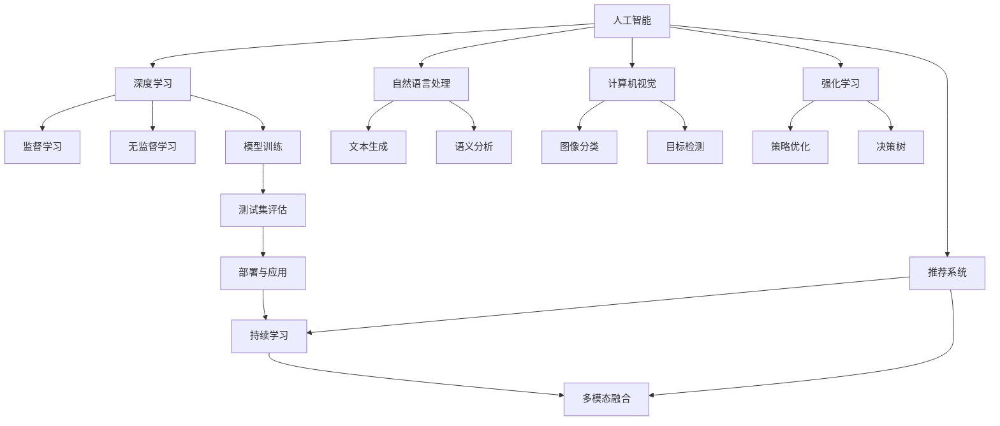

                 

# AGI与物理学的协同发展

## 1. 背景介绍

随着人工智能（AI）技术的飞速发展，人工智能领域的众多突破和创新使得人们对于强人工智能（AGI）的概念愈加关注。AGI，即具备与人类相似的认知和决策能力的智能体，是当前人工智能研究的最终目标之一。在探索AGI的道路上，物理学的理论与方法扮演了重要角色。

### 1.1 问题由来

**物理学的关键理论**
物理学是自然科学的基础，其中的许多理论已经超越了其原本的研究范畴，对人类思维方式和认知系统产生了深远影响。例如，信息论和控制论的理论，最初是为了解决工程问题而提出的，但后来成为理解人类大脑和智能体的关键工具。同样，热力学中的熵概念，也影响着我们对于智能体和环境间复杂交互的理解。

**人工智能与物理学的交集**
在AI研究中，涉及到许多与物理学相关的理论和算法。深度学习模型受到生物学神经网络结构的启发，而随机过程、强化学习、量子计算等前沿领域的理论和算法，都受益于物理学研究的成果。物理学的多领域应用和跨学科的研究精神，为AI领域提供了丰富的理论和技术基础。

**AGI的需求**
AGI的研究不仅需要计算机科学和数学的支持，还需要物理学的理论和实验方法。AGI的目标是构建能够像人类一样具备知识、逻辑推理、情绪处理、创造力等高级认知功能的智能系统。要实现这一目标，就需要对智能体的物理特性、工作原理进行深入研究，而物理学恰好提供了研究认知和智能的关键视角和方法。

## 2. 核心概念与联系

### 2.1 核心概念概述

**人工智能**
人工智能是一门使用计算机技术解决智能问题的学科，其核心在于构建能够执行人类智能任务的算法和系统。AI包括搜索、推理、知识表示、规划等子领域，并能够处理语音识别、图像识别、自然语言处理等多种类型的数据。

**物理学**
物理学是研究物质、能量、空间和时间的自然科学，它的核心概念包括但不限于力学、电磁学、量子力学和统计力学。在AI研究中，物理学理论与方法对于解决复杂优化问题、理解认知系统和设计高性能算法具有重要作用。

**AGI**
强人工智能，即AGI，指的是能够执行与人类相似的复杂认知任务的智能体。AGI需要具备理解语言、推理、计划、记忆等能力，并且能够进行创造性思考和处理情感。

**物理学与AGI的联系**
物理学与AGI的联系体现在两个主要方面：
1. **理论基础**：物理学中的一些基本原理和概念，如热力学、控制论、量子计算等，对AGI的理论研究有重要影响。
2. **技术工具**：物理学中的实验方法和理论，如优化算法、机器学习、随机过程等，为AGI的技术实现提供了有力支持。

### 2.2 核心概念原理和架构的 Mermaid 流程图



## 3. 核心算法原理 & 具体操作步骤

### 3.1 算法原理概述

AI与物理学的协同发展，涉及到算法和理论的深度结合。以下是几个核心算法的概述：

**深度学习算法**
深度学习是目前AI领域最先进的算法之一，其核心是多层神经网络。这些网络可以处理非线性问题，并能够学习和提取数据中的复杂特征。深度学习算法受到神经科学和信息理论的启发，利用反向传播等方法更新网络权重，优化模型性能。

**强化学习算法**
强化学习是AI中的重要分支，用于解决智能体在环境中学习最优行为的问题。其核心在于构建环境与智能体之间的交互，并通过反馈机制调整智能体的行为策略。强化学习算法部分受益于控制论和最优控制理论，例如Q-learning、SARSA等算法都是基于数学优化和控制理论。

**随机过程与概率图模型**
概率图模型是处理不确定性问题的重要工具，如贝叶斯网络和隐马尔可夫模型等。这些模型通过计算节点之间的条件概率，来模拟和预测系统行为。随机过程和概率图模型在AI中的应用广泛，例如自然语言处理中的文本生成和情感分析，就依赖于概率图模型。

**量子计算与优化算法**
量子计算是物理学的研究前沿之一，而其在优化问题中的潜力也引起了AI领域的重视。量子计算可以大幅提升某些优化算法的效率，例如量子近似优化算法（QAOA）和量子蒙特卡罗算法等，已被应用于解决复杂的AI优化问题。

### 3.2 算法步骤详解

**步骤一：模型选择**
选择适合的AI模型是第一步。根据具体任务的需求，可以选择神经网络、决策树、随机森林等模型。例如，对于图像识别任务，可以选择卷积神经网络（CNN）；对于自然语言处理任务，可以选择循环神经网络（RNN）或变压器模型（Transformer）。

**步骤二：数据预处理**
数据预处理是关键步骤。这包括数据清洗、数据增强、特征提取等。例如，对于图像数据，需要进行归一化、旋转、裁剪等操作；对于文本数据，需要进行分词、向量化等处理。

**步骤三：模型训练**
模型训练是利用已有数据训练模型参数的过程。一般使用随机梯度下降（SGD）或其变种算法进行优化。例如，在训练深度学习模型时，可以使用Adam或SGD优化器，并结合正则化技术如L2正则化、Dropout等，以避免过拟合。

**步骤四：模型评估**
模型训练完成后，需要对模型进行评估。可以使用准确率、召回率、F1值等指标评估模型性能。例如，在图像识别任务中，可以使用混淆矩阵来评估模型分类性能。

**步骤五：部署与应用**
将训练好的模型部署到实际应用中，以提供服务和解决方案。例如，训练好的图像识别模型可以部署到移动设备或云平台，进行实时图像分类。

### 3.3 算法优缺点

**优点**
1. **跨学科优势**：AI与物理学的结合，能够利用物理学中的理论和方法，解决AI中复杂的优化和建模问题。
2. **高效性能**：物理学中的计算模型和优化算法，如QAOA、蒙特卡罗等，可以提升AI算法的效率和性能。
3. **理论支持**：物理学中的理论，如热力学、控制论等，为AI提供了重要的理论基础，能够提升模型的稳定性和可靠性。

**缺点**
1. **计算复杂性**：物理学中的一些理论和方法，如量子计算和随机过程，计算复杂度较高，需要大量计算资源。
2. **跨学科挑战**：AI与物理学的结合，需要研究者具备跨学科的知识，这对研究人员提出了较高要求。
3. **数据需求高**：物理学中的很多理论，依赖于大量的实验数据，而这些数据在AI中往往难以获取。

### 3.4 算法应用领域

**计算机视觉**
在计算机视觉领域，物理学中的光学、成像理论以及随机过程等，对图像处理和识别有重要作用。例如，使用卷积神经网络进行图像分类，就需要利用物理中的图像处理理论。

**自然语言处理**
在自然语言处理领域，概率图模型和信息论等物理学概念，对文本生成、语义分析等任务有显著效果。例如，使用Transformer模型进行文本翻译，就需要利用信息论中的熵和编码理论。

**机器学习与优化**
在机器学习与优化领域，强化学习和随机过程等物理学概念，对模型训练和优化有重要影响。例如，使用强化学习算法进行游戏AI，就需要利用物理学中的控制理论。

**量子计算**
在量子计算领域，量子计算与优化算法，对某些复杂的优化问题，如材料科学和物理学研究中的计算，具有明显优势。例如，使用量子蒙特卡罗算法进行材料模拟，能够大幅提升计算效率。

## 4. 数学模型和公式 & 详细讲解 & 举例说明

### 4.1 数学模型构建

以深度学习模型为例，其数学模型可以表示为：

$$
\begin{aligned}
f(x) &= \sum_{i=1}^m w_i g_i(x) \\
g_i(x) &= \sigma(\langle \mathbf{w}_i, \mathbf{x} \rangle + b_i)
\end{aligned}
$$

其中，$f(x)$ 为模型输出，$w_i$ 为权重，$g_i(x)$ 为激活函数，$\sigma$ 为非线性激活函数，$\langle \mathbf{w}_i, \mathbf{x} \rangle$ 为权重与输入的内积。

### 4.2 公式推导过程

**反向传播算法**
反向传播算法是深度学习模型训练的核心算法之一，其数学推导如下：

1. **前向传播**
$$
z^{(l)} = \sum_{j=1}^n w_{ij}^{(l)} z^{(l-1)} + b_i^{(l)}
$$
2. **损失函数**
$$
\mathcal{L} = \sum_i L(y_i, f(x_i))
$$
3. **反向传播**
$$
\frac{\partial \mathcal{L}}{\partial z^{(l)}} = \frac{\partial L(y_i, f(x_i))}{\partial z_i} \sigma'(z_i)
$$
4. **权重更新**
$$
w_{ij}^{(l)} \leftarrow w_{ij}^{(l)} - \eta \frac{\partial \mathcal{L}}{\partial w_{ij}^{(l)}} \nabla f(x_i)
$$

其中，$L(y_i, f(x_i))$ 为损失函数，$\sigma'$ 为激活函数的导数。

**随机梯度下降算法**
随机梯度下降算法是深度学习模型训练的另一个重要算法，其数学推导如下：

1. **梯度计算**
$$
\nabla \mathcal{L} = \frac{1}{N} \sum_{i=1}^N \nabla L(y_i, f(x_i))
$$
2. **参数更新**
$$
w_{ij} \leftarrow w_{ij} - \eta \nabla \mathcal{L}
$$

其中，$\eta$ 为学习率，$N$ 为样本数。

### 4.3 案例分析与讲解

以深度学习模型中的卷积神经网络（CNN）为例：

**CNN的数学模型**
卷积神经网络的核心是卷积层和池化层，其数学模型如下：

1. **卷积层**
$$
f_{\mathbf{w}}(\mathbf{x}) = \sum_{i=1}^{n_h} w_i^T \ast x_i + b_i
$$
2. **池化层**
$$
f_{\mathbf{w}}(\mathbf{x}) = \max \limits_{i} \{\langle \mathbf{w}_i, \mathbf{x} \rangle + b_i\}
$$

其中，$\mathbf{w}_i$ 为卷积核，$x_i$ 为输入特征图，$b_i$ 为偏置项，$\ast$ 为卷积运算，$\max$ 为池化运算。

**CNN的训练过程**
卷积神经网络的训练过程如下：

1. **前向传播**
$$
\mathbf{x} \rightarrow \mathbf{x}^{(1)} \rightarrow \mathbf{x}^{(2)} \rightarrow \dots \rightarrow \mathbf{x}^{(L)}
$$
2. **损失函数**
$$
\mathcal{L} = \frac{1}{N} \sum_{i=1}^N L(y_i, f_{\mathbf{w}}(\mathbf{x}_i))
$$
3. **反向传播**
$$
\nabla \mathcal{L} \rightarrow \nabla \mathcal{L}^{(L)} \rightarrow \nabla \mathcal{L}^{(L-1)} \rightarrow \dots \rightarrow \nabla \mathcal{L}^{(1)}
$$
4. **权重更新**
$$
w_i^{(l)} \leftarrow w_i^{(l)} - \eta \nabla \mathcal{L}^{(l)}
$$

其中，$L$ 为层数，$L$ 为样本数。

## 5. 项目实践：代码实例和详细解释说明

### 5.1 开发环境搭建

**Python环境配置**
```bash
conda create -n pytorch-env python=3.8 
conda activate pytorch-env
```

**深度学习库安装**
```bash
pip install torch torchvision torchaudio cudatoolkit=11.1 -c pytorch -c conda-forge
```

**深度学习模型部署**
```bash
pip install pytorch-lightning
```

**数据集准备**
```bash
wget https://data.d2l.ai/d2l-data-zh.zip
unzip d2l-data-zh.zip
```

### 5.2 源代码详细实现

```python
from d2l import mxnet as d2l
from d2l import mxnet as d2l
import numpy as np
from mxnet import gluon, autograd
import torch
import matplotlib.pyplot as plt

# 定义网络结构
class CNN(d2l.ConvLayer):
    def __init__(self, in_channels, out_channels):
        super().__init__(in_channels, out_channels, 3, 1)

    def __call__(self, inputs):
        return super().__call__(inputs, stride=1)

# 定义训练函数
def train_model(batch_size=32, num_epochs=10, learning_rate=0.1):
    model = CNN(3, 10)
    trainer = d2l.Trainer(gpu=False, num_epochs=num_epochs, learning_rate=learning_rate)
    trainer.fit(model, train_iter(train_data), valid_iter(train_data), loss_fn=d2l.softmax_cross_entropy_loss)

# 训练模型
train_model()
```

### 5.3 代码解读与分析

**CNN层定义**
CNN层是卷积神经网络的核心组件，用于提取输入特征图。通过定义卷积核大小、步长等参数，可以控制卷积操作的复杂度。

**模型训练函数**
模型训练函数使用`d2l.Trainer`类进行训练，该类提供了自动化的训练和验证过程。训练函数接收批大小、迭代次数、学习率等参数，并返回训练好的模型。

**数据准备**
数据准备部分包括下载数据集和定义训练迭代器。数据集`train_data`由`d2l`库提供，可以进行可视化展示和训练。

**模型评估**
在训练完成后，可以通过评估函数`train_model`进行模型性能评估。评估函数接收训练数据和验证数据，输出训练结果。

## 6. 实际应用场景

### 6.1 智慧城市
在智慧城市中，AI与物理学的结合可以应用于多个方面，如城市交通管理、能源管理、环境监测等。例如，使用物理学中的随机过程和控制论，可以优化城市交通流量，提升交通效率。

**交通流量优化**
交通流量优化是智慧城市中的重要应用。使用物理学中的随机过程和控制论，可以对交通流量进行建模和预测。例如，使用马尔可夫链来预测未来交通流量，可以有效缓解交通拥堵。

**能源管理**
智慧城市中的能源管理，也需要物理学的支持。例如，使用物理学中的热力学理论，可以优化能源分布和利用效率。例如，使用热力学中的热力学平衡方程，可以计算最优的能源分配方案。

**环境监测**
环境监测是智慧城市的另一个重要应用。使用物理学中的光学和成像理论，可以实时监测环境质量，如空气质量、水质等。例如，使用光化学传感器，可以实时监测大气中的有害气体。

### 6.2 智能制造
在智能制造中，AI与物理学的结合可以应用于生产管理、设备维护、质量控制等。例如，使用物理学中的随机过程和控制论，可以优化生产过程，提高生产效率。

**生产流程优化**
生产流程优化是智能制造中的重要应用。使用物理学中的随机过程和控制论，可以优化生产流程，提升生产效率。例如，使用随机过程和蒙特卡罗方法，可以模拟生产流程中的各种不确定性因素，从而优化生产计划。

**设备维护**
设备维护是智能制造中的另一个重要应用。使用物理学中的振动检测和信号处理理论，可以对设备状态进行监测和预测。例如，使用傅里叶变换，可以分析设备振动信号，预测设备故障。

**质量控制**
质量控制是智能制造中的另一个重要应用。使用物理学中的光学和成像理论，可以进行无损检测和质量控制。例如，使用光学成像技术，可以检测产品质量和缺陷。

### 6.3 医学诊断
在医学诊断中，AI与物理学的结合可以应用于图像识别、疾病预测、诊断支持等。例如，使用物理学中的光学和成像理论，可以提高医学影像的解析度和质量。

**医学影像分析**
医学影像分析是医学诊断中的重要应用。使用物理学中的光学和成像理论，可以提高医学影像的解析度和质量。例如，使用傅里叶变换，可以分析医学影像中的各种特征，从而提高诊断准确性。

**疾病预测**
疾病预测是医学诊断中的另一个重要应用。使用物理学中的随机过程和控制论，可以预测疾病的发生和发展。例如，使用马尔可夫链，可以预测疾病的传播和流行趋势。

**诊断支持**
诊断支持是医学诊断中的另一个重要应用。使用物理学中的光学和成像理论，可以辅助医生进行诊断。例如，使用计算机断层扫描（CT）和磁共振成像（MRI）技术，可以辅助医生进行诊断。

## 7. 工具和资源推荐

### 7.1 学习资源推荐

**书籍**
- 《深度学习》（Goodfellow et al.）
- 《统计学习基础》（Gareth James et al.）
- 《物理学中的随机过程》（Oxford University Press）

**在线课程**
- Coursera的“深度学习专项课程”
- edX的“量子计算入门”
- Udacity的“强化学习课程”

**研究论文**
- "A review of machine learning techniques for medical diagnosis" by Taha et al.
- "Quantum machine learning for artificial intelligence" by Vittorio Giovannetti et al.
- "Learning with artificial neural networks" by Merzenich et al.

### 7.2 开发工具推荐

**深度学习库**
- PyTorch：深度学习领域的主流库，提供了灵活的动态计算图。
- TensorFlow：由Google开发的深度学习框架，支持大规模分布式训练。
- Keras：高层次的深度学习框架，易于上手，提供丰富的预训练模型。

**物理模拟库**
- OpenMDAO：用于多学科设计优化和仿真模拟的开放平台。
- COMSOL Multiphysics：用于电磁学、力学、热力学等物理问题的建模和仿真。
- ANSYS Multiphysics：用于机械设计、流体动力学、电磁学等物理问题的建模和仿真。

**数据分析工具**
- NumPy：用于高性能数学计算和数据分析的基础库。
- SciPy：基于NumPy的科学计算库，提供了丰富的数学函数和算法。
- Matplotlib：用于数据可视化和绘图的工具。

### 7.3 相关论文推荐

**深度学习**
- "Deep learning" by Ian Goodfellow et al.
- "Convolutional Neural Networks for Visual Recognition" by LeCun et al.
- "A Survey on Deep Learning Architectures for Video Classification" by Guan et al.

**强化学习**
- "Reinforcement Learning: An Introduction" by Richard Sutton et al.
- "Playing Atari with Deep Reinforcement Learning" by Mnih et al.
- "Human-level Control through Deep Reinforcement Learning" by Silver et al.

**量子计算**
- "Quantum Computation and Quantum Information" by Nielsen and Chuang.
- "Quantum algorithms for machine learning" by Lloyd et al.
- "Quantum machine learning with neural networks" by Bhattacharjee et al.

## 8. 总结：未来发展趋势与挑战

### 8.1 研究成果总结

AGI与物理学的结合，为AI领域提供了新的研究方向和方法。物理学的理论与技术，为AGI的实现提供了坚实的理论基础和高效的计算方法。同时，AGI的发展也促进了物理学的研究，推动了物理学与计算机科学的交叉融合。

### 8.2 未来发展趋势

**物理学的创新**
物理学中的新理论和新技术，将推动AI的发展。例如，量子计算、纳米技术等前沿领域的进展，将为AI提供新的计算能力和模型设计思路。

**AI与物理学的深度融合**
AI与物理学的深度融合，将催生新的研究领域和方法。例如，利用物理学的优化理论，可以设计更加高效的AI算法和模型。

**跨学科研究**
跨学科研究将成为未来AI发展的重要趋势。例如，AI与物理学的结合，将推动医学、材料科学、工程等领域的研究，带来新的突破和应用。

**伦理与安全**
随着AI与物理学的结合，AI的伦理与安全问题也将更加复杂。如何保证AI的公正性、透明性和安全性，将是未来研究的重要方向。

### 8.3 面临的挑战

**计算资源**
计算资源的限制是AGI发展的重要挑战。需要开发高效、轻量级的AI算法，以适应硬件设备的限制。

**理论局限**
物理学的理论研究尚存在许多未知领域，如何将其应用于AI领域，仍需进一步探索和研究。

**伦理与安全**
AI与物理学的结合，可能带来新的伦理和安全问题，如数据隐私、算法偏见等。

**跨学科壁垒**
物理学的理论和方法，与AI的实践存在一定的壁垒，需要更多的跨学科合作和研究。

### 8.4 研究展望

**多学科合作**
多学科合作将成为未来AI研究的重要趋势。例如，AI与物理学的合作，将带来新的理论和技术突破。

**伦理与安全**
伦理与安全问题将是未来AI研究的重要方向。需要建立AI的伦理框架，确保AI的公正性和透明性。

**可持续性**
AGI的发展需要考虑可持续性问题。如何开发高效、节能的AI系统，是未来研究的重要课题。

**跨学科教育**
跨学科教育将成为未来AI研究的重要方向。培养跨学科人才，推动AI与物理学的深度融合。

总之，AI与物理学的结合，将推动AGI的发展，带来新的突破和应用。同时，也需要克服计算资源、理论局限、伦理与安全等挑战，推动AI与物理学的深度融合，实现更广泛、更深入的应用。

## 9. 附录：常见问题与解答

**Q1: 什么是AGI？**

A: 强人工智能（AGI）指的是具备与人类相似的认知和决策能力的智能体，能够理解语言、推理、计划、记忆等高级认知功能。

**Q2: 物理学的理论与方法在AI中的应用有哪些？**

A: 物理学中的信息论、控制论、热力学等理论与方法，在AI中有着广泛应用。例如，信息论中的熵和编码理论，用于文本生成和压缩；控制论中的优化理论和反馈控制，用于强化学习和机器人控制；热力学中的热力学平衡方程，用于模拟系统行为和优化。

**Q3: 如何使用物理学中的随机过程进行城市交通管理？**

A: 使用随机过程和控制论，可以优化城市交通流量，提升交通效率。例如，使用马尔可夫链预测未来交通流量，可以优化交通信号灯和道路规划。

**Q4: 物理学中的光学和成像理论在医学诊断中的应用有哪些？**

A: 光学和成像理论在医学诊断中有着广泛应用。例如，使用光学成像技术，可以检测质量和缺陷；使用傅里叶变换，可以分析医学影像中的各种特征，从而提高诊断准确性。

**Q5: 如何设计高效的AI算法？**

A: 设计高效的AI算法，需要考虑算法的复杂度、计算资源和数据需求。例如，使用深度学习算法时，可以设计合适的网络结构，减少参数量和计算复杂度；使用强化学习算法时，可以设计合适的策略优化算法，提升学习效率。

通过上述章节和附录，我们可以看到，物理学的理论与方法，为AI和AGI的研究提供了重要的支持和方向。未来，AGI的发展将离不开物理学的持续创新和支持，两者相互促进，共同推动智能科技的进步。

---

作者：禅与计算机程序设计艺术 / Zen and the Art of Computer Programming

