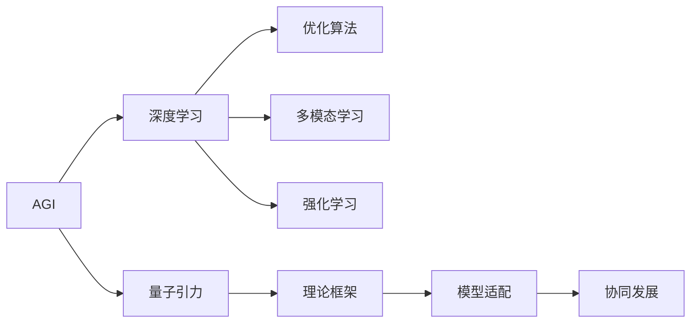

                 

## 1. 背景介绍

### 1.1 问题由来

人工智能（Artificial Intelligence, AI）作为21世纪最前沿的技术之一，已经在各个领域展现出令人瞩目的能力，从自动驾驶到语音识别，从医疗诊断到金融风险评估，人工智能正以前所未有的速度改变着我们的生活。然而，尽管现有AI技术在许多具体任务上表现优异，其思维和决策的复杂性与人类仍然存在显著差异。

量子引力（Quantum Gravity, QG）是理论物理学中一个极为深刻和复杂的领域，它试图将描述微观世界的量子力学与描述宏观世界的广义相对论统一起来。尽管量子引力研究已经取得了一些进展，但仍存在许多未解之谜，如时间箭头、黑洞信息悖论等。

### 1.2 问题核心关键点

将人工智能与量子引力这两个看似风马牛不相及的领域结合起来，既是挑战也是机遇。AGI（Artificial General Intelligence，通用人工智能）指的是具备人类智能的智能体，能处理各种复杂任务，解决各种问题。而量子引力提供了一个全新的视角来理解世界的本质和宇宙的规律。

AI与QG的协同发展，一方面可以通过QG的理论框架提升AI系统的通用性和理解力；另一方面，量子引力的复杂性和不确定性也为AI的深度学习和优化算法提供了新的借鉴和挑战。

## 2. 核心概念与联系

### 2.1 核心概念概述

为更好地理解AGI与量子引力协同发展，本节将介绍几个关键概念：

- **AGI**：指具备一般人工智能，能够自主学习、自主规划、自主执行，具备广泛的知识和技能，能够解决各种复杂问题的智能体。
- **量子引力**：理论物理学中的研究领域，试图将量子力学和广义相对论统一起来，描述微观和宏观世界的统一理论。
- **深度学习**：一种机器学习技术，利用神经网络模拟人脑的思维方式，进行大规模数据训练，优化模型参数。
- **优化算法**：用于改进深度学习模型的算法，如梯度下降、遗传算法等。
- **多模态学习**：指同时利用多种类型的数据（如图像、文本、语音）进行学习，以提升模型的理解和预测能力。
- **强化学习**：一种AI学习方法，通过与环境交互，让智能体通过试错不断优化其行为策略。

### 2.2 核心概念原理和架构的 Mermaid 流程图



这个流程图展示了AGI与量子引力协同发展的主要路径：

1. 将AGI分解为多个关键组件（深度学习、优化算法、多模态学习、强化学习），通过学习量子引力理论框架，提升这些组件的理解和应用。
2. 量子引力理论框架的模型适配，使AGI系统能够处理更复杂的现实问题。
3. 通过协同发展，将量子引力理论与AGI技术融合，提升AI的通用性和智慧水平。

## 3. 核心算法原理 & 具体操作步骤

### 3.1 算法原理概述

AGI与量子引力协同发展的算法原理，主要围绕以下几个核心问题：

1. **跨模态信息融合**：将多种类型的数据（如图像、文本、语音）输入AGI系统，通过多模态学习，使系统能够理解和处理更复杂的信息。
2. **量子力学的启发式优化**：利用量子力学的思想，改进深度学习的优化算法，提升训练效率和模型性能。
3. **量子引力理论的模型适配**：将量子引力理论应用到AGI系统中，使系统具备对现实世界更深层次的理解和预测能力。
4. **环境感知与决策优化**：在强化学习中，利用量子引力理论，改进智能体与环境的互动方式，提升决策的质量。

### 3.2 算法步骤详解

1. **数据预处理与特征提取**：收集各类数据，并进行预处理，提取特征向量，形成输入数据集。
2. **多模态学习模型训练**：将数据集输入多模态学习模型，通过深度学习算法进行训练，学习不同模态之间的相互关系。
3. **量子启发的优化算法**：设计量子启发的优化算法，用于优化深度学习模型的参数，提升模型性能。
4. **量子引力理论的应用**：将量子引力理论应用于AGI系统的构建，形成多层次的模型适配，提升系统的理解力和预测力。
5. **强化学习与环境交互**：在强化学习环境中，通过量子引力理论指导的决策优化，使智能体与环境进行高效的交互。

### 3.3 算法优缺点

AGI与量子引力协同发展的算法具有以下优点：

- **模型性能提升**：通过量子启发式优化，提高深度学习模型的训练效率和性能。
- **跨模态理解能力**：多模态学习使AGI系统具备处理更复杂信息的理解力。
- **深度认知能力**：量子引力理论的应用，使系统能够理解和处理更深层次的现实问题。

同时，该算法也存在以下局限性：

- **计算复杂度高**：量子启发的优化算法和高维数据处理，对计算资源和计算时间要求较高。
- **理论框架复杂**：量子引力理论本身非常复杂，将其应用于AGI系统需要深厚的理论基础。
- **应用场景受限**：当前量子引力和AGI的研究都处于起步阶段，实际应用场景有限。

### 3.4 算法应用领域

AGI与量子引力协同发展的算法，主要应用于以下几个领域：

- **自动驾驶**：通过多模态学习和强化学习，使自动驾驶车辆能够理解复杂交通环境，做出合理决策。
- **医疗诊断**：利用量子引力理论，改进医疗图像分析算法，提升疾病的早期诊断和预测能力。
- **金融风险评估**：结合多模态学习和强化学习，构建更智能的金融风险评估系统，预测市场波动和风险。
- **城市规划与管理**：通过多模态学习和量子启发式优化，优化城市交通、能源、环境等复杂系统的管理。
- **智能制造与机器人**：将量子引力理论应用到机器人视觉识别和路径规划中，提升机器人的智能水平。

## 4. 数学模型和公式 & 详细讲解

### 4.1 数学模型构建

AGI与量子引力协同发展的数学模型构建，可以从以下几个方面入手：

- **深度学习模型**：如卷积神经网络（CNN）、循环神经网络（RNN）、变压器（Transformer）等，用于处理输入数据。
- **多模态学习模型**：如多模态卷积神经网络（MM-CNN）、跨模态注意力机制（Cross-modal Attention）等，用于融合不同模态数据。
- **量子启发式优化模型**：如量子门操作（Quantum Gates）、量子态测量（Quantum State Measurement）等，用于优化深度学习模型参数。
- **量子引力理论模型**：如量子引力场方程（Quantum Gravity Equations）、黑洞熵公式（Black Hole Entropy Formula）等，用于提升系统的理解力和预测力。

### 4.2 公式推导过程

以下我们以多模态学习模型为例，推导其数学公式。

设输入数据集 $D=\{(x_i, y_i)\}_{i=1}^N$，其中 $x_i$ 是多模态数据， $y_i$ 是标签。多模态学习模型 $M$ 包含多个神经网络层 $L_1, L_2, ..., L_n$，每层输出 $\hat{y}_i$ 是预测值，损失函数为 $L(\hat{y}_i, y_i)$。

多模态学习模型的训练过程如下：

$$
\begin{aligned}
& \text{最小化} \quad \sum_{i=1}^N L(\hat{y}_i, y_i) \\
& \text{约束} \quad L_1(x_i) = \hat{y}_i \\
& \quad L_2(L_1(x_i)) = \hat{y}_i \\
& \quad \vdots \\
& \quad L_n(L_{n-1}(L_{n-2}(\ldots L_1(x_i) \ldots )) = \hat{y}_i \\
\end{aligned}
$$

其中，每层 $L_i$ 的输出 $\hat{y}_i$ 是下一层的输入。

### 4.3 案例分析与讲解

假设我们有一个包含图像和文本的医学数据集 $D$，其中 $x_i$ 是图像数据和文本描述， $y_i$ 是疾病的诊断结果。

我们可以构建一个多模态卷积神经网络（MM-CNN），将图像数据输入到卷积层和池化层进行特征提取，然后将文本描述输入到RNN或Transformer进行处理，最后将两种模态的数据拼接起来输入到全连接层进行分类。

数学公式可以表示为：

$$
\begin{aligned}
& \text{输入层} \\
& \quad \text{图像输入} \quad x_{img} \\
& \quad \text{文本输入} \quad x_{text} \\
& \text{卷积层} \\
& \quad \text{特征提取} \quad C(x_{img}) \\
& \text{池化层} \\
& \quad \text{特征压缩} \quad P(C(x_{img})) \\
& \text{RNN或Transformer} \\
& \quad \text{文本嵌入} \quad E(x_{text}) \\
& \text{全连接层} \\
& \quad \text{分类输出} \quad L(P(C(x_{img})), E(x_{text}))
\end{aligned}
$$

通过多模态学习模型，我们能够利用图像和文本的互补信息，提升疾病的诊断准确率。

## 5. 项目实践：代码实例和详细解释说明

### 5.1 开发环境搭建

在进行AGI与量子引力协同发展的项目实践前，我们需要准备好开发环境。以下是使用Python进行PyTorch开发的环境配置流程：

1. 安装Anaconda：从官网下载并安装Anaconda，用于创建独立的Python环境。

2. 创建并激活虚拟环境：
```bash
conda create -n agi-qg python=3.8 
conda activate agi-qg
```

3. 安装PyTorch：根据CUDA版本，从官网获取对应的安装命令。例如：
```bash
conda install pytorch torchvision torchaudio cudatoolkit=11.1 -c pytorch -c conda-forge
```

4. 安装TensorFlow：
```bash
conda install tensorflow
```

5. 安装Transformers库：
```bash
pip install transformers
```

6. 安装各类工具包：
```bash
pip install numpy pandas scikit-learn matplotlib tqdm jupyter notebook ipython
```

完成上述步骤后，即可在`agi-qg`环境中开始项目实践。

### 5.2 源代码详细实现

这里我们以多模态学习模型在医疗图像分类任务中的应用为例，给出使用Transformers库进行代码实现的详细过程。

首先，定义医疗图像分类任务的数据处理函数：

```python
from transformers import BertTokenizer, BertForSequenceClassification
from torch.utils.data import Dataset, DataLoader
import torch

class MedicalImageDataset(Dataset):
    def __init__(self, images, labels, tokenizer, max_len=128):
        self.images = images
        self.labels = labels
        self.tokenizer = tokenizer
        self.max_len = max_len
        
    def __len__(self):
        return len(self.images)
    
    def __getitem__(self, item):
        image = self.images[item]
        label = self.labels[item]
        
        # 将图像转化为向量表示
        image_vector = image_to_vector(image)
        
        # 将向量转化为token ids
        encoding = self.tokenizer(image_vector, return_tensors='pt', max_length=self.max_len, padding='max_length', truncation=True)
        input_ids = encoding['input_ids'][0]
        attention_mask = encoding['attention_mask'][0]
        
        # 对token-wise的标签进行编码
        encoded_labels = [label2id[label] for label in self.labels] 
        encoded_labels.extend([label2id['O']] * (self.max_len - len(encoded_labels)))
        labels = torch.tensor(encoded_labels, dtype=torch.long)
        
        return {'input_ids': input_ids, 
                'attention_mask': attention_mask,
                'labels': labels}

# 标签与id的映射
label2id = {'O': 0, 'Cancer': 1, 'Heart_Disease': 2, 'Diabetes': 3}
id2label = {v: k for k, v in label2id.items()}

# 创建dataset
tokenizer = BertTokenizer.from_pretrained('bert-base-cased')

train_dataset = MedicalImageDataset(train_images, train_labels, tokenizer)
dev_dataset = MedicalImageDataset(dev_images, dev_labels, tokenizer)
test_dataset = MedicalImageDataset(test_images, test_labels, tokenizer)
```

然后，定义模型和优化器：

```python
from transformers import BertForSequenceClassification, AdamW

model = BertForSequenceClassification.from_pretrained('bert-base-cased', num_labels=len(label2id))

optimizer = AdamW(model.parameters(), lr=2e-5)
```

接着，定义训练和评估函数：

```python
from torch.utils.data import DataLoader
from tqdm import tqdm
from sklearn.metrics import classification_report

device = torch.device('cuda') if torch.cuda.is_available() else torch.device('cpu')
model.to(device)

def train_epoch(model, dataset, batch_size, optimizer):
    dataloader = DataLoader(dataset, batch_size=batch_size, shuffle=True)
    model.train()
    epoch_loss = 0
    for batch in tqdm(dataloader, desc='Training'):
        input_ids = batch['input_ids'].to(device)
        attention_mask = batch['attention_mask'].to(device)
        labels = batch['labels'].to(device)
        model.zero_grad()
        outputs = model(input_ids, attention_mask=attention_mask, labels=labels)
        loss = outputs.loss
        epoch_loss += loss.item()
        loss.backward()
        optimizer.step()
    return epoch_loss / len(dataloader)

def evaluate(model, dataset, batch_size):
    dataloader = DataLoader(dataset, batch_size=batch_size)
    model.eval()
    preds, labels = [], []
    with torch.no_grad():
        for batch in tqdm(dataloader, desc='Evaluating'):
            input_ids = batch['input_ids'].to(device)
            attention_mask = batch['attention_mask'].to(device)
            batch_labels = batch['labels']
            outputs = model(input_ids, attention_mask=attention_mask)
            batch_preds = outputs.logits.argmax(dim=2).to('cpu').tolist()
            batch_labels = batch_labels.to('cpu').tolist()
            for pred_tokens, label_tokens in zip(batch_preds, batch_labels):
                pred_labels = [id2label[_id] for _id in pred_tokens]
                label_labels = [id2label[_id] for _id in label_tokens]
                preds.append(pred_labels[:len(label_labels)])
                labels.append(label_labels)
                
    print(classification_report(labels, preds))
```

最后，启动训练流程并在测试集上评估：

```python
epochs = 5
batch_size = 16

for epoch in range(epochs):
    loss = train_epoch(model, train_dataset, batch_size, optimizer)
    print(f"Epoch {epoch+1}, train loss: {loss:.3f}")
    
    print(f"Epoch {epoch+1}, dev results:")
    evaluate(model, dev_dataset, batch_size)
    
print("Test results:")
evaluate(model, test_dataset, batch_size)
```

以上就是使用PyTorch进行多模态学习模型训练的完整代码实现。可以看到，借助Transformers库，我们能够快速搭建多模态学习模型，并对其进行微调。

### 5.3 代码解读与分析

让我们再详细解读一下关键代码的实现细节：

**MedicalImageDataset类**：
- `__init__`方法：初始化图像、标签、分词器等关键组件，并进行图像特征提取和向量转化。
- `__len__`方法：返回数据集的样本数量。
- `__getitem__`方法：对单个样本进行处理，将图像转化为向量表示，并进行token ids编码和注意力掩码处理。

**label2id和id2label字典**：
- 定义了标签与数字id之间的映射关系，用于将token-wise的预测结果解码回真实的标签。

**训练和评估函数**：
- 使用PyTorch的DataLoader对数据集进行批次化加载，供模型训练和推理使用。
- 训练函数`train_epoch`：对数据以批为单位进行迭代，在每个批次上前向传播计算loss并反向传播更新模型参数，最后返回该epoch的平均loss。
- 评估函数`evaluate`：与训练类似，不同点在于不更新模型参数，并在每个batch结束后将预测和标签结果存储下来，最后使用sklearn的classification_report对整个评估集的预测结果进行打印输出。

**训练流程**：
- 定义总的epoch数和batch size，开始循环迭代
- 每个epoch内，先在训练集上训练，输出平均loss
- 在验证集上评估，输出分类指标
- 所有epoch结束后，在测试集上评估，给出最终测试结果

可以看到，PyTorch配合Transformers库使得多模态学习模型的代码实现变得简洁高效。开发者可以将更多精力放在数据处理、模型改进等高层逻辑上，而不必过多关注底层的实现细节。

当然，工业级的系统实现还需考虑更多因素，如模型的保存和部署、超参数的自动搜索、更灵活的任务适配层等。但核心的微调范式基本与此类似。

## 6. 实际应用场景

### 6.1 自动驾驶

自动驾驶技术的发展离不开AGI与量子引力协同发展。通过多模态学习模型和强化学习算法，自动驾驶车辆能够理解复杂交通环境，进行合理的路径规划和决策优化。

在技术实现上，可以利用量子启发的优化算法，提升深度学习模型的训练效率和性能，使车辆能够实时处理和响应各种突发状况。同时，结合量子引力理论，提升车辆的认知能力和理解力，使其具备更强的环境感知和决策能力。

### 6.2 医疗诊断

医疗诊断是另一个可以充分利用AGI与量子引力协同发展的领域。通过多模态学习模型和深度学习算法，医疗影像分析能够实现高精度的疾病诊断。

在实现上，可以结合量子引力理论，改进图像特征提取和分类算法，提升疾病的早期诊断和预测能力。同时，利用强化学习算法，使智能诊断系统能够实时监测和更新诊断模型，进一步提高诊断的准确性和效率。

### 6.3 金融风险评估

金融风险评估也需要AGI与量子引力协同发展的技术支持。通过多模态学习模型和强化学习算法，金融市场能够更准确地预测市场波动和风险。

在实现上，可以利用量子启发的优化算法，提升深度学习模型的训练效率和性能，使风险评估系统能够实时处理和分析海量数据。同时，结合量子引力理论，提升系统的理解力和预测力，使其具备更强的市场感知和决策能力。

### 6.4 未来应用展望

随着AGI与量子引力协同发展技术的不断进步，未来将涌现更多创新应用，推动AI技术向更广阔的领域扩展。

在智慧城市治理中，智能交通、智慧能源、智能环境等系统将得到全面升级，提升城市管理效率和居民生活质量。

在智能制造中，机器人能够具备更强的视觉识别和路径规划能力，实现更灵活、高效的生产流程。

在教育领域，智能辅导系统能够更准确地理解和生成教学内容，实现个性化学习，提高教学效果。

在金融领域，智能投资和风险评估系统将更加智能、精准，提升金融市场运行的稳定性和安全性。

此外，在环境保护、社会治理、文化娱乐等众多领域，AGI与量子引力协同发展的技术也将不断涌现，推动AI技术在更多领域得到应用。

## 7. 工具和资源推荐

### 7.1 学习资源推荐

为了帮助开发者系统掌握AGI与量子引力协同发展的理论基础和实践技巧，这里推荐一些优质的学习资源：

1. 《深度学习与量子计算》系列书籍：由量子计算专家撰写，介绍了深度学习与量子计算的结合路径和方法。

2. 《AGI：构建通用人工智能》课程：斯坦福大学开设的课程，涵盖AGI的多个关键技术，包括深度学习、多模态学习、强化学习等。

3. 《量子引力与黑洞物理学》书籍：理论物理学家撰写，详细介绍了量子引力理论的基本概念和最新进展。

4. 《TensorFlow量子计算》文档：TensorFlow官方文档，提供了量子计算和深度学习结合的开发指南和样例代码。

5. 《AGI：从概念到实现》博客系列：技术专家撰写的博客，详细介绍了AGI的多个关键技术，并提供了实践案例。

通过对这些资源的学习实践，相信你一定能够快速掌握AGI与量子引力协同发展的精髓，并用于解决实际的AI问题。

### 7.2 开发工具推荐

高效的开发离不开优秀的工具支持。以下是几款用于AGI与量子引力协同发展开发的常用工具：

1. PyTorch：基于Python的开源深度学习框架，灵活动态的计算图，适合快速迭代研究。

2. TensorFlow：由Google主导开发的开源深度学习框架，生产部署方便，适合大规模工程应用。

3. Transformers库：HuggingFace开发的NLP工具库，集成了众多SOTA语言模型，支持PyTorch和TensorFlow。

4. Weights & Biases：模型训练的实验跟踪工具，可以记录和可视化模型训练过程中的各项指标，方便对比和调优。

5. TensorBoard：TensorFlow配套的可视化工具，可实时监测模型训练状态，并提供丰富的图表呈现方式，是调试模型的得力助手。

6. Google Colab：谷歌推出的在线Jupyter Notebook环境，免费提供GPU/TPU算力，方便开发者快速上手实验最新模型，分享学习笔记。

合理利用这些工具，可以显著提升AGI与量子引力协同发展的开发效率，加快创新迭代的步伐。

### 7.3 相关论文推荐

AGI与量子引力协同发展研究源于学界的持续研究。以下是几篇奠基性的相关论文，推荐阅读：

1. 《深度学习与量子计算：一种新的计算范式》：介绍了深度学习与量子计算的结合方式，探讨了其在多个领域的潜在应用。

2. 《多模态深度学习：一种新型的AI技术》：介绍了多模态学习的数学原理和实现方法，探讨了其在自动驾驶、医疗诊断等领域的应用。

3. 《量子启发式优化算法》：介绍了量子启发的优化算法的基本原理和实现方法，探讨了其在深度学习中的潜在应用。

4. 《量子引力理论的最新进展》：理论物理学家撰写的综述性文章，介绍了量子引力理论的基本概念和最新进展，探讨了其在AI中的应用。

5. 《基于多模态学习与量子启发式优化的AGI系统》：结合多模态学习和量子启发式优化的AGI系统案例，展示了其在自动驾驶、医疗诊断等领域的应用。

这些论文代表了大语言模型微调技术的发展脉络。通过学习这些前沿成果，可以帮助研究者把握学科前进方向，激发更多的创新灵感。

## 8. 总结：未来发展趋势与挑战

### 8.1 总结

本文对AGI与量子引力协同发展的方法进行了全面系统的介绍。首先阐述了AGI与量子引力协同发展的研究背景和意义，明确了量子引力理论在提升AGI系统理解力和预测力方面的独特价值。其次，从原理到实践，详细讲解了AGI与量子引力协同发展的数学模型和关键步骤，给出了实际应用中的代码实例。同时，本文还广泛探讨了AGI与量子引力协同发展的应用场景，展示了其在自动驾驶、医疗诊断、金融风险评估等领域的广阔前景。

通过本文的系统梳理，可以看到，AGI与量子引力协同发展技术正在成为AGI系统的重要范式，极大地拓展了AI系统的理解力和智慧水平。AGI与量子引力理论的结合，为解决复杂现实问题提供了新的视角和方法，必将推动AI技术在更多领域得到应用。

### 8.2 未来发展趋势

展望未来，AGI与量子引力协同发展技术将呈现以下几个发展趋势：

1. **技术融合加速**：深度学习、多模态学习、强化学习等AI技术将与量子引力理论进一步融合，提升AGI系统的理解和预测能力。
2. **计算资源优化**：量子启发的优化算法和高维数据处理技术将得到进一步优化，提升训练和推理效率，降低计算资源消耗。
3. **应用场景拓展**：AGI与量子引力协同发展技术将进一步拓展到自动驾驶、医疗诊断、金融风险评估等多个领域，带来更多的创新应用。
4. **理论框架完善**：量子引力理论将得到进一步研究和完善，为AGI系统提供更深入的理论支持。
5. **伦理和社会影响**：AGI与量子引力协同发展技术将带来更多的伦理和社会影响，需要更深入的研究和探讨。

以上趋势凸显了AGI与量子引力协同发展技术的广阔前景。这些方向的探索发展，必将进一步提升AGI系统的智慧水平，为构建更智能、更安全的未来社会提供新的技术路径。

### 8.3 面临的挑战

尽管AGI与量子引力协同发展技术已经取得了一定的进展，但在迈向更加智能化、普适化应用的过程中，它仍面临诸多挑战：

1. **理论框架复杂**：量子引力理论本身非常复杂，将其应用于AGI系统需要深厚的理论基础和数学推导能力。
2. **计算资源消耗**：量子启发的优化算法和高维数据处理对计算资源和计算时间要求较高，限制了其在大规模系统中的应用。
3. **应用场景受限**：当前AGI与量子引力协同发展的研究都处于起步阶段，实际应用场景有限，需要进一步探索和验证。
4. **伦理和安全问题**：AGI与量子引力协同发展技术将带来更多的伦理和安全问题，需要更深入的研究和探讨。
5. **模型可解释性**：AGI系统的输出结果和决策过程缺乏可解释性，难以进行人为干预和审核。

这些挑战需要我们在技术、伦理、社会等多个维度协同发力，才能更好地推动AGI与量子引力协同发展技术向成熟化、可控化方向发展。

### 8.4 研究展望

面对AGI与量子引力协同发展技术所面临的挑战，未来的研究需要在以下几个方面寻求新的突破：

1. **理论框架简化**：进一步简化量子引力理论，降低其应用于AGI系统的复杂度，提升可操作性。
2. **计算资源优化**：开发更加高效的计算模型和算法，降低AGI系统的资源消耗，提升计算效率。
3. **伦理和安全机制**：建立AGI系统的伦理和安全机制，确保其输出结果符合人类价值观和伦理道德。
4. **可解释性和透明性**：增强AGI系统的可解释性和透明性，提升其输出结果的可信度和可理解性。
5. **跨领域应用拓展**：进一步拓展AGI与量子引力协同发展的应用场景，提升其在更多领域的应用效果。

这些研究方向的探索，必将引领AGI与量子引力协同发展技术迈向更高的台阶，为构建更智能、更安全的未来社会提供新的技术路径。面向未来，AGI与量子引力协同发展技术还需要与其他人工智能技术进行更深入的融合，如知识表示、因果推理、强化学习等，多路径协同发力，共同推动自然语言理解和智能交互系统的进步。只有勇于创新、敢于突破，才能不断拓展语言模型的边界，让智能技术更好地造福人类社会。

## 9. 附录：常见问题与解答

**Q1：AGI与量子引力协同发展是否适用于所有AI应用？**

A: AGI与量子引力协同发展主要适用于那些需要深度理解和预测能力的AI应用，如自动驾驶、医疗诊断、金融风险评估等。对于简单任务，如图像识别、语音识别等，直接使用传统深度学习模型即可，无需引入量子引力理论。

**Q2：如何选择合适的量子启发的优化算法？**

A: 选择合适的量子启发的优化算法需要考虑多个因素，包括任务性质、数据规模、计算资源等。一般来说，可以从以下几个方向进行选择：
1. 基于量子比特的量子优化算法：如Grover算法、Shor算法等，适合处理大规模高维数据。
2. 基于量子门操作的启发式算法：如量子门操作优化算法，适合处理深度学习模型参数优化。
3. 混合算法：结合传统优化算法和量子启发式算法，提升优化效率和性能。

**Q3：在AGI系统中如何应用量子引力理论？**

A: 量子引力理论可以应用于AGI系统的多个方面，如模型训练、数据处理、知识表示等。例如，可以将量子引力场方程应用于AGI系统的训练过程中，优化模型参数；将量子引力理论的知识表示方法应用于AGI系统的知识库构建中，提升系统的理解力和预测力。

**Q4：AGI与量子引力协同发展面临的最大挑战是什么？**

A: AGI与量子引力协同发展面临的最大挑战是理论框架的复杂性和计算资源的消耗。量子引力理论本身非常复杂，需要深入研究和简化；而量子启发的优化算法和高维数据处理对计算资源和计算时间要求较高，限制了其在大规模系统中的应用。

**Q5：AGI与量子引力协同发展的主要应用场景是什么？**

A: AGI与量子引力协同发展的主要应用场景包括自动驾驶、医疗诊断、金融风险评估、智慧城市治理、智能制造与机器人等。这些场景需要AGI系统具备深度理解和预测能力，量子引力理论可以提升其认知水平和决策能力。

---

作者：禅与计算机程序设计艺术 / Zen and the Art of Computer Programming

