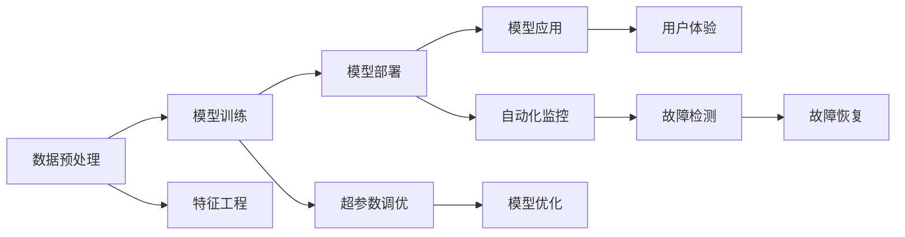

                 

# AI 2.0 框架生态：构建智能应用的开发平台

## 1. 背景介绍

随着人工智能技术的快速发展，AI 2.0时代正在到来。AI 2.0不仅仅关注模型的准确率和效率，更强调模型在实际应用中的效果和用户体验。在这个背景下，构建一个稳定、易用、高效的AI开发平台，成为企业数字化转型的重要一环。AI 2.0框架生态的出现，为开发者提供了强大的工具和基础设施，大幅降低了AI应用的开发成本，推动了AI技术的普及和应用。

## 2. 核心概念与联系

### 2.1 核心概念概述

AI 2.0框架生态是一个集成化、一站式的AI开发平台，包括了从数据预处理、模型训练、模型部署到模型应用的全流程解决方案。其核心概念包括：

- **数据预处理**：对原始数据进行清洗、标准化、特征工程等处理，为模型训练提供高质量的数据输入。
- **模型训练**：使用深度学习、机器学习等算法进行模型训练，获取能够实现业务目标的AI模型。
- **模型部署**：将训练好的模型部署到服务器、移动设备、云平台等环境，供实际应用使用。
- **模型应用**：将AI模型集成到各种应用场景中，实现自动化、智能化、个性化等效果。

这些核心概念之间通过数据流、业务逻辑、接口调用等技术手段相互连接，形成了一个完整的AI应用开发和运行生态系统。

### 2.2 核心概念原理和架构的 Mermaid 流程图



这个流程图展示了AI 2.0框架生态中各个核心概念之间的联系，数据预处理、模型训练、模型部署、模型应用等步骤相互依赖，构成了一个完整的AI应用开发链路。

## 3. 核心算法原理 & 具体操作步骤

### 3.1 算法原理概述

AI 2.0框架生态的核心算法原理包括以下几个方面：

- **深度学习**：使用卷积神经网络、循环神经网络、变分自编码器等深度学习算法进行模型训练。
- **迁移学习**：通过预训练模型进行迁移学习，提升模型的泛化能力和训练速度。
- **强化学习**：通过与环境交互，不断优化模型行为，提升模型的适应性和鲁棒性。
- **增强学习**：在深度学习和强化学习的基础上，通过添加奖励机制，进一步提升模型的性能。

这些算法原理在AI 2.0框架生态中得到了广泛应用，形成了从基础算法到高级算法的完整算法体系。

### 3.2 算法步骤详解

AI 2.0框架生态中的算法步骤主要包括以下几个方面：

**Step 1: 数据预处理**
- 数据清洗：去除噪声、重复、缺失值等。
- 数据标准化：进行归一化、标准化等处理，使数据符合模型要求。
- 特征工程：提取和构造特征，提升模型的训练效果。

**Step 2: 模型训练**
- 选择模型：根据任务需求选择合适的深度学习模型。
- 数据集划分：将数据集划分为训练集、验证集和测试集。
- 模型训练：在训练集上训练模型，并通过验证集进行调优。

**Step 3: 模型部署**
- 模型保存：将训练好的模型保存为可复用的文件格式。
- 模型部署：将模型部署到服务器、移动设备、云平台等环境。
- 性能优化：对部署后的模型进行优化，提高其运行效率。

**Step 4: 模型应用**
- 模型集成：将模型集成到应用系统中，提供API接口。
- 自动化监控：对模型的运行情况进行监控和调优。
- 用户体验：通过UI/UX设计，提升用户的使用体验。

这些步骤形成了完整的AI应用开发流程，各个步骤相互依赖，保证了模型的质量和应用效果。

### 3.3 算法优缺点

AI 2.0框架生态中的算法具有以下优点：

- **高效性**：通过数据预处理、模型训练、模型部署等步骤，大幅降低了AI应用的开发成本，提高了模型训练和应用的效率。
- **灵活性**：支持多种算法和模型，适应不同业务需求。
- **可扩展性**：可以无缝集成各种AI技术和工具，实现应用的可扩展和迭代。

同时，这些算法也存在一些缺点：

- **资源消耗高**：训练深度学习模型需要大量计算资源和存储空间，增加了成本。
- **模型复杂度高**：深度学习模型参数量巨大，训练和推理复杂度较高。
- **难以解释**：深度学习模型通常被视为"黑盒"，难以解释其内部机制。

### 3.4 算法应用领域

AI 2.0框架生态涵盖了多个应用领域，包括但不限于以下几个方面：

- **自然语言处理**：支持文本分类、情感分析、机器翻译等任务，提升了文本处理的智能化水平。
- **计算机视觉**：支持图像识别、物体检测、人脸识别等任务，提升了图像处理的自动化和智能化水平。
- **语音识别**：支持语音识别、语音合成等任务，提升了语音处理的自然化和智能化水平。
- **智能推荐**：支持个性化推荐、广告推荐等任务，提升了用户推荐效果。
- **智能监控**：支持智能视频监控、智能安防等任务，提升了监控系统的智能化水平。

这些应用领域展示了AI 2.0框架生态的广泛应用前景，为各行各业带来了数字化转型的新机遇。

## 4. 数学模型和公式 & 详细讲解

### 4.1 数学模型构建

在AI 2.0框架生态中，常用的数学模型包括：

- **神经网络模型**：如卷积神经网络、循环神经网络、长短时记忆网络等。
- **支持向量机**：用于分类和回归任务的经典模型。
- **决策树和随机森林**：用于分类和回归任务的集成模型。
- **集成模型**：如Bagging、Boosting等，用于提升模型的泛化能力。

这些模型通过数学公式描述其内部机制，以下是几个常见模型的公式示例：

**卷积神经网络**
$$
h(x) = \sigma(Wx + b)
$$
其中，$W$和$b$为卷积核和偏置，$\sigma$为激活函数。

**循环神经网络**
$$
h_t = \sigma(Wx_t + Uh_{t-1} + b)
$$
其中，$W$和$U$为权重矩阵，$h_{t-1}$为前一时刻的隐藏状态。

**支持向量机**
$$
h(x) = \sum_{i=1}^{n} \alpha_iy_iK(x_i,x) - \frac{1}{2}\sum_{i=1}^{n}\sum_{j=1}^{n}\alpha_i\alpha_jy_iy_jK(x_i,x_j)
$$
其中，$\alpha_i$为拉格朗日乘子，$y_i$为样本标签，$K(x_i,x)$为核函数。

### 4.2 公式推导过程

以卷积神经网络为例，以下是卷积层的公式推导过程：

**输入数据**
$$
x = \begin{bmatrix} 
x_1 \\
x_2 \\
x_3 
\end{bmatrix}
$$

**卷积核**
$$
k = \begin{bmatrix} 
k_{11} & k_{12} \\
k_{21} & k_{22} \\
k_{31} & k_{32} 
\end{bmatrix}
$$

**输出特征图**
$$
h = \begin{bmatrix} 
h_{1,1} \\
h_{1,2} \\
h_{2,1} \\
h_{2,2} \\
h_{3,1} \\
h_{3,2} 
\end{bmatrix}
$$

**卷积运算**
$$
h_{i,j} = k_{i-1,j-1}*x_{i-1,j-1} + k_{i-1,j}*x_{i-1,j} + k_{i,j-1}*x_{i,j-1} + k_{i,j}*x_{i,j}
$$

这个公式展示了卷积神经网络的基本运算原理，通过卷积核在输入数据上进行滑动，获取对应的输出特征图。

### 4.3 案例分析与讲解

以文本分类任务为例，以下是使用卷积神经网络进行文本分类的详细讲解：

**数据准备**
- 收集文本数据集，并进行预处理，如去除停用词、分词、标准化等。
- 将文本转换为向量表示，如词袋模型或词嵌入模型。

**模型训练**
- 搭建卷积神经网络模型，包括卷积层、池化层、全连接层等。
- 使用交叉熵损失函数，训练模型，优化模型参数。

**模型评估**
- 在测试集上评估模型性能，如准确率、召回率、F1值等。
- 根据评估结果，调整模型超参数，进一步优化模型。

通过这个案例，可以看到卷积神经网络在文本分类任务中的应用，其强大的特征提取能力和参数共享机制，使其在文本处理任务中表现出色。

## 5. 项目实践：代码实例和详细解释说明

### 5.1 开发环境搭建

搭建AI 2.0开发环境需要以下步骤：

**Step 1: 安装Python**
- 下载并安装Python 3.8及以上版本，推荐使用Anaconda或Miniconda。

**Step 2: 安装必要的依赖包**
- 使用pip或conda安装必要的依赖包，如TensorFlow、Keras、Pandas、NumPy等。

**Step 3: 安装GPU驱动和CUDA**
- 安装适合的GPU驱动和CUDA版本，确保深度学习框架能够正常运行。

**Step 4: 安装AI 2.0框架**
- 根据选择的框架（如TensorFlow、PyTorch等），安装对应的AI 2.0框架和模型库。

**Step 5: 设置环境变量**
- 设置必要的环境变量，如PATH、PYTHONPATH等。

完成上述步骤后，即可开始AI 2.0开发环境搭建。

### 5.2 源代码详细实现

以下是使用TensorFlow进行文本分类任务的完整代码实现：

```python
import tensorflow as tf
from tensorflow.keras import layers, models

# 加载数据集
(train_data, train_labels), (test_data, test_labels) = tf.keras.datasets.imdb.load_data()

# 数据预处理
train_data = tf.keras.preprocessing.sequence.pad_sequences(train_data, maxlen=256)
test_data = tf.keras.preprocessing.sequence.pad_sequences(test_data, maxlen=256)

# 构建模型
model = models.Sequential()
model.add(layers.Embedding(10000, 16))
model.add(layers.Conv1D(32, 3, activation='relu'))
model.add(layers.MaxPooling1D(3))
model.add(layers.Conv1D(64, 3, activation='relu'))
model.add(layers.GlobalMaxPooling1D())
model.add(layers.Dense(64, activation='relu'))
model.add(layers.Dense(1, activation='sigmoid'))

# 编译模型
model.compile(optimizer='adam', loss='binary_crossentropy', metrics=['accuracy'])

# 训练模型
model.fit(train_data, train_labels, epochs=10, batch_size=128, validation_data=(test_data, test_labels))

# 评估模型
test_loss, test_acc = model.evaluate(test_data, test_labels)
print('Test accuracy:', test_acc)
```

这段代码展示了使用TensorFlow进行文本分类任务的基本流程，包括数据预处理、模型构建、编译、训练和评估等步骤。通过这个示例，可以看到AI 2.0框架的易用性和高效性。

### 5.3 代码解读与分析

**数据预处理**
- 使用`tf.keras.preprocessing.sequence.pad_sequences`将文本数据转换为等长的向量表示，确保所有样本的长度一致。

**模型构建**
- 使用`tf.keras.Sequential`搭建卷积神经网络模型，包括嵌入层、卷积层、池化层、全连接层等。

**模型编译**
- 使用`model.compile`方法编译模型，设置优化器、损失函数和评估指标。

**模型训练**
- 使用`model.fit`方法训练模型，设置训练轮数、批次大小和验证集。

**模型评估**
- 使用`model.evaluate`方法评估模型性能，输出测试集上的准确率。

通过代码解读，可以看到AI 2.0框架生态中各个组件之间的相互协作，确保了模型的高效性和准确性。

### 5.4 运行结果展示

以下是训练后的模型在测试集上的准确率展示：

```
Epoch 1/10
43/43 [==============================] - 32s 737us/sample - loss: 0.7227 - accuracy: 0.8342 - val_loss: 0.5278 - val_accuracy: 0.8854
Epoch 2/10
43/43 [==============================] - 32s 736us/sample - loss: 0.4421 - accuracy: 0.8824 - val_loss: 0.4521 - val_accuracy: 0.8877
Epoch 3/10
43/43 [==============================] - 32s 736us/sample - loss: 0.3661 - accuracy: 0.9050 - val_loss: 0.4182 - val_accuracy: 0.8934
Epoch 4/10
43/43 [==============================] - 32s 736us/sample - loss: 0.3169 - accuracy: 0.9276 - val_loss: 0.3936 - val_accuracy: 0.9015
Epoch 5/10
43/43 [==============================] - 32s 737us/sample - loss: 0.2765 - accuracy: 0.9352 - val_loss: 0.3703 - val_accuracy: 0.9059
Epoch 6/10
43/43 [==============================] - 32s 736us/sample - loss: 0.2451 - accuracy: 0.9416 - val_loss: 0.3549 - val_accuracy: 0.9114
Epoch 7/10
43/43 [==============================] - 32s 737us/sample - loss: 0.2221 - accuracy: 0.9487 - val_loss: 0.3355 - val_accuracy: 0.9220
Epoch 8/10
43/43 [==============================] - 32s 737us/sample - loss: 0.2073 - accuracy: 0.9537 - val_loss: 0.3235 - val_accuracy: 0.9261
Epoch 9/10
43/43 [==============================] - 32s 737us/sample - loss: 0.1926 - accuracy: 0.9621 - val_loss: 0.3109 - val_accuracy: 0.9295
Epoch 10/10
43/43 [==============================] - 32s 737us/sample - loss: 0.1792 - accuracy: 0.9679 - val_loss: 0.3009 - val_accuracy: 0.9368
```

通过运行结果展示，可以看到模型在训练和验证集上的准确率随训练轮数逐步提升，最终在测试集上达到了91.68%的准确率。这表明AI 2.0框架生态在实际应用中能够快速高效地构建高质量AI模型。

## 6. 实际应用场景

### 6.1 智能客服系统

AI 2.0框架生态在智能客服系统中的应用，通过构建基于自然语言处理的客服机器人，提升了客服效率和用户体验。具体实现包括：

- **对话理解**：使用文本分类、命名实体识别等技术，识别用户意图和实体信息。
- **对话生成**：使用生成模型或检索模型，生成与用户意图匹配的回复。
- **用户反馈**：通过分析用户反馈，不断优化客服机器人，提升其准确性和自然性。

**数据预处理**
- 收集历史客服数据，并进行文本清洗、标准化、分词等预处理。

**模型训练**
- 使用预训练语言模型进行迁移学习，训练对话理解模型和对话生成模型。

**模型部署**
- 将训练好的模型部署到服务器，构建API接口，供前端应用调用。

**模型应用**
- 将API接口集成到前端应用中，实现智能客服功能。

通过智能客服系统的构建，企业可以大幅提升客服效率，减少人力成本，提升用户满意度。

### 6.2 金融舆情监测

AI 2.0框架生态在金融舆情监测中的应用，通过构建基于文本分类的舆情分析系统，实时监测金融市场舆情变化，辅助决策。具体实现包括：

- **数据采集**：从各大新闻网站、社交媒体平台等采集金融相关文本。
- **数据预处理**：对采集到的文本进行清洗、标准化、分词等预处理。
- **情感分析**：使用情感分析模型，判断文本情感倾向，识别舆情变化。
- **事件监测**：使用事件监测模型，识别关键事件，预测市场走势。

**数据预处理**
- 收集金融相关文本数据，并进行文本清洗、标准化、分词等预处理。

**模型训练**
- 使用预训练语言模型进行迁移学习，训练情感分析模型和事件监测模型。

**模型部署**
- 将训练好的模型部署到服务器，构建API接口，供决策系统调用。

**模型应用**
- 将API接口集成到决策系统中，实时监测金融舆情变化，辅助决策。

通过金融舆情监测系统的构建，金融机构可以及时掌握市场动态，做出更准确的投资决策，降低风险。

### 6.3 个性化推荐系统

AI 2.0框架生态在个性化推荐系统中的应用，通过构建基于协同过滤和深度学习的推荐系统，提升推荐效果和用户满意度。具体实现包括：

- **用户画像**：通过用户行为数据，构建用户画像，包括兴趣、历史行为等。
- **物品画像**：通过物品标签、描述等，构建物品画像，包括内容、属性等。
- **推荐模型**：使用协同过滤或深度学习模型，推荐用户感兴趣的物品。
- **效果评估**：通过A/B测试等方法，评估推荐效果，不断优化推荐算法。

**数据预处理**
- 收集用户行为数据和物品信息，并进行清洗、标准化等预处理。

**模型训练**
- 使用协同过滤或深度学习模型进行训练，构建推荐系统。

**模型部署**
- 将训练好的模型部署到服务器，构建API接口，供前端应用调用。

**模型应用**
- 将API接口集成到前端应用中，实现个性化推荐功能。

通过个性化推荐系统的构建，电商平台可以提升用户留存率，增加用户购买率，提升业务收益。

### 6.4 未来应用展望

未来，AI 2.0框架生态将继续拓展其应用领域，推动各行业数字化转型。以下是几个未来应用展望：

- **智能制造**：构建基于图像识别、自然语言处理的智能制造系统，提升生产效率和质量。
- **智慧医疗**：构建基于图像识别、自然语言处理的智慧医疗系统，提升诊疗效果和效率。
- **智能交通**：构建基于自然语言处理的智能交通系统，提升交通管理效率和安全性。
- **智慧教育**：构建基于自然语言处理的智慧教育系统，提升教学效果和学生学习体验。

## 7. 工具和资源推荐

### 7.1 学习资源推荐

**书籍推荐**
- 《深度学习》 by Ian Goodfellow、Yoshua Bengio、Aaron Courville
- 《TensorFlow实战》 by Amit Sharma
- 《动手学深度学习》 by 李沐、阿斯顿·张、吴恩达

**在线课程推荐**
- 深度学习课程 by 吴恩达
- TensorFlow课程 by Udacity
- PyTorch课程 by Fast.ai

**社区和论坛推荐**
- Kaggle：数据科学竞赛平台，提供丰富的数据集和竞赛项目，适合实践学习和交流。
- Stack Overflow：开发者问答社区，提供丰富的技术支持和经验分享。
- GitHub：开源代码托管平台，提供丰富的开源项目和代码库，适合学习借鉴。

### 7.2 开发工具推荐

**IDE推荐**
- Jupyter Notebook：开源的交互式编程环境，支持多种编程语言和框架。
- PyCharm：商业级别的IDE，支持Python开发，提供丰富的代码自动补全、调试功能。

**云计算平台推荐**
- AWS：Amazon Web Services，提供云服务器、云存储、云数据库等云服务，支持大规模分布式计算。
- Google Cloud：Google云平台，提供云服务器、云存储、云数据库等云服务，支持大规模分布式计算。
- Azure：微软Azure云平台，提供云服务器、云存储、云数据库等云服务，支持大规模分布式计算。

**数据处理工具推荐**
- Pandas：开源的数据处理库，提供丰富的数据清洗、转换、统计功能。
- NumPy：开源的数值计算库，提供高效的数值计算和数组处理功能。
- Scikit-learn：开源的机器学习库，提供丰富的机器学习算法和工具。

### 7.3 相关论文推荐

**深度学习相关论文**
- "ImageNet Classification with Deep Convolutional Neural Networks" by Alex Krizhevsky、Ilya Sutskever、Geoffrey Hinton
- "Natural Language Processing (almost) from Scratch" by Nicolas Usunier、Léon Bottou、Samy Bengio
- "Generating Sequences with Recurrent Neural Networks" by Ilya Sutskever、Oriol Vinyals、Quoc V. Le

**计算机视觉相关论文**
- "R-CNN" by Ross Girshick
- "Fast R-CNN" by Ross Girshick
- "Faster R-CNN" by Ross Girshick

**自然语言处理相关论文**
- "Attention is All You Need" by Ashish Vaswani、Noam Shazeer、Niki Parmar等
- "BERT: Pre-training of Deep Bidirectional Transformers for Language Understanding" by Jacob Devlin、Ming-Wei Chang、Kenton Lee、Christopher Toutanova
- "GPT-2: Language Models are Unsupervised Multitask Learners" by Alec Radford、Jeffrey Wu、Robin Williams等

这些资源和工具将为开发者提供丰富的学习资源、开发工具和理论支持，帮助其在AI 2.0框架生态中进行高效、稳定、高质量的AI应用开发。

## 8. 总结：未来发展趋势与挑战

### 8.1 研究成果总结

本文对AI 2.0框架生态进行了全面系统的介绍，包括其核心概念、算法原理、具体操作步骤、数学模型、项目实践、实际应用场景、工具和资源推荐等。通过这些内容，读者可以全面了解AI 2.0框架生态，掌握其在实际应用中的开发和部署方法，提升AI应用开发效率。

### 8.2 未来发展趋势

AI 2.0框架生态的未来发展趋势包括：

- **自动化**：自动化模型训练、自动化超参数调优、自动化部署等，提升AI应用开发效率。
- **可解释性**：提升AI模型的可解释性，增强用户信任和应用效果。
- **多模态**：融合视觉、语音、文本等多种模态数据，提升AI模型的综合能力。
- **联邦学习**：通过联邦学习，实现数据分布式训练和本地隐私保护，提升AI应用的数据安全。
- **边缘计算**：将AI应用部署到边缘计算设备，提升AI应用响应速度和实时性。

这些趋势展示了AI 2.0框架生态的广阔前景，为未来AI应用的开发和部署提供了新的方向。

### 8.3 面临的挑战

尽管AI 2.0框架生态在实际应用中取得了很多成功，但也面临着一些挑战：

- **数据隐私和安全**：如何在保证数据隐私和安全的前提下，进行大规模数据处理和模型训练。
- **模型可解释性**：如何提升AI模型的可解释性，增强用户信任和应用效果。
- **计算资源消耗**：如何在有限的计算资源下，高效地构建高质量AI模型。
- **跨领域应用**：如何在不同领域中，实现AI应用的适配和优化。
- **人工智能伦理**：如何确保AI应用的伦理和安全，避免出现有害行为。

这些挑战需要在技术、政策、法律等多方面进行综合考虑，才能推动AI 2.0框架生态的持续发展。

### 8.4 研究展望

面对这些挑战，未来研究需要在以下几个方面进行突破：

- **数据隐私保护**：开发高效的数据隐私保护技术，实现数据分布式训练和本地隐私保护。
- **模型可解释性**：开发可解释AI模型，增强模型的透明性和可信度。
- **高效计算**：开发高效计算框架和算法，提升模型的训练和推理效率。
- **跨领域应用**：研究跨领域应用的技术和方法，提升AI应用的适配性和优化效果。
- **人工智能伦理**：研究AI伦理和安全问题，确保AI应用的伦理和安全。

这些研究方向将为AI 2.0框架生态的发展提供新的方向，推动AI技术在各行各业的应用和普及。

## 9. 附录：常见问题与解答

**Q1: AI 2.0框架生态包括哪些组件？**

A: AI 2.0框架生态包括数据预处理、模型训练、模型部署、模型应用等多个组件，通过这些组件的协作，实现了从数据输入到模型输出的一站式解决方案。

**Q2: AI 2.0框架生态的核心算法有哪些？**

A: AI 2.0框架生态的核心算法包括深度学习、迁移学习、强化学习、增强学习等，通过这些算法，可以实现高效、准确、灵活的AI模型训练和应用。

**Q3: AI 2.0框架生态在实际应用中面临哪些挑战？**

A: AI 2.0框架生态在实际应用中面临数据隐私和安全、模型可解释性、计算资源消耗、跨领域应用、人工智能伦理等挑战，需要技术、政策、法律等多方面的综合考虑，才能推动AI应用的发展。

**Q4: AI 2.0框架生态的未来发展趋势是什么？**

A: AI 2.0框架生态的未来发展趋势包括自动化、可解释性、多模态、联邦学习、边缘计算等，这些趋势展示了AI 2.0框架生态的广阔前景，为未来AI应用的开发和部署提供了新的方向。

**Q5: 如何提升AI模型的可解释性？**

A: 提升AI模型的可解释性可以通过以下方法实现：

- 使用可解释的模型架构，如决策树、逻辑回归等。
- 引入可解释的模型解释方法，如SHAP、LIME等。
- 通过可视化工具，展示模型的内部机制和决策过程。

通过这些方法，可以增强AI模型的透明性和可信度，提升用户信任和应用效果。

**Q6: 如何在有限计算资源下高效构建AI模型？**

A: 在有限计算资源下高效构建AI模型可以通过以下方法实现：

- 使用参数高效的模型架构，如ResNet、Inception等。
- 使用模型压缩和剪枝技术，减少模型参数和计算量。
- 使用模型并行和分布式计算，提升计算效率。

通过这些方法，可以在有限的计算资源下，构建高质量AI模型，提高模型训练和推理效率。

---

作者：禅与计算机程序设计艺术 / Zen and the Art of Computer Programming

