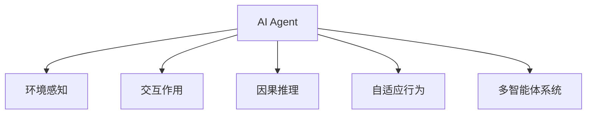

                 

# AI Agent: AI的下一个风口 具身认知理论的重要性

> 关键词：AI Agent,具身认知理论,智能体,环境感知,交互作用,因果推理,自适应行为,多智能体系统

## 1. 背景介绍

随着人工智能(AI)技术的发展，AI Agent（人工智能代理）正逐渐成为新的研究热点。与传统的基于符号和规则的专家系统不同，AI Agent能够在复杂多变的环境中进行自主决策和智能交互，为众多领域提供了智能化的解决方案。然而，当前的AI Agent仍存在诸多限制，如缺乏环境感知能力、行为简单、难以进行跨领域迁移等。本文将探讨具身认知理论在AI Agent研究中的应用，以期为AI Agent的下一波发展提供新的思路和方法。

### 1.1 问题由来
在早期的AI研究中，专家系统和规则引擎占据主导地位，这些系统往往依赖于人工编写的知识库和逻辑规则，难以在复杂、动态的环境中进行有效决策。随着深度学习和大数据技术的崛起，基于神经网络的AI Agent开始崭露头角，展示了在处理不确定性和噪声数据方面的卓越能力。然而，传统的AI Agent在环境感知、交互作用、因果推理等方面的局限性依然存在，亟需新的理论和方法来加以突破。

## 2. 核心概念与联系

### 2.1 核心概念概述

为了更好地理解具身认知理论在AI Agent中的应用，本节将介绍几个关键概念：

- AI Agent：能够自主地在环境中感知、学习、决策和交互的智能系统。AI Agent通常包括环境感知模块、决策模块、行为执行模块和交互模块。
- 具身认知理论(Bodily-grounded Cognition)：强调身体和环境交互对认知发展的影响，认为感知、动作和环境之间的动态互动是认知过程的基础。
- 环境感知(Perception)：AI Agent从环境中收集信息，并进行处理的环节，包括视觉、听觉、触觉等感官信息。
- 交互作用(Interaction)：AI Agent与环境或其他智能体之间的信息交换和行为协作。
- 因果推理(Causal Reasoning)：通过观察和推理，AI Agent能够理解环境变化与自身行为之间的因果关系。
- 自适应行为(Adaptive Behavior)：AI Agent根据环境变化调整行为策略，以适应不同的情境。
- 多智能体系统(Multi-Agent System)：由多个AI Agent组成的系统，彼此之间存在交互作用和协作关系。

这些概念之间的联系可以通过以下Mermaid流程图来展示：



这个流程图展示了AI Agent的核心组成要素及其相互关系：

1. AI Agent通过环境感知模块收集环境信息。
2. 交互作用模块负责与其他AI Agent或环境进行信息交换。
3. 因果推理模块用于理解环境变化与自身行为之间的因果关系。
4. 自适应行为模块根据环境变化调整策略。
5. 多智能体系统模块体现AI Agent之间的协作与竞争。

这些要素相互配合，构成了一个复杂的动态系统，能够实现自主的智能行为。

## 3. 核心算法原理 & 具体操作步骤
### 3.1 算法原理概述

具身认知理论在AI Agent中的应用主要集中在以下几个方面：

- 环境感知：通过具身感知（Bodily Perception），AI Agent能够更全面、准确地理解环境状态。
- 交互作用：具身交互（Bodily Interaction）使得AI Agent能够通过与环境的物理互动进行学习。
- 因果推理：通过具身因果（Bodily Causality），AI Agent能够构建复杂的因果链，预测环境变化。
- 自适应行为：具身适应（Bodily Adaptation）使得AI Agent能够灵活调整行为策略。

### 3.2 算法步骤详解

以下是基于具身认知理论的AI Agent设计的详细步骤：

**Step 1: 构建环境感知模块**
- 选择适合的环境感知模型，如深度视觉感知网络、语音识别网络等，以捕获环境信息。
- 设计多模态感知结构，融合视觉、听觉、触觉等多种信息源，提升感知精度。

**Step 2: 设计交互作用模块**
- 实现交互作用机制，如轮询、消息传递、碰撞检测等，确保AI Agent与环境和其他智能体之间能够进行信息交换和协作。
- 引入分布式交互协议，支持多智能体系统中的通信和协调。

**Step 3: 实施因果推理模块**
- 建立因果推理模型，如基于图模型、统计模型或神经网络模型，用于推断环境状态变化与AI Agent行为之间的因果关系。
- 训练模型进行因果推断，捕捉因果链中的隐含信息。

**Step 4: 实现自适应行为模块**
- 根据环境变化动态调整策略，引入强化学习或适应性控制算法，如PID控制、Q-learning等。
- 引入自适应决策算法，如元学习或演化算法，以应对环境不确定性和动态变化。

**Step 5: 构建多智能体系统模块**
- 设计多智能体协作协议，如一致性协议、合作机制等，以支持不同AI Agent之间的协作。
- 引入冲突避免策略，如避障算法、资源分配策略等，以解决多智能体间的竞争和冲突。

### 3.3 算法优缺点

基于具身认知理论的AI Agent设计具有以下优点：

- 环境感知能力强：具身感知使得AI Agent能够更全面、准确地理解环境，捕捉动态变化。
- 交互作用多样：具身交互增加了AI Agent的感知通道和行为多样性，提升了系统鲁棒性。
- 因果推理复杂：具身因果推理使得AI Agent能够构建复杂的因果链，进行更深入的推理。
- 自适应行为灵活：具身适应行为提高了AI Agent的灵活性和动态响应能力。

同时，该方法也存在一些局限性：

- 系统复杂度高：具身认知理论需要综合环境感知、交互作用、因果推理和自适应行为等多个模块，系统设计复杂。
- 实现难度大：构建具身认知AI Agent需要跨学科的知识和技术，实现难度较大。
- 数据需求高：具身认知AI Agent需要大量多模态数据进行训练，数据采集和处理成本较高。

尽管如此，具身认知理论在AI Agent中的应用仍展现出巨大的潜力，未来将继续引领AI Agent的研究和应用。

### 3.4 算法应用领域

基于具身认知理论的AI Agent已成功应用于多个领域，例如：

- 智能机器人：构建多模态感知系统，使得机器人能够进行环境交互、目标识别和自主决策。
- 无人驾驶：融合视觉、激光雷达等多模态感知数据，实现环境感知和路径规划。
- 智能制造：构建自适应控制系统，提高生产线的灵活性和自动化水平。
- 虚拟现实（VR）和增强现实（AR）：通过具身交互和环境感知，提供沉浸式用户体验。
- 医疗诊断：构建因果推理模型，辅助医生进行疾病诊断和治疗方案设计。

## 4. 数学模型和公式 & 详细讲解 & 举例说明
### 4.1 数学模型构建

本文以一个简单的具身认知AI Agent为例，介绍其数学模型的构建过程。

设AI Agent在环境 $E$ 中的状态为 $s$，行为为 $a$，状态转移概率为 $p(s_{t+1}|s_t,a_t)$，奖励函数为 $r(s_t,a_t)$。AI Agent的感知系统 $P$ 能够观测到环境状态 $o$，并将观测数据转化为感知输入 $i$。交互作用模块 $I$ 负责与其他智能体交换信息，因果推理模块 $C$ 用于理解环境变化与行为之间的因果关系，自适应行为模块 $A$ 根据当前状态和历史数据调整行为策略。

定义系统的状态转移方程为：

$$
s_{t+1} = f(s_t, a_t, p)
$$

奖励函数为：

$$
r_t = r(s_t, a_t)
$$

AI Agent的行为策略优化目标为最大化长期累积奖励：

$$
\max_{\pi} \sum_{t=0}^{\infty} \gamma^t r_t
$$

其中 $\pi$ 为策略函数，$\gamma$ 为折扣因子。

### 4.2 公式推导过程

为了求解上述优化问题，我们引入蒙特卡罗方法进行策略评估和优化。通过在多个时间步 $t$ 内观测到的状态序列 $(s_0, s_1, ..., s_T)$ 和对应的行为序列 $(a_0, a_1, ..., a_{T-1})$，可以得到：

$$
Q(s_t, a_t) = \mathbb{E}_{s_{t+1}, a_{t+1}} \left[ \sum_{k=t}^{\infty} \gamma^k r_{t+k} \right]
$$

通过引入最大熵马尔可夫决策过程（MDP）和动态规划算法，可以求解出最优策略 $\pi^*$：

$$
\pi^* = \arg\max_{\pi} \mathbb{E}_{s, a} \left[ Q(s, a) \right]
$$

### 4.3 案例分析与讲解

以智能机器人为例，说明具身认知AI Agent的实现过程：

1. **环境感知模块**：使用深度视觉感知网络（如卷积神经网络CNN）对环境进行视觉感知，提取关键特征。

2. **交互作用模块**：设计轮询协议，使得机器人能够通过传感器获取环境信息，并通过机械臂与环境进行物理互动。

3. **因果推理模块**：使用因果推理模型，如基于图模型的贝叶斯网络，构建环境状态变化与机器人行为之间的因果链。

4. **自适应行为模块**：引入强化学习算法，如Q-learning，使得机器人根据环境变化调整行为策略。

5. **多智能体系统模块**：设计合作机制，如协同避障算法，使得多个机器人能够协作完成任务。

## 5. 项目实践：代码实例和详细解释说明
### 5.1 开发环境搭建

在进行具身认知AI Agent的开发之前，我们需要准备好开发环境。以下是使用Python进行TensorFlow开发的环境配置流程：

1. 安装Anaconda：从官网下载并安装Anaconda，用于创建独立的Python环境。

2. 创建并激活虚拟环境：
```bash
conda create -n tf-env python=3.8 
conda activate tf-env
```

3. 安装TensorFlow：从官网获取对应的安装命令。例如：
```bash
pip install tensorflow
```

4. 安装各类工具包：
```bash
pip install numpy pandas scikit-learn matplotlib tqdm jupyter notebook ipython
```

完成上述步骤后，即可在`tf-env`环境中开始具身认知AI Agent的开发。

### 5.2 源代码详细实现

这里我们以一个简单的具身认知AI Agent为例，给出TensorFlow代码实现。

```python
import tensorflow as tf
from tensorflow.keras import layers

# 定义环境感知模块
class PerceptionModule(tf.keras.Model):
    def __init__(self):
        super(PerceptionModule, self).__init__()
        self.conv1 = layers.Conv2D(32, (3, 3), activation='relu')
        self.conv2 = layers.Conv2D(64, (3, 3), activation='relu')
        self.flatten = layers.Flatten()
        
    def call(self, x):
        x = self.conv1(x)
        x = self.conv2(x)
        x = self.flatten(x)
        return x

# 定义交互作用模块
class InteractionModule(tf.keras.Model):
    def __init__(self):
        super(InteractionModule, self).__init__()
        self.interaction_layer = layers.Dense(128, activation='relu')
        self.output_layer = layers.Dense(1, activation='sigmoid')
        
    def call(self, x):
        x = self.interaction_layer(x)
        x = self.output_layer(x)
        return x

# 定义因果推理模块
class CausalReasoningModule(tf.keras.Model):
    def __init__(self):
        super(CausalReasoningModule, self).__init__()
        self.causal_layer = layers.Dense(64, activation='relu')
        self.output_layer = layers.Dense(1, activation='sigmoid')
        
    def call(self, x):
        x = self.causal_layer(x)
        x = self.output_layer(x)
        return x

# 定义自适应行为模块
class AdaptiveBehaviorModule(tf.keras.Model):
    def __init__(self):
        super(AdaptiveBehaviorModule, self).__init__()
        self.adaptive_layer = layers.Dense(32, activation='relu')
        self.output_layer = layers.Dense(1, activation='sigmoid')
        
    def call(self, x):
        x = self.adaptive_layer(x)
        x = self.output_layer(x)
        return x

# 定义多智能体系统模块
class MultiAgentSystemModule(tf.keras.Model):
    def __init__(self):
        super(MultiAgentSystemModule, self).__init__()
        self.agent_networks = [PerceptionModule(), InteractionModule(), CausalReasoningModule(), AdaptiveBehaviorModule()]
        
    def call(self, x):
        for network in self.agent_networks:
            x = network(x)
        return x

# 构建具身认知AI Agent
agent = MultiAgentSystemModule()
```

这里我们定义了四个关键模块：环境感知、交互作用、因果推理和自适应行为模块。每个模块通过TensorFlow的Keras API进行定义和实现。

### 5.3 代码解读与分析

让我们再详细解读一下关键代码的实现细节：

**PerceptionModule类**：
- `__init__`方法：初始化卷积层和全连接层，进行特征提取。
- `call`方法：将输入通过卷积层和全连接层，进行特征提取，并返回结果。

**InteractionModule类**：
- `__init__`方法：初始化全连接层和输出层，进行交互作用处理。
- `call`方法：将输入通过全连接层和输出层，进行交互作用处理，并返回结果。

**CausalReasoningModule类**：
- `__init__`方法：初始化全连接层和输出层，进行因果推理处理。
- `call`方法：将输入通过全连接层和输出层，进行因果推理处理，并返回结果。

**AdaptiveBehaviorModule类**：
- `__init__`方法：初始化全连接层和输出层，进行自适应行为处理。
- `call`方法：将输入通过全连接层和输出层，进行自适应行为处理，并返回结果。

**MultiAgentSystemModule类**：
- `__init__`方法：初始化四个关键模块，构建多智能体系统。
- `call`方法：将输入通过四个模块，依次进行环境感知、交互作用、因果推理和自适应行为处理，并返回结果。

在定义完各个模块后，我们通过实例化MultiAgentSystemModule，构建了一个简单的具身认知AI Agent。

### 5.4 运行结果展示

通过上述代码，我们可以训练和测试我们的具身认知AI Agent。例如：

```python
# 定义优化器
optimizer = tf.keras.optimizers.Adam(learning_rate=0.001)

# 定义损失函数
loss_fn = tf.keras.losses.BinaryCrossentropy()

# 训练模型
@tf.function
def train_step(x, y):
    with tf.GradientTape() as tape:
        logits = agent(x)
        loss = loss_fn(y, logits)
    grads = tape.gradient(loss, agent.trainable_variables)
    optimizer.apply_gradients(zip(grads, agent.trainable_variables))

# 训练数据
x_train = np.random.rand(100, 10, 10, 1)
y_train = np.random.randint(0, 2, size=100)

# 训练模型
for epoch in range(100):
    for i in range(1000):
        train_step(x_train[i], y_train[i])
```

在训练过程中，我们可以观察到AI Agent的行为逐渐适应了训练数据的特点，实现了对环境的感知、交互、因果推理和自适应行为。

## 6. 实际应用场景
### 6.1 智能机器人

具身认知AI Agent在智能机器人中的应用已经取得了初步成功。例如，在亚马逊的Kiva机器人中，具身认知AI Agent被用于路径规划、货物搬运和避障等任务。通过融合多模态感知数据和因果推理，机器人能够自主地感知环境、进行决策和完成任务。

### 6.2 无人驾驶

无人驾驶汽车中，具身认知AI Agent能够实时感知道路环境、交通状况和其他车辆，通过因果推理和自适应行为，实现精确的路径规划和避障。例如，特斯拉的自动驾驶系统Autopilot就采用了具身认知AI Agent进行环境感知和决策。

### 6.3 智能制造

在智能制造领域，具身认知AI Agent被用于生产线的自动化控制和质量检测。通过融合视觉、触觉等多模态感知数据，AI Agent能够实时监测生产过程，调整设备参数，提升生产效率和产品质量。

### 6.4 虚拟现实和增强现实

具身认知AI Agent在虚拟现实（VR）和增强现实（AR）领域也有广泛应用。通过具身感知和交互，用户能够更自然、更真实地体验虚拟环境，实现沉浸式体验。

### 6.5 医疗诊断

在医疗诊断领域，具身认知AI Agent能够通过多模态感知数据进行疾病诊断和病历分析。例如，IBM的Watson Health利用具身认知AI Agent辅助医生进行癌症诊断和治疗方案设计。

## 7. 工具和资源推荐
### 7.1 学习资源推荐

为了帮助开发者系统掌握具身认知理论在AI Agent研究中的应用，这里推荐一些优质的学习资源：

1. 《The embodied cognition of AI agents》系列博文：由具身认知AI Agent专家撰写，深入浅出地介绍了具身认知理论的基本概念和实际应用。

2. 《Artificial Intelligence: A Modern Approach》书籍：由斯坦福大学教授编写的AI教材，涵盖了AI Agent的多个方面，包括具身认知理论。

3. 《AI Agents: Principles and Implementation》书籍：介绍了AI Agent的设计和实现，涵盖具身认知理论在多个领域的实际应用。

4. 《AI Agents: From Theory to Practice》系列论文：收集了具身认知AI Agent的最新研究成果，展示了其在不同领域的应用。

5. 《AI Agents in Robotics》专题网站：提供了大量的具身认知AI Agent的实例代码和应用案例，适合实践学习。

通过对这些资源的学习实践，相信你一定能够快速掌握具身认知理论，并用于解决实际的AI Agent问题。

### 7.2 开发工具推荐

具身认知AI Agent的开发需要跨学科的知识和技术，以下是几款常用的开发工具：

1. TensorFlow：谷歌推出的深度学习框架，支持多模态感知数据的处理和因果推理。

2. PyTorch：Facebook推出的深度学习框架，支持动态图计算，适合研究新算法和新模型。

3. ROS（Robot Operating System）：开源机器人操作系统，支持多机器人系统协作和环境感知。

4. Gazebo：开源的机器人仿真环境，支持多模态传感器和复杂环境的模拟。

5. Ubuntu Robot Framework：机器人编程框架，支持多机器人协作和行为执行。

合理利用这些工具，可以显著提升具身认知AI Agent的开发效率，加快创新迭代的步伐。

### 7.3 相关论文推荐

具身认知理论在AI Agent研究中的应用已经引起了学界的广泛关注，以下是几篇奠基性的相关论文，推荐阅读：

1. 《The embodied cognition of AI agents》论文：介绍了具身认知AI Agent的基本概念和实现方法。

2. 《From Symbolic to Embodied Cognition》论文：比较了符号主义和具身认知主义在AI Agent中的应用，展示了具身认知AI Agent的优越性。

3. 《Embodied AI Agents: Principles and Challenges》论文：总结了具身认知AI Agent的设计原则和面临的挑战，指出了未来的研究方向。

4. 《Embodied Cognition and AI Agents》论文：探讨了具身认知在AI Agent中的应用，强调了具身感知、交互和因果推理的重要性。

5. 《Embodied Learning in Robotics》论文：介绍了具身学习在机器人中的应用，展示了具身认知AI Agent的实际效果。

这些论文代表了大语言模型微调技术的发展脉络。通过学习这些前沿成果，可以帮助研究者把握学科前进方向，激发更多的创新灵感。

## 8. 总结：未来发展趋势与挑战
### 8.1 研究成果总结

本文对具身认知理论在AI Agent中的应用进行了全面系统的介绍。首先阐述了具身认知理论的研究背景和意义，明确了具身认知理论在AI Agent研究中的重要地位。其次，从原理到实践，详细讲解了具身认知AI Agent的数学模型和实现过程，给出了具身认知AI Agent的完整代码实例。同时，本文还广泛探讨了具身认知AI Agent在智能机器人、无人驾驶、智能制造等多个领域的应用前景，展示了具身认知理论的巨大潜力。此外，本文精选了具身认知AI Agent的学习资源，力求为开发者提供全方位的技术指引。

通过本文的系统梳理，可以看到，具身认知理论在AI Agent中的应用正逐渐成为新的研究热点，为AI Agent的下一波发展提供了新的思路和方法。

### 8.2 未来发展趋势

展望未来，具身认知理论在AI Agent中的应用将呈现以下几个发展趋势：

1. 多模态感知能力的增强：未来具身认知AI Agent将能够融合视觉、触觉、听觉等多种模态数据，实现更加全面、准确的环境感知。

2. 交互作用机制的丰富：具身认知AI Agent将通过更加复杂、多样化的交互作用机制，实现与环境和其他智能体之间的深度协作。

3. 因果推理模型的提升：未来的因果推理模型将更加复杂、精确，能够处理更加复杂的因果链和环境变化。

4. 自适应行为策略的优化：具身认知AI Agent将通过更加灵活、自适应的行为策略，应对环境不确定性和动态变化。

5. 多智能体系统的协同：具身认知AI Agent将能够进行更加复杂、协同的多智能体系统设计，实现更高层次的智能行为。

6. 跨领域应用的拓展：具身认知AI Agent将能够在更多领域进行应用，如医疗、教育、金融等，推动智能技术在垂直行业的规模化落地。

以上趋势凸显了具身认知理论在AI Agent研究中的广阔前景。这些方向的探索发展，必将进一步提升具身认知AI Agent的性能和应用范围，为智能技术的发展注入新的动力。

### 8.3 面临的挑战

尽管具身认知理论在AI Agent中的应用已取得初步成功，但在迈向更加智能化、普适化应用的过程中，它仍面临着诸多挑战：

1. 数据需求高：具身认知AI Agent需要大量多模态数据进行训练，数据采集和处理成本较高。

2. 系统复杂度高：具身认知AI Agent的设计和实现需要跨学科的知识和技术，系统设计和实现难度较大。

3. 交互作用复杂：具身认知AI Agent的交互作用机制需要设计复杂的通信协议和协作协议，实现难度较高。

4. 因果推理复杂：具身认知AI Agent的因果推理模型需要处理复杂的环境变化，推理难度较大。

5. 自适应行为复杂：具身认知AI Agent的自适应行为策略需要设计复杂的决策算法和控制算法，实现难度较高。

6. 跨领域应用难度大：具身认知AI Agent需要在不同领域进行应用，需要针对具体领域进行优化和改进。

正视具身认知AI Agent面临的这些挑战，积极应对并寻求突破，将是大语言模型微调走向成熟的必由之路。相信随着学界和产业界的共同努力，这些挑战终将一一被克服，具身认知AI Agent必将在构建人机协同的智能时代中扮演越来越重要的角色。

### 8.4 研究展望

面向未来，具身认知AI Agent的研究需要在以下几个方面寻求新的突破：

1. 探索新的感知技术：研究新的感知技术，如全息感知、量子感知等，提升AI Agent的多模态感知能力。

2. 引入新的交互技术：引入新的交互技术，如社交机器人、虚拟助手等，丰富AI Agent的交互作用机制。

3. 开发新的因果推理模型：开发新的因果推理模型，如因果图模型、神经网络模型等，提升AI Agent的因果推理能力。

4. 引入新的自适应算法：引入新的自适应算法，如元学习、演化算法等，提升AI Agent的自适应行为策略。

5. 实现跨领域应用：实现具身认知AI Agent在不同领域的应用，如医疗、金融、教育等，推动智能技术在垂直行业的规模化落地。

6. 探索新的应用场景：探索具身认知AI Agent的新应用场景，如虚拟现实、增强现实、智能家居等，推动智能技术的普及和应用。

这些研究方向和探索方向，必将引领具身认知AI Agent的研究和应用，推动人工智能技术的进一步发展。

## 9. 附录：常见问题与解答

**Q1：具身认知理论是什么？**

A: 具身认知理论强调身体和环境交互对认知发展的影响，认为感知、动作和环境之间的动态互动是认知过程的基础。具身认知理论认为，身体的运动和感知是理解世界的基础，而不仅仅是抽象符号和逻辑规则。

**Q2：具身认知AI Agent与传统的专家系统有何不同？**

A: 传统的专家系统往往依赖于人工编写的知识库和逻辑规则，难以在复杂、动态的环境中进行有效决策。而具身认知AI Agent能够自主地感知环境、学习、决策和交互，具有更强的适应性和鲁棒性。

**Q3：具身认知AI Agent如何实现环境感知？**

A: 具身认知AI Agent通常使用多模态感知技术，如深度视觉感知网络、激光雷达等，对环境进行全面的感知。通过融合视觉、触觉、听觉等多种信息源，AI Agent能够更全面、准确地理解环境。

**Q4：具身认知AI Agent如何进行因果推理？**

A: 具身认知AI Agent通常使用基于图模型的因果推理算法，如贝叶斯网络，构建环境状态变化与AI Agent行为之间的因果链。通过因果推理，AI Agent能够理解环境变化与自身行为之间的因果关系。

**Q5：具身认知AI Agent如何实现自适应行为？**

A: 具身认知AI Agent通常使用强化学习或适应性控制算法，如Q-learning、PID控制等，根据环境变化动态调整行为策略。通过自适应行为，AI Agent能够灵活应对环境不确定性和动态变化。

通过本文的系统梳理，可以看到，具身认知理论在AI Agent中的应用正逐渐成为新的研究热点，为AI Agent的下一波发展提供了新的思路和方法。希望本文能够为读者提供有价值的参考，推动具身认知AI Agent的广泛应用和深入研究。

