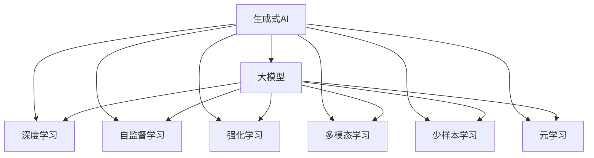

                 

# AI Agent: AI的下一个风口 生成式AI的崛起

> 关键词：生成式AI,大模型,深度学习,自监督学习,强化学习,多模态,少样本学习,元学习

## 1. 背景介绍

### 1.1 问题由来

近年来，人工智能(AI)技术在各个领域取得了显著的突破，深度学习、机器学习、自然语言处理(NLP)等技术不断演进，推动了AI技术的广泛应用。然而，传统基于规则的AI系统存在无法处理复杂、模糊任务的问题，而基于数据的AI系统则面临数据标注、过拟合等挑战。这些问题都亟需新的AI技术来应对。

生成式AI技术的出现，使得AI系统可以从数据中主动学习到生成任务的策略，能够处理更复杂、更灵活的任务，并为AI发展开启了新的发展方向。生成式AI不仅能在视觉、文本、语音等领域实现更加智能、高效的应用，还具备跨模态学习和少样本学习的潜力，被认为是AI的下一个风口。

### 1.2 问题核心关键点

生成式AI的核心在于生成模型可以学习到数据之间的复杂关系，从而能够生成新的数据或内容。生成式AI主要包括以下几个关键技术：

- 大模型：通过在大规模数据上预训练生成模型，学习到生成任务的通用特征，具备生成高质量数据的强大能力。
- 深度学习：通过多层神经网络的复杂结构，捕捉数据的潜在特征，提升生成效果。
- 自监督学习：利用未标注数据，通过自我迭代学习，提升生成模型性能。
- 强化学习：通过奖励机制，引导生成模型学习到最优生成策略，实现更智能的生成。
- 多模态学习：将视觉、文本、语音等多种模态数据融合，提升生成模型的泛化能力。
- 少样本学习：利用少量样本，通过迁移学习等方法，提升生成模型的适应能力。
- 元学习：通过少量数据或问题，学习到生成任务的通用模板，实现快速适应新任务。

这些关键技术共同构成了生成式AI的技术框架，为AI系统在实际应用中提供了强大的支持。

## 2. 核心概念与联系

### 2.1 核心概念概述

为了更好地理解生成式AI技术的核心概念，本节将介绍几个关键概念及其相互联系。

- 生成式AI（Generative AI）：指能够生成新数据或内容的AI技术，包括但不限于文本生成、图像生成、语音生成等。

- 大模型（Large Model）：指在大量数据上预训练生成的深度学习模型，如GPT、BERT、T5等，具备强大的生成能力和泛化能力。

- 深度学习（Deep Learning）：利用多层神经网络，通过学习数据之间的复杂关系，提升生成模型的性能。

- 自监督学习（Self-supervised Learning）：利用未标注数据，通过自我迭代学习，提升生成模型性能。

- 强化学习（Reinforcement Learning）：通过奖励机制，引导生成模型学习到最优生成策略，实现更智能的生成。

- 多模态学习（Multi-modal Learning）：将视觉、文本、语音等多种模态数据融合，提升生成模型的泛化能力。

- 少样本学习（Few-shot Learning）：利用少量样本，通过迁移学习等方法，提升生成模型的适应能力。

- 元学习（Meta-Learning）：通过少量数据或问题，学习到生成任务的通用模板，实现快速适应新任务。

这些核心概念之间的逻辑关系可以通过以下Mermaid流程图来展示：



这个流程图展示了生成式AI的核心概念及其之间的关系：

1. 生成式AI通过大模型、深度学习、自监督学习等技术实现生成任务。
2. 大模型是生成式AI的基础，提供强大的生成能力。
3. 深度学习提升生成模型的性能，通过多层网络捕捉复杂关系。
4. 自监督学习利用未标注数据，提升模型的泛化能力。
5. 强化学习通过奖励机制，引导生成模型学习最优策略。
6. 多模态学习融合多种模态数据，提升模型的泛化能力。
7. 少样本学习利用少量样本，提升模型的适应能力。
8. 元学习学习通用模板，实现快速适应新任务。

这些概念共同构成了生成式AI的技术框架，使其能够在各种场景下发挥强大的生成能力。通过理解这些核心概念，我们可以更好地把握生成式AI的工作原理和优化方向。

## 3. 核心算法原理 & 具体操作步骤
### 3.1 算法原理概述

生成式AI的核心在于生成模型可以学习到数据之间的复杂关系，从而能够生成新的数据或内容。其核心思想是：通过在大量未标注数据上预训练生成模型，学习到数据的潜在分布，再通过有监督学习任务进行微调，优化生成模型在特定生成任务上的性能。

形式化地，假设生成模型为 $G_{\theta}$，其中 $\theta$ 为生成模型的参数。给定生成任务 $T$ 的标注数据集 $D=\{(x_i,y_i)\}_{i=1}^N, x_i \in \mathcal{X}, y_i \in \mathcal{Y}$，生成模型的优化目标是最小化损失函数 $\mathcal{L}(G_{\theta},D)$，使得模型生成的样本与真实标签之间的差异最小化。常见的损失函数包括交叉熵损失、均方误差损失等。

通过梯度下降等优化算法，生成过程不断更新模型参数 $\theta$，最小化损失函数 $\mathcal{L}$，使得模型生成的样本逼近真实标签。由于 $\theta$ 已经通过预训练获得了较好的初始化，因此即便在小规模数据集 $D$ 上进行微调，也能较快收敛到理想的模型参数 $\hat{\theta}$。

### 3.2 算法步骤详解

生成式AI的生成模型微调一般包括以下几个关键步骤：

**Step 1: 准备预训练模型和数据集**
- 选择合适的预训练生成模型 $G_{\theta}$ 作为初始化参数，如 GPT、BERT、T5等。
- 准备生成任务 $T$ 的标注数据集 $D$，划分为训练集、验证集和测试集。一般要求标注数据与预训练数据的分布不要差异过大。

**Step 2: 添加任务适配层**
- 根据生成任务类型，在预训练模型顶层设计合适的生成器，如文本生成器、图像生成器等。
- 对于文本生成任务，通常使用语言模型的解码器输出概率分布，并以负对数似然为损失函数。

**Step 3: 设置生成超参数**
- 选择合适的优化算法及其参数，如 AdamW、SGD 等，设置学习率、批大小、迭代轮数等。
- 设置正则化技术及强度，包括权重衰减、Dropout、Early Stopping等。
- 确定冻结预训练参数的策略，如仅微调顶层，或全部参数都参与微调。

**Step 4: 执行生成训练**
- 将训练集数据分批次输入模型，前向传播计算损失函数。
- 反向传播计算参数梯度，根据设定的优化算法和学习率更新模型参数。
- 周期性在验证集上评估模型性能，根据性能指标决定是否触发 Early Stopping。
- 重复上述步骤直到满足预设的迭代轮数或 Early Stopping 条件。

**Step 5: 测试和部署**
- 在测试集上评估生成后模型 $G_{\hat{\theta}}$ 的性能，对比生成前后的质量提升。
- 使用生成后模型对新样本进行生成，集成到实际的应用系统中。
- 持续收集新的数据，定期重新生成模型，以适应数据分布的变化。

以上是生成式AI的生成模型微调的一般流程。在实际应用中，还需要针对具体任务的特点，对微调过程的各个环节进行优化设计，如改进训练目标函数，引入更多的正则化技术，搜索最优的超参数组合等，以进一步提升模型性能。

### 3.3 算法优缺点

生成式AI的生成模型微调方法具有以下优点：
1. 简单高效。只需准备少量标注数据，即可对预训练模型进行快速适配，生成高质量的数据或内容。
2. 通用适用。适用于各种生成任务，包括文本生成、图像生成、语音生成等，设计简单的任务适配层即可实现生成。
3. 参数高效。利用参数高效微调技术，在固定大部分预训练权重不变的情况下，仍可取得不错的生成效果。
4. 效果显著。在学术界和工业界的诸多任务上，基于生成的模型已经刷新了最先进的生成效果。

同时，该方法也存在一定的局限性：
1. 依赖标注数据。生成模型的生成效果很大程度上取决于标注数据的质量和数量，获取高质量标注数据的成本较高。
2. 生成能力有限。当目标任务与预训练数据的分布差异较大时，生成模型的生成能力可能受到限制。
3. 可解释性不足。生成模型生成的数据或内容，难以解释其生成逻辑，存在一定的黑箱性。
4. 质量控制难度大。生成模型的质量控制需要经过大量人工审核，难以在短时间内完成。

尽管存在这些局限性，但就目前而言，生成式AI的生成模型微调方法仍然是大规模生成任务的重要范式。未来相关研究的重点在于如何进一步降低生成模型对标注数据的依赖，提高模型的少样本学习和跨领域生成能力，同时兼顾可解释性和质量控制等因素。

### 3.4 算法应用领域

生成式AI的生成模型微调方法已经在视觉生成、文本生成、语音生成等多个领域得到了广泛的应用，覆盖了几乎所有常见任务，例如：

- 文本生成：如文本摘要、对话生成、故事生成等。通过微调使模型学习文本-文本映射。
- 图像生成：如图像生成、图像风格转换、图像编辑等。通过微调使模型学习图像-图像映射。
- 语音生成：如语音合成、语音翻译、语音识别等。通过微调使模型学习语音-语音映射。
- 图像与文本生成：如图像-文本生成、文本-图像生成等。通过微调使模型学习多模态映射。

除了上述这些经典任务外，生成式AI还被创新性地应用到更多场景中，如可控图像生成、生成对抗网络（GANs）、多媒体内容生成等，为计算机视觉、音频处理、信息检索等领域带来了新的突破。

## 4. 数学模型和公式 & 详细讲解 & 举例说明
### 4.1 数学模型构建

本节将使用数学语言对生成式AI的生成模型微调过程进行更加严格的刻画。

记生成模型为 $G_{\theta}$，其中 $\theta$ 为生成模型的参数。假设生成任务 $T$ 的训练集为 $D=\{(x_i,y_i)\}_{i=1}^N, x_i \in \mathcal{X}, y_i \in \mathcal{Y}$。

定义模型 $G_{\theta}$ 在数据样本 $(x,y)$ 上的损失函数为 $\ell(G_{\theta}(x),y)$，则在数据集 $D$ 上的经验风险为：

$$
\mathcal{L}(\theta) = \frac{1}{N} \sum_{i=1}^N \ell(G_{\theta}(x_i),y_i)
$$

生成模型的优化目标是最小化经验风险，即找到最优参数：

$$
\theta^* = \mathop{\arg\min}_{\theta} \mathcal{L}(\theta)
$$

在实践中，我们通常使用基于梯度的优化算法（如SGD、Adam等）来近似求解上述最优化问题。设 $\eta$ 为学习率，$\lambda$ 为正则化系数，则参数的更新公式为：

$$
\theta \leftarrow \theta - \eta \nabla_{\theta}\mathcal{L}(\theta) - \eta\lambda\theta
$$

其中 $\nabla_{\theta}\mathcal{L}(\theta)$ 为损失函数对参数 $\theta$ 的梯度，可通过反向传播算法高效计算。

### 4.2 公式推导过程

以下我们以文本生成任务为例，推导交叉熵损失函数及其梯度的计算公式。

假设生成模型 $G_{\theta}$ 在输入 $x$ 上的输出为 $z=G_{\theta}(x)$，表示生成样本的概率分布。真实标签 $y \in \{0,1\}$。则二分类交叉熵损失函数定义为：

$$
\ell(G_{\theta}(x),y) = -[y\log G_{\theta}(x)+(1-y)\log(1-G_{\theta}(x))]
$$

将其代入经验风险公式，得：

$$
\mathcal{L}(\theta) = -\frac{1}{N}\sum_{i=1}^N [y_i\log G_{\theta}(x_i)+(1-y_i)\log(1-G_{\theta}(x_i))]
$$

根据链式法则，损失函数对参数 $\theta_k$ 的梯度为：

$$
\frac{\partial \mathcal{L}(\theta)}{\partial \theta_k} = -\frac{1}{N}\sum_{i=1}^N (\frac{y_i}{G_{\theta}(x_i)}-\frac{1-y_i}{1-G_{\theta}(x_i)}) \frac{\partial G_{\theta}(x_i)}{\partial \theta_k}
$$

其中 $\frac{\partial G_{\theta}(x_i)}{\partial \theta_k}$ 可进一步递归展开，利用自动微分技术完成计算。

在得到损失函数的梯度后，即可带入参数更新公式，完成模型的迭代优化。重复上述过程直至收敛，最终得到适应生成任务的最优模型参数 $\theta^*$。

## 5. 项目实践：代码实例和详细解释说明
### 5.1 开发环境搭建

在进行生成模型微调实践前，我们需要准备好开发环境。以下是使用Python进行PyTorch开发的环境配置流程：

1. 安装Anaconda：从官网下载并安装Anaconda，用于创建独立的Python环境。

2. 创建并激活虚拟环境：
```bash
conda create -n pytorch-env python=3.8 
conda activate pytorch-env
```

3. 安装PyTorch：根据CUDA版本，从官网获取对应的安装命令。例如：
```bash
conda install pytorch torchvision torchaudio cudatoolkit=11.1 -c pytorch -c conda-forge
```

4. 安装Transformers库：
```bash
pip install transformers
```

5. 安装各类工具包：
```bash
pip install numpy pandas scikit-learn matplotlib tqdm jupyter notebook ipython
```

完成上述步骤后，即可在`pytorch-env`环境中开始生成模型微调实践。

### 5.2 源代码详细实现

下面我们以文本生成任务为例，给出使用Transformers库对GPT模型进行微调的PyTorch代码实现。

首先，定义文本生成任务的数据处理函数：

```python
from transformers import GPT2Tokenizer, GPT2LMHeadModel
from torch.utils.data import Dataset
import torch

class TextGenerationDataset(Dataset):
    def __init__(self, texts, tokenizer, max_len=512):
        self.texts = texts
        self.tokenizer = tokenizer
        self.max_len = max_len
        
    def __len__(self):
        return len(self.texts)
    
    def __getitem__(self, item):
        text = self.texts[item]
        encoding = self.tokenizer(text, return_tensors='pt', max_length=self.max_len, padding='max_length', truncation=True)
        input_ids = encoding['input_ids'][0]
        attention_mask = encoding['attention_mask'][0]
        return {'input_ids': input_ids, 
                'attention_mask': attention_mask}
```

然后，定义模型和优化器：

```python
from transformers import AdamW

model = GPT2LMHeadModel.from_pretrained('gpt2')
tokenizer = GPT2Tokenizer.from_pretrained('gpt2')

optimizer = AdamW(model.parameters(), lr=5e-5)
```

接着，定义训练和评估函数：

```python
from torch.utils.data import DataLoader
from tqdm import tqdm
from sklearn.metrics import perplexity_score

device = torch.device('cuda') if torch.cuda.is_available() else torch.device('cpu')
model.to(device)

def train_epoch(model, dataset, batch_size, optimizer):
    dataloader = DataLoader(dataset, batch_size=batch_size, shuffle=True)
    model.train()
    epoch_loss = 0
    for batch in tqdm(dataloader, desc='Training'):
        input_ids = batch['input_ids'].to(device)
        attention_mask = batch['attention_mask'].to(device)
        model.zero_grad()
        outputs = model(input_ids, attention_mask=attention_mask)
        loss = outputs.loss
        epoch_loss += loss.item()
        loss.backward()
        optimizer.step()
    return epoch_loss / len(dataloader)

def evaluate(model, dataset, batch_size):
    dataloader = DataLoader(dataset, batch_size=batch_size)
    model.eval()
    preds, labels = [], []
    with torch.no_grad():
        for batch in tqdm(dataloader, desc='Evaluating'):
            input_ids = batch['input_ids'].to(device)
            attention_mask = batch['attention_mask'].to(device)
            batch_labels = batch['attention_mask']
            outputs = model(input_ids, attention_mask=attention_mask)
            batch_preds = outputs.logits.argmax(dim=2).to('cpu').tolist()
            batch_labels = batch_labels.to('cpu').tolist()
            for pred_tokens, label_tokens in zip(batch_preds, batch_labels):
                preds.append(pred_tokens[:len(label_tokens)])
                labels.append(label_tokens)
                
    print(perplexity_score(labels, preds))
```

最后，启动训练流程并在测试集上评估：

```python
epochs = 5
batch_size = 16

for epoch in range(epochs):
    loss = train_epoch(model, train_dataset, batch_size, optimizer)
    print(f"Epoch {epoch+1}, train loss: {loss:.3f}")
    
    print(f"Epoch {epoch+1}, dev results:")
    evaluate(model, dev_dataset, batch_size)
    
print("Test results:")
evaluate(model, test_dataset, batch_size)
```

以上就是使用PyTorch对GPT模型进行文本生成任务微调的完整代码实现。可以看到，得益于Transformers库的强大封装，我们可以用相对简洁的代码完成GPT模型的加载和微调。

### 5.3 代码解读与分析

让我们再详细解读一下关键代码的实现细节：

**TextGenerationDataset类**：
- `__init__`方法：初始化文本、分词器等关键组件。
- `__len__`方法：返回数据集的样本数量。
- `__getitem__`方法：对单个样本进行处理，将文本输入编码为token ids，并对其进行定长padding，最终返回模型所需的输入。

**训练和评估函数**：
- 使用PyTorch的DataLoader对数据集进行批次化加载，供模型训练和推理使用。
- 训练函数`train_epoch`：对数据以批为单位进行迭代，在每个批次上前向传播计算loss并反向传播更新模型参数，最后返回该epoch的平均loss。
- 评估函数`evaluate`：与训练类似，不同点在于不更新模型参数，并在每个batch结束后将预测和标签结果存储下来，最后使用sklearn的perplexity_score对整个评估集的预测结果进行打印输出。

**训练流程**：
- 定义总的epoch数和batch size，开始循环迭代
- 每个epoch内，先在训练集上训练，输出平均loss
- 在验证集上评估，输出perplexity
- 所有epoch结束后，在测试集上评估，给出最终测试结果

可以看到，PyTorch配合Transformers库使得GPT微调的代码实现变得简洁高效。开发者可以将更多精力放在数据处理、模型改进等高层逻辑上，而不必过多关注底层的实现细节。

当然，工业级的系统实现还需考虑更多因素，如模型的保存和部署、超参数的自动搜索、更灵活的任务适配层等。但核心的生成模型微调范式基本与此类似。

## 6. 实际应用场景
### 6.1 智能推荐系统

生成式AI技术在大规模推荐系统中具有重要应用。现有的推荐系统往往只能根据用户的历史行为数据进行推荐，无法处理新用户或新商品的问题。生成式AI可以通过对新用户的画像生成，或对新商品的描述生成，从而提供个性化的推荐。

具体而言，可以收集用户浏览、点击、评论、分享等行为数据，提取和用户交互的物品标题、描述、标签等文本内容。将文本内容作为模型输入，生成新的物品标题、描述、标签等，再根据生成的数据进行推荐。通过生成式AI，推荐系统可以更加灵活、智能地推荐商品，提升用户体验和满意度。

### 6.2 虚拟助手

生成式AI技术可以用于构建虚拟助手，提供智能问答、任务执行等服务。传统的虚拟助手往往依赖于规则库和专家系统，无法处理复杂、模糊的指令。生成式AI可以通过对用户指令的生成，提供更加灵活、自然的交互体验。

具体而言，可以收集用户的历史对话记录和指令，提取用户意图和需求。在预训练模型的基础上，生成与用户意图匹配的回复或操作指令，并动态调整生成策略，提供更加精准的服务。生成式AI使得虚拟助手能够更加智能、灵活地与用户互动，提升用户体验和满意度。

### 6.3 艺术创作

生成式AI技术在艺术创作领域具有重要应用。传统的艺术创作需要耗费大量时间和精力，且难以跨越不同领域和风格的界限。生成式AI可以通过对不同风格、领域的作品进行分析，生成新的艺术作品。

具体而言，可以收集不同风格、领域的作品，提取其特征。在预训练模型的基础上，生成新的艺术作品，如绘画、音乐、舞蹈等。生成式AI使得艺术家能够更加灵活、高效地创作艺术作品，跨越不同领域和风格的界限，提升艺术创作的创新性和多样性。

### 6.4 未来应用展望

随着生成式AI技术的发展，其在各个领域的应用将不断拓展，为AI技术的发展带来新的契机。未来，生成式AI可能在以下几个方面取得更大的突破：

- 多模态生成：将视觉、文本、语音等多种模态数据融合，生成更加丰富、多样的内容。
- 跨领域生成：利用生成式AI的泛化能力，在不同领域生成高质量的内容。
- 少样本生成：利用生成式AI的迁移学习能力，在少量样本下生成高质量的内容。
- 元生成：通过学习生成任务的通用模板，实现快速适应新任务，提升生成模型的适应性和泛化能力。

以上趋势凸显了生成式AI技术的广阔前景。这些方向的探索发展，必将进一步提升AI系统的生成能力，推动AI技术在更多领域的应用。

## 7. 工具和资源推荐
### 7.1 学习资源推荐

为了帮助开发者系统掌握生成式AI的理论基础和实践技巧，这里推荐一些优质的学习资源：

1. 《Generative Adversarial Networks: An Overview》：这篇综述性论文介绍了生成对抗网络（GANs）的基本原理和应用。
2. 《Neural Text Generation with Language Models》：这篇博客介绍了使用语言模型进行文本生成的基本方法。
3. 《Transformers from Vision to Language》：这篇博客介绍了Transformer模型的原理和应用，包括生成式AI的实现。
4. 《Understanding Generative Adversarial Networks with Introductory Ideas》：这篇博客用简单的语言介绍了GANs的基本原理，适合初学者。
5. 《Machine Learning Mastery》：这是一系列机器学习教程，包括生成式AI的内容，适合初学者和进阶者。
6. 《Hands-On Generative AI with PyTorch》：这是一本关于使用PyTorch实现生成式AI的书籍，适合有编程基础的学习者。

通过对这些资源的学习实践，相信你一定能够快速掌握生成式AI的精髓，并用于解决实际的AI问题。
###  7.2 开发工具推荐

高效的开发离不开优秀的工具支持。以下是几款用于生成式AI微调开发的常用工具：

1. PyTorch：基于Python的开源深度学习框架，灵活动态的计算图，适合快速迭代研究。大部分预训练生成模型都有PyTorch版本的实现。
2. TensorFlow：由Google主导开发的开源深度学习框架，生产部署方便，适合大规模工程应用。同样有丰富的生成模型资源。
3. Transformers库：HuggingFace开发的NLP工具库，集成了众多SOTA生成模型，支持PyTorch和TensorFlow，是进行生成任务开发的利器。
4. Weights & Biases：模型训练的实验跟踪工具，可以记录和可视化模型训练过程中的各项指标，方便对比和调优。与主流深度学习框架无缝集成。
5. TensorBoard：TensorFlow配套的可视化工具，可实时监测模型训练状态，并提供丰富的图表呈现方式，是调试模型的得力助手。
6. Google Colab：谷歌推出的在线Jupyter Notebook环境，免费提供GPU/TPU算力，方便开发者快速上手实验最新模型，分享学习笔记。

合理利用这些工具，可以显著提升生成式AI微调任务的开发效率，加快创新迭代的步伐。

### 7.3 相关论文推荐

生成式AI的研究始于学界的持续研究。以下是几篇奠基性的相关论文，推荐阅读：

1. Generative Adversarial Nets（GANs论文）：提出生成对抗网络（GANs），通过对抗生成和判别模型，生成高质量的图像、音频、文本等。
2. Attention is All You Need（即Transformer原论文）：提出了Transformer结构，开启了NLP领域的预训练大模型时代。
3. Semi-supervised Sequence Prediction with Generative Adversarial Nets（GANs在NLP中的应用）：介绍GANs在NLP任务中的应用，如文本生成、语音合成等。
4. Denoising Pre-training for GPT-3（GPT-3论文）：提出Denoising Pre-training方法，提升GPT-3模型的生成能力和泛化能力。
5. Exploring the Limits of Transfer Learning with a Unified Text-to-Text Transformer（T5论文）：提出T5模型，利用统一的文本-文本预训练任务，提升模型的泛化能力。

这些论文代表了大规模生成任务的研究脉络。通过学习这些前沿成果，可以帮助研究者把握学科前进方向，激发更多的创新灵感。

## 8. 总结：未来发展趋势与挑战
### 8.1 总结

本文对生成式AI技术进行了全面系统的介绍。首先阐述了生成式AI技术的研究背景和意义，明确了生成式AI在生成任务中的重要价值。其次，从原理到实践，详细讲解了生成式AI的数学原理和关键步骤，给出了生成模型微调的完整代码实例。同时，本文还广泛探讨了生成式AI在智能推荐、虚拟助手、艺术创作等多个领域的应用前景，展示了生成式AI技术的巨大潜力。此外，本文精选了生成式AI技术的各类学习资源，力求为读者提供全方位的技术指引。

通过本文的系统梳理，可以看到，生成式AI技术正在成为AI领域的下一个风口，为AI系统在各种场景下提供更加智能、灵活的生成能力。生成式AI不仅能在视觉、文本、语音等领域实现更加智能、高效的应用，还具备跨模态学习和少样本学习的潜力，推动AI技术向更广泛的应用场景迈进。未来，伴随生成式AI技术的持续演进，相信生成式AI将成为AI技术发展的重要引擎，引领AI技术迈向新的高峰。

### 8.2 未来发展趋势

展望未来，生成式AI技术将呈现以下几个发展趋势：

1. 模型规模持续增大。随着算力成本的下降和数据规模的扩张，生成式AI模型的参数量还将持续增长。超大规模生成模型蕴含的丰富生成能力，有望支撑更加复杂、多样化的生成任务。
2. 生成能力不断提升。未来的生成式AI模型将通过多模态融合、跨领域迁移学习等技术，提升生成模型的生成能力。生成式AI将从简单的单模态生成，逐渐拓展到多模态生成，提升生成的多样性和质量。
3. 少样本学习成为常态。未来的生成式AI模型将具备更强的少样本学习能力，能够在少量样本下生成高质量的内容。这将大大降低生成任务对标注数据的需求，提升生成模型的灵活性和适应性。
4. 元学习广泛应用。未来的生成式AI模型将通过元学习技术，实现快速适应新任务。这将提升生成模型的泛化能力和鲁棒性，适应不同的应用场景。
5. 跨领域生成成为可能。未来的生成式AI模型将通过跨领域迁移学习技术，实现跨领域生成。这将打破领域之间的界限，实现更广泛的知识和技能共享。

以上趋势凸显了生成式AI技术的广阔前景。这些方向的探索发展，必将进一步提升生成式AI系统的生成能力，推动AI技术在更多领域的应用。

### 8.3 面临的挑战

尽管生成式AI技术已经取得了瞩目成就，但在迈向更加智能化、普适化应用的过程中，它仍面临着诸多挑战：

1. 标注成本瓶颈。虽然生成式AI模型可以通过自监督学习进行训练，但高质量标注数据对生成任务的优化仍然至关重要。如何进一步降低生成任务对标注样本的依赖，将是一大难题。
2. 生成能力不足。当目标任务与预训练数据的分布差异较大时，生成式AI模型的生成能力可能受到限制。如何提升生成模型的泛化能力和适应能力，还需要更多理论和实践的积累。
3. 模型鲁棒性不足。生成式AI模型在面对域外数据时，泛化性能往往大打折扣。如何提高生成式AI模型的鲁棒性，避免灾难性遗忘，还需要更多研究和优化。
4. 质量控制难度大。生成式AI模型生成的内容质量难以通过简单的评估指标进行判断，需要人工审核。如何提升生成内容的可接受性和实用性，仍需进一步探索。
5. 伦理道德风险。生成式AI模型可能生成有害、歧视性的内容，带来社会伦理道德风险。如何避免生成式AI模型对社会伦理的影响，仍需深入研究。

尽管存在这些挑战，但随着生成式AI技术的不断演进，相信其在实际应用中将不断突破，带来更智能、更普适的生成能力，推动AI技术向更广阔的领域发展。未来，伴随生成式AI技术的持续发展，相信生成式AI将成为AI技术发展的重要引擎，引领AI技术迈向新的高峰。

### 8.4 研究展望

面向未来，生成式AI技术的未来发展方向包括：

1. 探索无监督和半监督生成方法。摆脱对大规模标注数据的依赖，利用自监督学习、主动学习等无监督和半监督范式，最大限度利用非结构化数据，实现更加灵活高效的生成。
2. 研究参数高效和计算高效的生成范式。开发更加参数高效的生成方法，在固定大部分预训练权重不变的情况下，仍可取得不错的生成效果。同时优化生成模型的计算图，减少前向传播和反向传播的资源消耗，实现更加轻量级、实时性的部署。
3. 融合因果和对比学习范式。通过引入因果推断和对比学习思想，增强生成模型的建立稳定因果关系的能力，学习更加普适、鲁棒的语言表征，从而提升模型泛化性和抗干扰能力。
4. 引入更多先验知识。将符号化的先验知识，如知识图谱、逻辑规则等，与神经网络模型进行巧妙融合，引导生成模型学习更准确、合理的生成。同时加强不同模态数据的整合，实现视觉、语音等多模态信息与文本信息的协同建模。
5. 结合因果分析和博弈论工具。将因果分析方法引入生成模型，识别出模型决策的关键特征，增强输出解释的因果性和逻辑性。借助博弈论工具刻画人机交互过程，主动探索并规避模型的脆弱点，提高系统稳定性。
6. 纳入伦理道德约束。在生成模型训练目标中引入伦理导向的评估指标，过滤和惩罚有害、歧视性的输出倾向。同时加强人工干预和审核，建立生成模型的监管机制，确保输出符合人类价值观和伦理道德。

这些研究方向的探索，必将引领生成式AI技术迈向更高的台阶，为构建安全、可靠、可解释、可控的智能系统铺平道路。面向未来，生成式AI技术还需要与其他AI技术进行更深入的融合，如知识表示、因果推理、强化学习等，多路径协同发力，共同推动AI技术的发展。只有勇于创新、敢于突破，才能不断拓展生成式AI的边界，让AI技术更好地服务于人类社会。

## 9. 附录：常见问题与解答

**Q1：生成式AI是否可以处理复杂、模糊的任务？**

A: 生成式AI技术已经在大规模生成任务上取得了显著成果，如文本生成、图像生成、语音生成等。但对于一些复杂、模糊的任务，如创意写作、复杂对话等，生成式AI仍然存在一定的局限性。因此，未来的研究需要进一步提升生成式AI的泛化能力和智能水平，以应对更加复杂的生成任务。

**Q2：生成式AI是否需要大量的标注数据？**

A: 生成式AI技术在训练初期通常需要大量的标注数据，以帮助生成模型学习到高质量的生成策略。但一旦模型训练完成，后续生成任务往往只需要少量的样本来引导生成过程，无需标注数据。因此，生成式AI技术可以通过少样本学习等技术，降低对标注数据的依赖。

**Q3：生成式AI的生成效果如何评估？**

A: 生成式AI的生成效果可以通过多种指标进行评估，如BLEU、ROUGE、Perplexity等。BLEU和ROUGE常用于文本生成任务，评估生成的文本与参考文本的相似度。Perplexity常用于图像生成任务，衡量模型对输入数据的不确定性。此外，还通过人工评估、用户反馈等方式进行综合判断。

**Q4：生成式AI如何避免过拟合？**

A: 生成式AI模型避免过拟合的方法主要包括：
1. 数据增强：通过回译、近义替换等方式扩充训练集
2. 正则化：使用L2正则、Dropout、Early Stopping等避免过拟合
3. 对抗训练：引入对抗样本，提高模型鲁棒性
4. 参数高效微调：只调整少量参数(如Adapter、Prefix等)，减小过拟合风险
5. 多模型集成：训练多个生成模型，取平均输出，抑制过拟合

这些策略往往需要根据具体任务和数据特点进行灵活组合。只有在数据、模型、训练、推理等各环节进行全面优化，才能最大限度地发挥生成式AI的潜力。

**Q5：生成式AI如何应用于工业级部署？**

A: 生成式AI技术在工业级部署中需要注意以下问题：
1. 模型裁剪：去除不必要的层和参数，减小模型尺寸，加快推理速度
2. 量化加速：将浮点模型转为定点模型，压缩存储空间，提高计算效率
3. 服务化封装：将模型封装为标准化服务接口，便于集成调用
4. 弹性伸缩：根据请求流量动态调整资源配置，平衡服务质量和成本
5. 监控告警：实时采集系统指标，设置异常告警阈值，确保服务稳定性
6. 安全防护：采用访问鉴权、数据脱敏等措施，保障数据和模型安全

合理利用这些工具，可以显著提升生成式AI系统的部署效率，加快创新迭代的步伐。只有全面考虑数据、模型、算法、工程等多方面因素，才能真正实现生成式AI技术的落地应用。

---

作者：禅与计算机程序设计艺术 / Zen and the Art of Computer Programming

