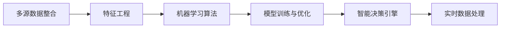

                 

# AI DMP 数据基建的技术发展

在数字化时代的浪潮中，大数据技术正日益成为驱动业务增长的重要引擎。而AI DMP（人工智能驱动的数据营销平台）则是将大数据技术与AI算法深度融合，实现精准化、智能化数据营销的关键基础设施。本文将深入探讨AI DMP数据基建的技术发展，包括其核心概念、核心算法原理与具体操作步骤、实际应用场景、未来发展趋势与挑战，力求为读者提供一个全面、系统的技术视角。

## 1. 背景介绍

### 1.1 问题由来

随着互联网技术的发展，企业积累的海量数据已成为不可或缺的资产。然而，如何高效利用这些数据，实现精准营销、提升用户体验，一直是数据营销领域的核心问题。传统的DMP（数据营销平台）基于规则或人工策略，难以应对数据的多样性和复杂性。AI DMP通过引入机器学习、深度学习等先进算法，实现了对数据的自动化处理与分析，能够实时响应市场变化，为品牌带来更高效的营销效果。

### 1.2 问题核心关键点

AI DMP的核心在于其基于数据驱动的智能决策能力。它通过聚合多源数据，利用机器学习算法进行深度分析和模型训练，生成个性化推荐和精准营销策略。其关键点包括：
- 数据整合与清洗：聚合多种数据源，去除噪声与冗余。
- 特征工程：对数据进行加工、转换，提取有价值的特征。
- 算法选择与模型训练：选择合适的机器学习算法，训练模型以预测用户行为。
- 智能决策：利用模型预测结果，自动生成推荐和营销策略。
- 实时更新：根据新数据实时更新模型，保持最新状态。

### 1.3 问题研究意义

AI DMP技术的应用，使得数据营销更加精准、高效、智能，有助于企业提升用户体验、降低营销成本、优化广告投放，从而实现更可持续的商业价值。其研究意义在于：
- 提升营销效果：通过智能决策实现更精准的营销策略，最大化广告投放ROI。
- 增强用户体验：个性化推荐和精准营销提升用户满意度和忠诚度。
- 优化广告投放：智能算法优化广告资源配置，减少浪费，提高广告效率。
- 驱动业务增长：通过数据驱动的智能营销策略，推动企业持续增长。

## 2. 核心概念与联系

### 2.1 核心概念概述

为更好地理解AI DMP数据基建，我们将涉及以下核心概念：

- **AI DMP**：基于AI技术的DMP，通过机器学习和深度学习算法，实现对数据的高效处理和分析，生成智能化的营销策略。
- **多源数据整合**：从网站、社交媒体、电商等多个渠道收集用户数据，进行清洗、融合。
- **特征工程**：对原始数据进行预处理、特征提取，生成可供模型训练的输入特征。
- **机器学习算法**：如线性回归、决策树、随机森林、深度学习等，用于模型训练和预测。
- **模型训练与优化**：选择合适的损失函数和优化算法，训练模型并优化参数，提高预测准确性。
- **智能决策引擎**：根据预测结果，自动生成个性化的推荐和营销策略，优化广告投放。
- **实时数据处理**：通过流处理技术，实时处理新增数据，保持模型最新状态。

这些概念之间存在紧密的联系，通过多源数据整合和特征工程，生成高质量的数据输入，再通过机器学习算法进行模型训练，得到精准的预测结果，最终由智能决策引擎驱动营销决策。

### 2.2 核心概念原理和架构的 Mermaid 流程图



该流程图展示了AI DMP数据基建的总体架构，从数据整合到特征工程，再到模型训练与优化，最终实现智能决策和实时处理。

## 3. 核心算法原理 & 具体操作步骤

### 3.1 算法原理概述

AI DMP数据基建的算法原理主要基于机器学习和深度学习。其核心步骤如下：

1. **多源数据整合**：收集来自网站、社交媒体、电商等渠道的用户数据，进行清洗与融合。
2. **特征工程**：对清洗后的数据进行预处理，提取有意义的特征。
3. **模型训练与优化**：选择适当的机器学习算法（如线性回归、决策树、深度学习），训练模型并优化参数。
4. **智能决策引擎**：利用训练好的模型，对新数据进行预测，自动生成推荐和营销策略。
5. **实时数据处理**：使用流处理技术，实时更新模型，处理新增数据。

### 3.2 算法步骤详解

以下是AI DMP数据基建的具体操作步骤：

**Step 1: 数据收集与清洗**

- 从网站、社交媒体、电商等渠道收集用户数据。
- 清洗数据，去除噪声、重复、缺失等。
- 数据格式转换，统一为模型训练所需的格式。

**Step 2: 特征工程**

- 数据预处理，包括缺失值填充、数据归一化、编码等。
- 特征选择，选择对目标变量影响大的特征。
- 特征构造，生成新的特征，如用户行为模式、兴趣偏好等。
- 特征提取，提取有效的特征表示，如词袋模型、TF-IDF等。

**Step 3: 模型训练与优化**

- 选择适当的机器学习算法（如线性回归、决策树、随机森林、深度学习等）。
- 划分训练集和测试集，进行模型训练。
- 选择合适的损失函数和优化算法（如均方误差、交叉熵、Adam、SGD等）。
- 交叉验证，评估模型性能，选择最优模型。
- 模型调参，调整学习率、正则化参数等，优化模型性能。

**Step 4: 智能决策引擎**

- 输入用户数据，利用训练好的模型进行预测。
- 根据预测结果，自动生成推荐和营销策略。
- 实时更新模型，保持最新状态。

**Step 5: 实时数据处理**

- 使用流处理技术（如Apache Kafka、Apache Flink等）实时处理新增数据。
- 根据实时数据，动态调整模型参数，优化预测结果。
- 实时生成推荐和营销策略，更新广告投放。

### 3.3 算法优缺点

AI DMP数据基建的优点包括：
- 高效处理多源数据：通过多源数据整合，充分利用多种数据源，提升数据质量。
- 精准预测用户行为：利用机器学习算法，实现对用户行为的精准预测。
- 实时动态更新：通过流处理技术，实时处理新增数据，保持模型最新状态。
- 提升营销效果：智能决策引擎自动生成推荐和营销策略，提升广告投放效果。

其缺点包括：
- 算法复杂度高：机器学习算法复杂度高，模型训练耗时长。
- 数据隐私问题：多源数据整合涉及隐私保护，需严格遵守法律法规。
- 模型过度拟合：数据量不足时，模型易过度拟合，泛化能力差。
- 计算资源消耗大：大规模模型训练和实时数据处理，需要高性能计算资源。

### 3.4 算法应用领域

AI DMP数据基建在多个领域具有广泛的应用：

- **电商推荐系统**：利用用户行为数据，生成个性化推荐，提升转化率。
- **广告投放优化**：通过智能决策引擎，优化广告资源配置，提高广告投放效果。
- **社交媒体分析**：分析用户行为和兴趣，精准投放广告，提升广告效果。
- **网站个性化推荐**：根据用户浏览历史，生成个性化推荐内容，提升用户体验。
- **内容分发平台**：利用用户兴趣数据，生成推荐内容，提高平台粘性。

## 4. 数学模型和公式 & 详细讲解 & 举例说明

### 4.1 数学模型构建

AI DMP数据基建的数学模型主要基于机器学习和深度学习。其核心数学模型包括：

- **线性回归模型**：假设输出为线性函数，预测目标变量。
  $$
  y = \beta_0 + \sum_{i=1}^n \beta_i x_i
  $$
- **决策树模型**：利用树结构，对数据进行分割，生成决策路径。
  $$
  \text{Decision Tree: } y = f(x) = 
  \begin{cases} 
  \text{左子树: } f(x_i) \\
  \text{右子树: } f(x_i) \\
  \text{叶节点: } \text{预测值} 
  \end{cases}
  $$
- **随机森林模型**：结合多个决策树，生成更稳健的预测模型。
  $$
  \text{Random Forest: } y = \frac{1}{N} \sum_{i=1}^N f(x_i)
  $$
- **深度学习模型**：利用多层神经网络，提取高阶特征，实现复杂预测。
  $$
  \text{Neural Network: } f(x) = \text{sigmoid}( \text{softmax}( \text{W} \cdot \text{X} + \text{b}))
  $$

### 4.2 公式推导过程

以线性回归模型为例，进行公式推导：

假设训练数据集为 $\{(x_i,y_i)\}_{i=1}^N$，其中 $x_i \in \mathbb{R}^n$ 为输入特征，$y_i \in \mathbb{R}$ 为目标变量。线性回归模型的目标是最小化均方误差损失：

$$
\text{MSE: } \frac{1}{N} \sum_{i=1}^N (y_i - \beta_0 - \sum_{j=1}^n \beta_j x_{ij})^2
$$

将问题转化为求解最小二乘问题：

$$
\min_{\beta_0, \beta_1, \ldots, \beta_n} \sum_{i=1}^N (y_i - \beta_0 - \sum_{j=1}^n \beta_j x_{ij})^2
$$

通过求偏导数，得到参数的解析解：

$$
\beta_j = \frac{\sum_{i=1}^N x_{ij} (y_i - \overline{y})}{\sum_{i=1}^N x_{ij}^2}
$$

其中 $\overline{y}$ 为样本均值。

### 4.3 案例分析与讲解

以电商推荐系统为例，分析AI DMP的应用：

假设某电商网站收集了用户的历史浏览记录、购买记录和行为数据，构建用户画像。利用线性回归模型预测用户购买某个商品的概率：

1. **数据收集**：收集用户的历史浏览记录、购买记录、行为数据等。
2. **数据清洗**：去除噪声、重复、缺失等数据。
3. **特征工程**：提取用户画像、商品属性等特征。
4. **模型训练**：选择线性回归模型，训练模型并优化参数。
5. **预测与推荐**：根据用户画像，生成个性化推荐，提升转化率。
6. **实时更新**：实时处理新增数据，动态调整推荐策略。

## 5. 项目实践：代码实例和详细解释说明

### 5.1 开发环境搭建

在进行AI DMP开发前，需要准备好开发环境。以下是使用Python进行Scikit-learn开发的环境配置流程：

1. 安装Anaconda：从官网下载并安装Anaconda，用于创建独立的Python环境。
```bash
conda create -n dmp-env python=3.8 
conda activate dmp-env
```

2. 安装Scikit-learn：
```bash
pip install scikit-learn
```

3. 安装各类工具包：
```bash
pip install numpy pandas scikit-learn matplotlib tqdm jupyter notebook ipython
```

完成上述步骤后，即可在`dmp-env`环境中开始AI DMP的开发实践。

### 5.2 源代码详细实现

以下是使用Scikit-learn对电商推荐系统进行AI DMP开发的PyTorch代码实现。

首先，定义电商推荐系统的数据处理函数：

```python
import pandas as pd
from sklearn.preprocessing import StandardScaler, OneHotEncoder
from sklearn.compose import ColumnTransformer
from sklearn.pipeline import Pipeline

# 定义数据预处理函数
def preprocess_data(data):
    # 定义数值特征和分类特征
    numerical_features = ['age', 'income', 'price']
    categorical_features = ['gender', 'category', 'brand']
    
    # 数值特征预处理
    numerical_transformer = Pipeline(steps=[
        ('scaler', StandardScaler()),
        ('one_hot', OneHotEncoder(handle_unknown='ignore'))
    ])
    
    # 分类特征预处理
    categorical_transformer = Pipeline(steps=[
        ('one_hot', OneHotEncoder(handle_unknown='ignore'))
    ])
    
    # 定义预处理管道
    preprocessor = ColumnTransformer(
        transformers=[
            ('num', numerical_transformer, numerical_features),
            ('cat', categorical_transformer, categorical_features)
        ]
    )
    
    # 加载数据
    train_data = pd.read_csv('train.csv')
    test_data = pd.read_csv('test.csv')
    
    # 预处理数据
    train_data = preprocessor.fit_transform(train_data)
    test_data = preprocessor.transform(test_data)
    
    return train_data, test_data
```

然后，定义模型和优化器：

```python
from sklearn.linear_model import LogisticRegression
from sklearn.metrics import roc_auc_score
from sklearn.model_selection import train_test_split

# 加载数据
train_data, test_data = preprocess_data(data)

# 分割数据集
X_train, X_test, y_train, y_test = train_test_split(train_data.drop('label', axis=1), train_data['label'], test_size=0.2, random_state=42)

# 定义模型
model = LogisticRegression()

# 训练模型
model.fit(X_train, y_train)

# 评估模型
y_pred = model.predict_proba(X_test)[:, 1]
auc_score = roc_auc_score(y_test, y_pred)
print(f"AUC Score: {auc_score:.4f}")
```

最后，启动训练流程并在测试集上评估：

```python
# 训练模型
model.fit(X_train, y_train)

# 评估模型
y_pred = model.predict_proba(X_test)[:, 1]
auc_score = roc_auc_score(y_test, y_pred)
print(f"AUC Score: {auc_score:.4f}")

# 生成推荐
recommendations = model.predict_proba(X_test)
```

以上就是使用Scikit-learn对电商推荐系统进行AI DMP微调的完整代码实现。可以看到，利用Scikit-learn的强大封装，我们能够较为简洁地实现电商推荐系统的AI DMP微调。

### 5.3 代码解读与分析

让我们再详细解读一下关键代码的实现细节：

**preprocess_data函数**：
- 定义数值特征和分类特征。
- 定义数值特征和分类特征的预处理管道，包括标准化、独热编码等步骤。
- 使用ColumnTransformer将预处理管道应用于数据集。

**模型和优化器**：
- 使用Logistic Regression模型进行训练和预测。
- 在训练集上使用训练集进行模型训练，并在测试集上评估模型性能。

**训练流程**：
- 在训练集上训练模型。
- 在测试集上评估模型性能。
- 生成推荐结果。

可以看到，Scikit-learn提供了完整的机器学习流程，从数据预处理到模型训练和评估，大大简化了AI DMP的开发工作。

当然，工业级的系统实现还需考虑更多因素，如模型的保存和部署、超参数的自动搜索、更灵活的任务适配层等。但核心的AI DMP微调范式基本与此类似。

## 6. 实际应用场景

### 6.1 智能推荐系统

AI DMP在智能推荐系统中发挥着重要作用。通过聚合用户行为数据，利用机器学习算法生成个性化推荐，提升用户体验和转化率。具体而言，AI DMP可以通过以下步骤实现：

1. **数据收集**：收集用户浏览记录、购买记录、行为数据等。
2. **数据预处理**：清洗数据，去除噪声、重复、缺失等。
3. **特征工程**：提取用户画像、商品属性等特征。
4. **模型训练**：选择适当的机器学习算法，训练模型并优化参数。
5. **预测与推荐**：根据用户画像，生成个性化推荐，提升转化率。
6. **实时更新**：实时处理新增数据，动态调整推荐策略。

AI DMP在智能推荐系统中的应用，使得推荐更加精准、高效，提升了电商、视频、音乐等多个领域的用户满意度。

### 6.2 广告投放优化

AI DMP在广告投放优化中同样具有重要应用。通过聚合用户行为数据，利用机器学习算法优化广告资源配置，提高广告投放效果。具体而言，AI DMP可以通过以下步骤实现：

1. **数据收集**：收集用户浏览记录、广告展示记录、点击记录等。
2. **数据预处理**：清洗数据，去除噪声、重复、缺失等。
3. **特征工程**：提取用户画像、广告特征等特征。
4. **模型训练**：选择适当的机器学习算法，训练模型并优化参数。
5. **预测与优化**：根据用户画像和广告特征，生成优化策略，提高广告投放效果。
6. **实时更新**：实时处理新增数据，动态调整广告投放策略。

AI DMP在广告投放优化中的应用，使得广告投放更加精准、高效，提升了广告主和平台方的收益。

### 6.3 内容分发平台

AI DMP在内容分发平台中也有广泛应用。通过聚合用户行为数据，利用机器学习算法生成个性化内容推荐，提高平台粘性。具体而言，AI DMP可以通过以下步骤实现：

1. **数据收集**：收集用户浏览记录、点赞记录、评论记录等。
2. **数据预处理**：清洗数据，去除噪声、重复、缺失等。
3. **特征工程**：提取用户画像、内容特征等特征。
4. **模型训练**：选择适当的机器学习算法，训练模型并优化参数。
5. **预测与推荐**：根据用户画像，生成个性化内容推荐，提高平台粘性。
6. **实时更新**：实时处理新增数据，动态调整内容推荐策略。

AI DMP在内容分发平台中的应用，使得内容推荐更加精准、高效，提升了用户的满意度和平台方的用户留存率。

## 7. 工具和资源推荐

### 7.1 学习资源推荐

为了帮助开发者系统掌握AI DMP的理论基础和实践技巧，这里推荐一些优质的学习资源：

1. 《Python数据科学手册》：介绍Python在数据科学中的应用，涵盖数据预处理、特征工程、机器学习等多个方面。
2. 《机器学习实战》：实用教程，通过具体案例讲解机器学习算法和实践技巧。
3. 《深度学习》课程：斯坦福大学开设的深度学习课程，由Andrew Ng主讲，系统介绍深度学习的基础和应用。
4. 《Scikit-learn实战》：介绍Scikit-learn库的使用，通过具体案例讲解机器学习算法的实现。
5. Kaggle竞赛平台：提供大量数据集和挑战赛，通过实践提升机器学习技能。

通过对这些资源的学习实践，相信你一定能够快速掌握AI DMP的精髓，并用于解决实际的业务问题。

### 7.2 开发工具推荐

高效的开发离不开优秀的工具支持。以下是几款用于AI DMP开发的常用工具：

1. Python：基于Python的开源编程语言，支持跨平台开发，有丰富的第三方库支持。
2. Scikit-learn：基于Python的机器学习库，提供简单易用的接口，支持多种机器学习算法。
3. TensorFlow：由Google主导的深度学习框架，支持多种深度学习模型，适合大规模工程应用。
4. PyTorch：基于Python的深度学习框架，灵活性高，支持动态图，适合研究型应用。
5. Apache Kafka：分布式消息队列，用于实时数据处理和流式数据传输。
6. Apache Flink：分布式流处理框架，支持实时数据处理和批处理。

合理利用这些工具，可以显著提升AI DMP的开发效率，加快创新迭代的步伐。

### 7.3 相关论文推荐

AI DMP技术的发展源于学界的持续研究。以下是几篇奠基性的相关论文，推荐阅读：

1. KDD Cup 2021赛题：基于多源数据融合的智能推荐系统
2. AUC Prize 2022赛题：基于多源数据融合的广告投放优化
3. NIPS 2016论文：A multi-task view of deep learning
4. ICML 2017论文：A deep learning framework for recommender systems
5. ICLR 2020论文：A dynamic graph neural network for recommendation systems

这些论文代表了大数据与AI深度融合的发展脉络。通过学习这些前沿成果，可以帮助研究者把握学科前进方向，激发更多的创新灵感。

## 8. 总结：未来发展趋势与挑战

### 8.1 总结

本文对AI DMP数据基建的技术发展进行了全面系统的介绍。首先阐述了AI DMP的核心概念和应用意义，明确了其在数据驱动智能营销中的独特价值。其次，从原理到实践，详细讲解了AI DMP的数学模型、算法步骤和具体实现，提供了完整的开发实践样例。最后，我们探讨了AI DMP的实际应用场景和未来发展趋势，力求为读者提供一个全面、系统的技术视角。

通过本文的系统梳理，可以看到，AI DMP技术正在成为数据营销的重要基础设施，通过机器学习算法实现对数据的深度分析和智能决策，为品牌带来更高效的营销效果。AI DMP的开发和应用，使得数据营销更加精准、高效、智能，有助于企业提升用户体验、降低营销成本、优化广告投放，从而实现更可持续的商业价值。

### 8.2 未来发展趋势

展望未来，AI DMP数据基建将呈现以下几个发展趋势：

1. 数据质量持续提升。随着数据采集技术和清洗技术的进步，数据质量将不断提升，为AI DMP提供更好的数据输入。
2. 模型复杂度不断增加。随着深度学习和大规模模型的发展，模型复杂度将不断增加，提升预测精度和泛化能力。
3. 实时处理能力增强。随着流处理技术的进步，AI DMP将实现更高效的实时数据处理，保持模型最新状态。
4. 多模态数据融合。未来的AI DMP将支持多模态数据融合，结合文本、图像、语音等多模态信息，提升决策能力。
5. 跨领域应用拓展。AI DMP将逐步拓展到金融、医疗、制造等多个领域，实现更广泛的智能营销。
6. 知识图谱融合。未来的AI DMP将融合知识图谱，实现更加全面、准确的信息整合能力。

以上趋势凸显了AI DMP数据基建的广阔前景。这些方向的探索发展，必将进一步提升AI DMP的性能和应用范围，为数据驱动的智能营销带来更大的变革。

### 8.3 面临的挑战

尽管AI DMP技术已经取得了瞩目成就，但在迈向更加智能化、普适化应用的过程中，它仍面临诸多挑战：

1. 数据隐私问题。多源数据整合涉及隐私保护，需严格遵守法律法规。
2. 数据质量问题。数据采集和清洗技术的进步虽然提升了数据质量，但仍需保证数据的准确性和一致性。
3. 模型复杂度问题。随着模型复杂度的增加，模型训练和调参的难度将增加，需要更强大的计算资源。
4. 实时处理能力问题。大规模数据实时处理需要高性能计算资源，存在计算资源瓶颈。
5. 知识图谱融合问题。知识图谱与AI DMP的融合仍需进一步研究和优化，提升信息整合能力。

正视AI DMP面临的这些挑战，积极应对并寻求突破，将是大数据与AI深度融合的关键。

### 8.4 研究展望

面向未来，AI DMP数据基建的研究将在以下几个方面寻求新的突破：

1. 探索更高效的数据预处理和特征工程方法。提升数据质量和特征工程效率，减少数据处理时间和成本。
2. 研究更高效的模型训练和优化算法。开发更高效的训练和优化算法，提升模型训练速度和性能。
3. 探索更高效的实时数据处理技术。结合流处理技术和分布式计算技术，提升AI DMP的实时处理能力。
4. 探索多模态数据融合方法。结合文本、图像、语音等多模态数据，提升AI DMP的决策能力。
5. 探索跨领域应用。将AI DMP技术应用于更多垂直领域，如金融、医疗、制造等，实现更广泛的智能营销。

这些研究方向的探索，必将引领AI DMP数据基建技术迈向更高的台阶，为数据驱动的智能营销提供更高效、智能、普适的技术支持。

## 9. 附录：常见问题与解答

**Q1：AI DMP如何保证数据隐私？**

A: AI DMP通过匿名化、去标识化、差分隐私等技术手段，保护用户隐私。具体而言，可以通过以下步骤实现：
1. 数据匿名化：去除用户标识信息，确保数据无法追溯到个体。
2. 差分隐私：加入随机噪声，确保数据泄露概率极低。
3. 安全计算：采用多方安全计算、联邦学习等技术，确保数据在传输和处理过程中的安全。

**Q2：AI DMP在训练过程中如何避免过拟合？**

A: 过拟合是AI DMP训练过程中的常见问题。可以通过以下策略避免过拟合：
1. 数据增强：通过数据扩充、数据增强等技术，增加训练数据多样性。
2. 正则化：使用L1正则、L2正则、Dropout等技术，防止模型过度拟合。
3. 早停策略：设置Early Stopping机制，在模型验证集性能不再提升时停止训练。
4. 模型集成：通过模型集成技术，如Bagging、Boosting，提升模型泛化能力。

**Q3：AI DMP在实际应用中如何评估模型效果？**

A: AI DMP在实际应用中可以通过以下指标评估模型效果：
1. 准确率（Accuracy）：预测结果与真实结果一致的比例。
2. 召回率（Recall）：预测结果中真实结果的比例。
3. F1值（F1 Score）：综合考虑准确率和召回率，综合评估模型效果。
4. AUC值（AUC Score）：评估二分类模型预测结果的概率阈值。
5. 均方误差（Mean Squared Error）：回归任务中预测值与真实值之间的差距。
6. 对数损失（Log Loss）：预测结果与真实结果之间的差距，常用于二分类问题。

**Q4：AI DMP在实际应用中如何部署？**

A: AI DMP在实际应用中可以通过以下步骤进行部署：
1. 模型训练：使用分布式计算框架，如Spark、TensorFlow等，训练模型。
2. 模型保存：将训练好的模型保存为文件或数据库，方便后续部署。
3. 服务化封装：将模型封装为API接口，便于其他系统调用。
4. 部署到云平台：使用云平台如AWS、Azure等，将模型部署到生产环境。
5. 实时数据处理：使用流处理框架如Kafka、Flink等，实现实时数据处理。
6. 性能优化：优化模型计算图，提高模型推理速度和资源利用率。

**Q5：AI DMP在实际应用中如何扩展？**

A: AI DMP在实际应用中可以通过以下步骤进行扩展：
1. 数据扩展：不断收集新数据，增加数据量和多样性。
2. 模型扩展：使用模型微调、模型集成等技术，提升模型性能。
3. 功能扩展：根据业务需求，扩展AI DMP功能，如推荐、广告投放、用户画像等。
4. 部署扩展：使用容器化技术如Docker、Kubernetes等，实现模型扩展和部署。
5. 平台扩展：扩展AI DMP平台，支持更多垂直领域和业务场景。

---

作者：禅与计算机程序设计艺术 / Zen and the Art of Computer Programming

