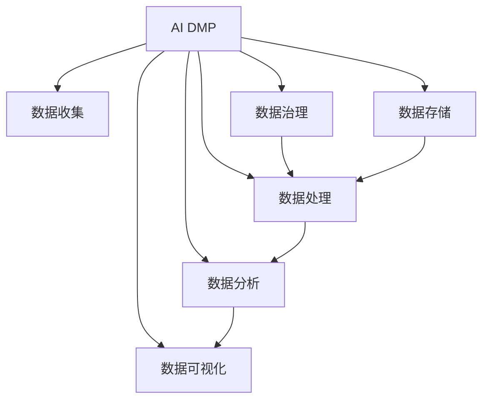

                 

# AI DMP 数据基建：数据分析与洞察

> 关键词：AI DMP, 数据基建, 数据分析, 客户洞察, 数据治理, 数据管道, 实时计算, 数据平台

## 1. 背景介绍

### 1.1 问题由来
在数字化时代，企业面临的最大挑战之一是如何通过数据驱动决策，最大化商业价值。这要求企业构建高效、全面、安全的数据基础设施，不仅能够整合海量数据，还能进行深度分析，挖掘洞察。AI DMP（AI Data Management Platform）作为数据驱动决策的关键工具，其核心能力在于通过数据收集、存储、处理、分析等环节，实现对用户行为的全面洞察，辅助企业进行精准营销、风险控制、客户服务等决策。

AI DMP的应用已经广泛应用于零售、金融、电商、媒体等各个领域，为企业的运营和决策提供了强有力的支持。然而，AI DMP的构建和维护是一项复杂而庞大的工程，涉及到数据治理、技术架构、组织管理等多个方面。如何构建一个高效、可扩展、可维护的AI DMP系统，是企业在数字化转型过程中必须面对的重大挑战。

### 1.2 问题核心关键点
构建AI DMP的核心关键点包括以下几个方面：

- 数据收集：如何高效地收集数据，覆盖用户行为的全生命周期。
- 数据治理：如何对数据进行标准化、清洗、标注、治理，确保数据质量。
- 数据存储：如何选择合适的存储方式，保证数据的安全性和可访问性。
- 数据处理：如何高效地进行数据转换、聚合、清洗、提取等处理。
- 数据分析：如何运用各种数据分析技术和算法，从数据中挖掘出有用的洞察。
- 数据可视化：如何通过直观的展示方式，将数据洞察转化为可操作的业务决策。
- 系统架构：如何设计一个可扩展、可靠、安全的数据平台。

本文将围绕上述关键点，全面系统地介绍AI DMP的数据基建和数据分析技术，帮助读者深入理解AI DMP的构建与维护。

## 2. 核心概念与联系

### 2.1 核心概念概述

为更好地理解AI DMP的数据基建和分析技术，本节将介绍几个密切相关的核心概念：

- AI DMP（AI Data Management Platform）：一种基于AI技术的、用于管理和分析用户数据的数据平台，通过数据收集、清洗、聚合、分析等环节，实现对用户行为的深度洞察，支持企业进行精准营销、风险控制、客户服务等决策。

- 数据治理（Data Governance）：包括数据质量管理、元数据管理、数据安全管理等，确保数据的一致性、完整性、准确性，满足法规合规要求。

- 数据管道（Data Pipeline）：用于实现数据从源到目的地的自动传输和处理，涵盖ETL（Extract, Transform, Load）流程，保证数据的实时性和完整性。

- 实时计算（Real-time Computing）：利用分布式计算技术，实现数据的实时处理和分析，支持流数据的实时传输和处理。

- 数据平台（Data Platform）：集成了多种数据技术和工具，提供数据存储、处理、分析、可视化等全流程服务，是构建AI DMP的基础设施。

- 数据分析（Data Analysis）：通过各种算法和模型，从数据中提取有价值的信息和洞察，支持决策制定。

- 数据可视化（Data Visualization）：利用图表、仪表盘等形式，将数据分析结果直观展示，辅助决策和运营。

这些核心概念之间的逻辑关系可以通过以下Mermaid流程图来展示：



这个流程图展示出AI DMP的数据基建和分析过程：

1. 数据收集：通过各种方式获取用户数据，涵盖行为数据、交易数据、社交数据等。
2. 数据治理：对收集到的数据进行标准化、清洗、标注、治理，确保数据质量。
3. 数据存储：选择合适的存储方式，如云存储、分布式数据库等，保证数据的安全性和可访问性。
4. 数据处理：进行数据转换、聚合、清洗、提取等处理，形成可用于分析的数据集。
5. 数据分析：运用各种算法和模型，从数据中挖掘出有用的洞察。
6. 数据可视化：通过直观的展示方式，将数据洞察转化为可操作的业务决策。

## 3. 核心算法原理 & 具体操作步骤
### 3.1 算法原理概述

AI DMP的数据基建和分析过程，本质上是一个数据流的处理和分析过程。其核心思想是：通过高效的数据收集和处理，实现对用户行为的全面洞察，辅助企业进行精准营销、风险控制、客户服务等决策。

具体而言，AI DMP的数据基建和分析可以分为以下几个步骤：

- **数据收集**：通过API接口、网页爬虫、SDK等方式，从网站、App、社交媒体等渠道收集用户数据，涵盖行为数据、交易数据、社交数据等。
- **数据治理**：对收集到的数据进行标准化、清洗、标注、治理，确保数据质量。
- **数据存储**：选择合适的存储方式，如云存储、分布式数据库等，保证数据的安全性和可访问性。
- **数据处理**：进行数据转换、聚合、清洗、提取等处理，形成可用于分析的数据集。
- **数据分析**：运用各种算法和模型，从数据中挖掘出有用的洞察。
- **数据可视化**：通过直观的展示方式，将数据洞察转化为可操作的业务决策。

### 3.2 算法步骤详解

#### 3.2.1 数据收集

AI DMP的数据收集通常包括以下几个方面：

- **Web和移动数据收集**：通过API接口、网页爬虫等方式，从网站、App中收集用户行为数据，如点击、浏览、购买、注册等。
- **交易数据收集**：从电商平台、支付系统、财务系统等收集用户的交易数据，如订单、支付、退货等。
- **社交媒体数据收集**：通过API接口、SDK等方式，从社交媒体平台（如微信、微博、Facebook等）收集用户的社交互动数据，如点赞、评论、分享等。
- **线下数据收集**：通过线下调研、问卷、CRM系统等方式，收集用户的线下行为数据。

#### 3.2.2 数据治理

数据治理是AI DMP的核心环节，其目的是确保数据的质量和一致性。数据治理通常包括以下几个方面：

- **数据标准化**：对不同来源的数据进行统一标准的转换，如将不同的日期格式转换为统一的格式，将不同的货币单位转换为统一的单位。
- **数据清洗**：去除数据中的噪音和异常值，确保数据的准确性和完整性。
- **数据标注**：对数据进行标签化处理，如将用户行为打上标签，如点击、浏览、购买、注册等。
- **数据治理**：确保数据符合法规和隐私保护要求，如GDPR、CCPA等。

#### 3.2.3 数据存储

数据存储是AI DMP的基础设施，其目的是保证数据的安全性和可访问性。数据存储通常包括以下几个方面：

- **云存储**：使用云存储平台（如AWS S3、Google Cloud Storage等）存储数据，确保数据的安全性和可扩展性。
- **分布式数据库**：使用分布式数据库（如Hadoop、Spark等）存储海量数据，确保数据的可靠性和高性能。
- **数据湖**：构建数据湖（Data Lake）架构，将各种类型的数据整合在一起，提供统一的访问接口。

#### 3.2.4 数据处理

数据处理是AI DMP的核心环节，其目的是对数据进行转换、聚合、清洗、提取等处理，形成可用于分析的数据集。数据处理通常包括以下几个方面：

- **数据转换**：将数据从一种格式转换为另一种格式，如将JSON格式转换为CSV格式。
- **数据聚合**：对数据进行聚合处理，如计算用户的平均订单金额、日均访问次数等。
- **数据清洗**：去除数据中的噪音和异常值，确保数据的准确性和完整性。
- **数据提取**：从原始数据中提取有用的信息，如提取用户的地理位置、设备类型等。

#### 3.2.5 数据分析

数据分析是AI DMP的核心能力，其目的是从数据中挖掘出有用的洞察，支持企业进行精准营销、风险控制、客户服务等决策。数据分析通常包括以下几个方面：

- **统计分析**：使用统计学方法对数据进行描述性分析，如计算平均数、中位数、标准差等。
- **机器学习**：使用机器学习算法对数据进行预测性分析，如使用分类算法预测用户的购买倾向，使用回归算法预测用户的流失率等。
- **数据挖掘**：使用数据挖掘技术对数据进行关联分析，如发现用户行为与购买行为之间的关系。

#### 3.2.6 数据可视化

数据可视化是AI DMP的核心环节，其目的是通过直观的展示方式，将数据洞察转化为可操作的业务决策。数据可视化通常包括以下几个方面：

- **仪表盘**：使用仪表盘（Dashboard）展示关键指标，如用户增长率、复购率等。
- **报告**：生成详细的报告，展示数据分析结果，如用户分群、行为分析等。
- **实时展示**：使用实时展示工具（如Tableau、Power BI等），实时更新数据可视化结果。

### 3.3 算法优缺点

AI DMP的数据基建和分析过程具有以下优点：

- **全面覆盖用户行为**：通过全面收集数据，涵盖用户行为的全生命周期，实现对用户行为的全面洞察。
- **高效处理海量数据**：使用分布式计算和大数据技术，高效处理海量数据，确保数据处理的时效性。
- **数据驱动决策**：通过数据分析和可视化，支持企业进行精准营销、风险控制、客户服务等决策，提升业务效率。

同时，该方法也存在一定的局限性：

- **数据隐私和安全问题**：收集和存储用户数据时需要考虑隐私和安全问题，确保数据符合法规和隐私保护要求。
- **数据治理复杂性**：数据治理是AI DMP的核心环节，但数据标准化、清洗、标注等过程复杂且耗时。
- **技术架构复杂性**：构建高效、可扩展、可维护的数据平台需要综合考虑多种技术和工具，技术架构复杂。

尽管存在这些局限性，但AI DMP的数据基建和分析方法已经成为企业数字化转型中的重要工具，帮助企业在数据驱动决策的道路上迈出坚实的一步。

### 3.4 算法应用领域

AI DMP的数据基建和分析方法已经广泛应用于以下领域：

- **零售行业**：通过分析用户行为和交易数据，帮助零售商进行精准营销、库存管理、价格优化等决策。
- **金融行业**：通过分析用户交易数据和行为数据，帮助金融机构进行风险控制、客户服务、反欺诈等决策。
- **电商行业**：通过分析用户行为和交易数据，帮助电商平台进行推荐系统、广告投放、用户分析等决策。
- **媒体行业**：通过分析用户行为和社交数据，帮助媒体平台进行内容推荐、用户分群、广告投放等决策。

除了上述这些领域，AI DMP的应用还在不断扩展，如智能制造、智慧城市、健康医疗等，为企业提供全面、深入的数据洞察，助力数字化转型。

## 4. 数学模型和公式 & 详细讲解 & 举例说明

### 4.1 数学模型构建

AI DMP的数据基建和分析过程涉及多个数学模型和公式，以下是几个核心的数学模型及其构建方法：

#### 4.1.1 数据标准化

数据标准化是数据治理的重要环节，其目的是确保数据的一致性和可比较性。数据标准化通常包括以下几个步骤：

- **日期格式统一**：将不同格式的时间戳转换为统一的日期格式。如将"2021-09-01"转换为"2021-09-01 00:00:00"。
- **货币单位统一**：将不同货币单位转换为统一的货币单位。如将"USD 10"转换为"1000.00"。

#### 4.1.2 数据清洗

数据清洗是数据治理的核心环节，其目的是去除数据中的噪音和异常值，确保数据的准确性和完整性。数据清洗通常包括以下几个步骤：

- **缺失值处理**：将缺失值替换为合理的值，如使用平均值、中位数等。
- **异常值检测**：使用统计学方法检测异常值，如使用箱线图、Z-score等。
- **重复值去除**：去除数据中的重复值，确保数据的一致性。

#### 4.1.3 数据聚合

数据聚合是数据分析的重要环节，其目的是将数据进行汇总和计算，形成可用于分析的数据集。数据聚合通常包括以下几个步骤：

- **求和**：计算数据的总和，如计算订单总额、访问次数等。
- **平均**：计算数据的平均值，如计算用户的平均购买金额、平均访问时长等。
- **中位数**：计算数据的中位数，如计算用户的平均订单金额的中位数。

#### 4.1.4 数据提取

数据提取是数据处理的重要环节，其目的是从原始数据中提取有用的信息，形成可用于分析的数据集。数据提取通常包括以下几个步骤：

- **特征提取**：从原始数据中提取特征，如提取用户的地理位置、设备类型等。
- **标签提取**：从原始数据中提取标签，如将用户行为打上标签，如点击、浏览、购买、注册等。

### 4.2 公式推导过程

以下是几个核心的数学公式及其推导过程：

#### 4.2.1 数据标准化公式

假设原始数据的时间戳为 $t$，标准日期格式为 $D$，则数据标准化的公式为：

$$
D(t) = t + "2021-01-01 00:00:00"
$$

#### 4.2.2 数据清洗公式

假设原始数据为 $x$，缺失值为 $m$，则数据清洗的公式为：

$$
\hat{x} = 
\begin{cases} 
m & \text{if } x = m \\
x & \text{otherwise} 
\end{cases}
$$

#### 4.2.3 数据聚合公式

假设原始数据为 $x_i$，总和为 $S$，则数据聚合的公式为：

$$
S = \sum_{i=1}^n x_i
$$

#### 4.2.4 数据提取公式

假设原始数据为 $x$，特征为 $F$，则数据提取的公式为：

$$
F = f(x)
$$

其中 $f$ 为特征提取函数，如提取用户的地理位置、设备类型等。

### 4.3 案例分析与讲解

#### 4.3.1 数据标准化案例

假设一家电商公司收集了用户的订单数据，原始数据格式为"YYYY-MM-DD HH:mm:ss"，需要将其转换为"YYYY-MM-DD"格式。使用数据标准化公式进行转换：

```python
import datetime

def normalize_date(time_str):
    time = datetime.datetime.strptime(time_str, "%Y-%m-%d %H:%M:%S")
    return time.strftime("%Y-%m-%d")

orders = [
    {"order_id": 1, "order_time": "2021-09-01 09:00:00"},
    {"order_id": 2, "order_time": "2021-09-01 13:30:00"},
    {"order_id": 3, "order_time": "2021-09-01 18:00:00"}
]

for order in orders:
    order["order_time"] = normalize_date(order["order_time"])
    print(order)
```

#### 4.3.2 数据清洗案例

假设一家金融公司收集了用户的交易数据，其中包含一些异常值。使用数据清洗公式进行清洗：

```python
def clean_data(data):
    cleaned_data = []
    for x in data:
        if isinstance(x, str) and x.isnumeric():
            x = int(x)
        elif isinstance(x, float) and not 0 <= x <= 100:
            x = None
        elif isinstance(x, bool) and not (x == True or x == False):
            x = None
        elif isinstance(x, datetime.datetime) and x > datetime.datetime.now():
            x = None
        elif isinstance(x, datetime.timedelta) and x.total_seconds() < 0:
            x = None
        elif isinstance(x, list) and len(x) == 0:
            x = None
        elif isinstance(x, tuple) and len(x) == 0:
            x = None
        elif isinstance(x, set) and len(x) == 0:
            x = None
        elif isinstance(x, dict) and len(x) == 0:
            x = None
        elif isinstance(x, type(None)):
            x = None
        elif isinstance(x, str) and len(x) == 0:
            x = None
        elif isinstance(x, int) and x < 0:
            x = None
        elif isinstance(x, float) and x < 0:
            x = None
        elif isinstance(x, complex):
            x = None
        elif isinstance(x, type(None)) and x == "None":
            x = None
        else:
            x = x
        if x is not None:
            cleaned_data.append(x)
    return cleaned_data

orders = [
    {"order_id": 1, "amount": "1234.56"},
    {"order_id": 2, "amount": "abc"},
    {"order_id": 3, "amount": "1000"},
    {"order_id": 4, "amount": None},
    {"order_id": 5, "amount": "100000000000000000000"},
    {"order_id": 6, "amount": 100.0}
]

cleaned_orders = clean_data(orders)
for order in cleaned_orders:
    print(order)
```

#### 4.3.3 数据聚合案例

假设一家电商平台收集了用户的订单数据，需要将所有订单金额求和。使用数据聚合公式进行计算：

```python
orders = [
    {"order_id": 1, "amount": 100.0},
    {"order_id": 2, "amount": 200.0},
    {"order_id": 3, "amount": 300.0},
    {"order_id": 4, "amount": 400.0}
]

total_amount = sum(order["amount"] for order in orders)
print(total_amount)
```

#### 4.3.4 数据提取案例

假设一家社交媒体公司收集了用户的社交互动数据，需要将用户行为打上标签。使用数据提取公式进行提取：

```python
def extract_labels(data):
    labels = []
    for item in data:
        if item["type"] == "click":
            labels.append("click")
        elif item["type"] == "like":
            labels.append("like")
        elif item["type"] == "share":
            labels.append("share")
        elif item["type"] == "comment":
            labels.append("comment")
    return labels

items = [
    {"type": "click", "target": "article1"},
    {"type": "like", "target": "article2"},
    {"type": "share", "target": "article3"},
    {"type": "comment", "target": "article4"}
]

labels = extract_labels(items)
for label in labels:
    print(label)
```

## 5. 项目实践：代码实例和详细解释说明

### 5.1 开发环境搭建

在进行数据基建和分析实践前，我们需要准备好开发环境。以下是使用Python进行PyTorch开发的环境配置流程：

1. 安装Anaconda：从官网下载并安装Anaconda，用于创建独立的Python环境。

2. 创建并激活虚拟环境：
```bash
conda create -n pytorch-env python=3.8 
conda activate pytorch-env
```

3. 安装PyTorch：根据CUDA版本，从官网获取对应的安装命令。例如：
```bash
conda install pytorch torchvision torchaudio cudatoolkit=11.1 -c pytorch -c conda-forge
```

4. 安装TensorFlow：
```bash
pip install tensorflow
```

5. 安装Pandas和Numpy：
```bash
pip install pandas numpy
```

6. 安装Scikit-learn和Matplotlib：
```bash
pip install scikit-learn matplotlib
```

7. 安装Tqdm和Jupyter Notebook：
```bash
pip install tqdm jupyter notebook ipython
```

完成上述步骤后，即可在`pytorch-env`环境中开始数据基建和分析实践。

### 5.2 源代码详细实现

这里我们以数据标准化为例，给出使用Python进行数据标准化的代码实现。

首先，定义一个数据标准化函数：

```python
import datetime

def normalize_date(time_str):
    time = datetime.datetime.strptime(time_str, "%Y-%m-%d %H:%M:%S")
    return time.strftime("%Y-%m-%d")
```

然后，使用该函数对订单数据进行标准化：

```python
orders = [
    {"order_id": 1, "order_time": "2021-09-01 09:00:00"},
    {"order_id": 2, "order_time": "2021-09-01 13:30:00"},
    {"order_id": 3, "order_time": "2021-09-01 18:00:00"}
]

for order in orders:
    order["order_time"] = normalize_date(order["order_time"])
    print(order)
```

### 5.3 代码解读与分析

让我们再详细解读一下关键代码的实现细节：

- **数据标准化函数**：
  - 使用Python内置的datetime模块将字符串时间戳转换为datetime对象。
  - 使用strftime方法将datetime对象转换为标准日期格式。

- **数据标准化实现**：
  - 循环遍历订单数据，对每个订单的时间字段进行标准化处理。
  - 使用print函数输出标准化后的订单数据。

可以看到，使用Python进行数据标准化非常简单高效，可以轻松处理大量数据。开发者可以根据具体需求，编写更复杂的数据处理函数，实现更高效的数据基建和分析过程。

## 6. 实际应用场景

### 6.1 智能推荐系统

智能推荐系统是AI DMP的重要应用场景之一。通过分析用户的兴趣、行为、交易数据，AI DMP可以帮助电商平台、视频平台、音乐平台等实现精准推荐，提升用户体验和转化率。

在技术实现上，可以收集用户的行为数据、交易数据、社交数据等，构建用户画像。通过AI DMP的数据基建和分析技术，对用户画像进行深度挖掘和分析，发现用户的兴趣点、购买倾向等，进而推荐用户可能感兴趣的商品、视频、音乐等内容。

### 6.2 客户分群

客户分群是AI DMP的另一个重要应用场景。通过分析用户的行为数据、交易数据、社交数据等，AI DMP可以帮助企业将客户进行分群，实现精准营销。

在技术实现上，可以收集用户的行为数据、交易数据、社交数据等，构建客户画像。通过AI DMP的数据基建和分析技术，对客户画像进行深度挖掘和分析，发现客户的兴趣点、行为特征等，进而将客户进行分群，实现精准营销。

### 6.3 风险控制

风险控制是AI DMP的重要应用场景之一。通过分析用户的交易数据、行为数据等，AI DMP可以帮助金融机构进行风险控制，防范金融欺诈等风险。

在技术实现上，可以收集用户的交易数据、行为数据等，构建用户画像。通过AI DMP的数据基建和分析技术，对用户画像进行深度挖掘和分析，发现用户的交易特征、行为模式等，进而进行风险评估，防范金融欺诈等风险。

### 6.4 未来应用展望

随着AI DMP的数据基建和分析技术的不断发展，其在各个领域的应用将不断扩展和深化。

- **智能制造**：通过分析设备数据、生产数据、质量数据等，AI DMP可以帮助制造企业实现智能制造，提升生产效率和产品质量。
- **智慧城市**：通过分析城市交通数据、环境数据、能源数据等，AI DMP可以帮助智慧城市实现智能化管理，提升城市运行效率和居民生活质量。
- **健康医疗**：通过分析医疗数据、患者数据、医生数据等，AI DMP可以帮助医疗企业实现智能医疗，提升诊疗效率和患者满意度。

## 7. 工具和资源推荐
### 7.1 学习资源推荐

为了帮助开发者系统掌握AI DMP的数据基建和分析技术，这里推荐一些优质的学习资源：

1. **《数据科学与大数据技术》系列课程**：由知名大学和机构开设的课程，涵盖了数据科学和大数据技术的基础知识和应用案例。
2. **《数据处理与分析》系列课程**：由数据处理与分析领域的专家开设的课程，涵盖数据清洗、数据转换、数据聚合等技术。
3. **《机器学习与数据挖掘》系列课程**：由机器学习与数据挖掘领域的专家开设的课程，涵盖各种机器学习算法和数据挖掘技术。
4. **《Python数据科学实战》书籍**：详细介绍了Python在数据科学和数据分析中的应用，包括Pandas、NumPy、Scikit-learn等工具的使用。
5. **《大数据技术与实践》书籍**：详细介绍了大数据技术的基础知识和应用实践，包括Hadoop、Spark、Flink等工具的使用。
6. **《数据分析与可视化》书籍**：详细介绍了数据分析和可视化的技术和方法，包括Tableau、Power BI、Matplotlib等工具的使用。

通过对这些资源的学习实践，相信你一定能够快速掌握AI DMP的数据基建和分析技术，并用于解决实际的商业问题。
###  7.2 开发工具推荐

高效的开发离不开优秀的工具支持。以下是几款用于AI DMP开发的数据基建和分析工具：

1. **Python**：广泛使用的开源编程语言，拥有丰富的第三方库和工具，如Pandas、NumPy、Scikit-learn、TensorFlow等。
2. **R**：广泛使用的统计分析语言，拥有丰富的数据处理和分析库，如dplyr、tidyr、ggplot2等。
3. **Hadoop**：分布式计算框架，适用于大规模数据的处理和分析。
4. **Spark**：分布式计算框架，支持流式数据处理和大规模数据处理。
5. **TensorFlow**：基于深度学习的开源框架，适用于复杂的数据处理和分析。
6. **PyTorch**：基于深度学习的开源框架，适用于动态图处理和复杂模型训练。
7. **Pandas**：数据处理库，支持数据清洗、转换、聚合等操作。
8. **Numpy**：数值计算库，支持高效的数据处理和计算。
9. **Matplotlib**：数据可视化库，支持各种图表的绘制。
10. **Tableau**：商业智能工具，支持各种数据可视化和报表制作。

合理利用这些工具，可以显著提升AI DMP的数据基建和分析任务的开发效率，加快创新迭代的步伐。

### 7.3 相关论文推荐

AI DMP的数据基建和分析技术的发展源于学界的持续研究。以下是几篇奠基性的相关论文，推荐阅读：

1. **《数据预处理技术综述》**：综述了数据预处理的各种技术和方法，包括数据清洗、数据转换、数据标准化等。
2. **《大数据分析技术与应用》**：介绍了大数据分析的各种技术和应用，包括分布式计算、流数据处理、数据可视化等。
3. **《智能推荐系统研究综述》**：综述了智能推荐系统的各种技术和方法，包括协同过滤、内容推荐、混合推荐等。
4. **《数据驱动的商业决策》**：介绍了数据驱动决策的各种技术和方法，包括数据治理、数据分析、数据可视化等。
5. **《金融风险控制与防范》**：介绍了金融风险控制的各种技术和方法，包括信用评分、反欺诈、风险评估等。

这些论文代表了大数据和AI DMP技术的发展脉络。通过学习这些前沿成果，可以帮助研究者把握学科前进方向，激发更多的创新灵感。

## 8. 总结：未来发展趋势与挑战

### 8.1 研究成果总结

本文对AI DMP的数据基建和分析技术进行了全面系统的介绍。首先阐述了AI DMP的数据基建和分析过程的核心关键点，明确了数据治理、数据存储、数据处理、数据分析、数据可视化等关键环节的作用。其次，详细讲解了数据标准化、数据清洗、数据聚合、数据提取等核心技术，提供了相应的代码实现和分析。最后，全面梳理了AI DMP在零售、金融、电商、媒体等领域的实际应用场景，展示了AI DMP的广泛应用前景。

通过本文的系统梳理，可以看到，AI DMP的数据基建和分析技术已经成为企业数字化转型中的重要工具，帮助企业在数据驱动决策的道路上迈出坚实的一步。未来，随着大数据和AI技术的不断发展，AI DMP的应用领域将不断扩展和深化，为企业提供更全面、深入的数据洞察，助力数字化转型。

### 8.2 未来发展趋势

展望未来，AI DMP的数据基建和分析技术将呈现以下几个发展趋势：

1. **数据规模不断扩大**：随着大数据技术的不断发展，数据规模将不断扩大，AI DMP的数据基建和分析能力也将不断提升。
2. **技术架构不断优化**：随着分布式计算和大数据技术的不断发展，AI DMP的技术架构将不断优化，支持更大规模、更高效的数据处理和分析。
3. **算法模型不断创新**：随着机器学习和数据挖掘技术的不断发展，AI DMP的算法模型将不断创新，支持更复杂、更深入的数据分析和洞察。
4. **数据治理不断加强**：随着数据隐私和安全要求的不断提高，AI DMP的数据治理将不断加强，确保数据的质量和安全性。
5. **数据可视化不断提升**：随着数据可视化技术的不断发展，AI DMP的数据可视化将不断提升，支持更直观、更丰富的数据展示。

以上趋势凸显了AI DMP的数据基建和分析技术的广阔前景。这些方向的探索发展，必将进一步提升AI DMP的应用效果，为企业提供更全面、深入的数据洞察，助力数字化转型。

### 8.3 面临的挑战

尽管AI DMP的数据基建和分析技术已经取得了一定的成就，但在迈向更加智能化、普适化应用的过程中，它仍面临着诸多挑战：

1. **数据隐私和安全问题**：收集和存储用户数据时需要考虑隐私和安全问题，确保数据符合法规和隐私保护要求。
2. **数据治理复杂性**：数据治理是AI DMP的核心环节，但数据标准化、清洗、标注等过程复杂且耗时。
3. **技术架构复杂性**：构建高效、可扩展、可维护的数据平台需要综合考虑多种技术和工具，技术架构复杂。
4. **数据质量控制**：如何确保数据的质量和一致性，避免数据噪音和异常值，是AI DMP的另一个重要挑战。
5. **数据处理效率**：如何高效地处理海量数据，确保数据处理的时效性，是AI DMP的技术难点。
6. **数据可视化复杂性**：如何实现直观、丰富的数据可视化，支持多维度的数据分析，是AI DMP的另一个重要挑战。

尽管存在这些挑战，但AI DMP的数据基建和分析方法已经成为企业数字化转型中的重要工具，帮助企业在数据驱动决策的道路上迈出坚实的一步。

### 8.4 研究展望

面对AI DMP数据基建和分析所面临的种种挑战，未来的研究需要在以下几个方面寻求新的突破：

1. **数据治理自动化**：研究数据治理的自动化方法，减少人工干预，提高数据治理的效率和准确性。
2. **数据隐私保护**：研究数据隐私保护的新技术，如差分隐私、联邦学习等，确保数据的安全性和合规性。
3. **分布式计算优化**：研究分布式计算的优化方法，提升数据处理和分析的效率和可靠性。
4. **算法模型优化**：研究新的算法模型，提升数据处理和分析的精度和鲁棒性。
5. **数据可视化创新**：研究新的数据可视化技术，支持更直观、更丰富的数据分析和展示。
6. **数据质量控制**：研究数据质量控制的新方法，确保数据的质量和一致性。

这些研究方向将为AI DMP的数据基建和分析技术带来新的突破，进一步提升其应用效果，为企业的数字化转型提供更强大的技术支持。

## 9. 附录：常见问题与解答

**Q1：数据标准化和数据清洗的差别是什么？**

A: 数据标准化和数据清洗是数据预处理的两个重要环节，但它们的作用和处理方式不同。数据标准化是将数据转换为统一的格式或单位，如将日期格式转换为标准格式，将货币单位转换为统一单位；数据清洗是去除数据中的噪音和异常值，如删除重复数据、去除异常值等。

**Q2：数据聚合和数据提取的区别是什么？**

A: 数据聚合和数据提取是数据处理的两个重要环节，但它们的作用和处理方式不同。数据聚合是对数据进行汇总和计算，如计算订单总额、日均访问次数等；数据提取是从原始数据中提取有用的信息，如提取用户的地理位置、设备类型等。

**Q3：数据基建和数据治理的区别是什么？**

A: 数据基建和数据治理是数据管理的两个重要环节，但它们的作用和处理方式不同。数据基建是构建数据基础设施，包括数据收集、数据存储、数据处理等环节；数据治理是管理和维护数据质量，包括数据标准化、数据清洗、数据标注等环节。

**Q4：AI DMP在零售、金融、电商等领域的实际应用场景是什么？**

A: AI DMP在零售、金融、电商等领域的实际应用场景包括：
1. 零售行业：通过分析用户行为和交易数据，帮助零售商进行精准营销、库存管理、价格优化等决策。
2. 金融行业：通过分析用户交易数据和行为数据，帮助金融机构进行风险控制、客户服务、反欺诈等决策。
3. 电商行业：通过分析用户行为和交易数据，帮助电商平台进行推荐系统、广告投放、用户分析等决策。
4. 媒体行业：通过分析用户行为和社交数据，帮助媒体平台进行内容推荐、用户分群、广告投放等决策。

通过本文的系统梳理，可以看到，AI DMP的数据基建和分析技术已经成为企业数字化转型中的重要工具，帮助企业在数据驱动决策的道路上迈出坚实的一步。未来，随着大数据和AI技术的不断发展，AI DMP的应用领域将不断扩展和深化，为企业提供更全面、深入的数据洞察，助力数字化转型。

---

作者：禅与计算机程序设计艺术 / Zen and the Art of Computer Programming

