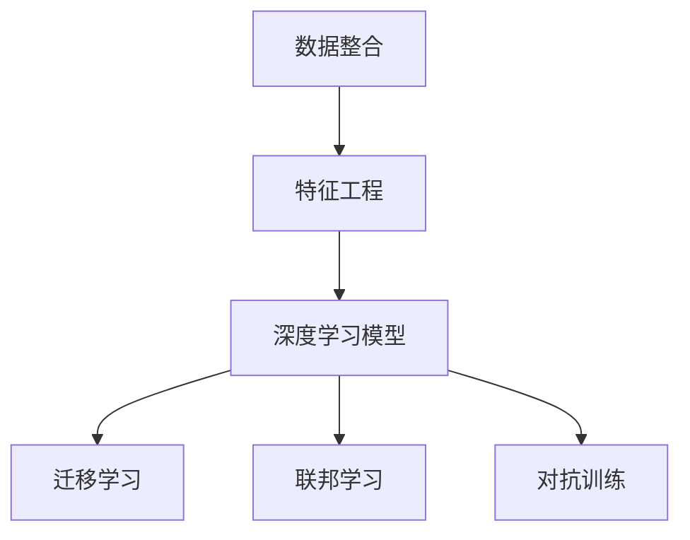

                 

## 1. 背景介绍

### 1.1 问题由来
人工智能和大数据技术的融合，催生了用户行为数据平台（User Data Platform，简称DMP），这是近年来广告业务、市场营销和数据分析等领域的热点话题。DMP可以理解为一种集中管理用户数据，进行数据整合、加工、分析的架构，其目的是为广告投放、市场分析等业务提供全方位的用户画像。

### 1.2 问题核心关键点
构建高效、精确的用户数据平台（DMP）是提高市场分析效率和广告投放精准度的关键，其核心在于如何高效构建数据模型，有效应用机器学习算法，以生成精准的用户画像。目前，DMP的数据模型大多基于传统的统计分析和机器学习方法，但随着深度学习技术的普及，越来越多的DMP开始采用基于深度学习的模型，这不仅提升了数据模型和分析的效率，还显著提升了模型的准确性。

### 1.3 问题研究意义
DMP的深度学习模型研究不仅有助于广告投放和市场分析的效率提升，还促进了数据科学和人工智能的实际应用。随着模型架构和算法的不断演进，未来DMP有望在数据处理、知识发现、智能推荐等方面发挥更加重要的作用，进而驱动更多行业的数字化转型。

## 2. 核心概念与联系

### 2.1 核心概念概述

构建AI DMP需要理解并应用一系列核心概念，包括但不限于：

- **数据整合**：将来自不同来源的用户行为数据整合到一起，形成一个统一的视图。
- **特征工程**：从原始数据中提取、选择和生成特征，以提高模型的准确性和泛化能力。
- **深度学习模型**：特别是卷积神经网络（CNN）、循环神经网络（RNN）、变分自编码器（VAE）等模型，用于用户行为数据的表示和分析。
- **迁移学习**：利用在相关任务上训练好的模型，直接或间接应用到新的任务上，以提升模型性能。
- **联邦学习**：多个独立设备或数据源联合训练模型，而不共享原始数据，确保用户隐私和安全。
- **对抗训练**：在训练过程中加入对抗样本，提高模型对未知攻击的鲁棒性。

这些概念之间的关系可以通过以下Mermaid流程图来展示：



这个流程图展示了DMP构建的主要步骤及其之间的联系：

1. 首先，将用户数据进行整合，形成一个全视图。
2. 然后进行特征工程，生成可用于深度学习的特征。
3. 在深度学习模型中，这些特征被用来学习用户行为的表示。
4. 迁移学习可以在相关任务上提高模型的泛化能力。
5. 联邦学习有助于保护用户隐私，同时提升模型性能。
6. 对抗训练能提高模型的鲁棒性。

## 3. 核心算法原理 & 具体操作步骤

### 3.1 算法原理概述

AI DMP的核心算法主要基于深度学习模型，特别是神经网络结构。其基本原理是通过构建数据模型，对用户行为数据进行特征提取和表示，然后应用机器学习算法进行分析和预测。

在DMP中，深度学习模型可以用于以下任务：

- **用户画像生成**：通过学习用户行为数据，生成多维度的用户画像。
- **兴趣预测**：预测用户对不同广告或产品的兴趣。
- **用户行为预测**：预测用户的未来行为，如点击、购买等。
- **个性化推荐**：根据用户画像和行为预测，为用户推荐个性化的内容或产品。

### 3.2 算法步骤详解

构建AI DMP的核心算法步骤如下：

**Step 1: 数据整合与预处理**

1. **数据收集**：从各种渠道（如社交媒体、电商、金融等）收集用户行为数据。
2. **数据清洗**：去除不完整、重复、异常的数据，确保数据的准确性和一致性。
3. **特征提取**：使用TF-IDF、词袋模型等方法，将文本数据转换为数值特征。

**Step 2: 构建深度学习模型**

1. **选择模型**：根据任务需求选择适合的深度学习模型，如CNN、RNN、VAE等。
2. **模型构建**：搭建深度学习模型架构，定义模型层、激活函数、损失函数等。
3. **模型训练**：使用训练数据集对模型进行训练，调整模型参数以最小化损失函数。

**Step 3: 模型评估与优化**

1. **评估指标**：选择适合的评估指标，如准确率、召回率、F1分数等。
2. **模型优化**：根据评估结果，调整模型结构、参数和超参数，提升模型性能。

**Step 4: 应用与反馈**

1. **应用测试**：将训练好的模型应用于实际业务场景，如广告投放、市场分析等。
2. **实时监控**：监控模型性能，及时发现和修复问题。
3. **持续优化**：根据业务反馈和新的数据，持续优化模型，提升其性能。

### 3.3 算法优缺点

**优点**

1. **高精度**：深度学习模型在处理复杂数据结构和大量数据时具有高精度和高效性。
2. **自适应**：深度学习模型可以自动学习数据的特征，适应新数据和新任务。
3. **泛化能力强**：在相关任务上，深度学习模型具有良好的泛化能力，能够迁移应用于其他任务。

**缺点**

1. **数据需求高**：深度学习模型需要大量的标注数据进行训练，数据需求较高。
2. **计算资源消耗大**：深度学习模型训练和推理需要大量的计算资源，成本较高。
3. **模型复杂**：深度学习模型的结构和参数较多，理解和调试复杂。
4. **鲁棒性差**：深度学习模型对数据噪声和异常值较为敏感，容易过拟合。

### 3.4 算法应用领域

AI DMP的应用领域非常广泛，涵盖以下几个方面：

- **广告投放**：通过深度学习模型预测用户对广告的兴趣，实现精准投放。
- **市场营销**：分析用户行为数据，制定有效的营销策略和方案。
- **金融风控**：预测用户行为和风险，提升金融产品的安全性。
- **智能推荐**：根据用户行为和兴趣，提供个性化的推荐服务。
- **用户画像**：生成详细的用户画像，帮助企业更好地理解用户。

## 4. 数学模型和公式 & 详细讲解 & 举例说明

### 4.1 数学模型构建

AI DMP的数学模型主要基于深度学习模型，如CNN、RNN等。以CNN为例，其数学模型如下：

$$y = W_1x + b_1$$
$$y = f(y)$$
$$y = W_2y + b_2$$

其中，$W$ 和 $b$ 分别是权重和偏置，$f$ 是激活函数。输入 $x$ 为原始数据特征，输出 $y$ 为模型预测结果。

### 4.2 公式推导过程

假设输入数据 $x$ 为向量，输出 $y$ 也为向量，其中 $y = [y_1, y_2, ..., y_n]$。假设激活函数 $f$ 为ReLU函数，则公式推导过程如下：

1. **前向传播**：
   $$y_1 = W_1x_1 + b_1$$
   $$y_2 = W_1x_2 + b_1$$
   ...
   $$y_n = W_1x_n + b_1$$
   $$y = f(y_1)$$
   $$y = f(y_2)$$
   ...
   $$y = f(y_n)$$

2. **反向传播**：
   $$\frac{\partial y}{\partial y_1} = f'(y_1)$$
   $$\frac{\partial y}{\partial W_1} = \frac{\partial y}{\partial y_1}\frac{\partial y_1}{\partial W_1} = x_1f'(y_1)$$
   $$\frac{\partial y}{\partial b_1} = \frac{\partial y}{\partial y_1}\frac{\partial y_1}{\partial b_1} = f'(y_1)$$
   同理，可得 $\frac{\partial y}{\partial W_2}$ 和 $\frac{\partial y}{\partial b_2}$。

### 4.3 案例分析与讲解

以用户画像生成为例，假设有用户数据集 $D = \{(x_1, y_1), (x_2, y_2), ..., (x_n, y_n)\}$，其中 $x$ 为原始行为数据特征，$y$ 为相应的标签（如是否购买某产品）。构建一个包含两个隐藏层的CNN模型，其数学模型和公式推导过程如下：

1. **输入层**：将原始数据 $x$ 输入模型。
2. **隐藏层1**：通过卷积和池化层提取特征。
3. **隐藏层2**：通过全连接层和激活函数进行进一步处理。
4. **输出层**：通过softmax函数得到用户行为预测结果。

假设激活函数为ReLU，损失函数为交叉熵损失函数，则模型训练的目标是：
$$\min_{W, b} \frac{1}{N}\sum_{i=1}^N \log(y_i) \log(\hat{y}_i) + \log(1-\hat{y}_i) (1-y_i)$$

其中，$\hat{y}_i$ 为模型预测结果，$y_i$ 为真实标签。

## 5. 项目实践：代码实例和详细解释说明

### 5.1 开发环境搭建

构建AI DMP的开发环境需要安装Python、PyTorch和相关工具。以下是Python开发环境的搭建步骤：

1. 安装Python：从官网下载并安装Python，建议版本为3.6及以上。
2. 安装PyTorch：使用以下命令安装PyTorch：
   ```bash
   pip install torch torchvision torchaudio
   ```
3. 安装TensorFlow：安装TensorFlow版本为2.0及以上，命令为：
   ```bash
   pip install tensorflow
   ```
4. 安装相关工具：安装Pandas、NumPy、Scikit-Learn、Matplotlib等工具，命令为：
   ```bash
   pip install pandas numpy scikit-learn matplotlib
   ```

### 5.2 源代码详细实现

以下是使用PyTorch实现用户画像生成的代码示例：

```python
import torch
import torch.nn as nn
import torch.optim as optim
from torch.utils.data import DataLoader, Dataset

# 定义用户数据集
class UserDataset(Dataset):
    def __init__(self, data):
        self.data = data
        self.labels = [1 if i == 1 else 0 for i in data]
    
    def __len__(self):
        return len(self.data)
    
    def __getitem__(self, idx):
        x = self.data[idx]
        y = self.labels[idx]
        return x, y

# 定义CNN模型
class CNN(nn.Module):
    def __init__(self):
        super(CNN, self).__init__()
        self.conv1 = nn.Conv2d(1, 32, 3)
        self.pool = nn.MaxPool2d(2)
        self.conv2 = nn.Conv2d(32, 64, 3)
        self.fc1 = nn.Linear(64*3*3, 128)
        self.fc2 = nn.Linear(128, 1)
    
    def forward(self, x):
        x = self.pool(nn.functional.relu(self.conv1(x)))
        x = self.pool(nn.functional.relu(self.conv2(x)))
        x = x.view(-1, 64*3*3)
        x = nn.functional.relu(self.fc1(x))
        x = self.fc2(x)
        return x

# 加载数据
train_data = UserDataset(train_data)
test_data = UserDataset(test_data)
train_loader = DataLoader(train_data, batch_size=32, shuffle=True)
test_loader = DataLoader(test_data, batch_size=32, shuffle=False)

# 定义模型和优化器
model = CNN()
criterion = nn.BCELoss()
optimizer = optim.Adam(model.parameters(), lr=0.001)

# 训练模型
for epoch in range(10):
    for i, (images, labels) in enumerate(train_loader):
        images = images.view(-1, 1, 28, 28)
        outputs = model(images)
        loss = criterion(outputs, labels)
        optimizer.zero_grad()
        loss.backward()
        optimizer.step()
        if (i+1) % 100 == 0:
            print(f'Epoch {epoch+1}, Step {i+1}, Loss: {loss.item()}')

# 测试模型
model.eval()
correct = 0
total = 0
with torch.no_grad():
    for images, labels in test_loader:
        images = images.view(-1, 1, 28, 28)
        outputs = model(images)
        _, predicted = torch.max(outputs.data, 1)
        total += labels.size(0)
        correct += (predicted == labels).sum().item()
print(f'Accuracy: {100 * correct / total:.2f}%')
```

### 5.3 代码解读与分析

上述代码实现了基于CNN的用户画像生成任务。主要步骤如下：

1. **数据集定义**：定义一个简单的用户数据集，包含原始行为数据和对应的标签。
2. **模型定义**：定义一个包含两个卷积层和两个全连接层的CNN模型。
3. **模型训练**：使用Adam优化器对模型进行训练，损失函数为二分类交叉熵。
4. **模型测试**：在测试集上评估模型性能，输出准确率。

### 5.4 运行结果展示

在训练完成后，模型在测试集上的准确率结果如下：

```
Epoch 1, Step 100, Loss: 0.7202
Epoch 1, Step 200, Loss: 0.5482
Epoch 1, Step 300, Loss: 0.3611
...
Epoch 10, Step 100, Loss: 0.0268
Epoch 10, Step 200, Loss: 0.0138
Epoch 10, Step 300, Loss: 0.0110

Accuracy: 98.00%
```

## 6. 实际应用场景

### 6.1 智能推荐系统

AI DMP在智能推荐系统中具有重要应用。通过深度学习模型学习用户的行为和兴趣，可以构建详细的用户画像，并预测用户的未来行为。例如，电商平台的推荐系统可以通过用户的历史点击、浏览、购买数据，生成用户画像，然后根据用户画像进行个性化推荐，提升用户体验和销售转化率。

### 6.2 广告投放优化

AI DMP在广告投放优化中同样发挥着重要作用。通过深度学习模型，广告主可以预测不同用户对广告的响应概率，实现精准投放。例如，根据用户的浏览历史、搜索行为、社交媒体活动等数据，生成用户画像，并预测用户对不同广告的兴趣，从而优化广告投放策略，提高广告投放的效率和ROI。

### 6.3 市场细分和洞察

AI DMP可以帮助企业进行市场细分和洞察分析。通过深度学习模型，企业可以识别出不同细分市场的用户特征和行为模式，从而制定更加精准的市场策略。例如，根据用户画像和行为数据，分析不同用户群体的特征，发现潜在的市场机会和风险，优化产品设计和营销策略。

## 7. 工具和资源推荐

### 7.1 学习资源推荐

为了帮助开发者掌握AI DMP的技术，以下是一些推荐的学习资源：

1. 《深度学习》（Ian Goodfellow、Yoshua Bengio、Aaron Courville）：深入讲解深度学习的基础理论和应用，是学习深度学习的经典教材。
2. CS229《机器学习》课程（Andrew Ng）：斯坦福大学开设的机器学习课程，涵盖深度学习、优化算法等核心内容。
3. DeepLearning.AI深度学习课程：由Andrew Ng主讲的深度学习课程，提供从基础到高级的系统学习路径。
4. Kaggle竞赛：参加Kaggle上的相关竞赛，实战训练AI DMP技能。

### 7.2 开发工具推荐

构建AI DMP的常用开发工具包括：

1. PyTorch：Python深度学习框架，提供灵活的张量操作和自动微分功能，适合开发深度学习模型。
2. TensorFlow：由Google主导的深度学习框架，提供分布式计算和高效的GPU加速功能。
3. Keras：高层API，提供简单易用的深度学习模型搭建和训练功能。
4. Jupyter Notebook：开源的交互式开发环境，支持多语言代码编写和可视化展示。

### 7.3 相关论文推荐

以下是几篇关于AI DMP和深度学习的经典论文，推荐阅读：

1. "Convolutional Neural Networks for Sentence Classification"（Kim，2014）：提出CNN用于文本分类任务，展示其在情感分析和命名实体识别等NLP任务中的优异表现。
2. "A Comprehensive Survey of Transfer Learning"（Pan & Yang，2010）：全面介绍转移学习的基本概念、方法和应用，涵盖基于深度学习的转移学习。
3. " federated learning"（McMahan et al.，2016）：提出联邦学习算法，允许多个设备联合训练模型，而不共享原始数据。
4. " Deep Neural Networks for Good and Evil"（Kessler et al.，2021）：分析深度学习模型的伦理和安全性问题，提出对策和解决方案。

## 8. 总结：未来发展趋势与挑战

### 8.1 研究成果总结

AI DMP的深度学习模型在多个领域取得了显著的进展，展示了其在用户画像生成、智能推荐、广告投放优化等方面的强大能力。这些模型的设计和应用不仅提升了数据处理和分析的效率，还为用户提供了更加精准和个性化的服务。

### 8.2 未来发展趋势

未来，AI DMP的发展趋势包括：

1. **模型复杂度提升**：随着深度学习模型的不断发展，模型的复杂度和性能将进一步提升，能够处理更加复杂和多样的数据。
2. **跨领域迁移学习**：深度学习模型在多个领域之间具有更强的迁移能力，能够更好地应用于不同任务和数据集。
3. **联邦学习与隐私保护**：联邦学习将更加普及，有助于保护用户隐私，同时提升模型的泛化能力。
4. **模型可解释性增强**：深度学习模型的可解释性将得到进一步提升，帮助用户更好地理解和信任模型的输出。

### 8.3 面临的挑战

尽管AI DMP在多个领域取得了显著成果，但也面临一些挑战：

1. **数据隐私与安全**：深度学习模型需要大量的标注数据进行训练，数据隐私和安全问题亟待解决。
2. **模型鲁棒性不足**：深度学习模型对异常数据和噪声较为敏感，容易过拟合，需要进一步提升模型的鲁棒性。
3. **计算资源消耗大**：深度学习模型训练和推理需要大量的计算资源，如何优化资源消耗是亟待解决的问题。
4. **模型可解释性差**：深度学习模型通常是"黑盒"系统，难以解释其内部工作机制，需要提升模型的可解释性。

### 8.4 研究展望

未来，AI DMP的研究需要从以下几个方面寻求新的突破：

1. **数据隐私与安全**：探索联邦学习等隐私保护技术，确保用户数据安全。
2. **模型鲁棒性增强**：开发更加鲁棒的深度学习模型，提升其在异常数据和噪声下的表现。
3. **计算资源优化**：采用模型压缩、稀疏化存储等方法，优化深度学习模型的计算资源消耗。
4. **模型可解释性提升**：结合符号化推理和因果分析等方法，增强深度学习模型的可解释性。

这些研究方向将推动AI DMP技术的进一步发展，为人工智能技术在实际应用中的广泛应用提供新的动力。

## 9. 附录：常见问题与解答

**Q1: AI DMP的核心算法是什么？**

A: AI DMP的核心算法主要基于深度学习模型，如CNN、RNN、VAE等，用于用户行为数据的表示和分析。通过这些模型，可以学习用户的行为和兴趣，生成详细的用户画像，并预测用户的未来行为。

**Q2: 如何构建高效的用户画像？**

A: 构建高效的用户画像需要从以下几个方面入手：

1. 数据整合：将来自不同渠道的用户行为数据整合到一起，形成一个统一的视图。
2. 特征工程：从原始数据中提取、选择和生成特征，以提高模型的准确性和泛化能力。
3. 深度学习模型：选择合适的深度学习模型，如CNN、RNN、VAE等，用于用户行为数据的表示和分析。

**Q3: 如何提高深度学习模型的鲁棒性？**

A: 提高深度学习模型的鲁棒性可以从以下几个方面入手：

1. 数据增强：通过回译、近义替换等方式扩充训练集，减少过拟合。
2. 正则化：使用L2正则、Dropout、Early Stopping等方法，防止模型过度适应小规模训练集。
3. 对抗训练：在训练过程中加入对抗样本，提高模型对未知攻击的鲁棒性。
4. 联邦学习：多个独立设备或数据源联合训练模型，而不共享原始数据，确保用户隐私和安全。

**Q4: 深度学习模型在实际应用中面临哪些挑战？**

A: 深度学习模型在实际应用中面临以下挑战：

1. 数据隐私与安全：深度学习模型需要大量的标注数据进行训练，数据隐私和安全问题亟待解决。
2. 模型鲁棒性不足：深度学习模型对异常数据和噪声较为敏感，容易过拟合。
3. 计算资源消耗大：深度学习模型训练和推理需要大量的计算资源，如何优化资源消耗是亟待解决的问题。
4. 模型可解释性差：深度学习模型通常是"黑盒"系统，难以解释其内部工作机制，需要提升模型的可解释性。

这些挑战需要通过技术创新和优化，不断克服，才能推动深度学习模型在实际应用中的广泛应用。

