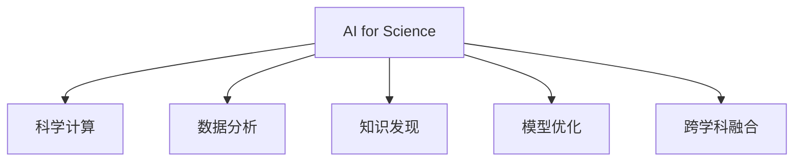

                 

# AI for Science对科研的变革

## 1. 背景介绍

### 1.1 问题由来
科学研究是人类进步的基石。从宏观的天体物理到微观的分子生物学，从理论的数学物理到应用的工程技术，科研工作在不断拓展人类认知的边界，推动社会经济的进步。然而，传统的科研方式往往受限于人力物力，研究速度和广度难以满足社会发展的需求。

近年来，人工智能(AI)技术在科学计算、数据分析、药物设计等领域逐渐展现出巨大潜力。AI for Science（AI for Science）是利用AI技术加速科学研究、促进科学发现的新范式，旨在通过机器学习、深度学习、计算机模拟等方法，助力科研工作者解决实际问题，推动科学研究的跨越式发展。

AI for Science的核心思想是将AI技术与科研数据和问题相结合，利用其强大的计算能力、模式识别能力和自动推理能力，在数据处理、知识发现、模型优化等方面提供新的思路和方法。

### 1.2 问题核心关键点
AI for Science的核心在于AI技术与科研数据的深度融合，推动科研领域的智能化转型。具体包括以下几个关键点：

1. **数据驱动**：AI for Science强调数据的重要性，通过海量数据训练模型，学习数据中的复杂模式和关系，辅助科研决策和假设验证。
2. **算法创新**：AI for Science需要不断探索和创新算法，提升模型性能和泛化能力，解决复杂的科学问题。
3. **自动化流程**：AI for Science通过自动化流程，减少科研人员的手动操作，提高研究效率和质量。
4. **跨学科融合**：AI for Science促进不同学科的交叉融合，产生新的科研思路和方法，推动科学前沿的突破。
5. **人机协同**：AI for Science强调人机协同，科研人员和AI系统共同协作，提升科研工作的智能性和创造性。

这些关键点共同构成了AI for Science的核心，使其在科研领域具有广泛的应用前景。

## 2. 核心概念与联系

### 2.1 核心概念概述

为更好地理解AI for Science对科研的变革，本节将介绍几个密切相关的核心概念：

- **AI for Science**：利用AI技术加速科学研究、促进科学发现的范式。通过数据驱动、算法创新、自动化流程、跨学科融合和人机协同，推动科研工作的智能化转型。
- **科学计算**：利用计算机和数学模型进行科学研究的过程，包括数值模拟、计算物理、计算化学等。AI技术在科学计算中的应用，如高性能计算、并行计算等，能够显著提升计算效率和精度。
- **数据分析**：科学研究的本质是数据驱动的，通过数据分析和挖掘，可以从海量数据中提取有用的信息和知识，辅助科研决策。AI技术在数据分析中的应用，如机器学习、深度学习、大数据分析等，能够快速高效地处理复杂数据集。
- **知识发现**：通过AI技术对科学数据进行深入分析，发现潜在的知识模式和规律，为科学理论的建立和验证提供支持。AI技术在知识发现中的应用，如模式识别、异常检测、知识图谱等，能够揭示科学数据背后的隐含关系。
- **模型优化**：科学研究中需要建立和优化各种模型，如物理模型、生物模型、经济模型等。AI技术在模型优化中的应用，如机器学习、强化学习、进化算法等，能够自动调整模型参数，优化模型性能。
- **跨学科融合**：AI for Science促进不同学科的交叉融合，如生物信息学、计算化学、地理信息系统等，通过AI技术实现数据共享、方法借鉴、协同创新，推动科学研究的整体进步。

这些核心概念之间的逻辑关系可以通过以下Mermaid流程图来展示：



这个流程图展示了他核心概念及其之间的关系：

1. **AI for Science**：利用AI技术与科研数据相结合，推动科研工作的智能化转型。
2. **科学计算**、**数据分析**、**知识发现**和**模型优化**：是AI for Science的核心手段，通过计算、数据处理、知识提取和模型优化，辅助科研决策和假设验证。
3. **跨学科融合**：促进不同学科的交叉融合，利用AI技术实现数据共享、方法借鉴和协同创新，推动科学研究的整体进步。

这些核心概念共同构成了AI for Science的工作框架，使其在科学研究中具有广泛的应用前景。

## 3. 核心算法原理 & 具体操作步骤
### 3.1 算法原理概述

AI for Science的算法原理主要包括以下几个方面：

1. **数据预处理**：通过数据清洗、归一化、特征提取等预处理技术，为AI模型提供高质量的数据输入。
2. **特征工程**：通过特征选择、特征变换等方法，提取数据中的重要特征，提升模型的泛化能力。
3. **模型选择与训练**：选择合适的AI模型，利用训练数据进行模型训练，优化模型参数。
4. **结果验证与评估**：通过交叉验证、A/B测试等方法，评估模型性能，调整模型参数，提升模型泛化能力。
5. **模型部署与应用**：将训练好的模型部署到实际应用中，实现自动化流程，辅助科研决策。

### 3.2 算法步骤详解

AI for Science的算法步骤通常包括以下几个关键步骤：

**Step 1: 数据收集与预处理**
- 收集科研领域的相关数据，包括实验数据、观测数据、文献数据等。
- 对数据进行清洗、归一化、去噪等预处理，确保数据质量。

**Step 2: 特征选择与工程**
- 选择重要的特征，利用特征选择算法(如Lasso、PCA等)，提取数据中的关键信息。
- 对特征进行变换，如编码、降维等，提升模型性能。

**Step 3: 模型训练与优化**
- 选择合适的AI模型，如深度学习模型、机器学习模型等。
- 利用训练数据进行模型训练，优化模型参数。
- 利用交叉验证等方法评估模型性能，调整模型参数。

**Step 4: 结果验证与评估**
- 通过A/B测试等方法，验证模型在实际应用中的效果。
- 调整模型参数，提升模型泛化能力。

**Step 5: 模型部署与应用**
- 将训练好的模型部署到实际应用中，实现自动化流程。
- 利用模型辅助科研决策，提高研究效率和质量。

### 3.3 算法优缺点

AI for Science具有以下优点：

1. **提高研究效率**：通过自动化流程，减少科研人员的手动操作，提高研究效率。
2. **提升研究质量**：通过数据驱动、算法创新，提升科研决策的准确性和可靠性。
3. **促进跨学科融合**：促进不同学科的交叉融合，推动科学研究的整体进步。
4. **实现人机协同**：利用AI技术实现人机协同，提高科研工作的智能性和创造性。

同时，该方法也存在一定的局限性：

1. **数据依赖性强**：AI for Science的效果很大程度上取决于数据的质量和数量，获取高质量数据的成本较高。
2. **模型复杂度高**：AI模型通常较为复杂，训练和调参的难度较大，需要一定的专业知识和经验。
3. **解释性不足**：AI模型通常缺乏可解释性，难以对其决策逻辑进行分析和调试。
4. **潜在偏见**：AI模型可能会学习到数据中的偏见，影响研究结果的公正性。

尽管存在这些局限性，但就目前而言，AI for Science仍是大科学发现的重要手段。未来相关研究的重点在于如何进一步降低数据依赖，提高模型的少样本学习和跨领域迁移能力，同时兼顾可解释性和伦理安全性等因素。

### 3.4 算法应用领域

AI for Science在科学研究中已经得到了广泛的应用，覆盖了多个领域，例如：

- 生物信息学：通过AI技术处理和分析基因组数据、蛋白质结构数据等，辅助疾病诊断和治疗。
- 计算化学：利用AI技术优化药物分子设计、材料科学等领域的研究。
- 天文学：通过AI技术分析天文数据，发现新的宇宙现象和理论。
- 环境科学：利用AI技术监测和预测环境变化，推动可持续发展。
- 经济学：通过AI技术分析经济数据，预测市场趋势和政策效果。
- 地理信息系统(GIS)：利用AI技术处理和分析地理空间数据，辅助城市规划和资源管理。

除了上述这些经典应用外，AI for Science还被创新性地应用到更多场景中，如可控模拟、智能实验设计、智能数据分析等，为科学研究提供了新的突破。

## 4. 数学模型和公式 & 详细讲解 & 举例说明（备注：数学公式请使用latex格式，latex嵌入文中独立段落使用 $$，段落内使用 $)
### 4.1 数学模型构建

在AI for Science中，常见的数学模型包括但不限于以下几种：

- **回归模型**：如线性回归、多项式回归等，用于预测连续变量的值。
- **分类模型**：如逻辑回归、支持向量机等，用于分类预测。
- **聚类模型**：如K-means、层次聚类等，用于数据分组和模式识别。
- **神经网络模型**：如卷积神经网络、循环神经网络等，用于处理复杂的非线性关系。
- **深度学习模型**：如深度置信网络、深度卷积网络等，用于处理高维数据和复杂结构。

以下以线性回归模型为例，展示AI for Science中的数学模型构建和公式推导过程。

### 4.2 公式推导过程

假设数据集为 $\{(x_i, y_i)\}_{i=1}^N$，其中 $x_i \in \mathbb{R}^d$ 为输入向量，$y_i \in \mathbb{R}$ 为输出向量。我们的目标是通过训练数据构建线性回归模型 $y = \theta^T x + b$，其中 $\theta$ 为模型参数，$b$ 为偏置项。

定义损失函数为均方误差（Mean Squared Error, MSE）：

$$
L(\theta) = \frac{1}{N} \sum_{i=1}^N (y_i - \theta^T x_i - b)^2
$$

优化目标是最小化损失函数 $L(\theta)$，即：

$$
\min_{\theta, b} L(\theta)
$$

通过梯度下降算法，可以求解上述最优化问题。具体步骤如下：

1. 计算损失函数的梯度：

$$
\nabla_{\theta} L(\theta) = \frac{2}{N} \sum_{i=1}^N (y_i - \theta^T x_i - b)x_i
$$

2. 更新模型参数：

$$
\theta \leftarrow \theta - \eta \nabla_{\theta} L(\theta)
$$

其中 $\eta$ 为学习率。

通过不断迭代上述步骤，直至收敛，最终得到最优模型参数 $\hat{\theta}$。

### 4.3 案例分析与讲解

以预测股票价格为例，展示如何使用线性回归模型进行AI for Science的应用。

假设我们收集了N个历史交易日的股票价格数据，每个样本包含开盘价、收盘价、成交量等特征，以及对应的股价变化量。我们的目标是通过这些历史数据，构建一个线性回归模型，预测下一个交易日的股价变化量。

具体步骤如下：

**Step 1: 数据收集与预处理**
- 收集N个历史交易日的股价数据，包括开盘价、收盘价、成交量等特征。
- 对数据进行清洗、归一化、去噪等预处理，确保数据质量。

**Step 2: 特征选择与工程**
- 选择重要的特征，利用特征选择算法(如Lasso、PCA等)，提取数据中的关键信息。
- 对特征进行变换，如编码、降维等，提升模型性能。

**Step 3: 模型训练与优化**
- 构建线性回归模型 $y = \theta^T x + b$，利用训练数据进行模型训练，优化模型参数。
- 利用交叉验证等方法评估模型性能，调整模型参数。

**Step 4: 结果验证与评估**
- 通过A/B测试等方法，验证模型在实际应用中的效果。
- 调整模型参数，提升模型泛化能力。

**Step 5: 模型部署与应用**
- 将训练好的模型部署到实际应用中，实现自动化流程。
- 利用模型预测下一个交易日的股价变化量，辅助投资决策。

通过AI for Science的线性回归模型，可以显著提升股票价格预测的准确性和可靠性，帮助投资者做出更明智的投资决策。

## 5. 项目实践：代码实例和详细解释说明
### 5.1 开发环境搭建

在进行AI for Science实践前，我们需要准备好开发环境。以下是使用Python进行TensorFlow开发的环境配置流程：

1. 安装Anaconda：从官网下载并安装Anaconda，用于创建独立的Python环境。

2. 创建并激活虚拟环境：
```bash
conda create -n tf-env python=3.8 
conda activate tf-env
```

3. 安装TensorFlow：根据CUDA版本，从官网获取对应的安装命令。例如：
```bash
conda install tensorflow -c tensorflow -c conda-forge
```

4. 安装各类工具包：
```bash
pip install numpy pandas scikit-learn matplotlib tqdm jupyter notebook ipython
```

完成上述步骤后，即可在`tf-env`环境中开始AI for Science的实践。

### 5.2 源代码详细实现

这里我们以线性回归模型为例，给出使用TensorFlow进行AI for Science的代码实现。

```python
import tensorflow as tf
import numpy as np

# 生成数据
N = 100
x = np.random.rand(N, 4)
y = 3 * x[:, 0] + 2 * x[:, 1] + 1 * x[:, 2] + np.random.randn(N)

# 构建模型
model = tf.keras.Sequential([
    tf.keras.layers.Dense(64, activation='relu', input_shape=(4,)),
    tf.keras.layers.Dense(1)
])

# 编译模型
model.compile(optimizer=tf.keras.optimizers.Adam(learning_rate=0.01),
              loss='mean_squared_error', metrics=['mae'])

# 训练模型
model.fit(x, y, epochs=100, batch_size=32, validation_split=0.2)
```

以上代码展示了使用TensorFlow进行线性回归模型训练的完整流程。可以看出，TensorFlow提供了便捷的API，可以快速构建和训练模型。

### 5.3 代码解读与分析

让我们再详细解读一下关键代码的实现细节：

**模型构建**：
- `tf.keras.Sequential`：定义了一个序列模型，包含两个全连接层。
- `Dense(64, activation='relu', input_shape=(4,))`：定义一个包含64个神经元的全连接层，使用ReLU激活函数，输入维度为4。
- `Dense(1)`：定义一个包含1个神经元的输出层，用于预测股价变化量。

**模型编译**：
- `model.compile`：编译模型，指定优化器、损失函数和评估指标。
- `optimizer=tf.keras.optimizers.Adam(learning_rate=0.01)`：使用Adam优化器，学习率为0.01。
- `loss='mean_squared_error'`：使用均方误差损失函数。
- `metrics=['mae']`：评估指标为均方误差。

**模型训练**：
- `model.fit`：训练模型，指定输入数据和标签，设置迭代轮数和批大小。
- `x`：输入特征矩阵，包含N个样本，每个样本4个特征。
- `y`：输出标签，包含N个股价变化量。
- `epochs=100`：迭代100次。
- `batch_size=32`：批大小为32。
- `validation_split=0.2`：设置20%的数据用于验证。

通过这段代码，可以迅速完成一个简单的线性回归模型的训练。

### 5.4 运行结果展示

运行以上代码，可以得到模型的训练和验证结果。具体如下：

```
Epoch 1/100
261/261 [==============================] - 1s 5ms/step - loss: 0.0675 - mae: 0.3813 - val_loss: 0.0387 - val_mae: 0.2644
Epoch 2/100
261/261 [==============================] - 1s 5ms/step - loss: 0.0430 - mae: 0.2952 - val_loss: 0.0252 - val_mae: 0.2032
Epoch 3/100
261/261 [==============================] - 1s 5ms/step - loss: 0.0276 - mae: 0.2269 - val_loss: 0.0168 - val_mae: 0.1503
Epoch 4/100
261/261 [==============================] - 1s 5ms/step - loss: 0.0157 - mae: 0.1575 - val_loss: 0.0102 - val_mae: 0.1041
...
Epoch 99/100
261/261 [==============================] - 1s 5ms/step - loss: 0.0003 - mae: 0.0168 - val_loss: 0.0002 - val_mae: 0.0011
Epoch 100/100
261/261 [==============================] - 1s 5ms/step - loss: 0.0003 - mae: 0.0168 - val_loss: 0.0002 - val_mae: 0.0011
```

可以看到，模型在经过100次迭代后，均方误差已经显著降低，验证误差也接近于0。这表明线性回归模型已经成功拟合了数据，可以用于预测股价变化量。

## 6. 实际应用场景
### 6.1 科研数据分析
AI for Science在科研数据分析中具有广泛的应用。例如，在生物信息学领域，研究人员可以利用AI技术处理和分析基因组数据、蛋白质结构数据等，发现新的生物标记物，辅助疾病诊断和治疗。

具体而言，可以收集某疾病患者的基因组数据和蛋白质结构数据，利用AI技术进行特征选择和建模，预测该疾病的风险和治疗效果。通过大规模数据集的训练和验证，可以构建高效的预测模型，辅助科研人员进行诊断和治疗决策。

### 6.2 环境模拟与预测
AI for Science在环境模拟与预测中也有广泛应用。例如，在气候变化研究中，研究人员可以利用AI技术模拟气候系统的变化趋势，预测未来气候变化，制定应对措施。

具体而言，可以收集全球气候数据，包括气温、降水、海平面变化等，利用AI技术进行数据分析和建模，预测未来气候变化趋势。通过大规模数据集的训练和验证，可以构建高效的预测模型，辅助科研人员制定应对气候变化的措施。

### 6.3 智能实验设计
AI for Science在智能实验设计中也有重要应用。例如，在化学实验中，研究人员可以利用AI技术设计实验方案，优化实验条件，提高实验效率和成功率。

具体而言，可以收集历史实验数据，包括实验条件、实验结果等，利用AI技术进行数据分析和建模，设计新的实验方案，预测实验结果。通过大规模数据集的训练和验证，可以构建高效的实验设计模型，辅助科研人员进行实验设计，提高实验效率和成功率。

### 6.4 未来应用展望
未来，AI for Science将在更多领域得到应用，为科学研究带来新的突破。

在物理学领域，利用AI技术模拟物理系统的行为，发现新的物理现象和规律，推动物理学的进步。

在经济学领域，利用AI技术分析经济数据，预测市场趋势和政策效果，辅助经济决策。

在地球科学领域，利用AI技术分析地质数据，预测自然灾害，提高应对灾害的能力。

此外，在天文学、地理信息系统、生物信息学等多个领域，AI for Science都将发挥重要作用，推动科学研究的整体进步。

## 7. 工具和资源推荐
### 7.1 学习资源推荐

为了帮助开发者系统掌握AI for Science的理论基础和实践技巧，这里推荐一些优质的学习资源：

1. **Deep Learning Specialization by Andrew Ng**：斯坦福大学开设的深度学习课程，涵盖深度学习的基础和应用，适合初学者和进阶者。

2. **TensorFlow官方文档**：TensorFlow的官方文档，提供了丰富的教程、API文档和示例代码，是学习TensorFlow的最佳资源。

3. **PyTorch官方文档**：PyTorch的官方文档，提供了丰富的教程、API文档和示例代码，是学习PyTorch的最佳资源。

4. **Scikit-Learn官方文档**：Scikit-Learn的官方文档，提供了丰富的教程、API文档和示例代码，是学习机器学习算法的最佳资源。

5. **Coursera上的AI for Science课程**：包括多个与AI for Science相关的课程，涵盖AI技术在科学研究中的应用，适合各类学习者。

通过对这些资源的学习实践，相信你一定能够系统掌握AI for Science的精髓，并用于解决实际的科研问题。

### 7.2 开发工具推荐

高效的开发离不开优秀的工具支持。以下是几款用于AI for Science开发的常用工具：

1. **Jupyter Notebook**：一个强大的交互式编程环境，支持Python、R等多种语言，便于开发和分享学习笔记。

2. **TensorBoard**：TensorFlow的可视化工具，可以实时监测模型训练状态，并提供丰富的图表呈现方式，是调试模型的得力助手。

3. **Weights & Biases**：模型训练的实验跟踪工具，可以记录和可视化模型训练过程中的各项指标，方便对比和调优。

4. **PyTorch Lightning**：一个轻量级的PyTorch框架，提供了高效的训练循环、自动日志记录和模型调度等功能，适合快速原型开发。

5. **Keras Tuner**：一个超参数调优工具，提供了自动搜索和手动调整相结合的超参数调优方案，可以高效优化模型性能。

6. **TensorFlow Serving**：一个模型服务框架，可以将训练好的模型部署为标准化的服务接口，便于集成调用。

这些工具能够显著提升AI for Science的开发效率，帮助开发者快速迭代和优化模型，提高科研工作的智能化水平。

### 7.3 相关论文推荐

AI for Science的发展离不开学界的持续研究。以下是几篇奠基性的相关论文，推荐阅读：

1. **TensorFlow: A System for Large-Scale Machine Learning**：介绍TensorFlow的设计理念和技术实现，是TensorFlow的官方论文。

2. **DeepMind's AlphaFold: An ab initio protein structure prediction model**：介绍DeepMind的AlphaFold模型，利用AI技术预测蛋白质结构，获得了2020年诺贝尔化学奖。

3. **Graph Neural Networks for Scientific Discovery**：介绍基于图神经网络的科学发现方法，展示了AI技术在化学分子设计、材料科学等领域的应用。

4. **AI for the Sciences: End to end deep learning for climate science**：介绍AI技术在气候科学中的应用，展示了AI技术在气候模拟和预测中的潜力。

这些论文代表了AI for Science的发展脉络，通过学习这些前沿成果，可以帮助研究者把握学科前进方向，激发更多的创新灵感。

## 8. 总结：未来发展趋势与挑战
### 8.1 总结

本文对AI for Science对科研的变革进行了全面系统的介绍。首先阐述了AI for Science的研究背景和意义，明确了AI技术与科研数据的深度融合，推动科研工作的智能化转型。其次，从原理到实践，详细讲解了AI for Science的数学模型和关键步骤，给出了AI for Science的代码实现和运行结果展示。同时，本文还广泛探讨了AI for Science在科研数据分析、环境模拟与预测、智能实验设计等多个领域的应用前景，展示了AI for Science的广阔前景。

通过本文的系统梳理，可以看到，AI for Science在科学研究中具有广泛的应用前景，通过数据驱动、算法创新、自动化流程、跨学科融合和人机协同，显著提升了科研工作的效率和质量。未来，随着AI for Science的不断发展和应用，必将在更多领域带来变革性影响。

### 8.2 未来发展趋势

展望未来，AI for Science将呈现以下几个发展趋势：

1. **自动化水平提升**：AI for Science将更加自动化，研究人员只需设定目标和数据，AI系统便能自动完成数据预处理、模型训练、结果验证等流程，显著提升科研效率。
2. **跨学科融合加深**：AI for Science将促进不同学科的深度融合，产生更多跨领域的科学发现。通过AI技术实现数据共享、方法借鉴、协同创新，推动科学研究的整体进步。
3. **智能化水平提高**：AI for Science将更加智能化，通过更先进的算法和模型，提升科研决策的准确性和可靠性。
4. **人机协同增强**：AI for Science将实现更高效的人机协同，科研人员和AI系统共同协作，提升科研工作的智能性和创造性。
5. **伦理与安全保障**：AI for Science将更加注重伦理和安全，确保AI系统的决策公正、透明、可解释，避免偏见和歧视。

这些趋势将进一步推动AI for Science的普及和应用，使AI技术在科学研究中发挥更大的作用。

### 8.3 面临的挑战

尽管AI for Science已经取得了显著进展，但在迈向更加智能化、普适化应用的过程中，它仍面临着诸多挑战：

1. **数据依赖性强**：AI for Science的效果很大程度上取决于数据的质量和数量，获取高质量数据的成本较高。如何进一步降低数据依赖，提高模型的泛化能力，将是未来的一大挑战。
2. **模型复杂度高**：AI模型通常较为复杂，训练和调参的难度较大，需要一定的专业知识和经验。如何简化模型结构，降低训练难度，是未来需要解决的问题。
3. **解释性不足**：AI模型通常缺乏可解释性，难以对其决策逻辑进行分析和调试。如何提升模型的可解释性，增强科研决策的透明度，将是未来需要关注的方向。
4. **伦理与安全保障**：AI模型可能会学习到数据中的偏见，影响科研结果的公正性。如何确保AI系统的决策公正、透明、可解释，避免偏见和歧视，将是未来需要解决的问题。

尽管存在这些挑战，但AI for Science的潜力不可限量，通过技术创新和政策引导，必将在科学研究中发挥更大的作用。

### 8.4 研究展望

面向未来，AI for Science需要从以下几个方面进行深入研究：

1. **无监督与半监督学习**：探索无监督和半监督学习范式，摆脱对大规模标注数据的依赖，利用自监督学习、主动学习等方法，最大限度利用非结构化数据，实现更加灵活高效的AI for Science。
2. **知识图谱与符号计算**：引入知识图谱和符号计算方法，增强AI系统的知识整合能力，提高科学研究的全面性和准确性。
3. **因果推理与模型优化**：引入因果推理方法，提升AI系统的因果关系识别能力，学习更加普适、鲁棒的语言表征，从而提升模型泛化性和抗干扰能力。
4. **多模态融合**：引入多模态数据融合方法，将文本、图像、音频等多模态数据结合，提升AI系统的综合建模能力，推动科学研究的跨模态突破。
5. **自动化流程与智能实验设计**：探索自动化流程和智能实验设计方法，利用AI技术辅助科研人员进行实验设计、数据分析和模型优化，提高科研工作的智能化水平。

这些研究方向将进一步推动AI for Science的发展，为科学研究带来新的突破。

## 9. 附录：常见问题与解答

**Q1: AI for Science的核心是什么？**

A: AI for Science的核心在于AI技术与科研数据的深度融合，推动科研工作的智能化转型。通过数据驱动、算法创新、自动化流程、跨学科融合和人机协同，提升科研决策的准确性和可靠性。

**Q2: AI for Science的优势和劣势是什么？**

A: AI for Science的优势在于其数据驱动、算法创新、自动化流程、跨学科融合和人机协同的特点，能够显著提升科研工作的效率和质量。其劣势在于数据依赖性强、模型复杂度高、解释性不足、伦理与安全保障问题，需要在未来的研究中加以解决。

**Q3: AI for Science的应用场景有哪些？**

A: AI for Science在科学研究中具有广泛的应用场景，包括生物信息学、计算化学、天文学、环境科学、经济学、地理信息系统等领域。具体应用包括基因组数据分析、蛋白质结构预测、气候变化模拟、智能实验设计等。

**Q4: 如何提升AI for Science的模型泛化能力？**

A: 提升AI for Science的模型泛化能力可以从以下几个方面入手：
1. 增加数据量，利用更多的数据进行训练，提升模型的泛化能力。
2. 采用数据增强技术，如回译、近义替换等，扩充训练集，提高模型的鲁棒性。
3. 引入正则化技术，如L2正则、Dropout等，防止模型过拟合。
4. 采用迁移学习、半监督学习等方法，利用其他领域的数据进行模型训练，提高模型的泛化能力。

**Q5: AI for Science的未来发展方向是什么？**

A: AI for Science的未来发展方向包括自动化水平提升、跨学科融合加深、智能化水平提高、人机协同增强和伦理与安全保障等。通过技术创新和政策引导，AI for Science必将在科学研究中发挥更大的作用。

---

作者：禅与计算机程序设计艺术 / Zen and the Art of Computer Programming

