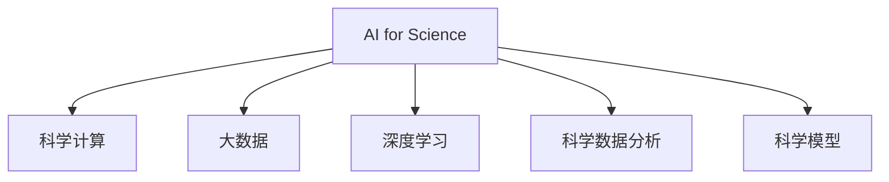

                 

# AI for Science的科研范式变革

> 关键词：人工智能,科学研究,机器学习,深度学习,科学计算,大数据,生物信息学,天气预报,材料科学,加速科学

## 1. 背景介绍

### 1.1 问题由来

在过去的几十年里，科学技术的发展在很大程度上依赖于人类科学家对物理世界的直接观察和实验室实验。然而，随着数据量的指数级增长，传统的科研方法已经难以满足日益增长的数据分析需求。在此背景下，人工智能（AI）技术特别是深度学习、机器学习等方法，逐渐成为科学研究中不可或缺的重要工具。

深度学习、大数据、科学计算等AI技术已经成功应用于诸多领域，从生物信息学、天文学、材料科学到天气预报、药物发现等，都在实践中展示了其强大的潜力和变革性影响。AI技术不仅加速了科学研究的进程，更改变了科研范式，推动了科学研究的边界不断扩展。

### 1.2 问题核心关键点

AI for Science的核心在于如何利用AI技术特别是深度学习等方法，提升科学数据的处理与分析效率，加速科学研究的过程，并在科学领域中实现深度学习模型的广泛应用。这一过程中，关键点在于以下几个方面：

- **数据驱动**：AI for Science的核心在于数据驱动，即依赖于大数据、深度学习等方法，自动提取数据中的有效信息，帮助科学家发现新的知识。
- **模型预测**：构建高效的深度学习模型，能够准确预测物理现象或实验结果，从而为科学研究提供新的线索和方向。
- **自动推断**：利用AI技术自动推断科学规律，减少人工干预，提高科研效率。
- **跨学科应用**：AI技术能够跨越不同学科领域，为多个科学问题提供解决方案，推动科学研究的交叉融合。
- **开放协作**：AI for Science鼓励开放协作，利用共享数据、模型和知识，促进科学研究的全球化发展。

这些关键点共同构成了AI for Science的科研范式变革，推动了科学研究进入新的时代。

## 2. 核心概念与联系

### 2.1 核心概念概述

为更好地理解AI for Science的科研范式变革，本节将介绍几个密切相关的核心概念：

- **AI for Science**：利用人工智能特别是深度学习等技术，加速科学数据的处理与分析，推动科学研究的进程和方向。
- **科学计算**：使用计算机进行科学问题的建模、模拟和分析，包括数值计算、符号计算和统计分析等。
- **大数据**：以科学数据为核心的海量数据集，通过AI技术处理分析，提取知识并发现规律。
- **深度学习**：一种基于神经网络的机器学习方法，通过多层次的数据抽象，提高模型的复杂性和预测能力。
- **科学数据分析**：从科学实验或观测数据中提取有用信息，用于模型构建和预测。
- **科学模型**：基于科学理论和实验数据构建的数学或计算模型，用于模拟和预测科学现象。

这些核心概念之间的逻辑关系可以通过以下Mermaid流程图来展示：



这个流程图展示了大数据、深度学习和科学计算等AI技术在AI for Science中的重要性，以及其与科学数据分析和科学模型之间的紧密联系。

## 3. 核心算法原理 & 具体操作步骤

### 3.1 算法原理概述

AI for Science的科研范式变革主要依赖于深度学习和大数据技术，其核心原理在于通过深度神经网络模型对科学数据进行自动化的特征提取与学习，从而实现科学数据的高级建模与预测。

形式化地，假设科学实验数据为 $D=\{(x_i, y_i)\}_{i=1}^N$，其中 $x_i$ 为输入的实验参数，$y_i$ 为输出的实验结果。假设模型为 $M_{\theta}$，其中 $\theta$ 为模型参数。AI for Science的目标是构建一个能够准确预测科学实验结果的模型，即：

$$
\hat{y}_i = M_{\theta}(x_i)
$$

使预测结果 $\hat{y}_i$ 尽可能接近真实结果 $y_i$。在实践中，通常使用交叉熵损失函数等进行模型训练，通过优化算法更新模型参数 $\theta$，最小化预测误差：

$$
\min_{\theta} \frac{1}{N} \sum_{i=1}^N \ell(M_{\theta}(x_i), y_i)
$$

其中 $\ell$ 为损失函数，可以是交叉熵、均方误差等。

### 3.2 算法步骤详解

AI for Science的深度学习模型构建和优化过程包括以下几个关键步骤：

**Step 1: 数据准备与预处理**

- 收集科学实验数据，确保数据量充足且质量可靠。
- 对数据进行清洗、归一化、标准化等预处理操作，以提高模型训练的效率和准确性。
- 划分数据集为训练集、验证集和测试集，确保模型在未见过的数据上仍能取得良好性能。

**Step 2: 选择与设计模型**

- 根据任务特性选择合适的深度学习模型，如卷积神经网络（CNN）、循环神经网络（RNN）或Transformer等。
- 设计模型的输入层、隐藏层、输出层结构，以及正则化、Dropout等优化策略。
- 确定模型的超参数，如学习率、批大小、迭代轮数等。

**Step 3: 模型训练与优化**

- 使用GPU/TPU等高性能设备，加速模型训练过程。
- 通过梯度下降等优化算法，不断调整模型参数 $\theta$，最小化预测误差。
- 在验证集上评估模型性能，防止过拟合。
- 调整模型结构和超参数，直至达到最优性能。

**Step 4: 模型评估与部署**

- 在测试集上对模型进行最终评估，对比训练前后的性能提升。
- 部署模型到实际应用环境中，如生物信息学数据库、气象预报系统等。
- 持续收集新数据，定期重新训练和优化模型，以适应数据分布的变化。

### 3.3 算法优缺点

AI for Science的深度学习模型具有以下优点：

- 自动化数据处理：深度学习模型能够自动从大量数据中提取特征，减少了人工干预。
- 高效预测：通过多层抽象，深度学习模型能够准确预测科学实验结果，提高了预测的准确性。
- 可扩展性：深度学习模型可以轻松扩展到多个科学问题，提升科研效率。
- 快速迭代：深度学习模型能够快速迭代优化，适应不断变化的科学数据。

然而，深度学习模型也存在以下局限性：

- 数据依赖性：深度学习模型对数据质量和数量要求较高，无法处理缺失数据或异常值。
- 模型复杂性：深度学习模型通常参数较多，训练复杂，对计算资源需求较高。
- 可解释性不足：深度学习模型通常是"黑盒"系统，难以解释其内部工作机制和预测逻辑。
- 泛化能力差：深度学习模型对噪声敏感，泛化能力有限。

尽管存在这些局限性，但就目前而言，深度学习在科学数据处理与分析中的应用已经取得了显著成效，成为推动科学研究进步的重要力量。

### 3.4 算法应用领域

AI for Science的深度学习模型已经在多个科学领域得到了广泛的应用，例如：

- 生物信息学：使用深度学习模型分析基因组数据，进行基因表达分析、蛋白质结构预测等。
- 天文学：利用深度学习模型处理天文观测数据，进行天体运动预测、宇宙结构分析等。
- 材料科学：通过深度学习模型模拟材料性质，进行新材料设计和优化。
- 气候与环境科学：使用深度学习模型分析气候数据，进行气象预报、环境监测等。
- 物理与化学：利用深度学习模型模拟物理化学反应，进行新物质设计和优化。

除了上述这些经典应用外，AI for Science的深度学习模型还进一步拓展到医学影像分析、地质数据分析、药物发现等领域，为科学研究带来了全新的突破。

## 4. 数学模型和公式 & 详细讲解 & 举例说明

### 4.1 数学模型构建

本节将使用数学语言对AI for Science的深度学习模型构建过程进行更加严格的刻画。

假设科学实验数据为 $D=\{(x_i, y_i)\}_{i=1}^N$，其中 $x_i \in \mathbb{R}^d$ 为输入向量，$y_i \in \mathbb{R}$ 为输出向量。深度学习模型 $M_{\theta}$ 的形式为：

$$
M_{\theta}(x) = W_2 f(W_1 x + b_1) + b_2
$$

其中 $f$ 为非线性激活函数，$W_1, W_2$ 为权重矩阵，$b_1, b_2$ 为偏置项。深度学习模型的目标是最小化预测误差：

$$
\min_{\theta} \frac{1}{N} \sum_{i=1}^N \ell(y_i, M_{\theta}(x_i))
$$

在实践中，我们通常使用交叉熵损失函数进行模型训练：

$$
\ell(y_i, \hat{y}_i) = -y_i \log \hat{y}_i - (1 - y_i) \log (1 - \hat{y}_i)
$$

其中 $\hat{y}_i = M_{\theta}(x_i)$ 为模型预测结果，$y_i$ 为真实结果。

### 4.2 公式推导过程

以下我们以天气预测为例，推导深度学习模型的数学公式及其梯度计算过程。

假设输入 $x_i$ 表示第 $i$ 个历史天气数据，输出 $y_i$ 表示第 $i$ 个未来的天气情况。将 $x_i$ 和 $y_i$ 输入深度学习模型 $M_{\theta}$，得到预测结果 $\hat{y}_i$：

$$
\hat{y}_i = M_{\theta}(x_i) = W_2 f(W_1 x_i + b_1) + b_2
$$

在模型训练过程中，使用交叉熵损失函数 $\ell(y_i, \hat{y}_i)$ 计算预测误差，并将其与学习率 $\eta$ 相乘，进行参数更新：

$$
\theta \leftarrow \theta - \eta \nabla_{\theta}\ell(y_i, \hat{y}_i)
$$

其中 $\nabla_{\theta}\ell(y_i, \hat{y}_i)$ 为损失函数对模型参数 $\theta$ 的梯度，可通过反向传播算法高效计算。

在得到梯度后，根据梯度下降公式，不断更新模型参数，直至收敛，得到最优模型参数 $\theta^*$。

### 4.3 案例分析与讲解

以天气预测为例，展示深度学习模型的应用过程：

**Step 1: 数据准备**

- 收集历史天气数据，包括气温、湿度、气压等。
- 将数据进行预处理，包括缺失值填充、归一化等。
- 划分数据集为训练集、验证集和测试集。

**Step 2: 模型构建**

- 选择适当的深度学习模型结构，如多层的神经网络。
- 设计模型输入层、隐藏层和输出层的神经元个数及激活函数。
- 设置模型的超参数，如学习率、批大小等。

**Step 3: 模型训练**

- 使用GPU/TPU加速模型训练。
- 通过梯度下降等优化算法，不断更新模型参数，最小化预测误差。
- 在验证集上评估模型性能，防止过拟合。
- 调整模型结构和超参数，直至达到最优性能。

**Step 4: 模型部署**

- 在测试集上对模型进行最终评估，对比训练前后的性能提升。
- 部署模型到实际应用环境中，如天气预报系统。
- 持续收集新数据，定期重新训练和优化模型，以适应数据分布的变化。

通过上述步骤，我们可以构建一个能够预测天气的深度学习模型，显著提升天气预测的准确性和可靠性。

## 5. 项目实践：代码实例和详细解释说明

### 5.1 开发环境搭建

在进行AI for Science的深度学习模型实践前，我们需要准备好开发环境。以下是使用Python进行TensorFlow开发的环境配置流程：

1. 安装Anaconda：从官网下载并安装Anaconda，用于创建独立的Python环境。

2. 创建并激活虚拟环境：
```bash
conda create -n tf-env python=3.8 
conda activate tf-env
```

3. 安装TensorFlow：根据CUDA版本，从官网获取对应的安装命令。例如：
```bash
conda install tensorflow -c pytorch -c conda-forge
```

4. 安装各类工具包：
```bash
pip install numpy pandas scikit-learn matplotlib tqdm jupyter notebook ipython
```

完成上述步骤后，即可在`tf-env`环境中开始AI for Science的深度学习模型开发。

### 5.2 源代码详细实现

下面我们以天气预测为例，给出使用TensorFlow对深度学习模型进行天气预测的Python代码实现。

首先，定义模型结构和损失函数：

```python
import tensorflow as tf

# 定义模型结构
def model():
    input_layer = tf.keras.Input(shape=(None, ), name='input')
    dense_layer = tf.keras.layers.Dense(64, activation='relu')(input_layer)
    output_layer = tf.keras.layers.Dense(1)(dense_layer)
    model = tf.keras.Model(inputs=input_layer, outputs=output_layer)
    return model

# 定义损失函数
def loss():
    loss = tf.keras.losses.MeanSquaredError()
    return loss

# 创建模型和损失函数
model = model()
loss = loss()
```

然后，定义训练和评估函数：

```python
# 训练函数
def train(model, train_data, train_labels, epochs, batch_size):
    model.compile(optimizer=tf.keras.optimizers.Adam(learning_rate=0.001), loss=loss)
    model.fit(train_data, train_labels, epochs=epochs, batch_size=batch_size, validation_split=0.2)

# 评估函数
def evaluate(model, test_data, test_labels):
    model.evaluate(test_data, test_labels)
```

最后，启动训练流程并在测试集上评估：

```python
# 准备数据
train_data = # 历史天气数据
train_labels = # 历史天气预测结果
test_data = # 测试集天气数据
test_labels = # 测试集天气预测结果

# 训练模型
train(model, train_data, train_labels, epochs=100, batch_size=64)

# 评估模型
evaluate(model, test_data, test_labels)
```

以上就是使用TensorFlow对深度学习模型进行天气预测的完整代码实现。可以看到，得益于TensorFlow的强大封装，我们可以用相对简洁的代码完成模型的构建、训练和评估。

### 5.3 代码解读与分析

让我们再详细解读一下关键代码的实现细节：

**模型定义函数**：
- 使用`tf.keras.Input`定义输入层，`tf.keras.layers.Dense`定义隐藏层，最后使用`tf.keras.Model`封装整个模型。
- `input_layer`为输入数据，`dense_layer`为隐藏层，`output_layer`为输出层。

**损失函数定义**：
- 使用`tf.keras.losses.MeanSquaredError`定义均方误差损失函数。

**训练函数**：
- 使用`model.compile`编译模型，`model.fit`进行模型训练，`validation_split=0.2`表示验证集占训练集20%的比例。

**评估函数**：
- 使用`model.evaluate`进行模型评估。

**训练流程**：
- 使用`train`函数对模型进行训练。
- 在`train`函数中，设置训练轮数`epochs`和批大小`batch_size`，开始循环迭代。
- 每个epoch内，在训练集上训练，输出训练损失。
- 在验证集上评估模型性能，判断是否触发Early Stopping。
- 重复上述步骤直至满足预设的迭代轮数或Early Stopping条件。

通过上述步骤，我们可以训练一个基于深度学习模型的天气预测模型，并在测试集上进行性能评估。

## 6. 实际应用场景

### 6.1 智能能源管理

AI for Science的深度学习模型可以应用于智能能源管理系统中，通过实时监测和分析能源数据，优化能源分配和消费。例如，深度学习模型可以预测能源需求，优化电网调度，降低能耗和成本。

在技术实现上，可以收集电网、气象等数据，构建能源需求预测模型，实时分析能源消耗和供应情况，进行动态调整。深度学习模型能够自动学习数据中的复杂模式，提供更加精准的能源需求预测，从而实现智能能源管理。

### 6.2 生物信息学

深度学习模型在生物信息学领域具有广泛应用，从基因组分析到蛋白质结构预测，再到药物设计，深度学习模型都能提供强大的支持。

例如，深度学习模型可以分析DNA序列，识别基因变异和潜在疾病风险，为个性化医疗提供支持。在药物发现中，深度学习模型可以模拟分子结构，预测药物效果，加速新药研发过程。

### 6.3 环境监测与预测

AI for Science的深度学习模型可以用于环境监测与预测，通过分析大气、水质、土壤等环境数据，预测环境变化趋势，为环境保护提供决策支持。

例如，深度学习模型可以分析气象数据，预测极端天气事件，如洪涝、干旱等，提供预警信息。在环境污染监测中，深度学习模型可以分析水体和空气质量数据，预测污染趋势，为环境治理提供依据。

### 6.4 未来应用展望

随着深度学习和大数据技术的不断发展，AI for Science的应用范围将进一步扩大，带来更多新的科研范式变革：

- **跨学科应用**：AI for Science不仅局限于单一学科，跨学科应用将进一步推动科学研究的融合和创新。
- **大数据驱动**：AI for Science将更多地依赖于大数据和深度学习，自动提取和分析海量数据中的有用信息，加速科学发现。
- **自动化科研**：AI for Science将实现自动化的数据处理和模型优化，显著提升科研效率。
- **新学科出现**：AI for Science将催生新的学科领域，如计算生物学、智能地球科学等，带来新的研究方法和视角。

这些应用前景展示了AI for Science在科学研究中的巨大潜力和广泛应用。相信随着技术的进步和应用的深入，AI for Science将为科学研究带来新的突破，推动人类对自然世界的认知和探索。

## 7. 工具和资源推荐

### 7.1 学习资源推荐

为了帮助开发者系统掌握AI for Science的理论基础和实践技巧，这里推荐一些优质的学习资源：

1. **《深度学习》系列书籍**：多位知名学者共同编撰，深入浅出地介绍了深度学习的基本原理和实践应用。
2. **《科学计算与数据可视化》课程**：多所大学开设的在线课程，涵盖科学计算和数据可视化的基本概念和方法。
3. **Coursera和edX平台**：提供大量关于AI for Science的在线课程和讲座，涵盖深度学习、科学计算等多个方面。
4. **ArXiv论文库**：收录了大量关于AI for Science的最新研究成果，是科研工作者获取前沿信息的宝贵资源。
5. **Kaggle竞赛平台**：提供丰富的数据集和竞赛任务，帮助开发者实践深度学习模型，提升科研能力。

通过对这些资源的学习实践，相信你一定能够快速掌握AI for Science的精髓，并用于解决实际的科学问题。

### 7.2 开发工具推荐

高效的开发离不开优秀的工具支持。以下是几款用于AI for Science的深度学习模型开发的常用工具：

1. **TensorFlow和PyTorch**：两种主流的深度学习框架，功能强大、社区活跃，广泛应用于科学计算和AI研究。
2. **Jupyter Notebook**：支持Python和R语言，提供交互式编程环境，便于代码共享和协作。
3. **TensorBoard**：TensorFlow配套的可视化工具，可实时监测模型训练状态，提供丰富的图表呈现方式。
4. **Weights & Biases**：模型训练的实验跟踪工具，记录和可视化模型训练过程中的各项指标，方便对比和调优。
5. **scikit-learn和scipy**：Python的科学计算库，提供丰富的数据处理和数学计算工具。

合理利用这些工具，可以显著提升AI for Science的深度学习模型开发效率，加速科研创新进程。

### 7.3 相关论文推荐

AI for Science的深度学习模型研究源于学界的持续研究。以下是几篇奠基性的相关论文，推荐阅读：

1. **《深度学习》（Deep Learning）**：Ian Goodfellow等人合著，全面介绍了深度学习的基本原理和实践应用，是AI for Science的重要参考资料。
2. **《自然语言处理中的深度学习》（Deep Learning for Natural Language Processing）**：Yoshua Bengio等人合著，介绍了深度学习在自然语言处理中的应用，包括语言建模、机器翻译等。
3. **《使用深度学习进行天气预测》（Deep Learning for Weather Forecasting）**：Aleksander Kara和Sergio Orsingher等人合著，详细介绍了深度学习在天气预测中的应用方法和效果。
4. **《生物信息学中的深度学习》（Deep Learning in Bioinformatics）**：Johannes Sorg等人合著，介绍了深度学习在基因组学、蛋白质结构预测等生物信息学中的应用。

这些论文代表了大规模科学数据处理与分析的研究前沿，阅读这些论文将有助于你深入理解AI for Science的技术原理和方法。

## 8. 总结：未来发展趋势与挑战

### 8.1 总结

本文对AI for Science的深度学习模型构建和优化过程进行了全面系统的介绍。首先阐述了AI for Science在科学研究中的应用背景和意义，明确了深度学习在加速科学数据处理与分析中的核心作用。其次，从原理到实践，详细讲解了深度学习模型的数学模型和算法流程，给出了实际应用中的代码实例。同时，本文还广泛探讨了深度学习模型在智能能源管理、生物信息学、环境监测等诸多领域的应用前景，展示了AI for Science的巨大潜力。此外，本文精选了深度学习模型开发的各类学习资源，力求为读者提供全方位的技术指引。

通过本文的系统梳理，可以看到，AI for Science通过深度学习和大数据技术，在科学研究中展现出了巨大的潜力和变革性影响。深度学习模型不仅提高了科学数据处理与分析的效率，更催生了新的科研范式，推动了科学研究的边界不断扩展。未来，伴随深度学习和大数据技术的持续演进，AI for Science必将在更多领域得到广泛应用，为科学研究带来新的突破。

### 8.2 未来发展趋势

展望未来，AI for Science的深度学习模型将呈现以下几个发展趋势：

1. **模型规模增大**：随着算力成本的下降和数据规模的扩张，深度学习模型的参数量还将持续增长，使得模型能够学习更复杂、更深层的科学规律。
2. **跨学科应用广泛**：深度学习模型将在更多学科领域得到应用，实现不同学科之间的知识融合和创新。
3. **自动化科研常态化**：AI for Science将实现自动化的数据处理和模型优化，提升科研效率。
4. **新学科领域出现**：AI for Science将催生新的学科领域，如计算生物学、智能地球科学等，带来新的研究方法和视角。
5. **多模态数据融合**：深度学习模型将处理更多类型的科学数据，包括文本、图像、声音等，实现多模态数据的协同建模和分析。
6. **开源协作发展**：AI for Science将鼓励开放协作，利用共享数据、模型和知识，推动科学研究的全球化发展。

这些趋势凸显了AI for Science在科学研究中的广阔前景，未来将为科学技术的进步带来新的突破和变革。

### 8.3 面临的挑战

尽管AI for Science的深度学习模型已经取得了显著成效，但在迈向更加智能化、普适化应用的过程中，仍面临诸多挑战：

1. **数据质量与数量**：深度学习模型对数据质量和数量要求较高，对于小样本数据，模型性能往往不佳。如何获取高质量、大规模的数据集，是应用AI for Science的关键。
2. **模型复杂性**：深度学习模型通常参数较多，训练复杂，对计算资源需求较高。如何优化模型结构，降低计算成本，是科研工作者面临的重要问题。
3. **可解释性不足**：深度学习模型通常是"黑盒"系统，难以解释其内部工作机制和预测逻辑。如何在保证模型性能的同时，提高模型的可解释性，是未来的研究方向。
4. **泛化能力差**：深度学习模型对噪声敏感，泛化能力有限。如何在模型训练中引入更多先验知识，提高模型的泛化性能，是未来需要解决的问题。
5. **跨学科知识整合**：AI for Science需要在不同学科之间进行知识整合，如何高效地融合不同学科的知识，是科研工作者需要面对的挑战。

正视这些挑战，积极应对并寻求突破，将是大规模科学数据处理与分析技术不断进步的关键。

### 8.4 研究展望

面向未来，AI for Science的研究需要在以下几个方面寻求新的突破：

1. **跨学科知识整合**：利用深度学习模型融合不同学科的知识，实现跨学科的协同创新。
2. **数据驱动的科学发现**：从海量数据中自动提取和分析信息，发现新的科学规律和现象。
3. **自动化科研工具**：开发自动化科研工具，加速科学数据的处理与分析，提升科研效率。
4. **新方法与新模型**：探索新的深度学习模型架构和优化方法，提高模型性能和效率。
5. **多模态数据处理**：开发处理多模态数据的深度学习模型，实现多模态数据的协同建模和分析。
6. **开源协作**：鼓励开放协作，利用共享数据、模型和知识，推动科学研究的全球化发展。

这些研究方向的探索，将引领AI for Science技术迈向更高的台阶，为科学研究带来新的突破，推动人类对自然世界的认知和探索。

## 9. 附录：常见问题与解答

**Q1: 深度学习模型在科研中具体有哪些应用？**

A: 深度学习模型在科研中的应用非常广泛，具体包括：

- **数据处理**：自动提取和分析科学数据，进行特征提取和数据预处理。
- **模型预测**：建立数学或计算模型，进行科学预测，如天气预测、能源需求预测等。
- **实验优化**：通过模拟实验过程，优化实验设计，提高实验效率。
- **知识发现**：从科学数据中自动发现新的科学规律和知识，推动科学发现。
- **智能决策**：利用深度学习模型进行数据分析和决策，提供科学依据。

深度学习模型在科研中的应用，极大地提高了科学数据的处理与分析效率，加速了科学研究进程。

**Q2: 深度学习模型如何处理异常值和缺失数据？**

A: 深度学习模型对数据质量和数量要求较高，因此在处理异常值和缺失数据时，可以采取以下策略：

- **数据清洗**：对数据进行清洗，去除异常值和缺失数据，提高数据质量。
- **插值法**：使用插值法对缺失数据进行填补，保证数据完整性。
- **异常值检测**：使用统计方法或机器学习算法检测并处理异常值，减少其对模型训练的影响。
- **数据增强**：通过数据增强技术，生成更多相似数据，缓解异常值和缺失数据的影响。

通过以上策略，可以有效地处理深度学习模型中的异常值和缺失数据，提高模型训练和预测的准确性。

**Q3: 深度学习模型在科研中存在哪些局限性？**

A: 深度学习模型在科研中存在以下局限性：

- **数据依赖性**：深度学习模型对数据质量和数量要求较高，对于小样本数据，模型性能往往不佳。
- **模型复杂性**：深度学习模型通常参数较多，训练复杂，对计算资源需求较高。
- **可解释性不足**：深度学习模型通常是"黑盒"系统，难以解释其内部工作机制和预测逻辑。
- **泛化能力差**：深度学习模型对噪声敏感，泛化能力有限。
- **跨学科知识整合困难**：不同学科的知识具有高度异质性，如何高效地融合不同学科的知识，是科研工作者需要面对的挑战。

尽管存在这些局限性，但深度学习模型在科学研究中的应用已经取得了显著成效，成为推动科学研究进步的重要力量。

**Q4: 如何构建一个高效的深度学习模型？**

A: 构建高效的深度学习模型，需要从以下几个方面进行优化：

- **模型结构设计**：选择合适的神经网络结构，如CNN、RNN或Transformer等。
- **参数优化**：合理设置模型的超参数，如学习率、批大小、迭代轮数等。
- **数据预处理**：对数据进行清洗、归一化、标准化等预处理操作，提高模型训练的效率和准确性。
- **模型评估与优化**：在验证集上评估模型性能，防止过拟合。根据评估结果，调整模型结构和超参数，直至达到最优性能。
- **模型部署**：在实际应用环境中，对模型进行裁剪、量化等优化，提升推理速度和资源效率。

通过以上步骤，可以构建一个高效的深度学习模型，加速科学研究进程。

**Q5: 未来AI for Science的研究方向有哪些？**

A: 未来AI for Science的研究方向包括：

- **跨学科应用**：推动不同学科之间的知识融合和创新，实现多学科的协同科研。
- **数据驱动的科学发现**：从海量数据中自动提取和分析信息，发现新的科学规律和知识。
- **自动化科研工具**：开发自动化科研工具，提升科研效率。
- **新方法与新模型**：探索新的深度学习模型架构和优化方法，提高模型性能和效率。
- **多模态数据处理**：开发处理多模态数据的深度学习模型，实现多模态数据的协同建模和分析。
- **开源协作**：鼓励开放协作，利用共享数据、模型和知识，推动科学研究的全球化发展。

这些研究方向将引领AI for Science技术不断进步，推动科学研究走向新的高峰。

---

作者：禅与计算机程序设计艺术 / Zen and the Art of Computer Programming

