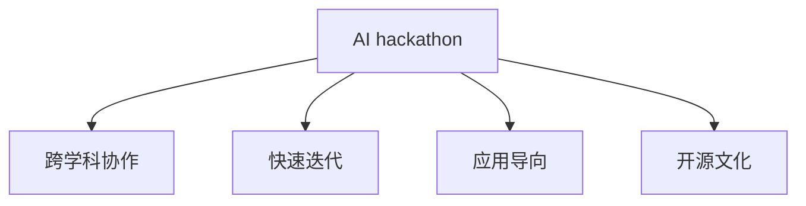

                 

# AI hackathon的规模与影响力

> 关键词：AI hackathon, 人工智能, 创新, 竞赛, 技术协作, 应用开发

## 1. 背景介绍

### 1.1 问题由来

近年来，人工智能(AI)在科技和产业界的影响力日益增强。从图像识别到自然语言处理，再到自动驾驶和机器人技术，AI已经渗透到各行各业。然而，尽管AI技术日新月异，许多潜在的应用场景尚未得到充分探索和利用。这其中，AI hackathon作为一种新颖的创新形式，逐渐引起了广泛的关注和参与。AI hackathon旨在激发创新思维，汇集多方资源，解决现实问题，推动AI技术的落地应用。

### 1.2 问题核心关键点

AI hackathon的核心理念是通过跨学科的协作和竞赛，快速迭代和验证AI技术方案，从而加速AI应用的开发和推广。其关键点包括：

- **跨学科协作**：AI hackathon汇集了来自计算机科学、数据科学、工程、设计等多个领域的专家和学生，共同解决实际问题。
- **快速迭代**：在有限的时间内，通过不断迭代和优化，快速验证和提升AI解决方案。
- **应用导向**：AI hackathon聚焦于实际应用场景，寻找技术在实际问题中的落地方式。
- **开源文化**：鼓励开源分享，促进技术的进一步传播和应用。

## 2. 核心概念与联系

### 2.1 核心概念概述

为更好地理解AI hackathon的核心概念及其应用，本节将介绍几个密切相关的核心概念：

- **AI hackathon**：一种旨在通过跨学科竞赛快速开发和验证AI技术方案的活动。
- **跨学科协作**：AI hackathon汇集了来自不同领域的专家和学生，共同解决实际问题。
- **快速迭代**：AI hackathon通过短时间的竞赛形式，快速验证和提升AI解决方案。
- **应用导向**：AI hackathon聚焦于实际应用场景，寻找技术在实际问题中的落地方式。
- **开源文化**：鼓励开源分享，促进技术的进一步传播和应用。

这些核心概念之间的逻辑关系可以通过以下Mermaid流程图来展示：



这个流程图展示了AI hackathon的核心概念及其相互关系：

1. AI hackathon通过跨学科协作，汇集多方资源。
2. 通过快速迭代，不断优化和验证解决方案。
3. 聚焦于应用导向，确保技术方案具备实际应用价值。
4. 鼓励开源文化，促进技术广泛传播和应用。

## 3. 核心算法原理 & 具体操作步骤
### 3.1 算法原理概述

AI hackathon的算法原理主要基于协作和迭代的竞赛机制。其核心思想是：通过多方协作，快速迭代和验证技术方案，最终实现技术应用的最佳实践。在AI hackathon中，团队通常会面临一个具体的挑战，如解决某个现实问题或开发一个新的AI应用。团队成员通过分工协作，快速实现初步方案，并根据评委反馈和测试结果不断迭代优化，最终提交一个经过验证的解决方案。

### 3.2 算法步骤详解

AI hackathon的一般步骤包括：

**Step 1: 任务定义与团队组建**
- 确定具体的AI挑战，如识别图像中的物体、自动生成文本、预测股票走势等。
- 组建跨学科团队，包括计算机科学、数据科学、工程、设计等多个领域的专家和学生。

**Step 2: 快速原型开发**
- 团队成员根据挑战定义，快速实现一个初步的AI解决方案，并进行基本的验证和测试。
- 在短时间内，通过代码迭代、模型优化和数据分析等手段，不断提升方案的性能和可行性。

**Step 3: 专家评审与反馈**
- 邀请行业专家和领域内的学者对团队的方案进行评审，提供建设性意见和反馈。
- 根据评审和反馈，团队进行二次迭代，进一步优化方案。

**Step 4: 公开展示与评估**
- 团队通过PPT展示、代码演示等方式，向公众展示他们的解决方案。
- 评委和观众根据预设的评分标准，对团队的表现进行评分。

**Step 5: 总结与分享**
- 获奖团队分享他们的经验和挑战解决方案，鼓励更多人参与和贡献。
- 获奖方案通常会被开源共享，供更多人学习和使用。

### 3.3 算法优缺点

AI hackathon作为一种创新活动，具有以下优点：

1. **加速技术迭代**：通过竞赛形式，快速迭代和验证技术方案，加速AI技术的落地应用。
2. **促进跨学科合作**：汇聚多方资源，鼓励跨学科的合作与交流，推动技术的多元融合。
3. **聚焦应用导向**：解决实际问题，强调技术方案的实用性和可操作性。
4. **鼓励开源分享**：通过开源文化，促进技术的广泛传播和应用。

同时，该方法也存在一定的局限性：

1. **时间压力**：竞赛形式可能导致技术方案的深度不够，无法进行深入的优化和验证。
2. **资源有限**：在有限的资源和时间内，可能无法充分考虑所有影响因素，导致方案不够全面。
3. **可重复性差**：由于竞赛的竞争性质，可能导致某些解决方案缺乏可重复性，难以进行进一步的验证和优化。
4. **可能忽视伦理与安全**：在追求快速迭代和竞赛成绩的过程中，可能忽视方案的伦理和安全问题。

尽管存在这些局限性，但就目前而言，AI hackathon仍是一种非常有效的技术开发和验证方法，为AI技术的创新与应用提供了广阔的舞台。

### 3.4 算法应用领域

AI hackathon已经在多个领域得到了应用，涵盖了从医疗健康到环境保护、从金融科技到教育培训等多个领域。以下是几个典型的应用场景：

- **医疗健康**：通过AI hackathon解决医疗影像分析、疾病预测、患者护理优化等问题。例如，Google Health的AI竞赛，旨在通过图像识别技术提高医学影像的诊断准确率。
- **环境保护**：利用AI技术解决环境监测、污染预测、资源管理等问题。例如，Microsoft的AI for Earth竞赛，通过卫星数据分析，预测森林火灾的发生。
- **金融科技**：使用AI技术进行金融欺诈检测、信用评分、自动化交易等。例如，Kaggle的金融数据分析竞赛，通过机器学习模型预测股票价格走势。
- **教育培训**：通过AI技术开发智能教育系统、个性化学习路径、教育资源推荐等。例如，Data Science Bowl竞赛，利用数据挖掘技术，预测学生的学习行为和成绩。

除了上述这些经典领域外，AI hackathon还在更多新兴领域得到了应用，如农业、能源、物流等，为不同行业带来了新的技术突破。

## 4. 数学模型和公式 & 详细讲解  
### 4.1 数学模型构建

AI hackathon的数学模型主要基于协作和迭代的竞赛机制。其核心思想是：通过多方协作，快速迭代和验证技术方案，最终实现技术应用的最佳实践。在AI hackathon中，团队通常会面临一个具体的挑战，如解决某个现实问题或开发一个新的AI应用。团队成员通过分工协作，快速实现初步方案，并根据评委反馈和测试结果不断迭代优化，最终提交一个经过验证的解决方案。

### 4.2 公式推导过程

以下我们以图像识别任务为例，推导深度学习模型的损失函数及其梯度的计算公式。

假设模型 $M_{\theta}$ 在输入 $x$ 上的输出为 $\hat{y}=M_{\theta}(x) \in [0,1]$，表示样本属于正类的概率。真实标签 $y \in \{0,1\}$。则二分类交叉熵损失函数定义为：

$$
\ell(M_{\theta}(x),y) = -[y\log \hat{y} + (1-y)\log (1-\hat{y})]
$$

将其代入经验风险公式，得：

$$
\mathcal{L}(\theta) = -\frac{1}{N}\sum_{i=1}^N [y_i\log M_{\theta}(x_i)+(1-y_i)\log(1-M_{\theta}(x_i))]
$$

根据链式法则，损失函数对参数 $\theta_k$ 的梯度为：

$$
\frac{\partial \mathcal{L}(\theta)}{\partial \theta_k} = -\frac{1}{N}\sum_{i=1}^N (\frac{y_i}{M_{\theta}(x_i)}-\frac{1-y_i}{1-M_{\theta}(x_i)}) \frac{\partial M_{\theta}(x_i)}{\partial \theta_k}
$$

其中 $\frac{\partial M_{\theta}(x_i)}{\partial \theta_k}$ 可进一步递归展开，利用自动微分技术完成计算。

在得到损失函数的梯度后，即可带入参数更新公式，完成模型的迭代优化。重复上述过程直至收敛，最终得到适应下游任务的最优模型参数 $\theta^*$。

### 4.3 案例分析与讲解

下面我们以Google Health的AI竞赛为例，具体讲解一个AI hackathon的应用场景。

Google Health在2018年启动了一个名为"Radiologist Challenge"的AI竞赛，旨在通过图像识别技术提高医学影像的诊断准确率。竞赛要求参与者使用公开的医学影像数据集，训练一个能够自动检测和标记影像中病灶的深度学习模型。以下是竞赛的关键步骤：

**Step 1: 数据准备**
- 收集公开的医学影像数据集，包括不同类型的病灶样本。
- 对数据进行清洗和标注，确保数据质量和一致性。

**Step 2: 模型选择与训练**
- 选择适合的深度学习模型，如CNN、ResNet等。
- 在训练集上训练模型，使用交叉熵损失函数和SGD优化器。
- 根据验证集上的表现，调整模型参数和训练策略。

**Step 3: 性能评估**
- 在测试集上评估模型的诊断准确率、召回率等指标。
- 提交模型结果，供评委评审和反馈。

**Step 4: 专家评审与反馈**
- 邀请医学专家对模型结果进行评审，提供改进建议。
- 根据评审意见，进行模型优化和调整。

**Step 5: 公开展示与分享**
- 在Google Health的平台上公开展示获奖团队和解决方案。
- 获奖模型将被开源共享，供其他研究人员和医疗机构使用。

通过这一过程，Google Health成功地推动了AI在医学影像诊断中的应用，展示了AI技术的强大潜力和实际价值。

## 5. 项目实践：代码实例和详细解释说明
### 5.1 开发环境搭建

在进行AI hackathon实践前，我们需要准备好开发环境。以下是使用Python进行PyTorch开发的环境配置流程：

1. 安装Anaconda：从官网下载并安装Anaconda，用于创建独立的Python环境。

2. 创建并激活虚拟环境：
```bash
conda create -n pytorch-env python=3.8 
conda activate pytorch-env
```

3. 安装PyTorch：根据CUDA版本，从官网获取对应的安装命令。例如：
```bash
conda install pytorch torchvision torchaudio cudatoolkit=11.1 -c pytorch -c conda-forge
```

4. 安装Transformers库：
```bash
pip install transformers
```

5. 安装各类工具包：
```bash
pip install numpy pandas scikit-learn matplotlib tqdm jupyter notebook ipython
```

完成上述步骤后，即可在`pytorch-env`环境中开始AI hackathon实践。

### 5.2 源代码详细实现

这里我们以图像识别任务为例，给出使用PyTorch和Transformers库进行深度学习模型训练的代码实现。

```python
import torch
import torchvision
from transformers import BertForTokenClassification, AdamW

# 加载数据集
train_data = torchvision.datasets.ImageFolder(root='train_data', transform=transforms.ToTensor())
train_loader = torch.utils.data.DataLoader(train_data, batch_size=32, shuffle=True)

# 定义模型
model = BertForTokenClassification.from_pretrained('bert-base-cased', num_labels=2)
model.to(device)

# 定义优化器
optimizer = AdamW(model.parameters(), lr=2e-5)

# 训练模型
for epoch in range(10):
    model.train()
    for batch in train_loader:
        inputs, labels = batch
        inputs = inputs.to(device)
        labels = labels.to(device)
        
        outputs = model(inputs)
        loss = outputs.loss
        loss.backward()
        optimizer.step()

# 评估模型
model.eval()
with torch.no_grad():
    correct = 0
    total = 0
    for batch in test_loader:
        inputs, labels = batch
        inputs = inputs.to(device)
        labels = labels.to(device)
        
        outputs = model(inputs)
        _, predicted = torch.max(outputs, 1)
        total += labels.size(0)
        correct += (predicted == labels).sum().item()

print('Accuracy:', correct / total)
```

以上代码展示了使用PyTorch和Transformers库进行深度学习模型训练的基本流程。在实践中，开发者需要根据具体的AI任务和数据集特点，对代码进行进一步的优化和调整。

### 5.3 代码解读与分析

让我们再详细解读一下关键代码的实现细节：

**加载数据集**：
- `torchvision.datasets.ImageFolder`：用于加载图像数据集，并对其进行标准化处理。
- `transforms.ToTensor()`：将图像数据转换为Tensor，供模型输入。

**定义模型**：
- `BertForTokenClassification`：定义BERT模型，用于图像分类任务。
- `num_labels=2`：指定二分类任务，标签数量为2。

**定义优化器**：
- `AdamW`：定义AdamW优化器，用于模型参数更新。
- `lr=2e-5`：设置学习率。

**训练模型**：
- `model.train()`：设置模型为训练模式。
- `for`循环：遍历数据集。
- `inputs`和`labels`：数据集中的输入和标签。
- `model(inputs)`：模型前向传播，返回输出结果。
- `loss`：计算损失函数。
- `loss.backward()`：反向传播计算梯度。
- `optimizer.step()`：更新模型参数。

**评估模型**：
- `model.eval()`：设置模型为评估模式。
- `with torch.no_grad()`：关闭梯度计算，提高评估速度。
- `for`循环：遍历测试集。
- `inputs`和`labels`：测试集中的输入和标签。
- `outputs`：模型前向传播结果。
- `predicted`：模型预测结果。
- `correct`和`total`：统计正确预测和总样本数。
- 计算并输出模型准确率。

## 6. 实际应用场景
### 6.1 医疗健康

AI hackathon在医疗健康领域的应用，通过竞赛形式，加速了AI技术在医学影像诊断、疾病预测等方面的应用。例如，Google Health的Radiologist Challenge竞赛，通过图像识别技术提高了医学影像的诊断准确率。

**具体应用**：
- **医学影像分析**：利用AI技术对CT、MRI、X光等医学影像进行自动分析，识别出病灶位置和大小，辅助医生进行诊断。
- **疾病预测**：通过分析患者的历史数据和基因信息，预测其患病的风险和可能的发展趋势。
- **患者护理优化**：利用AI技术分析患者的生活习惯和生理指标，提出个性化的护理方案。

**竞赛示例**：
- **Google Health的Radiologist Challenge**：通过图像识别技术提高医学影像的诊断准确率。
- **DeepMind的Healthcare AI Challenge**：利用深度学习技术预测患者住院时间，优化医疗资源分配。

### 6.2 环境保护

AI hackathon在环境保护领域的应用，通过竞赛形式，推动了AI技术在环境监测、污染预测等方面的应用。例如，Microsoft的AI for Earth竞赛，通过卫星数据分析，预测森林火灾的发生。

**具体应用**：
- **环境监测**：利用AI技术监测大气、水质、土壤等环境指标，及时发现环境污染和灾害。
- **污染预测**：通过分析历史数据和实时监测数据，预测污染物的浓度和分布。
- **资源管理**：利用AI技术优化自然资源的使用和保护，提高资源利用效率。

**竞赛示例**：
- **Microsoft的AI for Earth**：通过卫星数据分析，预测森林火灾的发生。
- **UNESCO的Echidna Challenge**：利用AI技术监测海洋生态，识别海洋污染和变化。

### 6.3 金融科技

AI hackathon在金融科技领域的应用，通过竞赛形式，推动了AI技术在金融欺诈检测、信用评分、自动化交易等方面的应用。例如，Kaggle的金融数据分析竞赛，通过机器学习模型预测股票价格走势。

**具体应用**：
- **金融欺诈检测**：利用AI技术分析交易数据，识别出可疑行为和欺诈行为。
- **信用评分**：通过分析用户的历史数据和行为，预测其信用风险。
- **自动化交易**：利用AI技术分析市场数据，自动进行交易决策。

**竞赛示例**：
- **Kaggle的金融数据分析竞赛**：通过机器学习模型预测股票价格走势。
- **DataHack的FinTech Challenge**：利用AI技术优化金融产品推荐，提高用户满意度。

### 6.4 教育培训

AI hackathon在教育培训领域的应用，通过竞赛形式，推动了AI技术在智能教育系统、个性化学习路径、教育资源推荐等方面的应用。例如，Data Science Bowl竞赛，利用数据挖掘技术，预测学生的学习行为和成绩。

**具体应用**：
- **智能教育系统**：利用AI技术分析学生的学习数据，提供个性化的学习建议和辅导。
- **个性化学习路径**：通过分析学生的学习偏好和进度，生成个性化的学习路径。
- **教育资源推荐**：利用AI技术推荐适合学生的学习资源和教材。

**竞赛示例**：
- **Data Science Bowl**：利用数据挖掘技术，预测学生的学习行为和成绩。
- **Kaggle的CrowdAI**：利用AI技术提高教育数据的可视化效果。

## 7. 工具和资源推荐
### 7.1 学习资源推荐

为了帮助开发者系统掌握AI hackathon的理论基础和实践技巧，这里推荐一些优质的学习资源：

1. **Kaggle官方文档**：Kaggle作为全球最大的数据科学竞赛平台，提供了大量的竞赛案例和数据集，帮助你了解AI hackathon的具体流程和注意事项。
2. **Coursera的AI竞赛课程**：Coursera推出了多个AI竞赛相关的课程，涵盖了数据处理、模型训练、结果评估等多个方面。
3. **AI World竞赛资源**：AI World是全球最大的AI和数据科学竞赛活动，提供丰富的竞赛案例和开源资源，帮助开发者提升AI技能。
4. **GitHub的AI项目**：GitHub上有大量的AI项目和开源代码，供开发者参考和学习。
5. **Hugging Face的Transformers库**：Hugging Face推出了Transformers库，提供了多种预训练模型和微调工具，方便开发者进行AI竞赛开发。

通过对这些资源的学习实践，相信你一定能够快速掌握AI hackathon的精髓，并用于解决实际的AI问题。

### 7.2 开发工具推荐

高效的开发离不开优秀的工具支持。以下是几款用于AI hackathon开发的常用工具：

1. **Jupyter Notebook**：Jupyter Notebook提供了交互式编程环境，方便开发者进行代码调试和迭代。
2. **Google Colab**：Google Colab提供了免费的GPU/TPU算力，方便开发者进行大规模模型训练和测试。
3. **TensorFlow**：由Google主导开发的深度学习框架，支持分布式训练和模型部署。
4. **PyTorch**：由Facebook开发的深度学习框架，灵活性强，适合快速迭代和试验。
5. **Hugging Face的Transformers库**：Hugging Face推出了Transformers库，提供了多种预训练模型和微调工具，方便开发者进行AI竞赛开发。

合理利用这些工具，可以显著提升AI hackathon的开发效率，加快创新迭代的步伐。

### 7.3 相关论文推荐

AI hackathon作为一种新颖的创新形式，其理论和实践还在不断发展中。以下是几篇奠基性的相关论文，推荐阅读：

1. **Kaggle: The Internet's Data Science Community**：介绍了Kaggle平台及其在数据科学竞赛中的作用。
2. **Kaggle Research**：Kaggle的研究团队发表了多篇论文，探讨了数据科学竞赛中的最佳实践和挑战。
3. **AI World: World's largest AI and Data Science Competition**：介绍了AI World竞赛及其对AI技术的影响。
4. **Transformers: State-of-the-Art Natural Language Processing**：介绍了Transformer模型的原理和应用，是Transformers库的重要参考资料。
5. **AI Hackathons: A New Way to Drive AI Adoption**：讨论了AI hackathons在推动AI技术落地应用中的作用和潜力。

这些论文代表了大规模AI竞赛的发展脉络。通过学习这些前沿成果，可以帮助研究者把握学科前进方向，激发更多的创新灵感。

## 8. 总结：未来发展趋势与挑战

### 8.1 研究成果总结

AI hackathon作为AI技术开发和验证的新颖形式，已经得到了广泛的应用和认可。通过竞赛形式，快速迭代和验证技术方案，加速了AI技术的落地应用。未来，AI hackathon将继续在各个领域发挥其独特的作用，推动AI技术的创新和应用。

### 8.2 未来发展趋势

展望未来，AI hackathon将呈现以下几个发展趋势：

1. **技术融合**：AI hackathon将与其他人工智能技术进行更深入的融合，如知识表示、因果推理、强化学习等，多路径协同发力，共同推动AI技术的进步。
2. **数据驱动**：随着数据量的不断增加，数据驱动将成为AI技术发展的核心，AI hackathon也将更加注重数据的获取和处理。
3. **跨学科合作**：AI hackathon将继续促进跨学科合作，汇集多方资源，推动技术的多元融合。
4. **开放创新**：开源文化将成为AI hackathon的重要特征，促进技术的广泛传播和应用。
5. **模型可解释性**：随着AI技术的复杂性增加，模型的可解释性将成为一个重要研究方向，AI hackathon将更加注重模型的透明性和可解释性。
6. **伦理与安全**：在追求技术创新的同时，AI hackathon将更加注重算法的伦理和安全问题，确保技术应用的公平性和安全性。

### 8.3 面临的挑战

尽管AI hackathon已经取得了显著的成就，但在迈向更加智能化、普适化应用的过程中，它仍面临诸多挑战：

1. **数据隐私**：在数据驱动的AI竞赛中，数据的隐私和安全问题将成为一个重要挑战。如何保护参赛者数据隐私，确保数据使用的合法性，需要进一步探索。
2. **模型鲁棒性**：AI模型在不同数据分布上的鲁棒性不足，可能导致性能波动，需要在模型训练和竞赛中加以改进。
3. **算法透明性**：许多AI模型如深度学习模型的内部工作机制难以解释，导致模型透明性不足，需要在算法设计中加以改进。
4. **伦理与公平性**：AI模型可能存在偏见和歧视，需要进一步探索和解决伦理和公平性问题。
5. **资源限制**：竞赛形式可能导致技术方案的深度不够，需要在资源和时间的限制下，进行更深入的优化和验证。
6. **跨领域应用**：AI hackathon在跨领域应用中的效果和适用性需要进一步探索，确保技术方案的普适性。

### 8.4 研究展望

面对AI hackathon面临的这些挑战，未来的研究需要在以下几个方面寻求新的突破：

1. **数据隐私保护**：探索如何在数据驱动的AI竞赛中保护参赛者数据隐私，确保数据使用的合法性。
2. **模型鲁棒性增强**：研究如何提高AI模型的鲁棒性，确保模型在不同数据分布上的稳定性。
3. **算法透明性提升**：研究如何提升AI模型的透明性，增强模型的可解释性和可审计性。
4. **伦理与公平性保障**：研究如何解决AI模型中的伦理和公平性问题，确保技术应用的公平性和安全性。
5. **跨领域应用拓展**：探索AI hackathon在跨领域应用中的效果和适用性，确保技术方案的普适性。
6. **开源与共享**：推动AI竞赛的开源与共享文化，促进技术的广泛传播和应用。

这些研究方向的探索，必将引领AI hackathon技术迈向更高的台阶，为AI技术的创新与应用提供广阔的舞台。

## 9. 附录：常见问题与解答

**Q1: AI hackathon是否适用于所有AI技术？**

A: AI hackathon主要适用于数据驱动和算法优化的技术领域，如机器学习、深度学习等。对于一些需要大量硬件资源的计算密集型技术，如分布式计算、高性能计算等，可能需要更长的竞赛时间或更大的竞赛资源支持。

**Q2: AI hackathon对参赛者的技能要求有哪些？**

A: AI hackathon对参赛者的技能要求包括：
- 熟练掌握Python、R等编程语言，熟悉数据科学和机器学习工具。
- 具备良好的数据分析和可视化能力，能够处理大规模数据集。
- 了解常见的机器学习算法和深度学习模型，能够设计、实现和评估模型。
- 具备跨学科合作能力，能够与其他团队成员协作完成竞赛任务。

**Q3: AI hackathon是否具有商业价值？**

A: 是的，AI hackathon不仅具有技术创新价值，还具有商业价值。许多获奖方案在竞赛后被商业化，应用于实际生产环境中，取得了显著的经济效益。

**Q4: AI hackathon是否需要赞助商支持？**

A: 是的，AI hackathon通常需要赞助商提供资金、设备和资源支持，才能顺利进行。赞助商不仅提供了竞赛所需的硬件资源，还带来了更多的商业机会和合作机会。

**Q5: AI hackathon是否具有社会价值？**

A: 是的，AI hackathon不仅推动了技术创新和应用，还关注社会问题，通过技术手段解决实际问题，具有显著的社会价值。例如，AI for Earth竞赛通过数据分析，保护了自然环境。

---

作者：禅与计算机程序设计艺术 / Zen and the Art of Computer Programming

