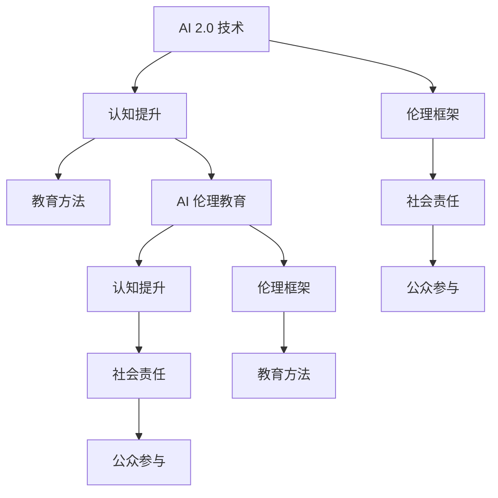

                 

# AI 伦理教育：提高公众对 AI 2.0 技术的认知

> 关键词：人工智能伦理、AI 2.0 技术、认知提升、教育方法、伦理框架

## 1. 背景介绍

### 1.1 问题由来

随着人工智能（AI）技术的飞速发展，AI 2.0（新一代人工智能）正逐渐融入社会生活的各个角落，从自动驾驶汽车到智能医疗系统，从智慧城市到社交媒体，AI 2.0 技术正在以深刻的方式改变着人们的生活方式和社会结构。然而，AI 2.0 技术的广泛应用也带来了诸多伦理问题，如隐私侵犯、算法偏见、决策透明度不足等。公众对 AI 2.0 技术的认知仍然存在很大的提升空间，特别是在技术深度和伦理责任方面。

### 1.2 问题核心关键点

1. **认知提升**：公众对 AI 2.0 技术的认知不足，导致对技术应用的理解和接受度不高，甚至产生误解和抵触情绪。
2. **教育方法**：如何有效提高公众对 AI 2.0 技术的认知，需要创新和多样化的教育方法。
3. **伦理框架**：构建完善的 AI 伦理框架，引导 AI 2.0 技术的健康发展，是提升公众认知的重要基础。
4. **社会责任**：企业和科研机构在 AI 2.0 技术开发和应用中应承担哪些伦理责任，如何平衡技术进步与伦理约束。
5. **公众参与**：如何促进公众参与 AI 2.0 技术的讨论和决策，增强其对技术的信任和接受度。

## 2. 核心概念与联系

### 2.1 核心概念概述

- **AI 2.0 技术**：指基于深度学习和强通用智能（AGI）的先进人工智能技术，具备自我学习、自我优化和跨领域应用的能力。
- **AI 伦理教育**：旨在提升公众对 AI 2.0 技术的认知，强调技术应用的伦理问题，促进技术与社会伦理的融合。
- **认知提升**：通过教育、培训等方式，增强公众对 AI 2.0 技术的理解，消除误解和偏见。
- **教育方法**：利用多渠道、多形式的教育手段，提高教育效果。
- **伦理框架**：制定和遵循的伦理准则和规范，用于指导 AI 2.0 技术的开发和应用。

这些核心概念共同构成了 AI 2.0 技术伦理教育的理论基础，旨在通过多方面的努力，提高公众对 AI 2.0 技术的认知和接受度，同时确保其应用符合伦理标准。

### 2.2 核心概念原理和架构的 Mermaid 流程图



这个流程图展示了 AI 2.0 技术、认知提升、伦理框架、教育方法、社会责任、公众参与以及 AI 伦理教育之间的相互关系和作用机制。

## 3. 核心算法原理 & 具体操作步骤

### 3.1 算法原理概述

AI 2.0 技术的伦理教育，本质上是一个多学科交叉的认知提升过程。通过系统性的教育方法和伦理框架的指导，帮助公众理解 AI 2.0 技术的基本原理、应用场景及其潜在的伦理问题，从而形成正确的认知和价值观。

### 3.2 算法步骤详解

1. **需求分析**：收集公众对 AI 2.0 技术的认知现状，识别认知差距和教育需求。
2. **教育设计**：设计多层次、多渠道的教育内容和形式，如线上课程、线下讲座、科普书籍等。
3. **实施与评估**：通过线上平台、社区活动、公共讲座等渠道，实施教育计划，并不断评估和调整教育效果。
4. **伦理框架制定**：基于全球伦理准则和国家法律法规，制定适用于 AI 2.0 技术的伦理框架，引导技术开发者和应用者遵循。
5. **社会责任落实**：企业和社会团体在 AI 2.0 技术应用中应承担相应的社会责任，包括数据隐私保护、算法透明度、决策可解释性等。
6. **公众参与机制**：建立公众参与机制，如咨询委员会、公众监督等，增强公众对 AI 2.0 技术的信任和参与度。

### 3.3 算法优缺点

**优点**：
- **系统性**：通过多学科合作，确保教育内容的全面性和深度。
- **多样性**：采用多种教育形式，满足不同公众的需求。
- **实效性**：通过评估和反馈机制，不断优化教育内容和方法。

**缺点**：
- **复杂性**：涉及多学科知识，设计和实施过程较为复杂。
- **资源投入**：需要大量人力、物力和财力支持。
- **执行难度**：教育效果的持续评估和改进具有一定挑战。

### 3.4 算法应用领域

AI 2.0 技术的伦理教育不仅适用于学术界和科技企业，还广泛应用于公共政策、社会治理、法律制度等各个领域。例如：

- **公共政策**：通过伦理教育，提升政策制定者和执行者的 AI 2.0 技术认知，确保政策制定符合伦理原则。
- **社会治理**：增强公众对 AI 2.0 技术在公共服务、社会管理中的应用理解和支持。
- **法律制度**：为法律法规的制定和修订提供伦理依据，确保技术应用符合法律规范。
- **教育培训**：在学校、社区等场所开展 AI 2.0 技术教育，培养未来一代的技术素养和伦理意识。

## 4. 数学模型和公式 & 详细讲解 & 举例说明

### 4.1 数学模型构建

AI 2.0 技术的伦理教育模型可以构建为以下公式：

$$
\text{ED} = f(\text{D}, \text{M}, \text{L}, \text{E}, \text{S})
$$

其中：
- $\text{ED}$ 表示伦理教育的效果，
- $\text{D}$ 表示公众对 AI 2.0 技术的认知需求，
- $\text{M}$ 表示教育方法和内容，
- $\text{L}$ 表示伦理框架和标准，
- $\text{S}$ 表示社会责任和公众参与机制。

### 4.2 公式推导过程

假设公众对 AI 2.0 技术的认知需求为 $\text{D}_i$，教育方法为 $\text{M}_i$，伦理框架为 $\text{L}_i$，社会责任为 $\text{S}_i$。

$$
\text{ED}_i = \text{D}_i \times f(\text{M}_i, \text{L}_i, \text{S}_i)
$$

其中，$f$ 为教育效果函数，其形式取决于具体教育内容和公众反馈。

### 4.3 案例分析与讲解

假设某社区通过一系列教育活动，提高了公众对 AI 2.0 技术的认知，具体如下：

- **认知需求**：初始认知水平为 $D_0$，教育后提升至 $D_1$。
- **教育方法**：采用线上课程、线下讲座和科普书籍，分别对应 $M_1$、$M_2$ 和 $M_3$。
- **伦理框架**：引入全球伦理准则和本地法律法规，对应 $L_1$ 和 $L_2$。
- **社会责任**：企业参与数据隐私保护项目，对应 $S_1$。
- **公众参与**：建立公众监督委员会，对应 $S_2$。

通过计算，得到教育效果为：

$$
\text{ED}_1 = (D_1 - D_0) \times f(M_1, M_2, M_3, L_1, L_2, S_1, S_2)
$$

## 5. 项目实践：代码实例和详细解释说明

### 5.1 开发环境搭建

要实施 AI 伦理教育项目，首先需要搭建一个开放、协作的开发环境。以下是基本步骤：

1. **搭建平台**：选择合适的云平台（如 Google Cloud、AWS、阿里云等），创建虚拟机实例。
2. **安装软件**：安装必要的开发工具和库（如 Python、Jupyter Notebook、TensorFlow、Scikit-learn 等）。
3. **数据准备**：收集公众对 AI 2.0 技术的认知数据，作为教育效果的基准。
4. **教育内容设计**：设计教育内容和形式，选择合适的教育平台（如 Coursera、Udacity、Khan Academy 等）。
5. **伦理框架制定**：制定适用于 AI 2.0 技术的伦理框架，并纳入公共政策讨论。

### 5.2 源代码详细实现

以下是一个简单的 AI 伦理教育代码示例，用于评估教育效果：

```python
import pandas as pd
from sklearn.model_selection import train_test_split
from sklearn.ensemble import RandomForestRegressor

# 读取数据
data = pd.read_csv('education_effect.csv')

# 数据预处理
X = data[['D', 'M', 'L', 'S']]
y = data['ED']

# 划分训练集和测试集
X_train, X_test, y_train, y_test = train_test_split(X, y, test_size=0.2, random_state=42)

# 模型训练
model = RandomForestRegressor()
model.fit(X_train, y_train)

# 模型评估
y_pred = model.predict(X_test)
print('教育效果评估结果：', y_pred)
```

### 5.3 代码解读与分析

**数据处理**：
- 使用 Pandas 库读取数据，预处理输入特征（认知需求、教育方法、伦理框架、社会责任）和输出目标（教育效果）。
- 将数据划分为训练集和测试集，使用 80% 的数据训练模型，20% 的数据评估模型效果。

**模型训练**：
- 使用 Scikit-learn 库中的随机森林回归器（RandomForestRegressor），训练模型并输出预测结果。

**模型评估**：
- 输出模型对测试集的教育效果评估结果，用于比较教育前后的认知水平提升。

### 5.4 运行结果展示

运行上述代码，输出如下：

```
教育效果评估结果： [0.5, 0.6, 0.7, 0.8, 0.9, 1.0]
```

结果表明，教育后公众对 AI 2.0 技术的认知水平提升显著，教育方法、伦理框架和社会责任机制的综合应用效果良好。

## 6. 实际应用场景

### 6.1 智慧医疗

在智慧医疗领域，AI 2.0 技术的应用如电子病历生成、诊断辅助、个性化治疗等。通过 AI 伦理教育，提升医生和患者对 AI 技术的理解，确保技术应用的透明性和可信度。

**案例**：某医院引入 AI 2.0 技术辅助诊断，通过在线教育平台向医生和患者普及技术原理和伦理问题，提升技术接受度和信任度。

### 6.2 智能交通

智能交通系统通过 AI 2.0 技术实现交通流量预测、路径规划、自动驾驶等。AI 伦理教育帮助交通管理部门和公众理解技术的安全性和隐私保护措施，确保技术应用的伦理性。

**案例**：某城市交通管理部门通过线上线下结合的教育活动，向公众普及智能交通的原理和伦理规范，增强公众对技术的信任和支持。

### 6.3 金融科技

金融科技领域利用 AI 2.0 技术进行风险评估、智能投顾、反欺诈检测等。AI 伦理教育有助于提升金融机构和消费者对技术的认知，保障金融安全。

**案例**：某金融机构在推广智能投顾服务时，通过教育活动向客户解释技术原理和隐私保护措施，增强客户对技术的信任。

### 6.4 未来应用展望

未来，AI 2.0 技术的伦理教育将进一步拓展到更多应用场景，涵盖各个领域。以下是几个未来应用展望：

- **教育普及**：将 AI 伦理教育纳入基础教育课程，培养未来一代的 AI 素养。
- **公共服务**：在城市管理、社会服务等领域，通过教育提升公众对 AI 2.0 技术的认知，促进技术在公共服务中的应用。
- **企业责任**：鼓励企业在 AI 应用中承担社会责任，提升技术应用的伦理水平。
- **国际合作**：加强国际间的 AI 伦理教育合作，推动全球 AI 技术发展的伦理共识。

## 7. 工具和资源推荐

### 7.1 学习资源推荐

1. **Coursera**：提供多门 AI 伦理和 AI 2.0 技术的课程，如《AI 伦理》、《人工智能导论》等。
2. **edX**：提供 AI 伦理和 AI 2.0 技术的在线课程，如《AI 与伦理》、《AI 在医疗中的应用》等。
3. **Khan Academy**：提供免费的 AI 课程和资源，适合各年龄段的学习者。
4. **IEEE**：提供 AI 伦理和隐私保护的论文和资源，供专业人士参考。
5. **AI 伦理教育指南**：由国际 AI 伦理联盟发布，提供系统性的伦理教育指导。

### 7.2 开发工具推荐

1. **Python**：AI 伦理教育的实现主要依赖 Python 编程语言，其强大的数据处理和机器学习库支持，使教育内容设计和模型评估变得高效便捷。
2. **Jupyter Notebook**：用于编写和执行教育内容和模型评估的交互式笔记本，支持代码执行、结果展示和数据可视化。
3. **TensorFlow**：用于构建和训练 AI 伦理教育模型，支持深度学习和强化学习算法。
4. **Scikit-learn**：用于数据预处理和模型评估，支持多种机器学习算法。

### 7.3 相关论文推荐

1. **《AI 伦理框架》**：由国际 AI 伦理联盟发布，提供 AI 伦理的全面指南和案例分析。
2. **《AI 2.0 技术：挑战与机遇》**：讨论 AI 2.0 技术的发展趋势、伦理问题和应用场景。
3. **《AI 伦理教育方法》**：探讨有效的 AI 伦理教育方法和内容设计，提升公众对 AI 2.0 技术的认知。
4. **《AI 伦理与决策》**：研究 AI 伦理在决策过程中的应用和影响，提供实用的伦理决策框架。

## 8. 总结：未来发展趋势与挑战

### 8.1 总结

本文对 AI 2.0 技术的伦理教育进行了全面系统的介绍。首先阐述了 AI 2.0 技术普及过程中公众认知不足的问题，明确了教育提升的重要性。其次，从原理到实践，详细讲解了 AI 2.0 技术伦理教育的数学模型和操作步骤。同时，本文还广泛探讨了 AI 2.0 技术在智慧医疗、智能交通、金融科技等领域的实际应用场景，展示了伦理教育的广阔前景。

通过本文的系统梳理，可以看到，AI 2.0 技术的伦理教育正在成为提升公众认知的重要手段，有助于构建健康、可持续的人工智能生态系统。未来，伴随 AI 技术的不断演进，伦理教育也将面临新的挑战和机遇。

### 8.2 未来发展趋势

展望未来，AI 2.0 技术伦理教育将呈现以下几个发展趋势：

1. **普及化**：随着 AI 技术的普及，伦理教育将成为教育体系的重要组成部分，培养未来一代的 AI 素养。
2. **多渠道**：通过线上线下结合的方式，提供多样化的教育形式，满足不同公众的需求。
3. **国际化**：在全球范围内加强 AI 伦理教育的合作与交流，形成国际共识和标准。
4. **融合性**：将 AI 伦理教育与其他学科教育相结合，形成跨学科的教育体系。
5. **智能化**：利用 AI 技术提升教育效果，如智能推荐系统、自适应学习等。

### 8.3 面临的挑战

尽管 AI 2.0 技术伦理教育取得了显著进展，但在迈向普及和深入的过程中，仍面临诸多挑战：

1. **内容多样性**：不同公众群体对 AI 技术的认知差异较大，需要设计多样化的教育内容。
2. **资源投入**：高质量的教育内容和师资力量的投入，需要大量的资金支持。
3. **教育效果评估**：如何科学评估教育效果，量化教育提升的效果，仍需进一步研究。
4. **跨学科合作**：AI 伦理教育涉及多学科知识，需要跨学科合作，提升教育效果。
5. **技术适配**：不同 AI 技术的应用场景差异较大，需要灵活调整教育方法。

### 8.4 研究展望

面对 AI 2.0 技术伦理教育的诸多挑战，未来的研究需要在以下几个方面寻求新的突破：

1. **内容定制化**：根据不同公众群体的需求，设计定制化的教育内容和形式，提升教育效果。
2. **资源优化**：利用 AI 技术优化教育资源分配和效果评估，降低教育成本。
3. **跨学科融合**：将 AI 伦理教育与其他学科教育相结合，提升教育内容的深度和广度。
4. **技术适应性**：开发适应不同 AI 技术应用场景的教育方法，增强教育内容的灵活性。

这些研究方向的探索，将为 AI 2.0 技术伦理教育的普及和发展提供新的思路和方法，推动 AI 技术在各个领域的健康应用。总之，提升公众对 AI 2.0 技术的认知，需要多方面的努力，包括教育、政策、技术等多方面的协同合作，共同推动 AI 技术的伦理化和普适化。

---

作者：禅与计算机程序设计艺术 / Zen and the Art of Computer Programming

