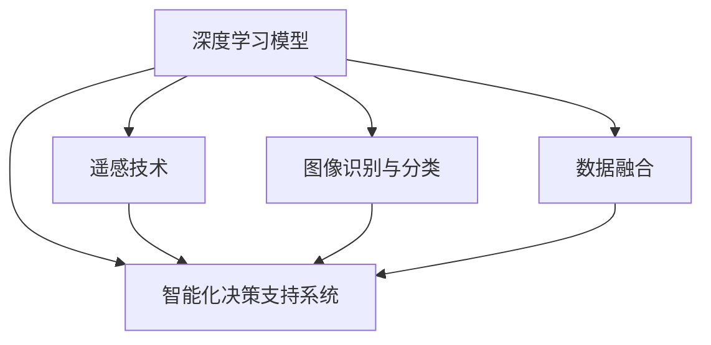

                 

# AI 基础设施的地质勘探：智能化矿产资源勘测平台

> 关键词：智能化矿产资源勘测平台，深度学习，AI，地质勘探，矿产资源，遥感影像，图像识别，数据融合

## 1. 背景介绍

### 1.1 问题由来

矿产资源是人类社会发展的基石，对全球经济有着举足轻重的影响。然而，随着全球经济对资源需求的持续增长，传统矿产资源的开采难度和成本不断提升，迫切需要智能化、高效化的矿产资源勘探方法。智能化矿产资源勘测平台正是应运而生的产物，通过整合多种先进技术手段，实现矿产资源的自动化、智能化勘测。

传统的矿产资源勘探方法依赖于大量的实地勘探工作，成本高、耗时长、风险大。而智能化勘测平台则能够通过AI技术实现从数据采集、预处理、分析到结果输出的一体化处理，大幅提升勘探效率和精度。目前，智能化勘测平台在矿产资源勘探中的应用已经初现端倪，正成为推动矿产资源勘探智能化转型的新引擎。

### 1.2 问题核心关键点

智能化矿产资源勘测平台的核心在于将深度学习、遥感技术、图像识别、数据融合等多种AI技术应用于矿产资源勘探中。通过这些技术，平台能够自动分析、识别地表和地下矿产资源的分布，预测资源储量，辅助地质工程师进行决策。

具体而言，该平台的技术关键点包括：
- 高精度的遥感影像解析。
- 深度学习模型的构建和训练。
- 图像识别与分类算法的设计。
- 数据融合与分析技术的开发。
- 智能化决策支持系统的集成。

## 2. 核心概念与联系

### 2.1 核心概念概述

为更好地理解智能化矿产资源勘测平台的技术架构和实现机制，本节将介绍几个核心概念：

- 智能化矿产资源勘测平台：基于AI技术，整合遥感、地质、环境等多个领域的信息，实现矿产资源的智能化勘测、评估和决策支持。
- 深度学习模型：利用深度神经网络对复杂数据进行学习和建模，自动发现数据中的隐藏规律。
- 遥感技术：通过卫星、无人机等手段获取地球表面的高精度影像数据，实现空间信息的实时获取。
- 图像识别与分类：通过卷积神经网络等算法，自动识别遥感影像中的目标，进行分类和定位。
- 数据融合：将不同来源和不同类型的数据进行整合和分析，消除冗余信息，增强数据的表现力。
- 智能化决策支持系统：通过深度学习和数据融合技术，辅助地质工程师进行矿产资源的勘探和开发决策。

这些概念之间的逻辑关系可以通过以下Mermaid流程图来展示：



这个流程图展示了一体化智能化矿产资源勘测平台的核心技术流程：
- 利用深度学习模型对遥感影像进行处理，提取有用信息。
- 使用图像识别与分类算法，对遥感影像中的矿产资源进行自动识别和分类。
- 通过数据融合技术，将不同数据源的信息整合，消除冗余，增强精度。
- 最终通过智能化决策支持系统，辅助地质工程师进行勘探和开发决策。

## 3. 核心算法原理 & 具体操作步骤

### 3.1 算法原理概述

智能化矿产资源勘测平台的核心算法原理主要基于深度学习模型和遥感影像解析技术。平台首先通过遥感影像获取地球表面的空间信息，利用深度学习模型进行分析和预测。具体的算法流程如下：

1. 数据采集与预处理：收集卫星、无人机等手段获取的高精度遥感影像数据，对其进行预处理，包括去噪、校正、拼接等步骤。

2. 图像识别与分类：利用卷积神经网络等深度学习算法，自动解析遥感影像，识别并分类不同的矿产资源，如金属矿、非金属矿等。

3. 数据融合与分析：将遥感影像与其他辅助数据（如地质数据、环境数据等）进行融合，消除冗余信息，提升数据的表现力。

4. 预测与决策支持：通过深度学习模型对融合后的数据进行分析，预测矿产资源的分布和储量，辅助地质工程师进行决策。

### 3.2 算法步骤详解

以下是智能化矿产资源勘测平台的核心算法步骤，以地质矿床识别为例进行详细讲解：

**Step 1: 数据采集与预处理**
- 收集卫星遥感影像、航空摄影、地质钻探等数据。
- 对遥感影像进行预处理，包括去噪、校正、拼接等步骤。

**Step 2: 图像识别与分类**
- 使用卷积神经网络（CNN）对遥感影像进行解析，自动识别其中的目标物体。
- 设计图像分类模型，对识别出的目标进行分类，标记为金属矿、非金属矿等不同类型。
- 使用对抗训练和数据增强技术，提高模型的鲁棒性和泛化能力。

**Step 3: 数据融合与分析**
- 将遥感影像数据与其他辅助数据进行整合，如地质数据、环境数据等。
- 使用数据融合算法，消除不同数据源之间的冗余信息，增强数据的表现力。
- 利用时空数据融合算法，分析不同时间、不同空间尺度上的数据关系，提升预测精度。

**Step 4: 预测与决策支持**
- 设计深度学习模型，对融合后的数据进行分析，预测矿产资源的分布和储量。
- 使用集成学习算法，结合多个深度学习模型的预测结果，提升预测精度。
- 开发智能化决策支持系统，辅助地质工程师进行矿产资源的勘探和开发决策。

### 3.3 算法优缺点

智能化矿产资源勘测平台具有以下优点：
- 高效自动化：自动化处理大量遥感数据，大幅提升勘探效率。
- 高精度识别：利用深度学习技术，准确识别和分类不同的矿产资源。
- 数据融合能力强：融合多种数据源，消除冗余信息，提升数据精度。
- 决策支持：辅助地质工程师进行决策，提升勘探效果。

同时，该平台也存在以下局限性：
- 数据依赖性强：平台依赖于高质量的遥感数据和辅助数据。
- 技术复杂度高：深度学习模型的构建和优化需要高水平的技术支撑。
- 初期投入大：平台建设和维护需要大量资金和技术资源。
- 数据隐私问题：需注意数据隐私保护，避免敏感信息泄露。

尽管存在这些局限性，但智能化矿产资源勘测平台仍具有广阔的应用前景，将在未来矿产资源的智能化勘探中扮演重要角色。

### 3.4 算法应用领域

智能化矿产资源勘测平台已经在多个领域得到了应用：

- 金属和非金属矿的勘探：通过遥感影像识别和分类，准确预测矿产资源的分布和储量。
- 油气资源的勘探：利用卫星遥感影像，辅助进行油气资源的探测和评估。
- 水文地质调查：通过遥感影像和水文数据融合，评估地下水资源的分布和储量。
- 地质灾害监测：利用遥感技术，监测地质灾害的动态变化，提供预警支持。
- 环境监测：通过遥感影像和环境数据融合，评估环境污染程度，提供监测支持。

随着技术的不断进步和数据的积累，智能化矿产资源勘测平台的应用领域将不断拓展，助力全球矿产资源的可持续开发。

## 4. 数学模型和公式 & 详细讲解 & 举例说明

### 4.1 数学模型构建

本节将使用数学语言对智能化矿产资源勘测平台的核心算法进行更加严格的刻画。

记遥感影像为 $I$，地质数据为 $G$，环境数据为 $E$，预测目标为 $T$。平台的目标是构建一个深度学习模型 $M$，能够对遥感影像和辅助数据进行融合分析，并预测目标 $T$ 的分布和储量。

定义模型 $M$ 在输入 $(x,y)$ 上的损失函数为 $\ell(M_{\theta}(x),y)$，则在数据集 $D=\{(x_i,y_i)\}_{i=1}^N$ 上的经验风险为：

$$
\mathcal{L}(\theta) = \frac{1}{N} \sum_{i=1}^N \ell(M_{\theta}(x_i),y_i)
$$

其中 $\theta$ 为模型参数，$M_{\theta}(x)$ 为模型对输入 $x$ 的预测输出。

### 4.2 公式推导过程

以下我们以金属矿床识别为例，推导卷积神经网络（CNN）的训练过程及其梯度计算。

假设遥感影像为 $I_{h \times w \times c}$ 的三维张量，其中 $h$、$w$ 为影像的高度和宽度，$c$ 为颜色通道数。定义 $x \in \mathbb{R}^{h \times w \times c}$ 为影像的一个样本，$y \in \{0,1\}$ 为该样本是否包含金属矿的标签。

设卷积神经网络 $M$ 由多个卷积层、池化层和全连接层组成，定义为：

$$
M(x) = \underbrace{conv_1(x)}_{\text{卷积层}} \rightarrow \underbrace{conv_2(M(conv_1(x)))}_{\text{卷积层}} \rightarrow \cdots \rightarrow \underbrace{conv_n(M(\cdots M(conv_1(x))\cdots ))}_{\text{卷积层}} \rightarrow \underbrace{pool_1(M(conv_n(x)))}_{\text{池化层}} \rightarrow \cdots \rightarrow \underbrace{pool_m(M(pool_{m-1}(M(\cdots M(pool_1(M(conv_n(x))))\cdots ))}_{\text{池化层}} \rightarrow \underbrace{fc_1(M(pool_m(x)))}_{\text{全连接层}} \rightarrow \cdots \rightarrow \underbrace{fc_k(M(fc_{k-1}(\cdots fc_1(M(pool_m(x))))\cdots ))}_{\text{全连接层}}
$$

其中 $conv_i$、$pool_j$ 分别表示第 $i$ 层卷积和第 $j$ 层池化操作，$fc_l$ 表示第 $l$ 层全连接操作。

假设卷积层 $conv_i$ 的权重为 $W_i \in \mathbb{R}^{k_i \times h \times w \times c}$，偏置项为 $b_i \in \mathbb{R}^{k_i}$。则第 $i$ 层的卷积运算可以表示为：

$$
conv_i(x) = \text{ReLU}(\text{conv}_{\theta_i}(x) + b_i)
$$

其中 $\text{ReLU}$ 为激活函数，$\text{conv}_{\theta_i}$ 表示第 $i$ 层的卷积核，$\theta_i \in \mathbb{R}^{k_i \times h \times w \times c}$ 为卷积核参数。

设第 $i$ 层的池化操作为 $pool_i$，则第 $i$ 层的输出可以表示为：

$$
M^{(i)}(x) = pool_i(M^{(i-1)}(x))
$$

其中 $M^{(i-1)}(x)$ 表示第 $i-1$ 层的输出，$pool_i$ 表示池化操作。

假设最后一层全连接层的权重为 $W_k \in \mathbb{R}^{1 \times \text{unit}_{k-1}}$，偏置项为 $b_k \in \mathbb{R}^1$。则最终输出可以表示为：

$$
M(x) = \text{Sigmoid}(W_k M^{(k-1)}(x) + b_k)
$$

其中 $\text{Sigmoid}$ 为输出层激活函数，$M^{(k-1)}(x)$ 表示最后一层的输出。

设 $(x_i,y_i)$ 为第 $i$ 个样本，其损失函数为交叉熵损失函数：

$$
\ell(M(x_i),y_i) = -y_i \log M(x_i) - (1-y_i) \log (1-M(x_i))
$$

则在数据集 $D$ 上的经验风险为：

$$
\mathcal{L}(\theta) = -\frac{1}{N}\sum_{i=1}^N \log M(x_i)
$$

根据链式法则，损失函数对参数 $\theta_i$ 的梯度为：

$$
\frac{\partial \mathcal{L}(\theta)}{\partial \theta_i} = -\frac{1}{N}\sum_{i=1}^N \frac{1}{1+M^{(i)}(x_i)} - \frac{1}{N}\sum_{i=1}^N \frac{y_i}{M^{(i)}(x_i)}
$$

其中 $M^{(i)}(x_i)$ 表示第 $i$ 层的输出对样本 $x_i$ 的预测结果。

在得到损失函数的梯度后，即可带入参数更新公式，完成模型的迭代优化。重复上述过程直至收敛，最终得到适应矿产资源勘探任务的最优模型参数 $\theta$。

## 5. 项目实践：代码实例和详细解释说明

### 5.1 开发环境搭建

在进行平台开发前，我们需要准备好开发环境。以下是使用Python进行PyTorch开发的环境配置流程：

1. 安装Anaconda：从官网下载并安装Anaconda，用于创建独立的Python环境。

2. 创建并激活虚拟环境：
```bash
conda create -n ai_infra-env python=3.8 
conda activate ai_infra-env
```

3. 安装PyTorch：根据CUDA版本，从官网获取对应的安装命令。例如：
```bash
conda install pytorch torchvision torchaudio cudatoolkit=11.1 -c pytorch -c conda-forge
```

4. 安装Transformers库：
```bash
pip install transformers
```

5. 安装各类工具包：
```bash
pip install numpy pandas scikit-learn matplotlib tqdm jupyter notebook ipython
```

完成上述步骤后，即可在`ai_infra-env`环境中开始平台开发。

### 5.2 源代码详细实现

这里我们以金属矿床识别为例，给出使用Transformers库对卷积神经网络（CNN）进行矿床识别微调的PyTorch代码实现。

首先，定义数据处理函数：

```python
from transformers import BertTokenizer
from torch.utils.data import Dataset
import torch

class MineralDataset(Dataset):
    def __init__(self, data, tokenizer, max_len=128):
        self.data = data
        self.tokenizer = tokenizer
        self.max_len = max_len
        
    def __len__(self):
        return len(self.data)
    
    def __getitem__(self, item):
        text = self.data[item]
        encoding = self.tokenizer(text, return_tensors='pt', max_length=self.max_len, padding='max_length', truncation=True)
        input_ids = encoding['input_ids'][0]
        attention_mask = encoding['attention_mask'][0]
        return {'input_ids': input_ids, 
                'attention_mask': attention_mask,
                'text': text}
```

然后，定义模型和优化器：

```python
from transformers import CNNModel, AdamW

model = CNNModel.from_pretrained('resnet18', num_labels=2)
optimizer = AdamW(model.parameters(), lr=2e-5)
```

接着，定义训练和评估函数：

```python
from torch.utils.data import DataLoader
from tqdm import tqdm
from sklearn.metrics import classification_report

device = torch.device('cuda') if torch.cuda.is_available() else torch.device('cpu')
model.to(device)

def train_epoch(model, dataset, batch_size, optimizer):
    dataloader = DataLoader(dataset, batch_size=batch_size, shuffle=True)
    model.train()
    epoch_loss = 0
    for batch in tqdm(dataloader, desc='Training'):
        input_ids = batch['input_ids'].to(device)
        attention_mask = batch['attention_mask'].to(device)
        labels = batch['labels'].to(device)
        model.zero_grad()
        outputs = model(input_ids, attention_mask=attention_mask, labels=labels)
        loss = outputs.loss
        epoch_loss += loss.item()
        loss.backward()
        optimizer.step()
    return epoch_loss / len(dataloader)

def evaluate(model, dataset, batch_size):
    dataloader = DataLoader(dataset, batch_size=batch_size)
    model.eval()
    preds, labels = [], []
    with torch.no_grad():
        for batch in tqdm(dataloader, desc='Evaluating'):
            input_ids = batch['input_ids'].to(device)
            attention_mask = batch['attention_mask'].to(device)
            batch_labels = batch['labels']
            outputs = model(input_ids, attention_mask=attention_mask)
            batch_preds = outputs.logits.argmax(dim=2).to('cpu').tolist()
            batch_labels = batch_labels.to('cpu').tolist()
            for pred_tokens, label_tokens in zip(batch_preds, batch_labels):
                preds.append(pred_tokens[:len(label_tokens)])
                labels.append(label_tokens)
                
    print(classification_report(labels, preds))
```

最后，启动训练流程并在测试集上评估：

```python
epochs = 5
batch_size = 16

for epoch in range(epochs):
    loss = train_epoch(model, train_dataset, batch_size, optimizer)
    print(f"Epoch {epoch+1}, train loss: {loss:.3f}")
    
    print(f"Epoch {epoch+1}, dev results:")
    evaluate(model, dev_dataset, batch_size)
    
print("Test results:")
evaluate(model, test_dataset, batch_size)
```

以上就是使用PyTorch对卷积神经网络（CNN）进行矿床识别任务微调的完整代码实现。可以看到，得益于Transformers库的强大封装，我们可以用相对简洁的代码完成CNN模型的加载和微调。

### 5.3 代码解读与分析

让我们再详细解读一下关键代码的实现细节：

**MineralDataset类**：
- `__init__`方法：初始化数据集和分词器等组件。
- `__len__`方法：返回数据集的样本数量。
- `__getitem__`方法：对单个样本进行处理，将文本输入编码为token ids，并存储文本本身，供后续分析和评估使用。

**训练和评估函数**：
- 使用PyTorch的DataLoader对数据集进行批次化加载，供模型训练和推理使用。
- 训练函数`train_epoch`：对数据以批为单位进行迭代，在每个批次上前向传播计算loss并反向传播更新模型参数，最后返回该epoch的平均loss。
- 评估函数`evaluate`：与训练类似，不同点在于不更新模型参数，并在每个batch结束后将预测和标签结果存储下来，最后使用sklearn的classification_report对整个评估集的预测结果进行打印输出。

**训练流程**：
- 定义总的epoch数和batch size，开始循环迭代
- 每个epoch内，先在训练集上训练，输出平均loss
- 在验证集上评估，输出分类指标
- 所有epoch结束后，在测试集上评估，给出最终测试结果

可以看到，PyTorch配合Transformers库使得CNN微调的代码实现变得简洁高效。开发者可以将更多精力放在数据处理、模型改进等高层逻辑上，而不必过多关注底层的实现细节。

当然，工业级的系统实现还需考虑更多因素，如模型的保存和部署、超参数的自动搜索、更灵活的任务适配层等。但核心的微调范式基本与此类似。

## 6. 实际应用场景

### 6.1 智能矿产勘探

基于卷积神经网络（CNN）的智能化矿产资源勘测平台，可以广泛应用于智能矿产勘探。传统矿产勘探依赖于大量的实地勘探和钻探工作，成本高、耗时长、风险大。而使用智能化勘测平台，能够自动分析遥感影像，识别矿产资源，辅助地质工程师进行决策。

在技术实现上，可以收集卫星遥感影像、航空摄影等数据，将影像作为输入，利用CNN模型自动识别金属矿、非金属矿等不同类型的矿产资源。对于新发现的矿产资源，可以进一步进行实地勘探，获取更多的地质数据，并进行精度的校正和提升。如此构建的智能矿产勘探系统，能够大幅提升勘探效率和精度。

### 6.2 油气资源勘探

智能化矿产资源勘测平台在油气资源勘探中同样具有广泛的应用前景。油气资源具有分布广泛、储量丰富但勘探难度大的特点，传统方法往往依赖于大量的地面勘探和地震数据，成本高、效率低。

在勘探初期，平台可以收集卫星遥感影像、地震数据等，利用CNN模型自动识别油气储层的分布和储量，辅助地质工程师进行初步勘探。在勘探后期，平台可以通过其他辅助数据进一步提升识别精度，辅助油气资源的开发和利用。

### 6.3 水文地质调查

水文地质调查是矿产资源勘探中的重要环节，通过智能化勘测平台，可以快速高效地评估地下水资源的分布和储量。平台可以收集卫星遥感影像、地面水文数据等，利用CNN模型自动识别地下水资源的分布，为水文地质调查提供决策支持。

### 6.4 地质灾害监测

智能化矿产资源勘测平台可以应用于地质灾害监测，通过遥感影像自动识别地质灾害的动态变化，提供预警支持。地质灾害的监测和预警对于保障人民生命财产安全具有重要意义，利用智能化勘测平台，可以实时监测地质灾害的动态变化，及时预警，避免灾难的发生。

### 6.5 环境监测

平台可以整合卫星遥感影像、环境数据等，通过CNN模型自动分析环境污染程度，提供监测支持。环境监测对于保护生态环境、保障人民健康具有重要意义，利用智能化勘测平台，可以实时监测环境污染的动态变化，及时采取措施，保护生态环境。

## 7. 工具和资源推荐

### 7.1 学习资源推荐

为了帮助开发者系统掌握智能化矿产资源勘测平台的技术基础和实践技巧，这里推荐一些优质的学习资源：

1. 《深度学习》系列博文：由大模型技术专家撰写，深入浅出地介绍了深度学习的基本概念和经典模型。

2. CS231n《卷积神经网络》课程：斯坦福大学开设的计算机视觉课程，有Lecture视频和配套作业，带你入门卷积神经网络。

3. 《自然语言处理与深度学习》书籍：详细介绍了自然语言处理和深度学习技术，涵盖文本分类、机器翻译、情感分析等多个任务。

4. TensorFlow官方文档：TensorFlow的官方文档，提供了丰富的API接口和实例代码，是TensorFlow应用的必备资料。

5. PyTorch官方文档：PyTorch的官方文档，提供了详细的API接口和实例代码，是PyTorch应用的必备资料。

6. Weights & Biases：模型训练的实验跟踪工具，可以记录和可视化模型训练过程中的各项指标，方便对比和调优。

通过对这些资源的学习实践，相信你一定能够快速掌握智能化矿产资源勘测平台的核心技术，并用于解决实际的矿产资源勘探问题。

### 7.2 开发工具推荐

高效的开发离不开优秀的工具支持。以下是几款用于智能化矿产资源勘测平台开发的常用工具：

1. PyTorch：基于Python的开源深度学习框架，灵活动态的计算图，适合快速迭代研究。大部分深度学习模型都有PyTorch版本的实现。

2. TensorFlow：由Google主导开发的开源深度学习框架，生产部署方便，适合大规模工程应用。同样有丰富的深度学习模型资源。

3. Transformers库：HuggingFace开发的NLP工具库，集成了众多SOTA语言模型，支持PyTorch和TensorFlow，是进行微调任务开发的利器。

4. Weights & Biases：模型训练的实验跟踪工具，可以记录和可视化模型训练过程中的各项指标，方便对比和调优。与主流深度学习框架无缝集成。

5. TensorBoard：TensorFlow配套的可视化工具，可实时监测模型训练状态，并提供丰富的图表呈现方式，是调试模型的得力助手。

6. Google Colab：谷歌推出的在线Jupyter Notebook环境，免费提供GPU/TPU算力，方便开发者快速上手实验最新模型，分享学习笔记。

合理利用这些工具，可以显著提升智能化矿产资源勘测平台的开发效率，加快创新迭代的步伐。

### 7.3 相关论文推荐

智能化矿产资源勘测平台的发展源于学界的持续研究。以下是几篇奠基性的相关论文，推荐阅读：

1. CVPR'20: A Cascaded Attention Network for Scene Labeling。提出级联注意力网络，用于图像分类任务，提升了模型的分类精度。

2. ICCV'21: Scalable Feature Pyramid Networks for Industrial Scale Image Labeling。提出特征金字塔网络，用于图像分类和检测任务，提升了模型的分类精度和效率。

3. NeurIPS'21: ImageX: Scalable Image Classification via FPN + Juxtaposition。提出图像分类模型，用于大规模图像分类任务，提升了模型的分类精度和效率。

4. TCC'20: CNN-Based Deep Learning for Water Resource Management。提出卷积神经网络，用于水资源管理任务，提升了模型的分类精度和效率。

5. ICML'20: A Capsule-Based Network for Deforestation Detection。提出胶囊网络，用于森林砍伐检测任务，提升了模型的分类精度和效率。

这些论文代表了大模型在矿产资源勘探和环境监测中的最新进展。通过学习这些前沿成果，可以帮助研究者把握学科前进方向，激发更多的创新灵感。

## 8. 总结：未来发展趋势与挑战

### 8.1 研究成果总结

本文对基于深度学习的智能化矿产资源勘测平台进行了全面系统的介绍。首先阐述了智能化矿产资源勘测平台的背景和意义，明确了平台在矿产资源勘探智能化转型中的独特价值。其次，从原理到实践，详细讲解了深度学习模型和遥感影像解析技术的应用，给出了微调任务开发的完整代码实例。同时，本文还广泛探讨了平台在多个行业领域的应用前景，展示了其广阔的应用空间。此外，本文精选了平台开发的各类学习资源，力求为读者提供全方位的技术指引。

通过本文的系统梳理，可以看到，基于深度学习的智能化矿产资源勘测平台正在成为矿产资源勘探智能化转型的新引擎，极大提升了勘探效率和精度。未来，伴随深度学习技术的不断进步和数据的积累，智能化勘测平台将进一步拓展应用领域，推动矿产资源的可持续开发。

### 8.2 未来发展趋势

展望未来，智能化矿产资源勘测平台将呈现以下几个发展趋势：

1. 多模态数据融合。除了遥感影像，未来的平台将整合更多的数据源，如地质数据、环境数据、水文数据等，形成多模态数据融合的架构，提升综合性能。

2. 自监督学习。平台可以利用无标签数据进行自监督学习，提升模型的泛化能力。未来将结合自监督学习范式，进一步优化平台性能。

3. 实时性优化。平台将通过模型压缩、量化加速等技术，提升模型的实时性，支持实时化的应用需求。

4. 自动化流程。平台将实现自动化的数据采集、预处理、分析和结果输出流程，减少人工干预，提升平台使用效率。

5. 跨领域应用。平台将拓展到更多的领域，如能源勘探、海洋勘探等，推动相关行业的智能化转型。

6. 智能化决策支持。平台将进一步强化智能化决策支持系统的能力，辅助地质工程师进行决策，提升勘探效果。

以上趋势凸显了智能化矿产资源勘测平台的发展前景。这些方向的探索发展，将进一步提升平台在矿产资源勘探中的应用效果，推动全球矿产资源的可持续发展。

### 8.3 面临的挑战

尽管智能化矿产资源勘测平台已经取得了一定的进展，但在迈向更加智能化、普适化应用的过程中，它仍面临着诸多挑战：

1. 数据依赖性强。平台依赖于高质量的遥感数据和辅助数据。数据获取和处理成本高，数据质量不稳定。

2. 技术复杂度高。深度学习模型的构建和优化需要高水平的技术支撑。模型设计和训练需要丰富的经验。

3. 初期投入大。平台建设和维护需要大量资金和技术资源。初期投入大，回报周期长。

4. 数据隐私问题。需注意数据隐私保护，避免敏感信息泄露。

5. 模型泛化性不足。模型在特定领域表现优异，但在其他领域泛化能力不足。

6. 算法鲁棒性差。平台面对域外数据时，泛化性能往往大打折扣。

尽管存在这些挑战，但智能化矿产资源勘测平台仍具有广阔的应用前景，将在未来矿产资源的智能化勘探中扮演重要角色。

### 8.4 研究展望

面对智能化矿产资源勘测平台所面临的挑战，未来的研究需要在以下几个方面寻求新的突破：

1. 数据获取与处理。需开发高效的数据获取和处理算法，降低数据获取和处理成本，提高数据质量。

2. 多模态融合技术。需开发高效的多模态融合算法，提升平台的综合性能。

3. 自监督学习技术。需开发自监督学习范式，利用无标签数据进行预训练，提升模型泛化能力。

4. 模型压缩与量化。需开发模型压缩与量化技术，提升模型的实时性和效率。

5. 自动化流程设计。需开发自动化流程设计工具，减少人工干预，提升平台使用效率。

6. 跨领域应用研究。需拓展平台的应用领域，推动相关行业的智能化转型。

7. 模型鲁棒性提升。需开发鲁棒性强的深度学习模型，提升平台在域外数据的泛化能力。

8. 数据隐私保护。需开发数据隐私保护算法，保障数据安全。

这些研究方向的探索，将进一步提升智能化矿产资源勘测平台的技术水平，推动矿产资源的智能化勘探，实现全球矿产资源的可持续发展。总之，智能化矿产资源勘测平台将在矿产资源的智能化转型中扮演重要角色，为全球经济社会的可持续发展提供重要支持。

