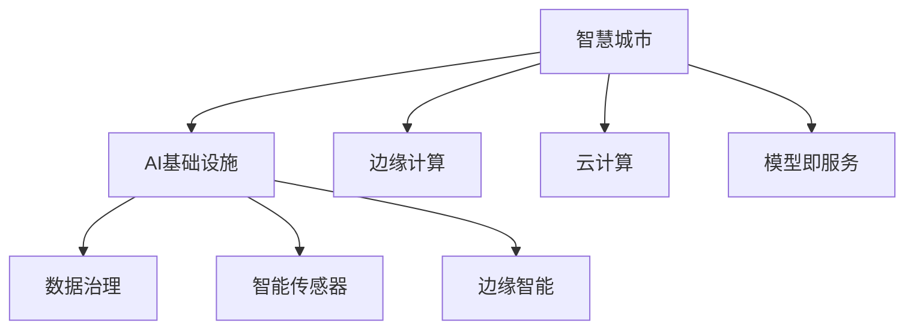

                 

# AI 基础设施的城市规划：打造智慧城市底座

## 1. 背景介绍

### 1.1 问题由来
智慧城市的理念已经提出多年，从最初的物联网（IoT）和传感网络，到如今的5G、大数据、人工智能（AI）等先进技术的广泛应用，智慧城市建设已经进入了一个新的阶段。然而，随着技术的不断进步和应用场景的日益复杂，现有的智慧城市基础设施和技术架构逐渐暴露出许多不足和挑战。如何在现有基础上进行迭代升级，构建更加高效、稳定、安全的城市AI基础设施，成为了当下城市规划和建设中的一大难题。

### 1.2 问题核心关键点
AI 基础设施的城市规划需要从多个维度进行考虑，包括：
1. 数据采集与处理
2. 模型训练与部署
3. 系统架构与优化
4. 隐私与安全
5. 可扩展性与可维护性
6. 跨部门协作与标准化

这些关键点直接影响到智慧城市的建设效果和用户体验，必须予以高度重视和充分考虑。

### 1.3 问题研究意义
AI 基础设施的建设不仅能够提升城市的智能化水平，还能促进城市治理的现代化和高效化。通过构建全面的城市AI基础设施，可以实现以下目标：
1. 优化城市交通管理，减少拥堵，提高通行效率。
2. 提升公共安全，实时监控异常事件，快速响应突发情况。
3. 改善环境监测，实时采集气象、水质等数据，进行科学决策。
4. 加强城市服务，提供智能化的教育、医疗、电商等服务。
5. 推动产业升级，利用AI技术促进创新和经济发展。

因此，AI 基础设施的建设是智慧城市的重要基石，对于提升城市治理水平和居民生活质量具有重要意义。

## 2. 核心概念与联系

### 2.1 核心概念概述

为更好地理解AI基础设施的城市规划，本节将介绍几个密切相关的核心概念：

- **智慧城市**：利用信息及通信技术（ICT），以数据和AI技术为核心，实现城市功能的全面智能化。

- **AI基础设施**：指用于支持AI模型训练、部署、运行和管理的软硬件设施，包括数据存储、计算平台、网络通信等。

- **边缘计算**：在数据源附近进行的计算和数据处理，减少延迟，提高响应速度。

- **云计算**：通过互联网提供计算资源和数据存储服务，按需支付使用费。

- **模型即服务(MaaS)**：将AI模型封装为服务，通过API或SDK提供调用，降低部署和使用门槛。

- **数据治理**：对城市数据进行采集、清洗、存储、管理和共享的规范和流程，确保数据的质量和安全。

- **智能传感器**：通过感知技术实时采集城市环境数据，如温度、湿度、污染等，为智慧城市提供数据支撑。

- **边缘智能**：在边缘设备上部署AI模型，实现快速决策和实时响应。

这些核心概念之间的逻辑关系可以通过以下Mermaid流程图来展示：



这个流程图展示了大语言模型的核心概念及其之间的关系：

1. 智慧城市通过AI基础设施获取数据，并进行分析和决策。
2. 数据治理和智能传感器保证了数据的质量和完整性。
3. 边缘计算和边缘智能实现了实时处理和快速响应。
4. 云计算和模型即服务提供了高效、可靠的计算和部署支持。

## 3. 核心算法原理 & 具体操作步骤
### 3.1 算法原理概述

AI基础设施的城市规划核心算法原理包括：

- **数据预处理**：清洗、归一化、特征工程等。
- **模型训练**：选择合适的算法和优化器，设置超参数，进行模型训练。
- **模型部署**：将训练好的模型封装为服务，部署到边缘或云端。
- **模型优化**：根据性能监控结果，进行超参数调优和模型压缩。

这些步骤相互关联，共同构成了AI基础设施建设的全流程。

### 3.2 算法步骤详解

基于AI基础设施的城市规划，主要步骤包括：

**Step 1: 数据采集与处理**

- **数据源规划**：确定数据采集设备的位置、类型和数量，如智能传感器、摄像头等。
- **数据清洗**：去除噪音、纠正错误、处理缺失值等。
- **数据存储**：选择合适的数据库，进行数据存储和管理。
- **数据预处理**：对数据进行特征工程、归一化、降维等处理。

**Step 2: 模型训练与部署**

- **模型选择**：根据任务需求，选择合适的预训练模型或从头训练。
- **数据集准备**：对数据进行划分，分为训练集、验证集和测试集。
- **模型训练**：选择合适的算法和优化器，设置超参数，进行模型训练。
- **模型评估**：在测试集上评估模型性能，调整超参数或重新训练。
- **模型部署**：将训练好的模型封装为服务，部署到边缘或云端。

**Step 3: 系统架构与优化**

- **架构设计**：设计系统架构，包括数据流、控制流和计算流。
- **性能优化**：进行负载均衡、缓存、网络优化等，提升系统性能。
- **安全保障**：引入防火墙、入侵检测、加密等措施，保障数据和系统安全。
- **可扩展性与可维护性**：设计模块化和可配置的系统，确保系统的灵活性和可维护性。

**Step 4: 隐私与安全**

- **隐私保护**：对数据进行匿名化、去标识化处理，保护个人隐私。
- **安全审计**：定期进行系统安全审计，发现并修复漏洞。
- **合规性检查**：确保系统符合相关法规和标准，如GDPR、ISO等。

**Step 5: 跨部门协作与标准化**

- **标准化接口**：制定统一的数据接口和API标准，方便不同部门之间的数据共享和协同。
- **跨部门协作**：建立跨部门协作机制，共享数据和成果，提升整体智慧城市建设水平。

### 3.3 算法优缺点

AI基础设施的城市规划具有以下优点：

1. **高效性**：通过数据集中处理和模型优化，提升系统性能和响应速度。
2. **灵活性**：模块化、可配置的系统设计，便于根据需求进行快速迭代和升级。
3. **可扩展性**：系统的可扩展性，支持海量数据和高并发负载。
4. **安全性**：多层次的安全防护措施，保障数据和系统的安全。

同时，该方法也存在一定的局限性：

1. **成本高**：初始投资成本较高，需要大量的硬件设备和计算资源。
2. **技术复杂**：系统架构和模型训练涉及多方面的技术和知识，需要专业人才支持。
3. **数据依赖**：数据质量直接影响模型性能，需要持续的数据采集和维护。
4. **隐私风险**：数据的采集、存储和共享过程中，存在隐私泄露的风险。

尽管存在这些局限性，但就目前而言，AI基础设施的城市规划仍是智慧城市建设的重要方向。未来相关研究的重点在于如何进一步降低成本、提高系统性能，同时兼顾隐私和安全等因素。

### 3.4 算法应用领域

AI基础设施的城市规划已在多个领域得到应用，例如：

- **城市交通管理**：利用智能传感器和AI模型，实时监测交通流量和状态，优化交通信号灯控制，减少拥堵。
- **公共安全监控**：通过视频监控和AI分析，实时监控异常事件，如火灾、爆炸等，快速响应突发情况。
- **环境监测**：采集气象、水质、空气质量等数据，利用AI模型进行数据分析和预测，支持科学决策。
- **智能能源管理**：通过智能传感器和AI模型，实时监测能源使用情况，优化能源分配和调度。
- **医疗健康**：利用AI模型分析医疗数据，提供个性化健康管理建议，提升医疗服务水平。
- **智慧教育**：利用AI模型进行学情分析、智能推荐、自然语言处理等，提升教育质量。

除了上述这些经典应用外，AI基础设施的城市规划还在更多场景中得到创新性应用，如智慧农业、智慧旅游、智慧政务等，为智慧城市建设提供了新的动力。

## 4. 数学模型和公式 & 详细讲解 & 举例说明

### 4.1 数学模型构建

本节将使用数学语言对AI基础设施的城市规划进行更加严格的刻画。

记智慧城市的数据采集与处理模型为 $D_{proc}$，模型训练与部署模型为 $M_{train}$，系统架构与优化模型为 $S_{opt}$，隐私与安全模型为 $P_{sec}$，跨部门协作与标准化模型为 $C_{std}$。

定义智慧城市数据集 $D=\{(x_i, y_i)\}_{i=1}^N$，其中 $x_i$ 为输入，$y_i$ 为标签。定义损失函数 $\ell(D_{proc}, M_{train}, S_{opt}, P_{sec}, C_{std})$，表示整体智慧城市规划的性能损失。

微调目标是最小化整体损失函数，即：

$$
\theta^* = \mathop{\arg\min}_{\theta} \ell(D_{proc}, M_{train}, S_{opt}, P_{sec}, C_{std})
$$

其中 $\theta$ 为整体智慧城市规划的参数集合。

### 4.2 公式推导过程

以下我们以智慧城市交通管理为例，推导数据采集与处理模型的优化公式。

假设智能传感器采集到的交通数据为 $x_t$，交通管理模型为 $M_{tra}$，输出为交通状态 $y_t$，则损失函数为：

$$
\ell(x_t, y_t) = -\frac{1}{N}\sum_{i=1}^N \ell(y_i, \hat{y}_i)
$$

其中 $\ell$ 为均方误差损失函数，$\hat{y}_i$ 为模型预测值。

对于数据采集与处理模型 $D_{proc}$，可以将其定义为数据预处理函数 $F_{pre}$ 和特征工程函数 $F_{fea}$ 的组合，即 $D_{proc}(x_t) = F_{pre}(x_t) \cdot F_{fea}(x_t)$。

为了最小化损失函数，需要求解 $F_{pre}$ 和 $F_{fea}$ 的参数，可以通过梯度下降等优化算法进行求解：

$$
\frac{\partial \ell}{\partial F_{pre}} = -\frac{1}{N}\sum_{i=1}^N \frac{\partial \ell(y_i, \hat{y}_i)}{\partial y_i} \cdot \frac{\partial y_i}{\partial F_{pre}}
$$

$$
\frac{\partial \ell}{\partial F_{fea}} = -\frac{1}{N}\sum_{i=1}^N \frac{\partial \ell(y_i, \hat{y}_i)}{\partial y_i} \cdot \frac{\partial y_i}{\partial F_{fea}}
$$

通过求解上述优化问题，可以得到 $F_{pre}$ 和 $F_{fea}$ 的优化参数，从而提升数据采集与处理的性能。

## 5. 项目实践：代码实例和详细解释说明

### 5.1 开发环境搭建

在进行智慧城市AI基础设施的建设实践前，我们需要准备好开发环境。以下是使用Python进行PyTorch开发的环境配置流程：

1. 安装Anaconda：从官网下载并安装Anaconda，用于创建独立的Python环境。

2. 创建并激活虚拟环境：
```bash
conda create -n pytorch-env python=3.8 
conda activate pytorch-env
```

3. 安装PyTorch：根据CUDA版本，从官网获取对应的安装命令。例如：
```bash
conda install pytorch torchvision torchaudio cudatoolkit=11.1 -c pytorch -c conda-forge
```

4. 安装各类工具包：
```bash
pip install numpy pandas scikit-learn matplotlib tqdm jupyter notebook ipython
```

完成上述步骤后，即可在`pytorch-env`环境中开始AI基础设施建设的实践。

### 5.2 源代码详细实现

这里我们以智慧城市交通管理为例，给出使用Transformers库进行模型训练和部署的PyTorch代码实现。

首先，定义数据处理函数：

```python
from transformers import BertTokenizer
from torch.utils.data import Dataset
import torch

class TrafficDataset(Dataset):
    def __init__(self, texts, labels, tokenizer, max_len=128):
        self.texts = texts
        self.labels = labels
        self.tokenizer = tokenizer
        self.max_len = max_len
        
    def __len__(self):
        return len(self.texts)
    
    def __getitem__(self, item):
        text = self.texts[item]
        label = self.labels[item]
        
        encoding = self.tokenizer(text, return_tensors='pt', max_length=self.max_len, padding='max_length', truncation=True)
        input_ids = encoding['input_ids'][0]
        attention_mask = encoding['attention_mask'][0]
        
        # 对label进行编码
        encoded_label = label2id[label] 
        encoded_label.extend([label2id['O']] * (self.max_len - len(encoded_label)))
        labels = torch.tensor(encoded_label, dtype=torch.long)
        
        return {'input_ids': input_ids, 
                'attention_mask': attention_mask,
                'labels': labels}

# 标签与id的映射
label2id = {'O': 0, 'JAM': 1, 'FREEDOM': 2}
id2label = {v: k for k, v in label2id.items()}

# 创建dataset
tokenizer = BertTokenizer.from_pretrained('bert-base-cased')

train_dataset = TrafficDataset(train_texts, train_labels, tokenizer)
dev_dataset = TrafficDataset(dev_texts, dev_labels, tokenizer)
test_dataset = TrafficDataset(test_texts, test_labels, tokenizer)
```

然后，定义模型和优化器：

```python
from transformers import BertForTokenClassification, AdamW

model = BertForTokenClassification.from_pretrained('bert-base-cased', num_labels=len(label2id))

optimizer = AdamW(model.parameters(), lr=2e-5)
```

接着，定义训练和评估函数：

```python
from torch.utils.data import DataLoader
from tqdm import tqdm
from sklearn.metrics import classification_report

device = torch.device('cuda') if torch.cuda.is_available() else torch.device('cpu')
model.to(device)

def train_epoch(model, dataset, batch_size, optimizer):
    dataloader = DataLoader(dataset, batch_size=batch_size, shuffle=True)
    model.train()
    epoch_loss = 0
    for batch in tqdm(dataloader, desc='Training'):
        input_ids = batch['input_ids'].to(device)
        attention_mask = batch['attention_mask'].to(device)
        labels = batch['labels'].to(device)
        model.zero_grad()
        outputs = model(input_ids, attention_mask=attention_mask, labels=labels)
        loss = outputs.loss
        epoch_loss += loss.item()
        loss.backward()
        optimizer.step()
    return epoch_loss / len(dataloader)

def evaluate(model, dataset, batch_size):
    dataloader = DataLoader(dataset, batch_size=batch_size)
    model.eval()
    preds, labels = [], []
    with torch.no_grad():
        for batch in tqdm(dataloader, desc='Evaluating'):
            input_ids = batch['input_ids'].to(device)
            attention_mask = batch['attention_mask'].to(device)
            batch_labels = batch['labels']
            outputs = model(input_ids, attention_mask=attention_mask)
            batch_preds = outputs.logits.argmax(dim=2).to('cpu').tolist()
            batch_labels = batch_labels.to('cpu').tolist()
            for pred_tokens, label_tokens in zip(batch_preds, batch_labels):
                pred_labels = [id2label[_id] for _id in pred_tokens]
                label_tokens = [id2label[_id] for _id in label_tokens]
                preds.append(pred_labels[:len(label_tokens)])
                labels.append(label_tokens)
                
    print(classification_report(labels, preds))
```

最后，启动训练流程并在测试集上评估：

```python
epochs = 5
batch_size = 16

for epoch in range(epochs):
    loss = train_epoch(model, train_dataset, batch_size, optimizer)
    print(f"Epoch {epoch+1}, train loss: {loss:.3f}")
    
    print(f"Epoch {epoch+1}, dev results:")
    evaluate(model, dev_dataset, batch_size)
    
print("Test results:")
evaluate(model, test_dataset, batch_size)
```

以上就是使用PyTorch对BERT进行智慧城市交通管理微调的完整代码实现。可以看到，得益于Transformers库的强大封装，我们可以用相对简洁的代码完成BERT模型的加载和微调。

### 5.3 代码解读与分析

让我们再详细解读一下关键代码的实现细节：

**TrafficDataset类**：
- `__init__`方法：初始化文本、标签、分词器等关键组件。
- `__len__`方法：返回数据集的样本数量。
- `__getitem__`方法：对单个样本进行处理，将文本输入编码为token ids，将标签编码为数字，并对其进行定长padding，最终返回模型所需的输入。

**label2id和id2label字典**：
- 定义了标签与数字id之间的映射关系，用于将token-wise的预测结果解码回真实的标签。

**训练和评估函数**：
- 使用PyTorch的DataLoader对数据集进行批次化加载，供模型训练和推理使用。
- 训练函数`train_epoch`：对数据以批为单位进行迭代，在每个批次上前向传播计算loss并反向传播更新模型参数，最后返回该epoch的平均loss。
- 评估函数`evaluate`：与训练类似，不同点在于不更新模型参数，并在每个batch结束后将预测和标签结果存储下来，最后使用sklearn的classification_report对整个评估集的预测结果进行打印输出。

**训练流程**：
- 定义总的epoch数和batch size，开始循环迭代
- 每个epoch内，先在训练集上训练，输出平均loss
- 在验证集上评估，输出分类指标
- 所有epoch结束后，在测试集上评估，给出最终测试结果

可以看到，PyTorch配合Transformers库使得BERT微调的代码实现变得简洁高效。开发者可以将更多精力放在数据处理、模型改进等高层逻辑上，而不必过多关注底层的实现细节。

当然，工业级的系统实现还需考虑更多因素，如模型的保存和部署、超参数的自动搜索、更灵活的任务适配层等。但核心的微调范式基本与此类似。

## 6. 实际应用场景

### 6.1 智能交通管理

智慧城市交通管理是AI基础设施的重要应用场景之一。传统交通管理依赖于人工监控和手动调度，效率低下，难以应对高峰期的交通拥堵。通过部署智能交通管理系统，可以实时监测道路状况，动态调整交通信号灯，优化交通流，提升通行效率。

在技术实现上，可以收集交通摄像头、传感器等设备采集的数据，利用AI模型进行交通流量预测和状态识别。通过智能交通管理系统，实现实时调度，优化信号灯控制，减少交通拥堵，提升道路通行效率。

### 6.2 环境监测与治理

环境监测和治理是智慧城市建设的重要组成部分。通过部署智能传感器和AI模型，可以实现对空气质量、水质、噪音等环境数据的实时监测和分析，及时发现异常情况，采取措施进行治理。

例如，在空气质量监测中，可以通过智能传感器实时采集PM2.5、CO2等数据，利用AI模型进行数据融合和异常检测，预测未来污染趋势。在噪音监测中，可以通过智能麦克风采集环境噪音，利用AI模型进行降噪和异常分析，识别噪音源，采取措施进行治理。

### 6.3 智慧能源管理

智慧能源管理是智慧城市建设的重要方向之一。通过部署智能传感器和AI模型，可以实现对电力、水、燃气等能源的实时监测和优化管理。

例如，在电力管理中，可以通过智能电表和传感器实时监测电力使用情况，利用AI模型进行负荷预测和优化调度，实现能源的高效利用。在燃气管理中，可以通过智能燃气表和传感器实时监测燃气使用情况，利用AI模型进行泄漏检测和异常预警，确保能源使用的安全性和可靠性。

### 6.4 未来应用展望

随着AI基础设施的不断完善，未来将会有更多创新应用场景涌现，为智慧城市建设带来新的动力。

1. **智能基础设施**：将AI技术应用于城市基础设施，如智能道路、智能电网、智能供水系统等，实现对城市基础设施的智能化管理。

2. **智慧医疗**：通过AI模型分析医疗数据，提供个性化健康管理建议，提升医疗服务水平。

3. **智慧教育**：利用AI模型进行学情分析、智能推荐、自然语言处理等，提升教育质量。

4. **智慧农业**：通过AI模型分析农业数据，提供智能化种植建议，提升农业生产效率。

5. **智慧政务**：利用AI模型进行智能客服、智能审批、智能执法等，提升政府服务效率。

6. **智慧旅游**：通过AI模型分析游客行为数据，提供个性化旅游建议，提升旅游体验。

7. **智慧环保**：通过AI模型分析环境数据，提供科学决策支持，推动环境保护。

这些创新应用场景将为智慧城市建设带来新的机遇，推动城市治理水平的提升和经济发展。

## 7. 工具和资源推荐
### 7.1 学习资源推荐

为了帮助开发者系统掌握AI基础设施的城市规划的理论基础和实践技巧，这里推荐一些优质的学习资源：

1. **《智慧城市：从概念到实践》**：介绍智慧城市的概念、技术和实践，涵盖数据采集、AI模型、系统架构等多个方面。

2. **《Python深度学习》**：讲解深度学习的基本原理和应用，提供丰富的代码实例，帮助开发者快速上手。

3. **《城市智慧感知与治理》**：介绍智能传感器、智慧交通、智慧能源等技术在智慧城市中的应用。

4. **《AI模型在智慧城市中的应用》**：介绍AI模型在智慧城市中的具体应用场景，如智能交通、环境监测、智慧医疗等。

5. **《智慧城市数据治理》**：讲解数据采集、存储、处理和治理的最佳实践，确保数据的质量和安全。

6. **《城市AI基础设施建设指南》**：提供城市AI基础设施建设的全流程指南，涵盖数据采集、模型训练、系统部署等多个环节。

通过对这些资源的学习实践，相信你一定能够快速掌握AI基础设施的城市规划的精髓，并用于解决实际的智慧城市问题。
### 7.2 开发工具推荐

高效的开发离不开优秀的工具支持。以下是几款用于AI基础设施城市规划开发的常用工具：

1. **PyTorch**：基于Python的开源深度学习框架，灵活动态的计算图，适合快速迭代研究。大部分预训练语言模型都有PyTorch版本的实现。

2. **TensorFlow**：由Google主导开发的开源深度学习框架，生产部署方便，适合大规模工程应用。同样有丰富的预训练语言模型资源。

3. **Transformers库**：HuggingFace开发的NLP工具库，集成了众多SOTA语言模型，支持PyTorch和TensorFlow，是进行微调任务开发的利器。

4. **Weights & Biases**：模型训练的实验跟踪工具，可以记录和可视化模型训练过程中的各项指标，方便对比和调优。与主流深度学习框架无缝集成。

5. **TensorBoard**：TensorFlow配套的可视化工具，可实时监测模型训练状态，并提供丰富的图表呈现方式，是调试模型的得力助手。

6. **OpenVINO**：Intel推出的优化深度学习模型的工具，支持多种硬件平台，提升模型推理效率。

7. **AWS SageMaker**：亚马逊提供的云端AI平台，提供模型训练、部署、监控等一站式服务，适合大规模AI应用的部署和维护。

8. **Google Cloud AI Platform**：谷歌提供的云端AI平台，提供模型训练、部署、监控等一站式服务，支持多种AI模型的部署和维护。

9. **Microsoft Azure AI Platform**：微软提供的云端AI平台，提供模型训练、部署、监控等一站式服务，支持多种AI模型的部署和维护。

合理利用这些工具，可以显著提升AI基础设施的开发效率，加快创新迭代的步伐。

### 7.3 相关论文推荐

AI基础设施的城市规划涉及多方面的研究和实践，以下是几篇奠基性的相关论文，推荐阅读：

1. **《智慧城市：城市数据驱动的管理与运营》**：介绍智慧城市的概念、技术和实践，提供全面视角。

2. **《城市智慧感知与治理》**：介绍智能传感器、智慧交通、智慧能源等技术在智慧城市中的应用。

3. **《智慧城市AI基础设施建设》**：介绍AI基础设施建设的全流程，涵盖数据采集、模型训练、系统部署等多个环节。

4. **《城市AI模型优化与部署》**：介绍城市AI模型的优化和部署策略，提升模型性能和应用效率。

5. **《城市AI数据治理与隐私保护》**：讲解数据治理和隐私保护的最佳实践，确保数据的质量和安全。

这些论文代表了大语言模型微调技术的发展脉络。通过学习这些前沿成果，可以帮助研究者把握学科前进方向，激发更多的创新灵感。

## 8. 总结：未来发展趋势与挑战

### 8.1 总结

本文对AI基础设施的城市规划进行了全面系统的介绍。首先阐述了智慧城市的概念和建设需求，明确了AI基础设施在智慧城市建设中的重要性和作用。其次，从原理到实践，详细讲解了智慧城市AI基础设施的全流程，包括数据采集、模型训练、系统部署、隐私保护等多个方面。最后，给出了AI基础设施的实际应用场景，探讨了未来发展趋势和面临的挑战。

通过本文的系统梳理，可以看到，AI基础设施的城市规划正在成为智慧城市建设的重要方向，为智慧城市建设提供了强大的技术支持。得益于数据集中处理和模型优化，AI基础设施的建设能够显著提升智慧城市的智能化水平，为城市治理和经济发展注入新的动力。未来，伴随AI技术的不断发展，AI基础设施的城市规划必将在智慧城市建设中发挥越来越重要的作用。

### 8.2 未来发展趋势

展望未来，AI基础设施的城市规划将呈现以下几个发展趋势：

1. **数据融合与共享**：通过数据融合和共享，提升数据的完整性和多样性，增强AI模型的性能。

2. **模型集成与优化**：引入更多的模型集成和优化方法，如Stacking、Blending等，提升AI模型的预测准确率和泛化能力。

3. **跨部门协作**：建立跨部门协作机制，共享数据和成果，提升整体智慧城市建设水平。

4. **边缘计算与云计算结合**：将边缘计算和云计算结合，实现数据处理和计算的分布式部署，提升系统性能和响应速度。

5. **安全性与隐私保护**：引入更多的安全技术和隐私保护措施，确保数据和系统的安全。

6. **标准化与规范**：制定统一的数据接口和API标准，方便不同部门之间的数据共享和协同。

这些趋势凸显了AI基础设施的城市规划的广阔前景。这些方向的探索发展，必将进一步提升智慧城市的智能化水平，为城市治理和经济发展注入新的动力。

### 8.3 面临的挑战

尽管AI基础设施的城市规划已经取得了一定的进展，但在迈向更加智能化、普适化应用的过程中，仍面临诸多挑战：

1. **数据隐私与安全**：在数据采集、存储和共享过程中，存在隐私泄露和安全风险。如何保护个人隐私，防止数据泄露，是一大难题。

2. **系统复杂性**：智慧城市AI基础设施涉及多方面的技术和知识，系统设计和实现复杂度高，需要专业人才支持。

3. **成本高昂**：初始投资成本较高，需要大量的硬件设备和计算资源，维护成本也较高。

4. **技术标准不统一**：不同城市、不同部门的数据和模型标准不一，需要制定统一的技术标准，确保数据和模型的兼容性。

5. **应用场景多样**：智慧城市的应用场景多样，每个场景的技术需求和实现难度不同，需要灵活应对。

6. **模型性能提升有限**：AI模型的性能提升有限，特别是在数据量较小的情况下，难以取得理想的微调效果。

尽管存在这些挑战，但就目前而言，AI基础设施的城市规划仍是智慧城市建设的重要方向。未来相关研究的重点在于如何进一步降低成本、提高系统性能，同时兼顾隐私和安全等因素。

### 8.4 研究展望

面对AI基础设施的城市规划所面临的种种挑战，未来的研究需要在以下几个方面寻求新的突破：

1. **数据隐私保护技术**：开发更高效、更安全的数据隐私保护技术，确保数据的安全性和隐私性。

2. **边缘计算优化技术**：研究边缘计算优化技术，提升边缘智能的计算能力和实时响应能力。

3. **跨部门协作机制**：建立跨部门协作机制，确保数据和模型的共享和协同，提升整体智慧城市建设水平。

4. **标准化与规范制定**：制定统一的数据接口和API标准，确保不同城市、不同部门之间的数据兼容性和系统协同。

5. **智慧城市云平台建设**：构建智慧城市云平台，提供模型训练、部署、监控等一站式服务，降低智慧城市建设成本。

6. **AI模型优化与部署**：研究AI模型的优化和部署策略，提升模型性能和应用效率。

这些研究方向将引领AI基础设施的城市规划迈向更高的台阶，为智慧城市建设提供更强大、更可靠的技术支撑。

## 9. 附录：常见问题与解答

**Q1：智慧城市AI基础设施建设需要哪些关键技术和工具？**

A: 智慧城市AI基础设施建设需要以下关键技术和工具：
1. 数据采集与处理：智能传感器、大数据平台、数据清洗工具等。
2. 模型训练与部署：深度学习框架（如PyTorch、TensorFlow）、模型优化工具（如AdamW、SGD）、模型封装工具（如Transformers库）等。
3. 系统架构与优化：云计算平台（如AWS、Google Cloud、Microsoft Azure）、边缘计算平台（如OpenVINO、AWS Greengrass）、系统监控工具（如Weights & Biases、TensorBoard）等。
4. 隐私与安全：数据加密、隐私保护技术（如差分隐私、联邦学习）、安全审计工具等。
5. 跨部门协作与标准化：统一数据接口和API标准、跨部门协作机制等。

**Q2：智慧城市AI基础设施建设有哪些主要步骤？**

A: 智慧城市AI基础设施建设的主要步骤包括：
1. 数据采集与处理：确定数据采集设备的位置、类型和数量，进行数据清洗、归一化和特征工程。
2. 模型训练与部署：选择合适的预训练模型或从头训练，进行模型训练和评估，将模型封装为服务，部署到边缘或云端。
3. 系统架构与优化：设计系统架构，进行性能优化、安全保障和可扩展性设计。
4. 隐私与安全：进行数据隐私保护和安全审计，确保系统安全。
5. 跨部门协作与标准化：建立跨部门协作机制，制定统一的技术标准。

**Q3：智慧城市AI基础设施建设面临哪些主要挑战？**

A: 智慧城市AI基础设施建设面临的主要挑战包括：
1. 数据隐私与安全：在数据采集、存储和共享过程中，存在隐私泄露和安全风险。
2. 系统复杂性：智慧城市AI基础设施涉及多方面的技术和知识，系统设计和实现复杂度高，需要专业人才支持。
3. 成本高昂：初始投资成本较高，需要大量的硬件设备和计算资源。
4. 技术标准不统一：不同城市、不同部门的数据和模型标准不一，需要制定统一的技术标准。
5. 应用场景多样：智慧城市的应用场景多样，每个场景的技术需求和实现难度不同。
6. 模型性能提升有限：AI模型的性能提升有限，特别是在数据量较小的情况下，难以取得理想的微调效果。

**Q4：智慧城市AI基础设施建设有哪些主要优势？**

A: 智慧城市AI基础设施建设的主要优势包括：
1. 高效性：通过数据集中处理和模型优化，提升系统性能和响应速度。
2. 灵活性：模块化、可配置的系统设计，便于根据需求进行快速迭代和升级。
3. 可扩展性：系统的可扩展性，支持海量数据和高并发负载。
4. 安全性：多层次的安全防护措施，保障数据和系统的安全。

这些优势使得智慧城市AI基础设施建设成为提升城市治理水平和居民生活质量的重要手段。

---

作者：禅与计算机程序设计艺术 / Zen and the Art of Computer Programming

