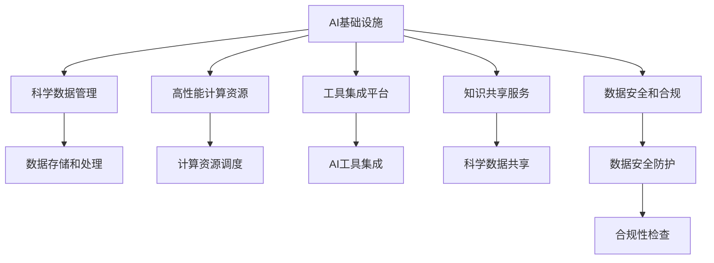

                 

## 1. 背景介绍

### 1.1 问题由来

当前科学研究正处于数字化、信息化、智能化的关键阶段。人工智能（AI）技术的突破性进展为科学研究提供了新的工具和方法，大大提升了科学发现的速度和质量。然而，AI基础设施的科研支持仍然面临诸多挑战，制约了其在科研领域的应用和发展。如何构建高效的AI基础设施，加速科学发现进程，成为了摆在我们面前的重要课题。

### 1.2 问题核心关键点

AI基础设施科研支持的挑战主要包括以下几个方面：

- **数据管理**：科学数据通常量大、复杂且多样化，如何有效管理和利用这些数据，是科研支持的重要问题。
- **计算资源**：科学研究涉及复杂的计算模型和模拟，需要高性能计算资源的支持。
- **工具集成**：现有的AI工具和技术系统多且杂，缺乏统一的标准和接口，难以整合使用。
- **知识共享**：科研成果需要易于分享和访问，以实现科学数据的开放共享和跨学科交流。
- **安全合规**：科学研究涉及敏感数据和知识产权保护，如何确保数据安全和合规，是科研支持的重要考虑因素。

这些问题不仅影响了科研工作的效率和质量，还限制了AI技术在科学研究中的应用潜力。因此，构建高效的AI基础设施，提供全面的科研支持，是推动科研创新和科学发现的重要手段。

### 1.3 问题研究意义

构建高效的AI基础设施，为科研提供全面的支持，具有以下重要意义：

- **提升科研效率**：通过高效的AI工具和平台，减少科研人员在数据处理、计算资源申请等方面的时间消耗，集中精力进行科学探索。
- **推动科学发现**：AI技术的辅助，使得复杂数据分析、模式识别、预测建模等任务变得更加高效，加速科学发现进程。
- **促进知识共享**：科学数据的开放共享和跨学科交流，促进了科研领域的创新和协作，推动了科学共同体的发展。
- **保障数据安全**：通过严格的数据管理和安全控制，保护科研数据的隐私和知识产权，确保科研活动的合规性。

总之，构建高效的AI基础设施，可以为科研人员提供全面、高效、安全的支持，加速科学发现进程，推动科学技术的进步。

## 2. 核心概念与联系

### 2.1 核心概念概述

为更好地理解AI基础设施科研支持，本节将介绍几个密切相关的核心概念：

- **AI基础设施**：指为AI技术应用提供支持的基础设施，包括数据存储和处理、计算资源管理、工具和平台集成、知识共享和安全合规等。
- **科学发现**：通过科学研究，揭示自然现象和规律的创新过程。
- **科研支持**：为科研活动提供所需的工具、资源、平台和服务，促进科研工作的顺利进行。

这些核心概念之间的逻辑关系可以通过以下Mermaid流程图来展示：



这个流程图展示出AI基础设施的核心组件及其之间的联系：

1. **数据管理**：通过数据存储和处理，提供科学数据的采集、存储、清洗和标注。
2. **计算资源**：通过高性能计算资源的管理和调度，支持复杂的计算任务和模拟。
3. **工具集成**：通过工具集成平台，提供统一的API和接口，方便科研人员使用多种AI工具和技术。
4. **知识共享**：通过知识共享服务，实现科学数据的开放共享和跨学科交流。
5. **安全合规**：通过数据安全和合规措施，保护科研数据的隐私和知识产权，确保科研活动的合规性。

这些组件共同构成了AI基础设施的核心功能，为其科研支持提供了全方位的支持。

## 3. 核心算法原理 & 具体操作步骤

### 3.1 算法原理概述

AI基础设施的科研支持，涉及多个领域的核心算法和技术，主要包括：

- **数据管理算法**：用于高效管理和利用科学数据。
- **高性能计算算法**：用于管理高性能计算资源，支持复杂的计算任务和模拟。
- **工具集成算法**：用于提供统一的API和接口，支持多种AI工具和技术的使用。
- **知识共享算法**：用于实现科学数据的开放共享和跨学科交流。
- **安全合规算法**：用于保护科研数据的隐私和知识产权，确保科研活动的合规性。

### 3.2 算法步骤详解

AI基础设施的科研支持，通常包括以下几个关键步骤：

**Step 1: 数据管理和存储**

- **数据采集**：从各种科学实验、观测和文献中获取数据。
- **数据清洗和标注**：对数据进行预处理，包括去噪、归一化和标注等。
- **数据存储和管理**：采用分布式存储和管理系统，对数据进行高效管理和存储。

**Step 2: 高性能计算资源管理**

- **资源调度**：通过资源管理平台，动态分配计算资源，优化任务执行。
- **任务管理**：对复杂的计算任务和模拟进行任务管理，包括任务提交、监控和优化。
- **计算加速**：利用GPU、TPU等高性能硬件，加速计算任务。

**Step 3: AI工具和技术集成**

- **API接口设计**：设计统一的API接口，支持多种AI工具和技术的使用。
- **工具集成平台**：搭建工具集成平台，提供用户界面和可视化工具。
- **自动化管道构建**：通过自动化管道构建，将多个AI工具集成到统一的流程中。

**Step 4: 知识共享和开放数据**

- **数据共享平台**：搭建科学数据共享平台，实现数据的开放共享。
- **数据访问控制**：通过访问控制机制，保护数据的隐私和知识产权。
- **跨学科交流**：促进跨学科的交流和合作，推动科学共同体的发展。

**Step 5: 数据安全和合规**

- **数据加密和安全存储**：采用加密和安全存储技术，保护数据隐私和安全。
- **合规性检查**：通过合规性检查机制，确保科研活动的合规性。
- **审计和监控**：建立数据审计和监控机制，确保数据使用的透明和安全。

### 3.3 算法优缺点

AI基础设施的科研支持，具有以下优点：

- **提高效率**：通过高效的数据管理和计算资源调度，显著提高科研工作的效率。
- **促进合作**：通过知识共享和跨学科交流，促进科研领域的合作和创新。
- **保障安全**：通过数据安全和合规措施，保护科研数据的隐私和知识产权，确保科研活动的合规性。

同时，该方法也存在一定的局限性：

- **成本高**：构建高效的AI基础设施需要高昂的硬件和软件投入。
- **技术复杂**：涉及多个领域的核心算法和技术，技术复杂度较高。
- **资源限制**：高性能计算资源和存储资源的高需求，可能限制其在某些场景中的应用。

尽管存在这些局限性，但就目前而言，构建高效的AI基础设施仍然是推动科研创新和科学发现的重要手段。

### 3.4 算法应用领域

AI基础设施的科研支持，已经在多个领域得到了广泛应用，包括但不限于：

- **生命科学**：通过AI技术支持基因组学、蛋白质组学、药物研发等生命科学研究。
- **天文学**：利用AI技术分析天文数据，支持天体物理学、宇宙学等研究。
- **环境科学**：通过AI技术支持气候变化、环境监测等研究。
- **社会科学**：通过AI技术支持社会网络分析、舆情监测等研究。

除了这些经典领域，AI基础设施在更多领域的应用还在不断拓展，为科学研究提供了新的工具和方法。

## 4. 数学模型和公式 & 详细讲解 & 举例说明

### 4.1 数学模型构建

本节将使用数学语言对AI基础设施科研支持的过程进行严格刻画。

**数据管理模型**：

数据管理模型主要涉及数据的存储、清洗、标注和访问控制等。采用分布式文件系统（如Hadoop）和数据库（如Hive）进行数据管理和存储。数据清洗和标注过程可以采用数据清洗工具（如OpenRefine）和标注工具（如Labelbox）进行。数据访问控制则通过访问控制机制（如RBAC）实现。

**高性能计算模型**：

高性能计算模型主要涉及计算资源的管理和调度，以及计算任务的执行。计算资源管理可以采用资源管理平台（如Slurm）进行，计算任务执行可以采用分布式计算框架（如Spark）进行。

**工具集成模型**：

工具集成模型主要涉及API接口的设计和工具集成平台的搭建。API接口设计采用RESTful API标准，工具集成平台采用Web框架（如Django）进行搭建。

**知识共享模型**：

知识共享模型主要涉及科学数据的开放共享和跨学科交流。采用数据共享平台（如GitHub）和跨学科交流平台（如ResearchGate）进行。

**安全合规模型**：

安全合规模型主要涉及数据安全和合规性的保障。采用数据加密和安全存储技术（如AES加密），以及合规性检查机制（如GDPR）进行。

### 4.2 公式推导过程

以下我们将以数据管理模型为例，推导数据清洗和标注的数学公式。

**数据清洗公式**：

数据清洗主要涉及去噪、归一化和标注等步骤。假设原始数据为 $x_i$，清洗后的数据为 $\tilde{x}_i$，则数据清洗的公式可以表示为：

$$
\tilde{x}_i = f(x_i)
$$

其中 $f$ 为数据清洗函数，可以采用去噪函数、归一化函数和标注函数进行。

**数据标注公式**：

数据标注主要涉及将数据与标签进行关联。假设原始数据为 $x_i$，标签为 $y_i$，标注后的数据为 $\hat{x}_i$，则数据标注的公式可以表示为：

$$
\hat{x}_i = g(x_i, y_i)
$$

其中 $g$ 为数据标注函数，可以采用标注工具（如Labelbox）进行。

**数据访问控制公式**：

数据访问控制主要涉及用户的身份验证和权限管理。假设用户为 $u$，访问权限为 $p$，访问控制结果为 $c$，则数据访问控制的公式可以表示为：

$$
c = h(u, p)
$$

其中 $h$ 为访问控制函数，可以采用访问控制机制（如RBAC）进行。

### 4.3 案例分析与讲解

**案例：基因组数据管理**

基因组数据管理是生命科学研究中的典型应用。基因组数据通常庞大且复杂，如何高效管理和利用这些数据是关键问题。

**数据采集和存储**：采用NGS（Next-Generation Sequencing）技术采集基因组数据，利用Hadoop和Hive进行数据管理和存储。

**数据清洗和标注**：使用OpenRefine进行数据清洗，去除噪音和重复数据；使用Labelbox进行数据标注，将基因序列与功能注释进行关联。

**数据访问控制**：通过RBAC机制，控制不同用户的访问权限，确保数据隐私和安全。

**高性能计算**：利用Spark进行大规模基因组数据处理和分析，提高计算效率。

## 5. 项目实践：代码实例和详细解释说明

### 5.1 开发环境搭建

在进行AI基础设施科研支持的项目实践前，我们需要准备好开发环境。以下是使用Python进行PyTorch开发的环境配置流程：

1. 安装Anaconda：从官网下载并安装Anaconda，用于创建独立的Python环境。

2. 创建并激活虚拟环境：
```bash
conda create -n pytorch-env python=3.8 
conda activate pytorch-env
```

3. 安装PyTorch：根据CUDA版本，从官网获取对应的安装命令。例如：
```bash
conda install pytorch torchvision torchaudio cudatoolkit=11.1 -c pytorch -c conda-forge
```

4. 安装TensorBoard：TensorFlow配套的可视化工具，用于实时监测模型训练状态。

5. 安装Jupyter Notebook：用于编写和运行Python代码，支持多种编程语言和数据格式。

6. 安装GitHub：用于版本控制和代码协作，支持快速迭代和共享。

完成上述步骤后，即可在`pytorch-env`环境中开始项目实践。

### 5.2 源代码详细实现

下面我们以基因组数据管理为例，给出使用PyTorch进行数据清洗和标注的Python代码实现。

首先，定义数据清洗函数：

```python
import pandas as pd

def clean_data(data_file):
    # 读取数据文件
    df = pd.read_csv(data_file)
    
    # 去噪
    df.drop_duplicates(inplace=True)
    df.dropna(subset=['feature', 'label'], inplace=True)
    
    # 归一化
    df['feature'] = (df['feature'] - df['feature'].mean()) / df['feature'].std()
    
    # 标注
    df['label'] = df['label'].map({'0': 1, '1': 2})
    
    # 保存清洗后的数据
    df.to_csv('cleaned_data.csv', index=False)
```

然后，定义数据标注函数：

```python
def annotate_data(data_file):
    # 读取数据文件
    df = pd.read_csv(data_file)
    
    # 标注
    df['label'] = df['feature'].map(lambda x: 1 if x > 0 else 2)
    
    # 保存标注后的数据
    df.to_csv('annotated_data.csv', index=False)
```

最后，启动数据清洗和标注流程：

```python
# 数据清洗
clean_data('raw_data.csv')

# 数据标注
annotate_data('cleaned_data.csv')
```

以上就是使用PyTorch进行基因组数据管理的数据清洗和标注代码实现。可以看到，通过简单的Python函数，我们能够高效地完成数据清洗和标注任务，为科学研究提供数据支持。

### 5.3 代码解读与分析

让我们再详细解读一下关键代码的实现细节：

**clean_data函数**：
- `pd.read_csv(data_file)`：读取原始数据文件。
- `df.drop_duplicates(inplace=True)`：去除重复数据。
- `df.dropna(subset=['feature', 'label'], inplace=True)`：去除缺失值。
- `df['feature'] = (df['feature'] - df['feature'].mean()) / df['feature'].std()`：归一化处理。
- `df['label'] = df['label'].map({'0': 1, '1': 2})`：数据标注。
- `df.to_csv('cleaned_data.csv', index=False)`：保存清洗后的数据。

**annotate_data函数**：
- `pd.read_csv(data_file)`：读取清洗后的数据文件。
- `df['label'] = df['feature'].map(lambda x: 1 if x > 0 else 2)`：标注处理。
- `df.to_csv('annotated_data.csv', index=False)`：保存标注后的数据。

这些函数体现了数据清洗和标注的数学模型和推导过程，具有较高的实用价值和可扩展性。在实际应用中，可以根据具体任务的需求，灵活组合和调整这些函数，实现高效的数据管理。

## 6. 实际应用场景

### 6.1 生命科学

AI基础设施在生命科学研究中的应用非常广泛。通过AI技术支持基因组学、蛋白质组学、药物研发等生命科学研究，极大地提升了科研效率和准确性。

**基因组学**：利用AI技术进行基因组数据的清洗、标注和分析，揭示基因与疾病的关联，推动个性化医疗的发展。

**蛋白质组学**：通过AI技术分析蛋白质序列数据，揭示蛋白质结构与功能的关系，推动新药研发和疾病治疗。

**药物研发**：利用AI技术进行药物筛选和设计，加速药物发现过程，提高研发成功率。

### 6.2 天文学

天文学研究涉及大量的观测数据，如何高效管理和分析这些数据是关键问题。

**数据管理**：采用分布式存储和管理系统（如Hadoop）进行天文数据管理和存储。

**高性能计算**：利用GPU、TPU等高性能硬件进行天文数据处理和分析，支持复杂的模拟和计算任务。

**工具集成**：搭建工具集成平台（如Astropy），提供统一的API和接口，支持多种天文数据分析工具的使用。

**知识共享**：利用天文数据共享平台（如SDA）和跨学科交流平台（如AAS）进行天文数据的开放共享和跨学科交流。

### 6.3 环境科学

环境科学研究涉及大量的环境监测数据，如何高效管理和分析这些数据是关键问题。

**数据管理**：采用分布式存储和管理系统（如Hadoop）进行环境数据管理和存储。

**高性能计算**：利用GPU、TPU等高性能硬件进行环境数据分析和模拟，支持复杂的环境预测和评估。

**工具集成**：搭建工具集成平台（如Envisat），提供统一的API和接口，支持多种环境数据分析工具的使用。

**知识共享**：利用环境数据共享平台（如EnviroData）和跨学科交流平台（如GEOSS）进行环境数据的开放共享和跨学科交流。

### 6.4 未来应用展望

随着AI基础设施的不断发展和完善，其在科学研究中的应用前景更加广阔。未来AI基础设施的科研支持可能将扩展到更多领域，带来更多的创新和突破。

**生命科学**：通过AI技术支持基因编辑、人工合成生物学等前沿研究，推动生物技术的发展。

**天文学**：通过AI技术支持黑洞、暗物质等未知领域的研究，推动宇宙科学的进步。

**环境科学**：通过AI技术支持气候变化、环境保护等研究，推动可持续发展。

**社会科学**：通过AI技术支持社会网络分析、舆情监测等研究，推动社会科学的发展。

总之，AI基础设施的科研支持将为科学研究的各个领域提供全面的技术支撑，推动科学技术的进步和人类认知的提升。

## 7. 工具和资源推荐

### 7.1 学习资源推荐

为了帮助开发者系统掌握AI基础设施的科研支持，这里推荐一些优质的学习资源：

1. **DeepLearning.AI**：由Andrew Ng创建的深度学习课程，涵盖了从基础到高级的深度学习知识，适合初学者和进阶者学习。

2. **Kaggle**：数据科学竞赛平台，提供大量数据集和模型，适合实践和竞赛。

3. **Coursera**：在线学习平台，提供大量计算机科学和数据科学的课程，涵盖从基础到高级的知识。

4. **GitHub**：代码托管平台，提供大量的开源项目和代码库，适合代码学习和项目实践。

5. **Google Colab**：谷歌提供的在线Jupyter Notebook环境，免费提供GPU/TPU算力，适合实验和协作。

通过这些资源的学习和实践，相信你一定能够系统掌握AI基础设施的科研支持，为科学研究的各个领域提供全面的技术支撑。

### 7.2 开发工具推荐

高效的开发离不开优秀的工具支持。以下是几款用于AI基础设施科研支持开发的常用工具：

1. **PyTorch**：基于Python的开源深度学习框架，灵活动态的计算图，适合快速迭代研究。

2. **TensorFlow**：由Google主导开发的开源深度学习框架，生产部署方便，适合大规模工程应用。

3. **Jupyter Notebook**：开源的Web交互式编程环境，支持多种编程语言和数据格式，适合编写和运行代码。

4. **GitHub**：代码托管平台，支持版本控制和代码协作，适合代码管理和共享。

5. **TensorBoard**：TensorFlow配套的可视化工具，实时监测模型训练状态，适合调试和优化。

这些工具将大大提升AI基础设施科研支持的开发效率，加快创新迭代的步伐。

### 7.3 相关论文推荐

AI基础设施的科研支持涉及多个领域的核心算法和技术，以下是几篇奠基性的相关论文，推荐阅读：

1. **Hadoop: A Distributed File System**：Hadoop团队发表的论文，介绍了Hadoop文件系统的设计和实现。

2. **TensorFlow: A System for Large-Scale Machine Learning**：Google团队发表的论文，介绍了TensorFlow的架构和实现。

3. **Astropy: A community effort to develop a single-source astronomy software package**：Astropy团队发表的论文，介绍了Astropy天文学数据处理和分析工具包的设计和实现。

4. **Envisat: A Python library for automated processing of environmental data**：Envisat团队发表的论文，介绍了Envisat环境数据分析工具包的设计和实现。

5. **SDA: The Sloan Digital Sky Survey Data Management System**：SDA团队发表的论文，介绍了SDA天文数据管理和共享系统的设计和实现。

这些论文代表了大数据管理和AI基础设施的科研支持的发展脉络。通过学习这些前沿成果，可以帮助研究者把握学科前进方向，激发更多的创新灵感。

## 8. 总结：未来发展趋势与挑战

### 8.1 总结

本文对AI基础设施的科研支持进行了全面系统的介绍。首先阐述了AI基础设施在科学研究中的重要性，明确了其对科研支持的作用和意义。其次，从原理到实践，详细讲解了数据管理、高性能计算、工具集成、知识共享和安全合规等关键组件的实现方法和技术细节，给出了科研支持的完整代码实例。同时，本文还探讨了AI基础设施在生命科学、天文学、环境科学等多个领域的应用前景，展示了其广阔的发展潜力。

通过本文的系统梳理，可以看到，AI基础设施的科研支持正在成为科学研究的重要工具，极大地提升了科研工作的效率和质量。未来，伴随AI基础设施的不断发展和完善，其科研支持将覆盖更多的科学领域，推动科学技术的进步和人类认知的提升。

### 8.2 未来发展趋势

展望未来，AI基础设施的科研支持将呈现以下几个发展趋势：

1. **智能化和自动化**：通过智能化和自动化技术，进一步提升数据管理和计算资源的效率，减少科研人员的手动操作。
2. **跨学科融合**：推动不同学科之间的融合和协作，促进跨学科研究的发展。
3. **数据共享和开放**：实现科学数据的开放共享和跨学科交流，推动科学共同体的发展。
4. **安全和合规**：加强数据安全和合规性保障，确保科研活动的合法性和安全性。
5. **国际合作**：推动国际合作和标准化，建立全球科研基础设施网络，实现全球科研数据的共享和交流。

这些趋势将进一步提升AI基础设施的科研支持能力，推动科学技术的进步和人类认知的提升。

### 8.3 面临的挑战

尽管AI基础设施的科研支持已经取得了显著进展，但在迈向更加智能化、普适化应用的过程中，仍面临诸多挑战：

1. **技术复杂性**：涉及多个领域的核心算法和技术，技术复杂度较高。
2. **资源限制**：高性能计算资源和存储资源的高需求，可能限制其在某些场景中的应用。
3. **数据隐私和安全**：保护科研数据的隐私和知识产权，确保科研活动的合法性。
4. **标准化和兼容性**：推动不同系统之间的标准化和兼容性，实现跨系统的数据和工具共享。
5. **跨学科交流**：促进不同学科之间的交流和合作，推动跨学科研究的发展。

这些挑战需要学界和业界共同努力，通过技术创新和合作，逐步克服。

### 8.4 研究展望

面对AI基础设施科研支持的挑战，未来的研究需要在以下几个方面寻求新的突破：

1. **技术集成和优化**：通过技术集成和优化，提高数据管理和计算资源的效率，降低科研人员的技术门槛。
2. **跨学科研究支持**：提供跨学科研究的工具和平台，促进不同学科之间的交流和合作。
3. **数据共享和开放**：推动科学数据的开放共享和跨学科交流，促进科学共同体的发展。
4. **安全和合规**：加强数据安全和合规性保障，确保科研活动的合法性和安全性。
5. **国际合作**：推动国际合作和标准化，建立全球科研基础设施网络，实现全球科研数据的共享和交流。

这些研究方向的探索，将引领AI基础设施的科研支持迈向更高的台阶，为科学研究提供更加全面、高效、安全的支持。

## 9. 附录：常见问题与解答

**Q1: 什么是AI基础设施？**

A: AI基础设施是指为AI技术应用提供支持的基础设施，包括数据存储和处理、计算资源管理、工具和平台集成、知识共享和安全合规等。

**Q2: 数据管理在AI基础设施中扮演什么角色？**

A: 数据管理在AI基础设施中扮演重要角色。数据管理包括数据采集、清洗、标注和存储等环节，是科研工作的基础。通过高效的数据管理，可以为科研工作提供高质量的数据支持。

**Q3: 如何选择合适的计算资源？**

A: 选择合适的计算资源需要考虑任务的复杂度和数据量。通常采用高性能计算资源（如GPU、TPU）进行计算任务的处理和模拟。资源管理平台（如Slurm）可以动态分配计算资源，优化任务执行。

**Q4: 如何保障数据安全和合规？**

A: 保障数据安全和合规需要采用数据加密和安全存储技术，以及合规性检查机制。通过访问控制机制（如RBAC）控制不同用户的访问权限，确保数据隐私和安全。

**Q5: 如何推动跨学科研究支持？**

A: 推动跨学科研究支持需要提供跨学科研究的工具和平台，促进不同学科之间的交流和合作。通过知识共享平台（如Google Scholar）和跨学科交流平台（如ResearchGate），实现科学数据的开放共享和跨学科交流。

通过这些常见问题的解答，相信你能够更好地理解AI基础设施的科研支持，为科学研究提供全面的技术支撑。

