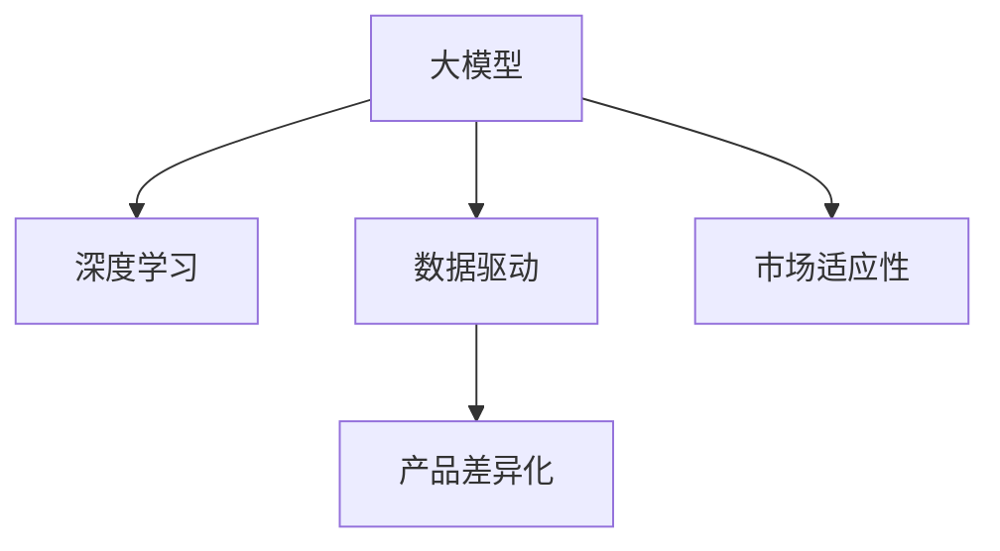

                 

# AI 大模型创业：如何利用创新优势？

> 关键词：大模型创业,创新优势,深度学习,人工智能,初创公司,市场竞争,技术壁垒,数据驱动,产品差异化

## 1. 背景介绍

### 1.1 问题由来

近年来，随着深度学习技术的飞速发展，人工智能(AI)领域涌现出大量的初创公司。在众多AI技术中，大模型(如BERT、GPT、DALL·E等)因其在自然语言处理(NLP)、计算机视觉(CV)等领域的显著优势，受到广泛关注。但是，初创公司在利用大模型进行创业时，面临着巨大的市场竞争和技术挑战。本文将探讨如何通过创新优势，在大模型创业中脱颖而出，实现可持续发展。

### 1.2 问题核心关键点

大模型创业的创新优势主要体现在以下几个方面：

- **技术壁垒**：大模型的核心是深度神经网络，初创公司需要掌握前沿的深度学习理论和算法。
- **数据驱动**：大模型需要大量的数据进行训练，初创公司需要具备数据收集和处理能力。
- **产品差异化**：利用大模型的通用知识，初创公司可以开发出独特的产品应用，实现差异化竞争。
- **市场适应性**：初创公司需要根据市场需求调整产品策略，提高市场适应性。

本文将详细分析如何利用这些创新优势，在大模型创业中取得成功。

## 2. 核心概念与联系

### 2.1 核心概念概述

为更好地理解大模型创业的创新优势，本节将介绍几个密切相关的核心概念：

- **大模型**：以自回归(如GPT)或自编码(如BERT)模型为代表的大规模预训练模型。通过在大规模无标签文本语料上进行预训练，学习通用的语言知识和常识。

- **深度学习**：通过多层神经网络，训练模型从数据中学习到复杂的非线性关系，应用于图像、语音、文本等多种数据类型。

- **数据驱动**：以数据为核心，通过数据采集、标注、清洗、预处理等步骤，为大模型的训练提供高质量的数据支持。

- **产品差异化**：根据市场需求和用户需求，开发出独特的产品功能和应用场景，实现与竞争对手的差异化。

- **市场适应性**：根据市场变化和用户反馈，动态调整产品策略和应用场景，提升市场竞争力。

这些核心概念之间的逻辑关系可以通过以下Mermaid流程图来展示：



这个流程图展示了大模型创业的创新优势及其与核心概念的联系：

1. 大模型基于深度学习理论进行训练，从数据中学习知识。
2. 数据驱动是大模型训练的基础，确保模型具有高质量的输入数据。
3. 产品差异化利用大模型的通用知识，开发独特的产品应用。
4. 市场适应性使初创公司能够根据市场需求进行调整，提高市场竞争力。

## 3. 核心算法原理 & 具体操作步骤
### 3.1 算法原理概述

大模型创业的核心在于利用大模型的通用知识和深度学习算法，开发具有创新性的产品应用。具体而言，初创公司需要在大模型的基础上进行微调，使其适应特定任务。微调过程通常包括以下几个步骤：

1. **准备数据集**：收集与产品应用相关的数据，进行清洗和预处理。
2. **选择模型架构**：根据任务类型选择合适的大模型架构，如BERT、GPT等。
3. **设计适配层**：在模型顶层设计任务特定的输出层和损失函数。
4. **设置超参数**：选择合适的优化算法和学习率，并设置正则化参数。
5. **执行训练**：使用标注数据对模型进行微调，优化模型参数。
6. **评估和部署**：在测试集上评估模型性能，并进行实际应用部署。

### 3.2 算法步骤详解

以下是基于大模型的创业项目如何进行微调的详细步骤：

**Step 1: 数据准备**

- 收集与产品应用相关的数据，并进行清洗、预处理和标注。
- 使用合适的数据格式和标准，确保数据质量和一致性。

**Step 2: 模型选择**

- 根据应用需求，选择合适的预训练模型架构，如BERT、GPT等。
- 使用HuggingFace等开源框架下载和加载模型。

**Step 3: 适配层设计**

- 设计任务特定的适配层，如分类、匹配、生成等。
- 选择合适的损失函数，如交叉熵、均方误差等。

**Step 4: 超参数设置**

- 选择优化算法，如Adam、SGD等。
- 设置合适的学习率、批大小、迭代轮数等。
- 设置正则化参数，如L2正则、Dropout等。

**Step 5: 模型训练**

- 使用标注数据进行微调，使用训练集进行训练。
- 定期在验证集上评估模型性能，避免过拟合。
- 使用测试集进行最终评估。

**Step 6: 产品部署**

- 将微调后的模型集成到产品中。
- 进行模型优化和部署，确保模型在生产环境中稳定运行。

### 3.3 算法优缺点

基于大模型的微调方法具有以下优点：

1. **高效性**：利用预训练模型的知识，可以在较少标注数据的情况下进行微调，快速构建产品原型。
2. **泛化能力**：大模型的通用知识使其在各种应用场景中具有较强的泛化能力。
3. **灵活性**：可以根据具体应用需求调整适配层和超参数，实现产品差异化。

然而，也存在一些缺点：

1. **依赖标注数据**：微调效果很大程度上取决于标注数据的质量和数量，获取高质量标注数据成本较高。
2. **资源需求大**：大模型需要大量的计算资源进行训练和推理，成本较高。
3. **模型复杂性**：大模型结构复杂，维护和调试难度较大。

## 4. 数学模型和公式 & 详细讲解 & 举例说明

### 4.1 数学模型构建

假设预训练模型为 $M_{\theta}$，其中 $\theta$ 为预训练得到的模型参数。微调任务的训练集为 $D=\{(x_i, y_i)\}_{i=1}^N$，其中 $x_i$ 为输入数据，$y_i$ 为标签。微调的目标是最小化损失函数 $\mathcal{L}$，使得模型输出逼近真实标签。

定义模型 $M_{\theta}$ 在输入 $x$ 上的输出为 $\hat{y}=M_{\theta}(x)$，损失函数为 $\ell(M_{\theta}(x),y)$。在数据集 $D$ 上的经验风险为：

$$
\mathcal{L}(\theta) = \frac{1}{N} \sum_{i=1}^N \ell(M_{\theta}(x_i),y_i)
$$

微调的优化目标是最小化经验风险，即找到最优参数：

$$
\theta^* = \mathop{\arg\min}_{\theta} \mathcal{L}(\theta)
$$

在实践中，我们通常使用基于梯度的优化算法（如AdamW、SGD等）来近似求解上述最优化问题。设 $\eta$ 为学习率，$\lambda$ 为正则化系数，则参数的更新公式为：

$$
\theta \leftarrow \theta - \eta \nabla_{\theta}\mathcal{L}(\theta) - \eta\lambda\theta
$$

其中 $\nabla_{\theta}\mathcal{L}(\theta)$ 为损失函数对参数 $\theta$ 的梯度，可通过反向传播算法高效计算。

### 4.2 公式推导过程

以二分类任务为例，推导交叉熵损失函数及其梯度的计算公式。

假设模型 $M_{\theta}$ 在输入 $x$ 上的输出为 $\hat{y}=M_{\theta}(x) \in [0,1]$，表示样本属于正类的概率。真实标签 $y \in \{0,1\}$。则二分类交叉熵损失函数定义为：

$$
\ell(M_{\theta}(x),y) = -[y\log \hat{y} + (1-y)\log (1-\hat{y})]
$$

将其代入经验风险公式，得：

$$
\mathcal{L}(\theta) = -\frac{1}{N}\sum_{i=1}^N [y_i\log M_{\theta}(x_i)+(1-y_i)\log(1-M_{\theta}(x_i))]
$$

根据链式法则，损失函数对参数 $\theta_k$ 的梯度为：

$$
\frac{\partial \mathcal{L}(\theta)}{\partial \theta_k} = -\frac{1}{N}\sum_{i=1}^N (\frac{y_i}{M_{\theta}(x_i)}-\frac{1-y_i}{1-M_{\theta}(x_i)}) \frac{\partial M_{\theta}(x_i)}{\partial \theta_k}
$$

其中 $\frac{\partial M_{\theta}(x_i)}{\partial \theta_k}$ 可进一步递归展开，利用自动微分技术完成计算。

在得到损失函数的梯度后，即可带入参数更新公式，完成模型的迭代优化。重复上述过程直至收敛，最终得到适应下游任务的最优模型参数 $\theta^*$。

### 4.3 案例分析与讲解

**案例1: 医疗影像分类**

假设某初创公司希望开发一款医疗影像分类应用，将医疗影像通过大模型微调进行分类，识别出不同的病理类型。具体步骤如下：

1. **数据准备**：收集医院的历史病理影像和标注数据，进行预处理和清洗。
2. **模型选择**：选择预训练的ResNet、Inception等图像分类模型。
3. **适配层设计**：设计病理分类适配层，使用交叉熵损失函数。
4. **超参数设置**：设置学习率、批大小、迭代轮数等。
5. **模型训练**：使用训练集进行微调，定期在验证集上评估模型性能。
6. **产品部署**：将微调后的模型集成到医疗影像分类应用中，并进行测试。

**案例2: 金融舆情监测**

假设某初创公司希望开发一款金融舆情监测应用，实时监测金融市场舆情，预测股票价格变化。具体步骤如下：

1. **数据准备**：收集金融新闻、公告、社交媒体评论等数据，进行预处理和清洗。
2. **模型选择**：选择预训练的BERT、RoBERTa等语言模型。
3. **适配层设计**：设计股票价格预测适配层，使用均方误差损失函数。
4. **超参数设置**：设置学习率、批大小、迭代轮数等。
5. **模型训练**：使用训练集进行微调，定期在验证集上评估模型性能。
6. **产品部署**：将微调后的模型集成到金融舆情监测应用中，并进行测试。

## 5. 项目实践：代码实例和详细解释说明

### 5.1 开发环境搭建

在进行大模型微调实践前，我们需要准备好开发环境。以下是使用Python进行PyTorch开发的环境配置流程：

1. 安装Anaconda：从官网下载并安装Anaconda，用于创建独立的Python环境。

2. 创建并激活虚拟环境：
```bash
conda create -n pytorch-env python=3.8 
conda activate pytorch-env
```

3. 安装PyTorch：根据CUDA版本，从官网获取对应的安装命令。例如：
```bash
conda install pytorch torchvision torchaudio cudatoolkit=11.1 -c pytorch -c conda-forge
```

4. 安装Transformers库：
```bash
pip install transformers
```

5. 安装各类工具包：
```bash
pip install numpy pandas scikit-learn matplotlib tqdm jupyter notebook ipython
```

完成上述步骤后，即可在`pytorch-env`环境中开始微调实践。

### 5.2 源代码详细实现

下面我以医疗影像分类为例，给出使用Transformers库对预训练图像分类模型进行微调的PyTorch代码实现。

首先，定义医疗影像分类任务的数据处理函数：

```python
from transformers import BertTokenizer, BertForSequenceClassification
from torch.utils.data import Dataset, DataLoader
from torchvision import transforms

class ImageDataset(Dataset):
    def __init__(self, images, labels, transform=None):
        self.images = images
        self.labels = labels
        self.transform = transform
        
    def __len__(self):
        return len(self.images)
    
    def __getitem__(self, item):
        image = self.images[item]
        label = self.labels[item]
        
        if self.transform:
            image = self.transform(image)
        
        return {'image': image, 'label': label}

# 数据预处理
transform = transforms.Compose([
    transforms.ToTensor(),
    transforms.Normalize(mean=[0.485, 0.456, 0.406], std=[0.229, 0.224, 0.225])
])

# 加载数据集
train_dataset = ImageDataset(train_images, train_labels, transform=transform)
dev_dataset = ImageDataset(dev_images, dev_labels, transform=transform)
test_dataset = ImageDataset(test_images, test_labels, transform=transform)
```

然后，定义模型和优化器：

```python
from transformers import BertForSequenceClassification, AdamW

model = BertForSequenceClassification.from_pretrained('bert-base-uncased', num_labels=10)

optimizer = AdamW(model.parameters(), lr=2e-5)
```

接着，定义训练和评估函数：

```python
from tqdm import tqdm

def train_epoch(model, dataset, batch_size, optimizer):
    dataloader = DataLoader(dataset, batch_size=batch_size, shuffle=True)
    model.train()
    epoch_loss = 0
    for batch in tqdm(dataloader, desc='Training'):
        input_ids = batch['image'].to(device)
        labels = batch['label'].to(device)
        model.zero_grad()
        outputs = model(input_ids)
        loss = outputs.loss
        epoch_loss += loss.item()
        loss.backward()
        optimizer.step()
    return epoch_loss / len(dataloader)

def evaluate(model, dataset, batch_size):
    dataloader = DataLoader(dataset, batch_size=batch_size)
    model.eval()
    preds, labels = [], []
    with torch.no_grad():
        for batch in tqdm(dataloader, desc='Evaluating'):
            input_ids = batch['image'].to(device)
            batch_labels = batch['label']
            outputs = model(input_ids)
            batch_preds = outputs.logits.argmax(dim=1).to('cpu').tolist()
            batch_labels = batch_labels.to('cpu').tolist()
            for pred, label in zip(batch_preds, batch_labels):
                preds.append(pred)
                labels.append(label)
                
    print(classification_report(labels, preds))
```

最后，启动训练流程并在测试集上评估：

```python
epochs = 5
batch_size = 16

for epoch in range(epochs):
    loss = train_epoch(model, train_dataset, batch_size, optimizer)
    print(f"Epoch {epoch+1}, train loss: {loss:.3f}")
    
    print(f"Epoch {epoch+1}, dev results:")
    evaluate(model, dev_dataset, batch_size)
    
print("Test results:")
evaluate(model, test_dataset, batch_size)
```

以上就是使用PyTorch对预训练图像分类模型进行微调的完整代码实现。可以看到，得益于Transformers库的强大封装，我们可以用相对简洁的代码完成模型的加载和微调。

### 5.3 代码解读与分析

让我们再详细解读一下关键代码的实现细节：

**ImageDataset类**：
- `__init__`方法：初始化图像、标签和转换函数等关键组件。
- `__len__`方法：返回数据集的样本数量。
- `__getitem__`方法：对单个样本进行处理，将图像输入编码为tensor，进行预处理和转换。

**transforms.Compose**函数：
- 定义了图像预处理的顺序，包括将图片转换为tensor并进行归一化处理。

**模型和优化器**：
- 选择预训练的BertForSequenceClassification模型，并设置学习率为2e-5。
- 使用AdamW优化器进行梯度下降优化。

**训练和评估函数**：
- 使用PyTorch的DataLoader对数据集进行批次化加载，供模型训练和推理使用。
- 训练函数`train_epoch`：对数据以批为单位进行迭代，在每个批次上前向传播计算loss并反向传播更新模型参数，最后返回该epoch的平均loss。
- 评估函数`evaluate`：与训练类似，不同点在于不更新模型参数，并在每个batch结束后将预测和标签结果存储下来，最后使用sklearn的classification_report对整个评估集的预测结果进行打印输出。

**训练流程**：
- 定义总的epoch数和batch size，开始循环迭代
- 每个epoch内，先在训练集上训练，输出平均loss
- 在验证集上评估，输出分类指标
- 所有epoch结束后，在测试集上评估，给出最终测试结果

可以看到，PyTorch配合Transformers库使得预训练图像分类模型的微调代码实现变得简洁高效。开发者可以将更多精力放在数据处理、模型改进等高层逻辑上，而不必过多关注底层的实现细节。

当然，工业级的系统实现还需考虑更多因素，如模型的保存和部署、超参数的自动搜索、更灵活的任务适配层等。但核心的微调范式基本与此类似。

## 6. 实际应用场景
### 6.1 智能客服系统

基于大模型微调的对话技术，可以广泛应用于智能客服系统的构建。传统客服往往需要配备大量人力，高峰期响应缓慢，且一致性和专业性难以保证。而使用微调后的对话模型，可以7x24小时不间断服务，快速响应客户咨询，用自然流畅的语言解答各类常见问题。

在技术实现上，可以收集企业内部的历史客服对话记录，将问题和最佳答复构建成监督数据，在此基础上对预训练对话模型进行微调。微调后的对话模型能够自动理解用户意图，匹配最合适的答案模板进行回复。对于客户提出的新问题，还可以接入检索系统实时搜索相关内容，动态组织生成回答。如此构建的智能客服系统，能大幅提升客户咨询体验和问题解决效率。

### 6.2 金融舆情监测

金融机构需要实时监测市场舆论动向，以便及时应对负面信息传播，规避金融风险。传统的人工监测方式成本高、效率低，难以应对网络时代海量信息爆发的挑战。基于大语言模型微调的文本分类和情感分析技术，为金融舆情监测提供了新的解决方案。

具体而言，可以收集金融领域相关的新闻、报道、评论等文本数据，并对其进行主题标注和情感标注。在此基础上对预训练语言模型进行微调，使其能够自动判断文本属于何种主题，情感倾向是正面、中性还是负面。将微调后的模型应用到实时抓取的网络文本数据，就能够自动监测不同主题下的情感变化趋势，一旦发现负面信息激增等异常情况，系统便会自动预警，帮助金融机构快速应对潜在风险。

### 6.3 个性化推荐系统

当前的推荐系统往往只依赖用户的历史行为数据进行物品推荐，无法深入理解用户的真实兴趣偏好。基于大语言模型微调技术，个性化推荐系统可以更好地挖掘用户行为背后的语义信息，从而提供更精准、多样的推荐内容。

在实践中，可以收集用户浏览、点击、评论、分享等行为数据，提取和用户交互的物品标题、描述、标签等文本内容。将文本内容作为模型输入，用户的后续行为（如是否点击、购买等）作为监督信号，在此基础上微调预训练语言模型。微调后的模型能够从文本内容中准确把握用户的兴趣点。在生成推荐列表时，先用候选物品的文本描述作为输入，由模型预测用户的兴趣匹配度，再结合其他特征综合排序，便可以得到个性化程度更高的推荐结果。

### 6.4 未来应用展望

随着大语言模型和微调方法的不断发展，基于微调范式将在更多领域得到应用，为传统行业带来变革性影响。

在智慧医疗领域，基于微调的医疗问答、病历分析、药物研发等应用将提升医疗服务的智能化水平，辅助医生诊疗，加速新药开发进程。

在智能教育领域，微调技术可应用于作业批改、学情分析、知识推荐等方面，因材施教，促进教育公平，提高教学质量。

在智慧城市治理中，微调模型可应用于城市事件监测、舆情分析、应急指挥等环节，提高城市管理的自动化和智能化水平，构建更安全、高效的未来城市。

此外，在企业生产、社会治理、文娱传媒等众多领域，基于大模型微调的人工智能应用也将不断涌现，为NLP技术带来了全新的突破。相信随着预训练语言模型和微调方法的持续演进，大语言模型微调技术必将在构建人机协同的智能时代中扮演越来越重要的角色。

## 7. 工具和资源推荐
### 7.1 学习资源推荐

为了帮助开发者系统掌握大语言模型微调的理论基础和实践技巧，这里推荐一些优质的学习资源：

1. 《Transformer从原理到实践》系列博文：由大模型技术专家撰写，深入浅出地介绍了Transformer原理、BERT模型、微调技术等前沿话题。

2. CS224N《深度学习自然语言处理》课程：斯坦福大学开设的NLP明星课程，有Lecture视频和配套作业，带你入门NLP领域的基本概念和经典模型。

3. 《Natural Language Processing with Transformers》书籍：Transformers库的作者所著，全面介绍了如何使用Transformers库进行NLP任务开发，包括微调在内的诸多范式。

4. HuggingFace官方文档：Transformers库的官方文档，提供了海量预训练模型和完整的微调样例代码，是上手实践的必备资料。

5. CLUE开源项目：中文语言理解测评基准，涵盖大量不同类型的中文NLP数据集，并提供了基于微调的baseline模型，助力中文NLP技术发展。

通过对这些资源的学习实践，相信你一定能够快速掌握大语言模型微调的精髓，并用于解决实际的NLP问题。
###  7.2 开发工具推荐

高效的开发离不开优秀的工具支持。以下是几款用于大语言模型微调开发的常用工具：

1. PyTorch：基于Python的开源深度学习框架，灵活动态的计算图，适合快速迭代研究。大部分预训练语言模型都有PyTorch版本的实现。

2. TensorFlow：由Google主导开发的开源深度学习框架，生产部署方便，适合大规模工程应用。同样有丰富的预训练语言模型资源。

3. Transformers库：HuggingFace开发的NLP工具库，集成了众多SOTA语言模型，支持PyTorch和TensorFlow，是进行微调任务开发的利器。

4. Weights & Biases：模型训练的实验跟踪工具，可以记录和可视化模型训练过程中的各项指标，方便对比和调优。与主流深度学习框架无缝集成。

5. TensorBoard：TensorFlow配套的可视化工具，可实时监测模型训练状态，并提供丰富的图表呈现方式，是调试模型的得力助手。

6. Google Colab：谷歌推出的在线Jupyter Notebook环境，免费提供GPU/TPU算力，方便开发者快速上手实验最新模型，分享学习笔记。

合理利用这些工具，可以显著提升大语言模型微调任务的开发效率，加快创新迭代的步伐。

### 7.3 相关论文推荐

大语言模型和微调技术的发展源于学界的持续研究。以下是几篇奠基性的相关论文，推荐阅读：

1. Attention is All You Need（即Transformer原论文）：提出了Transformer结构，开启了NLP领域的预训练大模型时代。

2. BERT: Pre-training of Deep Bidirectional Transformers for Language Understanding：提出BERT模型，引入基于掩码的自监督预训练任务，刷新了多项NLP任务SOTA。

3. Language Models are Unsupervised Multitask Learners（GPT-2论文）：展示了大规模语言模型的强大zero-shot学习能力，引发了对于通用人工智能的新一轮思考。

4. Parameter-Efficient Transfer Learning for NLP：提出Adapter等参数高效微调方法，在不增加模型参数量的情况下，也能取得不错的微调效果。

5. Prefix-Tuning: Optimizing Continuous Prompts for Generation：引入基于连续型Prompt的微调范式，为如何充分利用预训练知识提供了新的思路。

6. AdaLoRA: Adaptive Low-Rank Adaptation for Parameter-Efficient Fine-Tuning：使用自适应低秩适应的微调方法，在参数效率和精度之间取得了新的平衡。

这些论文代表了大语言模型微调技术的发展脉络。通过学习这些前沿成果，可以帮助研究者把握学科前进方向，激发更多的创新灵感。

## 8. 总结：未来发展趋势与挑战

### 8.1 总结

本文对大模型创业的创新优势进行了全面系统的介绍。首先阐述了大模型创业的背景和创新优势，明确了利用深度学习和大模型的关键要素。其次，从原理到实践，详细讲解了基于大模型的微调方法，给出了微调任务开发的完整代码实例。同时，本文还广泛探讨了微调方法在智能客服、金融舆情、个性化推荐等多个行业领域的应用前景，展示了微调范式的巨大潜力。此外，本文精选了微调技术的各类学习资源，力求为读者提供全方位的技术指引。

通过本文的系统梳理，可以看到，基于大模型的微调方法在大模型创业中具有显著优势，能够快速构建出高质量的AI产品。在未来，利用大模型进行创业的企业将面临更多的市场机遇和技术挑战，需要不断进行技术创新和产品迭代，才能在激烈的市场竞争中脱颖而出。

### 8.2 未来发展趋势

展望未来，大模型创业将呈现以下几个发展趋势：

1. **技术壁垒提升**：深度学习和大模型的核心技术将不断进步，更加复杂和先进的模型结构将出现，要求创业公司具备更强的技术实力和创新能力。

2. **数据驱动强化**：大模型的泛化能力将不断提升，对数据的质量和多样性要求更高。创业公司需要更加注重数据收集和处理，确保数据源的多样性和真实性。

3. **产品差异化深化**：利用大模型的通用知识，开发出更多独特的产品应用和功能，实现差异化竞争。

4. **市场适应性增强**：随着市场的变化和用户需求的变化，创业公司需要更加灵活地调整产品策略，提高市场适应性。

5. **跨领域融合加速**：大模型将更多地与其他人工智能技术进行融合，如知识图谱、因果推理、强化学习等，推动AI技术的跨领域创新。

以上趋势凸显了大模型创业的广阔前景。这些方向的探索发展，必将进一步提升大模型的应用价值，为创业公司带来更多的市场机遇。

### 8.3 面临的挑战

尽管大模型创业具有显著的优势，但在迈向更加智能化、普适化应用的过程中，它仍面临着诸多挑战：

1. **标注成本瓶颈**：尽管微调降低了对标注数据的需求，但获取高质量标注数据仍然成本较高，对创业公司形成一定压力。

2. **资源需求大**：大模型需要大量的计算资源进行训练和推理，对创业公司的算力配置提出高要求。

3. **技术门槛高**：大模型的核心是深度学习和大规模数据训练，技术门槛较高，对创业公司的技术实力要求严格。

4. **模型复杂性高**：大模型的结构复杂，维护和调试难度较大，需要创业公司具备较强的工程能力。

5. **市场竞争激烈**：大模型领域的竞争日益激烈，创业公司需要具备较强的市场洞察力和产品创新能力。

6. **伦理与安全问题**：大模型的应用需要考虑伦理和安全问题，确保模型的输出符合用户价值观和社会规范。

这些挑战需要创业公司不断提升技术实力、优化资源配置、加强市场调研和产品创新，才能在大模型创业中取得成功。

### 8.4 研究展望

面对大模型创业所面临的挑战，未来的研究需要在以下几个方面寻求新的突破：

1. **数据高效获取与处理**：开发更多高效的数据采集和预处理工具，降低标注数据的成本和时间。

2. **模型优化与加速**：研究更加高效和轻量化的模型结构，提升模型的推理速度和资源利用率。

3. **产品差异化策略**：开发更多独特的产品应用和功能，实现差异化竞争。

4. **市场适应性优化**：根据市场需求和用户反馈，动态调整产品策略，提升市场适应性。

5. **跨领域融合创新**：将大模型与知识图谱、因果推理、强化学习等技术进行融合，推动AI技术的跨领域创新。

6. **伦理与安全研究**：加强伦理和安全研究，确保大模型的输出符合用户价值观和社会规范，构建可信赖的AI系统。

这些研究方向的探索，必将引领大模型创业技术迈向更高的台阶，为创业公司带来更多的市场机遇和技术突破。相信随着学界和产业界的共同努力，大模型创业必将在构建人机协同的智能时代中扮演越来越重要的角色。

## 9. 附录：常见问题与解答

**Q1：大模型创业是否适用于所有应用场景？**

A: 大模型创业适用于大多数需要深度学习和自然语言处理的应用场景，如智能客服、金融舆情监测、个性化推荐等。但对于一些特定领域，如医疗、法律等，仍然需要结合领域知识进行二次开发和定制化。

**Q2：如何选择合适的预训练模型？**

A: 选择合适的预训练模型需要考虑应用场景和数据特征。通常情况下，可以选择通用领域的预训练模型（如BERT、GPT等），或特定领域的预训练模型（如医疗影像分类、金融舆情监测等）。同时，需要根据数据类型和任务需求，选择适合的模型架构和超参数。

**Q3：如何进行高效的数据处理？**

A: 数据处理是微调成功的关键。可以通过数据增强、数据清洗、数据标注等手段，提高数据的质量和多样性。同时，可以使用数据可视化工具，对数据分布和质量进行监控和评估，确保数据的一致性和有效性。

**Q4：如何提高模型的鲁棒性？**

A: 提高模型的鲁棒性需要结合数据增强、对抗训练等技术手段。例如，可以通过对抗样本生成和对抗样本增强，提高模型的鲁棒性和泛化能力。同时，可以在模型训练中加入正则化技术，防止过拟合。

**Q5：如何进行模型优化和加速？**

A: 模型优化和加速需要结合模型压缩、量化加速、模型并行等技术手段。例如，可以使用剪枝、量化等技术，减少模型的参数量和计算量，提高模型的推理速度和资源利用率。同时，可以使用模型并行技术，将模型分布到多个GPU或TPU上进行并行计算，提升模型的训练速度。

---

作者：禅与计算机程序设计艺术 / Zen and the Art of Computer Programming

