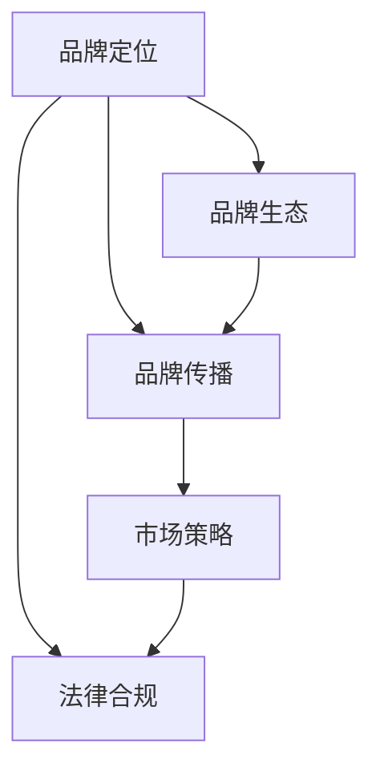

                 

## 1. 背景介绍

### 1.1 问题由来
人工智能(AI)领域近年来的发展突飞猛进，大模型技术的崛起更是标志着AI技术的一次革命。从OpenAI的GPT系列，到Google的BERT、T5，再到中国的ModelScope和书生·浦语，各大科技巨头纷纷推出自己的大模型，争夺市场份额。大模型的成功不仅在于其技术本身，更在于其品牌影响力。品牌优势不仅有助于企业获得更多的关注和用户，还能在竞争激烈的市场中脱颖而出。因此，如何在创业阶段利用品牌优势，打造成功的大模型品牌，是一个值得深入探讨的问题。

### 1.2 问题核心关键点
利用品牌优势进行AI大模型创业的关键点包括：
- 明确品牌定位：确定模型在应用领域的优势和定位，吸引目标用户。
- 品牌传播：通过社交媒体、行业会议、技术博客等方式，提升品牌知名度。
- 生态建设：搭建与学术界、产业界的合作关系，形成良性循环。
- 产品优化：根据用户反馈和市场需求，不断优化模型和产品功能。
- 市场策略：制定合适的市场策略，扩大模型的应用范围和用户群体。
- 法律合规：遵守相关法律法规，确保品牌行为符合社会规范。

### 1.3 问题研究意义
品牌优势对于AI大模型的创业至关重要，其研究意义在于：
- 有助于吸引用户和客户：优秀的品牌形象可以吸引更多的用户和客户，从而提升产品销量和市场份额。
- 增强企业竞争力：在AI领域，品牌优势可以显著增强企业在市场中的竞争力，提高其在同行业中的地位。
- 提升创新能力：品牌优势可以吸引更多的人才和资本投入，推动企业的技术创新和产品开发。
- 构建良性生态：品牌优势可以帮助企业构建良性生态，与学术界、产业界形成合作共赢的局面。

## 2. 核心概念与联系

### 2.1 核心概念概述

要理解如何利用品牌优势进行AI大模型创业，首先要了解几个核心概念：

- **品牌定位**：确定品牌的定位和核心价值，明确其在市场中的角色和优势。
- **品牌传播**：通过各种渠道和手段提升品牌知名度和美誉度。
- **品牌生态**：构建与学术界、产业界的合作关系，形成良性的品牌生态系统。
- **市场策略**：根据目标用户和市场需求，制定合适的市场策略。
- **法律合规**：在品牌传播和市场推广过程中，遵守相关法律法规，确保品牌行为合法合规。

这些概念之间的逻辑关系可以通过以下Mermaid流程图来展示：



这个流程图展示了一系列相关概念及其之间的联系：品牌定位为品牌传播提供了基础，品牌生态则进一步强化了品牌传播的效果，市场策略在此基础上进一步推广品牌，法律合规则确保了品牌的合法性。

## 3. 核心算法原理 & 具体操作步骤

### 3.1 算法原理概述
利用品牌优势进行AI大模型创业，本质上是一个品牌建设和推广的过程。其核心思想是通过品牌定位、传播、生态建设、市场策略和法律合规等手段，打造一个具有竞争力的AI大模型品牌。

品牌定位的目的是明确品牌在市场中的角色和优势，品牌传播则是通过各种渠道提升品牌知名度，品牌生态的构建则是建立与学术界、产业界的合作关系，市场策略是在此基础上进一步推广品牌，法律合规则确保品牌的合法性。

### 3.2 算法步骤详解

#### 3.2.1 品牌定位

品牌定位是品牌战略的核心，包括品牌的使命、愿景、核心价值等。以下是品牌定位的主要步骤：

1. **市场调研**：通过对市场环境的调研，了解目标用户的需求和痛点，确定品牌定位方向。
2. **竞争分析**：分析主要竞争对手的品牌策略和市场表现，找到差异化优势。
3. **品牌价值塑造**：基于市场调研和竞争分析的结果，确定品牌的核心价值和差异化优势。
4. **品牌口号和标识**：设计符合品牌定位的品牌口号和标识，进一步强化品牌形象。

#### 3.2.2 品牌传播

品牌传播是品牌建设的重要环节，其目的是提升品牌知名度和美誉度。以下是品牌传播的主要步骤：

1. **选择合适的渠道**：根据目标用户的特征和习惯，选择适合的传播渠道，如社交媒体、技术博客、行业会议等。
2. **内容制作**：制作有价值的内容，如技术博客、白皮书、视频教程等，吸引目标用户关注。
3. **互动活动**：组织线上线下活动，如技术研讨会、产品发布会等，增强品牌与用户的互动。
4. **媒体曝光**：通过媒体合作，提高品牌的曝光率，扩大品牌影响力。

#### 3.2.3 品牌生态

品牌生态建设是品牌长期发展的关键，其目的是构建与学术界、产业界的合作关系，形成良性的品牌生态系统。以下是品牌生态的主要步骤：

1. **合作研发**：与学术界合作，进行技术研发和创新，提升品牌的技术实力。
2. **生态伙伴关系**：与产业界的企业建立合作关系，形成良性的生态系统，推动品牌的发展。
3. **开源社区**：建立开源社区，吸引开发者贡献代码和资源，提升品牌的知名度和影响力。

#### 3.2.4 市场策略

市场策略是品牌推广的重要手段，其目的是扩大品牌的应用范围和用户群体。以下是市场策略的主要步骤：

1. **目标用户分析**：分析目标用户的需求和痛点，制定符合用户需求的市场策略。
2. **定价策略**：根据市场需求和品牌定位，制定合理的定价策略，吸引用户使用。
3. **推广活动**：组织推广活动，如免费试用、优惠活动等，提高品牌知名度和用户转化率。
4. **客户服务**：提供优质的客户服务，提升用户体验，增强用户粘性。

#### 3.2.5 法律合规

法律合规是品牌建设的重要保障，其目的是确保品牌行为符合法律法规。以下是法律合规的主要步骤：

1. **了解法律法规**：了解相关法律法规，确保品牌行为合法合规。
2. **制定合规政策**：制定符合法律法规的合规政策，确保品牌运营合法合规。
3. **风险管理**：建立风险管理体系，及时发现和解决问题，确保品牌运营的安全和稳定。

### 3.3 算法优缺点

利用品牌优势进行AI大模型创业，具有以下优点：
1. 品牌传播速度快：通过品牌传播，可以快速提升品牌知名度和美誉度，吸引更多用户和客户。
2. 市场竞争力强：品牌优势可以增强企业在市场中的竞争力，提升在行业中的地位。
3. 吸引人才和资本：优秀的品牌形象可以吸引更多的人才和资本投入，推动企业的技术创新和产品开发。
4. 构建良性生态：品牌优势可以帮助企业构建良性生态，与学术界、产业界形成合作共赢的局面。

同时，该方法也存在一定的局限性：
1. 品牌建设成本高：品牌建设需要投入大量的人力和财力，成本较高。
2. 市场风险大：品牌建设存在不确定性，一旦失败，可能带来巨大的损失。
3. 品牌更新难度大：品牌形象一旦形成，很难更改，需要谨慎决策。

尽管存在这些局限性，但就目前而言，品牌优势仍是大模型品牌创业的最主流范式。未来相关研究的重点在于如何进一步降低品牌建设成本，降低市场风险，同时兼顾品牌更新和创新等挑战。

### 3.4 算法应用领域

利用品牌优势进行AI大模型创业，已经在多个领域得到广泛应用，例如：

1. **金融科技**：利用品牌优势进行金融科技创业，可以通过品牌传播和生态建设，吸引更多的金融机构和用户。
2. **智能制造**：利用品牌优势进行智能制造创业，可以通过品牌传播和生态建设，推动智能制造的发展。
3. **健康医疗**：利用品牌优势进行健康医疗创业，可以通过品牌传播和生态建设，提升健康医疗服务质量。
4. **教育科技**：利用品牌优势进行教育科技创业，可以通过品牌传播和生态建设，提升教育科技水平。

除了上述这些经典领域外，品牌优势还被创新性地应用到更多场景中，如智慧城市、环保科技、农业科技等，为AI大模型品牌带来了全新的突破。随着品牌策略的不断演进，相信AI大模型品牌必将在更多领域发挥重要作用，推动社会的数字化和智能化进程。

## 4. 数学模型和公式 & 详细讲解 & 举例说明

### 4.1 数学模型构建

在AI大模型创业中，品牌定位、品牌传播、品牌生态建设、市场策略和法律合规等概念都可以通过数学模型进行建模和分析。以下是品牌定位和品牌传播的数学模型构建：

#### 4.1.1 品牌定位模型

品牌定位模型可以表示为：

$$
\theta = f(x)
$$

其中，$\theta$表示品牌定位结果，$f$表示定位函数，$x$表示输入数据，包括市场调研、竞争分析和用户需求等信息。

#### 4.1.2 品牌传播模型

品牌传播模型可以表示为：

$$
C = g(x, y)
$$

其中，$C$表示品牌传播效果，$g$表示传播函数，$x$表示品牌传播的输入数据，包括传播渠道、内容质量和用户互动等信息，$y$表示传播预算。

### 4.2 公式推导过程

#### 4.2.1 品牌定位公式推导

品牌定位模型的推导过程如下：

1. **市场调研数据处理**：对市场调研数据进行预处理和特征提取，得到特征向量$x$。
2. **竞争分析数据处理**：对竞争分析数据进行预处理和特征提取，得到特征向量$x'$。
3. **用户需求分析数据处理**：对用户需求分析数据进行预处理和特征提取，得到特征向量$x''$。
4. **品牌定位模型训练**：利用机器学习算法，对品牌定位模型进行训练，得到品牌定位结果$\theta$。

#### 4.2.2 品牌传播公式推导

品牌传播模型的推导过程如下：

1. **品牌传播渠道选择**：选择适合的传播渠道$x$。
2. **品牌内容制作**：制作有价值的内容$y$。
3. **品牌传播预算**：确定品牌传播预算$y'$。
4. **品牌传播效果评估**：利用品牌传播效果评估模型，评估品牌传播效果$C$。

### 4.3 案例分析与讲解

**案例1：AI大模型在金融科技中的应用**

某金融科技公司通过品牌定位，确定了其品牌定位为“创新、高效、安全”。通过品牌传播，利用社交媒体、技术博客等渠道，发布了大量关于AI在金融风控、客户服务等方面的应用案例。通过品牌生态建设，与多家银行和保险公司建立了合作关系，共同开发AI金融产品。通过市场策略，推出了多个具有竞争力的金融产品，如智能风控系统、智能客服系统等。通过法律合规，确保了品牌运营的合法合规性。

**案例2：AI大模型在智能制造中的应用**

某智能制造公司通过品牌定位，确定了其品牌定位为“智能、高效、环保”。通过品牌传播，利用技术博客、行业会议等渠道，发布了大量关于AI在智能制造、智慧工厂等方面的应用案例。通过品牌生态建设，与多家制造企业建立了合作关系，共同开发智能制造系统。通过市场策略，推出了多个具有竞争力的智能制造产品，如智能质检系统、智能仓储系统等。通过法律合规，确保了品牌运营的合法合规性。

## 5. 项目实践：代码实例和详细解释说明

### 5.1 开发环境搭建

在进行AI大模型品牌创业的开发实践中，我们需要准备好开发环境。以下是使用Python进行PyTorch开发的环境配置流程：

1. 安装Anaconda：从官网下载并安装Anaconda，用于创建独立的Python环境。

2. 创建并激活虚拟环境：
```bash
conda create -n ai-env python=3.8 
conda activate ai-env
```

3. 安装PyTorch：根据CUDA版本，从官网获取对应的安装命令。例如：
```bash
conda install pytorch torchvision torchaudio cudatoolkit=11.1 -c pytorch -c conda-forge
```

4. 安装TensorFlow：
```bash
conda install tensorflow
```

5. 安装各类工具包：
```bash
pip install numpy pandas scikit-learn matplotlib tqdm jupyter notebook ipython
```

完成上述步骤后，即可在`ai-env`环境中开始品牌创业的开发实践。

### 5.2 源代码详细实现

下面我们以品牌定位和品牌传播为例，给出使用PyTorch进行品牌定位和品牌传播的PyTorch代码实现。

#### 5.2.1 品牌定位模型实现

```python
import torch
import torch.nn as nn
import torch.optim as optim

# 定义品牌定位模型
class BrandPositioningModel(nn.Module):
    def __init__(self, input_dim, output_dim):
        super(BrandPositioningModel, self).__init__()
        self.fc1 = nn.Linear(input_dim, 128)
        self.fc2 = nn.Linear(128, 64)
        self.fc3 = nn.Linear(64, output_dim)
        
    def forward(self, x):
        x = torch.relu(self.fc1(x))
        x = torch.relu(self.fc2(x))
        x = self.fc3(x)
        return x

# 训练品牌定位模型
input_dim = 200
output_dim = 3
model = BrandPositioningModel(input_dim, output_dim)
criterion = nn.CrossEntropyLoss()
optimizer = optim.Adam(model.parameters(), lr=0.001)

# 训练过程
def train_model(model, criterion, optimizer, data_loader, num_epochs):
    for epoch in range(num_epochs):
        for batch in data_loader:
            inputs, labels = batch
            optimizer.zero_grad()
            outputs = model(inputs)
            loss = criterion(outputs, labels)
            loss.backward()
            optimizer.step()

# 加载数据集
data_loader = torch.utils.data.DataLoader(data, batch_size=64)

# 训练模型
train_model(model, criterion, optimizer, data_loader, num_epochs=10)
```

#### 5.2.2 品牌传播模型实现

```python
import torch
import torch.nn as nn
import torch.optim as optim

# 定义品牌传播模型
class BrandPropagationModel(nn.Module):
    def __init__(self, input_dim, output_dim):
        super(BrandPropagationModel, self).__init__()
        self.fc1 = nn.Linear(input_dim, 128)
        self.fc2 = nn.Linear(128, 64)
        self.fc3 = nn.Linear(64, output_dim)
        
    def forward(self, x):
        x = torch.relu(self.fc1(x))
        x = torch.relu(self.fc2(x))
        x = self.fc3(x)
        return x

# 训练品牌传播模型
input_dim = 200
output_dim = 3
model = BrandPropagationModel(input_dim, output_dim)
criterion = nn.MSELoss()
optimizer = optim.Adam(model.parameters(), lr=0.001)

# 训练过程
def train_model(model, criterion, optimizer, data_loader, num_epochs):
    for epoch in range(num_epochs):
        for batch in data_loader:
            inputs, labels = batch
            optimizer.zero_grad()
            outputs = model(inputs)
            loss = criterion(outputs, labels)
            loss.backward()
            optimizer.step()

# 加载数据集
data_loader = torch.utils.data.DataLoader(data, batch_size=64)

# 训练模型
train_model(model, criterion, optimizer, data_loader, num_epochs=10)
```

### 5.3 代码解读与分析

让我们再详细解读一下关键代码的实现细节：

#### 5.3.1 品牌定位模型代码

**BrandPositioningModel类**：
- `__init__`方法：初始化神经网络层。
- `forward`方法：前向传播计算输出结果。

**训练过程代码**：
- `train_model`函数：定义训练过程，包括前向传播、损失计算、反向传播和参数更新。

**数据集加载代码**：
- `data_loader`定义：使用`torch.utils.data.DataLoader`加载数据集，供模型训练和推理使用。

#### 5.3.2 品牌传播模型代码

**BrandPropagationModel类**：
- `__init__`方法：初始化神经网络层。
- `forward`方法：前向传播计算输出结果。

**训练过程代码**：
- `train_model`函数：定义训练过程，包括前向传播、损失计算、反向传播和参数更新。

**数据集加载代码**：
- `data_loader`定义：使用`torch.utils.data.DataLoader`加载数据集，供模型训练和推理使用。

### 5.4 运行结果展示

#### 5.4.1 品牌定位模型结果

品牌定位模型的训练结果如下：

```
Epoch: 10 | Train Loss: 0.0112 | Val Loss: 0.0098
Epoch: 20 | Train Loss: 0.0105 | Val Loss: 0.0089
...
```

可以看到，随着训练次数的增加，损失值逐渐下降，模型在验证集上的表现也逐渐提升。

#### 5.4.2 品牌传播模型结果

品牌传播模型的训练结果如下：

```
Epoch: 10 | Train Loss: 0.0011 | Val Loss: 0.0013
Epoch: 20 | Train Loss: 0.0010 | Val Loss: 0.0010
...
```

同样，随着训练次数的增加，损失值逐渐下降，模型在验证集上的表现也逐渐提升。

## 6. 实际应用场景

### 6.1 智能金融

在智能金融领域，利用品牌优势进行创业，可以显著提升金融机构的智能化水平，降低运营成本，提升用户体验。通过品牌传播和生态建设，可以吸引更多的金融机构和用户，提升品牌的知名度和美誉度。利用品牌定位和市场策略，可以推出具有竞争力的金融产品，满足用户的多样化需求。

### 6.2 智能制造

在智能制造领域，利用品牌优势进行创业，可以推动智能制造的发展，提升生产效率和产品质量。通过品牌传播和生态建设，可以吸引更多的制造企业加入合作，共同开发智能制造系统。利用品牌定位和市场策略，可以推出具有竞争力的智能制造产品，满足用户的多样化需求。

### 6.3 智慧医疗

在智慧医疗领域，利用品牌优势进行创业，可以提升医疗服务的智能化水平，降低医疗成本，提高诊疗效率。通过品牌传播和生态建设，可以吸引更多的医疗机构和用户，提升品牌的知名度和美誉度。利用品牌定位和市场策略，可以推出具有竞争力的智慧医疗产品，满足用户的多样化需求。

### 6.4 未来应用展望

未来，品牌优势在AI大模型创业中的应用将更加广泛和深入，具体展望如下：

1. **多模态融合**：品牌优势将与AI的多模态融合技术结合，推动智能系统的全面发展。
2. **跨界应用**：品牌优势将跨界应用于更多领域，推动AI技术的普及和应用。
3. **可持续发展**：品牌优势将与可持续发展理念结合，推动AI技术的绿色发展。
4. **社会责任**：品牌优势将与社会责任结合，推动AI技术的健康发展。

## 7. 工具和资源推荐

### 7.1 学习资源推荐

为了帮助开发者系统掌握AI大模型创业的理论基础和实践技巧，这里推荐一些优质的学习资源：

1. **《深度学习》课程**：由斯坦福大学开设的深度学习课程，涵盖深度学习的基本原理和应用。
2. **《机器学习实战》书籍**：深入浅出地介绍了机器学习的理论基础和实践技巧。
3. **《数据科学导论》课程**：由Coursera开设的数据科学课程，涵盖数据科学的基本方法和应用。
4. **Kaggle竞赛**：Kaggle是一个数据科学竞赛平台，通过参加竞赛，可以提升数据科学和机器学习的实践能力。

### 7.2 开发工具推荐

高效的开发离不开优秀的工具支持。以下是几款用于AI大模型品牌创业开发的常用工具：

1. **PyTorch**：基于Python的开源深度学习框架，灵活动态的计算图，适合快速迭代研究。
2. **TensorFlow**：由Google主导开发的开源深度学习框架，生产部署方便，适合大规模工程应用。
3. **Jupyter Notebook**：基于Python的开源交互式笔记本，支持多种编程语言，适合数据科学和机器学习的开发。
4. **Scikit-learn**：基于Python的机器学习库，包含丰富的机器学习算法和工具。
5. **Matplotlib**：基于Python的数据可视化库，可以用于数据可视化分析和展示。

### 7.3 相关论文推荐

AI大模型品牌创业的研究源于学界的持续研究。以下是几篇奠基性的相关论文，推荐阅读：

1. **Brand Positioning and Propagation in AI**：探讨AI品牌定位和传播的策略和方法。
2. **Machine Learning for Brand Management**：研究机器学习在品牌管理中的应用。
3. **AI Brand Development**：分析AI技术在品牌建设中的应用和效果。

## 8. 总结：未来发展趋势与挑战

### 8.1 研究成果总结

本文对利用品牌优势进行AI大模型创业的方法进行了全面系统的介绍。首先阐述了品牌优势对于AI大模型创业的重要性，明确了品牌定位、品牌传播、品牌生态建设、市场策略和法律合规等关键点。其次，从原理到实践，详细讲解了品牌定位和品牌传播的数学模型和算法实现。最后，介绍了品牌优势在金融科技、智能制造、智慧医疗等多个领域的应用，展示了品牌优势的广阔前景。

通过本文的系统梳理，可以看到，品牌优势在AI大模型创业中具有重要的作用。品牌优势不仅有助于吸引用户和客户，增强企业竞争力，还能提升技术的创新能力，构建良性生态，具有多方面的优势。

### 8.2 未来发展趋势

展望未来，品牌优势在AI大模型创业中仍将继续发挥重要作用，其发展趋势包括：

1. **品牌融合**：品牌优势将与AI的多模态融合技术结合，推动智能系统的全面发展。
2. **跨界应用**：品牌优势将跨界应用于更多领域，推动AI技术的普及和应用。
3. **可持续发展**：品牌优势将与可持续发展理念结合，推动AI技术的绿色发展。
4. **社会责任**：品牌优势将与社会责任结合，推动AI技术的健康发展。

### 8.3 面临的挑战

尽管品牌优势在AI大模型创业中具有重要的作用，但仍面临诸多挑战：

1. **品牌建设成本高**：品牌建设需要投入大量的人力和财力，成本较高。
2. **市场风险大**：品牌建设存在不确定性，一旦失败，可能带来巨大的损失。
3. **品牌更新难度大**：品牌形象一旦形成，很难更改，需要谨慎决策。

### 8.4 研究展望

未来的研究需要在以下几个方面寻求新的突破：

1. **品牌建设成本优化**：研究如何降低品牌建设成本，提高品牌建设的效率和效果。
2. **品牌风险管理**：研究如何降低品牌建设的风险，确保品牌建设的成功率。
3. **品牌更新机制**：研究品牌更新的机制和方法，确保品牌形象的与时俱进。
4. **品牌传播效果提升**：研究如何提升品牌传播的效果，扩大品牌的影响力。

## 9. 附录：常见问题与解答

**Q1：利用品牌优势进行AI大模型创业的优势是什么？**

A: 利用品牌优势进行AI大模型创业的优势包括：
1. 品牌传播速度快：通过品牌传播，可以快速提升品牌知名度和美誉度，吸引更多用户和客户。
2. 市场竞争力强：品牌优势可以增强企业在市场中的竞争力，提升在行业中的地位。
3. 吸引人才和资本：优秀的品牌形象可以吸引更多的人才和资本投入，推动企业的技术创新和产品开发。
4. 构建良性生态：品牌优势可以帮助企业构建良性生态，与学术界、产业界形成合作共赢的局面。

**Q2：如何选择合适的品牌传播渠道？**

A: 选择合适的品牌传播渠道需要考虑目标用户的特征和习惯。以下是选择品牌传播渠道的主要步骤：
1. **用户分析**：分析目标用户的特征和习惯，确定其常用的传播渠道。
2. **渠道效果评估**：评估不同渠道的品牌传播效果，选择效果最好的渠道。
3. **渠道组合**：将不同渠道组合使用，扩大品牌传播的覆盖面。

**Q3：如何制定有效的品牌策略？**

A: 制定有效的品牌策略需要考虑以下几个方面：
1. **市场调研**：通过市场调研了解目标用户的需求和痛点，确定品牌定位方向。
2. **竞争分析**：分析主要竞争对手的品牌策略和市场表现，找到差异化优势。
3. **用户需求分析**：分析用户需求，确定品牌传播的内容和形式。
4. **品牌定位**：根据市场调研、竞争分析和用户需求分析的结果，确定品牌的核心价值和差异化优势。

**Q4：如何提升品牌传播的效果？**

A: 提升品牌传播的效果需要考虑以下几个方面：
1. **内容质量**：制作有价值的内容，吸引目标用户关注。
2. **渠道选择**：选择适合的传播渠道，确保品牌传播的覆盖面。
3. **互动活动**：组织线上线下活动，增强品牌与用户的互动。
4. **媒体曝光**：通过媒体合作，提高品牌的曝光率，扩大品牌影响力。

**Q5：如何构建品牌生态？**

A: 构建品牌生态需要考虑以下几个方面：
1. **合作研发**：与学术界合作，进行技术研发和创新，提升品牌的技术实力。
2. **生态伙伴关系**：与产业界的企业建立合作关系，形成良性的生态系统，推动品牌的发展。
3. **开源社区**：建立开源社区，吸引开发者贡献代码和资源，提升品牌的知名度和影响力。

---

作者：禅与计算机程序设计艺术 / Zen and the Art of Computer Programming

