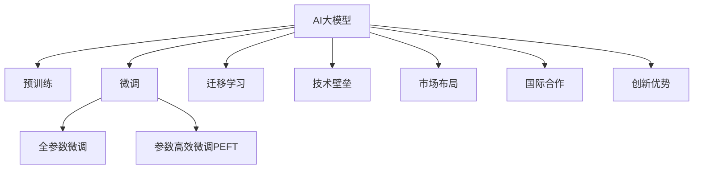

                 

# AI 大模型创业：如何利用国际优势？

> 关键词：AI大模型，创业，国际合作，技术壁垒，创新优势，市场趋势，竞争策略

## 1. 背景介绍

### 1.1 问题由来

在全球科技快速发展的背景下，人工智能（AI）大模型成为驱动行业变革的关键技术。大模型具备强大的语言理解、图像识别、自然语言处理等能力，广泛应用于智能客服、金融风控、智慧医疗、智慧城市等多个领域。

AI大模型的优势在于其预训练过程中可以利用大规模数据训练，形成的知识储备丰富，应用前景广阔。然而，国际竞争日益激烈，各国的技术壁垒也日趋加强，企业如何在国际舞台上占据优势，成为AI大模型创业公司的一大挑战。

### 1.2 问题核心关键点

利用国际优势，需要在技术、市场、合作等多方面进行策略布局，以下是核心关键点：

- **技术优势**：预训练大模型的训练数据和算法库往往依赖于国际数据源和技术，如何利用国际优势训练更好的模型成为关键。
- **市场布局**：如何在全球范围内布局市场，以及如何应对不同市场的法律法规和用户需求。
- **国际合作**：国际合作伙伴的选择和合作策略，以及如何利用合作伙伴的技术优势进行协同创新。
- **技术壁垒**：技术壁垒的破解方式和策略，以及如何在国际上提升技术竞争力。
- **创新优势**：如何通过创新突破技术瓶颈，获取行业领先地位。

## 2. 核心概念与联系

### 2.1 核心概念概述

为更好地理解利用国际优势的策略，本节将介绍几个密切相关的核心概念：

- **AI大模型**：基于深度学习架构，通过大规模数据预训练得到的模型，具备强大的学习和推理能力。
- **预训练**：在大规模无标签数据上进行的自监督学习，形成通用的表示能力。
- **微调(Fine-Tuning)**：在预训练模型基础上，针对特定任务进行有监督学习，调整模型参数以适应新任务。
- **迁移学习**：将预训练模型的知识和能力迁移到新任务上，减少从头训练所需的时间和数据。
- **技术壁垒**：指技术在应用推广过程中面临的种种限制，包括技术专利、标准规范等。
- **市场布局**：指企业在全球市场中的战略布局，包括市场细分、产品定位、竞争策略等。
- **国际合作**：指企业通过与国际合作伙伴建立合作关系，获取技术、人才、市场资源，提升竞争力。
- **创新优势**：指企业通过持续技术创新和产品迭代，形成技术领先地位，引领行业发展。

这些核心概念之间的逻辑关系可以通过以下Mermaid流程图来展示：



这个流程图展示了大模型创业公司的核心概念及其之间的关系：

1. AI大模型通过预训练获得基础能力。
2. 微调是对预训练模型进行任务特定的优化，可以分为全参数微调和参数高效微调（PEFT）。
3. 迁移学习是连接预训练模型与下游任务的桥梁，可以通过微调或提示学习来实现。
4. 技术壁垒是应用推广过程中的限制因素。
5. 市场布局涉及企业在全球市场的战略规划。
6. 国际合作是企业获取外部资源和技术的手段。
7. 创新优势是企业持续发展和技术突破的核心动力。

## 3. 核心算法原理 & 具体操作步骤
### 3.1 算法原理概述

AI大模型的国际优势利用，可以从以下几个方面进行策略布局：

1. **技术优势**：
   - **预训练数据**：利用国际高质量数据进行预训练，形成更强的语言模型。
   - **算法库**：基于国际前沿算法库进行模型训练，提升模型性能。

2. **市场布局**：
   - **细分市场**：根据不同市场的用户需求和法律法规，进行产品细分。
   - **品牌策略**：打造国际化品牌，提升品牌影响力。

3. **国际合作**：
   - **技术合作**：与国际合作伙伴共同开发新技术，形成技术优势。
   - **市场合作**：与国际企业建立合作伙伴关系，开拓国际市场。

4. **技术壁垒**：
   - **专利布局**：通过技术专利获取国际市场准入资格。
   - **标准规范**：遵循国际标准规范，提高模型合规性。

5. **创新优势**：
   - **持续创新**：不断进行技术研发和产品迭代，提升模型性能和应用场景。
   - **生态系统**：构建生态系统，吸引更多开发者和用户加入。

### 3.2 算法步骤详解

1. **技术优势**：
   - **数据获取**：通过国际数据源获取高质量的预训练数据。
   - **算法选择**：根据模型需求选择合适的算法库，如TensorFlow、PyTorch等。
   - **模型训练**：在强大的计算资源下进行模型训练，提升模型性能。

2. **市场布局**：
   - **市场调研**：分析不同市场的用户需求和法律法规。
   - **产品设计**：根据市场需求设计适合的产品。
   - **推广策略**：通过国际营销渠道推广产品。

3. **国际合作**：
   - **技术合作**：与国际技术团队合作，共同开发新技术。
   - **市场合作**：与国际企业建立合作关系，开拓国际市场。
   - **联合开发**：联合开发适用于不同市场的AI大模型。

4. **技术壁垒**：
   - **专利申请**：积极申请技术专利，保护技术成果。
   - **标准遵守**：遵循国际标准规范，提升模型合规性。

5. **创新优势**：
   - **研发投入**：加大研发投入，进行持续技术创新。
   - **产品迭代**：不断迭代产品，提升用户体验。
   - **生态建设**：构建开发者生态系统，吸引更多开发者和用户。

### 3.3 算法优缺点

利用国际优势的AI大模型创业策略具有以下优点：
1. **技术领先**：通过国际前沿技术提升模型性能，领先于竞争对手。
2. **市场覆盖**：通过国际市场布局，拓展全球业务范围。
3. **合作共赢**：通过国际合作获取更多资源和技术，实现互利共赢。
4. **标准合规**：遵循国际标准规范，提升模型合规性。

同时，这些策略也存在一定的局限性：
1. **数据依赖**：高度依赖国际数据源，数据获取成本较高。
2. **市场风险**：不同市场的法律法规和用户需求差异大，市场推广难度大。
3. **合作风险**：国际合作中的信任和利益分配问题，可能影响合作效果。
4. **成本压力**：国际市场推广和研发投入成本较高。

尽管存在这些局限性，但综合考虑其优点和潜力，利用国际优势进行AI大模型创业是一条可行的策略。

### 3.4 算法应用领域

AI大模型在多个领域都有应用潜力：

- **智能客服**：通过AI大模型进行自然语言理解和生成，提供高效、个性化的客服服务。
- **金融风控**：利用AI大模型进行数据分析和风险预测，提升金融风险控制能力。
- **智慧医疗**：通过AI大模型进行病历分析、医疗影像识别等，提高医疗服务水平。
- **智慧城市**：利用AI大模型进行城市管理、交通监控等，提升城市治理能力。
- **自动驾驶**：通过AI大模型进行图像识别和决策，提升自动驾驶安全性。

以上应用领域只是冰山一角，随着AI大模型的不断发展，未来将有更多创新应用涌现。

## 4. 数学模型和公式 & 详细讲解 & 举例说明
### 4.1 数学模型构建

在AI大模型的国际优势利用中，数学模型和公式的详细讲解对于理解算法原理至关重要。

- **预训练模型**：假设预训练模型为 $M_{\theta}$，其中 $\theta$ 为预训练得到的模型参数。
- **微调模型**：在预训练模型基础上，针对特定任务进行微调，优化模型参数以适应新任务。

### 4.2 公式推导过程

以下是对AI大模型微调中常见数学模型的推导过程：

假设模型 $M_{\theta}$ 在输入 $x$ 上的输出为 $\hat{y}=M_{\theta}(x)$，在训练集 $D=\{(x_i,y_i)\}_{i=1}^N$ 上进行微调，定义损失函数 $\ell(M_{\theta}(x),y)$ 为模型预测输出与真实标签之间的差异。微调目标为最小化经验风险：

$$
\mathcal{L}(\theta) = \frac{1}{N}\sum_{i=1}^N \ell(M_{\theta}(x_i),y_i)
$$

对于二分类任务，假设模型输出为 $\hat{y}=M_{\theta}(x)$，真实标签为 $y \in \{0,1\}$，则二分类交叉熵损失函数为：

$$
\ell(M_{\theta}(x),y) = -[y\log \hat{y} + (1-y)\log(1-\hat{y})]
$$

推导过程如下：

$$
\begin{aligned}
\mathcal{L}(\theta) &= \frac{1}{N}\sum_{i=1}^N [y_i\log \hat{y}_i + (1-y_i)\log(1-\hat{y}_i)] \\
&= \frac{1}{N}\sum_{i=1}^N [y_i(\log \hat{y}_i - \log(1-\hat{y}_i)] + \log(1-\hat{y}_i) \\
&= -\frac{1}{N}\sum_{i=1}^N [y_i\log \hat{y}_i + (1-y_i)\log(1-\hat{y}_i)]
\end{aligned}
$$

### 4.3 案例分析与讲解

假设某创业公司利用国际优势，构建了一个用于智能客服的AI大模型。以下是该模型的数学模型构建和推导过程：

- **输入数据**：输入为用户问题和智能客服模型的对话历史。
- **输出数据**：输出为智能客服的回复文本。
- **损失函数**：采用BLEU分数作为评估指标，表示生成的回复文本与用户问题的相似度。

模型的数学模型如下：

$$
M_{\theta}(x) = \text{BERT}_{\text{large}}(x)
$$

其中 $x$ 为输入文本，$\theta$ 为预训练模型参数。

## 5. 项目实践：代码实例和详细解释说明
### 5.1 开发环境搭建

以下是使用Python进行PyTorch开发的环境配置流程：

1. 安装Anaconda：从官网下载并安装Anaconda，用于创建独立的Python环境。

2. 创建并激活虚拟环境：
```bash
conda create -n pytorch-env python=3.8 
conda activate pytorch-env
```

3. 安装PyTorch：根据CUDA版本，从官网获取对应的安装命令。例如：
```bash
conda install pytorch torchvision torchaudio cudatoolkit=11.1 -c pytorch -c conda-forge
```

4. 安装Transformers库：
```bash
pip install transformers
```

5. 安装各类工具包：
```bash
pip install numpy pandas scikit-learn matplotlib tqdm jupyter notebook ipython
```

完成上述步骤后，即可在`pytorch-env`环境中开始AI大模型创业实践。

### 5.2 源代码详细实现

以下是使用Transformers库构建智能客服AI大模型的Python代码实现：

```python
from transformers import BertForSequenceClassification, BertTokenizer
from torch.utils.data import Dataset, DataLoader
import torch

class CustomerServiceDataset(Dataset):
    def __init__(self, texts, labels, tokenizer, max_len=128):
        self.texts = texts
        self.labels = labels
        self.tokenizer = tokenizer
        self.max_len = max_len
        
    def __len__(self):
        return len(self.texts)
    
    def __getitem__(self, item):
        text = self.texts[item]
        label = self.labels[item]
        
        encoding = self.tokenizer(text, return_tensors='pt', max_length=self.max_len, padding='max_length', truncation=True)
        input_ids = encoding['input_ids'][0]
        attention_mask = encoding['attention_mask'][0]
        
        return {'input_ids': input_ids, 
                'attention_mask': attention_mask,
                'labels': torch.tensor(label, dtype=torch.long)}

# 标签与id的映射
label2id = {0: 'good', 1: 'bad'}
id2label = {v: k for k, v in label2id.items()}

# 创建dataset
tokenizer = BertTokenizer.from_pretrained('bert-base-cased')

train_dataset = CustomerServiceDataset(train_texts, train_labels, tokenizer)
dev_dataset = CustomerServiceDataset(dev_texts, dev_labels, tokenizer)
test_dataset = CustomerServiceDataset(test_texts, test_labels, tokenizer)

# 定义模型和优化器
model = BertForSequenceClassification.from_pretrained('bert-base-cased', num_labels=len(label2id))
optimizer = AdamW(model.parameters(), lr=2e-5)

# 设置训练和评估函数
device = torch.device('cuda') if torch.cuda.is_available() else torch.device('cpu')
model.to(device)

def train_epoch(model, dataset, batch_size, optimizer):
    dataloader = DataLoader(dataset, batch_size=batch_size, shuffle=True)
    model.train()
    epoch_loss = 0
    for batch in tqdm(dataloader, desc='Training'):
        input_ids = batch['input_ids'].to(device)
        attention_mask = batch['attention_mask'].to(device)
        labels = batch['labels'].to(device)
        model.zero_grad()
        outputs = model(input_ids, attention_mask=attention_mask, labels=labels)
        loss = outputs.loss
        epoch_loss += loss.item()
        loss.backward()
        optimizer.step()
    return epoch_loss / len(dataloader)

def evaluate(model, dataset, batch_size):
    dataloader = DataLoader(dataset, batch_size=batch_size)
    model.eval()
    preds, labels = [], []
    with torch.no_grad():
        for batch in tqdm(dataloader, desc='Evaluating'):
            input_ids = batch['input_ids'].to(device)
            attention_mask = batch['attention_mask'].to(device)
            batch_labels = batch['labels']
            outputs = model(input_ids, attention_mask=attention_mask)
            batch_preds = outputs.logits.argmax(dim=2).to('cpu').tolist()
            batch_labels = batch_labels.to('cpu').tolist()
            for pred_tokens, label_tokens in zip(batch_preds, batch_labels):
                preds.append(pred_tokens[:len(label_tokens)])
                labels.append(label_tokens)
                
    return preds, labels

# 启动训练流程并在测试集上评估
epochs = 5
batch_size = 16

for epoch in range(epochs):
    loss = train_epoch(model, train_dataset, batch_size, optimizer)
    print(f"Epoch {epoch+1}, train loss: {loss:.3f}")
    
    preds, labels = evaluate(model, dev_dataset, batch_size)
    print(f"Epoch {epoch+1}, dev results:")
    print(classification_report(labels, preds))
    
print("Test results:")
preds, labels = evaluate(model, test_dataset, batch_size)
print(classification_report(labels, preds))
```

### 5.3 代码解读与分析

让我们再详细解读一下关键代码的实现细节：

**CustomerServiceDataset类**：
- `__init__`方法：初始化文本、标签、分词器等关键组件。
- `__len__`方法：返回数据集的样本数量。
- `__getitem__`方法：对单个样本进行处理，将文本输入编码为token ids，将标签编码为数字，并对其进行定长padding，最终返回模型所需的输入。

**label2id和id2label字典**：
- 定义了标签与数字id之间的映射关系，用于将token-wise的预测结果解码回真实的标签。

**训练和评估函数**：
- 使用PyTorch的DataLoader对数据集进行批次化加载，供模型训练和推理使用。
- 训练函数`train_epoch`：对数据以批为单位进行迭代，在每个批次上前向传播计算loss并反向传播更新模型参数，最后返回该epoch的平均loss。
- 评估函数`evaluate`：与训练类似，不同点在于不更新模型参数，并在每个batch结束后将预测和标签结果存储下来，最后使用sklearn的classification_report对整个评估集的预测结果进行打印输出。

**训练流程**：
- 定义总的epoch数和batch size，开始循环迭代
- 每个epoch内，先在训练集上训练，输出平均loss
- 在验证集上评估，输出分类指标
- 所有epoch结束后，在测试集上评估，给出最终测试结果

可以看到，PyTorch配合Transformers库使得AI大模型创业的代码实现变得简洁高效。开发者可以将更多精力放在数据处理、模型改进等高层逻辑上，而不必过多关注底层的实现细节。

当然，工业级的系统实现还需考虑更多因素，如模型的保存和部署、超参数的自动搜索、更灵活的任务适配层等。但核心的微调范式基本与此类似。

## 6. 实际应用场景
### 6.1 智能客服系统

基于AI大模型微调的对话技术，可以广泛应用于智能客服系统的构建。传统客服往往需要配备大量人力，高峰期响应缓慢，且一致性和专业性难以保证。而使用微调后的对话模型，可以7x24小时不间断服务，快速响应客户咨询，用自然流畅的语言解答各类常见问题。

在技术实现上，可以收集企业内部的历史客服对话记录，将问题和最佳答复构建成监督数据，在此基础上对预训练对话模型进行微调。微调后的对话模型能够自动理解用户意图，匹配最合适的答案模板进行回复。对于客户提出的新问题，还可以接入检索系统实时搜索相关内容，动态组织生成回答。如此构建的智能客服系统，能大幅提升客户咨询体验和问题解决效率。

### 6.2 金融舆情监测

金融机构需要实时监测市场舆论动向，以便及时应对负面信息传播，规避金融风险。传统的人工监测方式成本高、效率低，难以应对网络时代海量信息爆发的挑战。基于AI大模型微调的文本分类和情感分析技术，为金融舆情监测提供了新的解决方案。

具体而言，可以收集金融领域相关的新闻、报道、评论等文本数据，并对其进行主题标注和情感标注。在此基础上对预训练语言模型进行微调，使其能够自动判断文本属于何种主题，情感倾向是正面、中性还是负面。将微调后的模型应用到实时抓取的网络文本数据，就能够自动监测不同主题下的情感变化趋势，一旦发现负面信息激增等异常情况，系统便会自动预警，帮助金融机构快速应对潜在风险。

### 6.3 个性化推荐系统

当前的推荐系统往往只依赖用户的历史行为数据进行物品推荐，无法深入理解用户的真实兴趣偏好。基于AI大模型微调技术，个性化推荐系统可以更好地挖掘用户行为背后的语义信息，从而提供更精准、多样的推荐内容。

在实践中，可以收集用户浏览、点击、评论、分享等行为数据，提取和用户交互的物品标题、描述、标签等文本内容。将文本内容作为模型输入，用户的后续行为（如是否点击、购买等）作为监督信号，在此基础上微调预训练语言模型。微调后的模型能够从文本内容中准确把握用户的兴趣点。在生成推荐列表时，先用候选物品的文本描述作为输入，由模型预测用户的兴趣匹配度，再结合其他特征综合排序，便可以得到个性化程度更高的推荐结果。

### 6.4 未来应用展望

随着AI大模型和微调方法的不断发展，基于微调范式将在更多领域得到应用，为传统行业数字化转型升级提供新的技术路径。

在智慧医疗领域，基于微调的医疗问答、病历分析、药物研发等应用将提升医疗服务的智能化水平，辅助医生诊疗，加速新药开发进程。

在智能教育领域，微调技术可应用于作业批改、学情分析、知识推荐等方面，因材施教，促进教育公平，提高教学质量。

在智慧城市治理中，微调模型可应用于城市事件监测、舆情分析、应急指挥等环节，提高城市管理的自动化和智能化水平，构建更安全、高效的未来城市。

此外，在企业生产、社会治理、文娱传媒等众多领域，基于大模型微调的人工智能应用也将不断涌现，为经济社会发展注入新的动力。相信随着预训练语言模型和微调方法的持续演进，AI大模型微调技术必将在构建人机协同的智能时代中扮演越来越重要的角色。

## 7. 工具和资源推荐
### 7.1 学习资源推荐

为了帮助开发者系统掌握AI大模型微调的理论基础和实践技巧，这里推荐一些优质的学习资源：

1. 《Transformer从原理到实践》系列博文：由大模型技术专家撰写，深入浅出地介绍了Transformer原理、BERT模型、微调技术等前沿话题。

2. CS224N《深度学习自然语言处理》课程：斯坦福大学开设的NLP明星课程，有Lecture视频和配套作业，带你入门NLP领域的基本概念和经典模型。

3. 《Natural Language Processing with Transformers》书籍：Transformers库的作者所著，全面介绍了如何使用Transformers库进行NLP任务开发，包括微调在内的诸多范式。

4. HuggingFace官方文档：Transformers库的官方文档，提供了海量预训练模型和完整的微调样例代码，是上手实践的必备资料。

5. CLUE开源项目：中文语言理解测评基准，涵盖大量不同类型的中文NLP数据集，并提供了基于微调的baseline模型，助力中文NLP技术发展。

通过对这些资源的学习实践，相信你一定能够快速掌握AI大模型微调的精髓，并用于解决实际的NLP问题。
###  7.2 开发工具推荐

高效的开发离不开优秀的工具支持。以下是几款用于AI大模型微调开发的常用工具：

1. PyTorch：基于Python的开源深度学习框架，灵活动态的计算图，适合快速迭代研究。大部分预训练语言模型都有PyTorch版本的实现。

2. TensorFlow：由Google主导开发的开源深度学习框架，生产部署方便，适合大规模工程应用。同样有丰富的预训练语言模型资源。

3. Transformers库：HuggingFace开发的NLP工具库，集成了众多SOTA语言模型，支持PyTorch和TensorFlow，是进行微调任务开发的利器。

4. Weights & Biases：模型训练的实验跟踪工具，可以记录和可视化模型训练过程中的各项指标，方便对比和调优。与主流深度学习框架无缝集成。

5. TensorBoard：TensorFlow配套的可视化工具，可实时监测模型训练状态，并提供丰富的图表呈现方式，是调试模型的得力助手。

6. Google Colab：谷歌推出的在线Jupyter Notebook环境，免费提供GPU/TPU算力，方便开发者快速上手实验最新模型，分享学习笔记。

合理利用这些工具，可以显著提升AI大模型微调任务的开发效率，加快创新迭代的步伐。

### 7.3 相关论文推荐

AI大模型和微调技术的发展源于学界的持续研究。以下是几篇奠基性的相关论文，推荐阅读：

1. Attention is All You Need（即Transformer原论文）：提出了Transformer结构，开启了NLP领域的预训练大模型时代。

2. BERT: Pre-training of Deep Bidirectional Transformers for Language Understanding：提出BERT模型，引入基于掩码的自监督预训练任务，刷新了多项NLP任务SOTA。

3. Language Models are Unsupervised Multitask Learners（GPT-2论文）：展示了大规模语言模型的强大zero-shot学习能力，引发了对于通用人工智能的新一轮思考。

4. Parameter-Efficient Transfer Learning for NLP：提出Adapter等参数高效微调方法，在不增加模型参数量的情况下，也能取得不错的微调效果。

5. Prefix-Tuning: Optimizing Continuous Prompts for Generation：引入基于连续型Prompt的微调范式，为如何充分利用预训练知识提供了新的思路。

6. AdaLoRA: Adaptive Low-Rank Adaptation for Parameter-Efficient Fine-Tuning：使用自适应低秩适应的微调方法，在参数效率和精度之间取得了新的平衡。

这些论文代表了大模型微调技术的发展脉络。通过学习这些前沿成果，可以帮助研究者把握学科前进方向，激发更多的创新灵感。

## 8. 总结：未来发展趋势与挑战

### 8.1 总结

本文对利用国际优势进行AI大模型创业的方法进行了全面系统的介绍。首先阐述了AI大模型的国际优势利用策略，明确了技术、市场、合作等多方面的布局重点。其次，从原理到实践，详细讲解了AI大模型微调的过程，包括模型构建、算法步骤、参数更新等关键环节，并提供了完整的代码实例。同时，本文还广泛探讨了AI大模型在智能客服、金融舆情、个性化推荐等多个领域的应用前景，展示了国际优势利用的广阔前景。最后，本文精选了AI大模型微调的各类学习资源，力求为读者提供全方位的技术指引。

通过本文的系统梳理，可以看到，利用国际优势进行AI大模型创业，不仅可以在技术上取得领先，还能在市场和合作上占据优势，形成独特的竞争优势。未来，随着AI大模型技术的不断演进和应用拓展，其在各行业的深度融合将带来新的机遇和挑战。相信通过不断的技术创新和市场探索，AI大模型将为全球经济社会发展注入新的活力。

### 8.2 未来发展趋势

展望未来，AI大模型国际优势利用的趋势将呈现以下几个方面：

1. **技术持续领先**：随着预训练大模型和微调算法的不断进步，技术创新将成为AI大模型创业的核心竞争力。

2. **市场全球化**：AI大模型将在全球范围内推广应用，拓展更多市场空间，提升全球业务覆盖。

3. **合作多样化**：国际合作伙伴关系的深化，将带来更多资源和技术优势，实现更高效的市场布局。

4. **标准规范遵循**：遵循国际标准规范，提升模型的合规性和国际化水平。

5. **产品迭代加快**：通过持续技术研发和产品优化，不断提升模型性能和用户体验。

6. **生态系统构建**：构建完善的开发者生态系统，吸引更多开发者和用户参与，形成良性循环。

### 8.3 面临的挑战

尽管AI大模型国际优势利用策略前景广阔，但在实践过程中也面临诸多挑战：

1. **数据获取困难**：获取国际高质量数据难度大，需要投入大量时间和资源。

2. **市场竞争激烈**：国际市场竞争激烈，需要制定合理的市场策略，提高竞争力。

3. **技术壁垒高**：国际技术壁垒高，需要不断突破技术瓶颈，保持技术领先。

4. **法律法规复杂**：不同国家法律法规不同，需要熟悉各国的法律环境，确保合法合规。

5. **成本投入大**：国际市场推广和研发投入成本高，需要合理规划资金使用。

尽管存在这些挑战，但通过积极应对并寻求突破，AI大模型国际优势利用的策略将不断优化，为全球经济社会发展带来新的机遇。

### 8.4 研究展望

未来，AI大模型国际优势利用的研究可以从以下几个方面进行：

1. **国际数据获取**：探索高效获取国际高质量数据的途径，降低数据获取成本。

2. **技术突破**：通过持续技术研发，突破技术瓶颈，保持技术领先。

3. **市场策略优化**：制定合理的市场策略，提升全球市场竞争力。

4. **合规性提升**：熟悉各国的法律法规，确保模型合法合规。

5. **生态系统建设**：构建完善的开发者生态系统，促进技术和产品的创新和应用。

通过这些方向的探索发展，相信AI大模型国际优势利用策略将不断完善，为全球经济社会发展注入新的动力。

## 9. 附录：常见问题与解答

**Q1：如何利用国际优势提升AI大模型性能？**

A: 利用国际优势提升AI大模型性能，可以通过以下几个步骤：

1. **数据获取**：利用国际高质量数据进行预训练，形成更强的语言模型。
2. **算法选择**：根据模型需求选择合适的算法库，如TensorFlow、PyTorch等。
3. **模型训练**：在强大的计算资源下进行模型训练，提升模型性能。

**Q2：国际合作对AI大模型有哪些优势？**

A: 国际合作对AI大模型有以下优势：

1. **技术优势**：与国际技术团队合作，共同开发新技术，形成技术优势。
2. **市场优势**：与国际企业建立合作关系，开拓国际市场。
3. **资源优势**：获取更多资源和技术，实现互利共赢。

**Q3：AI大模型在国际合作中应注意哪些问题？**

A: AI大模型在国际合作中应注意以下问题：

1. **信任问题**：建立互信关系，确保合作伙伴的利益。
2. **利益分配**：明确合作中的利益分配方式，避免冲突。
3. **知识产权**：保护技术知识产权，避免泄露。

**Q4：AI大模型在国际市场上推广面临哪些挑战？**

A: AI大模型在国际市场上推广面临以下挑战：

1. **数据获取**：获取国际高质量数据难度大。
2. **法律法规**：不同国家法律法规不同，需要熟悉各国的法律环境。
3. **成本投入**：国际市场推广和研发投入成本高。

**Q5：如何构建AI大模型国际优势？**

A: 构建AI大模型国际优势，可以通过以下几个步骤：

1. **技术领先**：通过持续技术研发和产品优化，保持技术领先。
2. **市场布局**：根据不同市场的用户需求和法律法规，进行产品细分。
3. **国际合作**：与国际合作伙伴建立合作关系，获取更多资源和技术。
4. **合规性**：熟悉各国的法律法规，确保模型合法合规。

**Q6：AI大模型在国际竞争中应如何定位？**

A: AI大模型在国际竞争中应从以下几个方面进行定位：

1. **技术定位**：在技术研发上保持领先，不断突破技术瓶颈。
2. **市场定位**：根据不同市场的用户需求和法律法规，进行产品细分。
3. **合作定位**：与国际合作伙伴建立合作关系，获取更多资源和技术。
4. **生态定位**：构建完善的开发者生态系统，吸引更多开发者和用户参与。

通过这些步骤，可以在国际竞争中占据优势，实现AI大模型国际优势利用的策略目标。

---

作者：禅与计算机程序设计艺术 / Zen and the Art of Computer Programming

