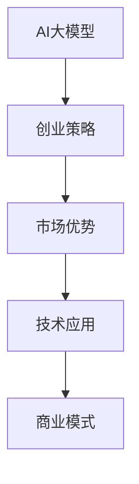

                 

# AI 大模型创业：如何利用市场优势？

> 关键词：AI大模型、创业策略、市场优势、技术应用、商业模式、用户需求、技术创新

## 1. 背景介绍

随着人工智能技术的迅猛发展，AI大模型（如BERT、GPT-3等）在自然语言处理（NLP）、计算机视觉（CV）、语音识别（ASR）等领域展现了强大的能力。这些大模型基于大规模数据预训练，能够完成复杂的任务，如语言理解、图像识别、语音生成等。AI大模型的应用不仅改变了多个行业，也催生了大量的创业机会。本文将探讨如何利用AI大模型的市场优势，通过有效的创业策略，抓住商机，实现成功创业。

## 2. 核心概念与联系

### 2.1 核心概念概述

要理解AI大模型创业，首先需要理解几个核心概念及其相互联系：

- **AI大模型**：基于大规模数据预训练，具备特定任务处理能力的人工智能模型，如BERT、GPT-3等。
- **创业策略**：在有限的资源下，选择合适的市场定位、技术路线和商业模式，实现商业成功的方法。
- **市场优势**：通过AI大模型在特定领域或任务中的出色表现，形成的竞争优势。
- **技术应用**：将AI大模型应用于实际业务场景，提升效率和效益的过程。
- **商业模式**：AI大模型创业项目的盈利方式，如订阅制、按需付费、广告分成等。

### 2.2 核心概念原理和架构的 Mermaid 流程图



这个流程图展示了AI大模型创业过程中，各个概念之间的相互关系。AI大模型是创业的起点，创业策略决定了创业方向和成功概率，市场优势和商业模式则保证了创业项目的可持续发展。

## 3. 核心算法原理 & 具体操作步骤

### 3.1 算法原理概述

AI大模型创业的核心在于利用模型的市场优势，通过选择合适的应用场景和技术路线，实现商业成功。以下是基于市场优势的AI大模型创业算法原理：

1. **市场定位**：确定目标市场和用户需求，确保产品与市场需求相匹配。
2. **技术路线选择**：选择适合目标市场的AI大模型和技术，优化模型性能，提高应用效果。
3. **商业模式设计**：制定合理的盈利方式，如订阅制、按需付费、广告分成等，确保商业可持续。

### 3.2 算法步骤详解

#### 3.2.1 市场定位

1. **目标市场分析**：通过调研和分析，确定目标市场的主要用户群体、市场需求和竞争对手情况。
2. **用户需求挖掘**：深入挖掘目标用户的实际需求，分析其痛点和解决方案。
3. **市场定位**：根据目标市场和用户需求，确定产品定位和差异化策略。

#### 3.2.2 技术路线选择

1. **模型选择**：选择适合目标市场的AI大模型，如BERT、GPT-3等。
2. **技术优化**：对所选模型进行微调、迁移学习等技术优化，提高模型性能和应用效果。
3. **技术栈构建**：选择合适的技术栈和工具，如TensorFlow、PyTorch、AWS等，支持模型开发和部署。

#### 3.2.3 商业模式设计

1. **盈利模式选择**：根据市场需求和产品特点，选择合适的盈利模式，如按需付费、订阅制、广告分成等。
2. **价格策略制定**：根据成本和用户需求，制定合理的定价策略。
3. **市场推广**：制定有效的市场推广策略，吸引用户并提升品牌知名度。

### 3.3 算法优缺点

#### 3.3.1 优点

- **技术领先**：AI大模型具备强大的处理能力，能够应对复杂的任务，提升业务效率。
- **市场适应性强**：可以根据市场需求灵活调整模型和技术路线，满足不同用户需求。
- **盈利模式多样**：可以选择多种盈利模式，增加收入来源和抗风险能力。

#### 3.3.2 缺点

- **成本高**：开发和维护AI大模型需要大量的数据和计算资源，成本较高。
- **技术复杂**：AI大模型的开发和应用涉及多个技术领域，需要高水平的技术团队支持。
- **市场竞争激烈**：AI大模型应用领域竞争激烈，需要不断创新和优化才能保持竞争优势。

### 3.4 算法应用领域

AI大模型创业可以应用于多个领域，如医疗、金融、零售、教育等。以下是一些典型的应用场景：

- **医疗**：利用AI大模型进行疾病预测、诊断、治疗方案推荐等。
- **金融**：利用AI大模型进行风险评估、信用评分、投资策略等。
- **零售**：利用AI大模型进行个性化推荐、库存管理、客户服务等。
- **教育**：利用AI大模型进行智能辅导、教育内容推荐、情感分析等。

## 4. 数学模型和公式 & 详细讲解 & 举例说明

### 4.1 数学模型构建

AI大模型创业的数学模型构建主要包括以下几个步骤：

1. **市场分析模型**：通过回归分析、聚类分析等方法，分析市场趋势和用户需求。
2. **技术优化模型**：通过深度学习模型、迁移学习模型等，优化AI大模型性能。
3. **盈利模型**：通过线性回归、决策树等模型，设计盈利策略。

### 4.2 公式推导过程

#### 4.2.1 市场分析模型

假设市场需求为 $D$，用户需求为 $U$，市场竞争为 $C$。市场分析模型可以表示为：

$$
D = f(U, C)
$$

其中 $f$ 为市场分析函数，用于根据用户需求和竞争情况预测市场需求。

#### 4.2.2 技术优化模型

假设AI大模型为 $M$，数据为 $D$，技术优化后的模型为 $M'$。技术优化模型可以表示为：

$$
M' = f(M, D)
$$

其中 $f$ 为技术优化函数，用于根据数据优化AI大模型。

#### 4.2.3 盈利模型

假设盈利为 $P$，成本为 $C$，定价为 $P'$。盈利模型可以表示为：

$$
P = P' - C
$$

其中 $P'$ 为定价函数，用于根据市场需求和模型性能定价。

### 4.3 案例分析与讲解

以医疗领域的AI大模型创业为例，分析其市场定位、技术路线和商业模式。

**市场定位**：分析医疗市场的主要用户群体（如患者、医生、医院）和市场需求（如疾病预测、诊断、治疗方案推荐）。

**技术路线**：选择适合医疗市场的AI大模型（如BERT、GPT-3），并对其在医学文献、病历数据上进行微调，提高模型的疾病预测和诊断能力。

**商业模式**：根据医疗市场的需求，选择按需付费的模式，根据服务内容和用户需求定价，并利用医疗数据的隐私保护技术，确保数据安全和用户隐私。

## 5. 项目实践：代码实例和详细解释说明

### 5.1 开发环境搭建

1. **环境准备**：安装Python、TensorFlow、PyTorch、AWS等工具。
2. **数据准备**：收集和准备目标市场的相关数据，如医疗数据、金融数据、零售数据等。
3. **模型搭建**：选择合适的AI大模型，进行微调和优化。

### 5.2 源代码详细实现

以下是基于TensorFlow的AI大模型微调代码实现：

```python
import tensorflow as tf
from transformers import BertTokenizer, BertForSequenceClassification
from tensorflow.keras.optimizers import Adam

# 模型加载
tokenizer = BertTokenizer.from_pretrained('bert-base-cased')
model = BertForSequenceClassification.from_pretrained('bert-base-cased', num_labels=2)

# 数据准备
train_data = ['...', '...']
train_labels = [0, 1]
dev_data = ['...', '...']
dev_labels = [0, 1]

# 数据预处理
train_encodings = tokenizer(train_data, return_tensors='tf')
dev_encodings = tokenizer(dev_data, return_tensors='tf')

# 模型训练
model.compile(optimizer=Adam(learning_rate=2e-5), loss=tf.keras.losses.SparseCategoricalCrossentropy(from_logits=True), metrics=['accuracy'])
model.fit(train_encodings['input_ids'], train_labels, validation_data=(dev_encodings['input_ids'], dev_labels), epochs=5)
```

### 5.3 代码解读与分析

代码主要实现以下几个步骤：

1. **模型加载**：使用BERT模型作为初始化参数，加载预训练模型。
2. **数据准备**：收集和准备训练和验证数据，并进行数据预处理。
3. **模型训练**：使用Adam优化器和交叉熵损失函数，训练模型。

## 6. 实际应用场景

### 6.1 智能医疗

AI大模型在医疗领域具有广阔的应用前景。可以通过微调BERT模型，实现疾病预测、诊断、治疗方案推荐等功能，提升医疗服务的智能化水平。

**市场定位**：针对医疗市场的用户需求，如患者疾病预测、医生诊断和治疗方案推荐。

**技术路线**：选择BERT模型，并对其进行微调，利用医疗数据训练模型，提高模型的疾病预测和诊断能力。

**商业模式**：选择按需付费的模式，根据服务内容和用户需求定价。

### 6.2 金融风险管理

AI大模型在金融领域可以用于风险评估、信用评分、投资策略等。通过微调BERT模型，实现对金融数据的分析和预测，提升金融服务的智能化水平。

**市场定位**：针对金融市场的用户需求，如风险评估、信用评分、投资策略。

**技术路线**：选择BERT模型，并对其进行微调，利用金融数据训练模型，提高模型的金融数据分析能力。

**商业模式**：选择按需付费的模式，根据服务内容和用户需求定价。

### 6.3 智能零售

AI大模型在零售领域可以用于个性化推荐、库存管理、客户服务等功能。通过微调BERT模型，实现对零售数据的分析和预测，提升零售服务的智能化水平。

**市场定位**：针对零售市场的用户需求，如个性化推荐、库存管理、客户服务。

**技术路线**：选择BERT模型，并对其进行微调，利用零售数据训练模型，提高模型的零售数据分析能力。

**商业模式**：选择按需付费的模式，根据服务内容和用户需求定价。

### 6.4 未来应用展望

未来，AI大模型在更多领域将得到应用，推动智能化转型。以下是一些未来应用展望：

1. **教育**：利用AI大模型进行智能辅导、教育内容推荐、情感分析等。
2. **交通**：利用AI大模型进行交通流量预测、路线规划、自动驾驶等。
3. **农业**：利用AI大模型进行作物识别、病虫害预测、农业生产优化等。
4. **能源**：利用AI大模型进行能源消耗预测、智能调度、节能减排等。

## 7. 工具和资源推荐

### 7.1 学习资源推荐

1. **在线课程**：Coursera、edX、Udacity等平台提供大量AI大模型相关的课程，如Deep Learning、Natural Language Processing等。
2. **书籍**：《深度学习》、《Python机器学习》、《TensorFlow实战》等书籍，提供详细的技术讲解和实践指南。
3. **博客和社区**：Medium、Kaggle、GitHub等平台，提供丰富的技术文章、案例和代码库。

### 7.2 开发工具推荐

1. **TensorFlow**：开源的深度学习框架，支持GPU和TPU计算，适用于大规模模型训练和部署。
2. **PyTorch**：开源的深度学习框架，支持动态计算图，适用于研究型项目和快速迭代。
3. **AWS SageMaker**：亚马逊提供的云端机器学习平台，支持模型训练、部署和管理。

### 7.3 相关论文推荐

1. **《深度学习》**：Ian Goodfellow等著，详细讲解深度学习的基本原理和应用。
2. **《自然语言处理综述》**：Yoshua Bengio等著，涵盖NLP领域的经典理论和最新进展。
3. **《AI大模型创业策略》**：行业专家撰写的白皮书，提供详细的创业策略和技术建议。

## 8. 总结：未来发展趋势与挑战

### 8.1 研究成果总结

AI大模型在创业领域展现了强大的市场优势，通过选择合适的应用场景和技术路线，可以实现商业成功。本文总结了AI大模型创业的算法原理和操作步骤，提供了详细的市场定位、技术路线和商业模式设计。

### 8.2 未来发展趋势

未来AI大模型创业将呈现以下几个发展趋势：

1. **技术创新**：AI大模型的技术不断创新，性能和应用效果将不断提升。
2. **市场拓展**：AI大模型在更多领域得到应用，推动智能化转型。
3. **商业模式多样化**：AI大模型创业将探索更多的盈利模式，增加收入来源。

### 8.3 面临的挑战

AI大模型创业也面临一些挑战：

1. **成本高**：AI大模型的开发和维护需要大量计算资源和数据。
2. **技术复杂**：AI大模型的开发和应用涉及多个技术领域，需要高水平的技术团队。
3. **市场竞争激烈**：AI大模型应用领域竞争激烈，需要不断创新和优化才能保持竞争优势。

### 8.4 研究展望

未来AI大模型创业需要在以下几个方面寻求新的突破：

1. **技术优化**：开发更加高效、稳定的AI大模型，降低开发和维护成本。
2. **市场拓展**：将AI大模型应用于更多领域，推动智能化转型。
3. **商业模式创新**：探索更多盈利模式，增加收入来源和抗风险能力。

## 9. 附录：常见问题与解答

**Q1: AI大模型创业如何选择合适的市场定位？**

A: 选择市场定位时，需要进行详细的市场调研和用户需求分析，明确目标市场的主要用户群体和市场需求。

**Q2: AI大模型创业如何优化技术路线？**

A: 选择适合的AI大模型，并对其进行微调、迁移学习等技术优化，提高模型性能和应用效果。

**Q3: AI大模型创业如何设计商业模式？**

A: 根据市场需求和产品特点，选择合适的盈利模式，如按需付费、订阅制、广告分成等，制定合理的定价策略。

**Q4: AI大模型创业如何确保数据安全和隐私？**

A: 采用隐私保护技术，如数据加密、联邦学习等，确保用户数据的隐私和安全。

**Q5: AI大模型创业如何提高用户满意度和忠诚度？**

A: 提供优质的用户体验和服务，通过用户反馈不断改进和优化产品。

---

作者：禅与计算机程序设计艺术 / Zen and the Art of Computer Programming

