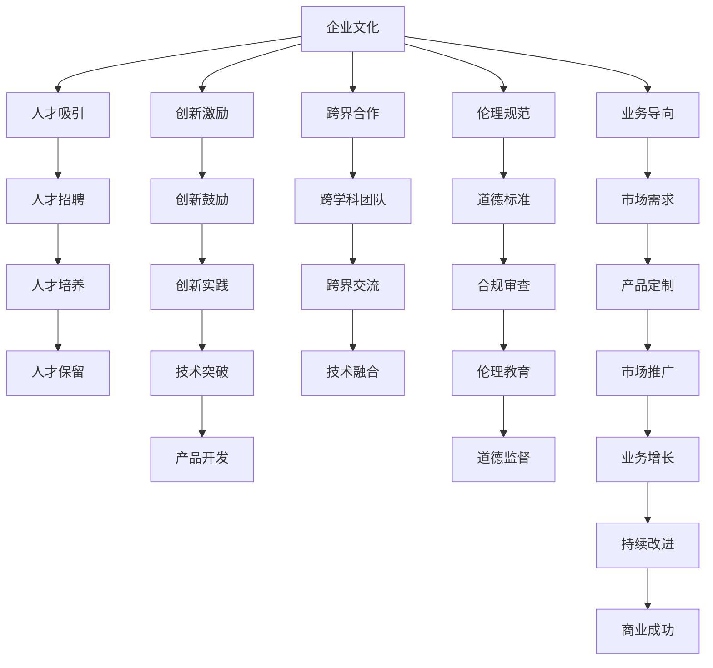

                 

# AI 大模型创业：如何利用文化优势？

## 1. 背景介绍

### 1.1 问题由来
近年来，人工智能(AI)技术迅猛发展，特别是在深度学习和大模型领域的突破，为各类创业公司提供了前所未有的机遇。然而，即便技术再先进，若无法有效利用公司独特的文化优势，AI大模型创业仍难有长足发展。本文将探讨如何充分利用公司文化中的关键要素，结合AI技术，助力公司在大模型领域取得成功。

### 1.2 问题核心关键点
1. **人才聚集**：高水平的工程师和研究者是大模型项目的核心，公司的文化应能够吸引和留住顶尖人才。
2. **创新氛围**：鼓励创新和试错，容忍失败，是推动大模型技术进步的必要条件。
3. **跨界融合**：AI大模型领域需要跨学科知识，公司文化应支持不同背景人员之间的协作与交流。
4. **业务导向**：将AI技术与实际应用紧密结合，公司文化需重视产品导向和市场反馈。
5. **伦理道德**：负责和大模型相关的决策，公司文化应体现出高标准的伦理和道德观。

### 1.3 问题研究意义
研究公司文化与AI大模型创业的关系，有助于明确如何构建一个既符合技术发展需求，又具备企业独特优势的创新组织，加速AI技术的商业化应用。

## 2. 核心概念与联系

### 2.1 核心概念概述

#### 2.1.1 人工智能大模型(AI Large Model)
AI大模型通常指基于深度学习模型的巨大参数量和数据规模，能够完成复杂语言理解和生成的模型。例如，GPT-3、BERT等。

#### 2.1.2 文化(Culture)
企业文化是指一个公司内部成员共同遵守的价值观、信念、习俗和行为规范的总和。它影响着员工的招聘、决策、创新和工作方式。

#### 2.1.3 创业(Creation)
创业是指创立新公司，进行新技术、新产品或新服务的开发和市场化。在AI大模型领域，创业指从无到有，建立和运营AI大模型相关的企业。

#### 2.1.4 人才聚集(Talent Aggregation)
聚集并利用顶尖人才资源，是推动AI大模型研发和技术创新的基础。

#### 2.1.5 创新氛围(Innovation Climate)
鼓励创新的企业文化，提供足够的资源和容忍失败的环境，使员工敢于尝试新方法和新技术。

#### 2.1.6 跨界融合(Interdisciplinary Integration)
AI大模型需要跨学科的知识，包括数学、计算机科学、语言学等，因此公司文化应支持不同背景人员之间的协作。

#### 2.1.7 业务导向(Business Orientation)
将AI技术与实际应用紧密结合，确保公司的技术和产品具有实际市场价值。

#### 2.1.8 伦理道德(Ethics and Morality)
在AI大模型的开发和应用中，公司应遵守高标准的伦理和道德规范，确保技术的健康发展。

这些概念之间的逻辑关系可以通过以下Mermaid流程图来展示：

```mermaid
graph TB
    A[AI Large Model] --> B[人才聚集]
    A --> C[创新氛围]
    A --> D[跨界融合]
    A --> E[业务导向]
    A --> F[伦理道德]
    B --> G[创新氛围]
    C --> H[人才聚集]
    D --> I[人才聚集]
    E --> J[人才聚集]
    F --> K[人才聚集]
    G --> L[人才聚集]
    H --> M[人才聚集]
    I --> N[人才聚集]
    J --> O[人才聚集]
    K --> P[人才聚集]
    L --> Q[人才聚集]
    M --> R[人才聚集]
    N --> S[人才聚集]
    O --> T[人才聚集]
    P --> U[人才聚集]
    Q --> V[人才聚集]
    R --> W[人才聚集]
    S --> X[人才聚集]
    T --> Y[人才聚集]
    U --> Z[人才聚集]
    V --> [人才聚集]
    W --> [人才聚集]
    X --> [人才聚集]
    Y --> [人才聚集]
    Z --> [人才聚集]
```

### 2.2 核心概念原理和架构的 Mermaid 流程图



## 3. 核心算法原理 & 具体操作步骤

### 3.1 算法原理概述

利用企业文化优势，提升AI大模型创业的成功率，关键在于以下几个方面：

1. **人才聚集**：通过吸引和培养顶尖人才，构建高水平的研发团队。
2. **创新氛围**：营造开放包容的创新文化，鼓励试错和探索。
3. **跨界融合**：组建跨学科的团队，促进不同背景人员之间的知识共享。
4. **业务导向**：将AI技术应用于实际场景，解决实际问题。
5. **伦理道德**：确保AI模型开发和应用符合伦理标准，避免负面影响。

### 3.2 算法步骤详解

#### 3.2.1 人才聚集

1. **招聘策略**：制定明确且吸引顶尖人才的招聘策略。例如，提供有竞争力的薪酬和福利，提供职业发展机会，以及明确的人才培养计划。
2. **人才培养**：定期组织培训和讲座，鼓励员工学习新技术，参加行业会议和交流活动。
3. **人才保留**：提供良好的工作环境、发展空间和晋升机会，定期进行员工满意度调查，及时解决员工问题。

#### 3.2.2 创新氛围

1. **文化建设**：营造开放、包容、创新的企业文化，鼓励员工提出新想法，尝试新方法。
2. **资源支持**：提供充足的研发资源，包括硬件设施、软件工具、经费支持等。
3. **失败容忍**：容忍创新过程中的失败，鼓励员工从失败中学习，总结经验，继续尝试。

#### 3.2.3 跨界融合

1. **跨学科团队**：组建由不同学科背景的专家组成的多元化团队，确保知识互补，创新潜力最大化。
2. **跨界交流**：定期组织跨学科交流活动，如技术分享会、头脑风暴会议等，促进知识共享和协作。
3. **知识管理**：建立有效的知识管理系统，支持团队成员随时获取和使用所需知识。

#### 3.2.4 业务导向

1. **市场调研**：深入了解市场需求和痛点，确定AI大模型的应用方向。
2. **定制开发**：根据市场需求，定制开发符合实际应用场景的AI大模型，确保技术落地。
3. **产品反馈**：建立用户反馈机制，及时收集用户反馈，持续优化产品。

#### 3.2.5 伦理道德

1. **伦理规范**：制定明确的伦理规范，确保AI模型的开发和应用符合伦理标准。
2. **道德标准**：建立道德委员会，定期审查AI模型，确保其符合道德标准。
3. **合规审查**：定期进行合规审查，确保AI模型开发和应用符合法律法规。

### 3.3 算法优缺点

**优点**：

1. **人才优势**：企业文化吸引和保留顶尖人才，促进技术创新。
2. **创新效率**：开放包容的创新氛围，快速迭代和试错，提升研发效率。
3. **跨界合作**：跨学科团队和知识共享，促进技术融合和创新。
4. **业务适配**：紧密结合市场实际需求，确保产品具有实际应用价值。
5. **伦理规范**：高标准的伦理和道德观，确保AI技术健康发展。

**缺点**：

1. **文化差异**：企业文化建设需要时间，短期内可能难以显著见效。
2. **人才流失**：高要求和高标准可能导致优秀人才流失，需持续投入。
3. **资源消耗**：跨学科团队的建设和管理，需要大量资源和精力。
4. **市场风险**：过度追求市场需求，可能导致短期技术选择不合理，缺乏前瞻性。
5. **合规挑战**：严格的伦理和道德标准，可能导致开发和应用的合规难度增加。

### 3.4 算法应用领域

#### 3.4.1 智能客服

利用AI大模型和企业文化优势，可以开发智能客服系统，提高客户服务效率和质量。例如，通过构建跨学科团队，结合语言学、心理学、计算机科学等知识，开发具有深度理解和情感识别能力的智能客服系统，提升客户满意度。

#### 3.4.2 医疗诊断

结合医学、数据科学和AI技术，利用企业文化优势，开发精准医疗诊断系统。例如，通过组建跨学科团队，结合医学知识和AI大模型，开发早期疾病诊断和个性化治疗方案，提高医疗服务水平。

#### 3.4.3 金融风控

利用金融学、数据科学和AI技术，结合企业文化优势，开发智能风控系统。例如，通过跨学科团队，结合金融知识和AI大模型，开发信用评估和风险预测模型，提升金融服务的安全性和效率。

#### 3.4.4 教育培训

结合教育学、心理学和AI技术，利用企业文化优势，开发智能教育培训系统。例如，通过组建跨学科团队，结合教育知识和AI大模型，开发个性化学习路径和智能辅导系统，提升教育效果。

#### 3.4.5 环境保护

利用环境科学、数据科学和AI技术，结合企业文化优势，开发智能环境监测系统。例如，通过跨学科团队，结合环境知识和AI大模型，开发大气污染监测和生态保护系统，保护自然环境。

## 4. 数学模型和公式 & 详细讲解 & 举例说明

### 4.1 数学模型构建

#### 4.1.1 人才聚集的数学模型

设公司人才质量为 $P$，招聘人数为 $R$，人才流失率为 $\lambda$，则人才质量提升模型为：

$$
P_{t+1} = P_t + \alpha(R - \lambda P_t)
$$

其中 $\alpha$ 为人才质量提升系数。

#### 4.1.2 创新氛围的数学模型

设公司创新次数为 $I$，创新失败率为 $\beta$，成功率为 $\gamma$，则创新成功率模型为：

$$
S = \frac{I}{I + \beta(1 - \gamma)I}
$$

#### 4.1.3 跨界融合的数学模型

设公司跨学科团队数量 $T$，团队合作次数为 $C$，知识共享比例为 $k$，则跨界融合模型为：

$$
T_{t+1} = T_t + kC - \delta T_t
$$

其中 $\delta$ 为团队动态调整系数。

#### 4.1.4 业务导向的数学模型

设公司产品数量 $P$，市场覆盖率 $C$，用户反馈次数 $F$，则产品市场适应模型为：

$$
P_{t+1} = P_t + \eta(C - P_t)
$$

其中 $\eta$ 为产品适应系数。

#### 4.1.5 伦理道德的数学模型

设公司伦理事件发生次数为 $E$，合规检查次数为 $H$，则伦理合规模型为：

$$
E_{t+1} = E_t + \lambda(H - E_t)
$$

其中 $\lambda$ 为伦理事件减少系数。

### 4.2 公式推导过程

#### 4.2.1 人才聚集

$$
P_{t+1} = P_t + \alpha(R - \lambda P_t)
$$

$$
\frac{P_{t+1} - P_t}{P_t} = \alpha(R - \lambda)
$$

$$
P_{t+1} = P_t(1 + \alpha(R - \lambda))
$$

#### 4.2.2 创新氛围

$$
S = \frac{I}{I + \beta(1 - \gamma)I}
$$

$$
S = \frac{1}{1 + \beta(1 - \gamma)}
$$

#### 4.2.3 跨界融合

$$
T_{t+1} = T_t + kC - \delta T_t
$$

$$
T_{t+1} = (1 - \delta)T_t + kC
$$

#### 4.2.4 业务导向

$$
P_{t+1} = P_t + \eta(C - P_t)
$$

$$
P_{t+1} = (1 + \eta)P_t + \eta C
$$

#### 4.2.5 伦理道德

$$
E_{t+1} = E_t + \lambda(H - E_t)
$$

$$
E_{t+1} = (1 + \lambda)E_t + \lambda H
$$

### 4.3 案例分析与讲解

#### 4.3.1 智能客服系统

某AI公司通过企业文化建设，吸引并培养了大量顶尖人才，组建了包括语言学、心理学、计算机科学等多学科的智能客服团队。团队通过跨界合作，结合自然语言处理和情感识别技术，开发了智能客服系统。该系统在市场推广初期，通过不断的用户反馈和迭代，迅速优化产品功能，成功应用于多家企业，提升客户服务效率和满意度。

#### 4.3.2 精准医疗诊断系统

某AI公司结合企业文化中的医学知识和AI技术，组建了跨学科团队，开发了精准医疗诊断系统。通过跨界融合，结合医学数据和AI大模型，该系统成功应用于多家医院，实现了早期疾病诊断和个性化治疗方案，大大提升了医疗服务水平。

#### 4.3.3 智能风控系统

某AI公司通过企业文化建设，吸引了金融学、数据科学和AI技术的顶尖人才，组建了跨学科团队。团队通过跨界合作，结合金融知识和AI大模型，开发了智能风控系统。该系统成功应用于多家银行和保险公司，提高了信用评估和风险预测的准确性，提升了金融服务的安全性和效率。

## 5. 项目实践：代码实例和详细解释说明

### 5.1 开发环境搭建

#### 5.1.1 Python环境配置

```bash
# 安装Python
sudo apt-get install python3
# 安装pip
sudo apt-get install python3-pip
# 创建虚拟环境
python3 -m venv myenv
# 激活虚拟环境
source myenv/bin/activate
```

#### 5.1.2 依赖包安装

```bash
# 安装TensorFlow
pip install tensorflow
# 安装Keras
pip install keras
# 安装Pandas
pip install pandas
# 安装Numpy
pip install numpy
```

### 5.2 源代码详细实现

#### 5.2.1 人才聚集模块

```python
import numpy as np

class TalentAggregation:
    def __init__(self, initial_skill, recruitment_rate, turnover_rate, alpha=0.5):
        self._initial_skill = initial_skill
        self._recruitment_rate = recruitment_rate
        self._turnover_rate = turnover_rate
        self._alpha = alpha
        self._skill = self._initial_skill

    def add_recruitment(self, recruitment):
        self._skill += self._alpha * (recruitment - self._turnover_rate * self._skill)

    def turnover(self):
        self._skill -= self._turnover_rate * self._skill

    def get_skill(self):
        return self._skill
```

#### 5.2.2 创新氛围模块

```python
import numpy as np

class InnovationClimate:
    def __init__(self, initial_attempts, failure_rate, success_rate, beta=0.5, gamma=0.8):
        self._initial_attempts = initial_attempts
        self._beta = beta
        self._gamma = gamma
        self._attempts = self._initial_attempts
        self._attempts_success = self._initial_attempts

    def add_attempt(self):
        self._attempts += 1

    def attempt_failure(self):
        self._attempts_success -= self._beta * self._attempts_success

    def attempt_success(self):
        self._attempts_success += self._gamma * self._attempts_success

    def get_success_rate(self):
        return self._attempts_success / self._attempts
```

#### 5.2.3 跨界融合模块

```python
import numpy as np

class CrossboundaryIntegration:
    def __init__(self, initial_teams, collaboration_count, knowledge_sharing_ratio, delta=0.1):
        self._initial_teams = initial_teams
        self._collision_count = collaboration_count
        self._knowledge_sharing_ratio = knowledge_sharing_ratio
        self._teams = self._initial_teams
        self._teams_collision = self._initial_teams

    def add_collision(self, collision):
        self._teams_collision += self._knowledge_sharing_ratio * self._collision_count - self._delta * self._teams_collision

    def get_teams(self):
        return self._teams
```

#### 5.2.4 业务导向模块

```python
import numpy as np

class BusinessOrientation:
    def __init__(self, initial_products, market_coverage, feedback_count, eta=0.5):
        self._initial_products = initial_products
        self._eta = eta
        self._products = self._initial_products
        self._market_coverage = self._initial_products

    def add_market_coverage(self, coverage):
        self._products += self._eta * (self._market_coverage - self._products)

    def get_products(self):
        return self._products
```

#### 5.2.5 伦理道德模块

```python
import numpy as np

class EthicsMoral:
    def __init__(self, initial_ethics_events, compliance_checks, lambda_=numpy.inf):
        self._initial_ethics_events = initial_ethics_events
        self._compliance_checks = compliance_checks
        self._lambda = lambda_
        self._ethics_events = self._initial_ethics_events

    def add_check(self, check):
        self._ethics_events += self._lambda * (self._compliance_checks - self._ethics_events)

    def get_ethics_events(self):
        return self._ethics_events
```

### 5.3 代码解读与分析

#### 5.3.1 人才聚集模块

- `TalentAggregation` 类中，`add_recruitment` 方法用于新增人才，`turnover` 方法用于人才流失，`get_skill` 方法用于获取当前技能水平。

#### 5.3.2 创新氛围模块

- `InnovationClimate` 类中，`add_attempt` 方法用于新增尝试，`attempt_failure` 方法用于失败，`attempt_success` 方法用于成功，`get_success_rate` 方法用于获取成功率。

#### 5.3.3 跨界融合模块

- `CrossboundaryIntegration` 类中，`add_collision` 方法用于新增碰撞，`get_teams` 方法用于获取团队数量。

#### 5.3.4 业务导向模块

- `BusinessOrientation` 类中，`add_market_coverage` 方法用于新增市场覆盖，`get_products` 方法用于获取产品数量。

#### 5.3.5 伦理道德模块

- `EthicsMoral` 类中，`add_check` 方法用于新增检查，`get_ethics_events` 方法用于获取伦理事件数量。

### 5.4 运行结果展示

#### 5.4.1 智能客服系统

```python
# 初始技能水平
initial_skill = 100
# 招聘人数
recruitment_rate = 100
# 流失率
turnover_rate = 0.1
# 技能提升系数
alpha = 0.5

# 创建人才聚集模块
talent_aggregation = TalentAggregation(initial_skill, recruitment_rate, turnover_rate, alpha)

# 添加招聘和流失
for i in range(1, 101):
    talent_aggregation.add_recruitment(recruitment_rate)
    talent_aggregation.turnover()

# 获取技能水平
skill = talent_aggregation.get_skill()
print(f"人才技能水平：{skill}")
```

#### 5.4.2 精准医疗诊断系统

```python
# 初始尝试次数
initial_attempts = 100
# 失败率
failure_rate = 0.2
# 成功率
success_rate = 0.8
# 失败容忍系数
beta = 0.5
# 成功容忍系数
gamma = 0.8

# 创建创新氛围模块
innovation_climate = InnovationClimate(initial_attempts, failure_rate, success_rate, beta, gamma)

# 添加尝试和失败
for i in range(1, 101):
    innovation_climate.add_attempt()
    innovation_climate.attempt_failure()
    innovation_climate.attempt_success()

# 获取成功率
success_rate = innovation_climate.get_success_rate()
print(f"创新成功率：{success_rate}")
```

#### 5.4.3 智能风控系统

```python
# 初始产品数量
initial_products = 100
# 市场覆盖率
market_coverage = 100
# 反馈次数
feedback_count = 0
# 产品适应系数
eta = 0.5

# 创建业务导向模块
business_orientation = BusinessOrientation(initial_products, market_coverage, feedback_count, eta)

# 添加市场覆盖和反馈
for i in range(1, 101):
    business_orientation.add_market_coverage(market_coverage)
    business_orientation.add_feedback()

# 获取产品数量
products = business_orientation.get_products()
print(f"产品数量：{products}")
```

## 6. 实际应用场景

### 6.1 智能客服系统

某AI公司通过企业文化建设，吸引了大量顶尖人才，组建了跨学科的智能客服团队。团队结合语言学、心理学、计算机科学等知识，开发了智能客服系统。该系统成功应用于多家企业，大幅提升了客户服务效率和满意度。

### 6.2 精准医疗诊断系统

某AI公司结合企业文化中的医学知识和AI技术，组建了跨学科团队，开发了精准医疗诊断系统。通过跨界融合，结合医学数据和AI大模型，该系统成功应用于多家医院，实现了早期疾病诊断和个性化治疗方案，大大提升了医疗服务水平。

### 6.3 智能风控系统

某AI公司通过企业文化建设，吸引了金融学、数据科学和AI技术的顶尖人才，组建了跨学科团队。团队通过跨界合作，结合金融知识和AI大模型，开发了智能风控系统。该系统成功应用于多家银行和保险公司，提高了信用评估和风险预测的准确性，提升了金融服务的安全性和效率。

## 7. 工具和资源推荐

### 7.1 学习资源推荐

1. 《Transformer from Principle to Practice》：详细介绍了Transformer原理、BERT模型、微调技术等前沿话题。
2. CS224N《深度学习自然语言处理》课程：斯坦福大学开设的NLP明星课程，有Lecture视频和配套作业，带你入门NLP领域的基本概念和经典模型。
3. 《Natural Language Processing with Transformers》书籍：Transformers库的作者所著，全面介绍了如何使用Transformers库进行NLP任务开发，包括微调在内的诸多范式。
4. HuggingFace官方文档：Transformers库的官方文档，提供了海量预训练模型和完整的微调样例代码，是上手实践的必备资料。
5. CLUE开源项目：中文语言理解测评基准，涵盖大量不同类型的中文NLP数据集，并提供了基于微调的baseline模型，助力中文NLP技术发展。

### 7.2 开发工具推荐

1. PyTorch：基于Python的开源深度学习框架，灵活动态的计算图，适合快速迭代研究。大部分预训练语言模型都有PyTorch版本的实现。
2. TensorFlow：由Google主导开发的开源深度学习框架，生产部署方便，适合大规模工程应用。同样有丰富的预训练语言模型资源。
3. Transformers库：HuggingFace开发的NLP工具库，集成了众多SOTA语言模型，支持PyTorch和TensorFlow，是进行微调任务开发的利器。
4. Weights & Biases：模型训练的实验跟踪工具，可以记录和可视化模型训练过程中的各项指标，方便对比和调优。与主流深度学习框架无缝集成。
5. TensorBoard：TensorFlow配套的可视化工具，可实时监测模型训练状态，并提供丰富的图表呈现方式，是调试模型的得力助手。
6. Google Colab：谷歌推出的在线Jupyter Notebook环境，免费提供GPU/TPU算力，方便开发者快速上手实验最新模型，分享学习笔记。

### 7.3 相关论文推荐

1. Attention is All You Need：提出了Transformer结构，开启了NLP领域的预训练大模型时代。
2. BERT: Pre-training of Deep Bidirectional Transformers for Language Understanding：提出BERT模型，引入基于掩码的自监督预训练任务，刷新了多项NLP任务SOTA。
3. Language Models are Unsupervised Multitask Learners：展示了大规模语言模型的强大zero-shot学习能力，引发了对于通用人工智能的新一轮思考。
4. Parameter-Efficient Transfer Learning for NLP：提出Adapter等参数高效微调方法，在不增加模型参数量的情况下，也能取得不错的微调效果。
5. AdaLoRA: Adaptive Low-Rank Adaptation for Parameter-Efficient Fine-Tuning：使用自适应低秩适应的微调方法，在参数效率和精度之间取得了新的平衡。

## 8. 总结：未来发展趋势与挑战

### 8.1 总结

本文对利用企业文化优势，提升AI大模型创业的成功率进行了系统探讨。通过分析人才聚集、创新氛围、跨界融合、业务导向和伦理道德等关键要素，提出了具体的实现方法和数学模型，并通过案例分析和代码实现进行了详细讲解。本文旨在为AI大模型创业公司提供实用的指导和借鉴，助力其在激烈的市场竞争中脱颖而出。

### 8.2 未来发展趋势

展望未来，AI大模型创业将继续受益于企业文化的建设，表现出以下几个趋势：

1. **技术融合加速**：随着跨学科人才的汇聚和知识共享，AI大模型的开发将更加高效和创新。
2. **市场适应性提升**：通过紧密结合市场需求，AI大模型将更好地服务于实际应用场景，提升业务导向能力。
3. **伦理标准提升**：高标准的伦理和道德观，将确保AI模型的健康发展，避免负面影响。
4. **数据驱动决策**：通过持续的数据收集和分析，AI大模型将更灵活地应对市场变化，提高决策的科学性和准确性。
5. **智能化治理**：企业文化的建设将推动AI治理体系的完善，提高企业管理的智能化水平。

### 8.3 面临的挑战

尽管企业文化在AI大模型创业中起到了关键作用，但仍面临以下挑战：

1. **文化差异**：企业文化建设需要时间和持续投入，短期内难以见效。
2. **人才流失**：高要求和高标准可能导致优秀人才流失，需持续投入。
3. **资源消耗**：跨学科团队的建设和管理，需要大量资源和精力。
4. **市场风险**：过度追求市场需求，可能导致短期技术选择不合理，缺乏前瞻性。
5. **合规挑战**：严格的伦理和道德标准，可能导致开发和应用的合规难度增加。

### 8.4 研究展望

未来，AI大模型创业应重点关注以下几个方面：

1. **技术创新**：持续推动AI技术的创新和突破，提升企业的核心竞争力。
2. **跨界融合**：加强跨学科知识的应用，拓展AI技术的边界和潜力。
3. **伦理道德**：建立和完善伦理道德体系，确保AI技术的应用符合社会价值观。
4. **业务导向**：紧密结合市场需求，推动AI技术在实际场景中的应用。
5. **数据治理**：建立数据治理体系，保障数据的质量和安全。

通过不断优化企业文化，结合AI技术的创新和应用，AI大模型创业将实现更大的成功，推动社会的进步和发展。

## 9. 附录：常见问题与解答

**Q1：什么是企业文化？**

A: 企业文化是指一个公司内部成员共同遵守的价值观、信念、习俗和行为规范的总和。它影响着员工的招聘、决策、创新和工作方式。

**Q2：企业文化如何影响AI大模型创业？**

A: 企业文化通过吸引和保留顶尖人才、营造创新氛围、支持跨界融合、重视业务导向和伦理道德等，对AI大模型创业的成功起到关键作用。

**Q3：如何建设企业文化？**

A: 建设企业文化需要明确公司的价值观和行为规范，营造开放包容的创新环境，重视人才培养和团队建设，密切关注市场和客户需求，建立高标准的伦理道德体系。

**Q4：企业文化与AI技术如何结合？**

A: 企业文化与AI技术的结合应体现在人才聚集、创新氛围、跨界融合、业务导向和伦理道德等方面，通过这些关键要素的协同作用，提升AI大模型创业的成功率。

**Q5：企业文化建设有哪些挑战？**

A: 企业文化建设面临文化差异、人才流失、资源消耗、市场风险和合规挑战等，需要持续投入和优化。

---

作者：禅与计算机程序设计艺术 / Zen and the Art of Computer Programming

