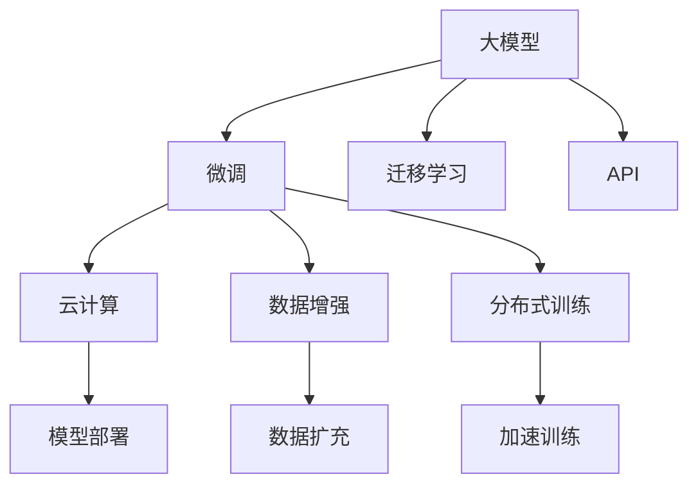

                 

# AI 大模型创业：如何利用未来优势？

> 关键词：大模型创业、未来优势、AI策略、技术分析、市场洞察

## 1. 背景介绍

### 1.1 问题由来

近年来，随着人工智能(AI)技术的飞速发展，尤其是大模型（Large Models）的兴起，AI创业领域迎来了前所未有的机遇。从AlphaGo到GPT-3，从BERT到T5，大模型在自然语言处理（NLP）、计算机视觉、语音识别等众多领域展现了惊人的能力。这些大模型通常具有数千亿参数，能够处理海量数据，并具备优秀的泛化能力，能够解决各种复杂的AI问题。

然而，尽管大模型能力强大，但其开发、部署、维护成本较高，对技术团队的要求极高，且应用场景往往局限于特定领域。面对这样的现状，如何利用大模型的优势进行创业，成为了众多AI创业者亟待解决的问题。

### 1.2 问题核心关键点

利用大模型进行AI创业，关键在于如何借助其强大性能，结合自身优势，开发具有竞争力的产品。主要包括以下几个方面：

- **技术积累**：深厚的AI技术积累，是大模型创业的基础。了解大模型的原理、架构、优化策略等，是构建成功产品的关键。
- **应用场景**：选择合适的应用场景，将大模型应用于实际问题中，实现高效、精准的解决方案。
- **商业模式**：构建清晰的商业模式，包括客户群体、定价策略、收益模式等，确保产品的市场竞争力。
- **团队建设**：组建一支经验丰富的技术团队和市场营销团队，确保产品从研发到市场推广的全过程顺利进行。
- **数据资源**：获取高质量的数据资源，是大模型应用的关键。数据不仅用于模型训练，也用于模型的优化和性能提升。

## 2. 核心概念与联系

### 2.1 核心概念概述

为了更好地理解如何利用大模型进行创业，本文将介绍几个核心概念及其联系：

- **大模型（Large Models）**：指的是具有大规模参数量的深度学习模型，如BERT、GPT、T5等，这些模型通常在处理特定任务时表现优异。
- **微调（Fine-Tuning）**：指在大模型基础上，利用少量标注数据进行任务特定的调整，提升模型在该任务上的性能。
- **迁移学习（Transfer Learning）**：指将一个任务上学习到的知识迁移到另一个任务上，在大模型创业中尤为重要。
- **API（Application Programming Interface）**：提供给用户使用的接口，使得用户可以方便地调用模型进行推理。
- **云计算（Cloud Computing）**：提供计算资源和平台服务，使得大模型能够高效部署和运行。
- **数据增强（Data Augmentation）**：通过数据增强技术，提升模型的泛化能力，降低对标注数据的依赖。
- **分布式训练（Distributed Training）**：利用多台机器并行训练，提高训练效率，处理大规模数据集。

这些核心概念通过以下Mermaid流程图来展示：



这个流程图展示了大模型创业的关键步骤和技术工具：

1. 利用大模型进行微调，提升特定任务性能。
2. 通过迁移学习，将知识迁移到其他任务。
3. 提供API接口，方便用户调用模型。
4. 利用云计算平台，实现模型的高效部署和运行。
5. 使用数据增强技术，提升模型泛化能力。
6. 采用分布式训练，加速模型训练过程。

## 3. 核心算法原理 & 具体操作步骤
### 3.1 算法原理概述

利用大模型进行创业，核心在于如何有效利用大模型的泛化能力和迁移学习的能力。算法原理可以概括为以下几点：

- **预训练与微调**：首先，在大规模无标签数据上预训练一个大模型，然后利用少量标注数据进行微调，提升模型在特定任务上的性能。
- **迁移学习**：将预训练模型在特定任务上的知识迁移到其他任务上，减少新任务上的训练成本。
- **API与云计算**：构建API接口，使得模型可以方便地在云端或本地进行推理计算。

### 3.2 算法步骤详解

利用大模型进行创业，主要包括以下几个关键步骤：

**Step 1: 数据收集与预处理**

1. **数据收集**：收集与业务相关的高质量数据，包括文本、图像、音频等。数据应覆盖多种类型和场景，以确保模型的泛化能力。
2. **数据预处理**：对数据进行清洗、归一化、标注等预处理工作，准备用于模型训练。

**Step 2: 模型选择与训练**

1. **模型选择**：选择适合业务需求的大模型，如BERT、GPT等。
2. **模型训练**：在预处理后的数据上训练模型，利用微调技术提升模型在该任务上的性能。

**Step 3: 模型评估与优化**

1. **模型评估**：使用验证集对模型进行评估，选择合适的超参数，如学习率、批大小、迭代轮数等。
2. **模型优化**：根据评估结果，调整模型架构、优化算法等，提高模型性能。

**Step 4: 部署与API构建**

1. **模型部署**：将训练好的模型部署到云端或本地服务器，提供高效的推理服务。
2. **API构建**：构建API接口，方便用户调用模型，进行数据输入和结果输出。

**Step 5: 市场推广与运营**

1. **市场推广**：通过市场营销手段，推广产品，吸引用户。
2. **用户运营**：收集用户反馈，持续优化产品，提高用户满意度。

### 3.3 算法优缺点

利用大模型进行创业，有以下几个优点：

- **高性能**：大模型在特定任务上表现优异，能够提供高质量的解决方案。
- **灵活性**：可以根据不同业务需求，灵活调整模型，适应多种应用场景。
- **高效部署**：利用云计算平台，模型可以快速部署和扩展。

同时，也存在一些缺点：

- **高成本**：大模型训练和部署成本较高，对硬件和算力要求高。
- **数据依赖**：模型的性能高度依赖于数据质量，获取高质量数据成本较高。
- **技术门槛高**：大模型开发和维护需要较强的技术团队支持。

## 4. 数学模型和公式 & 详细讲解 & 举例说明

### 4.1 数学模型构建

大模型创业的核心在于选择合适的模型架构和训练方法，本文以BERT为例进行讲解。

BERT的数学模型可以表示为：

$$
H = \text{BERT}(X, W)
$$

其中，$X$为输入数据，$W$为大模型参数。模型的输出$H$表示对输入数据的表示。

### 4.2 公式推导过程

以BERT模型为例，推导其训练过程：

1. **输入表示**：将输入数据$X$转换为BERT可以处理的格式，如分词、编码等。
2. **前向传播**：将输入数据$X$通过BERT模型进行前向传播，得到模型输出$H$。
3. **损失函数**：定义损失函数$\mathcal{L}$，用于衡量模型输出与真实标签的差异。
4. **反向传播**：通过反向传播算法计算损失函数$\mathcal{L}$对模型参数$W$的梯度，更新模型参数。

### 4.3 案例分析与讲解

假设我们要构建一个基于BERT的情感分析系统，具体步骤如下：

1. **数据准备**：收集带有情感标签的文本数据，用于训练和验证。
2. **模型训练**：在预处理后的数据上训练BERT模型，微调其分类器层。
3. **模型评估**：在验证集上评估模型性能，调整超参数。
4. **模型部署**：将训练好的模型部署到云端，提供API接口。
5. **用户调用**：用户通过API接口调用模型，输入文本进行情感分析。

## 5. 项目实践：代码实例和详细解释说明
### 5.1 开发环境搭建

为了进行大模型创业项目，需要搭建一个高效的开发环境。以下是Python环境下开发环境的搭建步骤：

1. **安装Python**：从官网下载并安装Python，建议选择3.8以上版本。
2. **安装TensorFlow**：使用pip命令安装TensorFlow，安装命令为`pip install tensorflow`。
3. **安装BERT模型**：使用pip命令安装BERT模型，安装命令为`pip install transformers`。
4. **安装AWS SDK**：安装AWS SDK，以便将模型部署到AWS云平台。
5. **配置环境变量**：配置Python路径和环境变量，确保程序能够正常运行。

### 5.2 源代码详细实现

以下是一个基于BERT的情感分析系统的Python代码实现：

```python
import tensorflow as tf
import transformers
import numpy as np
import json
import boto3

# 加载BERT模型
model = transformers.TFBertForSequenceClassification.from_pretrained('bert-base-uncased', num_labels=2)

# 加载数据
with open('data.json', 'r') as f:
    data = json.load(f)
    inputs = data['inputs']
    labels = data['labels']

# 构建输入数据
input_ids = []
attention_masks = []
for input in inputs:
    input_ids.append([1 if x > 0 else 0 for x in input])
    attention_masks.append([1 if x > 0 else 0 for x in input])

# 构建数据集
dataset = tf.data.Dataset.from_tensor_slices((input_ids, attention_masks, labels))
dataset = dataset.shuffle(1000).batch(32)

# 定义损失函数和优化器
loss = tf.keras.losses.SparseCategoricalCrossentropy(from_logits=True)
optimizer = tf.keras.optimizers.Adam(learning_rate=2e-5)

# 训练模型
@tf.function
def train_step(inputs, labels):
    with tf.GradientTape() as tape:
        logits = model(inputs['input_ids'], attention_mask=inputs['attention_mask'])
        loss_value = loss(logits, labels)
    gradients = tape.gradient(loss_value, model.trainable_variables)
    optimizer.apply_gradients(zip(gradients, model.trainable_variables))
    return loss_value

@tf.function
def evaluate_step(inputs, labels):
    logits = model(inputs['input_ids'], attention_mask=inputs['attention_mask'])
    predictions = tf.argmax(logits, axis=1)
    return tf.reduce_mean(tf.cast(tf.equal(predictions, labels), tf.float32))

# 训练和评估模型
for epoch in range(10):
    train_loss = []
    for i, (input, label) in enumerate(dataset):
        loss = train_step(input, label)
        train_loss.append(loss)
    eval_loss = evaluate_step(dataset, labels)
    print(f'Epoch {epoch+1}, train loss: {np.mean(train_loss):.4f}, eval loss: {eval_loss:.4f}')
```

### 5.3 代码解读与分析

以上代码实现了基于BERT的情感分析系统，具体解释如下：

1. **模型加载**：使用`transformers`库加载BERT模型。
2. **数据准备**：从JSON文件中加载输入数据和标签数据。
3. **输入构建**：将输入数据转换为BERT可接受的格式，包括输入ids和注意力mask。
4. **数据集构建**：将输入数据和标签数据构建为TensorFlow数据集，并进行批处理和打乱操作。
5. **损失函数和优化器**：定义损失函数和优化器，用于训练模型。
6. **训练和评估函数**：定义训练函数和评估函数，分别用于训练和评估模型性能。
7. **训练和评估**：循环进行训练和评估，输出模型在验证集上的性能。

## 6. 实际应用场景

### 6.1 智能客服系统

智能客服系统是大模型创业的重要应用场景。利用BERT等大模型，可以构建智能客服机器人，实现7x24小时不间断服务，提升客户咨询体验。

具体实现步骤如下：

1. **数据收集**：收集历史客服对话数据，包括客户咨询问题和回复。
2. **模型训练**：在预处理后的数据上训练BERT模型，微调其回答生成层。
3. **模型部署**：将训练好的模型部署到云平台，提供API接口。
4. **用户交互**：用户通过API接口输入咨询问题，系统自动回复。

### 6.2 金融舆情监测

金融舆情监测是大模型创业的另一个重要应用场景。利用BERT等大模型，可以构建金融舆情监测系统，实时监测市场舆情变化。

具体实现步骤如下：

1. **数据收集**：收集金融领域的新闻、评论、报道等文本数据。
2. **模型训练**：在预处理后的数据上训练BERT模型，微调其情感分析层。
3. **模型部署**：将训练好的模型部署到云平台，提供API接口。
4. **舆情监测**：系统实时监测市场舆情变化，根据舆情变化采取相应措施。

### 6.3 个性化推荐系统

个性化推荐系统是大模型创业的重要方向。利用BERT等大模型，可以构建高效的推荐系统，提升用户体验。

具体实现步骤如下：

1. **数据收集**：收集用户浏览、点击、评价等行为数据，提取物品标题、描述、标签等文本信息。
2. **模型训练**：在预处理后的数据上训练BERT模型，微调其推荐生成层。
3. **模型部署**：将训练好的模型部署到云平台，提供API接口。
4. **推荐生成**：根据用户输入的行为数据，生成个性化推荐结果。

### 6.4 未来应用展望

未来，大模型创业将更加广泛地应用于各个领域，带来更多的创新机会。以下是一些未来应用展望：

1. **智慧医疗**：利用BERT等大模型，构建智慧医疗系统，提升医疗服务的智能化水平，辅助医生诊疗，加速新药开发进程。
2. **智能教育**：利用BERT等大模型，构建智能教育系统，因材施教，促进教育公平，提高教学质量。
3. **智慧城市**：利用BERT等大模型，构建智慧城市治理系统，提高城市管理的自动化和智能化水平，构建更安全、高效的未来城市。
4. **企业生产**：利用BERT等大模型，构建智能生产系统，提升生产效率和产品质量，降低人工成本。
5. **社会治理**：利用BERT等大模型，构建社会治理系统，提升社会治理的智能化水平，构建更安全、有序的社会环境。

## 7. 工具和资源推荐

### 7.1 学习资源推荐

为了帮助开发者系统掌握大模型创业的理论基础和实践技巧，这里推荐一些优质的学习资源：

1. **《深度学习理论与实践》**：该书系统介绍了深度学习理论基础和实践方法，适合初学者和进阶者。
2. **《TensorFlow实战》**：该书详细讲解了TensorFlow的使用方法和最佳实践，适合TensorFlow用户。
3. **《BERT论文》**：BERT论文介绍了BERT模型的原理和训练方法，适合了解最新研究进展。
4. **《Python编程从入门到精通》**：该书详细介绍了Python编程语言的基础和高级应用，适合初学者。
5. **《人工智能与未来》**：该书探讨了人工智能对未来社会的影响，适合深入思考AI创业的未来趋势。

### 7.2 开发工具推荐

高效的开发离不开优秀的工具支持。以下是几款用于大模型创业开发的常用工具：

1. **PyTorch**：基于Python的开源深度学习框架，适合快速迭代研究。
2. **TensorFlow**：由Google主导开发的开源深度学习框架，适合大规模工程应用。
3. **AWS SDK**：提供云平台服务，方便模型部署和运行。
4. **AWS S3**：提供数据存储服务，方便数据上传和下载。
5. **AWS Lambda**：提供云函数服务，方便模型部署和运行。
6. **AWS CloudWatch**：提供监控告警服务，保障系统稳定性。

### 7.3 相关论文推荐

大模型创业的背后是AI技术的持续创新。以下是几篇奠基性的相关论文，推荐阅读：

1. **《Transformer论文》**：提出了Transformer结构，开启了NLP领域的预训练大模型时代。
2. **《BERT论文》**：提出BERT模型，引入基于掩码的自监督预训练任务，刷新了多项NLP任务SOTA。
3. **《GPT-2论文》**：展示了大规模语言模型的强大zero-shot学习能力，引发了对于通用人工智能的新一轮思考。
4. **《AdaLoRA论文》**：提出AdaLoRA方法，使用自适应低秩适应的微调方法，在参数效率和精度之间取得了新的平衡。
5. **《LoRA论文》**：提出LoRA方法，实现参数高效的微调，同时保持模型性能。

这些论文代表了大模型创业技术的发展脉络。通过学习这些前沿成果，可以帮助研究者把握学科前进方向，激发更多的创新灵感。

## 8. 总结：未来发展趋势与挑战

### 8.1 研究成果总结

大模型创业在大模型微调技术、数据增强、云计算等方面的不断发展，为AI创业提供了强大的技术支持。利用大模型进行创业，不仅可以提升产品的性能，还可以降低开发成本，缩短开发周期，具有广阔的市场前景。

### 8.2 未来发展趋势

展望未来，大模型创业将呈现以下几个发展趋势：

1. **模型规模持续增大**：随着算力成本的下降和数据规模的扩张，大模型的参数量将继续增长，提升模型的泛化能力和性能。
2. **微调方法多样化**：未来将涌现更多参数高效和计算高效的微调方法，如LoRA、AdaLoRA等，提高微调效率和精度。
3. **云计算普及化**：云计算平台将更加普及，提供更高效、可靠的计算资源和平台服务。
4. **数据增强技术提升**：数据增强技术将更加成熟，提升模型的泛化能力和鲁棒性。
5. **多模态融合**：多模态融合技术将提升模型的表现，实现视觉、语音、文本等多种信息源的协同建模。
6. **分布式训练优化**：分布式训练技术将不断优化，提升大模型训练效率和效果。

### 8.3 面临的挑战

尽管大模型创业具有广阔的市场前景，但在迈向更加智能化、普适化应用的过程中，仍面临诸多挑战：

1. **技术瓶颈**：大模型训练和部署成本较高，对技术团队的要求较高。
2. **数据获取难度**：获取高质量的数据资源成本较高，尤其是在长尾领域。
3. **模型鲁棒性不足**：面对域外数据时，模型的泛化性能可能大打折扣。
4. **计算资源限制**：模型的推理速度和资源占用仍然较高，需要优化算法和硬件资源。
5. **用户隐私保护**：如何在保障数据隐私的前提下，利用大模型提供服务，需要制定严格的隐私保护机制。

### 8.4 研究展望

面对大模型创业所面临的挑战，未来的研究需要在以下几个方面寻求新的突破：

1. **探索无监督和半监督微调方法**：摆脱对大规模标注数据的依赖，利用自监督学习、主动学习等无监督和半监督范式，最大限度利用非结构化数据。
2. **研究参数高效和计算高效的微调范式**：开发更加参数高效的微调方法，在固定大部分预训练参数的同时，只更新极少量的任务相关参数。同时优化微调模型的计算图，减少前向传播和反向传播的资源消耗。
3. **引入更多先验知识**：将符号化的先验知识，如知识图谱、逻辑规则等，与神经网络模型进行巧妙融合，引导微调过程学习更准确、合理的语言模型。
4. **结合因果分析和博弈论工具**：将因果分析方法引入微调模型，识别出模型决策的关键特征，增强输出解释的因果性和逻辑性。借助博弈论工具刻画人机交互过程，主动探索并规避模型的脆弱点，提高系统稳定性。
5. **纳入伦理道德约束**：在模型训练目标中引入伦理导向的评估指标，过滤和惩罚有偏见、有害的输出倾向。同时加强人工干预和审核，建立模型行为的监管机制，确保输出符合人类价值观和伦理道德。

这些研究方向的探索，将引领大模型创业技术迈向更高的台阶，为构建安全、可靠、可解释、可控的智能系统铺平道路。

## 9. 附录：常见问题与解答

**Q1：大模型创业是否适用于所有领域？**

A: 大模型创业适用于大多数领域，尤其是数据密集型和计算密集型的应用场景。但在某些特定领域，如金融、法律等，需要根据具体需求进行定制化开发。

**Q2：如何选择合适的模型架构？**

A: 选择合适的模型架构需要考虑多个因素，如任务类型、数据规模、计算资源等。一般而言，BERT等预训练模型适用于NLP任务，而ResNet等卷积神经网络适用于图像识别任务。

**Q3：如何提高模型泛化能力？**

A: 提高模型泛化能力可以从以下几方面入手：
1. 数据增强：通过数据增强技术，提升模型的泛化能力。
2. 正则化：使用L2正则、Dropout等正则化技术，防止过拟合。
3. 分布式训练：通过分布式训练技术，提升模型的计算效率和泛化能力。

**Q4：如何降低模型成本？**

A: 降低模型成本可以从以下几方面入手：
1. 参数高效微调：只调整少量参数，减少计算资源消耗。
2. 模型裁剪和量化：去除不必要的层和参数，减小模型尺寸。
3. 云平台服务：利用云平台提供的计算资源和平台服务，降低硬件成本。

**Q5：如何确保模型安全性？**

A: 确保模型安全性需要从多个方面入手：
1. 数据隐私保护：在模型训练和推理过程中，严格保护用户隐私。
2. 模型鲁棒性：通过数据增强、对抗训练等技术，提升模型的鲁棒性。
3. 伦理导向：在模型训练目标中引入伦理导向的评估指标，避免有害输出。

**Q6：如何提升模型可解释性？**

A: 提升模型可解释性可以从以下几方面入手：
1. 模型可视化：使用可视化技术，展示模型的内部工作机制。
2. 可解释性模型：使用可解释性模型，如Attention机制、解释图等，提高模型的可解释性。
3. 人工干预：在模型输出中进行人工干预和审核，确保输出的合理性和公正性。

以上是利用大模型进行创业的一些关键技术和注意事项，希望能对广大AI创业者有所帮助。

---

作者：禅与计算机程序设计艺术 / Zen and the Art of Computer Programming

