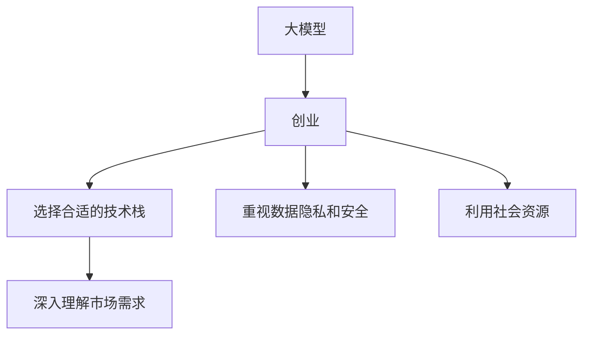

                 

# AI 大模型创业：如何利用社会优势？

在人工智能（AI）快速发展的今天，大模型创业已经成为行业内的一个热点话题。本文将探讨如何利用社会优势来推动大模型创业的成功，这不仅包括技术层面的创新，还包括对社会责任、伦理和市场需求的深入理解。我们将从背景介绍、核心概念与联系、核心算法原理与具体操作步骤、数学模型与公式、项目实践、实际应用场景、工具与资源推荐、总结与展望、常见问题与解答等多个方面进行详细探讨。

## 1. 背景介绍

### 1.1 问题由来

近年来，随着深度学习和大规模语言模型的发展，许多创业公司涌现出来，致力于利用这些技术解决实际问题，推动社会进步。然而，大模型创业也面临着诸多挑战，包括技术瓶颈、市场接受度、伦理问题等。本文将重点探讨如何通过利用社会优势，克服这些挑战，实现大模型的成功创业。

### 1.2 问题核心关键点

大模型创业的核心关键点在于：
- 选择合适的技术栈和算法模型。
- 深入理解市场需求，满足用户痛点。
- 重视数据隐私和安全，符合伦理规范。
- 利用社会资源，构建合作生态。

这些关键点将帮助创业公司在激烈的市场竞争中脱颖而出，实现商业成功。

## 2. 核心概念与联系

### 2.1 核心概念概述

为了更好地理解大模型创业的成功要素，本节将介绍几个关键概念：

- 大模型（Large Models）：指大规模预训练的神经网络模型，如BERT、GPT等，通过在大量无标签数据上进行预训练，具备强大的语言理解和生成能力。
- 创业（Entrepreneurship）：指创立新企业的过程，包括产品开发、市场推广、团队管理等多个环节。
- 社会优势（Social Advantage）：指创业公司利用社会资源和优势，如政府政策、学术支持、用户社群等，来推动企业发展的策略。

这些概念之间的逻辑关系可以通过以下Mermaid流程图来展示：



这个流程图展示了大模型创业的主要流程和关键点。

## 3. 核心算法原理 & 具体操作步骤

### 3.1 算法原理概述

大模型创业的核心在于选择合适的算法模型，并通过精细的微调和训练，使得模型能够在特定任务上取得优异表现。这一过程包括数据准备、模型选择、训练、验证、测试等多个步骤。

### 3.2 算法步骤详解

1. **数据准备**：收集和预处理数据，确保数据质量。
2. **模型选择**：选择合适的大模型作为初始化参数，如BERT、GPT等。
3. **模型微调**：通过有监督的学习方法，对模型进行微调，使其适应特定任务。
4. **性能测试**：在验证集上评估模型性能，并根据测试结果进行优化。
5. **部署和应用**：将训练好的模型部署到实际应用中，满足用户需求。

### 3.3 算法优缺点

优点：
- 快速迭代。大模型可以通过少量数据进行微调，快速适应新任务。
- 效果显著。微调后的模型能够在特定任务上取得比从头训练更好的效果。
- 易于部署。大模型通常是模块化的，易于集成到现有系统中。

缺点：
- 对标注数据依赖高。微调需要高质量的标注数据，数据获取成本高。
- 模型鲁棒性不足。大模型容易过拟合，泛化能力有限。
- 计算资源需求大。大规模模型的训练和推理需要高性能的硬件支持。

### 3.4 算法应用领域

大模型微调技术广泛应用于自然语言处理（NLP）、计算机视觉（CV）、语音识别（ASR）等多个领域。例如：

- 自然语言处理：情感分析、文本分类、机器翻译等。
- 计算机视觉：图像分类、目标检测、图像生成等。
- 语音识别：语音识别、语音合成、语音情感分析等。

## 4. 数学模型和公式 & 详细讲解 & 举例说明

### 4.1 数学模型构建

大模型微调的核心是选择合适的损失函数和优化算法。以情感分析任务为例，可以使用交叉熵损失函数，并通过梯度下降法进行优化。

$$
\mathcal{L}(y,\hat{y}) = -\frac{1}{N}\sum_{i=1}^N \sum_{j=1}^C y_{i,j} \log \hat{y}_{i,j}
$$

其中 $y$ 是真实标签，$\hat{y}$ 是模型预测的概率分布。

### 4.2 公式推导过程

以情感分析为例，公式推导过程如下：

1. 定义交叉熵损失函数：
   $$
   \mathcal{L}(y,\hat{y}) = -\frac{1}{N}\sum_{i=1}^N \sum_{j=1}^C y_{i,j} \log \hat{y}_{i,j}
   $$
   
2. 使用梯度下降法进行优化：
   $$
   \theta \leftarrow \theta - \eta \nabla_{\theta}\mathcal{L}(\theta)
   $$

### 4.3 案例分析与讲解

以BERT模型为例，BERT微调的流程如下：

1. 数据准备：收集情感分析数据集，并进行预处理。
2. 模型选择：选择BERT作为初始化参数。
3. 模型微调：在微调过程中，使用交叉熵损失函数进行优化。
4. 性能测试：在验证集上评估模型性能。
5. 部署和应用：将训练好的模型部署到实际应用中。

## 5. 项目实践：代码实例和详细解释说明

### 5.1 开发环境搭建

1. 安装Python环境：确保Python 3.8及以上版本。
2. 安装TensorFlow和Keras：
   ```bash
   pip install tensorflow==2.4.0
   pip install keras
   ```
3. 安装BERT预训练模型：
   ```bash
   pip install transformers
   ```

### 5.2 源代码详细实现

以下是一个基于BERT的情感分析微调代码示例：

```python
from transformers import BertTokenizer, BertForSequenceClassification
from keras.preprocessing import sequence
from keras.models import Sequential
from keras.layers import Dense, Dropout, Embedding, LSTM, Bidirectional

# 数据准备
tokenizer = BertTokenizer.from_pretrained('bert-base-uncased')
max_len = 100
data = []
for line in open('train.txt', 'r', encoding='utf-8'):
    text = tokenizer.tokenize(line)
    if len(text) > max_len:
        text = text[:max_len]
    else:
        text = text + ['[PAD]'] * (max_len - len(text))
    data.append(tokenizer.encode(text))

# 构建模型
model = Sequential()
model.add(Embedding(input_dim=len(tokenizer.vocab), output_dim=128, input_length=max_len))
model.add(Bidirectional(LSTM(64)))
model.add(Dense(1, activation='sigmoid'))
model.compile(loss='binary_crossentropy', optimizer='adam', metrics=['accuracy'])
model.summary()

# 微调模型
model.fit(data, labels, epochs=3, batch_size=32)

# 性能测试
test_data = []
for line in open('test.txt', 'r', encoding='utf-8'):
    text = tokenizer.tokenize(line)
    if len(text) > max_len:
        text = text[:max_len]
    else:
        text = text + ['[PAD]'] * (max_len - len(text))
    test_data.append(tokenizer.encode(text))
test_labels = [1 if 'positive' in line else 0 for line in open('test_labels.txt', 'r', encoding='utf-8')]
model.evaluate(test_data, test_labels)
```

### 5.3 代码解读与分析

1. 数据准备：使用BERT Tokenizer对文本进行分词，并进行填充和截断，确保每个样本长度一致。
2. 构建模型：使用Keras构建一个简单的双向LSTM模型，用于微调。
3. 微调模型：在训练集上进行微调，使用交叉熵损失函数进行优化。
4. 性能测试：在测试集上评估模型性能，使用精度作为评估指标。

## 6. 实际应用场景

### 6.1 智能客服系统

智能客服系统可以利用大模型微调技术，实现自动化回答用户问题。通过收集历史客服对话数据，并对其进行微调，智能客服系统可以理解用户意图，并提供准确的回答。

### 6.2 金融舆情监测

金融舆情监测系统可以利用大模型微调技术，实时监测市场舆情。通过收集金融新闻、评论、报告等数据，并对其进行微调，系统可以自动识别市场情绪，预测市场走势，辅助金融决策。

### 6.3 个性化推荐系统

个性化推荐系统可以利用大模型微调技术，根据用户的历史行为和兴趣，推荐相关商品或内容。通过收集用户浏览、点击、评论等数据，并对其进行微调，系统可以准确把握用户兴趣点，提供个性化推荐。

### 6.4 未来应用展望

未来，大模型微调技术将进一步扩展到更多领域，如智慧医疗、智能教育、智慧城市等。利用大模型微调技术，可以构建更加智能化、个性化的应用，提升用户体验，创造更多商业价值。

## 7. 工具和资源推荐

### 7.1 学习资源推荐

1. 《深度学习入门：基于TensorFlow的实践》：该书详细介绍了深度学习的基础知识和大模型微调技术。
2. Coursera《Deep Learning Specialization》：斯坦福大学开设的深度学习课程，系统讲解深度学习理论和大模型微调方法。
3. GitHub开源项目：利用GitHub的代码库，可以参考大模型微调相关的开源项目，学习最新技术。

### 7.2 开发工具推荐

1. TensorFlow：深度学习框架，支持大模型微调。
2. PyTorch：灵活的深度学习框架，适合大模型微调。
3. Keras：高层次的深度学习框架，易于上手。
4. HuggingFace Transformers：提供多种预训练模型和微调工具，方便大模型微调。

### 7.3 相关论文推荐

1. Attention is All You Need：提出Transformer结构，开启大模型微调时代。
2. BERT: Pre-training of Deep Bidirectional Transformers for Language Understanding：提出BERT模型，提高大模型微调效果。
3. Parameter-Efficient Transfer Learning for NLP：提出Adapter等参数高效微调方法，提高微调效率。
4. Prompt-based Learning：引入提示技术，提高大模型微调性能。

## 8. 总结：未来发展趋势与挑战

### 8.1 总结

本文对大模型创业中的社会优势利用进行了深入探讨。通过选择合适的技术栈和算法模型，深入理解市场需求，重视数据隐私和安全，以及利用社会资源，大模型创业可以克服诸多挑战，实现商业成功。未来，随着大模型技术的不断进步，社会优势的利用将成为推动大模型创业的重要驱动力。

### 8.2 未来发展趋势

1. 技术迭代加速。大模型技术将不断进步，性能提升将带来更多的商业机会。
2. 多模态融合。利用多模态数据，提高大模型的理解能力和泛化能力。
3. 个性化定制。根据用户需求，定制化大模型微调方案，满足不同场景下的需求。
4. 社会化合作。与更多行业和公司合作，共享资源和技术，推动大模型应用落地。

### 8.3 面临的挑战

1. 数据获取难度大。高质量标注数据的获取成本高，难以快速获取。
2. 技术门槛高。大模型微调技术复杂，需要一定的技术积累。
3. 伦理和隐私问题。大模型可能学习到有害信息，需要考虑伦理和隐私问题。
4. 计算资源消耗大。大规模模型的训练和推理需要高性能硬件支持。

### 8.4 研究展望

未来，大模型微调技术将不断拓展应用场景，同时需要更加注重技术创新和伦理合规。利用社会优势，推动大模型创业，将为人类社会带来更多便利和进步。

## 9. 附录：常见问题与解答

**Q1：如何选择合适的预训练模型？**

A: 选择合适的大模型作为初始化参数，需要考虑模型的规模、应用场景和任务类型。例如，BERT适用于文本分类和情感分析，GPT适用于文本生成和对话系统。

**Q2：如何缓解大模型的计算资源消耗？**

A: 可以通过模型裁剪、量化加速、分布式训练等技术手段，优化大模型计算资源消耗。例如，使用TensorFlow Serving部署大模型，可以实现低延迟的推理服务。

**Q3：如何确保大模型的伦理合规？**

A: 在大模型训练和应用过程中，需要重视数据隐私和安全，避免有害信息学习。同时，制定和遵循伦理规范，确保大模型的公平性和透明性。

通过深入理解大模型创业的社会优势，可以更好地利用资源和技术，推动AI技术在各领域的应用，实现商业成功。未来，大模型微调技术将继续发展，为社会带来更多变革性的影响。

