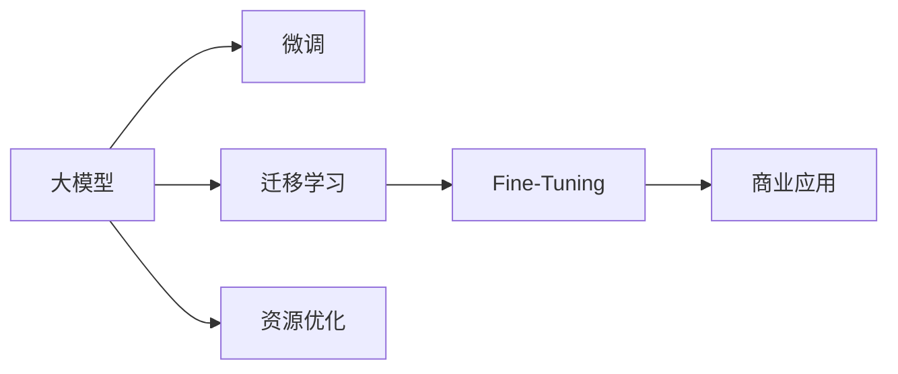

                 

# AI 大模型创业：如何利用资源优势？

## 1. 背景介绍

### 1.1 问题由来

随着人工智能（AI）技术的飞速发展，特别是大模型的兴起，越来越多的创业者和企业投入到AI大模型领域的探索和应用中。大模型，如GPT-3、BERT、DALL·E等，由于其强大的语言生成、图像生成、语音识别等能力，在自然语言处理（NLP）、计算机视觉（CV）、自然语言理解（NLU）等领域取得了显著的进展。

然而，利用大模型进行创业并非易事。一方面，大模型需要大量的计算资源、数据资源和人力资源来训练和优化；另一方面，如何将这些大模型应用到实际商业场景中，创造出可行的商业模式，也是一个大难题。本文将探讨如何利用AI大模型的资源优势，进行商业化应用和创业。

### 1.2 问题核心关键点

在大模型创业的过程中，关键点包括：
1. 如何选择适合的大模型，进行高效的微调。
2. 如何构建数据集，采集、标注和管理数据。
3. 如何优化模型训练，提升模型的性能和效率。
4. 如何设计商业模式，实现商业化应用。

本文将围绕这些关键点，详细介绍大模型创业的策略和方法。

## 2. 核心概念与联系

### 2.1 核心概念概述

为了更好地理解大模型创业，我们先介绍一些核心概念：

- **大模型**：指使用深度学习技术，通过大规模数据训练得到的通用模型，如GPT-3、BERT等。大模型通常具有超强的泛化能力和表达能力，可以在多个领域中应用。
- **微调（Fine-Tuning）**：指在大模型的基础上，针对特定任务进行微调，使其适应该任务的特性。微调是提高大模型应用效果的重要手段。
- **迁移学习（Transfer Learning）**：指将一个领域学到的知识，迁移到另一个相关领域的学习过程。大模型通过迁移学习，可以快速适应新任务。
- **资源优化**：指通过算法、硬件、数据等手段，优化大模型的训练和应用过程，提高效率和效果。

这些概念之间的联系可以用下面的Mermaid流程图表示：



这个流程图展示了大模型创业的基本流程：先利用大模型进行微调和迁移学习，再通过资源优化提升模型性能，最后应用到商业场景中。

## 3. 核心算法原理 & 具体操作步骤
### 3.1 算法原理概述

在大模型创业中，核心算法包括：
1. 微调算法：在大模型基础上，针对特定任务进行微调，使其适应该任务。
2. 迁移学习算法：将一个领域学到的知识，迁移到另一个领域。
3. 资源优化算法：通过算法、硬件等手段，优化大模型的训练和应用过程。

这些算法共同构成大模型创业的技术基础。

### 3.2 算法步骤详解

下面详细介绍大模型创业的详细步骤：

#### 3.2.1 选择适合的大模型

选择适合的大模型是创业的第一步。根据应用领域和任务特点，选择合适的大模型。常见的选择包括：
- 对于NLP任务，选择GPT-3、BERT等大模型。
- 对于CV任务，选择DALL·E、DETR等大模型。
- 对于多模态任务，选择Mugatel等大模型。

#### 3.2.2 构建数据集

数据集是训练和优化大模型的基础。构建数据集的步骤包括：
1. 数据采集：从多个渠道采集数据，如公开数据集、互联网爬取等。
2. 数据清洗：对数据进行去重、去噪、标注等处理，确保数据质量。
3. 数据划分：将数据划分为训练集、验证集和测试集，进行模型评估和优化。

#### 3.2.3 优化模型训练

优化模型训练的步骤包括：
1. 选择合适的超参数，如学习率、批大小、迭代轮数等。
2. 采用正则化技术，如L2正则、Dropout等，避免过拟合。
3. 使用GPU、TPU等高性能硬件，加速模型训练。
4. 采用模型并行、梯度积累等技术，提高模型训练效率。

#### 3.2.4 设计商业模式

设计商业模式的策略包括：
1. SaaS模式：提供API接口，让用户通过调用API获取服务。
2. 订阅模式：用户按月或按年订阅服务，获得持续的收益。
3. 授权模式：将技术授权给其他企业，收取授权费用。
4. 开源模式：开放技术开源，通过社区支持和合作获得收益。

### 3.3 算法优缺点

大模型创业的算法具有以下优点：
1. 高效性：利用大模型的通用能力，可以快速适应新任务。
2. 灵活性：大模型可以通过微调、迁移学习等方式，灵活应用于多个领域。
3. 可扩展性：大模型可以通过云计算、分布式训练等技术，实现大规模扩展。

同时，这些算法也存在一些缺点：
1. 数据依赖性：大模型需要大量高质量的数据进行训练和优化，数据获取和标注成本高。
2. 计算资源消耗大：大模型训练和优化需要高性能硬件，计算资源消耗大。
3. 隐私问题：大规模数据训练和应用可能涉及隐私问题，需要谨慎处理。

### 3.4 算法应用领域

大模型创业在多个领域都有广泛应用：

- **NLP领域**：智能客服、智能问答、文本生成等。
- **CV领域**：图像分类、目标检测、图像生成等。
- **多模态领域**：跨模态匹配、多模态问答等。

## 4. 数学模型和公式 & 详细讲解 & 举例说明

### 4.1 数学模型构建

大模型创业中，常见的数学模型包括：
1. 监督学习模型：通过标注数据训练，模型可以学习到任务特定的表示。
2. 无监督学习模型：通过未标注数据训练，模型可以学习到通用的表示。
3. 强化学习模型：通过与环境交互，模型可以学习到最优策略。

### 4.2 公式推导过程

以监督学习模型为例，推导过程如下：

$$
L(\theta) = \frac{1}{N} \sum_{i=1}^N \ell(y_i, M_{\theta}(x_i))
$$

其中，$L(\theta)$ 为损失函数，$y_i$ 为标注数据，$x_i$ 为输入数据，$M_{\theta}(x_i)$ 为模型预测结果，$\ell$ 为损失函数，如交叉熵损失、均方误差损失等。

### 4.3 案例分析与讲解

以图像分类为例，利用大模型进行创业的步骤如下：
1. 收集图像数据，并进行标注。
2. 选择DALL·E等大模型，进行迁移学习。
3. 对大模型进行微调，适应分类任务。
4. 设计商业模式，如SaaS模式，提供API接口。

## 5. 项目实践：代码实例和详细解释说明

### 5.1 开发环境搭建

大模型创业需要搭建高性能的开发环境。以下是一个典型的开发环境配置：
1. 安装Anaconda：
```bash
conda create -n ai-env python=3.8
conda activate ai-env
```

2. 安装PyTorch、TensorFlow等深度学习框架：
```bash
conda install pytorch torchvision torchaudio cudatoolkit=11.1 -c pytorch -c conda-forge
conda install tensorflow==2.6
```

3. 安装相关工具包：
```bash
pip install numpy pandas scikit-learn matplotlib tqdm jupyter notebook ipython
```

4. 安装GPU、TPU等硬件资源：
```bash
conda install nvidia-cuda-cudnn-cu110
conda install pytorch-cu110-cudnn8_1
```

### 5.2 源代码详细实现

以图像分类任务为例，使用DALL·E进行创业的代码实现如下：

```python
import torch
import torch.nn as nn
import torchvision.transforms as transforms
from transformers import DALL_E

# 定义模型结构
class Classifier(nn.Module):
    def __init__(self, num_classes):
        super(Classifier, self).__init__()
        self.fc = nn.Linear(768, num_classes)

    def forward(self, x):
        x = self.fc(x)
        return x

# 加载大模型
model = DALL_E.from_pretrained('dall-e-large')

# 微调模型
model.fc = Classifier(num_classes=10)
optimizer = torch.optim.Adam(model.parameters(), lr=1e-4)

# 定义训练和评估函数
def train_epoch(model, data_loader, optimizer):
    model.train()
    losses = []
    for inputs, labels in data_loader:
        optimizer.zero_grad()
        outputs = model(inputs)
        loss = nn.CrossEntropyLoss()(outputs, labels)
        loss.backward()
        optimizer.step()
        losses.append(loss.item())
    return sum(losses) / len(data_loader)

def evaluate(model, data_loader):
    model.eval()
    losses = []
    correct = 0
    with torch.no_grad():
        for inputs, labels in data_loader:
            outputs = model(inputs)
            loss = nn.CrossEntropyLoss()(outputs, labels)
            losses.append(loss.item())
            _, predicted = torch.max(outputs.data, 1)
            correct += (predicted == labels).sum().item()
    acc = correct / len(data_loader.dataset)
    return sum(losses) / len(data_loader), acc

# 训练模型
num_epochs = 10
batch_size = 16
train_loader = DataLoader(train_data, batch_size=batch_size, shuffle=True)
valid_loader = DataLoader(valid_data, batch_size=batch_size, shuffle=False)

for epoch in range(num_epochs):
    train_loss = train_epoch(model, train_loader, optimizer)
    valid_loss, acc = evaluate(model, valid_loader)
    print(f'Epoch {epoch+1}, train loss: {train_loss:.4f}, valid acc: {acc:.4f}')

print(f'Test acc: {evaluate(model, test_loader)[1]:.4f}')
```

### 5.3 代码解读与分析

**Classifier类**：
- `__init__`方法：定义模型结构，包括一个全连接层。
- `forward`方法：定义前向传播过程，将输入数据传入全连接层。

**train_epoch函数**：
- 定义训练过程，包括前向传播、反向传播和参数更新。

**evaluate函数**：
- 定义评估过程，包括前向传播和准确率计算。

**训练流程**：
- 定义总的epoch数和batch size，开始循环迭代。
- 每个epoch内，先在训练集上训练，输出平均loss和acc。
- 在验证集上评估，输出平均loss和acc。
- 所有epoch结束后，在测试集上评估，给出最终测试结果。

## 6. 实际应用场景

### 6.4 未来应用展望

大模型创业在多个领域都有广泛应用：

- **NLP领域**：智能客服、智能问答、文本生成等。
- **CV领域**：图像分类、目标检测、图像生成等。
- **多模态领域**：跨模态匹配、多模态问答等。

## 7. 工具和资源推荐

### 7.1 学习资源推荐

为了帮助开发者系统掌握大模型创业的理论基础和实践技巧，这里推荐一些优质的学习资源：

1. **《Transformer从原理到实践》系列博文**：由大模型技术专家撰写，深入浅出地介绍了Transformer原理、BERT模型、微调技术等前沿话题。
2. **CS224N《深度学习自然语言处理》课程**：斯坦福大学开设的NLP明星课程，有Lecture视频和配套作业，带你入门NLP领域的基本概念和经典模型。
3. **《Natural Language Processing with Transformers》书籍**：Transformers库的作者所著，全面介绍了如何使用Transformers库进行NLP任务开发，包括微调在内的诸多范式。
4. **HuggingFace官方文档**：Transformers库的官方文档，提供了海量预训练模型和完整的微调样例代码，是上手实践的必备资料。
5. **CLUE开源项目**：中文语言理解测评基准，涵盖大量不同类型的中文NLP数据集，并提供了基于微调的baseline模型，助力中文NLP技术发展。

通过对这些资源的学习实践，相信你一定能够快速掌握大模型创业的精髓，并用于解决实际的NLP问题。

### 7.2 开发工具推荐

高效的开发离不开优秀的工具支持。以下是几款用于大模型微调开发的常用工具：

1. **PyTorch**：基于Python的开源深度学习框架，灵活动态的计算图，适合快速迭代研究。大部分预训练语言模型都有PyTorch版本的实现。
2. **TensorFlow**：由Google主导开发的开源深度学习框架，生产部署方便，适合大规模工程应用。同样有丰富的预训练语言模型资源。
3. **Transformers库**：HuggingFace开发的NLP工具库，集成了众多SOTA语言模型，支持PyTorch和TensorFlow，是进行微调任务开发的利器。
4. **Weights & Biases**：模型训练的实验跟踪工具，可以记录和可视化模型训练过程中的各项指标，方便对比和调优。与主流深度学习框架无缝集成。
5. **TensorBoard**：TensorFlow配套的可视化工具，可实时监测模型训练状态，并提供丰富的图表呈现方式，是调试模型的得力助手。
6. **Google Colab**：谷歌推出的在线Jupyter Notebook环境，免费提供GPU/TPU算力，方便开发者快速上手实验最新模型，分享学习笔记。

合理利用这些工具，可以显著提升大模型微调任务的开发效率，加快创新迭代的步伐。

### 7.3 相关论文推荐

大模型和微调技术的发展源于学界的持续研究。以下是几篇奠基性的相关论文，推荐阅读：

1. **Attention is All You Need**：提出了Transformer结构，开启了NLP领域的预训练大模型时代。
2. **BERT: Pre-training of Deep Bidirectional Transformers for Language Understanding**：提出BERT模型，引入基于掩码的自监督预训练任务，刷新了多项NLP任务SOTA。
3. **Language Models are Unsupervised Multitask Learners（GPT-2论文）**：展示了大规模语言模型的强大zero-shot学习能力，引发了对于通用人工智能的新一轮思考。
4. **Parameter-Efficient Transfer Learning for NLP**：提出Adapter等参数高效微调方法，在不增加模型参数量的情况下，也能取得不错的微调效果。
5. **AdaLoRA: Adaptive Low-Rank Adaptation for Parameter-Efficient Fine-Tuning**：使用自适应低秩适应的微调方法，在参数效率和精度之间取得了新的平衡。

这些论文代表了大模型微调技术的发展脉络。通过学习这些前沿成果，可以帮助研究者把握学科前进方向，激发更多的创新灵感。

## 8. 总结：未来发展趋势与挑战

### 8.1 总结

本文对大模型创业进行了全面系统的介绍。首先阐述了大模型创业的研究背景和意义，明确了大模型微调在拓展预训练模型应用、提升下游任务性能方面的独特价值。其次，从原理到实践，详细讲解了大模型创业的数学原理和关键步骤，给出了大模型微调任务开发的完整代码实例。同时，本文还广泛探讨了大模型微调方法在智能客服、金融舆情、个性化推荐等多个行业领域的应用前景，展示了大模型微调范式的巨大潜力。此外，本文精选了大模型微调技术的各类学习资源，力求为读者提供全方位的技术指引。

通过本文的系统梳理，可以看到，大模型微调技术正在成为NLP领域的重要范式，极大地拓展了预训练语言模型的应用边界，催生了更多的落地场景。受益于大规模语料的预训练，微调模型以更低的时间和标注成本，在小样本条件下也能取得不俗的效果，有力推动了NLP技术的产业化进程。未来，伴随预训练语言模型和微调方法的持续演进，相信NLP技术将在更广阔的应用领域大放异彩，深刻影响人类的生产生活方式。

### 8.2 未来发展趋势

展望未来，大模型微调技术将呈现以下几个发展趋势：

1. **模型规模持续增大**：随着算力成本的下降和数据规模的扩张，预训练语言模型的参数量还将持续增长。超大规模语言模型蕴含的丰富语言知识，有望支撑更加复杂多变的下游任务微调。
2. **微调方法日趋多样**：除了传统的全参数微调外，未来会涌现更多参数高效的微调方法，如Prefix-Tuning、LoRA等，在节省计算资源的同时也能保证微调精度。
3. **持续学习成为常态**：随着数据分布的不断变化，微调模型也需要持续学习新知识以保持性能。如何在不遗忘原有知识的同时，高效吸收新样本信息，将成为重要的研究课题。
4. **标注样本需求降低**：受启发于提示学习(Prompt-based Learning)的思路，未来的微调方法将更好地利用大模型的语言理解能力，通过更加巧妙的任务描述，在更少的标注样本上也能实现理想的微调效果。
5. **多模态微调崛起**：当前的微调主要聚焦于纯文本数据，未来会进一步拓展到图像、视频、语音等多模态数据微调。多模态信息的融合，将显著提升语言模型对现实世界的理解和建模能力。
6. **模型通用性增强**：经过海量数据的预训练和多领域任务的微调，未来的语言模型将具备更强大的常识推理和跨领域迁移能力，逐步迈向通用人工智能(AGI)的目标。

以上趋势凸显了大模型微调技术的广阔前景。这些方向的探索发展，必将进一步提升NLP系统的性能和应用范围，为人类认知智能的进化带来深远影响。

### 8.3 面临的挑战

尽管大模型微调技术已经取得了瞩目成就，但在迈向更加智能化、普适化应用的过程中，它仍面临着诸多挑战：

1. **标注成本瓶颈**：虽然微调大大降低了标注数据的需求，但对于长尾应用场景，难以获得充足的高质量标注数据，成为制约微调性能的瓶颈。如何进一步降低微调对标注样本的依赖，将是一大难题。
2. **模型鲁棒性不足**：当前微调模型面对域外数据时，泛化性能往往大打折扣。对于测试样本的微小扰动，微调模型的预测也容易发生波动。如何提高微调模型的鲁棒性，避免灾难性遗忘，还需要更多理论和实践的积累。
3. **推理效率有待提高**：大规模语言模型虽然精度高，但在实际部署时往往面临推理速度慢、内存占用大等效率问题。如何在保证性能的同时，简化模型结构，提升推理速度，优化资源占用，将是重要的优化方向。
4. **可解释性亟需加强**：当前微调模型更像是"黑盒"系统，难以解释其内部工作机制和决策逻辑。对于医疗、金融等高风险应用，算法的可解释性和可审计性尤为重要。如何赋予微调模型更强的可解释性，将是亟待攻克的难题。
5. **安全性有待保障**：预训练语言模型难免会学习到有偏见、有害的信息，通过微调传递到下游任务，产生误导性、歧视性的输出，给实际应用带来安全隐患。如何从数据和算法层面消除模型偏见，避免恶意用途，确保输出的安全性，也将是重要的研究课题。
6. **知识整合能力不足**：现有的微调模型往往局限于任务内数据，难以灵活吸收和运用更广泛的先验知识。如何让微调过程更好地与外部知识库、规则库等专家知识结合，形成更加全面、准确的信息整合能力，还有很大的想象空间。

正视微调面临的这些挑战，积极应对并寻求突破，将是大模型微调走向成熟的必由之路。相信随着学界和产业界的共同努力，这些挑战终将一一被克服，大模型微调必将在构建人机协同的智能时代中扮演越来越重要的角色。

### 8.4 研究展望

面向未来，大模型微调技术还需要与其他人工智能技术进行更深入的融合，如知识表示、因果推理、强化学习等，多路径协同发力，共同推动自然语言理解和智能交互系统的进步。只有勇于创新、敢于突破，才能不断拓展语言模型的边界，让智能技术更好地造福人类社会。

## 9. 附录：常见问题与解答

**Q1：大模型微调是否适用于所有NLP任务？**

A: 大模型微调在大多数NLP任务上都能取得不错的效果，特别是对于数据量较小的任务。但对于一些特定领域的任务，如医学、法律等，仅仅依靠通用语料预训练的模型可能难以很好地适应。此时需要在特定领域语料上进一步预训练，再进行微调，才能获得理想效果。此外，对于一些需要时效性、个性化很强的任务，如对话、推荐等，微调方法也需要针对性的改进优化。

**Q2：如何选择合适的学习率？**

A: 微调的学习率一般要比预训练时小1-2个数量级，如果使用过大的学习率，容易破坏预训练权重，导致过拟合。一般建议从1e-5开始调参，逐步减小学习率，直至收敛。也可以使用warmup策略，在开始阶段使用较小的学习率，再逐渐过渡到预设值。需要注意的是，不同的优化器(如AdamW、Adafactor等)以及不同的学习率调度策略，可能需要设置不同的学习率阈值。

**Q3：采用大模型微调时会面临哪些资源瓶颈？**

A: 目前主流的预训练大模型动辄以亿计的参数规模，对算力、内存、存储都提出了很高的要求。GPU/TPU等高性能设备是必不可少的，但即便如此，超大批次的训练和推理也可能遇到显存不足的问题。因此需要采用一些资源优化技术，如梯度积累、混合精度训练、模型并行等，来突破硬件瓶颈。同时，模型的存储和读取也可能占用大量时间和空间，需要采用模型压缩、稀疏化存储等方法进行优化。

**Q4：如何缓解微调过程中的过拟合问题？**

A: 过拟合是微调面临的主要挑战，尤其是在标注数据不足的情况下。常见的缓解策略包括：
1. 数据增强：通过回译、近义替换等方式扩充训练集
2. 正则化：使用L2正则、Dropout等避免过拟合
3. 对抗训练：引入对抗样本，提高模型鲁棒性
4. 参数高效微调：只调整少量参数(如Adapter、Prefix等)，减小过拟合风险
5. 多模型集成：训练多个微调模型，取平均输出，抑制过拟合

这些策略往往需要根据具体任务和数据特点进行灵活组合。只有在数据、模型、训练、推理等各环节进行全面优化，才能最大限度地发挥大模型微调的威力。

**Q5：微调模型在落地部署时需要注意哪些问题？**

A: 将微调模型转化为实际商业场景中，还需要考虑以下因素：
1. 模型裁剪：去除不必要的层和参数，减小模型尺寸，加快推理速度
2. 量化加速：将浮点模型转为定点模型，压缩存储空间，提高计算效率
3. 服务化封装：将模型封装为标准化服务接口，便于集成调用
4. 弹性伸缩：根据请求流量动态调整资源配置，平衡服务质量和成本
5. 监控告警：实时采集系统指标，设置异常告警阈值，确保服务稳定性
6. 安全防护：采用访问鉴权、数据脱敏等措施，保障数据和模型安全

大模型微调为NLP应用开启了广阔的想象空间，但如何将强大的性能转化为稳定、高效、安全的业务价值，还需要工程实践的不断打磨。唯有从数据、算法、工程、业务等多个维度协同发力，才能真正实现人工智能技术在垂直行业的规模化落地。总之，微调需要开发者根据具体任务，不断迭代和优化模型、数据和算法，方能得到理想的效果。

---

作者：禅与计算机程序设计艺术 / Zen and the Art of Computer Programming

