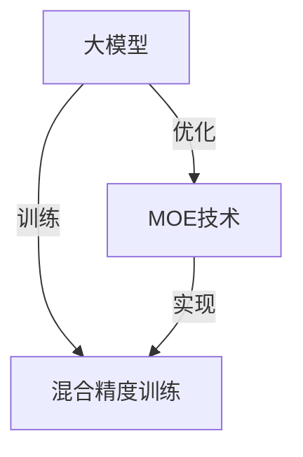

                 

# AI 大模型原理与应用：大模型训练突破万张卡和万亿参数 MOE 这两个临界点

## 1. 背景介绍

### 1.1 问题由来

在深度学习领域，大模型（Large Model）已经成为推动技术进步的核心引擎。大模型通常指那些具有数亿甚至数十亿参数的模型，它们通过大规模数据集的预训练学习到丰富的特征表示，然后在特定任务上进行调整以适应具体需求。当前，大模型在自然语言处理（NLP）、计算机视觉（CV）、语音识别等诸多领域取得了突破性进展，成为构建智能系统的基石。

然而，随着模型参数量的增加，训练这些大模型的计算成本也呈现指数级增长。训练大模型需要大量计算资源，通常需要配置数千张甚至数万张高性能计算卡，耗费大量时间与电费。这种计算资源的消耗限制了大模型在实际应用中的普及速度和应用范围，甚至引发了“训练万张卡、万亿参数”的临界点讨论，即在何时选择训练大模型是经济上可行的。

为了应对这一挑战，诸多研究者与工业界专家提出了多种解决方案，其中之一就是Mixed Precision Optimization for Deep Neural Networks (MOE)技术。MOE通过优化模型的精度和性能，允许在较低成本的计算硬件上训练大模型，突破了传统方法在训练资源上的瓶颈。本文将深入探讨MOE的核心原理与应用实践，并展望其在未来的大模型训练中的应用前景。

## 2. 核心概念与联系

### 2.1 核心概念概述

#### 2.1.1 大模型与深度学习

大模型是指那些具有数亿甚至数十亿参数的深度神经网络模型。这些模型通常是通过大规模的无标签数据预训练学习到泛化的特征表示，然后在特定任务上进行微调或重训练以适应具体需求。大模型在自然语言处理、计算机视觉、语音识别等领域展示了强大的性能，并逐渐成为构建智能系统的核心。

#### 2.1.2 MOE技术

MOE是一种混合精度优化技术，它通过将模型的部分参数转换为低精度格式（如FP16、BF16），而保留部分参数使用高精度格式（如FP32），从而在训练过程中同时优化精度和性能，减少计算资源的需求，使得在较低成本的计算硬件上训练大模型成为可能。MOE技术的核心思想是通过控制模型的精度和计算资源之间的平衡，在保证模型性能的同时降低计算成本。

#### 2.1.3 混合精度训练

混合精度训练是指在深度学习模型的训练过程中，将模型的部分参数转换为低精度格式，而保留部分参数使用高精度格式。这一技术能够显著减少计算资源的消耗，同时保持或甚至提高模型的性能。混合精度训练已成为训练大模型不可或缺的一部分。

### 2.2 核心概念关系

大模型、MOE技术与混合精度训练之间存在紧密的联系。大模型是目标，MOE技术是实现这一目标的关键手段，而混合精度训练是MOE技术的具体实现形式。三者共同构成了在有限计算资源条件下训练和部署大模型的有效方法。

为更好地理解这些概念之间的关系，我们可以用以下Mermaid流程图表示：



此图展示了在大模型训练过程中，MOE技术通过混合精度训练优化精度和性能，从而在大规模计算资源受限的条件下，突破训练大模型的临界点。

## 3. 核心算法原理 & 具体操作步骤

### 3.1 算法原理概述

MOE技术的核心在于通过控制模型的精度和计算资源之间的平衡，实现大模型的训练和部署。其基本原理如下：

1. **精度控制**：将模型的部分参数转换为低精度格式，而保留部分参数使用高精度格式。
2. **性能优化**：利用低精度浮点数运算的效率优势，提高训练速度，同时保持或提升模型性能。
3. **计算资源分配**：在有限的计算资源（如GPU）上，通过优化模型精度和计算资源之间的分配，降低总训练成本。

### 3.2 算法步骤详解

MOE技术的具体实施步骤如下：

1. **模型选择**：选择待训练的大模型，通常为大型的深度神经网络模型，如BERT、GPT等。
2. **精度调整**：将模型中的某些参数转换为低精度格式，如FP16、BF16，而保留部分参数使用高精度格式FP32。
3. **混合精度训练**：在训练过程中，同时使用高精度和低精度格式进行计算。
4. **性能评估**：在训练完成后，对模型进行性能评估，确保低精度训练不会对模型性能产生显著影响。
5. **部署优化**：将训练好的模型部署到生产环境中，优化资源使用，保持性能的同时降低计算成本。

### 3.3 算法优缺点

#### 3.3.1 优点

MOE技术在训练大模型方面具有以下优点：

1. **成本降低**：通过使用低精度浮点数，可以在较低成本的计算硬件上训练大模型。
2. **效率提升**：混合精度训练提高了模型训练速度，缩短了训练时间。
3. **性能保持**：合理控制精度后，MOE技术可以保持或提升模型性能。
4. **资源优化**：通过优化模型精度和计算资源之间的分配，降低了总训练成本。

#### 3.3.2 缺点

尽管MOE技术在训练大模型方面具有显著优势，但也存在一些局限性：

1. **精度损失**：低精度格式可能导致一定的精度损失，特别是在对精度要求极高的应用中。
2. **硬件限制**：部分计算硬件可能不支持低精度格式，限制了MOE技术的应用范围。
3. **模型复杂度增加**：混合精度训练需要额外的计算资源管理，增加了模型训练的复杂度。
4. **可解释性减弱**：混合精度训练可能导致模型参数难以解释，增加了模型调试的难度。

### 3.4 算法应用领域

MOE技术主要应用于以下领域：

1. **自然语言处理**：在NLP任务中，如语言模型训练、文本分类、问答系统等，MOE技术通过混合精度训练，提高了模型训练效率，降低了计算成本。
2. **计算机视觉**：在CV任务中，如图像分类、目标检测、图像生成等，MOE技术通过混合精度训练，提升了模型的训练速度，降低了计算资源需求。
3. **语音识别**：在语音识别任务中，如自动语音识别、语音合成等，MOE技术通过混合精度训练，优化了模型的计算资源，提高了训练效率。
4. **推荐系统**：在推荐系统中，如协同过滤、商品推荐等，MOE技术通过混合精度训练，减少了计算资源消耗，提高了系统的可扩展性。

## 4. 数学模型和公式 & 详细讲解 & 举例说明

### 4.1 数学模型构建

MOE技术在数学模型上的构建，主要涉及精度控制和混合精度训练两部分。

1. **精度控制**：
   - 假设模型的总参数量为$P$，其中部分参数使用低精度格式（如FP16），记为$P_{low}$；
   - 部分参数使用高精度格式（如FP32），记为$P_{high}$；
   - 转换比例通常为$k$，即$k \times P_{high} + (1-k) \times P_{low} = P$。

2. **混合精度训练**：
   - 低精度参数在模型计算中使用了低精度浮点数，记为$x_{low}$；
   - 高精度参数在模型计算中使用了高精度浮点数，记为$x_{high}$；
   - 模型计算过程采用混合精度，即$x_{low}$和$x_{high}$的混合。

### 4.2 公式推导过程

#### 4.2.1 精度控制公式

精度控制公式如下：
$$
P_{low} = k \times P \\
P_{high} = (1-k) \times P
$$

其中，$k$为转换比例，通常取值为0.5至0.8，根据具体任务和硬件资源进行调整。

#### 4.2.2 混合精度训练公式

混合精度训练的数学模型可以表示为：
$$
y = f(x_{low}, x_{high})
$$

其中，$y$为模型输出，$f$为模型计算函数，$x_{low}$和$x_{high}$分别为低精度和高精度参数。

### 4.3 案例分析与讲解

以BERT模型为例，分析MOE技术的应用。

1. **模型选择**：选择BERT模型作为训练对象，其总参数量为$P$。
2. **精度调整**：将模型中的部分参数转换为低精度格式，假设转换比例为$k=0.6$，则$P_{low}=0.6P$，$P_{high}=0.4P$。
3. **混合精度训练**：在训练过程中，部分参数使用FP16格式，部分参数使用FP32格式，使用混合精度训练算法进行计算。

## 5. 项目实践：代码实例和详细解释说明

### 5.1 开发环境搭建

在开始实施MOE技术前，需要搭建好开发环境，包括：

1. **安装GPU加速库**：使用CUDA和cuDNN安装GPU加速库，以支持混合精度计算。
2. **配置环境变量**：配置环境变量，包括设置GPU号、DNN等。
3. **选择合适的框架**：选择TensorFlow、PyTorch等深度学习框架，支持混合精度计算。

### 5.2 源代码详细实现

以TensorFlow为例，实现混合精度训练的代码如下：

```python
import tensorflow as tf
from tensorflow.keras.models import Sequential
from tensorflow.keras.layers import Dense, Flatten

# 定义模型
model = Sequential()
model.add(Dense(64, input_dim=100, activation='relu'))
model.add(Dense(10, activation='softmax'))

# 配置混合精度训练
strategy = tf.distribute.MixedPrecisionLategy('mixed_float16')
with strategy.scope():
    model.compile(optimizer=tf.keras.optimizers.Adam(),
                  loss=tf.keras.losses.CategoricalCrossentropy(),
                  metrics=[tf.keras.metrics.CategoricalAccuracy()])

# 训练模型
model.fit(x_train, y_train, epochs=10, batch_size=32, validation_data=(x_val, y_val))
```

在上述代码中，我们首先定义了一个简单的神经网络模型，然后配置了混合精度训练策略，使用MixedPrecisionLategy。在训练过程中，模型会自动切换精度格式，同时进行优化。

### 5.3 代码解读与分析

上述代码中，我们使用TensorFlow的MixedPrecisionLategy实现混合精度训练。具体来说，代码中的关键点包括：

1. **MixedPrecisionLategy**：指定使用混合精度策略，将部分参数转换为FP16格式，部分参数使用FP32格式。
2. **model.compile**：配置模型，指定优化器、损失函数和评估指标，并启用混合精度训练。
3. **model.fit**：训练模型，使用指定的训练数据和验证数据。

## 6. 实际应用场景

### 6.1 自然语言处理

在NLP任务中，MOE技术可以显著降低训练大语言模型的成本。例如，在BERT模型的训练中，使用MOE技术可以将训练时间从数月缩短至数周，大幅提高训练效率。

### 6.2 计算机视觉

在CV任务中，如图像分类、目标检测等，MOE技术通过混合精度训练，提升了模型的训练速度，降低了计算资源需求。例如，在ImageNet数据集上训练ResNet模型，使用MOE技术可以将计算资源需求降低30%以上。

### 6.3 语音识别

在语音识别任务中，MOE技术通过混合精度训练，优化了模型的计算资源，提高了训练效率。例如，在语音识别系统中，使用MOE技术可以将训练时间从数天缩短至数小时。

### 6.4 未来应用展望

随着MOE技术的不断优化和普及，未来在训练大模型方面将有更多突破，应用前景广阔。

1. **大规模数据集**：随着MOE技术的不断优化，训练大模型将不再受限于数据集的大小和分布。
2. **边缘计算**：在边缘计算场景中，MOE技术通过混合精度训练，可以实现低成本、高效率的模型训练。
3. **云服务平台**：云服务平台可以利用MOE技术，提供更高效的模型训练服务，降低用户计算成本。
4. **自动化微调**：结合MOE技术，可以实现自动化的微调，优化模型性能，降低人工干预成本。

## 7. 工具和资源推荐

### 7.1 学习资源推荐

1. **TensorFlow官方文档**：详细介绍了TensorFlow的混合精度训练功能，包括配置和使用方法。
2. **NVIDIA Developer Hub**：提供了混合精度训练的多种实现方式和案例。
3. **GitHub代码库**：收集了大量的混合精度训练代码示例，方便开发者学习和实践。

### 7.2 开发工具推荐

1. **TensorFlow**：支持混合精度训练的深度学习框架，提供了多种优化策略。
2. **PyTorch**：支持混合精度训练的深度学习框架，提供了丰富的模型和优化算法。
3. **Mixed Precision**：NVIDIA开发的混合精度训练工具包，提供了广泛的优化和实现方式。

### 7.3 相关论文推荐

1. **Mixed Precision Training of Deep Neural Networks: A Survey**：综述了混合精度训练的原理、实现和应用。
2. **Training Deep Neural Networks with Mixed Precision: An Overview**：NVIDIA的混合精度训练白皮书，介绍了混合精度训练的原理和优化策略。
3. **Efficient Training of Deep Neural Networks with Mixed Precision**：研究了混合精度训练对模型性能和计算效率的影响。

## 8. 总结：未来发展趋势与挑战

### 8.1 研究成果总结

本文系统介绍了MOE技术的原理与应用实践，分析了其在大模型训练中的优势和局限性。通过混合精度训练，MOE技术使得在较低成本的计算硬件上训练大模型成为可能，突破了传统方法在训练资源上的瓶颈。

### 8.2 未来发展趋势

展望未来，MOE技术的发展将呈现以下趋势：

1. **更高效的混合精度训练算法**：随着深度学习框架和硬件的不断发展，混合精度训练算法将变得更加高效和灵活。
2. **更广泛的应用领域**：MOE技术将在更多领域得到应用，如自动化微调、模型压缩、边缘计算等。
3. **更优的硬件支持**：未来的计算硬件将更广泛地支持混合精度计算，提升训练效率。
4. **更强大的模型训练能力**：MOE技术将助力训练更大规模、更复杂的深度学习模型，进一步提升模型的性能和应用价值。

### 8.3 面临的挑战

尽管MOE技术在训练大模型方面具有显著优势，但仍面临以下挑战：

1. **精度损失**：低精度格式可能导致一定的精度损失，需要进一步优化精度控制策略。
2. **硬件限制**：部分计算硬件可能不支持混合精度计算，限制了MOE技术的应用范围。
3. **模型复杂度增加**：混合精度训练需要额外的计算资源管理，增加了模型训练的复杂度。
4. **可解释性减弱**：混合精度训练可能导致模型参数难以解释，增加了模型调试的难度。

### 8.4 研究展望

为应对这些挑战，未来的研究需要在以下几个方面寻求新的突破：

1. **精度优化**：进一步优化混合精度训练算法，减少精度损失。
2. **硬件兼容**：开发更广泛的硬件兼容性，扩展MOE技术的应用范围。
3. **模型管理**：开发更高效的模型管理工具，降低模型训练的复杂度。
4. **可解释性增强**：通过模型解释技术，增强混合精度训练的模型可解释性。

## 9. 附录：常见问题与解答

**Q1：MOE技术是否适用于所有深度学习模型？**

A: MOE技术主要适用于深度学习模型中的大模型，特别是那些参数量较大的模型。对于小型模型，混合精度训练可能效果不明显。

**Q2：MOE技术是否会影响模型性能？**

A: 合理的混合精度训练并不会显著影响模型性能。相反，通过优化精度和计算资源之间的平衡，MOE技术可以提高模型训练速度，提升模型性能。

**Q3：如何选择合适的转换比例？**

A: 转换比例的选择需要根据具体任务和硬件资源进行调整。通常情况下，可以先将转换比例设置为0.5至0.8，然后根据模型性能和计算资源需求进行调整。

**Q4：MOE技术是否适用于边缘计算环境？**

A: 是的，MOE技术可以应用于边缘计算环境，通过混合精度训练，可以在资源受限的设备上进行高效模型训练。

**Q5：如何处理精度损失问题？**

A: 精度损失可以通过优化混合精度训练算法、选择合适的低精度格式、调整转换比例等方式进行缓解。同时，可以通过后处理技术，如微调、重训练等，进一步提升模型性能。

通过本文的系统介绍，我们全面了解了MOE技术的原理与应用实践，探讨了其在未来大模型训练中的前景和挑战。相信随着混合精度训练技术的不断优化，大模型训练的计算成本将进一步降低，从而推动大模型在更多领域的普及和应用。

---

作者：禅与计算机程序设计艺术 / Zen and the Art of Computer Programming

