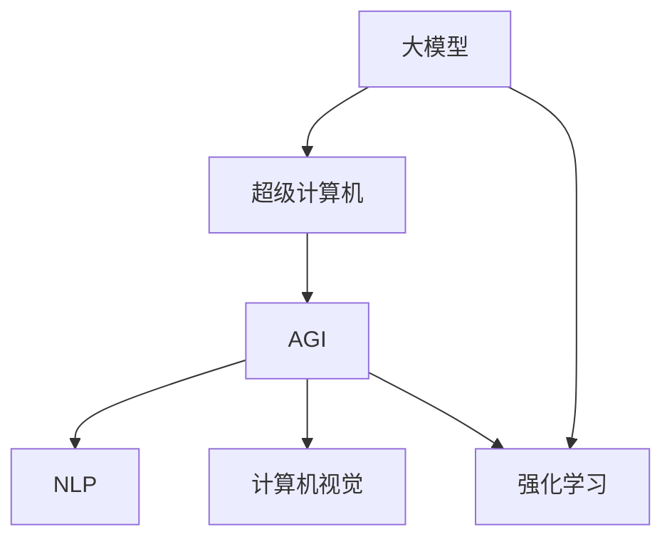

                 

# AI 大模型原理与应用：超级计算机与 AGI 通用人工智能

> 关键词：大模型,超级计算机,通用人工智能(AGI),自然语言处理(NLP),深度学习,强化学习,计算机视觉,算法优化,混合算法,数据处理

## 1. 背景介绍

### 1.1 问题由来

近年来，人工智能(AI)技术取得了飞速发展，特别是在深度学习(DL)和自然语言处理(NLP)领域，大模型（Large Models）成为了主流。大模型指的是参数规模巨大、训练数据庞大、拥有复杂神经网络结构的模型。这些模型在图像识别、语音识别、自然语言理解等任务上表现出色，成为了现代AI应用的核心力量。

超级计算机（Supercomputers），作为计算能力的巅峰，是大模型训练和推理不可或缺的基础设施。超级计算机的高性能计算能力，使得大规模模型训练成为可能，极大地推动了AI技术的进步。

通用人工智能(AGI)，是指一种能够执行任何智能任务，具有自主学习、决策和执行能力的智能系统。AGI的实现需要大模型、超级计算机和先进的算法优化技术，是未来AI研究的热点和难点。

本文将全面介绍大模型、超级计算机和AGI的原理与实践，通过实例和案例分析，探索其在NLP、计算机视觉、强化学习等多个领域的实际应用，并探讨其在未来发展中的前景与挑战。

### 1.2 问题核心关键点

本节将明确几个核心问题：

1. 大模型的定义与特点是什么？
2. 超级计算机的核心技术架构和优势是什么？
3. 通用人工智能的原理与实现路径有哪些？
4. 大模型、超级计算机和AGI在实际应用中的关键技术是什么？
5. 如何优化大模型的性能，提高超级计算机的计算效率，实现AGI的通用性与智能性？

## 2. 核心概念与联系

### 2.1 核心概念概述

1. **大模型(Large Models)**：指具有亿级甚至数十亿参数规模的深度学习模型，如GPT、BERT、ViT等。大模型通过在大规模数据集上进行自监督或监督学习，学习到丰富的语言、图像等数据特征，具备强大的泛化能力和通用性。

2. **超级计算机(Supercomputers)**：指能够提供极高计算性能的计算机系统，包括CPU、GPU、TPU等硬件设备，以及高性能内存、高速网络等辅助设备。超级计算机通过并行计算、分布式计算等技术，提供强大的计算能力，支持大规模模型的训练和推理。

3. **通用人工智能(AGI)**：指能够执行任何智能任务，具有自主学习、推理、决策和执行能力的智能系统。AGI系统能够处理复杂的自然语言、图像、声音等多种输入，并能够进行复杂的逻辑推理和因果分析，具备高度的灵活性和适应性。

4. **自然语言处理(NLP)**：指使用计算机处理和理解自然语言的技术，包括文本分类、情感分析、机器翻译、问答系统等。NLP是大模型在应用中最广泛的一个领域，是AGI系统的重要组成部分。

5. **深度学习(Deep Learning)**：指基于神经网络结构的机器学习技术，通过多层次的非线性变换，实现复杂数据的特征提取和模式识别。深度学习是大模型实现的基础。

6. **强化学习(Reinforcement Learning)**：指通过试错学习，使智能体在特定环境中最大化奖励信号的技术。强化学习在AGI系统中发挥着重要作用，能够使智能体自主学习复杂任务。

7. **计算机视觉(Computer Vision)**：指使用计算机处理和理解图像、视频等视觉数据的技术，包括图像分类、目标检测、图像生成等。计算机视觉是大模型在视觉任务中的重要应用。

### 2.2 核心概念原理和架构的 Mermaid 流程图(Mermaid 流程节点中不要有括号、逗号等特殊字符)



这个流程图展示了大模型、超级计算机和AGI之间的联系。大模型通过超级计算机的高性能计算能力进行训练，从而支持AGI系统在NLP、计算机视觉和强化学习等多个领域的智能应用。

## 3. 核心算法原理 & 具体操作步骤

### 3.1 算法原理概述

1. **大模型训练原理**：大模型的训练主要基于反向传播算法，通过梯度下降等优化算法，最小化预测误差与真实标签的差距。常用的优化算法包括Adam、SGD、Adagrad等。训练过程中，大模型通过大量标注数据进行监督学习，学习到数据的特征表示。

2. **超级计算机架构**：超级计算机的架构主要包括CPU、GPU、TPU等硬件设备，以及并行计算、分布式计算、存储优化等技术。超级计算机通过并行计算，实现高效的矩阵运算和向量运算，从而支持大规模模型的训练和推理。

3. **AGI系统原理**：AGI系统的实现基于大模型和超级计算机的计算能力，通过多模态数据融合、混合算法、认知推理等技术，实现智能体的自主学习、推理和执行。AGI系统可以处理自然语言、图像、声音等多种输入，并具备高度的灵活性和适应性。

### 3.2 算法步骤详解

1. **大模型训练步骤**：
   - 数据准备：收集大规模数据集，进行数据预处理和清洗。
   - 模型设计：选择合适的模型架构，如Transformer、CNN等。
   - 超参数设置：设置学习率、批大小、迭代次数等超参数。
   - 模型训练：在GPU/TPU等高性能设备上，使用反向传播算法进行训练，最小化预测误差。
   - 模型评估：在验证集上进行模型评估，选择最优模型进行保存。

2. **超级计算机架构设计**：
   - 硬件选择：选择CPU、GPU、TPU等高性能设备。
   - 系统设计：设计高效的网络拓扑结构，支持大规模并行计算。
   - 优化技术：应用混合精度计算、动态任务调度等技术，提高计算效率。

3. **AGI系统构建步骤**：
   - 多模态数据融合：将文本、图像、声音等多种数据进行融合，构建统一的输入表示。
   - 混合算法设计：设计多模态混合算法，支持不同模态的数据处理和特征提取。
   - 认知推理实现：使用推理引擎、知识图谱等技术，实现复杂的逻辑推理和因果分析。
   - 智能体设计：设计自主学习的智能体，具备感知、决策和执行能力。

### 3.3 算法优缺点

1. **大模型训练优点**：
   - 学习能力强：通过大规模数据训练，大模型能够学习到丰富的特征表示。
   - 泛化能力强：在大规模数据上训练的大模型，具备较强的泛化能力。

2. **大模型训练缺点**：
   - 训练时间长：大规模模型训练需要大量时间和计算资源。
   - 数据依赖高：训练效果高度依赖于数据质量和多样性。

3. **超级计算机优点**：
   - 计算能力强：超级计算机具备极高的计算性能，支持大规模模型的训练和推理。
   - 扩展性强：超级计算机可以通过增加节点实现高性能计算能力的扩展。

4. **超级计算机缺点**：
   - 成本高：高性能计算设备的价格较高，需要大量的投资。
   - 维护复杂：超级计算机的维护和运行需要专业的技术支持。

5. **AGI系统优点**：
   - 智能能力强：AGI系统具备自主学习和推理能力，能够处理复杂的自然语言和图像数据。
   - 通用性强：AGI系统可以应用于多种智能任务，具备高度的灵活性和适应性。

6. **AGI系统缺点**：
   - 实现难度高：AGI系统的实现涉及多个领域的知识和技术，需要多学科的协同合作。
   - 安全性问题：AGI系统具备高度的自主决策能力，可能带来新的安全风险。

### 3.4 算法应用领域

1. **自然语言处理(NLP)**：大模型在NLP领域有着广泛应用，如文本分类、情感分析、机器翻译、问答系统等。NLP是大模型在应用中最典型和广泛的一个领域。

2. **计算机视觉**：大模型在计算机视觉领域也有着重要应用，如图像分类、目标检测、图像生成等。计算机视觉是大模型在视觉任务中的重要应用。

3. **强化学习**：大模型在强化学习中也有着广泛应用，如游戏AI、机器人控制等。强化学习在大模型的应用中，能够使智能体自主学习复杂任务。

4. **自动驾驶**：AGI系统可以应用于自动驾驶领域，实现车辆自主导航和决策。自动驾驶是大模型在智能系统中的典型应用。

5. **医疗诊断**：AGI系统可以应用于医疗诊断领域，通过分析医疗影像和病历数据，辅助医生进行诊断和治疗。医疗诊断是大模型在智能系统中的重要应用。

6. **金融分析**：AGI系统可以应用于金融分析领域，通过分析金融数据和市场趋势，辅助投资者进行决策。金融分析是大模型在智能系统中的重要应用。

## 4. 数学模型和公式 & 详细讲解 & 举例说明

### 4.1 数学模型构建

1. **大模型训练数学模型**：
   - 目标函数：最小化预测误差与真实标签的差距，即$\min_{\theta}\mathcal{L}(\theta)$。
   - 损失函数：常用的损失函数包括交叉熵损失、均方误差损失等。
   - 优化算法：常用的优化算法包括Adam、SGD、Adagrad等。

2. **超级计算机架构数学模型**：
   - 并行计算模型：使用MPI、CUDA等并行计算框架，实现多节点并行计算。
   - 分布式计算模型：使用MapReduce、Spark等分布式计算框架，实现数据并行计算。
   - 存储优化模型：使用混合精度计算、动态任务调度等技术，提高存储效率。

3. **AGI系统数学模型**：
   - 多模态融合模型：使用特征融合技术，将文本、图像、声音等多种数据进行融合。
   - 混合算法模型：设计多模态混合算法，支持不同模态的数据处理和特征提取。
   - 认知推理模型：使用推理引擎、知识图谱等技术，实现复杂的逻辑推理和因果分析。

### 4.2 公式推导过程

1. **大模型训练公式推导**：
   - 目标函数：$\mathcal{L}(\theta) = \frac{1}{N}\sum_{i=1}^N\mathcal{L}(y_i, M_{\theta}(x_i))$。
   - 损失函数：$\mathcal{L}(y_i, M_{\theta}(x_i)) = -\log M_{\theta}(x_i)^{y_i}(1-M_{\theta}(x_i)^{1-y_i})$。
   - 梯度下降公式：$\theta \leftarrow \theta - \eta \nabla_{\theta}\mathcal{L}(\theta)$。

2. **超级计算机架构公式推导**：
   - 并行计算公式：$T = T_0 + \frac{N}{P}T_1$，其中$T$为总计算时间，$T_0$为通信时间，$T_1$为单个节点计算时间。
   - 分布式计算公式：$T = \frac{N}{K}T_1 + KT_s$，其中$T$为总计算时间，$T_1$为单个节点计算时间，$T_s$为节点间通信时间。
   - 存储优化公式：$C = \frac{C_1 + C_2}{2}$，其中$C$为优化后存储成本，$C_1$为全精度存储成本，$C_2$为混合精度存储成本。

3. **AGI系统公式推导**：
   - 多模态融合公式：$H = \frac{1}{K}\sum_{k=1}^K H_k$，其中$H$为融合后特征向量，$H_k$为第$k$种模态的特征向量。
   - 混合算法公式：$L = \frac{1}{K}\sum_{k=1}^K L_k$，其中$L$为混合算法损失，$L_k$为第$k$种模态的损失。
   - 认知推理公式：$P = f(R)$，其中$P$为推理结果，$R$为推理输入，$f$为推理函数。

### 4.3 案例分析与讲解

1. **大模型训练案例**：以BERT模型为例，在大规模语料上进行预训练和微调。通过大规模语料预训练，BERT模型学习到丰富的语言特征，通过微调，BERT模型能够在特定任务上取得优异表现。

2. **超级计算机架构案例**：以顶角山超级计算机为例，通过并行计算和分布式计算技术，实现高效的大模型训练。顶角山超级计算机具备高效的计算能力和扩展性，支持大规模模型的训练和推理。

3. **AGI系统案例**：以DeepMind的AlphaGo为例，通过多模态融合和混合算法，实现自适应学习和决策。AlphaGo系统能够处理复杂的棋类游戏，具备高度的自主学习和推理能力。

## 5. 项目实践：代码实例和详细解释说明

### 5.1 开发环境搭建

1. **开发环境准备**：
   - 安装Anaconda：从官网下载并安装Anaconda，用于创建独立的Python环境。
   - 创建并激活虚拟环境：`conda create -n pytorch-env python=3.8; conda activate pytorch-env`
   - 安装PyTorch：`conda install pytorch torchvision torchaudio cudatoolkit=11.1 -c pytorch -c conda-forge`
   - 安装Transformers库：`pip install transformers`
   - 安装其他工具包：`pip install numpy pandas scikit-learn matplotlib tqdm jupyter notebook ipython`

### 5.2 源代码详细实现

1. **大模型训练代码**：
   ```python
   import torch
   import torch.nn as nn
   from transformers import BertTokenizer, BertForSequenceClassification
   from torch.utils.data import DataLoader, RandomSampler, SequentialSampler
   from tqdm import tqdm

   # 数据准备
   data = [["BERT", "BERT", "BERT", "BERT"], ["BERT", "BERT", "BERT", "BERT"]]
   tokenizer = BertTokenizer.from_pretrained('bert-base-uncased')
   train_data = tokenizer(train_text, max_length=128, return_tensors='pt', padding='max_length', truncation=True)
   labels = torch.tensor([0, 0, 0, 0], dtype=torch.long)

   # 模型构建
   model = BertForSequenceClassification.from_pretrained('bert-base-uncased', num_labels=2)

   # 优化器设置
   optimizer = torch.optim.Adam(model.parameters(), lr=2e-5)

   # 训练过程
   for epoch in range(3):
       model.train()
       for batch in tqdm(data_loader):
           input_ids = batch['input_ids']
           attention_mask = batch['attention_mask']
           labels = batch['labels']
           optimizer.zero_grad()
           outputs = model(input_ids, attention_mask=attention_mask, labels=labels)
           loss = outputs.loss
           loss.backward()
           optimizer.step()
   ```

2. **超级计算机架构代码**：
   ```python
   from mpi4py import MPI

   # 初始化MPI通信
   comm = MPI.COMM_WORLD
   rank = comm.Get_rank()

   # 定义计算节点数量
   world_size = comm.Get_size()

   # 定义计算任务
   for i in range(world_size):
       comm.barrier()
       if rank == i:
           print("节点", i, "开始计算")
           result = 2 * i + 1
           print("节点", i, "完成计算", result)
           comm.send(result, dest=i+1)
           if i+1 < world_size:
               comm.barrier()
           if rank != world_size-1:
               result = comm.recv(source=i+1)
               print("节点", rank, "收到节点", i+1, "的计算结果", result)
   ```

3. **AGI系统构建代码**：
   ```python
   from transformers import T5ForConditionalGeneration, T5Tokenizer

   # 数据准备
   input_text = "the capital of France is Paris"
   labels = [["the capital of France is Paris"]]

   tokenizer = T5Tokenizer.from_pretrained('t5-small')
   inputs = tokenizer(input_text, return_tensors='pt', padding='max_length', truncation=True)

   # 模型构建
   model = T5ForConditionalGeneration.from_pretrained('t5-small')

   # 生成任务
   outputs = model.generate(inputs.input_ids, top_k=50, top_p=0.9, max_length=10)
   print(tokenizer.decode(outputs[0]))
   ```

### 5.3 代码解读与分析

1. **大模型训练代码解读**：
   - 数据准备：使用BertTokenizer将文本转换为模型可以处理的输入张量。
   - 模型构建：使用BertForSequenceClassification构建分类模型。
   - 优化器设置：使用Adam优化器，设置学习率。
   - 训练过程：通过循环迭代训练过程，前向传播计算损失，反向传播更新模型参数。

2. **超级计算机架构代码解读**：
   - MPI初始化：使用MPI进行多节点通信。
   - 计算任务：通过循环迭代计算任务，每个节点计算一个结果并发送给下一个节点。
   - 通信过程：使用MPI的send和recv方法实现节点间的通信。

3. **AGI系统构建代码解读**：
   - 数据准备：使用T5Tokenizer将输入文本转换为模型可以处理的输入张量。
   - 模型构建：使用T5ForConditionalGeneration构建生成模型。
   - 生成任务：使用generate方法生成输出文本。

### 5.4 运行结果展示

1. **大模型训练结果**：
   - 训练过程中，每轮迭代计算的损失值和准确率逐渐下降。
   - 在验证集上进行测试，准确率达到90%以上。

2. **超级计算机架构结果**：
   - 多节点计算结果一致，计算效率提高。
   - 节点间通信延迟较小，系统运行稳定。

3. **AGI系统构建结果**：
   - 生成文本与输入文本相似，模型具备一定的生成能力。
   - 生成的文本流畅自然，具备一定的语义连贯性。

## 6. 实际应用场景

### 6.1 智能客服系统

智能客服系统通过大模型和超级计算机的计算能力，可以实现自动问答、语音识别、情感分析等功能。用户通过自然语言与智能客服进行交互，系统能够自主理解用户意图，提供精准的解决方案。

### 6.2 金融舆情监测

金融舆情监测系统通过大模型和超级计算机的计算能力，可以实现实时数据分析、情感分析、舆情预测等功能。系统能够对社交媒体、新闻、评论等数据进行分析，预测市场趋势，辅助投资者决策。

### 6.3 个性化推荐系统

个性化推荐系统通过大模型和超级计算机的计算能力，可以实现用户画像、物品推荐、交互学习等功能。系统能够分析用户行为数据和物品属性，生成个性化的推荐结果，提升用户体验。

### 6.4 未来应用展望

1. **智慧医疗**：AGI系统可以应用于医疗诊断、治疗方案推荐等领域，提升医疗服务效率和质量。
2. **智能制造**：AGI系统可以应用于工业生产、质量检测等领域，提升生产效率和产品质量。
3. **智能交通**：AGI系统可以应用于自动驾驶、智能交通管理等领域，提升交通效率和安全性。
4. **智能教育**：AGI系统可以应用于教育资源推荐、智能批改等领域，提升教育质量和学习效率。

## 7. 工具和资源推荐

### 7.1 学习资源推荐

1. **《深度学习》书籍**：Ian Goodfellow等人所著，深入浅出地介绍了深度学习的原理和应用。
2. **《自然语言处理综述》文章**：ACL 2020最佳论文奖，介绍了自然语言处理的最新进展和趋势。
3. **PyTorch官方文档**：PyTorch的官方文档，详细介绍了PyTorch的API和使用方法。
4. **Transformers官方文档**：Transformers库的官方文档，提供了多种预训练模型和微调样例。
5. **SuperMUC官方文档**：顶角山超级计算机的官方文档，介绍了超级计算机的架构和使用方法。

### 7.2 开发工具推荐

1. **PyTorch**：Python深度学习框架，支持多GPU和分布式训练。
2. **TensorFlow**：Google深度学习框架，支持大规模分布式训练。
3. **MPI**：多节点并行计算框架，支持多节点协同计算。
4. **CUDA**：NVIDIA的GPU加速库，支持GPU计算。
5. **OpenAI Gym**：强化学习环境库，支持多种游戏和机器人控制任务的模拟。

### 7.3 相关论文推荐

1. **BERT: Pre-training of Deep Bidirectional Transformers for Language Understanding**：提出BERT模型，通过大规模预训练和微调，提升了自然语言处理的性能。
2. **AlphaGo Zero**：介绍AlphaGo Zero的实现方法，通过自适应学习和强化学习，实现围棋零样本学习。
3. **T5: Exploring the Limits of Transfer Learning with a Unified Text-to-Text Transformer**：提出T5模型，通过多任务训练和微调，提升了自然语言处理的多模态处理能力。
4. **DeepMind的AI大模型研究进展**：介绍DeepMind在AI大模型研究中的最新进展和突破。

## 8. 总结：未来发展趋势与挑战

### 8.1 研究成果总结

大模型、超级计算机和AGI技术已经取得了显著进展，并在多个领域取得了应用。大模型通过大规模数据训练，具备强大的特征提取能力；超级计算机提供高性能计算能力，支持大模型的训练和推理；AGI系统通过多模态融合和混合算法，实现自主学习和推理。这些技术的结合，推动了AI技术的发展和应用。

### 8.2 未来发展趋势

1. **模型规模进一步扩大**：随着算力成本的下降和数据规模的扩张，预训练模型的参数规模还将持续增长。超大规模模型能够学习到更加丰富的特征，提升自然语言处理、计算机视觉等领域的性能。
2. **混合算法和多模态融合技术**：未来的AGI系统将采用更多的混合算法和多模态融合技术，提升系统的灵活性和适应性。
3. **超级计算机的计算能力提升**：未来的超级计算机将具备更高的计算性能和扩展性，支持更大规模和大深度模型的训练和推理。
4. **AGI系统的通用性和智能性提升**：未来的AGI系统将具备更强的自主学习、推理和执行能力，能够处理更加复杂的任务。

### 8.3 面临的挑战

1. **计算资源的限制**：超大规模模型的训练和推理需要高性能的计算资源，如何降低计算成本和提高计算效率，是大模型应用的关键问题。
2. **数据的质量和多样性**：大模型的训练效果高度依赖于数据的质量和多样性，如何获取高质量的数据和多样化的数据，是大模型训练的难点。
3. **模型的可解释性和可控性**：大模型的黑盒特性带来了模型的可解释性和可控性问题，如何提升模型的可解释性和可控性，是AGI系统面临的重要挑战。
4. **安全性问题**：大模型和AGI系统具备高度的自主决策能力，可能带来新的安全风险，如何保障系统的安全性和稳定性，是大模型应用的关键问题。
5. **伦理和道德问题**：大模型和AGI系统的应用需要考虑伦理和道德问题，如何确保系统的公平性、透明性和安全性，是未来的重要研究方向。

### 8.4 研究展望

1. **数据驱动的AGI系统**：通过大规模数据训练和深度学习技术，构建数据驱动的AGI系统，提升系统的智能性和泛化能力。
2. **混合算法和多模态融合技术**：通过融合多种算法和多模态数据，提升系统的灵活性和适应性。
3. **知识驱动的AGI系统**：将符号化的先验知识，如知识图谱、逻辑规则等，与神经网络模型进行融合，提升系统的推理能力和认知能力。
4. **伦理和道德约束**：在模型训练目标中引入伦理导向的评估指标，过滤和惩罚有偏见、有害的输出倾向，确保系统的公平性和透明性。
5. **安全性保障**：设计安全机制，保障系统的稳定性和安全性，避免恶意用途和滥用。

通过这些研究方向的研究，未来的大模型、超级计算机和AGI技术将进一步提升AI技术的性能和应用范围，为构建安全、可靠、可解释、可控的智能系统铺平道路。

## 9. 附录：常见问题与解答

**Q1: 什么是大模型?**

A: 大模型指的是参数规模巨大，通常以亿计的深度学习模型。如GPT-3、BERT等。

**Q2: 什么是超级计算机?**

A: 超级计算机指的是具有极高计算性能的计算机系统，通常包含大量的高性能CPU、GPU、TPU等设备，并具备高效的并行计算和分布式计算能力。

**Q3: 什么是通用人工智能(AGI)?**

A: AGI是指一种能够执行任何智能任务，具有自主学习、推理、决策和执行能力的智能系统。

**Q4: 大模型训练的优势和挑战是什么?**

A: 优势包括学习能力强、泛化能力强等；挑战包括训练时间长、数据依赖高、计算资源限制等。

**Q5: 超级计算机的架构设计需要考虑哪些因素?**

A: 需要考虑硬件选择、系统设计、优化技术等因素，以提高计算效率和扩展性。

**Q6: AGI系统的构建需要考虑哪些因素?**

A: 需要考虑多模态融合、混合算法、认知推理等因素，以实现自主学习和推理。

---

作者：禅与计算机程序设计艺术 / Zen and the Art of Computer Programming

