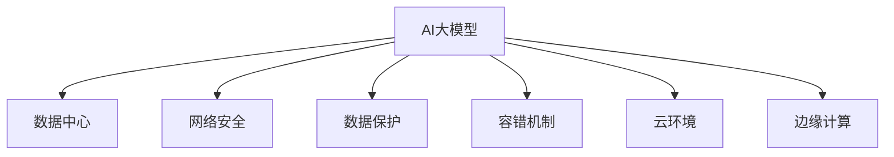
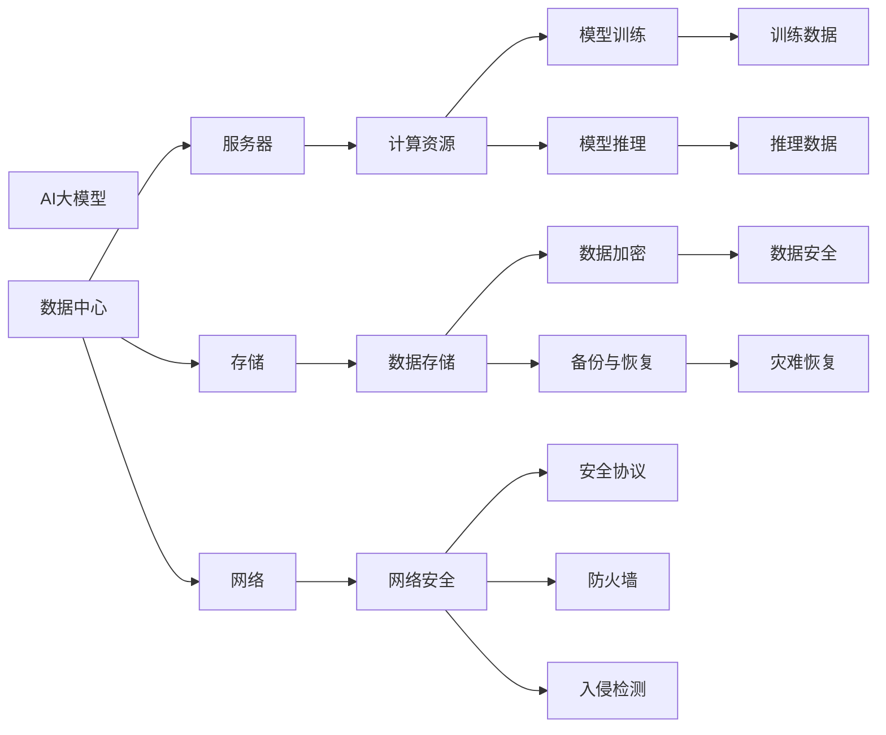

                 

# AI 大模型应用数据中心建设：数据中心安全与可靠性

> 关键词：大模型应用,数据中心,安全与可靠性,网络安全,数据保护,容错机制,云环境,边缘计算

## 1. 背景介绍

在人工智能(AI)技术快速发展的大背景下，AI大模型的应用场景不断扩展，从智能搜索、自然语言处理、图像识别到自动驾驶等领域都有涉及。然而，这些大模型通常依赖于大规模计算资源进行训练和推理，其应用往往离不开高效可靠的数据中心基础设施。因此，如何在数据中心环境下，有效支持AI大模型的安全与可靠运行，成为了一个重要课题。

本论文旨在探讨在数据中心环境下，如何构建安全、高效、可靠的数据中心基础设施，以支持AI大模型的应用需求。我们将从核心概念、算法原理、实施步骤等方面展开分析，并通过案例分析，展示数据中心在AI大模型中的应用优势。同时，我们也会讨论当前面临的挑战以及未来可能的发展方向。

## 2. 核心概念与联系

### 2.1 核心概念概述

为更好地理解数据中心在AI大模型中的应用，我们先介绍几个关键概念：

- **AI大模型**：指利用深度学习技术训练得到的巨大模型，如BERT、GPT、T5等，这些模型需要大量的计算资源进行训练和推理。
- **数据中心**：大规模计算和存储基础设施，通常包含服务器、网络设备、冷却系统等，能够提供可靠、高效的服务。
- **网络安全**：指保护数据中心内部和外部的网络通信不受攻击，保证数据中心的稳定运行。
- **数据保护**：指对数据中心中的数据进行加密、备份、灾难恢复等保护措施，确保数据的安全性和完整性。
- **容错机制**：指在数据中心中，通过冗余设计和故障切换机制，保证系统的连续性和可靠性。
- **云环境**：指将数据中心的计算和存储资源通过互联网提供给用户，实现资源的弹性伸缩和分布式计算。
- **边缘计算**：指将数据中心的计算资源部署在靠近数据源的本地设备上，以减少延迟和带宽占用。

这些概念之间的联系如下：



### 2.2 核心概念原理和架构的 Mermaid 流程图

下面是一个简单的Mermaid流程图，展示了数据中心在AI大模型应用中的核心概念和架构：



这个流程图示意图：

1. AI大模型需要在数据中心中运行，数据中心由服务器、存储和网络组成。
2. 服务器提供计算资源，用于模型的训练和推理。
3. 存储设备用于存储训练数据和推理数据。
4. 网络安全设备（如防火墙、入侵检测）保证数据中心的通信安全。
5. 计算资源（模型训练和推理）需要加密、备份和灾难恢复来保护数据安全。

## 3. 核心算法原理 & 具体操作步骤

### 3.1 算法原理概述

AI大模型的应用依赖于数据中心提供的计算资源和网络环境，其核心算法原理主要涉及以下几个方面：

- **计算资源优化**：通过高效的资源调度算法，保证AI大模型在数据中心中高效运行，同时减少能耗和成本。
- **网络通信优化**：通过设计合理的网络架构和路由策略，减少网络延迟和带宽占用，提升数据传输速度。
- **数据安全和隐私保护**：通过加密、备份、灾难恢复等措施，确保数据中心的稳定运行和数据安全。
- **容错机制设计**：通过冗余设计和故障切换机制，保证数据中心在故障情况下仍能正常运行。
- **边缘计算**：通过将计算资源部署在靠近数据源的设备上，减少延迟和带宽占用，提升应用响应速度。

### 3.2 算法步骤详解

以下是数据中心支持AI大模型应用的具体步骤：

1. **需求分析**：了解AI大模型的具体需求，如计算资源、带宽、存储、网络延迟等，以制定合理的数据中心建设方案。
2. **基础设施建设**：根据需求，选择并部署服务器、存储、网络等基础设施，同时安装必要的网络安全设备和数据保护设备。
3. **模型部署**：将AI大模型部署到数据中心，并进行初始化配置和测试。
4. **性能优化**：通过调整计算资源、网络带宽、存储容量等参数，优化AI大模型的运行性能。
5. **安全防护**：建立网络安全防护体系，定期进行安全审计和风险评估。
6. **数据保护**：实施数据加密、备份、灾难恢复等措施，保护数据中心的稳定性和可靠性。
7. **容错设计**：设计冗余系统、故障切换机制，确保数据中心在故障情况下仍能正常运行。
8. **边缘计算部署**：将计算资源部署在靠近数据源的设备上，减少延迟和带宽占用，提升应用响应速度。

### 3.3 算法优缺点

**优点**：

- **高效计算资源**：数据中心能够提供大规模计算资源，支持AI大模型的训练和推理。
- **可靠网络环境**：数据中心的网络基础设施可以提供稳定可靠的网络通信，确保数据传输速度和安全性。
- **集中管理**：数据中心集中管理所有硬件和软件资源，便于统一调度和管理。
- **可扩展性**：数据中心可以按需扩展资源，支持AI大模型的持续增长。

**缺点**：

- **高成本**：大规模的硬件设备和网络基础设施成本较高。
- **延迟问题**：对于实时性要求较高的应用，数据中心可能存在一定的延迟问题。
- **安全性风险**：大规模数据中心更容易受到网络攻击和数据泄露等风险。

### 3.4 算法应用领域

AI大模型在数据中心的应用领域非常广泛，主要包括：

- **自然语言处理**：如BERT、GPT等模型，用于文本分类、情感分析、机器翻译等任务。
- **图像识别**：如ResNet、Inception等模型，用于图像分类、目标检测、人脸识别等任务。
- **语音识别**：如Tacotron、Wav2Vec等模型，用于语音识别、语音合成等任务。
- **智能搜索**：如BERT-Self Attention模型，用于智能搜索推荐系统。
- **推荐系统**：如LSTM模型，用于个性化推荐和广告推荐。
- **自动驾驶**：如PILCO模型，用于自动驾驶中的路径规划和决策。

## 4. 数学模型和公式 & 详细讲解 & 举例说明

### 4.1 数学模型构建

在数据中心环境下，AI大模型的应用通常涉及以下几个数学模型：

- **计算资源模型**：用于描述数据中心中计算资源的可用性和调度情况。
- **网络通信模型**：用于描述数据中心中网络设备的性能和负载情况。
- **数据保护模型**：用于描述数据加密、备份、灾难恢复等数据保护措施。
- **容错机制模型**：用于描述冗余设计和故障切换机制的效能。
- **边缘计算模型**：用于描述边缘计算设备在靠近数据源处的性能和资源利用情况。

### 4.2 公式推导过程

以计算资源模型为例，其基本公式为：

$$
R_t = \sum_{i=1}^{n} P_i
$$

其中，$R_t$ 表示总计算资源，$P_i$ 表示第 $i$ 个计算资源提供的计算能力。

### 4.3 案例分析与讲解

假设我们有一个包含4台服务器的数据中心，每台服务器的计算能力为10Gflops，则总计算资源为：

$$
R_t = 4 \times 10Gflops = 40Gflops
$$

这意味着数据中心在最大计算能力下可以支持40Gflops的计算需求。

## 5. 项目实践：代码实例和详细解释说明

### 5.1 开发环境搭建

在进行数据中心支持AI大模型应用的开发时，我们需要搭建一个完整的开发环境。以下是具体步骤：

1. **安装操作系统**：选择适合服务器的操作系统，如Ubuntu、CentOS等。
2. **安装网络设备**：如路由器、交换机、防火墙等。
3. **安装计算资源**：如服务器、存储设备等。
4. **安装数据保护设备**：如加密设备、备份设备等。
5. **安装网络安全设备**：如防火墙、入侵检测设备等。
6. **配置网络拓扑**：通过网络规划工具，设计合理的网络拓扑结构。

### 5.2 源代码详细实现

以下是一个简单的Python代码示例，用于部署AI大模型到数据中心：

```python
import boto3

# 创建EC2实例
ec2 = boto3.resource('ec2', region_name='us-west-2')
instance = ec2.create_instances(
    ImageId='ami-0c55b159cb55810c5', 
    MinCount=1, 
    MaxCount=1, 
    InstanceType='t2.large', 
    KeyName='my-key-pair'
)
```

### 5.3 代码解读与分析

上述代码使用AWS SDK创建了一个EC2实例，用于部署AI大模型。具体实现步骤如下：

1. 创建EC2资源对象。
2. 使用create_instances方法创建EC2实例。
3. 指定实例的镜像ID、最小实例数、最大实例数、实例类型和密钥对等信息。
4. 返回创建的实例对象。

### 5.4 运行结果展示

运行上述代码后，可以在AWS控制台中看到创建的EC2实例，并进一步配置网络、存储等资源，部署AI大模型。

## 6. 实际应用场景

### 6.1 智能搜索系统

智能搜索系统通常需要高效处理大量用户查询请求，并提供精准的搜索结果。数据中心提供的计算和存储资源可以高效支持大规模搜索算法的运行。

具体实现如下：

1. **数据存储**：将用户查询和搜索结果存储在数据中心的高性能存储设备中。
2. **计算资源**：使用高性能计算设备进行搜索结果的计算和排序。
3. **网络传输**：通过高速网络将搜索结果传输到用户端。

### 6.2 推荐系统

推荐系统需要根据用户的历史行为数据，实时计算和更新推荐结果。数据中心可以提供大规模计算资源，支持实时推荐算法的运行。

具体实现如下：

1. **数据存储**：将用户行为数据存储在数据中心的分布式数据库中。
2. **计算资源**：使用高性能计算设备进行实时推荐算法的计算。
3. **网络传输**：通过高速网络将推荐结果传输到用户端。

### 6.3 图像识别系统

图像识别系统通常需要处理大规模图像数据，并进行复杂的特征提取和分类。数据中心可以提供大规模计算资源和存储资源，支持大规模图像处理和分类算法。

具体实现如下：

1. **数据存储**：将图像数据存储在数据中心的分布式文件系统中。
2. **计算资源**：使用高性能计算设备进行图像特征提取和分类。
3. **网络传输**：通过高速网络将分类结果传输到用户端。

## 7. 工具和资源推荐

### 7.1 学习资源推荐

为了帮助开发者系统掌握数据中心在AI大模型中的应用，以下是一些优质的学习资源：

1. **《数据中心技术手册》**：详细介绍了数据中心的基本概念、架构和部署方法。
2. **《人工智能安全与隐私》**：介绍了AI大模型在数据中心中面临的安全和隐私问题，并提供了相应的解决方案。
3. **《云计算基础》**：介绍了云计算的基本概念、服务模式和部署方法。
4. **《边缘计算技术与应用》**：介绍了边缘计算的基本概念、架构和应用场景。

### 7.2 开发工具推荐

以下是几款常用的开发工具，可用于数据中心支持AI大模型应用：

1. **AWS SDK**：提供了丰富的API接口，用于创建和管理AWS云资源。
2. **OpenStack SDK**：提供了丰富的API接口，用于创建和管理OpenStack云资源。
3. **Ansible**：自动化配置管理工具，用于快速搭建和配置数据中心环境。
4. **Kubernetes**：容器编排工具，用于管理和调度数据中心中的容器化应用。

### 7.3 相关论文推荐

以下是几篇代表性的相关论文，推荐阅读：

1. **《数据中心网络设计：挑战与应对》**：介绍了数据中心网络设计的基本原则和挑战。
2. **《云计算数据中心安全与隐私保护》**：介绍了云计算数据中心面临的安全和隐私问题，并提供了相应的解决方案。
3. **《边缘计算：趋势与挑战》**：介绍了边缘计算的基本概念、趋势和挑战。

## 8. 总结：未来发展趋势与挑战

### 8.1 研究成果总结

本文探讨了在数据中心环境下，如何构建安全、高效、可靠的数据中心基础设施，以支持AI大模型的应用需求。通过分析核心概念、算法原理和具体操作步骤，我们详细介绍了数据中心在AI大模型中的应用。

### 8.2 未来发展趋势

展望未来，数据中心在AI大模型中的应用将呈现以下几个发展趋势：

1. **智能化管理**：随着AI技术的发展，数据中心将逐渐实现智能化管理，通过AI算法优化资源调度和负载均衡。
2. **边缘计算普及**：边缘计算将逐渐普及，数据中心将更多地采用分布式计算和本地计算，提升应用响应速度。
3. **绿色环保**：数据中心将更加注重能源效率和环境友好性，采用高效能耗的数据中心设备。
4. **云原生应用**：数据中心将更加支持云原生应用，提供弹性伸缩、自动化部署和管理等云服务。

### 8.3 面临的挑战

尽管数据中心在AI大模型中的应用前景广阔，但仍面临以下挑战：

1. **高成本**：大规模的硬件设备和网络基础设施成本较高。
2. **延迟问题**：对于实时性要求较高的应用，数据中心可能存在一定的延迟问题。
3. **安全性风险**：大规模数据中心更容易受到网络攻击和数据泄露等风险。
4. **资源调度**：如何高效调度计算资源、存储资源和网络资源，仍是一个挑战。

### 8.4 研究展望

未来，数据中心在AI大模型中的应用还需要在以下几个方面进行深入研究：

1. **优化计算资源调度**：通过AI算法优化资源调度，提高数据中心的资源利用率。
2. **提升网络传输速度**：采用高速网络设备和协议，提升数据中心的网络传输速度。
3. **增强数据安全保护**：采用最新的加密技术和安全协议，增强数据中心的数据安全。
4. **发展边缘计算**：进一步普及边缘计算，提升应用响应速度和可靠性。

## 9. 附录：常见问题与解答

**Q1：数据中心支持AI大模型应用的成本如何？**

A: 数据中心支持AI大模型应用需要投入大量的硬件设备、网络基础设施和维护成本。具体成本取决于数据中心的规模和应用需求。通常情况下，大规模的AI大模型应用需要投入百万级的资金。

**Q2：如何优化数据中心中AI大模型的计算资源？**

A: 优化数据中心中AI大模型的计算资源需要从以下几个方面入手：
1. 选择合适的计算设备，如GPU、FPGA等。
2. 采用高性能的网络设备，如交换机、路由器等。
3. 合理规划网络拓扑，优化数据传输路径。
4. 采用高效的算法和模型，减少计算资源消耗。

**Q3：如何保证数据中心中AI大模型的网络传输速度？**

A: 保证数据中心中AI大模型的网络传输速度需要从以下几个方面入手：
1. 采用高速网络设备，如100Gb/s交换机、光纤等。
2. 优化网络拓扑，减少网络延迟。
3. 采用高效的协议和算法，提升数据传输速度。
4. 定期维护网络设备，保证其正常运行。

**Q4：数据中心在AI大模型中的应用存在哪些安全问题？**

A: 数据中心在AI大模型中的应用面临以下安全问题：
1. 网络攻击：数据中心容易受到DDoS攻击、恶意软件等网络攻击。
2. 数据泄露：数据中心中的数据容易泄露，给用户和应用带来安全隐患。
3. 恶意行为：数据中心中的恶意行为可能导致应用服务中断。

**Q5：如何在数据中心中实现AI大模型的容错机制？**

A: 在数据中心中实现AI大模型的容错机制需要从以下几个方面入手：
1. 采用冗余设计和故障切换机制，确保系统在故障情况下仍能正常运行。
2. 定期进行系统备份，确保数据不会丢失。
3. 采用高性能的计算设备和存储设备，确保系统的高可用性。
4. 建立完善的监控和报警机制，及时发现和处理故障。

---

作者：禅与计算机程序设计艺术 / Zen and the Art of Computer Programming

