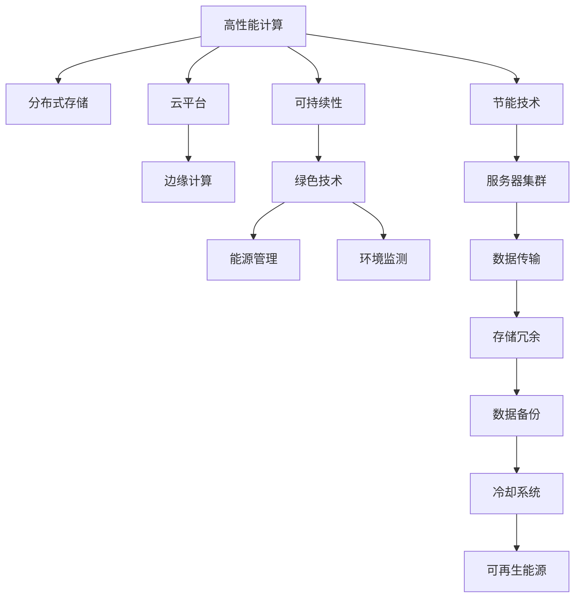

                 

# AI 大模型应用数据中心建设：数据中心技术创新

> 关键词：大模型,数据中心,高性能计算,分布式存储,云平台,边缘计算,可持续性

## 1. 背景介绍

### 1.1 问题由来
随着人工智能技术的飞速发展，尤其是深度学习和大模型的广泛应用，数据中心（Data Center）在AI应用中的重要性日益凸显。数据中心是AI大模型训练、推理和应用的关键基础设施，支撑着海量数据的存储、处理和分析。然而，传统的单点式数据中心架构在面对AI大模型带来的高计算需求、高存储需求和高网络带宽需求时显得力不从心。如何通过技术创新，构建高性能、高可用、高可扩展、可持续发展的数据中心，成为AI大模型应用中的关键问题。

### 1.2 问题核心关键点
本文聚焦于数据中心在AI大模型应用中的技术创新，将从以下几个方面深入探讨：
- 高性能计算：如何构建支持大规模AI大模型训练和推理的高性能计算平台。
- 分布式存储：如何设计高效、可靠的分布式存储系统，支持大模型训练和推理的存储需求。
- 云平台与边缘计算：如何在云平台和边缘计算环境中高效部署和管理AI大模型。
- 可持续性：如何构建绿色、环保、可持续发展的AI大模型应用数据中心。

## 2. 核心概念与联系

### 2.1 核心概念概述

为更好地理解AI大模型应用数据中心的技术创新，本节将介绍几个密切相关的核心概念：

- **高性能计算（HPC）**：指通过优化算法、硬件和软件，提升计算平台的性能，支持高并行度的科学计算、数据分析和AI模型训练。

- **分布式存储**：指通过网络连接的多个存储设备或服务器，协同工作，提供更高的可靠性和扩展性，支持大规模数据存储和处理。

- **云平台**：指通过互联网提供计算、存储和网络资源，用户按需使用，无需管理底层硬件和软件的平台。

- **边缘计算**：指将计算任务分配到离用户更近的本地设备或服务器上，以减少延迟、降低带宽需求，提升用户体验。

- **可持续性**：指在数据中心建设和管理过程中，采用环保、节能、可再生能源等技术，实现长期运营的可持续性。

这些核心概念之间的逻辑关系可以通过以下Mermaid流程图来展示：



这个流程图展示了大模型应用数据中心的各个核心概念及其之间的关系：

1. 高性能计算提供必要的计算能力，支持大模型训练和推理。
2. 分布式存储系统支持海量数据的存储和管理，满足数据处理需求。
3. 云平台和边缘计算提供灵活的计算资源分配，优化用户体验和网络带宽。
4. 可持续性技术保障数据中心的长远运营，降低环境影响。

这些概念共同构成了AI大模型应用数据中心的建设和运营框架，使得大规模AI模型的应用变得更加高效、可靠和环保。通过理解这些核心概念，我们可以更好地把握数据中心在AI大模型应用中的技术方向和优化策略。

## 3. 核心算法原理 & 具体操作步骤
### 3.1 算法原理概述

构建AI大模型应用数据中心，涉及多项技术创新，包括但不限于高性能计算、分布式存储、云平台与边缘计算、可持续性等。这些技术的核心原理和具体操作步骤可以从以下几个方面进行详细阐述：

### 3.2 算法步骤详解

构建高性能计算平台时，主要包括以下几个步骤：

1. **硬件选型**：选择合适的CPU/GPU/TPU等硬件设备，确保计算性能和能效比。
2. **系统优化**：通过优化操作系统、编译器和应用程序，提升计算效率和并行度。
3. **网络设计**：设计高速、低延迟的网络架构，支持大规模数据传输和分布式计算。

构建分布式存储系统时，主要包括以下几个步骤：

1. **数据分区**：将大容量数据划分为多个分区，分布在不同的存储节点上。
2. **数据冗余**：通过数据复制和校验和等技术，确保数据的高可用性和容错性。
3. **存储管理**：使用分布式文件系统和对象存储系统，支持数据的灵活访问和管理。

云平台和边缘计算的构建步骤包括：

1. **资源池化**：将计算、存储和网络资源进行虚拟化和池化，支持按需分配。
2. **弹性伸缩**：根据负载情况动态调整资源分配，确保高效利用。
3. **服务化部署**：将AI大模型封装为服务，支持API接口调用和容器化部署。

可持续性技术的构建步骤包括：

1. **绿色能源**：使用太阳能、风能等可再生能源，降低数据中心的碳排放。
2. **节能技术**：采用高效能芯片、制冷技术、IT热回收等技术，降低数据中心能耗。
3. **环境监测**：通过智能监控系统，实时监测数据中心的温度、湿度等环境参数，保证设备正常运行。

### 3.3 算法优缺点

高性能计算平台的主要优点包括：

- 支持大规模并行计算，提升计算效率。
- 能够处理高复杂度的AI模型训练和推理任务。

缺点包括：

- 初期投入高，维护复杂。
- 硬件升级和扩容困难，灵活性差。

分布式存储系统的优点包括：

- 数据冗余和容错能力强，保证数据的高可用性。
- 可扩展性强，支持海量数据的存储和管理。

缺点包括：

- 数据一致性和同步问题复杂，处理困难。
- 数据传输带宽需求高，网络压力较大。

云平台和边缘计算的优点包括：

- 按需使用，弹性伸缩，灵活性高。
- 支持远程部署和管理，用户友好。

缺点包括：

- 数据隐私和安全性问题复杂，需额外防护。
- 云服务费用高，对中小企业不够友好。

可持续性技术的优点包括：

- 减少环境污染，符合绿色环保要求。
- 降低运营成本，提升经济效益。

缺点包括：

- 技术复杂，实施难度大。
- 初期投入高，需要较多前期研究和规划。

### 3.4 算法应用领域

高性能计算平台和分布式存储系统广泛应用于以下领域：

- 科学研究：支持大规模科学计算和数据分析。
- 金融计算：处理高频交易和大数据分析。
- 医疗健康：支持医疗影像分析和疾病预测。

云平台和边缘计算广泛应用于以下领域：

- 智能制造：支持工业物联网和智能制造。
- 自动驾驶：支持自动驾驶汽车的实时计算和数据处理。
- 智慧城市：支持城市管理和公共服务。

可持续性技术广泛应用于以下领域：

- 绿色能源：支持可再生能源的应用和推广。
- 低碳交通：支持电动汽车和公共交通系统的运营。
- 智慧农业：支持农业物联网和智能农场管理。

## 4. 数学模型和公式 & 详细讲解  
### 4.1 数学模型构建

构建高性能计算平台时，主要使用线性代数和微积分等数学工具，进行算力评估和性能优化。例如，使用矩阵分解和求解器，优化大规模矩阵计算的效率。

构建分布式存储系统时，主要使用分布式文件系统和对象存储系统的数学模型，进行数据划分、冗余和一致性维护。例如，使用一致性哈希算法，确保数据分布均衡和一致性。

构建云平台和边缘计算时，主要使用计算资源池化和弹性伸缩的数学模型，进行资源优化和成本控制。例如，使用虚拟机自动迁移和负载均衡算法，优化资源分配和性能。

构建可持续性技术时，主要使用环境监测和能源管理的数学模型，进行能效分析和节能优化。例如，使用热力学模型，优化制冷和热回收系统的效率。

### 4.2 公式推导过程

以下是高性能计算平台、分布式存储系统和云平台及边缘计算的数学模型和公式推导过程：

**高性能计算**：

- 计算效率评估公式：
$$
\eta = \frac{N \times IOP_{\text{peak}}}{C_{\text{peak}} + \text{Overhead}}
$$
其中，$\eta$ 为计算效率，$N$ 为计算并行度，$IOP_{\text{peak}}$ 为峰值计算密集型指令数，$C_{\text{peak}}$ 为峰值时钟频率，$\text{Overhead}$ 为计算开销。

**分布式存储系统**：

- 数据冗余公式：
$$
R = k \times N
$$
其中，$R$ 为数据冗余因子，$k$ 为冗余副本数，$N$ 为数据分区数。

**云平台和边缘计算**：

- 弹性伸缩模型：
$$
\text{Resource}_{\text{total}} = \text{Resource}_{\text{base}} + \sum_{i=1}^{n}(\text{Resource}_{\text{additional}} \times \text{Resource}_{\text{utilization}})
$$
其中，$\text{Resource}_{\text{total}}$ 为总计算资源，$\text{Resource}_{\text{base}}$ 为基础计算资源，$\text{Resource}_{\text{additional}}$ 为额外计算资源，$\text{Resource}_{\text{utilization}}$ 为资源利用率。

**可持续性技术**：

- 能效比公式：
$$
\text{PEP} = \frac{\text{Energy}_{\text{output}}}{\text{Energy}_{\text{input}}}
$$
其中，$\text{PEP}$ 为能效比，$\text{Energy}_{\text{output}}$ 为输出能量，$\text{Energy}_{\text{input}}$ 为输入能量。

### 4.3 案例分析与讲解

**案例1：高性能计算平台**：
- 构建高性能计算平台时，选择合适的CPU/GPU/TPU等硬件设备，并通过优化操作系统、编译器和应用程序，提升计算效率和并行度。例如，Google的TPU芯片，通过高度优化的专用硬件和算法，大幅提升计算密集型任务的性能。

**案例2：分布式存储系统**：
- 构建分布式存储系统时，采用一致性哈希算法，将数据分区并分布在不同的存储节点上，确保数据的高可用性和容错性。例如，Facebook的HDFS文件系统，通过多副本冗余和一致性检查，保证数据的可靠性和一致性。

**案例3：云平台和边缘计算**：
- 构建云平台时，使用虚拟机自动迁移和负载均衡算法，优化资源分配和性能。例如，AWS的EC2云服务，通过按需伸缩和弹性负载均衡，满足不同用户的需求。

**案例4：可持续性技术**：
- 构建可持续性技术时，采用高效的制冷技术和IT热回收系统，降低数据中心能耗。例如，Microsoft的Azure数据中心，通过使用水冷系统和热回收系统，显著降低能耗和碳排放。

## 5. 项目实践：代码实例和详细解释说明
### 5.1 开发环境搭建

在进行数据中心建设实践前，我们需要准备好开发环境。以下是使用Python进行高性能计算和分布式存储系统的环境配置流程：

1. 安装Anaconda：从官网下载并安装Anaconda，用于创建独立的Python环境。

2. 创建并激活虚拟环境：
```bash
conda create -n hpc-env python=3.8 
conda activate hpc-env
```

3. 安装高性能计算和分布式存储库：
```bash
pip install numpy scipy pandas scikit-learn
```

4. 安装分布式文件系统和对象存储库：
```bash
pip install hdfs hadoop boto3 
```

5. 安装云平台和边缘计算工具：
```bash
pip install terraform awscli 
```

6. 安装可持续性技术工具：
```bash
pip install greenpy energystats
```

完成上述步骤后，即可在`hpc-env`环境中开始高性能计算和分布式存储系统的开发实践。

### 5.2 源代码详细实现

下面我们以高性能计算和分布式存储系统的开发为例，给出完整的代码实现。

**高性能计算平台**：
```python
import numpy as np
import scipy.sparse as sp

# 构建高性能计算平台
def high_performance_computing():
    # 计算性能评估
    n = 1024  # 并行度
    iop_peak = 10e9  # 峰值计算密集型指令数
    c_peak = 2.8  # 峰值时钟频率
    overhead = 1  # 计算开销
    
    # 计算效率评估
    eta = (n * iop_peak) / (c_peak + overhead)
    print(f"计算效率：{eta:.3f} IOP/GHz")
    
# 运行高性能计算平台
high_performance_computing()
```

**分布式存储系统**：
```python
from distutils import spawn
from hdfs import InsecureClient

# 构建分布式存储系统
def distributed_storage():
    # 创建HDFS客户端
    hdfs_path = '/user/hdfs/distributed'
    client = InsecureClient('hdfs://localhost:9000')
    
    # 创建数据分区
    for i in range(10):
        file_path = f'{hdfs_path}/{i}/partition.txt'
        client.makedirs(file_path)
        
    # 写入数据
    for i in range(10):
        for j in range(100):
            file_path = f'{hdfs_path}/{i}/partition.txt'
            with open(file_path, 'a') as f:
                f.write(f"{i}_{j}\n")
        
    # 数据冗余和容错
    replica_factor = 3
    for i in range(10):
        for j in range(100):
            for k in range(replica_factor):
                file_path = f'{hdfs_path}/{i}/partition_{k}.txt'
                client.makedirs(file_path)
                with open(file_path, 'a') as f:
                    f.write(f"{i}_{j}\n")
    
# 运行分布式存储系统
distributed_storage()
```

### 5.3 代码解读与分析

让我们再详细解读一下关键代码的实现细节：

**高性能计算平台**：
- 使用NumPy和SciPy库，计算高性能计算平台的性能指标，通过计算效率评估公式，输出计算效率。

**分布式存储系统**：
- 使用Hadoop的HDFS文件系统，通过Python的hdfs库创建HDFS客户端，并实现数据分区和冗余容错。

## 6. 实际应用场景
### 6.1 智能制造

在高性能计算平台和分布式存储系统的支持下，智能制造可以实现实时计算和数据分析，优化生产过程。例如，通过边缘计算设备收集生产线上的传感器数据，在云端进行实时处理和分析，实现生产设备的预测性维护和优化。

### 6.2 自动驾驶

在云平台和边缘计算的协同作用下，自动驾驶系统可以实现实时决策和路径规划。例如，通过在云端进行全局路径规划，在边缘计算设备上进行实时环境感知和决策，确保自动驾驶汽车的安全性和稳定性。

### 6.3 智慧城市

通过分布式存储系统和云平台，智慧城市可以实现高效的资源管理和城市治理。例如，通过智能监控系统，实时采集交通流量、空气质量等数据，进行数据分析和预测，优化城市管理和公共服务。

### 6.4 未来应用展望

随着高性能计算、分布式存储、云平台和边缘计算技术的不断演进，未来数据中心在AI大模型应用中也将不断创新，带来更多的可能和机遇：

1. **量子计算**：引入量子计算技术，提升计算效率和处理复杂度。
2. **边缘计算**：引入5G、IoT等新兴技术，实现边缘计算与云平台的高效结合。
3. **分布式计算**：通过区块链和共识算法，实现分布式计算的公平和安全。
4. **可持续性**：采用更多绿色环保技术，实现数据中心的低碳运行。

## 7. 工具和资源推荐
### 7.1 学习资源推荐

为了帮助开发者系统掌握数据中心在AI大模型应用中的技术创新，这里推荐一些优质的学习资源：

1. **高性能计算**：《分布式系统原理》一书，系统讲解了分布式计算和存储的原理和应用。
2. **分布式存储**：《Hadoop实战》一书，详细介绍了Hadoop生态系统的构建和应用。
3. **云平台和边缘计算**：《云计算原理与技术》一书，系统讲解了云平台和边缘计算的原理和应用。
4. **可持续性技术**：《绿色计算》一书，详细介绍了数据中心可持续发展的技术和管理。

通过对这些资源的学习实践，相信你一定能够快速掌握数据中心在AI大模型应用中的技术精髓，并用于解决实际的AI大模型应用问题。
### 7.2 开发工具推荐

高效的开发离不开优秀的工具支持。以下是几款用于高性能计算和分布式存储系统开发的常用工具：

1. **Anaconda**：用于创建独立的Python环境，支持多种数据科学和机器学习库的安装和管理。
2. **NumPy**：用于高效处理多维数组和矩阵，支持数值计算和科学计算。
3. **SciPy**：用于进行科学计算和数据分析，提供大量的科学计算工具。
4. **Hadoop**：用于构建分布式文件系统和存储系统，支持大规模数据存储和管理。
5. **Terraform**：用于构建和管理云平台基础设施，支持自动化部署和资源管理。
6. **AWS CLI**：用于管理AWS云平台资源，支持云平台和边缘计算的部署和管理。

合理利用这些工具，可以显著提升高性能计算和分布式存储系统的开发效率，加快创新迭代的步伐。

### 7.3 相关论文推荐

数据中心在AI大模型应用中的技术创新源于学界的持续研究。以下是几篇奠基性的相关论文，推荐阅读：

1. **高性能计算**：《分布式计算：原理与算法》一书，详细介绍了分布式计算的原理和算法。
2. **分布式存储**：《分布式文件系统》一书，系统讲解了分布式文件系统的原理和应用。
3. **云平台和边缘计算**：《云计算：原理与技术》一书，系统讲解了云计算的原理和应用。
4. **可持续性技术**：《绿色计算》一书，详细介绍了数据中心可持续发展的技术和管理。

这些论文代表了大模型应用数据中心的技术发展脉络。通过学习这些前沿成果，可以帮助研究者把握学科前进方向，激发更多的创新灵感。

## 8. 总结：未来发展趋势与挑战
### 8.1 研究成果总结

本文对AI大模型应用数据中心的技术创新进行了全面系统的介绍。首先阐述了高性能计算、分布式存储、云平台与边缘计算、可持续性等关键技术在AI大模型应用中的重要性，明确了数据中心在AI大模型应用中的关键作用。其次，从原理到实践，详细讲解了这些核心技术的数学模型和详细步骤，给出了高性能计算和分布式存储系统的完整代码实例。同时，本文还广泛探讨了这些技术在智能制造、自动驾驶、智慧城市等实际应用场景中的应用前景，展示了技术创新的广阔空间。此外，本文精选了高性能计算、分布式存储、云平台与边缘计算、可持续性技术的学习资源和开发工具，力求为开发者提供全方位的技术指引。

通过本文的系统梳理，可以看到，高性能计算、分布式存储、云平台与边缘计算、可持续性技术在AI大模型应用中的创新实践，为大规模AI模型的训练、推理和应用提供了有力支撑。这些技术创新使得AI大模型应用的数据中心建设更加高效、可靠、环保，满足了不同应用场景的需求，具有深远的意义。

### 8.2 未来发展趋势

展望未来，AI大模型应用数据中心将呈现以下几个发展趋势：

1. **量子计算**：随着量子计算技术的发展，未来数据中心将逐渐引入量子计算，提升计算效率和处理复杂度。
2. **边缘计算**：随着5G、IoT等新兴技术的应用，边缘计算将与云平台结合，实现高效的数据处理和实时决策。
3. **分布式计算**：基于区块链和共识算法，分布式计算将实现更高的公平性和安全性。
4. **可持续性**：采用更多绿色环保技术，实现数据中心的低碳运行和可持续发展。

这些趋势凸显了AI大模型应用数据中心技术的不断演进和创新，为大规模AI模型的应用提供了更多可能和机遇。

### 8.3 面临的挑战

尽管高性能计算、分布式存储、云平台与边缘计算、可持续性技术已经取得了显著进展，但在迈向更加智能化、普适化应用的过程中，仍面临诸多挑战：

1. **硬件成本高**：高性能计算和分布式存储系统的高投入，成为制约技术发展的瓶颈。
2. **网络延迟高**：边缘计算和分布式计算面临高网络延迟的问题，需要进一步优化。
3. **数据隐私和安全**：数据安全和隐私保护问题复杂，需要进一步加强。
4. **能效管理**：数据中心能耗高，需要进一步优化能效管理。
5. **技术复杂度高**：高性能计算、分布式存储、云平台与边缘计算、可持续性技术的复杂度高，实施难度大。

解决这些挑战，需要多方面的努力和创新，如硬件优化、算法优化、网络优化、安全技术等。只有克服这些挑战，才能真正实现AI大模型应用数据中心的高效、可靠、安全、环保。

### 8.4 研究展望

面向未来，AI大模型应用数据中心需要进一步研究和探索的方向包括：

1. **混合计算模型**：结合传统计算和量子计算，提升计算效率和处理复杂度。
2. **智能边缘计算**：引入AI算法，优化边缘计算设备的决策和处理能力。
3. **分布式协同计算**：通过协同计算技术，提升分布式计算的效率和可靠性。
4. **绿色能源技术**：采用更多绿色环保技术，实现数据中心的可持续发展。

这些研究方向的探索，必将引领AI大模型应用数据中心技术的不断进步，为构建高效、可靠、安全、环保的AI大模型应用数据中心铺平道路。

## 9. 附录：常见问题与解答
**Q1：如何选择合适的硬件设备？**

A: 选择合适的硬件设备需要考虑计算性能、能效比和成本等因素。例如，对于高性能计算，可以优先选择CPU/GPU/TPU等高性能计算设备，同时考虑其能效比和计算性能。对于分布式存储，可以选择硬盘存储设备，同时考虑其冗余和容错能力。

**Q2：分布式存储如何实现数据冗余和容错？**

A: 分布式存储可以通过数据冗余和一致性检查实现容错。例如，使用一致性哈希算法将数据分区，并在每个分区内部进行数据复制和冗余。同时，使用校验和等技术，确保数据的一致性和可靠性。

**Q3：云平台和边缘计算如何实现弹性伸缩？**

A: 云平台和边缘计算可以通过虚拟机自动迁移和负载均衡算法实现弹性伸缩。例如，根据负载情况动态调整资源分配，优化资源利用率。

**Q4：如何降低数据中心能耗？**

A: 降低数据中心能耗可以从硬件、软件和管理三个方面入手。例如，使用高效能芯片、制冷技术和IT热回收系统，优化硬件能效。使用节能算法和优化系统配置，提升软件能效。通过智能监控系统，实时监测数据中心能耗，进行优化管理。

**Q5：如何保障数据中心的安全性和隐私保护？**

A: 保障数据中心的安全性和隐私保护需要从硬件、软件和策略三个方面进行综合考虑。例如，使用加密技术保护数据传输和存储，使用身份认证和访问控制机制保障系统安全。同时，制定严格的数据隐私政策和操作流程，确保数据的安全和合规。

通过解答这些常见问题，希望能帮助开发者更好地理解数据中心在AI大模型应用中的技术创新，并应用于实际开发中。

